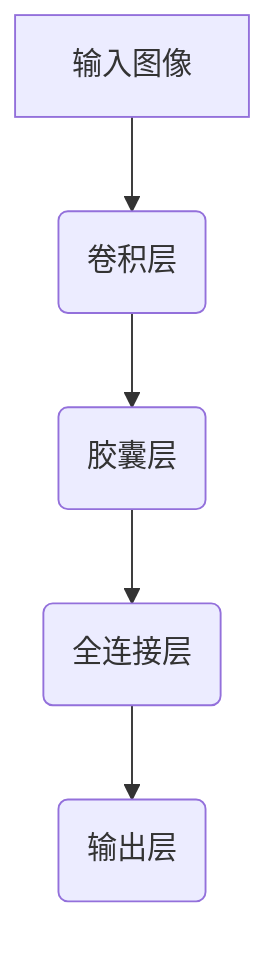

                 

关键词：胶囊网络，神经网络，深度学习，图像识别，计算机视觉

摘要：本文将详细介绍胶囊网络（Capsule Network）的基本原理、核心算法、数学模型以及代码实现。通过本篇文章，读者将全面了解胶囊网络在计算机视觉领域的应用，并掌握其实际操作方法。

## 1. 背景介绍

随着深度学习技术的发展，神经网络在图像识别、语音识别、自然语言处理等领域的应用取得了显著成果。然而，传统的卷积神经网络（CNN）在处理复杂图像任务时，存在一些局限性。例如，CNN难以捕捉图像中的部分与部分之间的依赖关系，以及位置不变性等特性。为了解决这些问题，研究人员提出了胶囊网络（Capsule Network）。

胶囊网络是由 Geoffrey Hinton 等人于 2017 年提出的一种新型神经网络架构。相较于 CNN，胶囊网络能够更好地捕捉图像中的部分与部分之间的依赖关系，从而在图像识别任务中表现出更高的准确率。本文将围绕胶囊网络的基本原理、核心算法、数学模型以及代码实现进行详细讲解。

## 2. 核心概念与联系

### 2.1 胶囊网络的基本概念

胶囊网络由胶囊层（Capsule Layer）和卷积层（Convolution Layer）组成。胶囊层是一种全新的神经网络层，用于捕捉图像中的部分与部分之间的依赖关系。胶囊层中的每个胶囊（Capsule）都表示图像中的一个部分，并具有一定的方向和长度。胶囊层通过动态路由算法（Dynamic Routing Algorithm）将输入图像中的部分信息传递到上一层。

### 2.2 胶囊网络与卷积神经网络的关系

胶囊网络是在卷积神经网络的基础上发展而来。卷积层用于提取图像中的局部特征，而胶囊层则用于捕捉特征之间的关系。胶囊网络通过整合卷积层和胶囊层，使得模型在处理复杂图像任务时具备更强的表示能力和灵活性。

### 2.3 胶囊网络的 Mermaid 流程图

## 3. 核心算法原理 & 具体操作步骤

### 3.1 算法原理概述

胶囊网络的核心算法包括胶囊层和动态路由算法。胶囊层通过学习图像中的部分特征，并将这些特征编码为具有方向和长度的向量。动态路由算法则用于在胶囊层之间传递信息，从而实现特征之间的依赖关系建模。

### 3.2 算法步骤详解

1. 输入图像：将图像输入到卷积层，提取图像中的局部特征。
2. 卷积层：通过卷积操作，将输入图像转换为特征图。
3. 胶囊层：将特征图输入到胶囊层，每个胶囊表示图像中的一个部分。胶囊层通过动态路由算法，将特征信息传递到上一层。
4. 全连接层：将胶囊层输出的向量输入到全连接层，实现分类或回归任务。
5. 输出层：输出最终结果，如分类概率或回归值。

### 3.3 算法优缺点

**优点：**
- 胶囊网络能够更好地捕捉图像中的部分与部分之间的依赖关系。
- 胶囊网络在处理复杂图像任务时，具有更高的准确率和鲁棒性。

**缺点：**
- 胶囊网络的计算复杂度较高，训练速度相对较慢。
- 胶囊网络的实现较为复杂，对开发者的要求较高。

### 3.4 算法应用领域

胶囊网络在计算机视觉领域具有广泛的应用，如图像分类、目标检测、图像分割等。以下是一些具体的案例：

- 图像分类：胶囊网络能够提高图像分类任务的准确率，特别是在处理复杂图像时。
- 目标检测：胶囊网络可以更好地捕捉图像中的目标位置和形状，从而提高目标检测的准确率。
- 图像分割：胶囊网络能够实现像素级的图像分割，提高图像分割的精度。

## 4. 数学模型和公式 & 详细讲解 & 举例说明

### 4.1 数学模型构建

胶囊网络中的数学模型主要包括胶囊层和动态路由算法。以下是一个简化的数学模型：

- 胶囊层：每个胶囊表示一个特征图，用向量表示。胶囊层通过动态路由算法，将输入特征图编码为胶囊向量。
- 动态路由算法：胶囊层之间的信息传递通过动态路由算法实现。动态路由算法能够根据胶囊层之间的相关性，调整胶囊向量的权重。

### 4.2 公式推导过程

假设输入图像为 $X \in \mathbb{R}^{m \times n}$，其中 $m$ 表示图像的高度，$n$ 表示图像的宽度。卷积层输出特征图为 $F \in \mathbb{R}^{c \times h \times w}$，其中 $c$ 表示卷积核的数量，$h$ 表示特征图的高度，$w$ 表示特征图的宽度。

- 胶囊层：每个胶囊 $c_i$ 表示一个特征图，用向量表示。胶囊向量 $v_i \in \mathbb{R}^{d}$，其中 $d$ 表示胶囊的维度。
$$
v_i = \text{activ}(W_i f_j)
$$
其中，$W_i$ 表示胶囊层权重，$f_j$ 表示卷积层输出的特征图。

- 动态路由算法：动态路由算法用于调整胶囊层之间的权重。假设输入胶囊层为 $V \in \mathbb{R}^{c \times d}$，输出胶囊层为 $U \in \

