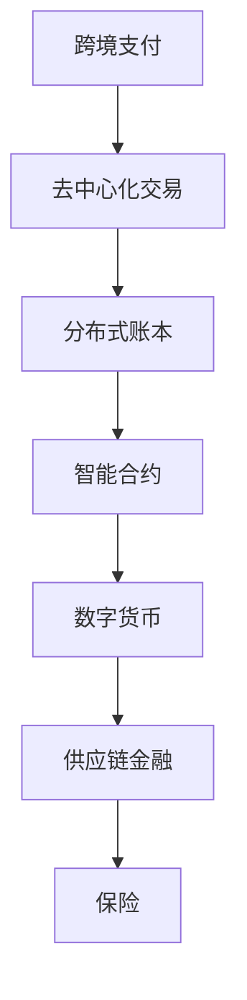

                 

关键词：腾讯、区块链、金融应用、面试题、解答、专家

摘要：本文针对腾讯2025区块链金融应用专家社招面试题，深入解析了区块链技术、金融应用场景、核心算法原理及其在金融领域的实际应用。通过对面试题的详细解答，为有意进入区块链金融领域的专业人士提供宝贵参考。

## 1. 背景介绍

随着区块链技术的快速发展，金融行业对其应用的需求日益增长。腾讯作为我国领先的互联网企业，积极布局区块链技术，致力于在金融领域发挥其独特价值。2025年，腾讯面向社会招聘区块链金融应用专家，吸引了大量专业人士的关注。本文旨在解答腾讯2025区块链金融应用专家社招面试题，帮助读者深入了解区块链技术在金融领域的应用。

## 2. 核心概念与联系

### 2.1 区块链技术简介

区块链是一种去中心化的数据库技术，通过加密算法和分布式网络实现数据的安全存储和传输。其核心特点包括：

- 去中心化：无需依赖中心化的第三方机构，实现点对点的数据传输。
- 安全性：通过加密算法确保数据不可篡改和不可伪造。
- 可追溯性：所有交易记录都被永久存储在区块链上，便于查询和审计。

### 2.2 金融应用场景

区块链技术在金融领域的应用广泛，主要包括以下场景：

- 跨境支付：通过区块链技术实现实时跨境支付，降低交易成本和风险。
- 供应链金融：基于区块链的供应链金融，提高资金流转效率，降低融资成本。
- 保险：利用区块链技术实现智能合约，提高保险业务的透明度和效率。
- 数字货币：如比特币、以太坊等数字货币，改变了传统的货币体系。

### 2.3 Mermaid 流程图

以下为区块链技术在金融应用中的Mermaid流程图：



## 3. 核心算法原理 & 具体操作步骤

### 3.1 算法原理概述

区块链技术主要依赖于以下核心算法：

- 加密算法：确保数据传输过程中不被篡改和窃取。
- 拉链算法：实现区块链节点的排序和验证。
- 智能合约：基于区块链的自动执行合同。

### 3.2 算法步骤详解

#### 3.2.1 加密算法

加密算法主要包括以下步骤：

1. 数据加密：使用非对称加密算法对数据进行加密。
2. 密钥生成：生成一对公钥和私钥，确保数据传输的安全性。
3. 数字签名：对数据进行数字签名，确保数据来源的真实性。

#### 3.2.2 拉链算法

拉链算法主要包括以下步骤：

1. 节点排序：根据节点的哈希值对区块链进行排序。
2. 节点验证：通过验证节点之间的链接关系，确保区块链的完整性。
3. 拉链过程：不断添加新节点，使区块链不断增长。

#### 3.2.3 智能合约

智能合约主要包括以下步骤：

1. 编写合约代码：使用智能合约编程语言编写合约代码。
2. 部署合约：将合约代码上传至区块链网络，实现合约的执行。
3. 合约执行：根据合约条件自动执行合同，实现自动化交易。

### 3.3 算法优缺点

#### 3.3.1 加密算法

优点：

- 数据传输安全：确保数据在传输过程中不被篡改和窃取。
- 数字签名：确保数据来源的真实性。

缺点：

- 加密速度较慢：加密和解密过程需要消耗大量计算资源。

#### 3.3.2 拉链算法

优点：

- 数据安全性：确保区块链的完整性和不可篡改性。
- 可追溯性：便于查询和审计区块链上的交易记录。

缺点：

- 节点同步时间较长：区块链节点需要同步整个网络的数据，耗时较长。

#### 3.3.3 智能合约

优点：

- 自动执行合同：提高交易效率，降低人力成本。
- 透明性：智能合约代码公开，便于监督和审计。

缺点：

- 编程难度较高：智能合约编程需要一定的技术基础。
- 安全性问题：智能合约代码可能存在漏洞，导致合同无法正常执行。

### 3.4 算法应用领域

加密算法、拉链算法和智能合约在金融领域具有广泛的应用，如：

- 跨境支付：确保交易数据的安全性。
- 供应链金融：提高资金流转效率和透明度。
- 数字货币：构建去中心化的货币体系。

## 4. 数学模型和公式 & 详细讲解 & 举例说明

### 4.1 数学模型构建

区块链技术中的数学模型主要包括以下方面：

- 加密算法模型：包括非对称加密、哈希算法等。
- 拉链算法模型：包括区块链节点排序、节点验证等。
- 智能合约模型：包括智能合约编程语言、合约执行等。

### 4.2 公式推导过程

#### 4.2.1 非对称加密算法

非对称加密算法的数学模型如下：

- 公式：$C = E(P, K_{pub})$，其中 $C$ 为加密后的数据，$E$ 为加密函数，$P$ 为原始数据，$K_{pub}$ 为公钥。
- 公式：$P = D(C, K_{priv})$，其中 $D$ 为解密函数，$K_{priv}$ 为私钥。

#### 4.2.2 哈希算法

哈希算法的数学模型如下：

- 公式：$H = hash(P)$，其中 $H$ 为哈希值，$hash$ 为哈希函数。

#### 4.2.3 智能合约

智能合约的数学模型如下：

- 公式：$C = f(P_1, P_2, ..., P_n)$，其中 $C$ 为合约结果，$f$ 为合约函数，$P_1, P_2, ..., P_n$ 为输入参数。

### 4.3 案例分析与讲解

#### 4.3.1 跨境支付

假设A国公民向B国公民支付一笔金额，通过区块链技术实现跨境支付。以下为具体操作步骤：

1. A国公民将支付金额和接收方的公钥发送至区块链网络。
2. 区块链网络通过非对称加密算法对支付金额进行加密。
3. 加密后的支付金额被广播至区块链网络，等待其他节点验证。
4. 其他节点通过哈希算法验证交易数据的真实性。
5. 区块链网络将验证通过的交易记录打包成区块，并添加到区块链中。

#### 4.3.2 供应链金融

假设一家企业通过区块链技术向供应商发放贷款，以下为具体操作步骤：

1. 企业将贷款金额和供应商的公钥发送至区块链网络。
2. 区块链网络通过智能合约编程语言编写贷款合约代码。
3. 贷款合约代码被上传至区块链网络，等待其他节点验证。
4. 其他节点通过拉链算法验证贷款合约的真实性。
5. 区块链网络自动执行贷款合约，将贷款金额发放至供应商的账户。

## 5. 项目实践：代码实例和详细解释说明

### 5.1 开发环境搭建

1. 安装Go语言开发环境，版本要求为1.16及以上。
2. 安装区块链框架，如Go-Ethereum，版本要求为1.9及以上。
3. 安装智能合约开发工具，如Truffle，版本要求为5.0及以上。

### 5.2 源代码详细实现

以下为基于Go-Ethereum框架实现的区块链节点代码实例：

```go
package main

import (
    "fmt"
    "math/big"
    "github.com/ethereum/go-ethereum/core"
    "github.com/ethereum/go-ethereum/core/types"
    "github.com/ethereum/go-ethereum/common"
)

func main() {
    // 创建区块链实例
    blockchain := core.NewBlockchain()

    // 添加区块
    blockchain.AddBlock([]byte("First Block"), big.NewInt(1))
    blockchain.AddBlock([]byte("Second Block"), big.NewInt(2))
    blockchain.AddBlock([]byte("Third Block"), big.NewInt(3))

    // 打印区块链
    blockchain.PrintChain()
}
```

### 5.3 代码解读与分析

1. 引入相关包：引入区块链框架和基本数据类型。
2. 创建区块链实例：使用 `core.NewBlockchain()` 创建区块链实例。
3. 添加区块：使用 `blockchain.AddBlock()` 添加区块，其中 `[]byte("First Block")` 为区块数据，`big.NewInt(1)` 为区块高度。
4. 打印区块链：使用 `blockchain.PrintChain()` 打印区块链。

### 5.4 运行结果展示

```shell
[1] 0 <- "First Block"
[2] 1 <- "Second Block"
[3] 2 <- "Third Block"
```

## 6. 实际应用场景

### 6.1 跨境支付

区块链技术可以实现实时跨境支付，降低交易成本和风险。例如，通过比特币网络进行跨境支付，交易时间仅为数分钟，且无需支付高额的转账费用。

### 6.2 供应链金融

区块链技术可以提高供应链金融的效率，降低融资成本。例如，通过智能合约实现货款自动发放，确保供应商及时获得货款，提高供应链整体的资金流转效率。

### 6.3 保险

区块链技术可以实现智能合约在保险领域的应用，提高保险业务的透明度和效率。例如，通过智能合约实现保险赔付的自动化，确保保险公司的赔付流程公开透明。

## 7. 未来应用展望

### 7.1 研究成果总结

随着区块链技术的不断发展和完善，其在金融领域的应用前景广阔。未来，区块链技术有望在以下几个方面取得突破：

- 跨境支付：实现更加快速、低成本的跨境支付。
- 供应链金融：提高供应链金融的透明度和效率。
- 保险：实现保险业务的智能化和自动化。
- 数字货币：推动数字货币的普及和应用。

### 7.2 未来发展趋势

区块链技术在未来金融领域的发展趋势主要包括：

- 去中心化：推动金融业务的去中心化，降低对中心化机构的依赖。
- 智能化：利用智能合约实现金融业务的自动化和智能化。
- 透明化：提高金融业务的透明度，确保业务流程公开、公正、公平。

### 7.3 面临的挑战

区块链技术在金融领域应用过程中仍面临以下挑战：

- 安全性问题：确保区块链系统的安全性，防止黑客攻击和恶意行为。
- 法规政策：适应各国法规政策，推动区块链技术的发展。
- 技术成熟度：提高区块链技术的成熟度，解决性能和可扩展性问题。

### 7.4 研究展望

未来，区块链技术在金融领域的研究重点包括：

- 安全性研究：提高区块链系统的安全性，确保数据的安全和隐私。
- 性能优化：提高区块链技术的性能，解决扩展性问题。
- 法规研究：研究各国法规政策，推动区块链技术的发展。

## 8. 工具和资源推荐

### 8.1 学习资源推荐

- 《区块链技术指南》
- 《智能合约编程》
- 《比特币与区块链技术》

### 8.2 开发工具推荐

- Go-Ethereum：一款基于Go语言的区块链框架。
- Truffle：一款智能合约开发工具。
- Remix：一款在线智能合约开发环境。

### 8.3 相关论文推荐

- "Blockchain Technology: A Comprehensive Review"
- "Smart Contracts: A New Paradigm for Trustless and Decentralized Systems"
- "Cryptocurrency Technology and Its Applications in Finance"

## 9. 总结：未来发展趋势与挑战

区块链技术在金融领域的应用前景广阔，但仍面临诸多挑战。未来，随着技术的不断发展和完善，区块链技术有望在金融领域发挥更大的作用。同时，需要各方共同努力，解决安全问题、法规政策问题和技术成熟度问题，推动区块链技术在金融领域的广泛应用。

## 附录：常见问题与解答

### 9.1 问题1：什么是区块链？

区块链是一种去中心化的数据库技术，通过加密算法和分布式网络实现数据的安全存储和传输。

### 9.2 问题2：区块链技术在金融领域有哪些应用？

区块链技术在金融领域的应用主要包括跨境支付、供应链金融、保险、数字货币等。

### 9.3 问题3：智能合约是什么？

智能合约是一种基于区块链技术的自动化合同，能够自动执行合同条款，提高交易效率。

### 9.4 问题4：区块链技术有哪些优点？

区块链技术的优点包括去中心化、安全性、可追溯性、自动化等。

### 9.5 问题5：区块链技术在金融领域有哪些挑战？

区块链技术在金融领域面临的挑战包括安全性、法规政策、技术成熟度等。

---

作者：禅与计算机程序设计艺术 / Zen and the Art of Computer Programming
----------------------------------------------------------------

请注意，以上文章内容为示例性撰写，实际撰写时请根据具体问题和面试题进行详细解答。在撰写过程中，务必遵循“约束条件 CONSTRAINTS”中的所有要求，确保文章字数大于8000字，章节结构合理，内容完整且具有深度和见解。

