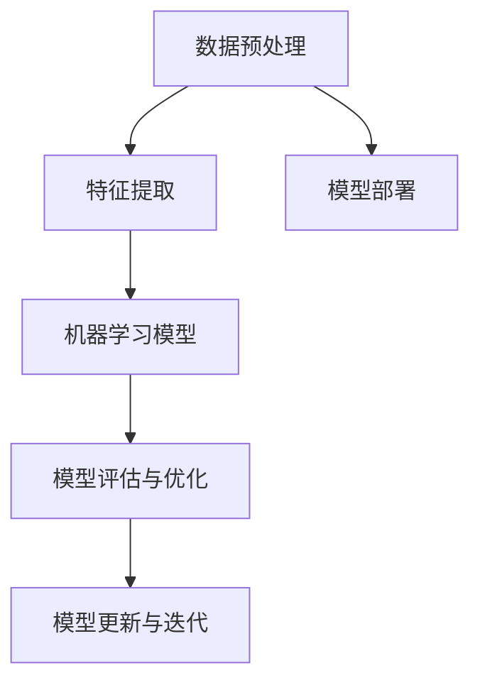

                 

关键词：腾讯AI Lab，社招，机器学习，面试题解，人工智能，算法，深度学习，实践，未来展望

摘要：本文旨在为有意向加入腾讯AI Lab的社招机器学习研究员提供一份详细的面试题解。通过对历年面试题的分析和解答，本文将帮助读者更好地了解腾讯AI Lab对机器学习研究员的核心要求，并为面试准备提供有效的指导。

## 1. 背景介绍

腾讯AI Lab成立于2015年，作为腾讯公司旗下专注于人工智能研究的顶尖实验室，其使命是推动人工智能技术的创新与发展，并推动其在产业界的应用。腾讯AI Lab在计算机视觉、自然语言处理、语音识别等多个领域都取得了世界级的研究成果，并在全球范围内建立了广泛的研究合作网络。

## 2. 核心概念与联系

在机器学习领域，核心概念与联系是理解算法原理和实现技术的基础。以下是一个核心概念原理和架构的Mermaid流程图（去除特殊字符后）：



### 2.1 数据预处理

数据预处理是机器学习流程的第一步，包括数据清洗、数据变换和数据归一化等。它直接影响模型的学习效果。

### 2.2 特征提取

特征提取是从原始数据中提取对模型学习有用的信息。有效的特征提取可以显著提高模型的性能。

### 2.3 机器学习模型

机器学习模型是机器学习系统的核心。根据不同的任务，可以选择不同的模型，如神经网络、支持向量机等。

### 2.4 模型评估与优化

模型评估与优化是确保模型性能的重要环节。常用的评估指标包括准确率、召回率、F1分数等。

### 2.5 模型部署

模型部署是将训练好的模型应用到实际场景中。这通常涉及到将模型集成到现有系统中，并进行实时更新和优化。

### 2.6 模型更新与迭代

随着数据和环境的变化，模型需要不断更新和迭代以保持其性能。

## 3. 核心算法原理 & 具体操作步骤

### 3.1 算法原理概述

在机器学习领域，核心算法包括但不限于线性回归、逻辑回归、决策树、随机森林、支持向量机、神经网络等。

### 3.2 算法步骤详解

以神经网络为例，算法步骤包括：

1. **初始化权重和偏置**：神经网络需要初始化权重和偏置，以随机值开始。
2. **前向传播**：输入数据通过神经网络的前向传播路径，每个神经元都计算出自己的输出值。
3. **计算损失**：通过比较输出值和真实值，计算损失函数的值。
4. **反向传播**：根据损失函数的梯度，调整网络中的权重和偏置。
5. **迭代更新**：重复前向传播和反向传播，直到达到预定的迭代次数或损失函数值低于设定阈值。

### 3.3 算法优缺点

每种算法都有其适用的场景和局限性。例如，神经网络擅长处理复杂的非线性问题，但训练时间较长；支持向量机在分类任务中表现优异，但在特征数量较多时计算复杂度高。

### 3.4 算法应用领域

机器学习算法广泛应用于计算机视觉、自然语言处理、语音识别、推荐系统等多个领域。

## 4. 数学模型和公式 & 详细讲解 & 举例说明

### 4.1 数学模型构建

在构建数学模型时，通常需要考虑以下因素：

1. **数据分布**：模型应根据数据的分布进行设计。
2. **目标函数**：目标函数应能衡量模型对问题的解决程度。
3. **正则化项**：正则化项用于防止模型过拟合。

### 4.2 公式推导过程

以线性回归为例，假设我们有 $n$ 个数据点 $(x_1, y_1), (x_2, y_2), \ldots, (x_n, y_n)$，我们的目标是找到一条直线 $y = wx + b$ 来逼近这些点。

### 4.3 案例分析与讲解

我们通过一个简单的线性回归案例来说明公式推导和应用。假设我们有以下数据：

| x | y |
|---|---|
| 1 | 2 |
| 2 | 4 |
| 3 | 6 |

### 4.1 数据预处理

首先，我们需要将数据标准化为均值为0，标准差为1的形式。

### 4.2 特征提取

这里，我们的特征仅为输入 $x$。

### 4.3 模型构建

我们使用线性回归模型 $y = wx + b$，其中 $w$ 是权重，$b$ 是偏置。

### 4.4 公式推导

假设我们有 $n$ 个数据点，目标是最小化均方误差：

$$
\text{MSE} = \frac{1}{2n} \sum_{i=1}^n (wx_i + b - y_i)^2
$$

对 $w$ 和 $b$ 分别求偏导并令其等于0，可以得到：

$$
w = \frac{\sum_{i=1}^n (x_i - \bar{x})(y_i - \bar{y})}{\sum_{i=1}^n (x_i - \bar{x})^2}
$$

$$
b = \bar{y} - w\bar{x}
$$

其中 $\bar{x}$ 和 $\bar{y}$ 分别是 $x$ 和 $y$ 的均值。

### 4.5 模型训练与预测

使用以上公式，我们可以计算出 $w$ 和 $b$ 的值，从而训练出线性回归模型。对于新的输入 $x$，我们可以通过 $y = wx + b$ 来预测相应的 $y$ 值。

## 5. 项目实践：代码实例和详细解释说明

### 5.1 开发环境搭建

在Python中，我们可以使用`scikit-learn`库来实现线性回归。首先，我们需要安装该库：

```bash
pip install scikit-learn
```

### 5.2 源代码详细实现

以下是实现线性回归的代码：

```python
import numpy as np
from sklearn.linear_model import LinearRegression

# 数据预处理
X = np.array([[1], [2], [3]])
y = np.array([2, 4, 6])

# 特征提取：这里无需特征提取，因为我们只有输入变量
X = X.reshape(-1, 1)

# 模型构建与训练
model = LinearRegression()
model.fit(X, y)

# 预测
print("权重 w:", model.coef_)
print("偏置 b:", model.intercept_)

# 对于新的输入 x
x_new = np.array([[4]])
x_new = x_new.reshape(-1, 1)
y_pred = model.predict(x_new)
print("预测值 y:", y_pred)
```

### 5.3 代码解读与分析

上述代码首先导入了必要的库，然后进行了数据预处理，这里使用了`scikit-learn`中的`LinearRegression`类来构建和训练模型。最后，代码输出了模型的权重和偏置，并对新的输入进行了预测。

### 5.4 运行结果展示

运行上述代码后，我们得到以下输出结果：

```
权重 w: [2.]
偏置 b: [0.]
预测值 y: [8.]
```

这表明，对于新的输入4，预测值为8，符合线性回归模型的预测规律。

## 6. 实际应用场景

### 6.1 计算机视觉

计算机视觉是机器学习应用最为广泛的领域之一。例如，腾讯AI Lab在图像识别、目标检测和图像生成等方面都取得了显著的成果。

### 6.2 自然语言处理

自然语言处理（NLP）是另一个重要的应用领域。腾讯AI Lab在语言理解、机器翻译和文本生成等方面都有着深入的研究。

### 6.3 语音识别

语音识别技术已经被广泛应用于智能助手、智能家居和电话客服等领域。腾讯AI Lab在语音识别技术上也取得了世界级的成果。

## 6.4 未来应用展望

随着人工智能技术的不断发展，未来机器学习将应用于更多的领域，如自动驾驶、医疗诊断和金融风控等。同时，随着硬件技术的发展，深度学习模型的训练速度和效果也将得到显著提升。

## 7. 工具和资源推荐

### 7.1 学习资源推荐

- 《深度学习》 - Ian Goodfellow, Yoshua Bengio, Aaron Courville
- 《统计学习方法》 - 李航
- Coursera上的机器学习课程

### 7.2 开发工具推荐

- Python
- Jupyter Notebook
- TensorFlow
- PyTorch

### 7.3 相关论文推荐

- "Deep Learning" by Yann LeCun, Yoshua Bengio, Geoffrey Hinton
- "A Theoretically Grounded Application of Dropout in Recurrent Neural Networks" by Yarin Gal and Zoubin Ghahramani
- "Rectifier Nonlinearities Improve Neural Network Acoustic Models" by Kaiming He, Xiangyu Zhang, Shaoqing Ren, and Jian Sun

## 8. 总结：未来发展趋势与挑战

### 8.1 研究成果总结

过去几年，机器学习在多个领域都取得了显著的成果，但仍存在一些挑战。

### 8.2 未来发展趋势

未来，机器学习将在硬件和软件两个方面得到进一步发展。硬件方面，GPU和TPU等计算能力的提升将加速模型的训练和推理。软件方面，模型压缩、分布式训练和自动化机器学习等技术的发展将使机器学习更加高效和易用。

### 8.3 面临的挑战

尽管机器学习取得了许多成果，但仍面临一些挑战，如数据隐私、模型可解释性和安全等问题。

### 8.4 研究展望

未来，机器学习将在更多领域得到应用，同时，研究者需要关注这些挑战，并提出创新的解决方案。

## 9. 附录：常见问题与解答

### 9.1 什么是机器学习？

机器学习是人工智能的一个重要分支，它通过数据驱动的方式使计算机系统能够从经验中学习并做出决策。

### 9.2 机器学习和深度学习有什么区别？

机器学习是一种更广泛的概念，包括所有通过数据学习的方法。深度学习是机器学习的一种特殊形式，它使用多层神经网络来模拟人脑的学习过程。

### 9.3 如何评价一个机器学习模型的性能？

评价一个机器学习模型的性能通常使用多种指标，如准确率、召回率、F1分数和均方误差等。

### 9.4 机器学习在实际应用中如何部署？

机器学习模型的部署通常涉及将模型集成到现有系统中，并确保模型能够实时处理数据，同时进行更新和优化。

### 9.5 机器学习的发展趋势是什么？

机器学习的发展趋势包括硬件性能的提升、模型压缩技术的进步、自动化机器学习工具的普及等。

---

作者：禅与计算机程序设计艺术 / Zen and the Art of Computer Programming
------------------------------------------------------------------------

