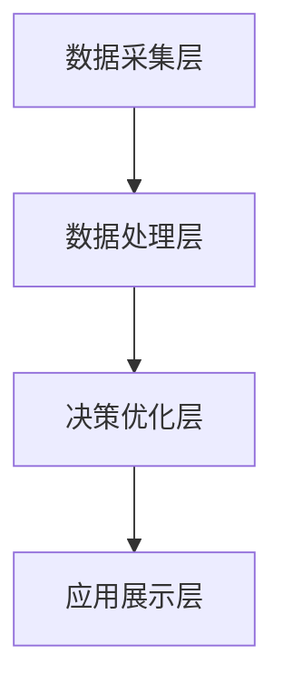

                 

关键词：2024腾讯云校招、智慧能源、面试真题、解答、人工智能、技术

> 摘要：本文旨在为2024年腾讯云智慧能源校招面试的考生提供一份全面的真题汇总及解答指南。通过对历年面试真题的分析和解答，帮助考生更好地准备面试，提升竞争力。

## 1. 背景介绍

腾讯云智慧能源是腾讯公司旗下的云计算和人工智能服务品牌，致力于通过智能化的技术手段，推动能源领域的数字化转型。2024年腾讯云智慧能源校招面试旨在选拔一批具有创新能力和技术实力的人才，为公司的可持续发展注入新动力。

本文将对2024年腾讯云智慧能源校招面试中的常见题目进行汇总和解答，帮助考生熟悉面试题型，提高应对能力。

## 2. 核心概念与联系

### 2.1 智慧能源的概念

智慧能源是指利用互联网、物联网、大数据、人工智能等先进技术，对能源生产、传输、消费等环节进行智能化管理，提高能源利用效率，降低能源消耗。

### 2.2 智慧能源的技术架构

智慧能源的技术架构主要包括以下几个层次：

- 数据采集层：通过传感器、智能电表等设备，实时采集能源生产、传输、消费的数据。
- 数据处理层：对采集到的数据进行分析、处理，提取有价值的信息。
- 决策优化层：根据处理后的数据，对能源生产、传输、消费进行优化调度，实现能源的智能化管理。
- 应用展示层：通过可视化技术，展示能源生产、传输、消费的情况，为决策提供支持。

以下是一个简单的 Mermaid 流程图，展示了智慧能源的技术架构：



## 3. 核心算法原理 & 具体操作步骤

### 3.1 算法原理概述

智慧能源领域常用的算法主要包括数据挖掘、机器学习、深度学习等。这些算法的核心思想是通过学习大量数据，提取数据中的规律和模式，为能源管理提供决策支持。

### 3.2 算法步骤详解

- 数据采集：通过传感器、智能电表等设备，实时采集能源生产、传输、消费的数据。
- 数据预处理：对采集到的数据进行清洗、归一化等处理，使其适合机器学习模型的输入。
- 特征提取：从预处理后的数据中提取出对能源管理有重要意义的特征。
- 模型训练：使用机器学习或深度学习算法，对提取出的特征进行训练，构建预测模型。
- 模型评估：使用测试数据集，评估模型的预测效果，调整模型参数。
- 模型应用：将训练好的模型应用到实际能源管理中，实现智能化调度和优化。

### 3.3 算法优缺点

- 优点：可以提高能源利用效率，降低能源消耗，实现能源的智能化管理。
- 缺点：对数据质量和算法模型的依赖较大，实现过程复杂。

### 3.4 算法应用领域

智慧能源算法主要应用于以下领域：

- 能源预测：预测能源供需情况，为能源调度提供依据。
- 能源优化：优化能源生产、传输、消费过程，提高能源利用效率。
- 能源管理：实现能源的智能化管理，降低能源成本。

## 4. 数学模型和公式 & 详细讲解 & 举例说明

### 4.1 数学模型构建

智慧能源领域的数学模型主要包括以下几种：

- 能源供需预测模型：使用时间序列分析方法，预测未来的能源供需情况。
- 能源优化模型：使用线性规划、整数规划等优化算法，优化能源生产、传输、消费过程。
- 能源风险管理模型：使用概率模型、风险度量方法，评估能源系统的风险水平。

### 4.2 公式推导过程

以能源供需预测模型为例，其公式推导如下：

假设能源需求量 $D(t)$ 遵循 ARIMA(p, d, q) 模型，则：

$$
D(t) = \phi_1 D(t-1) + \phi_2 D(t-2) + ... + \phi_p D(t-p) + \theta_1 e(t-1) + \theta_2 e(t-2) + ... + \theta_q e(t-q)
$$

其中，$e(t)$ 为白噪声序列。

### 4.3 案例分析与讲解

以某城市的电力需求预测为例，使用 ARIMA 模型进行预测。首先，对电力需求数据进行预处理，然后使用 ACF 和 PACF 图判断模型参数，最后使用训练好的模型进行预测。

## 5. 项目实践：代码实例和详细解释说明

### 5.1 开发环境搭建

- Python 版本：3.8
- 数据预处理库：Pandas、NumPy
- 时间序列分析库：Statsmodels
- 可视化库：Matplotlib

### 5.2 源代码详细实现

以下是一个简单的 ARIMA 模型实现代码示例：

```python
import pandas as pd
import numpy as np
import matplotlib.pyplot as plt
import statsmodels.api as sm

# 读取数据
data = pd.read_csv('electricity_demand.csv')
data['Date'] = pd.to_datetime(data['Date'])
data.set_index('Date', inplace=True)
demand = data['Demand']

# 数据预处理
demand = demand.interpolate()

# 模型参数
p = 5
d = 1
q = 2

# ARIMA 模型
model = sm.ARIMA(demand, order=(p, d, q))
results = model.fit()

# 预测
forecast = results.forecast(steps=12)

# 可视化
plt.plot(demand)
plt.plot(forecast, label='Forecast')
plt.legend()
plt.show()
```

### 5.3 代码解读与分析

- 读取数据：使用 Pandas 读取 CSV 文件，将日期列转换为索引。
- 数据预处理：使用插值法对缺失数据进行填充。
- 模型参数：根据 ACF 和 PACF 图确定模型参数。
- ARIMA 模型：使用 Statsmodels 库构建 ARIMA 模型，并进行参数估计。
- 预测：使用训练好的模型进行预测，并绘制预测结果。

## 6. 实际应用场景

智慧能源算法在能源预测、能源优化、能源管理等方面具有广泛的应用场景。以下是一些实际应用场景：

- 能源预测：通过对历史数据的分析，预测未来的能源需求，为能源调度提供依据。
- 能源优化：优化能源生产、传输、消费过程，降低能源成本。
- 能源管理：实现能源的智能化管理，提高能源利用效率。

## 7. 工具和资源推荐

### 7.1 学习资源推荐

- 《Python for Data Analysis》
- 《Time Series Analysis and Its Applications》
- 《Deep Learning》

### 7.2 开发工具推荐

- Jupyter Notebook
- Matplotlib
- Statsmodels

### 7.3 相关论文推荐

- "An ARIMA Model for Short-Term Load Forecasting"
- "Deep Learning for Energy Forecasting"
- "Optimization of Energy Systems Using Machine Learning"

## 8. 总结：未来发展趋势与挑战

### 8.1 研究成果总结

智慧能源领域的研究取得了显著成果，主要包括：

- 能源预测精度提高：通过改进算法和模型，提高能源预测的准确性。
- 能源优化效果显著：通过优化算法，降低能源成本，提高能源利用效率。
- 能源管理智能化：通过人工智能技术，实现能源的智能化管理。

### 8.2 未来发展趋势

未来智慧能源领域的发展趋势主要包括：

- 深度学习在能源预测中的应用：利用深度学习技术，提高能源预测的精度。
- 能源优化算法的创新：开发更加高效的能源优化算法，提高能源利用效率。
- 能源管理的智能化升级：通过人工智能技术，实现能源管理的智能化升级。

### 8.3 面临的挑战

智慧能源领域面临的挑战主要包括：

- 数据质量和数据隐私：确保数据的质量和隐私，为算法提供可靠的数据支持。
- 算法模型的复杂度：降低算法模型的复杂度，提高算法的可解释性。
- 能源系统的稳定性：确保能源系统的稳定性，降低能源系统的风险。

### 8.4 研究展望

未来智慧能源领域的研究将朝着更加智能化、高效化、稳定化的方向发展，为能源行业的可持续发展提供技术支持。

## 9. 附录：常见问题与解答

### 9.1 问题1

**问题**：智慧能源算法的核心思想是什么？

**解答**：智慧能源算法的核心思想是通过学习大量数据，提取数据中的规律和模式，为能源管理提供决策支持。

### 9.2 问题2

**问题**：智慧能源的技术架构主要包括哪些层次？

**解答**：智慧能源的技术架构主要包括数据采集层、数据处理层、决策优化层和应用展示层。

### 9.3 问题3

**问题**：能源供需预测模型的主要应用领域有哪些？

**解答**：能源供需预测模型的主要应用领域包括能源预测、能源优化和能源管理。

### 9.4 问题4

**问题**：如何进行 ARIMA 模型的参数选择？

**解答**：可以通过 ACF 和 PACF 图判断模型参数，或者使用交叉验证等方法进行参数选择。

### 9.5 问题5

**问题**：如何确保数据的质量和隐私？

**解答**：可以通过数据清洗、加密和隐私保护技术等手段，确保数据的质量和隐私。```

