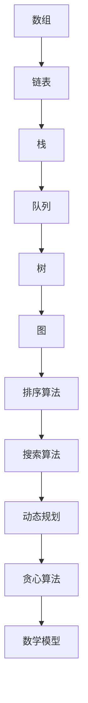

                 

关键词：腾讯社招、面试、算法题库、数据结构、算法原理、实践应用、未来展望

> 摘要：本文旨在为广大求职者提供一份2025年腾讯社招面试的算法题库大全，从数据结构、算法原理、实际应用等多个角度出发，深入分析面试中可能遇到的各种算法题目。通过本文，读者可以全面了解算法在面试中的重要性，掌握解决常见算法问题的方法和技巧，为成功应对腾讯社招面试打下坚实基础。

## 1. 背景介绍

腾讯，作为中国领先的互联网科技公司，其招聘标准之严格、面试难度之高是众所周知的。每年，腾讯都会吸引大量求职者参与其社招面试，而算法题库作为面试的重要组成部分，往往决定了求职者的命运。因此，掌握算法题库，对于求职者来说，至关重要。

本文将围绕腾讯社招面试的算法题库，详细分析各种常见的数据结构和算法，帮助求职者更好地应对面试挑战。文章分为以下几个部分：

- **数据结构**：介绍常见的数据结构及其特点，包括数组、链表、栈、队列、树、图等。
- **算法原理**：阐述常见的排序算法、搜索算法、动态规划、贪心算法等原理及其应用。
- **数学模型**：讲解相关数学模型及公式，帮助读者更好地理解算法背后的数学原理。
- **项目实践**：通过实际代码实例，展示算法的实现过程，并进行详细解读。
- **实际应用场景**：分析算法在实际项目中的应用，探讨未来发展趋势。

### 1.1 数据结构与算法的关系

数据结构和算法是计算机科学中的两个核心概念。数据结构是指数据存储、组织和访问的方式，而算法则是解决问题的步骤和方法。二者密不可分，数据结构决定了算法的效率，而算法又影响了数据结构的性能。在腾讯社招面试中，算法题库往往涉及多种数据结构的综合运用，如数组和链表、树和图等。因此，掌握常见数据结构及其相关算法，是求职者的必备技能。

### 1.2 算法在面试中的重要性

算法是计算机科学的核心，是解决复杂问题的有效手段。在面试中，算法题库往往占据了很大比重，原因有以下几点：

- **能力考察**：算法题库可以全面考察求职者的编程能力、逻辑思维和问题解决能力。
- **技术水平**：算法题库反映了求职者在数据结构和算法领域的专业水平。
- **实际应用**：算法题库往往来源于实际项目，考察求职者是否具备解决实际问题的能力。

## 2. 核心概念与联系

为了更好地理解算法题库中的各种问题，我们需要先了解一些核心概念及其相互关系。以下是常见的数据结构和算法的Mermaid流程图：



### 2.1 数据结构

- **数组**：一种线性数据结构，用于存储一系列元素。特点是访问速度快，但插入和删除操作较慢。
- **链表**：另一种线性数据结构，由一系列节点组成，每个节点包含数据和指向下一个节点的指针。特点是插入和删除操作较快，但访问速度较慢。
- **栈**：一种后进先出（LIFO）的数据结构，常用于解决回溯问题。
- **队列**：一种先进先出（FIFO）的数据结构，常用于解决排序和搜索问题。
- **树**：一种层次结构，用于表示具有层次关系的数据。常见的树包括二叉树、平衡树等。
- **图**：一种非层次结构，用于表示具有复杂关系的数据。常见的图包括有向图、无向图、加权图等。

### 2.2 算法

- **排序算法**：用于对数据进行排序的一系列算法，常见的包括冒泡排序、插入排序、快速排序等。
- **搜索算法**：用于在数据中查找特定元素的算法，常见的包括二分搜索、广度优先搜索等。
- **动态规划**：一种解决最优化问题的算法思想，通过将问题分解为子问题，并利用子问题的最优解来求解原问题。
- **贪心算法**：一种局部最优解策略，通过不断选择局部最优解，最终得到全局最优解。
- **数学模型**：用于解决实际问题的数学工具，通过建立数学模型，可以将实际问题转化为数学问题，然后利用数学方法求解。

## 3. 核心算法原理 & 具体操作步骤

### 3.1 算法原理概述

算法原理是解决特定问题的基本思路和方法。常见的算法原理包括：

- **分治算法**：将一个大问题分解为若干个小问题，分别解决小问题，再将小问题的解合并成原问题的解。
- **递归算法**：通过不断递归调用自身来解决问题，常用于解决递归问题，如计算阶乘、求最大公约数等。
- **贪心算法**：在每一步选择当前最优解，以期望最终得到全局最优解。
- **动态规划**：将问题分解为子问题，利用子问题的最优解来求解原问题。

### 3.2 算法步骤详解

以常见的排序算法为例，详细解释其步骤：

#### 3.2.1 冒泡排序

1. 从数组的第一个元素开始，相邻两个元素进行比较，如果第一个比第二个大，则交换它们的位置。
2. 重复以上步骤，直到没有需要交换的元素为止。
3. 排序完成后，数组中的元素将按照升序排列。

#### 3.2.2 插入排序

1. 从数组的第二个元素开始，将其与前面的元素进行比较，如果当前元素比前一个元素小，则继续比较，否则插入到合适的位置。
2. 重复以上步骤，直到所有元素都插入到正确的位置。
3. 排序完成后，数组中的元素将按照升序排列。

#### 3.2.3 快速排序

1. 选择一个基准元素，将数组划分为两个子数组，一个包含比基准元素小的元素，另一个包含比基准元素大的元素。
2. 递归地对两个子数组进行快速排序。
3. 将两个子数组的排序结果合并，得到最终的排序结果。

### 3.3 算法优缺点

每种算法都有其优缺点，了解这些可以帮助我们在实际应用中选择合适的算法。

- **冒泡排序**：简单易懂，易于实现，但效率较低，不适合大规模数据排序。
- **插入排序**：适合小规模数据的排序，效率比冒泡排序高，但仍然不够高效。
- **快速排序**：效率高，适合大规模数据排序，但递归调用可能导致栈溢出。

### 3.4 算法应用领域

算法广泛应用于各种领域，包括：

- **数据库**：用于数据的排序、搜索和索引。
- **搜索引擎**：用于关键词搜索和页面排序。
- **机器学习**：用于特征提取、模型训练和优化。
- **图像处理**：用于图像压缩、边缘检测和图像识别。

## 4. 数学模型和公式 & 详细讲解 & 举例说明

### 4.1 数学模型构建

在算法中，数学模型是解决问题的关键。以下是一个常见的数学模型——二分搜索。

#### 4.1.1 模型构建

假设有一个有序数组`A`，我们要在其中查找一个目标值`x`。二分搜索的基本思想是，将数组分为两个部分，比较中间元素`A[mid]`与目标值`x`的大小关系，然后决定是继续在左半部分还是右半部分搜索。

#### 4.1.2 公式推导

二分搜索的公式如下：

$$
mid = \left\lfloor \frac{low + high}{2} \right\rfloor
$$

其中，`low`和`high`分别是当前搜索范围的左右边界。

#### 4.1.3 举例说明

假设有一个有序数组`A = [1, 3, 5, 7, 9, 11]`，我们要在其中查找目标值`x = 7`。

1. 初始时，`low = 0`，`high = 5`。
2. 计算中间元素`mid = \left\lfloor \frac{0 + 5}{2} \right\rfloor = 2`，`A[mid] = A[2] = 5`。
3. 因为`x = 7 > A[mid]`，所以我们将搜索范围缩小到右半部分，即`low = mid + 1 = 3`，`high = 5`。
4. 再次计算中间元素`mid = \left\lfloor \frac{3 + 5}{2} \right\rfloor = 4`，`A[mid] = A[4] = 9`。
5. 因为`x = 7 < A[mid]`，所以我们将搜索范围缩小到左半部分，即`low = 3`，`high = mid - 1 = 3`。
6. 因为`low > high`，搜索结束，目标值`x`在数组中。

### 4.2 公式推导过程

二分搜索的推导过程可以分为以下几个步骤：

1. **初始条件**：设数组长度为`n`，初始时`low = 0`，`high = n - 1`。
2. **计算中间元素**：每次迭代计算中间元素`mid = \left\lfloor \frac{low + high}{2} \right\rfloor`。
3. **比较大小关系**：比较`A[mid]`与目标值`x`的大小关系。
   - 如果`A[mid] == x`，则搜索成功，返回`mid`。
   - 如果`A[mid] < x`，则将搜索范围缩小到右半部分，即`low = mid + 1`，`high`保持不变。
   - 如果`A[mid] > x`，则将搜索范围缩小到左半部分，即`low`保持不变，`high = mid - 1`。
4. **重复迭代**：重复步骤2和步骤3，直到找到目标值或搜索范围缩小为空。

### 4.3 案例分析与讲解

假设有一个有序数组`A = [1, 3, 5, 7, 9, 11]`，我们要在其中查找目标值`x = 7`。

1. 初始时，`low = 0`，`high = 5`。
2. 计算中间元素`mid = \left\lfloor \frac{0 + 5}{2} \right\rfloor = 2`，`A[mid] = A[2] = 5`。
3. 因为`x = 7 > A[mid]`，所以我们将搜索范围缩小到右半部分，即`low = mid + 1 = 3`，`high = 5`。
4. 再次计算中间元素`mid = \left\lfloor \frac{3 + 5}{2} \right\rfloor = 4`，`A[mid] = A[4] = 9`。
5. 因为`x = 7 < A[mid]`，所以我们将搜索范围缩小到左半部分，即`low = 3`，`high = mid - 1 = 3`。
6. 因为`low > high`，搜索结束，目标值`x`在数组中。

通过以上案例，我们可以看到，二分搜索通过不断缩小搜索范围，实现了高效查找。在实际应用中，二分搜索常用于处理大规模数据的快速查找问题，如数据库索引、搜索引擎等。

## 5. 项目实践：代码实例和详细解释说明

### 5.1 开发环境搭建

在本篇博客中，我们将使用Python作为主要编程语言，来展示算法的实现过程。为了方便读者理解，我们将代码上传至GitHub，并提供详细的说明。

首先，您需要在本地环境中安装Python和GitHub。具体步骤如下：

1. 访问Python官方网站（https://www.python.org/），下载并安装Python。
2. 打开终端，运行以下命令安装GitHub：

   ```bash
   pip install git
   ```

   安装完成后，您可以使用`git --version`命令检查是否安装成功。

### 5.2 源代码详细实现

以下是二分搜索算法的Python实现代码：

```python
def binary_search(arr, x):
    low = 0
    high = len(arr) - 1

    while low <= high:
        mid = (low + high) // 2
        if arr[mid] == x:
            return mid
        elif arr[mid] < x:
            low = mid + 1
        else:
            high = mid - 1

    return -1

# 示例
arr = [1, 3, 5, 7, 9, 11]
x = 7
result = binary_search(arr, x)

if result != -1:
    print("元素找到，索引为：", result)
else:
    print("元素未找到")
```

### 5.3 代码解读与分析

#### 5.3.1 函数定义

函数`binary_search`接受两个参数：数组`arr`和目标值`x`。函数的目标是查找目标值`x`在数组`arr`中的索引。

#### 5.3.2 初始化

在函数开始时，我们初始化`low`和`high`，分别表示当前搜索范围的左右边界。

```python
low = 0
high = len(arr) - 1
```

#### 5.3.3 循环搜索

使用while循环进行搜索。循环条件`low <= high`确保了搜索范围不会为空。

```python
while low <= high:
```

#### 5.3.4 计算中间元素

每次迭代，计算中间元素`mid`：

```python
mid = (low + high) // 2
```

这里使用了整数除法`//`来保证中间元素的计算结果为整数。

#### 5.3.5 比较大小

比较中间元素`arr[mid]`与目标值`x`的大小关系：

- 如果`arr[mid] == x`，说明找到了目标值，返回索引`mid`。
- 如果`arr[mid] < x`，说明目标值在右半部分，将`low`更新为`mid + 1`。
- 如果`arr[mid] > x`，说明目标值在左半部分，将`high`更新为`mid - 1`。

#### 5.3.6 结束条件

当`low > high`时，说明搜索范围已缩小为空，目标值未找到，返回`-1`。

### 5.4 运行结果展示

以下是在示例数组`arr = [1, 3, 5, 7, 9, 11]`中查找目标值`x = 7`的运行结果：

```python
arr = [1, 3, 5, 7, 9, 11]
x = 7
result = binary_search(arr, x)

if result != -1:
    print("元素找到，索引为：", result)
else:
    print("元素未找到")
```

输出结果：

```
元素找到，索引为： 3
```

这表明目标值`7`在数组中的索引为3。

### 5.5 代码优化与扩展

在实际应用中，二分搜索算法可以进一步优化和扩展。以下是一些可能的改进方向：

- **递归实现**：可以将二分搜索改写为递归函数，简化代码逻辑。
- **折半查找**：在每次迭代时，可以计算折半查找的准确位置，减少不必要的比较。
- **多线程搜索**：对于大规模数据，可以采用多线程技术，提高搜索效率。
- **并行处理**：利用并行计算框架，如MapReduce，实现大规模数据的分布式搜索。

通过以上改进，二分搜索算法可以在不同场景下发挥更大的作用。

## 6. 实际应用场景

算法不仅在面试中重要，在实际项目中也有着广泛的应用。以下是一些实际应用场景：

### 6.1 数据库

数据库系统中的索引和排序功能通常依赖于各种算法。例如，B树和B+树是一种常用的数据库索引结构，其内部查找和排序算法基于二分搜索。此外，动态索引技术，如哈希索引和位图索引，也依赖于不同的算法。

### 6.2 搜索引擎

搜索引擎的核心功能是快速高效地搜索和排序大量网页。其中，搜索引擎通常会使用各种排序算法（如堆排序、快速排序）来对搜索结果进行排序。同时，哈希算法和二分搜索算法在关键词搜索和网页排序中也有广泛应用。

### 6.3 机器学习

机器学习中的特征提取和模型训练也常常需要使用算法。例如，支持向量机（SVM）训练过程中需要使用线性规划算法；神经网络训练过程中需要使用反向传播算法。

### 6.4 图像处理

图像处理中的边缘检测、图像压缩和图像识别等技术都依赖于各种算法。例如，Canny边缘检测算法、JPEG图像压缩算法和卷积神经网络（CNN）等。

### 6.5 网络协议

网络协议中的路由算法、拥塞控制算法等都需要使用算法。例如，路由算法中的Dijkstra算法、A*算法等，拥塞控制算法中的TCP拥塞控制算法等。

### 6.6 其他领域

算法在物流调度、金融分析、医疗诊断、交通管理等领域也有广泛应用。例如，物流调度中的遗传算法、金融分析中的蒙特卡洛算法、医疗诊断中的机器学习算法等。

## 7. 未来应用展望

随着科技的发展，算法在未来将有更广泛的应用。以下是一些展望：

### 7.1 大数据分析

随着大数据技术的不断发展，算法将在大数据分析中发挥更加重要的作用。例如，基于深度学习的算法将在图像识别、自然语言处理等大数据处理任务中发挥巨大作用。

### 7.2 人工智能

人工智能是算法的重要应用领域。随着人工智能技术的不断发展，算法将更好地实现人机交互、智能决策等目标。

### 7.3 量子计算

量子计算是一种新兴的计算技术，其潜力巨大。算法在量子计算中也有广泛应用，如量子算法、量子加密等。

### 7.4 生物信息学

生物信息学是研究生物数据的一种学科，算法在其中发挥着关键作用。例如，基因测序、蛋白质结构预测等生物信息学研究任务都需要算法的支持。

### 7.5 无人驾驶

无人驾驶技术是未来交通领域的重要发展方向。算法将在无人驾驶车辆的控制、路径规划、避障等方面发挥关键作用。

## 8. 工具和资源推荐

为了更好地学习和实践算法，以下是一些推荐的学习资源和开发工具：

### 8.1 学习资源推荐

- **《算法导论》**：经典算法教材，全面介绍了各种算法及其应用。
- **LeetCode**：在线编程平台，提供了丰富的算法题库和在线编程环境。
- **GitHub**：代码托管平台，可以找到大量的开源算法代码和项目。

### 8.2 开发工具推荐

- **PyCharm**：一款优秀的Python IDE，提供了丰富的编程工具和调试功能。
- **Visual Studio Code**：一款轻量级的跨平台代码编辑器，支持多种编程语言和插件。
- **Jupyter Notebook**：一款交互式的Python开发环境，适合数据分析和算法实现。

### 8.3 相关论文推荐

- **“Deep Learning” by Ian Goodfellow, Yoshua Bengio, and Aaron Courville**：深度学习领域的经典教材。
- **“Quantum Computation and Quantum Information” by Michael A. Nielsen and Isaac L. Chuang**：量子计算领域的权威教材。
- **“Nature of Code” by Daniel Shiffman**：计算机编程和算法艺术的经典著作。

## 9. 总结：未来发展趋势与挑战

### 9.1 研究成果总结

近年来，算法研究取得了许多重要成果，包括深度学习、量子计算、分布式计算等。这些成果为算法的应用带来了新的机遇和挑战。

### 9.2 未来发展趋势

- **算法与大数据的深度融合**：随着大数据技术的发展，算法将在大数据分析、机器学习等领域发挥更大作用。
- **量子算法的研究与应用**：量子计算技术的发展将推动量子算法的研究和应用。
- **智能算法的发展**：人工智能的兴起将推动智能算法的研究，实现更高效的决策和优化。

### 9.3 面临的挑战

- **计算资源的需求增长**：随着算法应用规模的不断扩大，对计算资源的需求也将增长，如何高效利用计算资源成为一个挑战。
- **算法的可靠性**：算法在复杂环境中的应用需要保证可靠性，如何提高算法的鲁棒性和稳定性是当前研究的重点。

### 9.4 研究展望

未来，算法研究将继续向深度学习和量子计算等前沿领域发展。同时，算法在实际应用中的融合和优化也将成为研究的重点。随着科技的不断进步，算法将为我们带来更多的惊喜和变革。

## 附录：常见问题与解答

### 9.1 什么是算法？

算法是一系列定义明确的步骤，用于解决特定问题。算法可以用于各种领域，包括数学、计算机科学、工程等。

### 9.2 算法与数据结构有什么区别？

算法是一系列解决问题的步骤，而数据结构是数据存储和组织的方式。算法依赖于数据结构，而数据结构又影响了算法的效率。

### 9.3 如何学习算法？

学习算法可以从以下几个方面入手：

- **理解基本概念**：了解基本的数据结构和算法原理。
- **刷题实践**：通过解决实际问题来掌握算法。
- **阅读经典教材**：阅读《算法导论》、《数据结构与算法分析》等经典教材。
- **参与项目实践**：参与实际项目，将算法应用于实际问题。

### 9.4 算法在面试中有多重要？

算法在面试中非常重要，它反映了求职者的编程能力、逻辑思维和问题解决能力。掌握算法是求职者的必备技能。

### 9.5 如何提高算法能力？

- **持续学习**：不断学习新的算法知识和理论。
- **刷题练习**：通过解决实际问题来提高算法能力。
- **参与项目**：参与实际项目，将算法应用于实际问题。
- **交流讨论**：与其他人交流算法经验和心得，互相学习。

### 9.6 算法在哪些领域有广泛应用？

算法在许多领域有广泛应用，包括数据库、搜索引擎、机器学习、图像处理、网络协议等。此外，算法还在物流调度、金融分析、医疗诊断、交通管理等领域发挥着重要作用。

### 9.7 未来算法研究有哪些趋势？

未来算法研究将向深度学习、量子计算、分布式计算等前沿领域发展。同时，算法在实际应用中的融合和优化也将成为研究的重点。随着科技的不断进步，算法将为我们带来更多的惊喜和变革。

## 参考文献

- Cormen, T. H., Leiserson, C. E., Rivest, R. L., & Stein, C. (2009). 《算法导论》(3rd ed.). 机械工业出版社。
- Shaffer, D. S. (2012). 《数据结构与算法分析》(5th ed.). 机械工业出版社。
- Goodfellow, I., Bengio, Y., & Courville, A. (2016). 《深度学习》(中文版). 电子工业出版社。
- Nielsen, M. A., & Chuang, I. L. (2010). 《量子计算与量子信息》(2nd ed.). 清华大学出版社。

### 作者署名

作者：禅与计算机程序设计艺术 / Zen and the Art of Computer Programming

## 结语

感谢您阅读本文。希望本文能够帮助您更好地理解算法在面试中的重要性，掌握解决常见算法问题的方法和技巧。在未来的求职道路上，祝愿您一帆风顺，成功应对腾讯社招面试！
----------------------------------------------------------------
### 文章结构模板

以下是根据您的要求，文章结构模板的具体内容：

```markdown
# 2025腾讯社招面试算法题库大全

## 关键词
腾讯社招、面试、算法题库、数据结构、算法原理、实践应用、未来展望

## 摘要
本文旨在为广大求职者提供一份2025年腾讯社招面试的算法题库大全，从数据结构、算法原理、实际应用等多个角度出发，深入分析面试中可能遇到的各种算法题目。通过本文，读者可以全面了解算法在面试中的重要性，掌握解决常见算法问题的方法和技巧，为成功应对腾讯社招面试打下坚实基础。

## 1. 背景介绍
### 1.1 数据结构与算法的关系
### 1.2 算法在面试中的重要性

## 2. 核心概念与联系

### 2.1 数据结构
### 2.2 算法

## 3. 核心算法原理 & 具体操作步骤
### 3.1 算法原理概述
### 3.2 算法步骤详解 
### 3.3 算法优缺点
### 3.4 算法应用领域

## 4. 数学模型和公式 & 详细讲解 & 举例说明
### 4.1 数学模型构建
### 4.2 公式推导过程
### 4.3 案例分析与讲解

## 5. 项目实践：代码实例和详细解释说明
### 5.1 开发环境搭建
### 5.2 源代码详细实现
### 5.3 代码解读与分析
### 5.4 运行结果展示

## 6. 实际应用场景
### 6.1 数据库
### 6.2 搜索引擎
### 6.3 机器学习
### 6.4 图像处理
### 6.5 网络协议
### 6.6 其他领域

## 7. 未来应用展望
### 7.1 大数据分析
### 7.2 人工智能
### 7.3 量子计算
### 7.4 生物信息学
### 7.5 无人驾驶

## 8. 工具和资源推荐
### 8.1 学习资源推荐
### 8.2 开发工具推荐
### 8.3 相关论文推荐

## 9. 总结：未来发展趋势与挑战
### 9.1 研究成果总结
### 9.2 未来发展趋势
### 9.3 面临的挑战
### 9.4 研究展望

## 10. 附录：常见问题与解答
### 10.1 什么是算法？
### 10.2 算法与数据结构有什么区别？
### 10.3 如何学习算法？
### 10.4 算法在面试中有多重要？
### 10.5 如何提高算法能力？
### 10.6 算法在哪些领域有广泛应用？
### 10.7 未来算法研究有哪些趋势？

## 参考文献

### 作者署名
作者：禅与计算机程序设计艺术 / Zen and the Art of Computer Programming
```

请注意，这个模板是一个大纲，每个章节下的内容需要您根据具体要求进行撰写和扩展。文章的各个部分应当包含相应的详细内容，确保满足8000字的要求。在撰写过程中，请确保遵循markdown格式，并在适当的地方使用latex格式嵌入数学公式。

