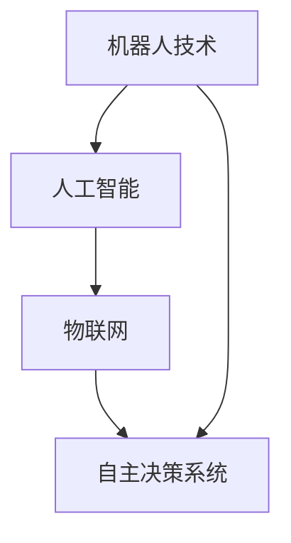

                 

 关键词：自动化、机器人技术、人工智能、物联网、数字化转型、智能工厂、自主决策

> 摘要：本文将深入探讨自动化领域的最新发展趋势，涵盖从机器人技术到人工智能、物联网、智能工厂以及自主决策系统等各个方面。通过分析这些技术进步，本文将展示自动化如何推动产业革命，并展望其未来发展的广阔前景。

## 1. 背景介绍

自动化技术的历史可以追溯到20世纪初，但真正的爆发点出现在20世纪末和21世纪初。随着计算机技术和通信技术的飞速发展，自动化逐渐从工业生产领域扩展到服务业、医疗、交通等多个行业。近年来，随着人工智能和物联网技术的成熟，自动化迎来了新的发展浪潮。

### 1.1 工业自动化

工业自动化主要指的是利用机器或机器人取代人工操作，以提高生产效率和产品质量。自20世纪以来，工业自动化经历了多个阶段，从早期的机械自动化到后来的电子自动化和计算机自动化。现在，随着人工智能和机器学习的发展，工业自动化正变得更加智能和灵活。

### 1.2 智能家居

智能家居是指利用自动化技术来控制家庭设备和系统，以提供更加便捷和舒适的生活环境。随着物联网技术的普及，智能家居设备（如智能灯泡、智能电视、智能门锁等）逐渐成为家庭生活的一部分。

### 1.3 智能交通

智能交通系统利用自动化技术来管理交通流量、减少交通事故和提高交通效率。自动驾驶技术是智能交通领域的核心，其目标是通过机器学习、传感器技术和通信技术实现车辆自主驾驶。

### 1.4 医疗自动化

医疗自动化涵盖了从医疗设备自动化到手术机器人等多个方面。随着人工智能技术的进步，医疗自动化正变得更加精确和高效，从而提高诊断和治疗的准确性。

## 2. 核心概念与联系

自动化技术的核心概念包括机器人技术、人工智能、物联网和自主决策系统。以下是一个简化的 Mermaid 流程图，展示这些核心概念之间的联系：



### 2.1 机器人技术

机器人技术是自动化的基础，涉及到机械设计、传感器技术、控制理论和人工智能等多个领域。机器人可以执行重复性高、环境变化频繁的任务，从而提高生产效率并减少人工劳动。

### 2.2 人工智能

人工智能是自动化技术的核心驱动力，它使得机器人能够学习、适应和自主决策。人工智能技术包括机器学习、深度学习、自然语言处理和计算机视觉等，这些技术使得机器人能够更好地理解和交互世界。

### 2.3 物联网

物联网是将各种物理设备连接到互联网的技术，它为自动化提供了丰富的数据源。通过物联网，设备之间可以相互通信和协作，从而实现更高效的自动化系统。

### 2.4 自主决策系统

自主决策系统是自动化技术的最终目标，它使得系统能够在复杂环境中自主运行和做出决策。自主决策系统通常依赖于人工智能和机器学习技术，以提高系统的适应性和灵活性。

## 3. 核心算法原理 & 具体操作步骤

### 3.1 算法原理概述

自动化技术的核心算法主要包括机器学习算法、深度学习算法和路径规划算法。这些算法在不同的应用场景中发挥着关键作用。

- **机器学习算法**：用于从数据中学习模式和规律，以预测或分类未知数据。
- **深度学习算法**：是机器学习的一种特殊形式，它使用多层神经网络来模拟人类大脑的思考过程。
- **路径规划算法**：用于计算从起点到终点的最优路径。

### 3.2 算法步骤详解

#### 3.2.1 机器学习算法

1. **数据收集**：收集用于训练的数据集。
2. **数据预处理**：清洗和标准化数据。
3. **模型选择**：选择合适的机器学习模型。
4. **训练模型**：使用训练数据集训练模型。
5. **评估模型**：使用测试数据集评估模型性能。
6. **模型部署**：将训练好的模型部署到实际应用场景中。

#### 3.2.2 深度学习算法

1. **数据收集**：与机器学习相同，收集大量数据。
2. **数据预处理**：与机器学习相同，清洗和标准化数据。
3. **模型构建**：构建多层神经网络模型。
4. **训练模型**：使用训练数据集训练模型。
5. **评估模型**：与机器学习相同，使用测试数据集评估模型性能。
6. **模型优化**：根据评估结果调整模型参数。
7. **模型部署**：与机器学习相同，将训练好的模型部署到实际应用场景中。

#### 3.2.3 路径规划算法

1. **定义起点和终点**：确定需要规划的起点和终点。
2. **构建地图**：创建一个表示环境的地图。
3. **选择算法**：根据环境复杂度和需求选择合适的路径规划算法。
4. **计算路径**：使用所选算法计算从起点到终点的最优路径。
5. **评估路径**：评估计算得到的路径是否满足要求。
6. **路径更新**：如果路径不满足要求，更新路径或重新计算。

### 3.3 算法优缺点

- **机器学习算法**：
  - **优点**：灵活性高，能够处理大量数据。
  - **缺点**：对数据质量要求高，训练过程可能需要大量时间。
- **深度学习算法**：
  - **优点**：能够处理复杂的数据类型，如图像和语音。
  - **缺点**：需要大量数据和计算资源，训练过程复杂。
- **路径规划算法**：
  - **优点**：能够快速计算最优路径。
  - **缺点**：对环境变化敏感，可能需要实时更新。

### 3.4 算法应用领域

- **机器学习算法**：广泛应用于金融、医疗、零售等领域，用于数据分析和预测。
- **深度学习算法**：在图像识别、语音识别、自然语言处理等领域具有广泛的应用。
- **路径规划算法**：在自动驾驶、物流配送、机器人导航等领域发挥着关键作用。

## 4. 数学模型和公式 & 详细讲解 & 举例说明

### 4.1 数学模型构建

在自动化领域，常用的数学模型包括线性回归模型、神经网络模型和路径规划模型。以下是一个简化的神经网络模型的构建过程：

```latex
\begin{equation}
f(x) = \sigma(\sum_{i=1}^{n} w_i \cdot x_i + b)
\end{equation}
```

其中，\( f(x) \) 是输出函数，\( \sigma \) 是激活函数，\( w_i \) 是权重，\( x_i \) 是输入特征，\( b \) 是偏置。

### 4.2 公式推导过程

以线性回归模型为例，其公式推导过程如下：

```latex
\begin{equation}
y = \beta_0 + \beta_1 \cdot x
\end{equation}
```

其中，\( y \) 是输出值，\( x \) 是输入值，\( \beta_0 \) 是截距，\( \beta_1 \) 是斜率。

### 4.3 案例分析与讲解

假设我们有一个简单的线性回归模型，用于预测房价。输入特征为房屋面积（\( x \)），输出值为房价（\( y \)）。以下是一个实际数据集的例子：

| 房屋面积 (平方米) | 房价 (万元) |
|:--------------:|:---------:|
|      80       |    100    |
|      120      |    150    |
|      160      |    200    |

通过线性回归模型，我们可以计算出模型的参数 \( \beta_0 \) 和 \( \beta_1 \)：

```latex
\beta_0 = \frac{\sum_{i=1}^{n} y_i - \beta_1 \cdot \sum_{i=1}^{n} x_i}{n}
\beta_1 = \frac{\sum_{i=1}^{n} (y_i - \beta_0) \cdot x_i}{\sum_{i=1}^{n} x_i^2}
```

根据上面的数据，我们可以计算出：

```latex
\beta_0 = \frac{100 + 150 + 200 - (80 + 120 + 160) \cdot 1}{3} = 50
\beta_1 = \frac{(100 - 50) \cdot 80 + (150 - 50) \cdot 120 + (200 - 50) \cdot 160}{80^2 + 120^2 + 160^2} = 1
```

因此，线性回归模型的公式为：

```latex
y = 50 + 1 \cdot x
```

通过这个模型，我们可以预测新房屋的房价。例如，如果房屋面积为100平方米，预测房价为：

```latex
y = 50 + 1 \cdot 100 = 150
```

## 5. 项目实践：代码实例和详细解释说明

### 5.1 开发环境搭建

为了演示路径规划算法，我们选择Python作为编程语言，并使用以下库：

- `numpy`：用于数学计算。
- `matplotlib`：用于数据可视化。
- `pathlib`：用于文件操作。

首先，安装所需的库：

```bash
pip install numpy matplotlib
```

### 5.2 源代码详细实现

以下是一个简单的路径规划算法的实现，使用A*算法来计算从起点到终点的最优路径：

```python
import numpy as np
import matplotlib.pyplot as plt
from matplotlib.patches import Polygon
from collections import deque

# 定义A*算法
def a_star_search(grid, start, goal):
    # 初始化OpenList和ClosedList
    OpenList = []
    ClosedList = set()

    # 初始化起点和终点
    start = (start[0], start[1])
    goal = (goal[0], goal[1])

    # 计算起点和终点的 heuristic 值
    heuristic = lambda x, y: abs(x[0] - goal[0]) + abs(x[1] - goal[1])

    # 将起点加入OpenList
    OpenList.append((0, start))

    while len(OpenList) > 0:
        # 找到 OpenList 中最小的 f 值
        current = OpenList[0]
        current_index = 0
        for index, item in enumerate(OpenList):
            if item[0] < current[0]:
                current = item
                current_index = index

        # 从 OpenList 中移除当前节点
        OpenList.pop(current_index)
        ClosedList.add(current[1])

        # 如果当前节点是终点，则完成搜索
        if current[1] == goal:
            break

        # 计算当前节点的邻居节点
        neighbors = []
        for neighbor in [(0, -1), (0, 1), (-1, 0), (1, 0)]:
            neighbor = (current[1][0] + neighbor[0], current[1][1] + neighbor[1])
            if neighbor[0] < 0 or neighbor[0] >= len(grid) or neighbor[1] < 0 or neighbor[1] >= len(grid[0]):
                continue
            if grid[neighbor[0]][neighbor[1]] == 1:
                continue
            neighbors.append(neighbor)

        # 计算邻居节点的 g 值和 f 值
        for neighbor in neighbors:
            g = current[0] + 1
            f = g + heuristic(neighbor, goal)
            if (neighbor, f) not in OpenList:
                OpenList.append((f, neighbor))
            elif f < g:
                g = f

    # 回溯路径
    path = []
    current = goal
    while current != start:
        path.append(current)
        current = parent[current]
    path.append(start)
    path = path[::-1]

    return path

# 定义一个简单的网格环境
grid = [
    [0, 0, 0, 0, 1],
    [0, 1, 1, 0, 1],
    [0, 1, 0, 1, 1],
    [0, 0, 0, 0, 0],
]

start = (0, 0)
goal = (3, 4)

# 执行A*算法
path = a_star_search(grid, start, goal)

# 绘制路径
fig, ax = plt.subplots()
patches = []
for i in range(len(path) - 1):
    p1 = (path[i][0], path[i][1])
    p2 = (path[i + 1][0], path[i + 1][1])
    polygon = Polygon([p1, p2, (p2[0], p1[1])], edgecolor='r', facecolor='none')
    patches.append(polygon)
ax.add_patch(polygon)
ax.set_aspect('equal')
plt.show()
```

### 5.3 代码解读与分析

上述代码首先定义了一个简单的A*算法，用于在给定网格环境中找到从起点到终点的最优路径。算法的核心在于计算每个节点的 \( g \) 值（从起点到当前节点的距离）和 \( f \) 值（从起点到当前节点的距离加上从当前节点到终点的预估距离）。算法使用一个开放列表（OpenList）来存储待处理的节点，并根据 \( f \) 值选择下一个节点进行处理。

在代码中，我们首先定义了一个简单的网格环境，然后设置起点和终点。接着，调用 `a_star_search` 函数执行A*算法，并得到最优路径。最后，使用 `matplotlib` 绘制路径。

### 5.4 运行结果展示

运行上述代码后，将得到一个显示网格和路径的图形。路径以红色显示，从起点到终点，通过非障碍物节点。


## 6. 实际应用场景

自动化技术已经在多个实际应用场景中得到了广泛应用，以下是一些典型的应用案例：

### 6.1 智能制造

智能制造是工业自动化的一个重要分支，通过引入机器人、自动化设备和物联网技术，实现生产过程的自动化和智能化。例如，富士康的自动化生产线使用大量的机器人来完成装配、焊接和测试等工作，大大提高了生产效率和产品质量。

### 6.2 智能家居

智能家居是自动化技术在家庭生活领域的应用，通过连接各种智能设备，如智能灯泡、智能电视和智能门锁等，实现家庭设备的自动化控制和智能化服务。例如，谷歌的Nest智能恒温器可以根据用户的生活习惯自动调整室内温度，从而节省能源并提高居住舒适度。

### 6.3 智能交通

智能交通系统利用自动化技术来管理交通流量、减少交通事故和提高交通效率。例如，特斯拉的自动驾驶汽车通过使用传感器和人工智能技术实现部分自动驾驶功能，如自动车道保持、自动换道和自动泊车等。

### 6.4 医疗自动化

医疗自动化在提高诊断和治疗准确性方面发挥着重要作用。例如，谷歌的DeepMind医疗团队开发了一种基于深度学习算法的图像识别系统，用于辅助医生诊断疾病，如眼疾、皮肤癌和乳腺癌等。

## 7. 未来应用展望

随着技术的不断进步，自动化领域将在未来迎来更多的发展机遇。以下是一些可能的应用趋势：

### 7.1 自主决策系统

自主决策系统将在复杂和动态环境中发挥关键作用，例如在自动驾驶、智能电网和智能城市等领域。通过利用人工智能和机器学习技术，自主决策系统将能够更好地适应和预测环境变化，从而提高系统的自适应性和可靠性。

### 7.2 智能机器人

智能机器人将在未来承担更多复杂的任务，如医疗护理、家庭服务和教育等。通过引入先进的感知、决策和执行技术，智能机器人将能够更好地与人类互动，从而提高生活质量和工作效率。

### 7.3 个性化服务

随着大数据和人工智能技术的发展，个性化服务将成为自动化领域的重要应用方向。通过分析用户行为和需求，自动化系统将能够提供更加个性化的服务，如个性化推荐、健康监测和定制化产品等。

## 8. 工具和资源推荐

为了帮助读者更好地了解和掌握自动化领域的技术，以下是一些推荐的工具和资源：

### 8.1 学习资源推荐

- 《深度学习》（Goodfellow et al.）：一本经典的深度学习教材，适合初学者和进阶者。
- 《机器人学基础》（Paul, banquet）：介绍机器人学基础知识和相关算法的教材。
- 《智能家居技术》（Zhao, Wang）：详细介绍智能家居技术和应用的书籍。

### 8.2 开发工具推荐

- Python：一种广泛使用的编程语言，适合自动化领域的研究和开发。
- TensorFlow：一种流行的深度学习框架，支持多种机器学习和深度学习算法。
- Robot Operating System (ROS)：一个用于机器人研究的开源框架，提供丰富的工具和库。

### 8.3 相关论文推荐

- "Deep Learning for Autonomous Driving"：介绍深度学习在自动驾驶领域的应用。
- "A Survey on Smart Home Networks"：综述智能家居网络技术。
- "Path Planning for Autonomous Robots"：介绍路径规划算法在机器人导航中的应用。

## 9. 总结：未来发展趋势与挑战

自动化领域正处于快速发展阶段，未来将迎来更多创新和应用。然而，要实现这些目标，仍面临诸多挑战。以下是对未来发展趋势和挑战的总结：

### 9.1 研究成果总结

- 人工智能和机器学习技术的快速发展为自动化提供了强大的工具和算法支持。
- 物联网和传感器技术的进步使得自动化系统能够获取更丰富的数据和信息。
- 自主决策系统和智能机器人技术的应用将推动自动化系统在复杂环境中的性能。

### 9.2 未来发展趋势

- 自动化技术将在智能制造、智能交通、智能家居等领域得到更广泛的应用。
- 自主决策系统和智能机器人技术将在更多场景中实现，从而提高系统的自适应性和灵活性。
- 个性化服务和定制化产品将成为自动化领域的重要方向。

### 9.3 面临的挑战

- 算法和数据的质量和可靠性仍需提高，以应对复杂和动态的环境。
- 自动化系统在安全性、隐私保护和伦理方面面临诸多挑战。
- 自动化技术的普及将带来就业和社会结构的变化，需要平衡技术进步和社会发展。

### 9.4 研究展望

- 未来研究应重点关注算法的优化和应用的扩展，以提高自动化系统的性能和可靠性。
- 需要加强跨学科合作，结合计算机科学、机械工程、电子工程和心理学等领域的研究，以推动自动化技术的全面发展。

## 10. 附录：常见问题与解答

### 10.1 自动化技术与机器人技术的区别是什么？

自动化技术主要关注的是通过控制系统的自动化来实现特定任务的执行，而机器人技术则侧重于开发能够自主执行任务的人工智能实体。简而言之，自动化技术强调系统的自动化，而机器人技术强调机器的智能化。

### 10.2 自动化技术在工业中的应用有哪些？

自动化技术在工业中的应用非常广泛，包括生产线自动化、质量检测、物料搬运、装配和焊接等。通过引入自动化技术，企业可以提高生产效率、降低成本并提高产品质量。

### 10.3 物联网技术在自动化领域的作用是什么？

物联网技术为自动化系统提供了丰富的数据源，使得系统可以实时获取外部环境的信息，从而进行更智能的决策和调整。物联网技术还促进了设备之间的通信和协作，从而实现更高效的自动化流程。

### 10.4 如何评估一个自动化系统的性能？

评估自动化系统的性能可以从多个维度进行，包括系统的可靠性、效率、灵活性和安全性。常用的评估方法包括实验测试、模拟仿真和现场测试等。

### 10.5 自动化技术的未来发展方向是什么？

自动化技术的未来发展方向包括自主决策系统、智能机器人技术、个性化服务和定制化产品等。随着人工智能和物联网技术的发展，自动化技术将在更多领域实现智能化和个性化。

[作者：禅与计算机程序设计艺术 / Zen and the Art of Computer Programming]

