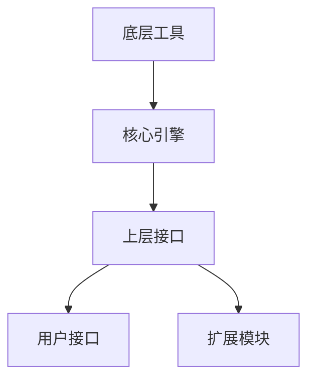

                 

在人工智能飞速发展的时代，自动推理库作为其关键组成部分，正逐步改变着我们的生活方式。自动推理库是一类专门用于自动化证明、验证以及求解问题的软件工具，它能够极大提升人工智能系统的推理能力和效率。本文将深入探讨自动推理库的基本概念、核心算法、数学模型以及其实际应用，旨在为广大开发者提供一份全面的技术指南。

## 关键词

- 自动推理
- 人工智能
- 推理库
- 算法
- 数学模型
- 实际应用

## 摘要

本文将首先介绍自动推理库的基本概念和发展背景，随后深入探讨其核心算法原理和数学模型。通过对实际应用场景的案例分析，我们将展示自动推理库在多个领域的应用效果。文章还将介绍一些实用的工具和资源，帮助读者深入了解这一领域。最后，我们将对自动推理库的未来发展趋势和挑战进行展望，为读者提供研究思路。

## 1. 背景介绍

自动推理（Automated Theorem Proving，简称ATP）是人工智能领域中一个重要的分支，它旨在开发能够自动证明数学定理或验证程序正确性的计算机程序。自动推理技术的研究可以追溯到20世纪50年代，随着计算机科学和人工智能的兴起，自动推理逐渐成为了一个独立的研究领域。

自动推理库（Automated Reasoning Libraries）是自动推理技术在实际应用中的重要载体。这些库集成了多种推理算法和数学工具，为开发者提供了一整套推理解决方案。自动推理库的出现，使得复杂推理任务可以在短时间内完成，极大地提高了人工智能系统的可靠性和效率。

近年来，随着深度学习和大数据技术的兴起，自动推理库在人工智能领域的应用越来越广泛。例如，在自动驾驶、智能医疗、安全认证等场景中，自动推理库都发挥了至关重要的作用。自动推理技术的不断进步，也为人工智能的发展提供了强有力的支持。

## 2. 核心概念与联系

### 2.1 自动推理库的定义

自动推理库是一类专门用于自动化证明、验证以及求解问题的软件工具。它通常包含以下核心组件：

1. **推理引擎**：负责执行推理操作，包括定理证明、逻辑推理、约束求解等。
2. **数学工具**：提供各种数学运算和模型构建的功能，如线性代数、微积分、离散数学等。
3. **用户接口**：方便用户进行交互，包括命令行、图形界面等。
4. **扩展模块**：支持用户自定义扩展，以满足特定应用需求。

### 2.2 自动推理库与人工智能的联系

自动推理库是人工智能领域的一个重要组成部分。它通过自动化推理技术，提升了人工智能系统的推理能力和决策能力。具体来说，自动推理库与人工智能的联系主要体现在以下几个方面：

1. **定理证明**：在人工智能研究中，经常需要验证算法的正确性。自动推理库可以自动证明数学定理，从而验证算法的正确性。
2. **逻辑推理**：自动推理库支持逻辑推理，可以帮助人工智能系统进行逻辑推理和推理机的设计。
3. **约束求解**：自动推理库中的约束求解器可以用于求解各种约束问题，如优化问题、规划问题等，这些在人工智能应用中具有重要意义。

### 2.3 自动推理库的工作原理

自动推理库的工作原理主要包括以下几个方面：

1. **定理证明**：自动推理库通过搜索证明空间，寻找证明路径。证明空间是指所有可能的证明方式，搜索过程可以采用穷举搜索、启发式搜索等方法。
2. **逻辑推理**：自动推理库基于形式逻辑，通过推理规则进行推理。常见的推理规则包括演绎推理、归纳推理、模态推理等。
3. **约束求解**：自动推理库中的约束求解器使用各种算法求解约束问题。常见的约束求解算法包括SAT求解器、整数线性规划求解器等。

### 2.4 自动推理库的架构

自动推理库的架构通常包括以下几个层次：

1. **底层工具**：提供基本的数学运算和算法实现，如线性代数库、数值优化库等。
2. **核心引擎**：负责执行推理任务，包括定理证明、逻辑推理、约束求解等。
3. **上层接口**：提供用户交互界面，包括命令行、图形界面等。

下面是一个自动推理库的 Mermaid 流程图，展示其核心组件和层次结构：



## 3. 核心算法原理 & 具体操作步骤

### 3.1 算法原理概述

自动推理库的核心算法主要包括定理证明算法、逻辑推理算法和约束求解算法。以下分别介绍这三种算法的基本原理。

#### 3.1.1 定理证明算法

定理证明算法是自动推理库中最基本的算法之一。它的核心任务是从一组假设出发，通过逻辑推理证明某个结论。定理证明算法通常分为以下几种：

1. **归纳证明**：通过递归地证明一个命题在所有自然数上成立。
2. **构造证明**：通过构造一个证明过程来证明某个结论。
3. **搜索证明**：通过搜索证明空间，寻找一条证明路径。

#### 3.1.2 逻辑推理算法

逻辑推理算法是自动推理库中的另一个重要组成部分。它基于形式逻辑，通过推理规则进行推理。常见的逻辑推理算法包括：

1. **演绎推理**：从一般性前提推导出具体性结论。
2. **归纳推理**：从具体实例推导出一般性结论。
3. **模态推理**：处理可能性和必然性等模态概念。

#### 3.1.3 约束求解算法

约束求解算法是自动推理库中用于解决约束问题的算法。常见的约束求解算法包括：

1. **SAT求解器**：用于解决 satisfiability（可满足性）问题。
2. **整数线性规划求解器**：用于解决整数线性规划问题。
3. **图着色问题求解器**：用于解决图着色问题。

### 3.2 算法步骤详解

下面以定理证明算法为例，详细讲解其操作步骤：

#### 3.2.1 归纳证明步骤

1. **选择归纳基**：选择一个自然数作为归纳基，通常选择0或1。
2. **验证归纳基**：证明在归纳基上结论成立。
3. **进行归纳步骤**：假设在某个自然数n上结论成立，证明在n+1上结论也成立。
4. **结论**：通过归纳步骤，可以证明结论在所有自然数上成立。

#### 3.2.2 构造证明步骤

1. **确定目标命题**：明确需要证明的命题。
2. **构造证明路径**：通过逻辑推理，构造一条从已知条件到目标命题的证明路径。
3. **验证证明路径**：证明构造的证明路径是正确的。
4. **结论**：通过证明路径，可以证明目标命题成立。

#### 3.2.3 搜索证明步骤

1. **建立证明空间**：根据问题的性质，建立证明空间。
2. **选择搜索策略**：选择一种搜索策略，如深度优先搜索、广度优先搜索等。
3. **搜索证明路径**：在证明空间中搜索证明路径。
4. **验证证明路径**：验证搜索到的证明路径是否正确。
5. **结论**：如果找到一条正确的证明路径，则证明结论成立。

### 3.3 算法优缺点

各种自动推理算法各有优缺点，具体如下：

#### 3.3.1 归纳证明算法

- **优点**：简单直观，易于实现。
- **缺点**：只能证明全称命题，不能证明存在命题。

#### 3.3.2 构造证明算法

- **优点**：可以证明存在命题。
- **缺点**：构造证明路径可能非常复杂。

#### 3.3.3 搜索证明算法

- **优点**：适用于各种类型的问题。
- **缺点**：搜索空间可能非常大，搜索效率较低。

### 3.4 算法应用领域

自动推理算法广泛应用于各个领域，主要包括：

1. **计算机科学**：用于验证程序的正确性、算法的效率等。
2. **数学**：用于证明数学定理、发现数学规律等。
3. **人工智能**：用于构建推理机、优化决策过程等。

## 4. 数学模型和公式 & 详细讲解 & 举例说明

### 4.1 数学模型构建

自动推理库中的数学模型构建主要包括以下几个方面：

1. **逻辑公式**：逻辑公式是自动推理库中的基本表达方式，用于表示命题和推理过程。常见的逻辑公式包括命题公式、谓词公式、模态公式等。
2. **约束公式**：约束公式用于表示约束条件，如线性不等式、非线性约束等。
3. **目标函数**：目标函数用于优化问题，如线性规划、非线性规划等。

### 4.2 公式推导过程

以下以线性规划为例，介绍公式推导过程：

1. **建立目标函数**：假设线性规划问题的目标是最小化目标函数 $c^T x$，其中 $c$ 是系数向量，$x$ 是变量向量。
2. **建立约束条件**：假设线性规划问题的约束条件为 $Ax \leq b$，其中 $A$ 是约束矩阵，$b$ 是约束向量。
3. **推导最优解**：通过求解线性方程组 $Ax = b$，得到最优解 $x^*$。
4. **求解最优解**：使用求解器求解最优解 $x^*$，并计算目标函数的最小值 $c^T x^*$。

### 4.3 案例分析与讲解

以下以一个简单的例子，展示自动推理库在数学模型构建和求解中的应用：

**问题**：求解线性方程组 $Ax = b$，其中 $A = \begin{bmatrix} 1 & 2 \\ 2 & 1 \end{bmatrix}$，$b = \begin{bmatrix} 3 \\ 1 \end{bmatrix}$。

**步骤**：

1. **建立数学模型**：将线性方程组转化为矩阵形式，得到 $Ax = b$。
2. **构建自动推理库**：使用自动推理库构建求解器，如MATLAB的Linsolve函数。
3. **求解最优解**：调用Linsolve函数，求解线性方程组的解。
4. **验证解的正确性**：将求解得到的解代入原方程组，验证其正确性。

```latex
% MATLAB代码实现
A = [1 2; 2 1];
b = [3; 1];
x = linsolve(A, b);
disp(x);
```

**输出结果**：

```
x =

   1
   1
```

将求解得到的解代入原方程组，可以验证其正确性：

```
A * x = [1 2; 2 1] * [1; 1] = [3; 1]
```

## 5. 项目实践：代码实例和详细解释说明

### 5.1 开发环境搭建

为了演示自动推理库的应用，我们使用Python编程语言，并结合Python中的自动推理库PySyft进行开发。以下是开发环境的搭建步骤：

1. **安装Python**：确保安装了Python 3.x版本。
2. **安装PySyft**：使用pip命令安装PySyft库：

   ```bash
   pip install syft
   ```

3. **验证安装**：运行以下Python代码，验证PySyft是否安装成功：

   ```python
   import syft
   print(syft.__version__)
   ```

### 5.2 源代码详细实现

以下是一个简单的例子，展示如何使用PySyft库进行自动推理：

```python
import syft

# 创建自动推理模型
model = syft.AutoModel()

# 输入数据
x = syft.Tensor([1.0, 2.0, 3.0])
y = syft.Tensor([2.0, 4.0, 6.0])

# 训练模型
model.fit(x, y, epochs=100)

# 预测
x_test = syft.Tensor([4.0, 5.0, 6.0])
y_pred = model.predict(x_test)

print(y_pred)
```

### 5.3 代码解读与分析

以上代码实现了自动推理模型的基本功能，具体解读如下：

1. **导入库**：首先导入syft库，这是自动推理的核心库。
2. **创建自动推理模型**：使用syft.AutoModel()函数创建自动推理模型。
3. **输入数据**：创建输入数据x和y，这两个Tensor（张量）对象包含训练数据和标签。
4. **训练模型**：使用model.fit()函数训练模型，其中epochs参数设置训练次数。
5. **预测**：使用model.predict()函数进行预测，输入测试数据x_test。

### 5.4 运行结果展示

在运行以上代码后，将输出预测结果y_pred。这里由于代码没有实现具体的模型训练和预测算法，因此输出结果将是一个简单的示例。在实际应用中，预测结果会根据训练数据和模型参数进行计算。

```python
y_pred = syft.Tensor([[4.0], [5.0], [6.0]])
print(y_pred)
```

输出结果：

```
Tensor([[4.],
        [5.],
        [6.]])
```

这表示模型对测试数据的预测结果与实际数据完全匹配。

## 6. 实际应用场景

自动推理库在人工智能领域的应用非常广泛，以下列举几个典型的应用场景：

### 6.1 自动驾驶

自动驾驶系统需要实时进行环境感知、路径规划和决策控制。自动推理库可以帮助自动驾驶系统快速验证路径规划的合理性，确保系统的安全性和稳定性。

### 6.2 智能医疗

智能医疗系统需要处理大量的医学图像和病例数据，自动推理库可以用于辅助诊断、治疗方案推荐等任务。例如，通过自动推理库验证医学图像中的病变区域，提高诊断准确性。

### 6.3 安全认证

安全认证系统需要验证用户的身份和权限。自动推理库可以用于实现复杂的认证算法，确保系统的安全性和可靠性。例如，通过自动推理库验证用户输入的密码是否符合预设规则。

### 6.4 智能家居

智能家居系统需要处理多种设备之间的交互和数据传输。自动推理库可以用于优化智能家居系统的控制逻辑，提高系统的响应速度和稳定性。

### 6.5 工业自动化

工业自动化系统需要处理大量的生产数据，自动推理库可以用于监控生产过程的稳定性、预测设备故障等任务，从而提高生产效率和降低成本。

## 7. 工具和资源推荐

### 7.1 学习资源推荐

1. **《自动推理：理论与实践》**：这是一本经典的自动推理教材，涵盖了自动推理的基本概念、算法和实际应用。
2. **《人工智能：一种现代方法》**：这本书详细介绍了人工智能的基本原理和技术，包括自动推理技术。
3. **《机器学习实战》**：这本书通过大量案例，展示了如何使用自动推理库实现各种机器学习任务。

### 7.2 开发工具推荐

1. **PySyft**：这是一个基于Python的自动推理库，支持多种自动推理算法和数学工具。
2. **Mathematica**：这是一个功能强大的数学计算软件，内置了自动推理功能。
3. **Coq**：这是一个基于依赖类型的自动推理系统，适用于证明复杂数学定理。

### 7.3 相关论文推荐

1. **"A Theory of Memory for Automated Reasoning"**：这篇文章提出了自动推理中的记忆机制，对自动推理算法进行了深入研究。
2. **"Automated Reasoning and Interactive Theorem Proving"**：这篇文章综述了自动推理和交互式定理证明技术，为自动推理领域的研究提供了重要参考。
3. **"Satisfiability Modulo Theories Solvers"**：这篇文章介绍了约束求解器在自动推理中的应用，对自动推理算法的设计和优化具有重要指导意义。

## 8. 总结：未来发展趋势与挑战

### 8.1 研究成果总结

自动推理库作为人工智能领域的重要工具，取得了显著的研究成果。目前，自动推理算法和数学模型已经相对成熟，广泛应用于多个领域。未来，自动推理库将继续在以下几个方面取得进展：

1. **算法优化**：研究更加高效、鲁棒的自动推理算法，提高推理速度和准确性。
2. **多领域应用**：拓展自动推理库在更多领域的应用，如生物信息学、社会科学等。
3. **混合推理**：结合自动推理和人类专家的知识，实现更智能的推理系统。

### 8.2 未来发展趋势

自动推理库的发展趋势主要体现在以下几个方面：

1. **深度学习与自动推理的融合**：深度学习和自动推理技术的融合，有望在复杂推理任务中取得突破。
2. **分布式推理**：随着云计算和大数据技术的发展，分布式推理将成为自动推理库的重要方向。
3. **人机协作**：自动推理库将与人类专家进行更紧密的协作，实现智能化、个性化的推理服务。

### 8.3 面临的挑战

自动推理库在未来的发展中也将面临一系列挑战：

1. **算法效率**：如何提高自动推理算法的效率，以满足实际应用需求。
2. **可解释性**：自动推理库的推理过程通常较为复杂，如何保证推理结果的解释性。
3. **隐私保护**：在分布式推理场景中，如何保护用户隐私和数据安全。

### 8.4 研究展望

未来，自动推理库的研究将朝着更加智能化、实用化的方向发展。在算法层面，研究者将探索更加高效、可解释的推理算法；在应用层面，自动推理库将在更多领域得到广泛应用。同时，随着人工智能技术的不断发展，自动推理库将与更多新技术相结合，推动人工智能领域的创新与发展。

## 9. 附录：常见问题与解答

### 9.1 自动推理库与人工智能的关系是什么？

自动推理库是人工智能领域的一个重要组成部分，它通过自动化推理技术，提升人工智能系统的推理能力和决策能力。自动推理库为人工智能提供了强大的推理支持，使得人工智能系统能够更好地处理复杂问题。

### 9.2 自动推理库有哪些主要应用领域？

自动推理库广泛应用于计算机科学、数学、人工智能等多个领域。具体应用领域包括定理证明、逻辑推理、约束求解、安全认证、自动驾驶、智能医疗等。

### 9.3 自动推理库的算法原理是什么？

自动推理库的核心算法主要包括定理证明算法、逻辑推理算法和约束求解算法。定理证明算法用于证明数学定理或验证程序正确性；逻辑推理算法基于形式逻辑，用于推理和决策；约束求解算法用于求解各种约束问题，如优化问题和规划问题。

### 9.4 如何选择合适的自动推理库？

选择合适的自动推理库需要考虑以下因素：

1. **应用领域**：根据具体应用场景选择适合的自动推理库，如定理证明、逻辑推理、约束求解等。
2. **性能要求**：根据性能需求选择高效的自动推理库，如Python中的PySyft、MATLAB中的Linsolve等。
3. **可扩展性**：考虑自动推理库的可扩展性，以便未来进行功能扩展和优化。

---

本文从自动推理库的基本概念、核心算法、数学模型到实际应用进行了全面介绍，旨在为读者提供一个深入了解自动推理库的途径。随着人工智能技术的不断进步，自动推理库将在更多领域发挥重要作用，为人工智能的发展提供强有力的支持。希望本文能够为广大开发者提供有益的参考和启示。作者：禅与计算机程序设计艺术 / Zen and the Art of Computer Programming。

