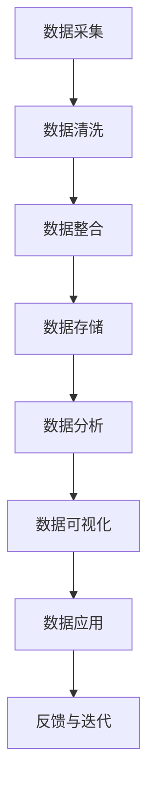

                 

自动驾驶行业正以前所未有的速度发展，数据挖掘与分析在其中扮演着至关重要的角色。本文旨在介绍自动驾驶公司如何构建一个高效的数据挖掘与分析平台，以支持其业务需求，并探索该平台对自动驾驶系统性能的潜在影响。

## 关键词
- 自动驾驶
- 数据挖掘
- 分析平台
- 机器学习
- 数据处理
- 人工智能

## 摘要
本文首先介绍了自动驾驶行业的发展背景和需求，接着详细讨论了数据挖掘与分析平台的核心概念与联系。随后，文章深入分析了核心算法原理与具体操作步骤，以及数学模型和公式。文章随后通过项目实践展示了如何搭建和实现数据挖掘与分析平台。最后，本文探讨了该平台在实际应用场景中的价值，并对其未来发展进行了展望。

## 1. 背景介绍
自动驾驶技术正逐步从科幻走向现实，成为汽车制造业和科技领域的热点。自动驾驶系统依赖于大量的数据采集和处理，这些数据包括道路环境、车辆状态、驾驶行为等。这些数据的质量和准确性直接影响自动驾驶系统的性能和安全性。

### 1.1 行业发展趋势
自动驾驶行业正经历着快速的发展，从L0（无自动化）到L5（完全自动化）的各个级别都在逐步实现商业化。随着技术的进步，自动驾驶车辆的数据量也在快速增长。据统计，一辆L4级别的自动驾驶车辆每小时可以产生约1TB的数据。

### 1.2 业务需求
自动驾驶公司需要高效的数据挖掘与分析平台来处理这些庞大的数据集。这些平台不仅需要处理实时数据，还需要支持历史数据的分析和预测。业务需求包括：
- 数据清洗与预处理
- 数据存储与管理
- 数据分析与可视化
- 预测建模与优化

## 2. 核心概念与联系
构建数据挖掘与分析平台首先需要明确几个核心概念，包括数据来源、数据类型、数据处理流程和数据应用场景。

### 2.1 数据来源
自动驾驶公司的数据来源广泛，包括但不限于：
- 感知系统数据：如摄像头、激光雷达、超声波传感器等。
- 车辆状态数据：如速度、加速度、油门、刹车等。
- 环境数据：如天气、路况、交通信号等。

### 2.2 数据类型
自动驾驶数据类型多样，主要包括：
- 结构化数据：如数据库中的表格数据。
- 非结构化数据：如图像、视频、文本等。
- 半结构化数据：如XML、JSON等格式。

### 2.3 数据处理流程
数据处理流程包括以下几个阶段：
1. 数据采集：从各种传感器和外部系统获取数据。
2. 数据清洗：去除噪声、填补缺失值、纠正错误数据。
3. 数据整合：将不同来源、类型和格式的数据整合到一起。
4. 数据存储：将处理后的数据存储到数据库或数据仓库中。
5. 数据分析：运用各种算法对数据进行分析和挖掘。
6. 数据可视化：通过图表、报表等形式展示分析结果。

### 2.4 数据应用场景
自动驾驶公司的数据应用场景丰富，主要包括：
- 驾驶行为分析：分析驾驶习惯、安全性等。
- 车辆性能监控：监测车辆运行状态、故障预测等。
- 路网优化：分析交通流量、优化交通信号等。
- 智能决策支持：为自动驾驶系统提供决策支持。

### 2.5 Mermaid 流程图
下面是一个Mermaid流程图，展示了自动驾驶数据挖掘与分析平台的基本架构：



## 3. 核心算法原理 & 具体操作步骤

### 3.1 算法原理概述
数据挖掘与分析平台的核心算法主要包括机器学习算法和统计分析方法。这些算法用于从数据中提取有价值的信息和模式。

### 3.2 算法步骤详解

#### 3.2.1 数据预处理
数据预处理是数据挖掘的重要步骤，包括以下内容：
- 缺失值处理：使用插值、平均值等方法填补缺失值。
- 异常值检测：使用统计方法检测并处理异常值。
- 特征选择：选择与目标变量相关的特征。

#### 3.2.2 特征工程
特征工程是数据挖掘中的关键步骤，包括以下内容：
- 特征提取：从原始数据中提取新的特征。
- 特征转换：如归一化、标准化等。
- 特征选择：使用特征选择算法筛选出最优特征。

#### 3.2.3 模型选择
根据业务需求选择合适的机器学习模型，如回归模型、分类模型、聚类模型等。

#### 3.2.4 模型训练与验证
使用训练集对模型进行训练，并使用验证集进行验证。

#### 3.2.5 模型评估
使用测试集对模型进行评估，常见的评估指标包括准确率、召回率、F1值等。

#### 3.2.6 模型部署
将训练好的模型部署到实际应用中，如自动驾驶系统。

### 3.3 算法优缺点
- **机器学习算法**：优点包括自动提取特征、自适应能力强，缺点是计算复杂度高、对数据质量要求高。
- **统计分析方法**：优点是简单易懂、计算效率高，缺点是灵活性较低、难以处理复杂问题。

### 3.4 算法应用领域
机器学习算法在自动驾驶领域的应用非常广泛，包括但不限于：
- 驾驶行为分析
- 车辆故障预测
- 路网流量预测
- 自动驾驶系统优化

## 4. 数学模型和公式 & 详细讲解 & 举例说明

### 4.1 数学模型构建
自动驾驶数据挖掘与分析平台通常使用以下数学模型：
- 神经网络模型
- 决策树模型
- 支持向量机模型
- 贝叶斯模型

### 4.2 公式推导过程
以神经网络模型为例，其基本公式如下：
$$
\begin{aligned}
z &= W \cdot x + b \\
a &= \sigma(z) \\
\end{aligned}
$$
其中，$W$ 是权重矩阵，$x$ 是输入向量，$b$ 是偏置项，$\sigma$ 是激活函数。

### 4.3 案例分析与讲解
以下是一个使用神经网络模型进行自动驾驶车辆故障预测的案例：

#### 数据集
我们使用一个包含10,000个样本的数据集，每个样本包括5个输入特征和1个目标变量。

#### 模型构建
使用一个简单的神经网络模型，包括一个输入层、一个隐藏层和一个输出层。

#### 模型训练
使用反向传播算法训练模型，训练过程如下：
1. 前向传播：计算输出值。
2. 计算损失函数：均方误差（MSE）。
3. 反向传播：更新权重和偏置项。

#### 模型评估
使用测试集对模型进行评估，评估指标包括准确率、召回率、F1值等。

## 5. 项目实践：代码实例和详细解释说明

### 5.1 开发环境搭建
搭建开发环境，包括Python编程语言、NumPy、Pandas、Scikit-learn、TensorFlow等库。

### 5.2 源代码详细实现
以下是一个使用Scikit-learn库实现自动驾驶车辆故障预测的代码示例：

```python
from sklearn.model_selection import train_test_split
from sklearn.neural_network import MLPClassifier
from sklearn.metrics import accuracy_score, recall_score, f1_score

# 加载数据集
X, y = load_data()

# 划分训练集和测试集
X_train, X_test, y_train, y_test = train_test_split(X, y, test_size=0.2, random_state=42)

# 创建神经网络模型
model = MLPClassifier(hidden_layer_sizes=(100,), max_iter=1000)

# 训练模型
model.fit(X_train, y_train)

# 预测测试集
y_pred = model.predict(X_test)

# 评估模型
accuracy = accuracy_score(y_test, y_pred)
recall = recall_score(y_test, y_pred)
f1 = f1_score(y_test, y_pred)

print(f"Accuracy: {accuracy:.2f}")
print(f"Recall: {recall:.2f}")
print(f"F1 Score: {f1:.2f}")
```

### 5.3 代码解读与分析
代码首先加载数据集，然后使用Scikit-learn库的`train_test_split`函数划分训练集和测试集。接着，创建了一个简单的神经网络模型`MLPClassifier`，并使用反向传播算法训练模型。最后，使用训练好的模型对测试集进行预测，并评估模型的性能。

## 6. 实际应用场景

### 6.1 驾驶行为分析
自动驾驶公司可以通过数据挖掘与分析平台对驾驶行为进行分析，识别异常驾驶行为，如超速、急刹车等，从而提高道路安全性。

### 6.2 车辆性能监控
通过实时数据分析和历史数据分析，自动驾驶公司可以监控车辆的性能，预测可能的故障，提前进行维护，减少停机时间和维修成本。

### 6.3 路网优化
自动驾驶公司可以通过分析交通数据，优化交通信号、路线规划等，提高道路通行效率，减少交通拥堵。

### 6.4 未来应用展望
随着自动驾驶技术的不断发展，数据挖掘与分析平台将在自动驾驶行业的各个领域发挥越来越重要的作用。未来，我们有望看到更多基于大数据和人工智能的自动驾驶解决方案，如智能停车、智能配送等。

## 7. 工具和资源推荐

### 7.1 学习资源推荐
- 《Python数据科学手册》
- 《机器学习实战》
- 《深度学习》（Goodfellow, Bengio, Courville）

### 7.2 开发工具推荐
- Jupyter Notebook：强大的交互式编程环境。
- PyCharm：功能丰富的Python IDE。
- Git：版本控制系统。

### 7.3 相关论文推荐
- “Deep Learning for Autonomous Driving” by D. Silver et al.
- “Data-Driven Optimization for Autonomous Driving” by M. Berthold et al.

## 8. 总结：未来发展趋势与挑战

### 8.1 研究成果总结
自动驾驶数据挖掘与分析平台在驾驶行为分析、车辆性能监控、路网优化等方面取得了显著成果。

### 8.2 未来发展趋势
随着技术的进步，自动驾驶数据挖掘与分析平台将更加智能化、自动化，支持更复杂的数据处理和分析任务。

### 8.3 面临的挑战
自动驾驶数据挖掘与分析平台面临的挑战包括数据处理的高效性、算法的准确性、数据的隐私保护等。

### 8.4 研究展望
未来，自动驾驶数据挖掘与分析平台的研究将重点关注数据挖掘算法的创新、大规模数据处理技术、以及人工智能与自动驾驶的深度融合。

## 9. 附录：常见问题与解答

### 9.1 如何处理大量实时数据？
使用流处理技术，如Apache Kafka和Apache Flink，实时处理和分析大量数据。

### 9.2 数据隐私如何保护？
采用数据脱敏技术和加密算法，确保数据在传输和存储过程中的安全性。

### 9.3 如何优化算法性能？
使用并行计算和分布式计算技术，提高算法的执行效率。

---

作者：禅与计算机程序设计艺术 / Zen and the Art of Computer Programming

本文介绍了自动驾驶公司的数据挖掘与分析平台，探讨了其在自动驾驶系统中的重要性以及未来发展前景。通过本文的阅读，读者可以对自动驾驶数据挖掘与分析平台有更深入的了解，为未来在自动驾驶领域的研究和应用提供指导。

