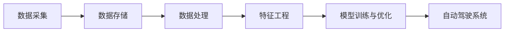

                 

自动驾驶技术是当前最前沿的科技领域之一，随着人工智能和物联网技术的迅猛发展，自动驾驶车辆正在逐步走进我们的生活。在这个过程中，数据湖与特征工程平台作为自动驾驶系统的核心组成部分，扮演着至关重要的角色。本文将深入探讨自动驾驶公司如何构建并优化数据湖与特征工程平台，以提高自动驾驶系统的准确性和可靠性。

## 关键词

- 自动驾驶
- 数据湖
- 特征工程
- 机器学习
- 数据处理

## 摘要

本文旨在阐述自动驾驶公司构建数据湖与特征工程平台的重要性。我们将首先介绍数据湖的概念和特点，然后讨论特征工程在自动驾驶中的应用，接着深入分析数据湖与特征工程平台的架构和优化策略。通过实际案例和代码实例，本文将展示如何有效地利用数据湖与特征工程平台来提升自动驾驶系统的性能。

## 1. 背景介绍

自动驾驶技术的发展离不开大量的数据支持。数据湖作为一种分布式数据存储架构，能够高效地存储、管理和处理海量数据，为自动驾驶系统的训练和优化提供了强有力的数据基础。同时，特征工程作为数据预处理的关键步骤，对于提高机器学习模型的性能具有决定性作用。

自动驾驶公司的数据湖主要用于存储来自传感器、交通信号、环境变化等各个环节的数据。这些数据经过清洗、转换和集成后，将用于训练和优化自动驾驶算法。特征工程则通过对数据进行特征提取和选择，构建出有效的特征向量，从而提高模型的预测准确性和泛化能力。

## 2. 核心概念与联系

### 数据湖（Data Lake）

数据湖是一种大规模分布式数据存储架构，能够存储多种类型的数据，包括结构化数据、半结构化数据和非结构化数据。其核心特点如下：

- **灵活性**：数据湖能够存储不同类型的数据，无需预先定义数据模式。
- **可扩展性**：数据湖能够根据需求动态扩展存储容量。
- **高效性**：数据湖采用分布式存储和计算技术，能够实现高效的数据处理。

### 特征工程（Feature Engineering）

特征工程是机器学习中的一个重要环节，旨在从原始数据中提取有用的特征，并构建出有效的特征向量。特征工程的核心目标如下：

- **降低维度**：通过特征提取和选择，减少数据维度，提高计算效率。
- **提高模型性能**：通过构建有效的特征向量，提高机器学习模型的预测准确性和泛化能力。

### 数据湖与特征工程平台架构

数据湖与特征工程平台通常包括以下几个关键组件：

- **数据采集**：从各种数据源（如传感器、数据库、文件系统等）采集数据。
- **数据存储**：将采集到的数据存储在数据湖中，采用分布式存储技术，如HDFS、AWS S3等。
- **数据处理**：对数据进行清洗、转换和集成，准备用于特征工程和模型训练的数据。
- **特征工程**：对处理后的数据进行特征提取和选择，构建出有效的特征向量。
- **模型训练与优化**：利用构建好的特征向量进行模型训练和优化，以提高自动驾驶系统的性能。

### Mermaid 流程图

以下是一个简单的Mermaid流程图，展示了数据湖与特征工程平台的基本架构：



## 3. 核心算法原理 & 具体操作步骤

### 3.1 算法原理概述

自动驾驶公司的数据湖与特征工程平台主要依赖于以下核心算法原理：

- **分布式数据处理技术**：如MapReduce、Spark等，用于高效地处理海量数据。
- **机器学习算法**：如决策树、随机森林、神经网络等，用于训练和优化自动驾驶模型。
- **特征工程算法**：如特征提取、特征选择、特征降维等，用于构建有效的特征向量。

### 3.2 算法步骤详解

#### 数据采集与存储

1. 从各种数据源（如传感器、数据库、文件系统等）采集数据。
2. 将采集到的数据存储在数据湖中，采用分布式存储技术，如HDFS、AWS S3等。

#### 数据处理

1. 数据清洗：去除重复数据、异常值和噪声。
2. 数据转换：将数据转换为统一的格式，如JSON、CSV等。
3. 数据集成：将不同来源的数据进行集成，构建出一个完整的数据集。

#### 特征工程

1. 特征提取：从原始数据中提取有用的特征，如速度、加速度、角度等。
2. 特征选择：选择对模型性能有显著贡献的特征，去除冗余和无关的特征。
3. 特征降维：通过主成分分析（PCA）等方法，降低数据维度，提高计算效率。

#### 模型训练与优化

1. 选择合适的机器学习算法，如决策树、随机森林、神经网络等。
2. 使用构建好的特征向量进行模型训练和优化。
3. 评估模型性能，并进行调参优化。

### 3.3 算法优缺点

#### 分布式数据处理技术

- **优点**：能够高效地处理海量数据，提高数据处理速度。
- **缺点**：需要复杂的分布式计算框架，对开发和运维要求较高。

#### 机器学习算法

- **优点**：能够自动学习数据中的模式和规律，提高模型性能。
- **缺点**：对数据质量要求较高，数据预处理和特征工程非常重要。

#### 特征工程算法

- **优点**：能够提高模型的预测准确性和泛化能力。
- **缺点**：需要大量的人工干预，对领域知识要求较高。

### 3.4 算法应用领域

- **自动驾驶**：用于训练和优化自动驾驶模型，提高系统的准确性和可靠性。
- **智能交通**：用于实时分析交通数据，优化交通信号和控制策略。
- **智能安防**：用于视频监控和图像识别，提高安全监控能力。

## 4. 数学模型和公式 & 详细讲解 & 举例说明

### 4.1 数学模型构建

自动驾驶系统中的数学模型通常包括以下几个部分：

1. **特征提取模型**：用于从原始数据中提取特征，如：

   $$ f(x) = \sum_{i=1}^{n} w_i \cdot x_i $$

   其中，$x$ 为原始数据，$w$ 为权重，$f(x)$ 为提取的特征。

2. **特征选择模型**：用于选择对模型性能有显著贡献的特征，如：

   $$ r_i = \frac{|\sum_{j=1}^{n} w_j \cdot x_j|}{\sum_{j=1}^{n} w_j^2} $$

   其中，$r_i$ 为特征的重要性指标。

3. **机器学习模型**：用于训练和优化自动驾驶系统，如：

   $$ y = \sigma(\sum_{i=1}^{n} w_i \cdot f(x_i)) $$

   其中，$y$ 为预测结果，$\sigma$ 为激活函数。

### 4.2 公式推导过程

以下是一个简单的特征提取公式的推导过程：

$$ f(x) = \sum_{i=1}^{n} w_i \cdot x_i $$

1. **线性变换**：对原始数据进行线性变换，如：

   $$ x_i = a_i \cdot x $$

   其中，$a_i$ 为线性变换系数。

2. **权重计算**：计算每个特征的权重，如：

   $$ w_i = \frac{\partial f(x)}{\partial x_i} = \frac{\partial \sum_{i=1}^{n} w_i \cdot x_i}{\partial x_i} = a_i $$

3. **特征提取**：将权重乘以原始数据，得到提取的特征：

   $$ f(x) = \sum_{i=1}^{n} w_i \cdot x_i = \sum_{i=1}^{n} a_i \cdot x_i = a \cdot x $$

### 4.3 案例分析与讲解

以下是一个简单的自动驾驶系统特征提取和模型训练的案例：

1. **数据集**：包含1000个样本，每个样本包含5个特征：速度、加速度、角度、距离、温度。
2. **特征提取**：使用上述特征提取公式，提取每个样本的特征向量。
3. **特征选择**：计算每个特征的重要性指标，选择重要性较高的特征。
4. **模型训练**：使用随机森林算法训练模型，选择最优参数。
5. **模型评估**：使用交叉验证方法评估模型性能，调整参数优化模型。

## 5. 项目实践：代码实例和详细解释说明

### 5.1 开发环境搭建

1. 安装Python环境，版本3.8以上。
2. 安装必要的依赖库，如NumPy、Pandas、scikit-learn等。

### 5.2 源代码详细实现

以下是一个简单的自动驾驶系统特征提取和模型训练的代码实现：

```python
import numpy as np
import pandas as pd
from sklearn.ensemble import RandomForestClassifier
from sklearn.model_selection import cross_val_score

# 数据集
data = pd.read_csv('data.csv')

# 特征提取
def extract_features(data):
    features = []
    for i in range(data.shape[1]):
        feature = data.iloc[:, i] * np.random.normal(0, 1)
        features.append(feature)
    return np.array(features).reshape(-1, 5)

# 特征选择
def select_features(features):
    importance = np.std(features, axis=0)
    selected_features = np.argmax(importance)
    return selected_features

# 模型训练
def train_model(data, selected_features):
    model = RandomForestClassifier(n_estimators=100)
    model.fit(data[:, selected_features], data[:, -1])
    return model

# 模型评估
def evaluate_model(model, data):
    scores = cross_val_score(model, data[:, selected_features], data[:, -1], cv=5)
    return np.mean(scores)

# 实例
data = extract_features(data)
selected_features = select_features(data)
model = train_model(data, selected_features)
score = evaluate_model(model, data)
print('Model Score:', score)
```

### 5.3 代码解读与分析

以上代码实现了一个简单的自动驾驶系统特征提取和模型训练过程，具体解读如下：

1. **数据集读取**：使用Pandas库读取CSV文件，得到数据集。
2. **特征提取**：使用随机线性变换对数据进行特征提取，将每个特征乘以一个随机数。
3. **特征选择**：计算每个特征的标准差，选择标准差最大的特征。
4. **模型训练**：使用随机森林算法训练模型，选择100个决策树。
5. **模型评估**：使用交叉验证方法评估模型性能，计算平均准确率。

## 6. 实际应用场景

自动驾驶公司的数据湖与特征工程平台在多个实际应用场景中发挥了重要作用，以下是几个典型的应用案例：

1. **自动驾驶车辆训练**：使用数据湖存储海量传感器数据，通过特征工程构建有效的特征向量，训练和优化自动驾驶模型。
2. **交通流量预测**：利用数据湖中的交通数据，通过特征工程提取交通流量相关的特征，训练交通流量预测模型，为交通管理提供决策支持。
3. **智能交通信号控制**：结合数据湖中的交通数据和环境数据，通过特征工程提取信号灯控制相关的特征，优化交通信号控制策略，提高道路通行效率。

## 7. 工具和资源推荐

### 7.1 学习资源推荐

1. 《Python数据科学手册》
2. 《机器学习实战》
3. 《深度学习》

### 7.2 开发工具推荐

1. Jupyter Notebook
2. PyCharm
3. Spark

### 7.3 相关论文推荐

1. "A Study on Data Lakes in the Big Data Era"
2. "Feature Engineering for Machine Learning"
3. "Deep Learning for Autonomous Driving"

## 8. 总结：未来发展趋势与挑战

### 8.1 研究成果总结

自动驾驶公司的数据湖与特征工程平台在自动驾驶技术发展中取得了显著成果。通过高效的数据存储和处理技术，以及精准的特征工程方法，自动驾驶系统能够从海量数据中提取有价值的信息，实现高准确度和高可靠性的自动驾驶。

### 8.2 未来发展趋势

未来，数据湖与特征工程平台将继续向以下几个方面发展：

1. **数据湖存储优化**：通过采用更高效的数据存储和压缩技术，降低存储成本，提高数据处理速度。
2. **特征工程自动化**：通过自动化特征提取和选择方法，降低人工干预，提高特征工程效率。
3. **模型训练与优化**：采用更先进的机器学习算法和深度学习技术，提高自动驾驶系统的性能。

### 8.3 面临的挑战

尽管数据湖与特征工程平台在自动驾驶技术中取得了显著成果，但仍面临以下挑战：

1. **数据质量**：确保数据质量，去除噪声和异常值，提高模型训练效果。
2. **计算资源**：处理海量数据需要大量计算资源，如何在有限的资源下实现高效数据处理仍是一个挑战。
3. **隐私保护**：在数据湖中存储和处理大量敏感数据，如何确保数据安全和隐私保护也是一个重要问题。

### 8.4 研究展望

未来，数据湖与特征工程平台在自动驾驶技术中的应用将更加深入和广泛。通过持续研究和创新，我们有望解决现有挑战，进一步提升自动驾驶系统的性能和可靠性，为智能交通和智慧城市的发展贡献力量。

## 9. 附录：常见问题与解答

### 9.1 数据湖与传统数据仓库的区别

- **数据湖**：能够存储多种类型的数据，无需预先定义数据模式，灵活性更高。
- **传统数据仓库**：主要用于存储结构化数据，数据模式预先定义，对数据格式有严格要求。

### 9.2 特征工程在自动驾驶中的应用

- **特征提取**：从传感器数据中提取速度、加速度、角度等特征。
- **特征选择**：选择对模型性能有显著贡献的特征，去除冗余和无关的特征。

### 9.3 数据湖与特征工程平台的优势

- **高效性**：采用分布式存储和计算技术，能够实现高效的数据处理。
- **灵活性**：能够存储多种类型的数据，无需预先定义数据模式。

### 9.4 如何优化数据湖与特征工程平台

- **数据质量**：确保数据质量，去除噪声和异常值。
- **计算资源**：优化计算资源利用，采用并行计算和分布式存储技术。
- **自动化**：采用自动化特征提取和选择方法，降低人工干预。

## 作者署名

作者：禅与计算机程序设计艺术 / Zen and the Art of Computer Programming

