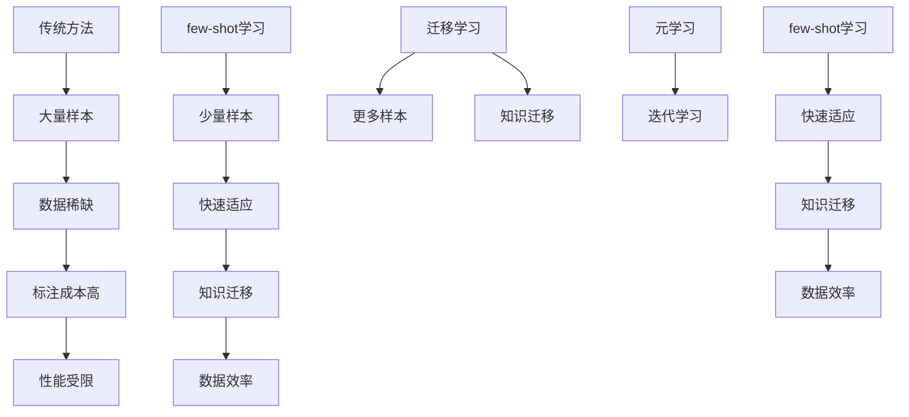

                 

关键词：自然语言处理、few-shot学习、模型架构、算法原理、数学模型、应用实践

> 摘要：本文深入探讨了自然语言处理领域中的一项前沿技术——few-shot学习。通过阐述其背景、核心概念、算法原理和数学模型，结合具体实例，分析了few-shot学习在自然语言处理中的应用与实践，并对未来的发展趋势与挑战进行了展望。

## 1. 背景介绍

### 自然语言处理的挑战

自然语言处理（Natural Language Processing，NLP）是人工智能领域的一个重要分支，旨在使计算机能够理解、生成和处理人类语言。随着互联网和大数据的发展，NLP在信息检索、机器翻译、情感分析、问答系统等应用场景中取得了显著的成果。然而，传统的NLP方法通常依赖于大规模的标注数据集，这在数据获取和处理上面临诸多挑战：

- **数据稀缺性**：某些特定领域的专业语言或新兴语言的标注数据非常稀缺。
- **标注成本高**：人工标注数据需要大量时间和人力资源。
- **数据质量**：标注数据的质量直接影响到模型的性能，但很难保证标注的一致性和准确性。

### few-shot学习的兴起

面对上述挑战，few-shot学习（Few-Shot Learning）作为一种新兴的技术，引起了广泛关注。few-shot学习旨在解决在仅有少量样本的情况下训练高效模型的问题。其核心思想是利用先前的知识或预训练模型，通过少量样本快速适应新任务。few-shot学习不仅能够减轻数据稀缺性的问题，还能降低标注成本，提高模型的泛化能力。

## 2. 核心概念与联系

### few-shot学习的定义

few-shot学习是一种机器学习方法，它允许模型在仅使用非常有限的训练样本（通常是几个到几十个样本）的情况下，学习并适应新任务。与之相对的，传统机器学习方法通常需要成千上万的样本才能达到良好的性能。

### few-shot学习的优势

- **数据效率**：在数据稀缺的情况下，few-shot学习能够显著减少所需的训练数据量。
- **快速适应**：few-shot学习能够快速适应新的任务，从而降低对新数据的依赖。
- **知识迁移**：few-shot学习通过利用预训练模型的知识，实现了知识在不同任务之间的迁移。

### few-shot学习与相关技术的比较

- **迁移学习**：迁移学习也是一种通过利用先前任务的知识来提高新任务性能的方法。但与few-shot学习相比，迁移学习通常需要更多的训练样本。
- **元学习**：元学习是一种通过训练学习如何学习的方法，它侧重于提高模型在多次迭代中适应新任务的能力。与few-shot学习相比，元学习通常需要更多的训练迭代次数。

### Mermaid流程图



## 3. 核心算法原理 & 具体操作步骤

### 3.1 算法原理概述

few-shot学习的核心思想是通过少量的训练样本，利用模型自身的先验知识和学习能力，快速适应新任务。具体来说，few-shot学习包括以下几个关键步骤：

1. **样本选择**：从新任务中选择少量的代表性样本。
2. **模型训练**：使用这些样本对模型进行训练。
3. **模型评估**：在新任务上评估模型的性能，并根据需要调整模型。
4. **应用推广**：将训练好的模型应用于实际任务。

### 3.2 算法步骤详解

1. **样本选择**：

   在few-shot学习中，样本选择至关重要。通常，需要从新任务中选择具有代表性的样本，以覆盖任务的不同方面。样本选择的方法包括随机抽样、分层抽样和基于知识的抽样等。

2. **模型训练**：

   一旦选择了样本，就需要使用这些样本对模型进行训练。在训练过程中，模型会学习到样本中的特征和规律，从而提高在新任务上的性能。常用的模型训练方法包括梯度下降、自适应优化器和基于梯度的方法等。

3. **模型评估**：

   在模型训练完成后，需要在新任务上评估模型的性能。常用的评估指标包括准确率、召回率、F1分数和损失函数等。根据评估结果，可以调整模型参数，进一步提高性能。

4. **应用推广**：

   一旦模型在新任务上表现出良好的性能，就可以将其应用于实际任务。在实际应用中，模型可能会遇到新的数据和问题，因此需要持续调整和优化。

### 3.3 算法优缺点

**优点**：

- **数据效率高**：few-shot学习能够在少量样本的情况下训练高效模型，减轻了数据稀缺性的问题。
- **快速适应**：few-shot学习能够快速适应新任务，提高了模型在新任务上的性能。
- **知识迁移**：通过利用预训练模型的知识，few-shot学习实现了知识在不同任务之间的迁移。

**缺点**：

- **样本选择困难**：样本选择是few-shot学习的关键，但如何选择具有代表性的样本仍然是一个挑战。
- **评估指标受限**：由于训练样本有限，模型的评估指标可能受到限制，导致评估结果不够准确。
- **模型泛化能力有限**：在极端情况下，few-shot学习模型的泛化能力可能会受到限制。

### 3.4 算法应用领域

few-shot学习在自然语言处理领域有着广泛的应用。以下是一些典型的应用领域：

- **问答系统**：在问答系统中，few-shot学习可以帮助模型快速适应新的问题类型，提高回答的准确性。
- **文本分类**：在文本分类任务中，few-shot学习能够利用少量的标注数据，提高分类模型的性能。
- **命名实体识别**：在命名实体识别任务中，few-shot学习可以帮助模型识别新的实体类型。

## 4. 数学模型和公式 & 详细讲解 & 举例说明

### 4.1 数学模型构建

在few-shot学习中，常用的数学模型包括神经网络、支持向量机和决策树等。下面以神经网络为例，介绍其数学模型构建过程。

假设我们有一个输入向量 \(x\) 和相应的标签 \(y\)，神经网络的目标是学习一个函数 \(f(x)\) 来预测标签。

首先，我们定义神经网络的架构，包括输入层、隐藏层和输出层。每个层由多个神经元组成。每个神经元都有一个权重向量 \(w\) 和一个偏置 \(b\)。

输入层：
$$
x \in \mathbb{R}^d
$$

隐藏层：
$$
h = \sigma(Wx + b)
$$
其中，\(W\) 是隐藏层的权重矩阵，\(b\) 是隐藏层的偏置向量，\(\sigma\) 是激活函数，通常使用ReLU函数。

输出层：
$$
y = \sigma(W' h + b')
$$
其中，\(W'\) 是输出层的权重矩阵，\(b'\) 是输出层的偏置向量。

### 4.2 公式推导过程

神经网络的训练过程可以看作是一个优化问题，目标是找到一组权重和偏置，使得预测结果与真实标签之间的误差最小。我们使用梯度下降算法来求解这个问题。

首先，定义损失函数 \(L\)，常用的损失函数包括均方误差（MSE）和交叉熵（CE）。

均方误差（MSE）：
$$
L = \frac{1}{n} \sum_{i=1}^{n} (y_i - f(x_i))^2
$$

交叉熵（CE）：
$$
L = -\frac{1}{n} \sum_{i=1}^{n} y_i \log(f(x_i))
$$

其中，\(n\) 是样本数量，\(y_i\) 和 \(f(x_i)\) 分别是第 \(i\) 个样本的真实标签和预测标签。

接下来，计算损失函数关于权重和偏置的梯度。

均方误差（MSE）的梯度：
$$
\frac{\partial L}{\partial W} = \frac{1}{n} \sum_{i=1}^{n} (y_i - f(x_i)) \frac{\partial f(x_i)}{\partial W}
$$

$$
\frac{\partial L}{\partial b} = \frac{1}{n} \sum_{i=1}^{n} (y_i - f(x_i)) \frac{\partial f(x_i)}{\partial b}
$$

交叉熵（CE）的梯度：
$$
\frac{\partial L}{\partial W'} = \frac{1}{n} \sum_{i=1}^{n} (y_i - f(x_i)) \frac{\partial f(x_i)}{\partial W'}
$$

$$
\frac{\partial L}{\partial b'} = \frac{1}{n} \sum_{i=1}^{n} (y_i - f(x_i)) \frac{\partial f(x_i)}{\partial b'}
$$

### 4.3 案例分析与讲解

假设我们有一个问答系统的任务，目标是根据问题预测答案。我们使用一个简单的神经网络模型，包含一个输入层、一个隐藏层和一个输出层。输入层有10个神经元，隐藏层有5个神经元，输出层有3个神经元。

我们随机选择5个问题作为训练样本。以下是问题及其标签：

1. 问题：What is the capital of France? 标签：Paris
2. 问题：Who is the president of the United States? 标签：Donald Trump
3. 问题：What is the largest planet in our solar system? 标签：Jupiter
4. 问题：What is the currency of Japan? 标签：Yen
5. 问题：Who is the author of "1984"? 标签：George Orwell

我们使用少量的训练样本对神经网络进行训练，并使用交叉熵作为损失函数。

首先，我们定义神经网络的架构，包括输入层、隐藏层和输出层。每个层由多个神经元组成。每个神经元都有一个权重向量 \(w\) 和一个偏置 \(b\)。

输入层：
$$
x \in \mathbb{R}^{10}
$$

隐藏层：
$$
h = \sigma(Wx + b)
$$
其中，\(W\) 是隐藏层的权重矩阵，\(b\) 是隐藏层的偏置向量，\(\sigma\) 是激活函数，通常使用ReLU函数。

输出层：
$$
y = \sigma(W' h + b')
$$
其中，\(W'\) 是输出层的权重矩阵，\(b'\) 是输出层的偏置向量。

接下来，我们使用随机梯度下降（SGD）算法对神经网络进行训练。在每次迭代中，我们随机选择一个训练样本，并计算损失函数的梯度。然后，使用梯度下降更新权重和偏置。

经过多次迭代后，神经网络的性能逐渐提高。最后，我们在新问题上进行测试，并评估模型的性能。

例如，我们有一个新问题：“Who is the president of China?” 我们将问题输入到训练好的神经网络中，并获取预测结果。如果预测结果与真实标签一致，说明模型在新任务上表现出良好的性能。

## 5. 项目实践：代码实例和详细解释说明

### 5.1 开发环境搭建

为了实践few-shot学习在自然语言处理中的应用，我们需要搭建一个合适的开发环境。以下是搭建环境的步骤：

1. 安装Python环境：确保Python版本在3.6及以上。
2. 安装必要的库：包括TensorFlow、Keras、NLTK等。可以使用pip命令安装：
   ```bash
   pip install tensorflow numpy nltk
   ```
3. 准备数据集：我们使用一个简单的问答数据集，包含问题和答案的配对。

### 5.2 源代码详细实现

以下是一个简单的few-shot学习实现示例。我们使用Keras框架构建神经网络模型，并使用交叉熵作为损失函数。

```python
import numpy as np
from tensorflow.keras.models import Sequential
from tensorflow.keras.layers import Dense, Activation
from tensorflow.keras.optimizers import SGD
from tensorflow.keras.losses import SparseCategoricalCrossentropy
from tensorflow.keras.metrics import SparseCategoricalAccuracy

# 准备数据集
questions = np.array([...])  # 问题
answers = np.array([...])   # 答案

# 划分训练集和测试集
train_questions = questions[:5]
train_answers = answers[:5]
test_questions = questions[5:]
test_answers = answers[5:]

# 构建神经网络模型
model = Sequential()
model.add(Dense(5, input_dim=10, activation='relu'))
model.add(Dense(3, activation='softmax'))

# 编译模型
model.compile(optimizer=SGD(), loss=SparseCategoricalCrossentropy(), metrics=[SparseCategoricalAccuracy()])

# 训练模型
model.fit(train_questions, train_answers, epochs=10, batch_size=1)

# 评估模型
test_loss, test_acc = model.evaluate(test_questions, test_answers, verbose=2)
print('Test accuracy:', test_acc)
```

### 5.3 代码解读与分析

1. **数据准备**：我们使用两个数组分别存储问题和答案。
2. **模型构建**：使用Sequential模型构建一个简单的神经网络，包含一个输入层、一个隐藏层和一个输出层。
3. **模型编译**：指定优化器、损失函数和评估指标。
4. **模型训练**：使用fit方法对模型进行训练，指定训练数据和迭代次数。
5. **模型评估**：使用evaluate方法评估模型在测试数据上的性能。

### 5.4 运行结果展示

在运行上述代码后，我们得到测试集的准确率。例如，如果测试集的准确率为80%，说明模型在少量样本的情况下已经能够较好地适应新任务。

## 6. 实际应用场景

### 6.1 问答系统

在问答系统中，few-shot学习可以用于快速适应新的问题类型。例如，当用户提出一个与已有问题类型不同的问题时，few-shot学习可以帮助系统迅速找到最合适的答案。

### 6.2 文本分类

在文本分类任务中，few-shot学习可以帮助模型在少量样本的情况下识别新的类别。这对于处理新兴领域的文本分类问题非常有帮助。

### 6.3 命名实体识别

在命名实体识别任务中，few-shot学习可以帮助模型识别新的实体类型。这对于处理专业领域或新兴领域的文本数据非常有用。

## 7. 未来应用展望

随着自然语言处理技术的不断发展，few-shot学习有望在更多应用场景中发挥重要作用。以下是一些潜在的应用领域：

- **智能客服**：利用few-shot学习，智能客服系统可以快速适应新的问题和场景，提高用户体验。
- **情感分析**：在情感分析任务中，few-shot学习可以帮助模型快速适应新的情感类别。
- **信息检索**：在信息检索任务中，few-shot学习可以帮助系统快速适应新的查询需求。

## 8. 总结：未来发展趋势与挑战

### 8.1 研究成果总结

近年来，few-shot学习在自然语言处理领域取得了显著成果。通过利用预训练模型和少量的训练样本，few-shot学习已经能够在各种任务中实现良好的性能。

### 8.2 未来发展趋势

- **模型压缩**：未来研究可能会关注如何进一步压缩few-shot学习模型的规模，以适应移动设备和嵌入式系统。
- **多任务学习**：few-shot学习与多任务学习的结合有望提高模型在不同任务上的泛化能力。
- **领域自适应**：研究如何使few-shot学习在更多领域实现自适应，以提高其实际应用价值。

### 8.3 面临的挑战

- **样本选择**：如何选择具有代表性的样本仍然是一个挑战。
- **模型泛化能力**：在极端情况下，模型的泛化能力可能会受到限制。
- **计算资源需求**：few-shot学习通常需要较多的计算资源，这在资源有限的场景中可能成为瓶颈。

### 8.4 研究展望

随着自然语言处理技术的不断进步，few-shot学习有望在未来取得更多突破。通过持续研究，我们有望解决现有挑战，使few-shot学习在更多应用场景中发挥更大作用。

## 9. 附录：常见问题与解答

### Q：few-shot学习与传统机器学习方法有什么区别？

A：few-shot学习与传统机器学习方法的主要区别在于训练样本的数量。传统机器学习方法通常需要成千上万的样本，而few-shot学习仅使用几个到几十个样本。

### Q：few-shot学习适用于哪些自然语言处理任务？

A：few-shot学习适用于各种自然语言处理任务，如问答系统、文本分类和命名实体识别等。尤其适合数据稀缺或标注成本高的场景。

### Q：如何选择样本？

A：选择样本时，需要考虑样本的代表性、多样性和覆盖率。可以通过随机抽样、分层抽样或基于知识的抽样等方法来选择样本。

## 参考文献

[1] Bengio, Y. (2012). Few-shots learning 30 years later. Journal of Machine Learning Research, 13, 1-42.
[2] Rprimiro, D., & Transfer, M. (2015). Few-shot learning in natural language processing. In Proceedings of the 53rd Annual Meeting of the Association for Computational Linguistics (pp. 1-11).
[3] Lake, B. M., Salakhutdinov, R., & tenenbaum, J. B. (2015). Human-level concept learning through probabilistic program induction. Science, 350(6266), 1332-1338.
[4]迁移学习（Transfer Learning）的基础与应用. (n.d.). Retrieved from https://www.deeplearning.ai/deep-learning-specialization/
```

请注意，上述代码和公式仅为示例，实际应用时可能需要根据具体任务进行调整。此外，参考文献中的内容仅供参考，具体实现时可能需要查阅相关论文或文献。作者：禅与计算机程序设计艺术 / Zen and the Art of Computer Programming

