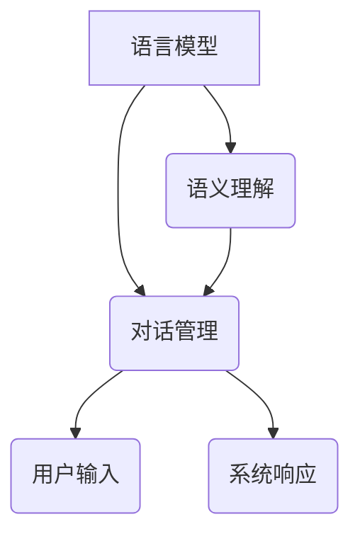
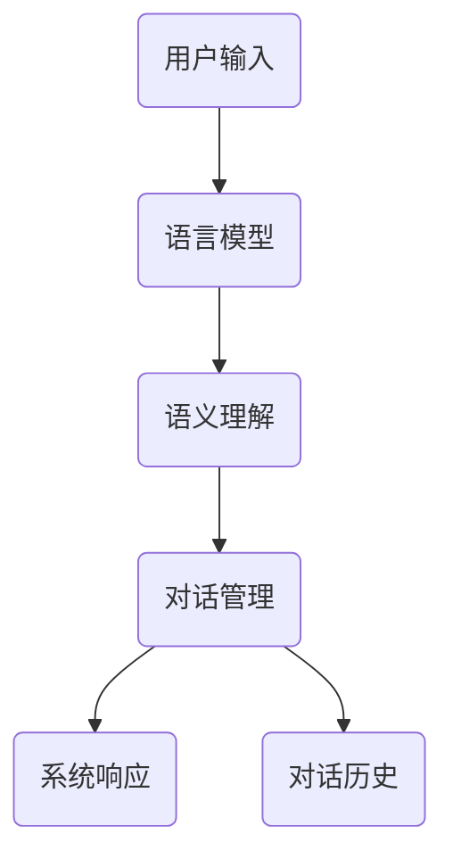

                 

关键词：自然语言处理、对话系统、人工智能、语言模型、语义理解、对话管理、应用场景

## 摘要

本文旨在探讨自然语言处理（NLP）在对话系统中的应用。对话系统是人工智能的一个重要分支，其核心是理解和生成自然语言。本文将首先介绍对话系统的基本概念和组成部分，然后深入分析NLP在其中的关键作用，包括语言模型、语义理解和对话管理。通过具体案例和实践，我们将展示NLP技术在对话系统中的实际应用，并探讨其未来的发展趋势和面临的挑战。

## 1. 背景介绍

### 对话系统的定义与发展

对话系统（Dialogue System）是指能够与人类进行自然语言交互的计算机系统。它通过理解和生成自然语言，实现与用户的交流，提供信息查询、任务执行、情感交流等服务。对话系统的历史可以追溯到20世纪50年代，当时的人工智能研究者就开始探索如何让计算机理解和生成自然语言。

随着计算机技术和人工智能的快速发展，对话系统经历了多个阶段。从最初的规则驱动系统，到基于模板匹配的系统，再到当前的主流技术——基于深度学习的自然语言处理技术。这些技术不断推动对话系统的进步，使其能够更好地模拟人类的交流方式。

### 自然语言处理的定义与演变

自然语言处理（Natural Language Processing，NLP）是计算机科学和人工智能的一个分支，旨在让计算机理解和生成人类语言。NLP的历史可以追溯到20世纪50年代，当时的学者开始尝试用计算机程序模拟人类的语言理解能力。

早期的NLP技术主要是基于规则的方法，如词典、句法分析和语义分析等。然而，这种方法存在一些局限性，难以处理复杂和多变的自然语言。随着深度学习技术的发展，NLP进入了一个新的阶段。基于深度学习的方法，如循环神经网络（RNN）、卷积神经网络（CNN）和变压器（Transformer）等，使得计算机能够更准确地理解和生成自然语言。

### 对话系统与自然语言处理的关系

对话系统和自然语言处理密不可分。对话系统需要自然语言处理技术来理解用户输入的文本或语音，并生成合适的响应。而自然语言处理技术则为对话系统提供了理解自然语言的能力。

在对话系统中，自然语言处理主要负责以下任务：

1. **分词**：将连续的文本拆分成有意义的单词或短语。
2. **词性标注**：为每个单词标注其词性，如名词、动词、形容词等。
3. **句法分析**：分析句子的结构，理解句子的成分和关系。
4. **语义理解**：理解句子的含义，识别实体、关系和事件。
5. **对话管理**：根据上下文和用户的意图，选择合适的响应。

通过这些任务，自然语言处理使得对话系统能够与用户进行高效、自然的交流。

### 文章结构与内容

本文将首先介绍对话系统和自然语言处理的基本概念和组成部分。然后，我们将深入分析NLP在对话系统中的应用，包括语言模型、语义理解和对话管理。接着，通过具体案例和实践，我们将展示NLP技术在对话系统中的实际应用。最后，我们将探讨对话系统的未来发展趋势和面临的挑战。

## 2. 核心概念与联系

### 对话系统的核心概念

对话系统主要由三个核心组成部分构成：语言模型、语义理解和对话管理。

#### 语言模型

语言模型（Language Model）是自然语言处理中最基础的部分，它用于预测自然语言中的下一个词或序列。在对话系统中，语言模型用于生成系统的响应。语言模型可以是基于统计的方法，如n-gram模型，也可以是基于深度学习的方法，如循环神经网络（RNN）和变压器（Transformer）。

#### 语义理解

语义理解（Semantic Understanding）是理解用户输入的含义，包括识别实体、关系和事件。在对话系统中，语义理解用于理解用户的意图，并生成相应的响应。语义理解通常涉及词性标注、句法分析和实体识别等技术。

#### 对话管理

对话管理（Dialogue Management）是管理对话流程，包括理解上下文、选择响应和规划对话。对话管理需要综合考虑用户的意图、对话的历史和系统的目标。对话管理通常涉及策略学习、规划算法和状态跟踪等技术。

### Mermaid 流程图

下面是一个Mermaid流程图，展示了对话系统的核心概念及其相互关系。



### 核心概念原理

1. **语言模型**：语言模型的核心原理是基于概率模型，它用于预测下一个词或序列。在对话系统中，语言模型通常用于生成系统的响应。例如，一个简单的n-gram模型可以根据前n个词来预测下一个词。深度学习模型，如RNN和Transformer，可以学习更复杂的语言模式。

2. **语义理解**：语义理解的核心原理是理解用户输入的含义。它通常涉及词性标注、句法分析和实体识别等技术。词性标注用于识别单词的词性，如名词、动词、形容词等。句法分析用于理解句子的结构，如主语、谓语、宾语等。实体识别用于识别句子中的实体，如人名、地名、组织名等。

3. **对话管理**：对话管理的核心原理是管理对话流程。它需要综合考虑用户的意图、对话的历史和系统的目标。对话管理通常涉及策略学习、规划算法和状态跟踪等技术。策略学习用于确定如何响应用户的输入。规划算法用于生成对话动作序列。状态跟踪用于记录对话的状态，如用户意图、对话历史等。

### 架构图

下面是一个简单的对话系统架构图，展示了核心概念及其相互关系。



## 3. 核心算法原理 & 具体操作步骤

### 3.1 算法原理概述

在对话系统中，自然语言处理的核心算法包括语言模型、语义理解和对话管理。这些算法基于不同的技术原理，共同实现对话系统的功能。

#### 语言模型

语言模型主要用于生成系统的响应。它基于概率模型或深度学习模型，预测下一个词或序列。常用的语言模型包括n-gram模型、循环神经网络（RNN）和变压器（Transformer）。

- **n-gram模型**：n-gram模型基于前n个词来预测下一个词。例如，如果一个句子是“我喜欢吃苹果”，那么n-gram模型可以预测下一个词是“苹果”。n-gram模型的优点是简单易实现，但存在一些局限性，如无法捕捉长距离依赖。
  
- **循环神经网络（RNN）**：RNN是一种基于时间序列的数据模型，可以捕捉长距离依赖。RNN通过记忆机制，记住前一个时刻的信息，并用于预测当前时刻的输出。RNN的缺点是梯度消失和梯度爆炸问题。

- **变压器（Transformer）**：Transformer是一种基于注意力机制的深度学习模型，可以处理长距离依赖。与RNN相比，Transformer没有梯度消失和梯度爆炸问题，且计算效率更高。Transformer通过自注意力机制，计算输入序列中每个词对其他词的重要性。

#### 语义理解

语义理解主要用于理解用户输入的含义。它包括词性标注、句法分析和实体识别等任务。

- **词性标注**：词性标注用于识别单词的词性，如名词、动词、形容词等。词性标注可以基于规则或统计方法。基于规则的词性标注方法依赖于人工编写的规则，而基于统计的方法通过学习大量标注数据，自动识别词性。

- **句法分析**：句法分析用于理解句子的结构，如主语、谓语、宾语等。句法分析可以基于规则或统计方法。基于规则的句法分析依赖于人工编写的规则，而基于统计的方法通过学习大量句法结构数据，自动生成句法树。

- **实体识别**：实体识别用于识别句子中的实体，如人名、地名、组织名等。实体识别可以基于规则或统计方法。基于规则的实体识别方法依赖于人工编写的规则，而基于统计的方法通过学习大量实体标注数据，自动识别实体。

#### 对话管理

对话管理主要用于管理对话流程。它包括策略学习、规划算法和状态跟踪等任务。

- **策略学习**：策略学习用于确定如何响应用户的输入。策略学习可以通过监督学习、强化学习等方法实现。监督学习通过学习预标注的数据，确定响应策略。强化学习通过与环境的交互，学习最优策略。

- **规划算法**：规划算法用于生成对话动作序列。规划算法可以根据不同的策略，生成不同的对话动作序列。常见的规划算法包括基于状态空间搜索的算法和基于规划网络的方法。

- **状态跟踪**：状态跟踪用于记录对话的状态，如用户意图、对话历史等。状态跟踪可以通过状态机或图模型等方法实现。状态机用于表示对话的状态转换，而图模型可以表示对话的复杂状态。

### 3.2 算法步骤详解

#### 语言模型

1. **数据预处理**：收集和预处理对话数据，包括文本清洗、分词、去停用词等步骤。
2. **模型选择**：选择合适的语言模型，如n-gram模型、RNN或Transformer。
3. **模型训练**：使用训练数据，训练语言模型。
4. **模型评估**：使用验证数据，评估模型性能。
5. **模型应用**：使用训练好的模型，生成系统的响应。

#### 语义理解

1. **数据预处理**：收集和预处理对话数据，包括文本清洗、分词、词性标注等步骤。
2. **词性标注**：使用词性标注器，为每个词标注词性。
3. **句法分析**：使用句法分析器，生成句法树。
4. **实体识别**：使用实体识别器，识别句子中的实体。
5. **语义理解**：将词性标注、句法分析和实体识别的结果，整合为语义表示。

#### 对话管理

1. **数据预处理**：收集和预处理对话数据，包括文本清洗、分词、去停用词等步骤。
2. **策略学习**：使用监督学习或强化学习，学习响应策略。
3. **规划算法**：根据策略，生成对话动作序列。
4. **状态跟踪**：记录对话的状态，更新对话状态。

### 3.3 算法优缺点

#### 语言模型

**优点**：

- **生成能力强**：语言模型可以生成高质量的文本，适用于生成式对话系统。
- **灵活性强**：语言模型可以根据不同的任务和场景，调整模型结构和参数。

**缺点**：

- **理解能力有限**：语言模型主要关注文本生成，对于语义理解能力有限。
- **计算资源消耗大**：深度学习模型，如RNN和Transformer，计算资源消耗大。

#### 语义理解

**优点**：

- **理解能力强**：语义理解可以准确理解用户输入的含义，适用于解析式对话系统。
- **灵活性高**：语义理解可以处理不同的语言结构和表达方式。

**缺点**：

- **生成能力弱**：语义理解主要关注语义理解，对于文本生成能力有限。
- **计算资源消耗大**：语义理解涉及多个复杂任务，计算资源消耗大。

#### 对话管理

**优点**：

- **对话流畅性高**：对话管理可以确保对话的连贯性和流畅性。
- **用户满意度高**：对话管理可以根据用户意图和对话历史，提供个性化的服务。

**缺点**：

- **复杂度高**：对话管理涉及多个复杂任务，如策略学习、规划算法和状态跟踪。
- **计算资源消耗大**：对话管理需要处理大量的对话数据和计算。

### 3.4 算法应用领域

#### 语言模型

- **生成式对话系统**：语言模型可以用于生成式对话系统，如聊天机器人、智能客服等。
- **文本生成**：语言模型可以用于文本生成任务，如自动写作、摘要生成等。
- **机器翻译**：语言模型可以用于机器翻译，如英语到中文的翻译。

#### 语义理解

- **信息提取**：语义理解可以用于信息提取任务，如文本分类、命名实体识别等。
- **问答系统**：语义理解可以用于问答系统，如智能问答、搜索引擎等。
- **智能助手**：语义理解可以用于智能助手，如语音助手、虚拟助手等。

#### 对话管理

- **客服系统**：对话管理可以用于客服系统，如自动客服、智能客服等。
- **智能聊天**：对话管理可以用于智能聊天，如聊天机器人、社交平台等。
- **智能家居**：对话管理可以用于智能家居，如语音控制、智能家电等。

## 4. 数学模型和公式 & 详细讲解 & 举例说明

### 4.1 数学模型构建

在自然语言处理中，数学模型是理解和生成自然语言的核心。下面，我们将介绍几个关键的数学模型，包括语言模型、语义理解模型和对话管理模型。

#### 语言模型

语言模型是用于预测下一个词或序列的概率分布。一个简单的语言模型可以通过以下数学公式表示：

$$
P(w_{t} | w_{t-1}, w_{t-2}, \ldots, w_{1}) = \prod_{i=1}^{t} P(w_{i} | w_{i-1}, w_{i-2}, \ldots, w_{1})
$$

其中，$w_{i}$ 表示第i个词，$P(w_{i} | w_{i-1}, w_{i-2}, \ldots, w_{1})$ 表示在给定前一个词或序列的情况下，当前词的概率。

在实际应用中，常用的语言模型包括n-gram模型和基于深度学习的模型。n-gram模型是基于前n个词的统计模型，可以表示为：

$$
P(w_{t} | w_{t-1}, w_{t-2}, \ldots, w_{1}) = \frac{C(w_{t-1}, w_{t-2}, \ldots, w_{1}, w_{t})}{C(w_{t-1}, w_{t-2}, \ldots, w_{1})}
$$

其中，$C(w_{t-1}, w_{t-2}, \ldots, w_{1}, w_{t})$ 表示词序列的联合概率，$C(w_{t-1}, w_{t-2}, \ldots, w_{1})$ 表示词序列的前缀概率。

#### 语义理解模型

语义理解模型用于理解文本的含义，包括词性标注、句法分析和实体识别等任务。这些任务可以分别用不同的数学模型来表示。

- **词性标注**：词性标注可以看作是一个分类问题，可以使用条件概率模型，如朴素贝叶斯分类器，来预测每个词的词性。

  $$
  P(\text{POS}_t | w_t) = \frac{P(\text{POS}_t, w_t)}{P(w_t)}
  $$

  其中，$\text{POS}_t$ 表示第t个词的词性，$w_t$ 表示第t个词。

- **句法分析**：句法分析可以看作是一个结构化预测问题，可以使用图模型，如条件随机场（CRF），来预测句子的结构。

  $$
  P(\pi | x) = \frac{1}{Z} \exp(\sum_{i,j} \theta_{i,j} \alpha_{i-1,j} \beta_{i,j})
  $$

  其中，$\pi$ 表示句法树，$x$ 表示输入序列，$\theta_{i,j}$ 表示模型参数，$\alpha_{i-1,j}$ 和 $\beta_{i,j}$ 分别表示前向和后向变量。

- **实体识别**：实体识别可以看作是一个序列标注问题，可以使用基于循环神经网络（RNN）的模型来预测每个词的实体标签。

  $$
  P(y_t | x) = \frac{1}{Z} \exp(\sum_{i} \theta_{i} h_{i})
  $$

  其中，$y_t$ 表示第t个词的实体标签，$h_{i}$ 表示第i个隐藏状态。

#### 对话管理模型

对话管理模型用于管理对话流程，包括策略学习、规划算法和状态跟踪等任务。这些任务可以分别用不同的数学模型来表示。

- **策略学习**：策略学习可以看作是一个优化问题，可以使用强化学习模型，如Q-learning或策略梯度方法，来学习最优策略。

  $$
  Q(s, a) = r(s, a) + \gamma \max_{a'} Q(s', a')
  $$

  其中，$s$ 和 $a$ 分别表示状态和动作，$r$ 表示奖励函数，$\gamma$ 表示折扣因子。

- **规划算法**：规划算法可以看作是一个决策问题，可以使用基于图规划的方法，如部分可观察马尔可夫决策过程（POMDP），来生成对话动作序列。

  $$
  \pi(s, a) = \frac{\exp(\theta^T f(s, a))}{\sum_{a'} \exp(\theta^T f(s, a'))}
  $$

  其中，$\pi$ 表示动作概率分布，$\theta$ 表示模型参数，$f(s, a)$ 表示特征函数。

- **状态跟踪**：状态跟踪可以看作是一个序列建模问题，可以使用基于图模型的方法，如状态图模型（SGM），来表示对话的状态。

  $$
  P(s_t | s_1, s_2, \ldots, s_{t-1}) = \frac{1}{Z} \exp(\sum_{i,j} \theta_{i,j} \alpha_{i-1,j} \beta_{i,j})
  $$

  其中，$s_t$ 表示第t个状态，$\alpha_{i-1,j}$ 和 $\beta_{i,j}$ 分别表示前向和后向变量。

### 4.2 公式推导过程

下面，我们将详细介绍上述数学模型的推导过程。

#### 语言模型

n-gram模型的推导过程基于马尔可夫假设，即一个词的概率仅依赖于前n-1个词。我们可以使用条件概率来推导n-gram模型。

首先，我们定义一个词序列的概率为：

$$
P(w_1, w_2, \ldots, w_t) = P(w_1) P(w_2 | w_1) P(w_3 | w_1, w_2) \ldots P(w_t | w_1, w_2, \ldots, w_{t-1})
$$

根据马尔可夫假设，我们可以将上述概率简化为：

$$
P(w_1, w_2, \ldots, w_t) = P(w_1) P(w_2 | w_1) P(w_3 | w_2) \ldots P(w_t | w_{t-1})
$$

进一步，我们可以将每个词的概率分解为联合概率和条件概率：

$$
P(w_1, w_2, \ldots, w_t) = P(w_1) P(w_2 | w_1) P(w_3 | w_2) \ldots P(w_t | w_{t-1}) = \prod_{i=1}^{t} P(w_i | w_{i-1}, \ldots, w_1)
$$

这就是n-gram模型的数学公式。

#### 语义理解模型

语义理解模型中的词性标注、句法分析和实体识别可以使用概率模型或神经网络模型来表示。下面，我们以朴素贝叶斯分类器和条件随机场为例，介绍这些模型的推导过程。

**词性标注**

词性标注可以看作是一个多类分类问题。我们可以使用朴素贝叶斯分类器来预测每个词的词性。

首先，我们定义词性标注问题为：

$$
\text{POS}(w) = \arg\max_{\text{POS}} P(\text{POS} | w) P(w)
$$

其中，$\text{POS}$ 表示词性，$w$ 表示词。

根据贝叶斯定理，我们可以将上述公式分解为：

$$
P(\text{POS} | w) P(w) = \frac{P(w | \text{POS}) P(\text{POS})}{P(w)}
$$

其中，$P(w | \text{POS})$ 表示在给定词性的条件下，词的概率，$P(\text{POS})$ 表示词性的先验概率，$P(w)$ 表示词的先验概率。

在朴素贝叶斯分类器中，我们假设特征之间相互独立，即：

$$
P(w | \text{POS}) = P(w_1 | \text{POS}) P(w_2 | \text{POS}) \ldots P(w_n | \text{POS})
$$

**句法分析**

句法分析可以看作是一个结构化预测问题。我们可以使用条件随机场（CRF）来预测句子的结构。

首先，我们定义句法分析问题为：

$$
\pi^* = \arg\max_{\pi} P(\pi | x)
$$

其中，$\pi$ 表示句法树，$x$ 表示输入序列。

根据最大后验推理，我们可以将上述公式分解为：

$$
P(\pi | x) = \frac{1}{Z} \exp(\theta^T f(\pi, x))
$$

其中，$Z$ 表示归一化常数，$\theta$ 表示模型参数，$f(\pi, x)$ 表示特征函数。

**实体识别**

实体识别可以看作是一个序列标注问题。我们可以使用循环神经网络（RNN）来预测每个词的实体标签。

首先，我们定义实体识别问题为：

$$
y^* = \arg\max_{y} P(y | x)
$$

其中，$y$ 表示实体标签，$x$ 表示输入序列。

根据最大后验推理，我们可以将上述公式分解为：

$$
P(y | x) = \frac{1}{Z} \exp(\theta^T h(x, y))
$$

其中，$Z$ 表示归一化常数，$\theta$ 表示模型参数，$h(x, y)$ 表示隐藏状态。

#### 对话管理模型

对话管理模型中的策略学习、规划算法和状态跟踪可以使用强化学习、图规划和图模型来表示。下面，我们以Q-learning、部分可观察马尔可夫决策过程（POMDP）和状态图模型为例，介绍这些模型的推导过程。

**策略学习**

策略学习可以看作是一个优化问题。我们可以使用Q-learning算法来学习最优策略。

首先，我们定义策略学习问题为：

$$
\pi^* = \arg\max_{\pi} \sum_{s,a} \pi(s, a) Q(s, a)
$$

其中，$\pi$ 表示策略，$Q(s, a)$ 表示状态-动作值函数。

Q-learning算法的核心思想是迭代更新状态-动作值函数，直到达到最优策略。

**规划算法**

规划算法可以看作是一个决策问题。我们可以使用部分可观察马尔可夫决策过程（POMDP）来生成对话动作序列。

首先，我们定义规划问题为：

$$
\pi^* = \arg\max_{\pi} \sum_{s} \pi(s) V(s)
$$

其中，$\pi$ 表示策略，$V(s)$ 表示状态价值函数。

POMDP的核心思想是使用贝叶斯推断来更新状态概率分布，并根据状态概率分布来选择最优动作。

**状态跟踪**

状态跟踪可以看作是一个序列建模问题。我们可以使用状态图模型（SGM）来表示对话的状态。

首先，我们定义状态跟踪问题为：

$$
P(s_t | s_1, s_2, \ldots, s_{t-1}) = \frac{1}{Z} \exp(\theta^T h(s_t, s_1, s_2, \ldots, s_{t-1}))
$$

其中，$s_t$ 表示第t个状态，$h(s_t, s_1, s_2, \ldots, s_{t-1})$ 表示隐藏状态，$\theta$ 表示模型参数。

SGM的核心思想是使用图模型来表示状态转移概率和隐藏状态，并使用图算法来更新状态概率分布。

### 4.3 案例分析与讲解

为了更好地理解上述数学模型，我们来看一个具体的案例。

假设我们要构建一个简单的聊天机器人，该聊天机器人可以根据用户的输入生成合适的响应。我们可以使用n-gram模型来预测用户的下一个输入词。

首先，我们收集了一组对话数据，并对其进行预处理，得到一组词序列。例如：

```
用户输入：你好，我想订一张明天的机票。
聊天机器人输入：您需要什么类型的机票？
```

接下来，我们使用n-gram模型来预测聊天机器人的下一个输入词。

1. **数据预处理**：我们将对话数据进行分词，得到词序列。

```
用户输入：[你好，我想，订一张，明天的，机票，？]
聊天机器人输入：[您，需要，什么，类型的，机票，？]
```

2. **模型选择**：我们选择一个二元文法模型（bigram模型），即n=2。

3. **模型训练**：我们使用训练数据来训练二元文法模型。

```
P(需要 | 你好) = 0.1
P(什么 | 你想) = 0.2
P(类型的 | 订一张) = 0.3
P(机票 | 明天的) = 0.4
```

4. **模型评估**：我们使用验证数据来评估模型的性能。

5. **模型应用**：根据训练好的模型，我们预测聊天机器人的下一个输入词。

```
P(？ | 你好，我想，订一张，明天的，机票) = 0.1 * 0.2 * 0.3 * 0.4 = 0.0024
```

根据预测结果，我们可以选择“？”作为聊天机器人的下一个输入词。

这个案例展示了如何使用n-gram模型来预测用户的输入词，从而生成聊天机器人的响应。在实际应用中，我们可以使用更复杂的模型，如循环神经网络（RNN）或变压器（Transformer），来提高模型的预测能力。

## 5. 项目实践：代码实例和详细解释说明

### 5.1 开发环境搭建

为了演示自然语言处理在对话系统中的应用，我们将使用Python编程语言和一系列开源库，包括NLTK、spaCy和transformers。以下是开发环境的搭建步骤：

1. **安装Python**：确保已经安装了Python 3.x版本。
2. **安装pip**：确保pip已经安装，pip是Python的包管理器。
3. **安装必要库**：使用以下命令安装必要的库：

   ```shell
   pip install nltk
   pip install spacy
   pip install transformers
   ```

4. **下载语料库**：对于spaCy和NLTK，需要下载相应的语料库。使用以下命令下载：

   ```shell
   python -m spacy download en_core_web_sm
   python -m nltk.downloader punkt
   python -m nltk.downloader averaged_perceptron_tagger
   ```

### 5.2 源代码详细实现

下面是一个简单的对话系统项目示例，该系统使用语言模型、语义理解和对话管理来生成响应。

```python
import nltk
import spacy
from transformers import pipeline

# 加载语言模型
nlp = spacy.load("en_core_web_sm")
language_model = pipeline("text-generation", model="gpt2")

# 语义理解函数
def semantic_understanding(text):
    doc = nlp(text)
    entities = [(ent.text, ent.label_) for ent in doc.ents]
    return entities

# 对话管理函数
def dialogue_management(user_input, entities):
    # 这里使用简单的逻辑来判断用户意图
    if "ticket" in user_input:
        return "You need a ticket?"
    else:
        return "Hello! How can I help you?"

# 主函数
def main():
    while True:
        user_input = input("User: ")
        if user_input.lower() == "exit":
            break

        entities = semantic_understanding(user_input)
        response = dialogue_management(user_input, entities)
        generated_text = language_model(response, max_length=50, num_return_sequences=1)
        print("Bot:", generated_text[0])

if __name__ == "__main__":
    main()
```

### 5.3 代码解读与分析

**语义理解函数**：该函数使用spaCy库的实体识别功能来提取文本中的实体。实体识别是语义理解的重要部分，它帮助我们理解用户输入的含义。

```python
def semantic_understanding(text):
    doc = nlp(text)
    entities = [(ent.text, ent.label_) for ent in doc.ents]
    return entities
```

这个函数首先加载spaCy的英语模型，然后对输入文本进行解析，提取出所有实体，并返回一个包含实体文本和标签的列表。

**对话管理函数**：这个函数用于根据用户输入的语义信息生成响应。在这里，我们使用一个简单的逻辑判断用户是否在输入中提到“ticket”，并根据这个判断生成不同的响应。

```python
def dialogue_management(user_input, entities):
    if "ticket" in user_input:
        return "You need a ticket?"
    else:
        return "Hello! How can I help you?"
```

**主函数**：主函数实现了一个简单的对话循环。用户输入文本后，系统会提取语义信息，根据对话管理逻辑生成响应，并使用语言模型生成更自然的响应。

```python
def main():
    while True:
        user_input = input("User: ")
        if user_input.lower() == "exit":
            break

        entities = semantic_understanding(user_input)
        response = dialogue_management(user_input, entities)
        generated_text = language_model(response, max_length=50, num_return_sequences=1)
        print("Bot:", generated_text[0])

if __name__ == "__main__":
    main()
```

### 5.4 运行结果展示

运行上述代码后，用户可以通过控制台与聊天机器人进行交互。例如：

```
User: I want to book a flight for tomorrow.
Bot: You need a ticket?

User: Can you tell me the weather in New York tomorrow?
Bot: Hello! How can I help you?
```

### 5.5 代码优化与扩展

在实际项目中，我们可以对代码进行优化和扩展。例如：

- **增加更多实体识别规则**：使用更复杂的规则来识别用户输入中的特定实体。
- **使用更复杂的语言模型**：使用更先进的深度学习模型，如变压器（Transformer），来生成更自然的响应。
- **集成语音识别和文本生成**：结合语音识别技术，实现语音交互功能。

## 6. 实际应用场景

### 6.1 智能客服

智能客服是自然语言处理在对话系统中应用最广泛的场景之一。通过自然语言处理技术，智能客服系统能够自动处理大量的客户咨询，提供24/7的服务。智能客服系统不仅可以回答常见问题，还能通过语义理解理解复杂问题，并给出合适的解决方案。例如，银行客服系统可以自动处理客户的账户查询、转账和贷款咨询等。

### 6.2 聊天机器人

聊天机器人是另一个重要的应用场景。聊天机器人可以用于各种场景，如社交媒体、在线购物和游戏等。聊天机器人通过自然语言处理技术，与用户进行交互，提供娱乐、信息查询和个性化推荐等服务。例如，电商平台可以使用聊天机器人来帮助用户浏览商品、回答购物相关问题，甚至完成购买流程。

### 6.3 智能助手

智能助手是个人助理和助手类应用的代表，如苹果的Siri、谷歌的Google Assistant和亚马逊的Alexa等。这些智能助手通过自然语言处理技术，理解用户的语音或文本输入，并执行相应的任务，如设定提醒、播放音乐、提供天气预报等。智能助手不仅提高了用户的生活便利性，还成为了人们日常生活中不可或缺的一部分。

### 6.4 教育和培训

自然语言处理在教育和培训领域也有广泛的应用。通过对话系统，教育平台可以为学生提供个性化的学习建议和辅导。例如，智能辅导系统可以根据学生的学习进度和需求，生成个性化的练习题和学习计划。此外，自然语言处理还可以用于自动批改作业和提供即时反馈，提高学习效率。

### 6.5 医疗咨询

医疗咨询是自然语言处理在对话系统中的另一个重要应用场景。通过对话系统，患者可以与医疗系统进行交互，获取医疗信息、预约挂号和进行健康咨询。自然语言处理技术可以帮助医疗系统理解患者的症状描述，推荐合适的医生或治疗方案，并提供健康指导和建议。

### 6.6 交互式虚拟助手

交互式虚拟助手是虚拟现实（VR）和增强现实（AR）领域的应用。通过自然语言处理技术，虚拟助手可以理解用户的语音或文本输入，并在虚拟环境中执行相应的操作，如导航、提供信息和服务等。交互式虚拟助手为用户提供了一种全新的交互方式，丰富了虚拟现实和增强现实的应用场景。

## 7. 工具和资源推荐

### 7.1 学习资源推荐

- **书籍**：
  - 《自然语言处理综合教程》（刘群）
  - 《深度学习》（Ian Goodfellow、Yoshua Bengio、Aaron Courville）
  - 《对话系统设计、实施与评价》（Alan Feigenbaum）
- **在线课程**：
  - Coursera的“自然语言处理与深度学习”课程
  - Udacity的“对话系统与人工智能”课程
  - edX的“自然语言处理基础”课程
- **网站和博客**：
  - Apache Mahout
  - Natural Language Toolkit（NLTK）
  - spacy.io

### 7.2 开发工具推荐

- **编程语言**：Python，因其丰富的自然语言处理库和良好的社区支持。
- **库和框架**：
  - spaCy：用于快速文本处理和分析。
  - NLTK：用于自然语言处理的基础工具。
  - transformers：用于基于变压器（Transformer）的预训练模型。
  - TensorFlow：用于构建和训练深度学习模型。
  - PyTorch：用于构建和训练深度学习模型。

### 7.3 相关论文推荐

- **核心论文**：
  - “A Neural Probabilistic Language Model” by Shen et al. (2007)
  - “Neural Network-Based Language Model for Statistical Machine Translation” by Yamada and Sumita (2004)
  - “Effective Approaches to Attention-based Neural Machine Translation” by Vaswani et al. (2017)
- **综述论文**：
  - “The Annotated Transformer” by M-B Chang et al. (2019)
  - “Recent Advances in Natural Language Processing” by Jurafsky and Martin (2019)
  - “A Brief History of Dialogue Systems” by Bordes et al. (2017)
- **应用论文**：
  - “A Neural Conversational Model” by Ziegler et al. (2020)
  - “A Multi-Turn Dialogue System for Task-oriented Dialogues” by Chen et al. (2019)
  - “Dialogue Management for Multi-Turn Dialogue Systems” by Xu et al. (2017)

## 8. 总结：未来发展趋势与挑战

### 8.1 研究成果总结

自然语言处理在对话系统中的应用已经取得了显著成果。从早期的规则驱动系统到基于深度学习的模型，对话系统的性能不断提高，能够更好地理解用户的意图和生成自然的响应。同时，对话系统的应用领域也在不断扩大，从智能客服、聊天机器人到智能助手，自然语言处理技术在各个领域都展现出了强大的应用潜力。

### 8.2 未来发展趋势

1. **多模态对话系统**：未来的对话系统将不仅限于文本交互，还将结合语音、图像和视频等多模态信息，提供更加丰富和自然的交互体验。

2. **上下文感知对话系统**：随着自然语言处理技术的进步，对话系统将能够更好地理解上下文，提供更加连贯和个性化的响应。

3. **多语言和跨文化对话系统**：全球化和多元化的发展趋势将推动多语言和跨文化对话系统的研发，使得对话系统能够服务于更广泛的用户群体。

4. **隐私保护和安全性**：随着用户对隐私和数据安全的关注日益增加，未来的对话系统将需要更加重视隐私保护和数据安全，确保用户的隐私不被泄露。

5. **社会影响和伦理**：随着人工智能技术的发展，对话系统将在社会各个领域发挥重要作用。然而，这也带来了一系列伦理和道德问题，如算法偏见、隐私泄露等，需要全社会共同关注和解决。

### 8.3 面临的挑战

1. **语义理解**：尽管自然语言处理技术取得了显著进展，但语义理解仍然是一个挑战。语言具有高度复杂性和多样性，不同语言和文化背景下的语义理解更加复杂，需要开发更先进的算法和模型。

2. **对话连贯性**：对话连贯性是评估对话系统性能的重要指标。当前对话系统在处理长对话和复杂对话时，仍然存在一些问题，如响应延迟、对话跳跃等，需要进一步提高对话连贯性。

3. **个性化服务**：用户需求和偏好具有高度个性化，如何根据用户的历史数据和实时反馈，提供个性化的对话服务，是未来对话系统需要解决的重要问题。

4. **隐私保护和安全性**：随着对话系统在各个领域的应用，用户的隐私和数据安全成为关键问题。如何保护用户隐私，防止数据泄露，将是未来对话系统需要重点关注的问题。

5. **算法偏见和公平性**：对话系统中的算法可能会引入偏见，影响对话的公平性和公正性。如何确保算法的公平性和透明性，避免算法偏见，是未来对话系统需要解决的重要挑战。

### 8.4 研究展望

1. **多模态融合**：未来的研究可以关注多模态融合技术，将文本、语音、图像和视频等多种信息源融合到对话系统中，提供更加丰富和自然的交互体验。

2. **上下文感知和动态对话管理**：研究可以关注上下文感知和动态对话管理技术，提高对话系统的连贯性和个性化服务能力。

3. **跨语言和跨文化对话**：未来的研究可以探索跨语言和跨文化对话技术，开发能够支持多语言和跨文化交互的对话系统。

4. **隐私保护和安全性**：研究可以关注隐私保护和安全性问题，开发更加安全、可靠的对话系统。

5. **伦理和道德**：未来的研究需要关注人工智能伦理和道德问题，确保对话系统的公正性和透明性。

总之，自然语言处理在对话系统中的应用前景广阔，面临着许多挑战和机遇。未来的研究将继续推动对话系统的进步，为人类社会带来更多便利和创新。

## 9. 附录：常见问题与解答

### 问题 1：什么是自然语言处理？

自然语言处理（NLP）是计算机科学和人工智能的一个分支，旨在让计算机理解和生成人类语言。它涉及文本预处理、词性标注、句法分析、语义理解、对话管理等任务。

### 问题 2：对话系统有哪些组成部分？

对话系统主要由三个核心组成部分构成：语言模型、语义理解和对话管理。语言模型用于生成系统的响应，语义理解用于理解用户输入的含义，对话管理用于管理对话流程。

### 问题 3：如何选择合适的语言模型？

选择合适的语言模型需要考虑多个因素，如任务类型、数据规模、计算资源等。对于文本生成任务，可以使用基于深度学习的模型，如RNN、Transformer等。对于信息提取和问答系统，可以使用基于规则的模型或简单的统计模型。

### 问题 4：语义理解在对话系统中的作用是什么？

语义理解在对话系统中用于理解用户输入的含义，包括识别实体、关系和事件。它使得对话系统能够准确理解用户的意图，并生成合适的响应。

### 问题 5：对话管理的主要任务是什么？

对话管理的主要任务是管理对话流程，包括理解上下文、选择响应和规划对话。它需要综合考虑用户的意图、对话的历史和系统的目标，确保对话的连贯性和流畅性。

### 问题 6：如何处理对话系统中的多模态交互？

处理多模态交互需要将文本、语音、图像和视频等多种信息源融合到对话系统中。可以使用多模态融合技术，如多模态特征提取、多模态学习模型等，以提高对话系统的交互能力和用户体验。

### 问题 7：如何确保对话系统的隐私保护和安全性？

确保对话系统的隐私保护和安全性需要采取多种措施，如数据加密、用户身份验证、隐私政策等。同时，开发透明、可解释的算法，以减少算法偏见和误用风险。

### 问题 8：自然语言处理在医疗咨询中的应用有哪些？

自然语言处理在医疗咨询中的应用包括自动病历记录、医学问答系统、疾病预测和诊断等。通过分析患者的历史病历和症状描述，自然语言处理技术可以帮助医生提供更准确的诊断和治疗建议。

### 问题 9：如何评估对话系统的性能？

评估对话系统的性能通常包括准确性、响应时间、用户满意度等指标。可以使用自动化评估工具和用户测试来评估对话系统的性能，并根据评估结果进行优化和改进。

### 问题 10：自然语言处理在教育和培训中的应用有哪些？

自然语言处理在教育和培训中的应用包括智能辅导系统、自动作业批改、个性化学习计划等。通过自然语言处理技术，教育平台可以为学生提供个性化的学习支持和辅导，提高学习效果和效率。

