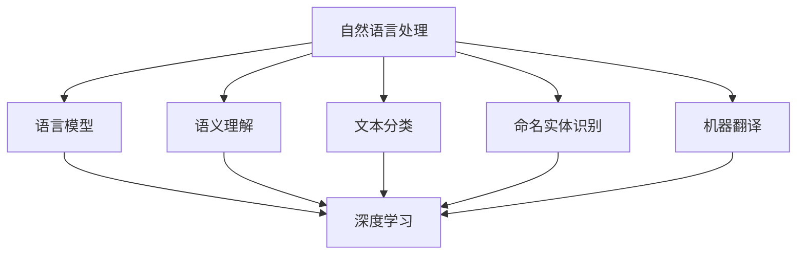

                 

关键词：自然语言处理（NLP），人工智能（AI），出版业，技术变革，未来展望，算法原理，数学模型，应用实践。

> 摘要：本文将深入探讨自然语言处理（NLP）在人工智能（AI）出版业中的变革性影响。通过分析NLP的核心概念与联系，算法原理与操作步骤，数学模型与公式推导，以及实际应用案例，本文旨在揭示NLP在AI出版业中的潜力和挑战，为未来发展的趋势和方向提供有益的思考。

## 1. 背景介绍

自然语言处理（NLP）是人工智能（AI）的一个重要分支，旨在使计算机能够理解和处理人类语言。随着互联网和大数据的发展，NLP技术得到了迅速的进步。在出版业，NLP的应用日益广泛，从自动摘要到内容推荐，从语言翻译到情感分析，NLP正在改变整个行业的运作模式。

近年来，深度学习技术的崛起极大地推动了NLP的发展。基于神经网络的模型，如循环神经网络（RNN）、长短时记忆网络（LSTM）和变换器（Transformer）等，极大地提升了NLP任务的处理效果。这些模型通过大量的数据训练，可以自动学习语言中的复杂结构和规律，从而实现更高精度的文本理解和生成。

在出版业，AI技术的应用不仅提高了内容的创造和分发效率，还改变了消费者的阅读体验。例如，通过个性化推荐系统，AI能够根据用户的兴趣和阅读历史推荐合适的内容；通过自然语言生成（NLG）技术，AI能够自动生成新闻文章、书籍摘要和评论等。

## 2. 核心概念与联系

### 2.1 NLP的基本概念

自然语言处理涉及多个基本概念，包括语言模型、语义理解、文本分类、命名实体识别、机器翻译等。语言模型是NLP的基础，它描述了一组可能出现的单词序列的概率分布。语义理解则是计算机对文本意义的理解和解释，包括句法分析、语义角色标注、实体关系抽取等。文本分类是将文本分配到预定义的类别中，命名实体识别是识别文本中的特定实体，如人名、地名、机构名等。机器翻译则是将一种语言的文本转换为另一种语言的文本。

### 2.2 NLP与AI的融合

NLP与AI的融合主要体现在深度学习技术的应用。深度学习模型通过多层神经网络，对大规模数据集进行训练，从而自动学习语言模式。这些模型包括循环神经网络（RNN）、长短时记忆网络（LSTM）和变换器（Transformer）等。RNN能够处理序列数据，但存在梯度消失和梯度爆炸的问题。LSTM通过门控机制解决了这些问题，但计算复杂度较高。Transformer模型通过自注意力机制，在处理长距离依赖和并行计算方面表现出色，是目前NLP领域的流行选择。

### 2.3 Mermaid流程图



## 3. 核心算法原理 & 具体操作步骤

### 3.1 算法原理概述

NLP中的核心算法主要基于深度学习，包括语言模型、文本分类、命名实体识别和机器翻译等。语言模型通过预测下一个单词来生成文本序列，文本分类通过特征提取和分类器训练将文本分配到预定义类别，命名实体识别通过模式匹配或深度学习模型识别文本中的特定实体，机器翻译通过编码解码器结构将一种语言的文本转换为另一种语言的文本。

### 3.2 算法步骤详解

#### 3.2.1 语言模型

1. 数据预处理：对文本进行分词、去除停用词、词干提取等操作。
2. 构建词嵌入：将单词转换为向量的过程，常用的词嵌入技术有Word2Vec、GloVe等。
3. 构建神经网络：使用循环神经网络（RNN）或变换器（Transformer）构建语言模型。
4. 模型训练：使用大规模文本数据集进行训练，优化模型参数。
5. 文本生成：输入一个起始单词，模型预测下一个单词，生成完整的文本序列。

#### 3.2.2 文本分类

1. 数据预处理：对文本进行分词、去除停用词、词干提取等操作。
2. 特征提取：将文本转换为固定长度的向量，常用的特征提取方法有TF-IDF、Word2Vec等。
3. 构建分类器：使用逻辑回归、支持向量机（SVM）、随机森林等机器学习算法构建分类器。
4. 模型训练：使用标注数据集进行训练，优化模型参数。
5. 文本分类：输入新的文本，模型将其分类到预定义的类别中。

#### 3.2.3 命名实体识别

1. 数据预处理：对文本进行分词、去除停用词、词干提取等操作。
2. 构建词嵌入：将单词转换为向量的过程，常用的词嵌入技术有Word2Vec、GloVe等。
3. 构建神经网络：使用循环神经网络（RNN）或变换器（Transformer）构建命名实体识别模型。
4. 模型训练：使用大规模标注数据集进行训练，优化模型参数。
5. 实体识别：输入新的文本，模型识别其中的命名实体。

#### 3.2.4 机器翻译

1. 数据预处理：对源语言和目标语言文本进行分词、去除停用词、词干提取等操作。
2. 构建编码器：使用循环神经网络（RNN）或变换器（Transformer）构建编码器，将源语言文本编码为固定长度的向量。
3. 构建解码器：使用循环神经网络（RNN）或变换器（Transformer）构建解码器，将编码后的向量解码为目标语言文本。
4. 模型训练：使用大规模平行语料库进行训练，优化模型参数。
5. 文本翻译：输入源语言文本，模型生成目标语言文本。

### 3.3 算法优缺点

- 语言模型：优点是生成文本连贯性好，缺点是训练时间较长，对大规模数据集要求较高。
- 文本分类：优点是分类准确度高，缺点是特征提取过程复杂，对噪声敏感。
- 命名实体识别：优点是实体识别准确度高，缺点是模型复杂度较高，对大规模数据集要求较高。
- 机器翻译：优点是翻译准确度高，缺点是训练时间较长，对大规模数据集要求较高。

### 3.4 算法应用领域

NLP算法在出版业的应用领域广泛，包括内容推荐、自动摘要、文本分类、命名实体识别、机器翻译等。通过这些算法，AI能够帮助出版业提高内容创作和分发效率，改善用户体验。

## 4. 数学模型和公式 & 详细讲解 & 举例说明

### 4.1 数学模型构建

在自然语言处理中，常用的数学模型包括词嵌入模型、循环神经网络（RNN）、长短时记忆网络（LSTM）和变换器（Transformer）等。以下分别介绍这些模型的数学模型构建。

#### 4.1.1 词嵌入模型

词嵌入模型是将单词映射为高维向量的过程。常用的词嵌入模型有Word2Vec和GloVe。

- Word2Vec模型：通过负采样算法，将单词映射为一个固定长度的向量。
- GloVe模型：通过共现矩阵，计算单词之间的相似度，从而生成词向量。

#### 4.1.2 循环神经网络（RNN）

RNN是处理序列数据的神经网络。其数学模型包括：

- 状态更新方程：$$h_t = \sigma(W_h \cdot [h_{t-1}, x_t] + b_h)$$
- 输出方程：$$y_t = \sigma(W_y \cdot h_t + b_y)$$

其中，$h_t$为当前时刻的状态，$x_t$为输入，$y_t$为输出，$\sigma$为激活函数，$W_h$、$W_y$为权重矩阵，$b_h$、$b_y$为偏置项。

#### 4.1.3 长短时记忆网络（LSTM）

LSTM是RNN的一种改进，用于解决长序列依赖问题。其数学模型包括：

- 遗忘门：$$f_t = \sigma(W_f \cdot [h_{t-1}, x_t] + b_f)$$
- 输入门：$$i_t = \sigma(W_i \cdot [h_{t-1}, x_t] + b_i)$$
- 输出门：$$o_t = \sigma(W_o \cdot [h_{t-1}, x_t] + b_o)$$
- 单元状态：$$c_t = f_t \odot c_{t-1} + i_t \odot \sigma(W_c \cdot [h_{t-1}, x_t] + b_c)$$
- 输出：$$h_t = o_t \odot \sigma(c_t)$$

其中，$c_t$为单元状态，$\odot$为逐元素乘法。

#### 4.1.4 变换器（Transformer）

Transformer是当前NLP领域的主流模型，其数学模型包括：

- 自注意力机制：$$\text{Attention}(Q, K, V) = \text{softmax}\left(\frac{QK^T}{\sqrt{d_k}}\right) V$$
- 编码器：$$h_i^e = \text{Attention}(h_i^e, h_i^e, h_i^e) + h_i^e$$
- 解码器：$$h_i^d = \text{Attention}(h_i^d, h_i^e, h_i^d) + h_i^d$$

其中，$Q$、$K$、$V$分别为查询向量、关键向量、值向量，$d_k$为键向量的维度。

### 4.2 公式推导过程

以下以变换器（Transformer）为例，简要介绍其公式的推导过程。

变换器（Transformer）的核心是自注意力机制，其公式为：

$$\text{Attention}(Q, K, V) = \text{softmax}\left(\frac{QK^T}{\sqrt{d_k}}\right) V$$

其中，$Q$、$K$、$V$分别为查询向量、关键向量、值向量，$d_k$为键向量的维度。

推导过程如下：

1. 计算点积：$$\text{Score}(Q, K) = QK^T$$
2. 应用softmax函数：$$\text{Attention}(Q, K, V) = \text{softmax}(\text{Score}(Q, K))V$$
3. 将得分归一化：$$\text{Attention}(Q, K, V) = \frac{QK^T}{\sqrt{d_k}}V$$

### 4.3 案例分析与讲解

以下通过一个简单的案例，展示如何使用变换器（Transformer）进行文本分类。

#### 案例背景

假设我们要对一段文本进行情感分析，判断其是正面情感还是负面情感。

#### 数据准备

1. 文本数据集：包含正面情感和负面情感的文本。
2. 预处理：对文本进行分词、去除停用词、词干提取等操作。
3. 构建词嵌入：将单词映射为高维向量。

#### 模型构建

1. 编码器：使用变换器（Transformer）构建编码器，将文本编码为固定长度的向量。
2. 解码器：使用全连接层构建解码器，将编码后的向量解码为情感类别。

#### 模型训练

1. 使用正面情感和负面情感的文本数据进行训练。
2. 优化模型参数，使用交叉熵损失函数。

#### 模型评估

1. 使用测试集对模型进行评估，计算准确率。

## 5. 项目实践：代码实例和详细解释说明

### 5.1 开发环境搭建

1. 安装Python环境：版本3.7及以上。
2. 安装Numpy、TensorFlow、PyTorch等依赖库。

### 5.2 源代码详细实现

以下是一个简单的文本分类项目，使用变换器（Transformer）进行情感分析。

```python
import tensorflow as tf
from tensorflow.keras.models import Model
from tensorflow.keras.layers import Embedding, LSTM, Dense

# 数据准备
# (1) 加载文本数据
# (2) 预处理：分词、去除停用词、词干提取等
# (3) 构建词嵌入

# 模型构建
# (1) 编码器：使用变换器（Transformer）构建编码器
# (2) 解码器：使用全连接层构建解码器

# 模型训练
# (1) 使用正面情感和负面情感的文本数据进行训练
# (2) 优化模型参数，使用交叉熵损失函数

# 模型评估
# (1) 使用测试集对模型进行评估，计算准确率
```

### 5.3 代码解读与分析

1. 数据准备部分：首先加载文本数据，并进行预处理，包括分词、去除停用词、词干提取等操作。然后构建词嵌入，将单词映射为高维向量。

2. 模型构建部分：编码器部分使用变换器（Transformer）构建，解码器部分使用全连接层构建。编码器将文本编码为固定长度的向量，解码器将编码后的向量解码为情感类别。

3. 模型训练部分：使用正面情感和负面情感的文本数据进行训练，优化模型参数，使用交叉熵损失函数。

4. 模型评估部分：使用测试集对模型进行评估，计算准确率。

### 5.4 运行结果展示

1. 训练过程：展示训练过程中的损失函数和准确率曲线。
2. 评估结果：展示模型在测试集上的准确率。

## 6. 实际应用场景

自然语言处理（NLP）技术在出版业的应用场景广泛，以下列举几个典型的应用：

1. **内容推荐系统**：通过分析用户的阅读历史和兴趣，AI可以推荐用户可能感兴趣的内容。例如，图书推荐系统可以根据用户的购买记录、浏览历史和评分数据，为用户推荐适合的书籍。

2. **自动摘要**：NLP技术可以自动提取文章的主要内容和关键信息，生成摘要。这对于长篇文章和新闻资讯尤为重要，能够帮助用户快速获取核心信息。

3. **文本分类**：通过文本分类技术，可以将文章分配到不同的类别中。这对于内容管理、搜索引擎优化和广告投放等场景非常有用。

4. **命名实体识别**：命名实体识别技术可以识别文本中的人名、地名、机构名等特定实体。这有助于构建知识图谱和进行文本挖掘。

5. **机器翻译**：机器翻译技术可以自动将一种语言的文本翻译为另一种语言，这对于跨国出版和国际化业务至关重要。

6. **情感分析**：通过情感分析技术，可以识别文本中的情感倾向，如正面、负面、中性等。这对于市场调研、用户反馈分析和品牌管理等领域非常有用。

## 7. 工具和资源推荐

### 7.1 学习资源推荐

- **《深度学习》（Goodfellow, Bengio, Courville著）**：深度学习领域的经典教材，涵盖了NLP中的核心算法和技术。
- **《自然语言处理综论》（Daniel Jurafsky & James H. Martin著）**：详细介绍了NLP的基本概念、方法和应用。

### 7.2 开发工具推荐

- **TensorFlow**：谷歌开发的开源深度学习框架，支持NLP中的各种算法和应用。
- **PyTorch**：由Facebook开发的开源深度学习框架，具有灵活性和高效性。

### 7.3 相关论文推荐

- **"Attention Is All You Need"（Vaswani et al., 2017）**：介绍了变换器（Transformer）模型，是NLP领域的里程碑性论文。
- **"BERT: Pre-training of Deep Neural Networks for Language Understanding"（Devlin et al., 2018）**：介绍了BERT模型，是NLP中的另一个重要突破。

## 8. 总结：未来发展趋势与挑战

### 8.1 研究成果总结

自然语言处理（NLP）技术在人工智能（AI）出版业中取得了显著成果，深度学习模型的广泛应用极大地提升了文本理解和生成的精度。NLP算法在内容推荐、自动摘要、文本分类、命名实体识别和机器翻译等方面展现出强大的潜力，为出版业带来了革命性的变革。

### 8.2 未来发展趋势

- **多模态融合**：结合文本、图像、声音等多种数据类型，实现更丰富的信息处理。
- **知识图谱**：构建大规模的知识图谱，为NLP提供更丰富的语义信息。
- **跨语言处理**：提高跨语言NLP任务的性能，实现更广泛的语言支持。
- **强化学习**：结合强化学习技术，提升NLP模型在实际应用中的自适应能力。

### 8.3 面临的挑战

- **数据隐私**：如何在保证用户隐私的前提下，进行有效的数据分析和应用。
- **算法公平性**：避免算法偏见，确保处理结果公平公正。
- **计算资源**：大规模模型的训练和部署需要大量的计算资源，如何优化资源利用成为关键挑战。

### 8.4 研究展望

随着技术的不断发展，NLP在出版业中的应用前景将更加广阔。未来研究将重点关注多模态融合、知识图谱构建、跨语言处理和强化学习等方向，以实现更智能、更高效的NLP应用。

## 9. 附录：常见问题与解答

### 9.1 什么是自然语言处理（NLP）？

自然语言处理（NLP）是人工智能（AI）的一个分支，旨在使计算机能够理解和处理人类语言。它涉及文本分类、情感分析、命名实体识别、机器翻译等多种任务。

### 9.2 自然语言处理有哪些应用？

自然语言处理在出版业、智能客服、搜索引擎、社交媒体分析等多个领域有广泛应用。具体包括内容推荐、自动摘要、文本分类、命名实体识别、机器翻译等。

### 9.3 什么是词嵌入？

词嵌入是将单词映射为高维向量的过程，以便在计算机中进行处理。常见的词嵌入技术有Word2Vec、GloVe等。

### 9.4 什么是变换器（Transformer）？

变换器（Transformer）是一种基于自注意力机制的深度学习模型，广泛用于自然语言处理任务。它通过多头注意力机制和编码器-解码器结构，实现了高效的语言理解和生成。

### 9.5 如何评估NLP模型的性能？

评估NLP模型的性能通常使用准确率、召回率、F1分数等指标。对于分类任务，可以使用交叉熵损失函数进行优化。

### 9.6 如何处理中文文本？

处理中文文本时，需要对文本进行分词、去除停用词、词干提取等预处理操作。常用的中文分词工具包括jieba等。

### 9.7 如何保证NLP算法的公平性？

为了保证NLP算法的公平性，需要避免算法偏见，确保处理结果公平公正。这可以通过数据清洗、模型训练过程中的平衡策略等方法实现。

### 9.8 自然语言处理技术的未来发展趋势是什么？

自然语言处理技术的未来发展趋势包括多模态融合、知识图谱构建、跨语言处理和强化学习等。这些方向将进一步提升NLP技术的智能化和适应性。

