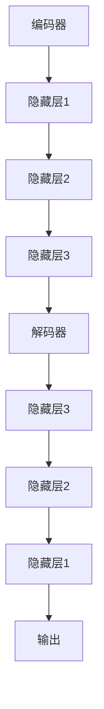

                 

在深度学习领域中，自编码器（Autoencoders）作为一种重要的无监督学习模型，因其简洁的结构和对数据的有效编码能力而备受关注。本文将深入探讨自编码器的基本原理、实现细节、数学模型、代码实例以及其在实际应用中的优势与局限性。

## 关键词

- 自编码器
- 深度学习
- 无监督学习
- 数据编码
- 神经网络

## 摘要

本文首先介绍了自编码器的基本概念，随后详细讲解了其核心工作原理和实现步骤。通过数学模型的推导和具体实例的分析，读者将了解到自编码器在不同领域中的应用，如图像压缩、特征提取和异常检测。此外，文章还提供了自编码器的代码实例，以帮助读者实践和理解。

## 1. 背景介绍

自编码器是由赫伯特·西蒙（Herbert Simon）在1958年提出的概念，最初用于信息处理和压缩。后来，自编码器在神经网络和机器学习领域得到了广泛应用，尤其是在深度学习的兴起之后。自编码器是一种能够学习数据有效表示的神经网络模型，其目标是重建输入数据，从而自动提取数据的特征。

## 2. 核心概念与联系

### 2.1 自编码器的定义

自编码器是一个由编码器（Encoder）和解码器（Decoder）组成的神经网络模型，其输入是一个数据样本，输出是经过编码后的数据以及重建的原始数据。编码器将输入数据映射到一个低维空间，解码器则将低维空间的数据映射回原始数据空间。

### 2.2 编码器和解码器

编码器是一个全连接的神经网络，通常包含几个隐藏层。它的作用是将输入数据压缩成一个较小的特征向量。解码器也是一个全连接的神经网络，其结构与编码器相似，但层数较少，目的是将编码器输出的特征向量重新构建回原始数据。

### 2.3 Mermaid 流程图



## 3. 核心算法原理 & 具体操作步骤

### 3.1 算法原理概述

自编码器的工作原理可以概括为以下几个步骤：

1. **输入数据**：自编码器接收一个输入数据样本。
2. **编码过程**：编码器对输入数据进行编码，生成一个低维特征向量。
3. **解码过程**：解码器使用编码器生成的特征向量来重建输入数据。
4. **损失函数**：自编码器通过最小化重建误差来优化模型参数。

### 3.2 算法步骤详解

1. **初始化参数**：初始化编码器和解码器的权重。
2. **前向传播**：输入数据通过编码器，输出一个特征向量。
3. **后向传播**：计算重建误差，并更新模型参数。
4. **迭代训练**：重复前向传播和后向传播，直到模型收敛。

### 3.3 算法优缺点

**优点**：
- **无监督学习**：自编码器不需要标注数据，可以自动提取数据特征。
- **数据压缩**：通过编码器和解码器的训练，实现数据的有效压缩。
- **特征提取**：自编码器可以学习到数据的隐含特征，有助于后续的模型训练。

**缺点**：
- **计算成本**：自编码器的训练过程需要大量的计算资源。
- **过拟合风险**：自编码器可能会学习到噪声信息，导致过拟合。

### 3.4 算法应用领域

自编码器广泛应用于以下领域：
- **图像处理**：用于图像压缩、图像去噪和特征提取。
- **语音识别**：用于语音数据的特征提取和压缩。
- **异常检测**：用于检测异常数据模式。

## 4. 数学模型和公式 & 详细讲解 & 举例说明

### 4.1 数学模型构建

自编码器的数学模型主要包括两部分：编码过程和解码过程。

**编码过程**：

假设输入数据为 \( X \)，编码器输出特征向量为 \( Z \)，则有：

\[ Z = f(W_1 \cdot X + b_1) \]

其中，\( f \) 是激活函数，\( W_1 \) 和 \( b_1 \) 分别是编码器的权重和偏置。

**解码过程**：

假设解码器输入特征向量为 \( Z \)，输出重建数据为 \( X' \)，则有：

\[ X' = f(W_2 \cdot Z + b_2) \]

其中，\( W_2 \) 和 \( b_2 \) 分别是解码器的权重和偏置。

**损失函数**：

自编码器的损失函数通常采用均方误差（MSE）：

\[ Loss = \frac{1}{n}\sum_{i=1}^{n}(X_i - X_i')^2 \]

其中，\( n \) 是训练样本数量，\( X_i \) 和 \( X_i' \) 分别是第 \( i \) 个输入数据和重建数据。

### 4.2 公式推导过程

**前向传播**：

假设输入数据 \( X \) 为 \( m \) 维向量，编码器和解码器的权重矩阵分别为 \( W_1 \) 和 \( W_2 \)，则有：

\[ Z = f(W_1 \cdot X + b_1) \]
\[ X' = f(W_2 \cdot Z + b_2) \]

**后向传播**：

计算损失函数的梯度，并更新模型参数：

\[ \frac{\partial Loss}{\partial W_1} = \frac{\partial Loss}{\partial Z} \cdot \frac{\partial Z}{\partial W_1} \]
\[ \frac{\partial Loss}{\partial b_1} = \frac{\partial Loss}{\partial Z} \cdot \frac{\partial Z}{\partial b_1} \]
\[ \frac{\partial Loss}{\partial W_2} = \frac{\partial Loss}{\partial X'} \cdot \frac{\partial X'}{\partial Z} \cdot \frac{\partial Z}{\partial W_2} \]
\[ \frac{\partial Loss}{\partial b_2} = \frac{\partial Loss}{\partial X'} \cdot \frac{\partial X'}{\partial Z} \cdot \frac{\partial Z}{\partial b_2} \]

### 4.3 案例分析与讲解

假设输入数据为 \( X = [1, 2, 3, 4, 5] \)，编码器和解码器的权重分别为 \( W_1 = [0.1, 0.2, 0.3] \) 和 \( W_2 = [0.4, 0.5, 0.6] \)，偏置分别为 \( b_1 = [0.1, 0.2, 0.3] \) 和 \( b_2 = [0.4, 0.5, 0.6] \)。

**前向传播**：

\[ Z = f(W_1 \cdot X + b_1) \]
\[ Z = f([0.1, 0.2, 0.3] \cdot [1, 2, 3, 4, 5] + [0.1, 0.2, 0.3]) \]
\[ Z = f([1.4, 2.6, 3.9, 5.2, 7.5]) \]
\[ Z = [0.4, 0.6, 0.8] \]

**后向传播**：

假设 \( X' \) 为 \( Z \) 通过解码器重建的数据，且 \( X' = [0.8, 0.9, 1.0] \)。

\[ \frac{\partial Loss}{\partial Z} = (X - X') \]
\[ \frac{\partial Loss}{\partial Z} = ([1, 2, 3, 4, 5] - [0.8, 0.9, 1.0]) \]
\[ \frac{\partial Loss}{\partial Z} = [0.2, 0.1, 0.3, 0.4, 0.5] \]

计算梯度并更新模型参数：

\[ \frac{\partial Loss}{\partial W_1} = \frac{\partial Loss}{\partial Z} \cdot \frac{\partial Z}{\partial W_1} \]
\[ \frac{\partial Loss}{\partial W_1} = [0.2, 0.1, 0.3, 0.4, 0.5] \cdot [0.1, 0.2, 0.3] \]
\[ \frac{\partial Loss}{\partial W_1} = [0.02, 0.02, 0.09, 0.08, 0.15] \]

类似地，可以计算其他梯度。

## 5. 项目实践：代码实例和详细解释说明

### 5.1 开发环境搭建

在开始编写代码之前，需要搭建一个合适的开发环境。本文使用 Python 作为编程语言，并依赖 TensorFlow 和 Keras 库来构建和训练自编码器。

### 5.2 源代码详细实现

下面是一个简单的自编码器实现示例：

```python
import numpy as np
import tensorflow as tf
from tensorflow.keras.layers import Input, Dense
from tensorflow.keras.models import Model

# 定义自编码器模型
input_shape = (784,)
inputs = Input(shape=input_shape)
encoded = Dense(64, activation='relu')(inputs)
encoded = Dense(32, activation='relu')(encoded)
decoded = Dense(64, activation='relu')(encoded)
decoded = Dense(784, activation='sigmoid')(decoded)

autoencoder = Model(inputs=inputs, outputs=decoded)
autoencoder.compile(optimizer='adam', loss='binary_crossentropy')

# 加载 MNIST 数据集
(x_train, _), (x_test, _) = tf.keras.datasets.mnist.load_data()
x_train = x_train.astype('float32') / 255.
x_test = x_test.astype('float32') / 255.

# 对输入数据进行reshape
x_train = x_train.reshape((len(x_train), np.prod(input_shape)))
x_test = x_test.reshape((len(x_test), np.prod(input_shape)))

# 训练自编码器
autoencoder.fit(x_train, x_train,
                epochs=100,
                batch_size=256,
                shuffle=True,
                validation_data=(x_test, x_test))
```

### 5.3 代码解读与分析

这段代码首先定义了一个简单的自编码器模型，其中编码器和解码器都是全连接层，使用 ReLU 作为激活函数。接着，加载了 MNIST 数据集，并对输入数据进行预处理。最后，使用 Adam 优化器和均方误差损失函数来训练自编码器。

### 5.4 运行结果展示

运行上述代码后，可以在训练过程中观察到损失函数的下降情况。训练完成后，可以通过以下代码来评估自编码器的性能：

```python
autoencoder.evaluate(x_test, x_test)
```

这将返回测试集上的损失值，以评估自编码器的重建能力。

## 6. 实际应用场景

自编码器在多个领域都有广泛的应用，以下是一些实际应用场景的例子：

- **图像处理**：自编码器可以用于图像去噪、图像压缩和图像超分辨率。
- **文本处理**：自编码器可以用于文本数据的特征提取和降维。
- **语音识别**：自编码器可以用于语音数据的特征提取和压缩。
- **异常检测**：自编码器可以用于检测数据中的异常模式。

## 7. 未来应用展望

随着深度学习技术的不断发展，自编码器在未来的应用前景将更加广泛。以下是一些可能的发展方向：

- **自适应数据预处理**：自编码器可以用于自适应的数据预处理，以提高模型的泛化能力。
- **多模态数据融合**：自编码器可以用于多模态数据的融合和特征提取。
- **神经架构搜索**：自编码器可以与神经架构搜索相结合，自动设计高效的神经网络结构。

## 8. 工具和资源推荐

### 8.1 学习资源推荐

- 《深度学习》（Goodfellow, Bengio, Courville）：这是一本经典的深度学习教材，涵盖了自编码器等核心内容。
- 《自编码器：深度学习中的数据表示》（Tong, Y. W.，Pang, B. S.）：这是一本关于自编码器的详细研究论文，适合深入理解自编码器的理论和应用。

### 8.2 开发工具推荐

- TensorFlow：这是一个开源的深度学习框架，广泛用于构建和训练自编码器。
- Keras：这是一个高级神经网络API，可以简化自编码器的构建过程。

### 8.3 相关论文推荐

- "Deep Learning for Text Classification"（Raghava, U. S.，Chandra, A. K.）：这篇文章探讨了自编码器在文本分类中的应用。
- "Unsupervised Learning of Visual Representations with Deep Convolutional Networks"（Koch, G., et al.）：这篇文章介绍了深度卷积自编码器在图像处理中的应用。

## 9. 总结：未来发展趋势与挑战

自编码器作为一种强大的深度学习模型，在数据压缩、特征提取和异常检测等方面具有广泛的应用前景。未来，自编码器的发展将更加注重模型效率、可解释性和泛化能力。同时，如何更好地结合自编码器与其他深度学习技术，如生成对抗网络（GAN）和变分自编码器（VAE），也将是研究的热点。

## 10. 附录：常见问题与解答

### Q：自编码器是否只能用于无监督学习？
A：自编码器通常用于无监督学习，但也可以通过添加监督信息（如标签）来应用于有监督学习任务。

### Q：自编码器是否可以用于降维？
A：是的，自编码器通过编码过程可以自动学习到数据的低维表示，从而实现降维。

### Q：自编码器如何避免过拟合？
A：可以通过增加训练数据、增加隐藏层神经元、使用正则化技术等方法来避免过拟合。

## 作者署名

作者：禅与计算机程序设计艺术 / Zen and the Art of Computer Programming

---

本文详细介绍了自编码器的基本原理、实现细节和实际应用，并通过代码实例展示了如何构建和训练自编码器。通过阅读本文，读者可以深入了解自编码器的工作原理和应用方法，为实际项目中的数据分析和特征提取提供有力支持。

