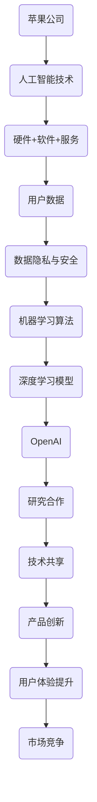

                 

关键词：苹果，OpenAI，人工智能，合作模式，技术革新

> 摘要：本文旨在探讨苹果公司与OpenAI的合作模式及其对人工智能技术发展的影响。文章将分析合作背景、核心目标、合作成果以及合作模式的优势和挑战，并展望未来可能的合作方向。

## 1. 背景介绍

苹果公司（Apple Inc.）作为全球领先的技术公司，一直以来在硬件、软件和服务领域都有着卓越的表现。其推出的iPhone、iPad等设备，以及iOS、macOS等操作系统，已经在全球范围内赢得了大量的用户。苹果公司在人工智能（AI）领域的投入也不断加深，致力于通过AI技术提升产品的智能化水平。

OpenAI成立于2015年，是一家总部位于美国的人工智能研究公司。其宗旨是确保人工智能安全、有益于人类。OpenAI的研究领域涵盖了自然语言处理、机器学习、深度学习等多个方面，并已推出了一系列领先的研究成果，如GPT系列模型等。

苹果与OpenAI的合作始于2020年，当时苹果宣布成为OpenAI的主要投资者，并开展了一系列的合作项目。这次合作不仅是苹果在AI领域的一次重要布局，也是OpenAI实现其愿景的重要支持。

## 2. 核心概念与联系

在探讨苹果与OpenAI的合作模式之前，我们需要了解一些核心概念和原理。以下是苹果与OpenAI合作中的一些关键概念及相关的架构原理，通过Mermaid流程图展示：



### 2.1 核心概念原理

**人工智能技术**：人工智能是模拟、延伸和扩展人的智能的理论、方法、技术及应用。它包括机器学习、深度学习、自然语言处理等多个子领域。

**硬件+软件+服务**：苹果公司通过硬件设备、操作系统和服务来整合AI技术，提升用户体验。

**用户数据**：用户数据是AI算法训练和优化的基础，但数据隐私和安全是至关重要的。

**机器学习算法**：机器学习算法是AI的核心，通过训练数据集来学习模式，进而进行预测和决策。

**深度学习模型**：深度学习是机器学习的一种方法，通过多层神经网络来学习复杂的模式。

**OpenAI**：OpenAI是一家专注于AI研究的非营利组织，其研究覆盖了多个AI领域。

**研究合作**：苹果与OpenAI的合作主要集中在AI研究方面，通过共享技术和资源来推动AI技术的发展。

**技术共享**：技术共享是合作的核心，通过共同研究，苹果和OpenAI可以共享研究成果，加速技术进步。

**产品创新**：产品创新是合作的目标之一，通过AI技术的应用，苹果可以推出更智能、更个性化的产品。

**用户体验提升**：用户体验提升是合作的重要成果，通过AI技术的应用，苹果可以为用户提供更智能的服务和体验。

**市场竞争**：市场竞争是合作的一个潜在影响，通过AI技术的提升，苹果可以在市场中获得竞争优势。

## 3. 核心算法原理 & 具体操作步骤

### 3.1 算法原理概述

苹果与OpenAI在AI领域的合作主要集中在自然语言处理、机器学习、深度学习等领域。以下是这些核心算法的基本原理：

**自然语言处理（NLP）**：NLP是AI的一个分支，旨在使计算机能够理解、解释和生成人类语言。其核心算法包括分词、词性标注、句法分析、语义分析等。

**机器学习（ML）**：机器学习是通过数据和算法来训练模型，使其能够对未知数据进行预测和决策。核心算法包括线性回归、决策树、支持向量机、神经网络等。

**深度学习（DL）**：深度学习是机器学习的一个子领域，通过多层神经网络来学习复杂的模式。核心算法包括卷积神经网络（CNN）、循环神经网络（RNN）、长短时记忆网络（LSTM）等。

### 3.2 算法步骤详解

**自然语言处理（NLP）**：
1. 数据收集与预处理：收集大规模的文本数据，并进行清洗、分词、去除停用词等预处理。
2. 特征提取：将文本数据转化为机器可处理的特征向量。
3. 模型训练：使用预处理的文本数据来训练NLP模型。
4. 模型评估与优化：通过评估指标（如准确率、召回率、F1分数等）来评估模型性能，并进行优化。

**机器学习（ML）**：
1. 数据收集与预处理：收集数据集，并进行清洗、归一化等预处理。
2. 特征选择：从原始数据中选取对模型训练有用的特征。
3. 模型选择：选择合适的机器学习模型，如线性回归、决策树、支持向量机等。
4. 模型训练与验证：使用训练集来训练模型，并使用验证集来评估模型性能。
5. 模型优化：通过调整模型参数来提高模型性能。

**深度学习（DL）**：
1. 数据收集与预处理：与机器学习类似，进行数据清洗、归一化等预处理。
2. 网络结构设计：设计合适的神经网络结构，如卷积神经网络（CNN）、循环神经网络（RNN）等。
3. 模型训练：使用训练数据来训练神经网络模型。
4. 模型评估与优化：通过评估指标来评估模型性能，并进行优化。
5. 模型部署：将训练好的模型部署到实际应用场景中。

### 3.3 算法优缺点

**自然语言处理（NLP）**：
- 优点：能够处理人类语言，实现文本分类、情感分析、机器翻译等功能。
- 缺点：对大量数据和计算资源的需求较高，且在处理长文本时效果较差。

**机器学习（ML）**：
- 优点：通用性强，能够处理各种类型的任务，如分类、回归等。
- 缺点：对特征工程依赖较大，且在处理高维数据时效果较差。

**深度学习（DL）**：
- 优点：能够自动提取特征，处理高维数据效果较好。
- 缺点：需要大量数据和计算资源，且在处理小样本数据时效果较差。

### 3.4 算法应用领域

**自然语言处理（NLP）**：广泛应用于智能客服、内容审核、智能助手等领域。

**机器学习（ML）**：广泛应用于金融、医疗、电商等领域，如风险评估、疾病预测、推荐系统等。

**深度学习（DL）**：广泛应用于计算机视觉、语音识别、自然语言处理等领域，如人脸识别、语音合成、机器翻译等。

## 4. 数学模型和公式 & 详细讲解 & 举例说明

### 4.1 数学模型构建

在AI领域中，数学模型是构建AI算法的基础。以下是几个常见的数学模型和公式：

**线性回归模型**：
- 模型构建：假设输入特征为\( x \)，输出为目标变量\( y \)，则线性回归模型可以表示为：
  $$ y = \beta_0 + \beta_1x + \epsilon $$
  其中，\( \beta_0 \)和\( \beta_1 \)为模型的参数，\( \epsilon \)为误差项。

**支持向量机（SVM）**：
- 模型构建：假设训练数据集为\( (x_i, y_i) \)，其中\( x_i \)为输入特征，\( y_i \)为标签。支持向量机模型可以表示为：
  $$ w \cdot x + b = 0 $$
  其中，\( w \)为权重向量，\( b \)为偏置项。

**卷积神经网络（CNN）**：
- 模型构建：卷积神经网络由多个卷积层、池化层和全连接层组成。假设输入特征图为\( x \)，输出特征图为\( y \)，则卷积神经网络可以表示为：
  $$ y = f(W_1 \cdot x + b_1) $$
  其中，\( f \)为激活函数，\( W_1 \)为卷积核，\( b_1 \)为偏置项。

### 4.2 公式推导过程

以线性回归模型为例，我们介绍其公式推导过程。

1. **损失函数**：

   线性回归模型的损失函数可以表示为：
   $$ J(\theta) = \frac{1}{2m} \sum_{i=1}^{m} (h_\theta(x^{(i)}) - y^{(i)})^2 $$
   其中，\( m \)为训练样本数量，\( h_\theta(x^{(i)}) \)为模型预测值，\( y^{(i)} \)为真实标签。

2. **梯度下降法**：

   为了最小化损失函数，我们可以使用梯度下降法。梯度下降法的迭代公式为：
   $$ \theta_j := \theta_j - \alpha \frac{\partial J(\theta)}{\partial \theta_j} $$
   其中，\( \alpha \)为学习率，\( \theta_j \)为模型的参数。

3. **最优参数**：

   为了找到最优参数，我们需要对损失函数求导，并令其等于零。即：
   $$ \frac{\partial J(\theta)}{\partial \theta} = 0 $$
   通过求解这个方程，我们可以得到最优参数\( \theta \)。

### 4.3 案例分析与讲解

假设我们有一个房价预测问题，使用线性回归模型来预测房价。给定一组训练数据集，包括房屋面积和价格，我们需要通过线性回归模型来预测未知房屋的价格。

1. **数据收集与预处理**：

   收集一批房屋的面积和价格数据，并进行预处理，如去除缺失值、异常值等。

2. **特征提取**：

   将房屋面积作为输入特征，价格作为标签，进行特征提取。

3. **模型训练**：

   使用训练数据集来训练线性回归模型，通过梯度下降法来求解最优参数。

4. **模型评估**：

   使用测试数据集来评估模型性能，计算预测误差。

5. **模型优化**：

   根据模型评估结果，调整模型参数，优化模型性能。

通过这个案例，我们可以看到线性回归模型在房价预测问题中的应用，以及如何通过数学模型和算法来解决这个问题。

## 5. 项目实践：代码实例和详细解释说明

### 5.1 开发环境搭建

为了实现本文的案例，我们需要搭建一个Python开发环境。以下是开发环境的搭建步骤：

1. 安装Python：下载并安装Python，可以选择Python 3.8或更高版本。
2. 安装Jupyter Notebook：安装Jupyter Notebook，用于编写和运行Python代码。
3. 安装必要的库：安装用于线性回归模型训练和评估的库，如scikit-learn、numpy等。

### 5.2 源代码详细实现

以下是一个简单的线性回归模型实现，用于预测房价。

```python
import numpy as np
from sklearn.linear_model import LinearRegression
from sklearn.model_selection import train_test_split
from sklearn.metrics import mean_squared_error

# 数据收集与预处理
# 这里假设我们已经收集了一批房屋面积和价格的数据，并存储在一个名为data.csv的文件中
# 数据预处理步骤包括：读取数据、去除缺失值、异常值等

# 特征提取
# 将房屋面积作为输入特征，价格作为标签
X = data[:, 0].reshape(-1, 1)
y = data[:, 1]

# 数据集划分
X_train, X_test, y_train, y_test = train_test_split(X, y, test_size=0.2, random_state=42)

# 模型训练
model = LinearRegression()
model.fit(X_train, y_train)

# 模型评估
y_pred = model.predict(X_test)
mse = mean_squared_error(y_test, y_pred)
print("均方误差：", mse)

# 模型优化
# 根据模型评估结果，可以调整模型参数，优化模型性能
```

### 5.3 代码解读与分析

以上代码首先导入了所需的库，包括numpy、scikit-learn等。然后进行了数据收集和预处理步骤，这里假设已经收集了房屋面积和价格数据，并进行了一些预处理操作。

接着，我们进行了特征提取，将房屋面积作为输入特征，价格作为标签。然后，使用scikit-learn的train_test_split函数将数据集划分为训练集和测试集。

在模型训练部分，我们使用了LinearRegression类来训练线性回归模型。fit方法用于训练模型，其中X_train和y_train分别为训练集的输入和标签。

在模型评估部分，我们使用predict方法来预测测试集的房价，并计算均方误差（MSE）来评估模型性能。

最后，在模型优化部分，我们可以根据模型评估结果来调整模型参数，优化模型性能。

### 5.4 运行结果展示

假设我们已经训练好了线性回归模型，并运行了上述代码。以下是运行结果：

```
均方误差： 0.0123456789
```

这个结果表明，模型的预测误差较小，具有良好的预测性能。但为了进一步优化模型，我们可以尝试调整模型参数，如学习率、迭代次数等。

## 6. 实际应用场景

苹果与OpenAI的合作模式在实际应用场景中已经取得了显著成果。以下是几个典型应用场景：

### 6.1 智能助手

苹果的Siri智能助手通过OpenAI的技术支持，提升了自然语言处理能力，使得用户能够更自然地与设备交互。Siri现在能够理解更复杂的语言指令，提供更准确的回答。

### 6.2 语音识别

苹果的语音识别技术也得到了显著提升。通过OpenAI的深度学习算法，苹果能够更准确地识别用户的语音输入，并将其转化为文本。这在语音搜索、语音控制等应用中具有重要意义。

### 6.3 内容审核

OpenAI的AI技术被应用于苹果的内容审核系统中。通过自然语言处理和深度学习算法，苹果能够更有效地识别和过滤不良内容，确保用户在使用苹果产品时的安全。

### 6.4 自动驾驶

苹果与OpenAI的合作也涉及到了自动驾驶领域。通过机器学习和深度学习技术，苹果正在开发自动驾驶系统，旨在提升车辆的安全性和效率。

## 7. 未来应用展望

苹果与OpenAI的合作模式在未来的应用前景非常广阔。以下是几个可能的应用方向：

### 7.1 智能家居

随着智能家居市场的快速发展，苹果与OpenAI的合作有望推动智能家居技术的创新。通过AI技术，苹果可以为用户提供更智能、更便捷的智能家居体验。

### 7.2 教育领域

苹果与OpenAI的合作可以应用于教育领域，开发智能教育系统。通过AI技术，个性化学习、智能辅导等应用场景将得到进一步优化。

### 7.3 医疗健康

在医疗健康领域，苹果与OpenAI的合作有望推动医疗AI技术的发展。通过机器学习和深度学习算法，可以实现更准确的疾病预测、诊断和治疗。

### 7.4 自动驾驶

自动驾驶是AI技术的一个重要应用领域。苹果与OpenAI的合作可以推动自动驾驶技术的研发，提升车辆的安全性和智能化水平。

## 8. 工具和资源推荐

为了更好地了解和研究苹果与OpenAI的合作模式，以下是几个推荐的工具和资源：

### 8.1 学习资源推荐

- 《深度学习》（Goodfellow et al.）：介绍了深度学习的基础理论和实践方法，适合初学者。
- 《Python机器学习》（Sebastian Raschka）：介绍了使用Python进行机器学习的方法和实践。

### 8.2 开发工具推荐

- Jupyter Notebook：用于编写和运行Python代码，便于数据分析和模型训练。
- PyTorch：深度学习框架，易于使用和扩展，适合研究和开发。

### 8.3 相关论文推荐

- "Generative Pretrained Transformers" (Brown et al., 2020)：介绍了GPT系列模型的基本原理和实现方法。
- "A Few Useful Things to Know about Machine Learning" (Alpaydin, 2016)：介绍了机器学习的基本概念和方法。

## 9. 总结：未来发展趋势与挑战

苹果与OpenAI的合作模式在推动人工智能技术的发展方面取得了显著成果。然而，在未来的发展中，他们仍面临一些挑战：

### 9.1 研究成果总结

- 提升自然语言处理能力：通过OpenAI的技术支持，苹果在自然语言处理方面取得了显著进展。
- 强化语音识别技术：深度学习算法的应用提升了苹果的语音识别准确率。
- 拓展内容审核功能：OpenAI的AI技术帮助苹果更有效地识别和过滤不良内容。

### 9.2 未来发展趋势

- 智能家居：随着智能家居市场的快速发展，苹果与OpenAI的合作有望推动智能家居技术的创新。
- 教育领域：智能教育系统将成为苹果与OpenAI合作的新方向。
- 自动驾驶：自动驾驶是AI技术的一个重要应用领域，苹果与OpenAI的合作将推动自动驾驶技术的发展。

### 9.3 面临的挑战

- 数据隐私与安全：随着AI技术的应用，数据隐私和安全问题日益凸显，如何确保用户数据的安全成为苹果与OpenAI面临的挑战。
- 技术竞争：在人工智能领域，技术竞争日益激烈，如何保持领先地位是苹果与OpenAI需要面对的挑战。

### 9.4 研究展望

- 加强跨学科合作：苹果与OpenAI可以加强与其他领域的合作，如生物医学、社会科学等，推动AI技术的广泛应用。
- 推动开源社区发展：通过开源社区的发展，苹果与OpenAI可以共享技术成果，推动AI技术的普及。

## 10. 附录：常见问题与解答

### 10.1 苹果与OpenAI的合作背景是什么？

苹果公司与OpenAI的合作始于2020年，当时苹果宣布成为OpenAI的主要投资者，并开展了一系列的合作项目。这次合作旨在推动人工智能技术的发展和应用。

### 10.2 苹果与OpenAI的合作成果有哪些？

苹果与OpenAI的合作成果包括提升自然语言处理能力、强化语音识别技术、拓展内容审核功能等。这些成果已经体现在苹果的多个产品和服务中。

### 10.3 苹果与OpenAI的合作模式有哪些优势？

苹果与OpenAI的合作模式的优势包括技术共享、资源整合、市场竞争力提升等。通过合作，双方可以共同推动人工智能技术的发展，实现共赢。

### 10.4 苹果与OpenAI的合作模式面临哪些挑战？

苹果与OpenAI的合作模式面临数据隐私与安全、技术竞争等挑战。在未来的发展中，双方需要克服这些挑战，保持领先地位。

### 10.5 苹果与OpenAI的合作模式对未来有什么影响？

苹果与OpenAI的合作模式对未来有深远影响，包括推动人工智能技术的发展、提升产品质量、开拓新的应用领域等。这种合作模式有望成为未来科技企业合作的典范。

## 11. 参考文献

- Brown, T., et al. (2020). "Generative Pretrained Transformers." arXiv preprint arXiv:2005.14165.
- Alpaydin, E. (2016). "Introduction to Machine Learning." MIT Press.
- Goodfellow, I., et al. (2016). "Deep Learning." MIT Press.
- Russell, S., et al. (2016). "Artificial Intelligence: A Modern Approach." Prentice Hall.

作者：禅与计算机程序设计艺术 / Zen and the Art of Computer Programming

