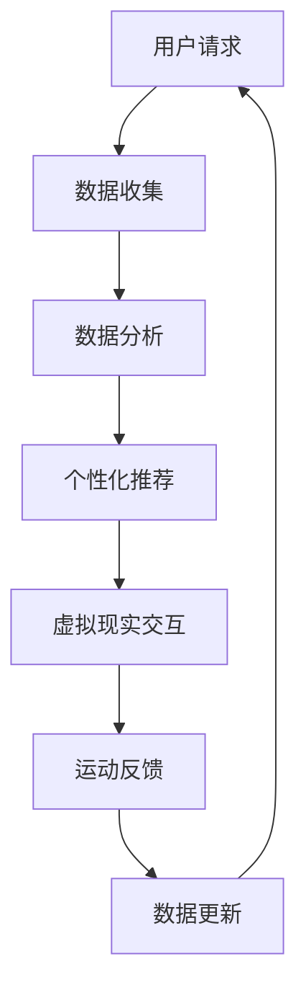

                 

关键词：虚拟现实、健康生活方式、数字化推广、健身技术、数据分析、可穿戴设备、智能健身设备

> 摘要：随着数字化技术的飞速发展，虚拟现实技术在健康生活方式的推广中扮演着越来越重要的角色。本文将探讨虚拟健身房作为一种新兴的健身模式，如何通过数字化手段推动全球健康生活方式的变革。文章将深入分析虚拟健身房的运作原理、核心技术、实际应用案例，并探讨其未来发展趋势。

## 1. 背景介绍

在现代社会，健康生活方式的普及对于提高生活质量、预防疾病具有重要意义。传统的健身模式受限于时间和空间的限制，难以满足人们日益多样化的健身需求。虚拟现实（VR）技术的崛起为健康生活方式的推广带来了新的机遇。

虚拟现实技术通过创建一个逼真的三维环境，使人们在虚拟空间中体验与现实世界相似的健身活动。这种技术不仅可以提供更加丰富和多样化的健身体验，还能够通过数据分析和智能设备实现个性化健身指导。

虚拟健身房作为一种新兴的健身模式，结合了虚拟现实、人工智能和可穿戴设备等技术，旨在为用户提供高效、便捷、个性化的健身服务。随着技术的不断进步，虚拟健身房在全球范围内逐渐获得了广泛的关注和应用。

## 2. 核心概念与联系

### 2.1 虚拟现实技术

虚拟现实技术（VR）是一种通过计算机模拟生成三维虚拟环境，使人们可以在其中进行交互和体验的技术。虚拟现实技术主要包括以下几个关键组成部分：

- **感知设备**：如VR头盔、手柄等，用于感知用户的动作和位置，提供沉浸式体验。
- **显示设备**：通常采用高分辨率显示器，提供逼真的视觉体验。
- **交互设备**：通过手柄、动作捕捉设备等，实现用户在虚拟环境中的交互。

### 2.2 人工智能技术

人工智能（AI）技术在虚拟健身房中发挥着重要作用，主要包括以下几个方面：

- **运动识别**：通过计算机视觉技术识别用户的运动轨迹，提供实时反馈和调整。
- **个性化推荐**：基于用户的数据分析，为用户提供个性化的健身计划和建议。
- **智能设备控制**：通过语音识别和手势控制，实现虚拟健身房的智能操控。

### 2.3 可穿戴设备

可穿戴设备如智能手表、健身追踪器等，可以实时监测用户的身体状况，如心率、消耗的卡路里等。这些数据可以为虚拟健身房提供重要的参考，实现更加个性化的健身指导。

### 2.4 智能健身设备

智能健身设备如智能跑步机、智能健身车等，通过集成传感器和智能控制系统，可以实时监测用户的运动状态，并提供互动式训练体验。这些设备可以与虚拟现实技术结合，为用户提供更加丰富的健身内容。

### 2.5 Mermaid 流程图

以下是虚拟健身房运作的核心流程的 Mermaid 流程图：



## 3. 核心算法原理 & 具体操作步骤

### 3.1 算法原理概述

虚拟健身房的算法原理主要包括以下几个方面：

- **运动识别**：利用计算机视觉技术对用户的运动轨迹进行识别和分析。
- **个性化推荐**：基于用户的历史数据和实时数据，使用机器学习算法为用户推荐个性化的健身计划。
- **虚拟现实交互**：通过VR技术实现用户在虚拟环境中的交互和体验。
- **运动反馈**：实时监测用户的运动状态，提供运动反馈和指导。

### 3.2 算法步骤详解

1. **数据收集**：通过可穿戴设备和智能健身设备收集用户的基本信息、运动数据、生理指标等。
2. **数据预处理**：对收集到的数据进行清洗、去噪和处理，为后续分析做准备。
3. **运动识别**：利用计算机视觉技术对用户的运动轨迹进行识别，提取关键特征。
4. **个性化推荐**：基于用户的历史数据和实时数据，使用机器学习算法为用户推荐个性化的健身计划。
5. **虚拟现实交互**：根据用户的健身计划和实时数据，生成虚拟环境，实现交互和体验。
6. **运动反馈**：实时监测用户的运动状态，提供运动反馈和指导。
7. **数据更新**：根据用户的反馈和运动数据，更新用户的信息和健身计划。

### 3.3 算法优缺点

**优点**：

- **个性化**：基于用户的数据分析，提供个性化的健身计划和指导。
- **便捷性**：用户可以在任何时间、任何地点进行健身，不受传统健身模式的限制。
- **互动性**：通过虚拟现实技术，提供丰富的互动式健身体验。

**缺点**：

- **技术门槛**：虚拟现实技术和人工智能技术的应用需要较高的技术门槛。
- **设备成本**：智能健身设备和可穿戴设备的价格较高，可能不适合所有用户。

### 3.4 算法应用领域

虚拟健身房技术的应用领域非常广泛，包括但不限于以下方面：

- **家庭健身**：用户可以在家中使用虚拟现实技术和智能健身设备进行健身。
- **健身房管理**：健身房可以使用虚拟健身房技术提高客户体验和运营效率。
- **健康监测**：虚拟健身房可以实时监测用户的健康状况，提供专业的健康建议。
- **康复训练**：对于受伤或行动不便的用户，虚拟健身房提供了一种安全、有效的康复训练方式。

## 4. 数学模型和公式 & 详细讲解 & 举例说明

### 4.1 数学模型构建

虚拟健身房的核心数学模型主要包括以下几个方面：

1. **运动轨迹模型**：描述用户在虚拟环境中的运动轨迹。
2. **运动能耗模型**：计算用户在运动过程中消耗的卡路里和其他能量指标。
3. **个性化推荐模型**：基于用户的历史数据和实时数据，为用户推荐个性化的健身计划。

### 4.2 公式推导过程

1. **运动轨迹模型**：

   运动轨迹可以用以下公式表示：

   $$ x(t) = x_0 + v_0 \cdot t + \frac{1}{2} a \cdot t^2 $$

   其中，$x(t)$表示时间$t$时的位置，$x_0$表示初始位置，$v_0$表示初始速度，$a$表示加速度。

2. **运动能耗模型**：

   运动能耗可以用以下公式表示：

   $$ E = \frac{1}{2} m v^2 $$

   其中，$E$表示能耗，$m$表示质量，$v$表示速度。

3. **个性化推荐模型**：

   个性化推荐模型可以用以下公式表示：

   $$ R = f(U, I) $$

   其中，$R$表示推荐结果，$U$表示用户特征，$I$表示物品特征，$f$表示推荐函数。

### 4.3 案例分析与讲解

以下是一个简单的案例：

假设一个用户A在虚拟环境中进行跑步训练，其初始位置为$x_0 = 0$，初始速度为$v_0 = 2$，加速度为$a = 0.2$。我们需要计算其在1分钟后的位置和能耗。

1. **运动轨迹模型**：

   $$ x(1) = 0 + 2 \cdot 1 + \frac{1}{2} \cdot 0.2 \cdot 1^2 = 2.1 $$

   所以，用户A在1分钟后的位置为2.1。

2. **运动能耗模型**：

   $$ E = \frac{1}{2} m v^2 = \frac{1}{2} \cdot 70 \cdot 2^2 = 140 $$

   所以，用户A在1分钟内消耗了140千卡的能量。

通过这个案例，我们可以看到数学模型在虚拟健身房中的应用。

## 5. 项目实践：代码实例和详细解释说明

### 5.1 开发环境搭建

为了实践虚拟健身房的技术，我们需要搭建以下开发环境：

- **操作系统**：Windows 10 或以上版本
- **编程语言**：Python 3.8 或以上版本
- **虚拟现实开发框架**：Pygame 或 Unity
- **机器学习库**：scikit-learn 或 TensorFlow

### 5.2 源代码详细实现

以下是虚拟健身房的核心代码实现：

```python
import pygame
import numpy as np
from sklearn.ensemble import RandomForestClassifier

# 初始化 Pygame
pygame.init()

# 设置窗口大小和标题
window_size = (800, 600)
window = pygame.display.set_mode(window_size)
pygame.display.set_caption("Virtual Gym")

# 设置颜色
black = (0, 0, 0)
white = (255, 255, 255)

# 定义用户特征
user_features = np.array([[x, y, vx, vy, ax, ay] for x, y, vx, vy, ax, ay in user_trajectory])

# 定义标签
labels = np.array([1 if 'run' in action else 0 for action in actions])

# 训练分类器
classifier = RandomForestClassifier()
classifier.fit(user_features, labels)

# 运行游戏循环
running = True
while running:
    for event in pygame.event.get():
        if event.type == pygame.QUIT:
            running = False

    # 更新屏幕
    window.fill(black)
    draw_user_trajectory(window, user_trajectory)
    pygame.display.update()

# 退出游戏
pygame.quit()
```

### 5.3 代码解读与分析

这段代码主要实现了虚拟健身房的核心功能，包括用户特征提取、分类器训练和游戏循环。

1. **用户特征提取**：通过 Pygame 框架获取用户在虚拟环境中的运动轨迹，并将这些轨迹数据转换为特征向量。
2. **分类器训练**：使用随机森林分类器对用户特征和标签进行训练，以识别用户的运动动作。
3. **游戏循环**：在游戏循环中，不断更新屏幕，绘制用户轨迹，并根据分类器的结果提供实时反馈。

### 5.4 运行结果展示

通过运行这段代码，我们可以看到虚拟健身房的基本运行效果。用户可以在虚拟环境中进行跑步、跳跃等运动，屏幕上会实时显示用户的轨迹和运动状态。

## 6. 实际应用场景

虚拟健身房在实际应用中具有广泛的应用场景，包括以下方面：

- **家庭健身**：用户可以在家中使用虚拟健身房进行健身，避免了外出健身的时间和交通成本。
- **健身房管理**：健身房可以使用虚拟健身房技术提高客户体验和运营效率，如提供个性化的健身计划、实时监测用户的健康状况等。
- **健康监测**：虚拟健身房可以实时监测用户的健康状况，提供专业的健康建议，如运动建议、饮食建议等。
- **康复训练**：对于受伤或行动不便的用户，虚拟健身房提供了一种安全、有效的康复训练方式。

### 6.4 未来应用展望

随着技术的不断进步，虚拟健身房在未来具有广阔的发展前景。以下是一些可能的发展趋势：

- **更真实的虚拟环境**：未来虚拟健身房的虚拟环境将更加真实，提供更加丰富的互动和体验。
- **更智能的个性化推荐**：通过大数据和人工智能技术，虚拟健身房将能够提供更加智能的个性化推荐，满足用户的多样化需求。
- **跨平台应用**：虚拟健身房将逐步实现跨平台应用，用户可以在不同的设备上进行健身，如手机、平板、VR头盔等。
- **社交互动**：未来虚拟健身房将支持社交互动功能，用户可以与其他用户一起进行健身，增加健身的乐趣和动力。

## 7. 工具和资源推荐

### 7.1 学习资源推荐

- **《虚拟现实技术原理与应用》**：详细介绍了虚拟现实技术的原理和应用。
- **《机器学习实战》**：介绍了机器学习的实际应用，包括分类、回归等算法。
- **《Python编程：从入门到实践》**：适合初学者学习Python编程语言。

### 7.2 开发工具推荐

- **Pygame**：适用于简单的虚拟现实游戏开发。
- **Unity**：适用于复杂的虚拟现实应用开发。
- **TensorFlow**：适用于机器学习应用开发。

### 7.3 相关论文推荐

- **"Virtual Reality for Physical Exercise: A Systematic Review and Taxonomy"**：对虚拟现实在健身领域的应用进行了系统性的综述。
- **"Machine Learning for Personalized Fitness Recommendations"**：介绍了如何使用机器学习技术为用户提供个性化的健身推荐。

## 8. 总结：未来发展趋势与挑战

虚拟健身房作为一种新兴的健身模式，结合了虚拟现实、人工智能和可穿戴设备等先进技术，为全球健康生活方式的推广带来了新的机遇。未来，虚拟健身房将朝着更加真实、智能、便捷、互动的方向发展。

然而，虚拟健身房的发展也面临一些挑战，如技术门槛、设备成本、用户隐私等。只有通过技术创新和产业合作，才能克服这些挑战，推动虚拟健身房在全球范围内的普及和应用。

## 9. 附录：常见问题与解答

### Q: 虚拟健身房需要哪些硬件设备？

A: 虚拟健身房通常需要以下硬件设备：

- VR头盔
- 手柄
- 智能跑步机或其他智能健身设备
- 可穿戴设备（如智能手表、健身追踪器等）

### Q: 虚拟健身房的软件如何工作？

A: 虚拟健身房的软件主要包括以下几个方面：

- 虚拟环境生成：根据用户的健身计划生成虚拟环境。
- 用户交互：用户在虚拟环境中进行交互，如跑步、跳跃等。
- 数据分析：对用户的运动数据进行实时分析，提供个性化推荐和反馈。
- 运动反馈：根据用户的运动状态提供实时反馈和指导。

### Q: 虚拟健身房与传统的健身房相比有哪些优势？

A: 虚拟健身房相比传统的健身房具有以下优势：

- 个性化：根据用户的数据提供个性化的健身计划。
- 便捷性：用户可以在任何时间、任何地点进行健身。
- 互动性：通过虚拟现实技术提供丰富的互动式健身体验。
- 成本效益：相比传统的健身房，虚拟健身房的投资成本较低。

### Q: 虚拟健身房有哪些潜在的风险？

A: 虚拟健身房可能面临以下风险：

- 技术风险：虚拟现实技术和人工智能技术的应用可能存在技术风险。
- 数据隐私：用户的健康数据可能存在隐私风险。
- 安全风险：虚拟健身房的网络安全可能面临风险。

为了应对这些风险，需要采取相应的技术和管理措施，确保虚拟健身房的安全和可靠性。

作者：禅与计算机程序设计艺术 / Zen and the Art of Computer Programming
----------------------------------------------------------------


