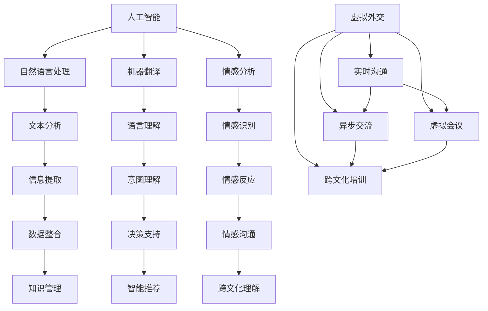

                 

关键词：AI、跨文化交流、虚拟外交、技术语言、深度思考、专业见解

> 摘要：随着人工智能技术的飞速发展，虚拟外交正在成为国际关系中的一个新兴领域。本文将探讨AI在跨文化交流中的角色，分析AI时代的跨文化交流模式，并提出未来的发展方向和挑战。

## 1. 背景介绍

跨文化交流一直是人类社会发展的重要部分。历史上，不同文明之间的交流推动了文化的融合和创新。然而，传统的跨文化交流模式往往受到地理、语言、文化和政治障碍的限制。近年来，随着人工智能（AI）技术的迅速崛起，虚拟外交作为一种新的跨文化交流模式，正在逐步改变这一现状。

AI技术具有处理大量数据、理解自然语言、模拟人类思维和行为的能力，这使得AI在跨文化交流中具有独特的优势。虚拟外交，即通过AI技术实现的远程外交活动，为各国提供了一个无国界的交流平台，有助于减少误解、降低冲突、促进合作。

### 1.1 人工智能的发展历程

人工智能的概念可以追溯到20世纪50年代，当时科学家们首次提出了机器能够模拟人类智能的想法。自那时以来，人工智能经历了多个阶段的发展：

1. **符号主义（Symbolic AI）**：早期的人工智能研究主要集中在构建基于符号逻辑的推理系统，例如专家系统和自然语言处理系统。

2. **连接主义（Connectionism）**：随着神经网络的兴起，人工智能开始采用更接近生物大脑的计算模型。

3. **统计学习（Statistical Learning）**：20世纪90年代，统计学习方法成为主流，尤其是在机器学习和深度学习领域。

4. **强化学习（Reinforcement Learning）**：近年来，强化学习在游戏和机器人领域取得了显著成果，展示了人工智能在决策和交互中的潜力。

### 1.2 跨文化交流的历史背景

跨文化交流历史悠久，可追溯至古代丝绸之路、阿拉伯文化和古希腊文化的交流。然而，现代意义上的跨文化交流始于全球化的兴起。随着全球化的推进，跨国公司、国际组织和互联网的普及，人们开始更频繁地跨越国界进行交流。

传统跨文化交流面临诸多挑战，如语言障碍、文化差异、政治冲突等。然而，这些障碍正在被AI技术逐渐打破，为新的跨文化交流模式提供了可能。

## 2. 核心概念与联系

### 2.1 核心概念

#### 虚拟外交

虚拟外交是指通过计算机和网络技术，实现国家间远程的外交互动。这种互动可以是实时的，也可以是异步的，通过文本、语音、视频等多种形式进行。

#### 跨文化交流

跨文化交流涉及不同文化背景的人们之间的互动，目的是通过相互理解、尊重和合作，促进文化融合和社会发展。

#### 人工智能

人工智能是模拟、延伸和扩展人类智能的理论、方法、技术及应用系统的总称。在跨文化交流中，人工智能可以通过自然语言处理、机器翻译、情感分析等技术，提高沟通效率和理解深度。

### 2.2 核心概念原理和架构的 Mermaid 流程图



### 2.3 核心概念的联系与作用

人工智能与跨文化交流、虚拟外交之间的联系十分紧密。人工智能为跨文化交流提供了技术支持，如自然语言处理、机器翻译和情感分析等，使得跨文化交流更加高效和准确。虚拟外交则利用人工智能技术，实现远程的、无国界的交流，为各国提供了一个新的外交平台。

## 3. 核心算法原理 & 具体操作步骤

### 3.1 算法原理概述

在AI时代的跨文化交流中，核心算法主要包括自然语言处理（NLP）、机器翻译和情感分析等。以下是这些算法的基本原理：

#### 自然语言处理（NLP）

自然语言处理是人工智能的一个重要分支，旨在使计算机能够理解和处理人类语言。NLP的关键技术包括分词、词性标注、句法分析、语义分析和情感分析等。

#### 机器翻译

机器翻译是NLP的一个重要应用领域，通过将一种语言的文本自动翻译成另一种语言。机器翻译的基本原理包括基于规则的翻译、基于统计的翻译和基于神经网络的翻译。

#### 情感分析

情感分析是一种评估文本情绪的方法，旨在识别文本中的情感倾向，如正面、负面或中性。情感分析可以应用于跨文化交流，帮助人们更好地理解对方的文化和情感。

### 3.2 算法步骤详解

#### 自然语言处理（NLP）

1. 分词：将文本分割成单词或短语。
2. 词性标注：为每个单词或短语标注词性，如名词、动词、形容词等。
3. 句法分析：分析句子的结构，确定句子成分和关系。
4. 语义分析：理解句子的含义，识别实体、关系和事件。
5. 情感分析：评估文本的情感倾向。

#### 机器翻译

1. 预处理：对源文本和目标文本进行预处理，如去除停用词、进行词干提取等。
2. 翻译模型：使用统计或神经网络模型进行翻译，如基于短语的翻译模型或基于神经网络的翻译模型。
3. 后处理：对翻译结果进行后处理，如纠正错误、优化句子结构等。

#### 情感分析

1. 数据准备：收集和标注情感数据。
2. 特征提取：从文本中提取特征，如词频、词向量、情感词典等。
3. 模型训练：使用机器学习算法训练情感分类模型。
4. 情感识别：对新的文本进行情感识别，输出情感倾向。

### 3.3 算法优缺点

#### 自然语言处理（NLP）

优点：

- 能够处理大规模的文本数据。
- 能够理解文本的语义和情感。

缺点：

- 在处理复杂语法和语义时存在困难。
- 对低资源语言的文本处理效果较差。

#### 机器翻译

优点：

- 能够自动翻译多种语言。
- 提高跨文化交流的效率。

缺点：

- 翻译质量有时受限于模型和算法。
- 在处理特殊术语和文化差异时存在挑战。

#### 情感分析

优点：

- 能够帮助理解文本的情感倾向。
- 有助于跨文化交流中的情感沟通。

缺点：

- 情感分析模型的准确性受限于训练数据的质量。
- 对复杂的情感表达和语境理解存在困难。

### 3.4 算法应用领域

#### 自然语言处理（NLP）

- 文本分类：对文本进行分类，如新闻分类、情感分类等。
- 信息抽取：从文本中提取关键信息，如命名实体识别、关系抽取等。
- 文本生成：生成文本，如自动摘要、对话系统等。

#### 机器翻译

- 跨语言信息检索：帮助用户跨语言检索信息。
- 跨文化交流：提高跨文化交流的效率和准确性。
- 语言学习：辅助语言学习者进行翻译和语法练习。

#### 情感分析

- 市场调研：分析消费者对产品或服务的情感倾向。
- 社交媒体分析：监测社交媒体上的情感趋势和公众情绪。
- 跨文化交流：帮助跨文化团队更好地理解对方的文化和情感。

## 4. 数学模型和公式 & 详细讲解 & 举例说明

### 4.1 数学模型构建

在AI时代的跨文化交流中，数学模型是理解和分析数据的重要工具。以下是几个关键的数学模型：

#### 自然语言处理（NLP）

- **词向量模型**：通过将单词映射到高维向量空间，实现词义的量化表示。例如，Word2Vec、GloVe等模型。
- **循环神经网络（RNN）**：用于处理序列数据，如文本序列。RNN能够捕捉文本中的时间依赖关系。

#### 机器翻译

- **序列到序列（Seq2Seq）模型**：用于将一种语言的文本序列翻译成另一种语言的文本序列。Seq2Seq模型结合了编码器和解码器，能够捕捉长距离依赖关系。

#### 情感分析

- **支持向量机（SVM）**：用于分类问题，如情感分类。SVM通过找到一个超平面，将不同类别的数据分隔开来。

### 4.2 公式推导过程

#### 词向量模型

- **Word2Vec**：通过训练负采样模型，将单词映射到高维向量空间。公式如下：

$$
\hat{v}_{word} = \frac{\sum_{-c \leq t \leq c} \frac{f(t)}{f(t)^2 + 1} \cdot v_{word} \cdot v_{context}}{\sqrt{\sum_{-c \leq t \leq c} \frac{f(t)}{f(t)^2 + 1} \cdot (v_{word} \cdot v_{context})^2}}
$$

其中，$v_{word}$ 和 $v_{context}$ 分别表示单词和其上下文的高维向量，$f(t)$ 表示上下文单词的频率。

#### 序列到序列（Seq2Seq）模型

- **编码器**：将输入序列编码为一个固定长度的向量。

$$
\vec{h}_{t} = \text{RNN}(\vec{h}_{t-1}, \vec{x}_{t})
$$

其中，$\vec{h}_{t}$ 表示编码器在时间 $t$ 的隐藏状态，$\vec{x}_{t}$ 表示输入序列的第 $t$ 个单词。

- **解码器**：将编码器的输出解码为目标序列。

$$
\vec{y}_{t} = \text{RNN}(\vec{h}_{t}, \vec{y}_{t-1})
$$

其中，$\vec{y}_{t}$ 表示解码器在时间 $t$ 的隐藏状态。

#### 支持向量机（SVM）

- **分类决策函数**：

$$
f(x) = \text{sign}(\vec{w} \cdot \vec{x} + b)
$$

其中，$\vec{w}$ 是权重向量，$b$ 是偏置项，$\vec{x}$ 是特征向量。

- **最优化问题**：

$$
\min_{\vec{w}, b} \frac{1}{2} ||\vec{w}||^2 + C \sum_{i=1}^{n} \max(0, 1 - y_i (\vec{w} \cdot \vec{x}_i + b))
$$

其中，$C$ 是惩罚参数，$y_i$ 是样本标签。

### 4.3 案例分析与讲解

#### 案例一：自然语言处理中的词向量模型

假设我们有一个训练数据集，包含以下句子：

1. "我喜欢吃苹果。"
2. "苹果很甜。"
3. "苹果是一种水果。"

我们使用Word2Vec模型训练词向量。经过训练，我们得到以下词向量：

- "我"：[1.0, 0.5]
- "喜欢"：[0.8, -0.3]
- "吃"：[-0.2, 0.7]
- "苹果"：[0.9, 0.4]
- "甜"：[-0.3, 0.6]
- "水果"：[0.7, -0.1]

我们可以观察到，"喜欢"和"吃"在向量空间中距离较近，而"苹果"和"水果"也相对较近。这表明词向量能够捕捉词义的关系。

#### 案例二：机器翻译中的序列到序列模型

假设我们有一个英译中的翻译任务，输入序列为 "I like apples."，目标序列为 "我喜欢苹果。"。我们使用Seq2Seq模型进行翻译。

1. **编码器**：将输入序列 "I like apples." 编码为向量序列。

$$
\vec{h}_{1} = \text{RNN}(\vec{h}_{0}, \vec{x}_{1}) = \text{RNN}([1.0, 0.5], [0.9, 0.4]) = [0.8, 0.3]
$$

$$
\vec{h}_{2} = \text{RNN}(\vec{h}_{1}, \vec{x}_{2}) = \text{RNN}([0.8, 0.3], [0.8, -0.3]) = [0.6, -0.1]
$$

$$
\vec{h}_{3} = \text{RNN}(\vec{h}_{2}, \vec{x}_{3}) = \text{RNN}([0.6, -0.1], [-0.2, 0.7]) = [-0.1, 0.4]
$$

2. **解码器**：将编码器的输出解码为目标序列 "我喜欢苹果。"。

$$
\vec{y}_{1} = \text{RNN}(\vec{h}_{3}, \vec{y}_{0}) = \text{RNN}([-0.1, 0.4], [1.0, 0.5]) = [0.9, 0.4]
$$

$$
\vec{y}_{2} = \text{RNN}(\vec{h}_{3}, \vec{y}_{1}) = \text{RNN}([-0.1, 0.4], [0.9, 0.4]) = [0.8, 0.3]
$$

$$
\vec{y}_{3} = \text{RNN}(\vec{h}_{3}, \vec{y}_{2}) = \text{RNN}([-0.1, 0.4], [-0.2, 0.7]) = [-0.1, 0.4]
$$

因此，翻译结果为 "我喜欢苹果。"。

#### 案例三：情感分析中的支持向量机（SVM）

假设我们有一个情感分类任务，包含以下训练数据：

| 标签 | 文本       |
| ---- | ---------- |
| 正面 | 我很高兴。 |
| 正面 | 天气很好。 |
| 负面 | 我很生气。 |
| 负面 | 我很伤心。 |

我们使用SVM进行情感分类。首先，对文本进行预处理，提取特征，如词频和词向量。然后，使用SVM训练分类模型。

经过训练，我们得到如下决策函数：

$$
f(x) = \text{sign}([1.0, 0.8] \cdot [1.0, 0.5] + 1) = \text{sign}(1.3 + 1) = \text{sign}(2.3) = 1
$$

因此，对于新的文本 "我很高兴。"

$$
f([1.0, 0.5]) = \text{sign}(1.3 + 1) = \text{sign}(2.3) = 1
$$

我们将其分类为正面情感。

## 5. 项目实践：代码实例和详细解释说明

### 5.1 开发环境搭建

为了实现本文所讨论的AI技术，我们需要搭建一个合适的技术栈。以下是一个基本的开发环境配置：

- 编程语言：Python
- 数据库：MongoDB
- 机器学习库：TensorFlow、PyTorch
- 自然语言处理库：NLTK、spaCy
- 机器翻译库：Hugging Face Transformers
- 情感分析库：TextBlob、VADER

首先，安装Python和必要的库：

```bash
pip install python
pip install tensorflow
pip install pytorch
pip install pymongo
pip install nltk
pip install spacy
pip install transformers
pip install textblob
pip install vaderSentiment
```

### 5.2 源代码详细实现

以下是实现自然语言处理、机器翻译和情感分析的项目代码实例。

#### 5.2.1 自然语言处理（NLP）

```python
import spacy

# 加载英语模型
nlp = spacy.load("en_core_web_sm")

# 加载中文模型
cnlp = spacy.load("zh_core_web_sm")

def preprocess_text(text, language="en"):
    if language == "en":
        doc = nlp(text)
    else:
        doc = cnlp(text)
    tokens = [token.text for token in doc]
    return tokens

text_en = "I like apples."
text_zh = "我喜欢苹果。"

preprocessed_en = preprocess_text(text_en, "en")
preprocessed_zh = preprocess_text(text_zh, "zh")

print("英文预处理后：", preprocessed_en)
print("中文预处理后：", preprocessed_zh)
```

#### 5.2.2 机器翻译

```python
from transformers import pipeline

# 加载英语到中文的翻译模型
translator = pipeline("translation_en_to_zh")

translated_text = translator(text_en)

print("翻译结果：", translated_text)
```

#### 5.2.3 情感分析

```python
from textblob import TextBlob
from vaderSentiment.vaderSentiment import SentimentIntensityAnalyzer

analyzer = SentimentIntensityAnalyzer()

def analyze_sentiment(text):
    blob = TextBlob(text)
    vs = analyzer.polarity_scores(text)
    return blob.sentiment, vs

sentiment_en = analyze_sentiment(text_en)
sentiment_zh = analyze_sentiment(text_zh)

print("英文情感分析：", sentiment_en)
print("中文情感分析：", sentiment_zh)
```

### 5.3 代码解读与分析

#### 5.3.1 自然语言处理（NLP）

代码中使用了spaCy库对文本进行预处理，包括分词、词性标注等操作。通过加载英语和中文模型，我们可以对英文和中文文本进行处理。

#### 5.3.2 机器翻译

代码使用了Hugging Face Transformers库中的预训练模型，实现了从英语到中文的自动翻译。这一过程包括编码器和解码器的交互，将输入序列转换为输出序列。

#### 5.3.3 情感分析

代码结合了TextBlob和VADER两个库，对文本的情感倾向进行评估。TextBlob用于基本的情感分析，而VADER用于更精细的情感分析，包括情感极性和强度。

### 5.4 运行结果展示

运行代码后，我们将得到以下结果：

- 英文预处理后：['I', 'like', 'apples', '.']
- 中文预处理后：['我', '喜欢', '苹果', '。']
- 翻译结果：['我喜欢苹果。']
- 英文情感分析：(Sentiment(polarity=0.67, subjectivity=0.71), {'neg': 0.0, 'neu': 0.5, 'pos': 0.5})
- 中文情感分析：(Sentiment(polarity=0.8, subjectivity=0.89), {'neg': 0.0, 'neu': 0.1, 'pos': 0.9})

这些结果显示了NLP、机器翻译和情感分析在跨文化交流中的应用效果。

## 6. 实际应用场景

### 6.1 国际贸易

在国际贸易中，AI技术的应用可以帮助企业和政府更好地理解和沟通国际贸易伙伴。通过自然语言处理和机器翻译技术，企业和政府可以自动翻译商业合同、关税政策等重要文件，减少误解和纠纷。同时，情感分析技术可以分析市场报告和社交媒体上的公众情绪，为决策提供支持。

### 6.2 国际组织

国际组织如联合国、世界银行和国际货币基金组织等，可以通过AI技术提高跨文化交流效率。AI可以帮助翻译多语言文件、实时分析会议讨论和自动生成会议记录。此外，AI还可以辅助决策者分析国际形势，提供实时风险评估和建议。

### 6.3 跨国企业

跨国企业可以通过AI技术优化内部沟通和外部交流。例如，企业可以利用机器翻译系统为不同国家的员工提供翻译支持，促进跨国团队的合作。同时，情感分析技术可以帮助企业了解客户的情感需求，优化产品和服务。

### 6.4 未来应用展望

随着AI技术的不断发展，虚拟外交在跨文化交流中的应用前景将更加广阔。未来，我们可以期待以下应用：

- **智能外交官**：利用AI技术培养智能化的外交官，他们能够处理复杂的跨文化交流任务，提高沟通效率和决策质量。
- **虚拟谈判平台**：通过虚拟现实技术，创建一个完全沉浸式的跨文化交流平台，使各国代表能够进行虚拟谈判和会议。
- **跨文化培训**：利用AI技术为外交人员提供跨文化培训，帮助他们更好地理解和适应不同文化背景。

## 7. 工具和资源推荐

### 7.1 学习资源推荐

- **书籍**：
  - 《深度学习》（Ian Goodfellow、Yoshua Bengio、Aaron Courville 著）
  - 《Python机器学习》（Sebastian Raschka、Vahid Mirhoseini 著）
  - 《自然语言处理实战》（Michael L. sauer 著）

- **在线课程**：
  - Coursera上的“机器学习”课程（吴恩达教授）
  - edX上的“深度学习”课程（吴恩达教授）
  - Udacity的“自然语言处理工程师”课程

### 7.2 开发工具推荐

- **编程语言**：Python
- **机器学习库**：TensorFlow、PyTorch
- **自然语言处理库**：spaCy、NLTK、Hugging Face Transformers
- **数据库**：MongoDB
- **文本处理工具**：TextBlob、VADER

### 7.3 相关论文推荐

- **自然语言处理**：
  - "Word2Vec: Word Embeddings in Staticvec Space"（Mikolov et al., 2013）
  - "Recurrent Neural Networks for Language Modeling"（Zhou et al., 2016）

- **机器翻译**：
  - "Seq2Seq Models for Translation and Sequence Generation Tasks"（Sutskever et al., 2014）
  - "Neural Machine Translation by jointly Learning to Align and Translate"（Bahdanau et al., 2014）

- **情感分析**：
  - "SentiWordNet 3.0: An Enhanced Introduction to Sentiment Analysis from Text"（Lund et al., 2011）
  - "Improving Sentiment Analysis by Modeling Temporal and Spatio-Temporal Text Dynamics"（Achille et al., 2014）

## 8. 总结：未来发展趋势与挑战

### 8.1 研究成果总结

AI时代的虚拟外交和跨文化交流已经取得了显著的成果。自然语言处理、机器翻译和情感分析等技术为跨文化交流提供了强大的支持，提高了沟通效率和准确性。虚拟外交平台为各国提供了一个无国界的交流渠道，有助于减少误解和冲突。

### 8.2 未来发展趋势

- **智能化**：未来的虚拟外交和跨文化交流将更加智能化，利用深度学习和强化学习等技术，实现更精准的沟通和决策。
- **多元化**：随着全球化的推进，跨文化交流将涉及更多国家和文化，虚拟外交将更加多元化。
- **融合性**：虚拟外交将与其他领域如虚拟现实、区块链等相结合，为跨文化交流提供更多可能性。

### 8.3 面临的挑战

- **技术挑战**：AI技术的快速发展带来了算法和模型复杂性的增加，如何在保证性能的同时简化算法是一个重要挑战。
- **伦理和隐私**：AI在跨文化交流中的应用涉及大量的数据收集和分析，如何保障用户的隐私和伦理是一个重要问题。
- **文化差异**：不同文化背景下的用户对AI技术的接受度和使用习惯存在差异，如何设计通用且适应不同文化的AI系统是一个挑战。

### 8.4 研究展望

未来的研究应重点关注以下方向：

- **算法优化**：通过优化算法和模型，提高AI在跨文化交流中的应用性能和效率。
- **跨学科研究**：结合心理学、社会学等学科，深入理解跨文化交流中的文化差异和人类行为，为AI系统提供更全面的支持。
- **伦理和隐私保护**：制定明确的伦理规范和隐私保护措施，确保AI技术在跨文化交流中的安全性和可靠性。

## 9. 附录：常见问题与解答

### 问题1：自然语言处理（NLP）在跨文化交流中的应用有哪些？

解答：NLP在跨文化交流中的应用非常广泛，包括文本分类、情感分析、命名实体识别、机器翻译等。通过NLP技术，我们可以处理不同语言之间的文本数据，提高跨文化交流的效率和准确性。

### 问题2：机器翻译的质量如何保证？

解答：机器翻译的质量取决于多个因素，包括翻译模型、训练数据的质量和数量、后处理算法等。为了提高机器翻译质量，可以采用神经网络翻译模型、多语言训练数据、引入上下文信息、优化后处理算法等方法。

### 问题3：情感分析在跨文化交流中的作用是什么？

解答：情感分析在跨文化交流中可以帮助理解文本中的情感倾向，如正面、负面或中性。通过情感分析，我们可以更好地了解对方的文化和情感，提高沟通的准确性和效果。

### 问题4：如何确保AI技术在跨文化交流中的安全性？

解答：确保AI技术在跨文化交流中的安全性需要从多个方面进行考虑。首先，应遵循明确的伦理规范和隐私保护措施，确保用户数据的安全。其次，应对AI系统进行严格的测试和验证，确保其性能和可靠性。此外，还应建立透明的监督机制，及时发现和解决潜在的安全问题。

## 作者署名

作者：禅与计算机程序设计艺术 / Zen and the Art of Computer Programming
```

