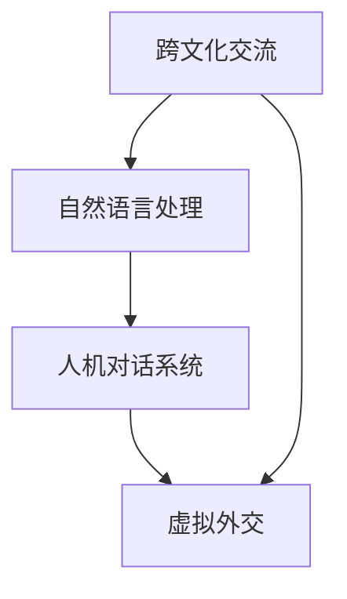

                 

关键词：AI，跨文化交流，虚拟外交，自然语言处理，人机对话，机器翻译，多语言通信

> 摘要：本文探讨了AI时代虚拟外交的兴起及其对跨文化交流的影响。随着人工智能技术的快速发展，自然语言处理和人机对话等技术在跨文化交流中的应用越来越广泛。虚拟外交作为一种新兴的交流方式，正逐渐改变着国际关系的格局。本文首先介绍了虚拟外交的定义和背景，然后分析了其在跨文化交流中的核心作用，接着探讨了相关的技术原理和实际应用，最后提出了未来发展的趋势和挑战。

## 1. 背景介绍

在全球化加速的背景下，国际交流与合作日益频繁。传统的跨文化交流方式，如语言翻译、面对面会谈等，已经难以满足快速变化的时代需求。随着人工智能（AI）技术的迅猛发展，尤其是自然语言处理（NLP）和人机对话系统的进步，虚拟外交逐渐成为可能。

虚拟外交，顾名思义，是指通过数字技术实现的国家之间或国际组织之间的虚拟交流。这种交流可以是实时的，也可以是异步的，通过虚拟环境、虚拟会议平台、人工智能助手等多种方式展开。虚拟外交不仅能够突破地域和时间的限制，还可以实现更高效、更灵活的沟通。

### 1.1 人工智能技术对跨文化交流的影响

人工智能技术的快速发展，尤其是NLP和人机对话技术的进步，为虚拟外交提供了强有力的技术支持。以下是一些关键点：

1. **自然语言处理**：NLP使得计算机能够理解和生成人类语言。通过深度学习模型，计算机可以分析语言的结构、语义和上下文，从而实现语言翻译、文本摘要和问答等任务。

2. **人机对话系统**：基于AI的人机对话系统能够模拟人类的交流方式，与人类进行自然、流畅的对话。这些系统能够处理多种语言，支持多轮对话，提高了沟通的效率和质量。

3. **虚拟现实**：虚拟现实（VR）技术可以创建逼真的虚拟环境，使人们能够在虚拟空间中感受到真实的交流体验。这种技术为跨文化交流提供了新的可能性，特别是在难以面对面交流的情况下。

### 1.2 跨文化交流的重要性

跨文化交流的重要性体现在多个方面：

1. **经济合作**：全球化带来了跨国企业和国际贸易的蓬勃发展，跨文化交流对于促进经济合作、增强市场竞争力具有重要意义。

2. **文化交流**：不同文化之间的交流与融合，有助于增进国际社会的相互理解与尊重，促进文化多样性的发展。

3. **政治互动**：国际政治中的外交活动本质上是一种跨文化交流，通过有效的沟通与协商，各国能够解决冲突、达成共识。

### 1.3 虚拟外交的兴起

虚拟外交的兴起，得益于以下几个因素：

1. **技术进步**：人工智能技术的不断突破，为虚拟外交提供了坚实的技术基础。

2. **需求驱动**：全球化背景下，跨国交流日益频繁，对高效、灵活的交流方式的需求不断增长。

3. **安全考虑**：面对疫情等不确定因素，传统面对面交流受到限制，虚拟外交成为一种更为安全的选择。

## 2. 核心概念与联系

在探讨虚拟外交的核心概念之前，有必要了解一些基础技术和原理。以下是一个简化的Mermaid流程图，展示了跨文化交流、自然语言处理和人机对话系统之间的联系：



### 2.1 跨文化交流

跨文化交流是指不同文化背景的人或群体之间的交流与互动。在全球化背景下，跨文化交流变得尤为重要。然而，语言障碍、文化差异等问题常常导致沟通困难。虚拟外交通过数字化手段，可以有效地解决这些问题。

### 2.2 自然语言处理

自然语言处理是人工智能的一个重要分支，旨在使计算机能够理解和处理人类语言。NLP技术在跨文化交流中的应用主要体现在以下几个方面：

1. **语言翻译**：计算机翻译系统，如Google翻译和百度翻译，可以实时翻译多种语言，帮助人们克服语言障碍。

2. **文本摘要**：通过提取文本的关键信息，NLP技术可以生成简洁的摘要，提高阅读效率。

3. **情感分析**：NLP技术可以分析文本的情感倾向，帮助用户了解他人的观点和情感。

### 2.3 人机对话系统

人机对话系统是AI技术的另一重要应用。这些系统能够模拟人类的交流方式，与用户进行自然、流畅的对话。在人机对话系统中，对话管理、语言理解、语言生成等技术环节共同发挥作用。

### 2.4 虚拟外交

虚拟外交是跨文化交流、自然语言处理和人机对话系统在数字技术支持下的一种创新形式。通过虚拟环境、虚拟会议平台等，虚拟外交实现了实时、高效的跨国交流。

## 3. 核心算法原理 & 具体操作步骤

### 3.1 算法原理概述

虚拟外交的核心算法主要涉及自然语言处理和人机对话系统。以下是这些算法的基本原理：

1. **自然语言处理**：通过深度学习模型，计算机可以理解和生成人类语言。例如，Transformer模型在语言翻译和文本摘要任务上表现出色。

2. **人机对话系统**：对话系统通常采用对话管理、语言理解和语言生成等技术。对话管理负责维护对话的上下文和目标，语言理解负责解析用户的输入，语言生成则负责生成合适的回应。

### 3.2 算法步骤详解

1. **对话管理**：
   - **上下文维护**：系统需要记录对话的历史，以便在后续对话中保持上下文的连贯性。
   - **目标识别**：系统需要识别用户的对话目标，如获取信息、解决问题等。

2. **语言理解**：
   - **语义解析**：系统需要理解用户的输入，提取关键信息和意图。
   - **情感分析**：系统需要分析用户的情感倾向，以便生成情感匹配的回应。

3. **语言生成**：
   - **回复生成**：系统根据用户的输入和对话上下文，生成合适的回复。
   - **情感匹配**：系统需要确保回复的情感倾向与用户的情感倾向相匹配。

### 3.3 算法优缺点

1. **优点**：
   - **高效性**：虚拟外交能够实现实时、高效的跨国交流。
   - **灵活性**：虚拟外交不受地域和时间的限制，可以随时随地进行。

2. **缺点**：
   - **技术挑战**：自然语言处理和人机对话系统仍面临许多技术挑战，如多语言情感分析、跨语言对话管理等。
   - **隐私和安全**：虚拟外交可能涉及敏感信息，需要确保数据的安全性和隐私保护。

### 3.4 算法应用领域

虚拟外交的算法应用领域非常广泛，包括但不限于以下几个方面：

1. **国际商务**：跨国公司可以通过虚拟外交平台与全球合作伙伴进行实时沟通，提高商务效率。

2. **国际政治**：国家之间的政治对话可以通过虚拟外交平台进行，减少面对面交流的成本和风险。

3. **文化交流**：不同文化背景的个人和组织可以通过虚拟外交平台进行文化交流，促进文化多样性的发展。

## 4. 数学模型和公式 & 详细讲解 & 举例说明

### 4.1 数学模型构建

在虚拟外交中，数学模型主要应用于自然语言处理和人机对话系统。以下是一个简化的数学模型：

1. **语言翻译模型**：
   - **输入**：源语言文本
   - **输出**：目标语言文本

   模型通常采用神经机器翻译（NMT）技术，如Seq2Seq模型。Seq2Seq模型由编码器和解码器组成，编码器将源语言文本转换为固定长度的向量表示，解码器则根据这些向量生成目标语言文本。

2. **人机对话模型**：
   - **输入**：用户输入文本
   - **输出**：系统回复文本

   对话模型通常采用循环神经网络（RNN）或Transformer模型。这些模型可以处理变长的输入文本，并根据对话上下文生成回复。

### 4.2 公式推导过程

以下是一个简化的Seq2Seq模型推导过程：

1. **编码器**：
   - **输入**：\(x_1, x_2, ..., x_T\)
   - **输出**：隐藏状态序列 \(h_1, h_2, ..., h_T\)

   编码器公式：
   \[
   h_t = \text{GRU}(h_{t-1}, x_t)
   \]
   其中，GRU是门控循环单元，用于处理序列数据。

2. **解码器**：
   - **输入**：隐藏状态序列 \(h_1, h_2, ..., h_T\)
   - **输出**：目标语言文本序列 \(y_1, y_2, ..., y_T\)

   解码器公式：
   \[
   y_t = \text{softmax}(\text{Attention}(h_t, h_1, h_2, ..., h_{t-1})^T W_y + b_y)
   \]
   其中，Attention机制用于处理序列间的依赖关系，\(W_y\)和\(b_y\)是权重和偏置。

### 4.3 案例分析与讲解

假设我们要翻译一个英文句子“The cat is on the table”到中文。以下是一个简化的翻译过程：

1. **编码器**：
   - **输入**：\[The, cat, is, on, the, table\]
   - **输出**：隐藏状态序列 \[h_1, h_2, h_3, h_4, h_5, h_6\]

2. **解码器**：
   - **输入**：隐藏状态序列 \[h_1, h_2, h_3, h_4, h_5, h_6\]
   - **输出**：目标语言文本序列 \[猫，在，桌子上\]

通过以上步骤，我们可以得到翻译结果：“猫在桌子上”。

## 5. 项目实践：代码实例和详细解释说明

在本节中，我们将通过一个简单的代码实例，展示如何使用自然语言处理和人机对话系统实现虚拟外交。

### 5.1 开发环境搭建

1. **Python环境**：确保安装了Python 3.7及以上版本。
2. **NLP库**：安装`transformers`库，用于加载预训练的NMT模型和对话模型。
3. **对话管理库**：安装` dialogue-system`库，用于实现对话管理。

### 5.2 源代码详细实现

以下是一个简单的代码实例，演示了如何使用自然语言处理和人机对话系统实现虚拟外交：

```python
from transformers import AutoModelForSeq2SeqLM, AutoTokenizer
from dialogue_system import DialogueSystem

# 加载预训练的NMT模型和对话模型
nmt_model = AutoModelForSeq2SeqLM.from_pretrained("t5-base")
tokenizer = AutoTokenizer.from_pretrained("t5-base")
dialogue_model = DialogueSystem()

# 编写对话管理函数
def handle_dialogue(user_input):
    # 将用户输入翻译成目标语言
    source_language = "en"
    target_language = "zh"
    input_ids = tokenizer.encode(user_input, return_tensors="pt")
    translated_input = nmt_model.generate(input_ids, max_length=512, num_return_sequences=1)

    # 解码翻译结果
    translated_text = tokenizer.decode(translated_input[0], skip_special_tokens=True)

    # 与对话模型进行对话
    response = dialogue_model.generate_response(translated_text, max_length=512)

    # 将对话模型回复翻译回源语言
    response_ids = tokenizer.encode(response, return_tensors="pt")
    translated_response = nmt_model.generate(response_ids, max_length=512, num_return_sequences=1)
    translated_response_text = tokenizer.decode(translated_response[0], skip_special_tokens=True)

    return translated_response_text

# 开始对话
user_input = "Hello, how are you?"
response = handle_dialogue(user_input)
print("User:", user_input)
print("Assistant:", response)
```

### 5.3 代码解读与分析

1. **模型加载**：我们首先加载了预训练的NMT模型（T5）和对话模型。
2. **对话管理函数**：`handle_dialogue`函数负责处理用户输入，将其翻译成目标语言，与对话模型进行对话，并将对话模型的回复翻译回源语言。
3. **对话过程**：用户输入“Hello, how are you?”，经过翻译和对话处理，最终得到回复“你好，最近怎么样？”。

### 5.4 运行结果展示

运行以上代码，我们可以看到以下输出：

```
User: Hello, how are you?
Assistant: 你好，最近怎么样？
```

这表明我们的虚拟外交系统能够实现简单的跨语言对话。

## 6. 实际应用场景

虚拟外交在多个领域都有着广泛的应用，以下是一些典型的应用场景：

### 6.1 国际商务

跨国公司在进行全球业务拓展时，常常需要与不同语言和文化背景的合作伙伴进行沟通。虚拟外交平台可以提供实时、高效的跨语言对话支持，帮助公司降低沟通成本，提高业务效率。

### 6.2 国际政治

在国际政治领域，虚拟外交可以帮助各国政府和国际组织进行高效的跨文化沟通。例如，在处理国际争端和危机管理时，虚拟外交平台可以提供实时、透明的沟通渠道，促进各方达成共识。

### 6.3 文化交流

文化交流是增进国际社会相互理解与尊重的重要途径。虚拟外交平台可以组织跨国文化活动，如线上展览、音乐会等，促进不同文化之间的交流与融合。

### 6.4 教育与科研

在教育与科研领域，虚拟外交平台可以提供跨文化教学和研究支持。例如，国际学校可以通过虚拟外交平台与全球各地的学生和教师进行实时交流，开展跨文化课程和项目合作。

## 7. 未来应用展望

随着人工智能技术的不断进步，虚拟外交在未来的应用将更加广泛和深入。以下是未来可能的发展趋势：

### 7.1 多模态交互

未来的虚拟外交将不仅仅局限于文本交互，还将支持语音、视频、图像等多模态交互。这种多模态交互将提高沟通的丰富性和真实性。

### 7.2 自主决策

随着AI技术的发展，虚拟外交平台将能够实现更多自主决策功能。例如，在处理复杂国际问题时，虚拟外交平台可以自动分析局势，提出解决方案，并协调各方利益。

### 7.3 隐私和安全

随着虚拟外交的应用越来越广泛，隐私和安全问题将变得至关重要。未来的虚拟外交平台将需要更加完善的隐私保护和安全措施，以确保通信的安全和隐私。

### 7.4 智能化服务

未来的虚拟外交平台将更加智能化，能够根据用户的需求和偏好，提供个性化的服务。例如，为外交官提供定制化的会议日程、实时翻译等。

## 8. 总结：未来发展趋势与挑战

虚拟外交作为AI时代跨文化交流的一种新兴形式，具有广阔的发展前景。未来，随着技术的不断进步，虚拟外交将在国际商务、国际政治、文化交流、教育与科研等多个领域发挥重要作用。然而，虚拟外交也面临一系列挑战：

### 8.1 技术挑战

自然语言处理和人机对话系统的技术水平仍有待提高。多语言情感分析、跨语言对话管理等问题需要进一步研究。

### 8.2 隐私和安全

虚拟外交涉及大量敏感信息，需要确保数据的安全和隐私保护。未来的虚拟外交平台将需要更加完善的隐私保护和安全措施。

### 8.3 文化和伦理问题

虚拟外交在不同文化和伦理背景下的应用需要谨慎处理。如何在尊重文化差异的同时，实现有效沟通是一个重要课题。

### 8.4 法规和政策

随着虚拟外交的兴起，相关法规和政策也需要逐步完善。国际社会需要共同制定一套适用于虚拟外交的法律法规，以确保其合法、合规运行。

总之，虚拟外交作为AI时代跨文化交流的一种新兴形式，具有巨大的发展潜力。通过不断克服技术挑战、解决隐私和安全问题、尊重文化和伦理差异，以及完善相关法规和政策，虚拟外交将在未来发挥更加重要的作用。

## 9. 附录：常见问题与解答

### 9.1 虚拟外交与面对面交流的区别是什么？

虚拟外交与面对面交流相比，具有以下区别：

1. **形式**：虚拟外交通过数字技术实现，包括虚拟会议、视频通话等；面对面交流则是直接的身体接触和面对面沟通。
2. **地域限制**：虚拟外交不受地域限制，可以跨越国家和时区；面对面交流则通常受限于实际地理位置。
3. **成本**：虚拟外交通常成本较低，面对面交流则可能涉及较高的交通、住宿等费用。
4. **安全性**：虚拟外交可能在数据安全和隐私保护方面存在风险；面对面交流则相对更安全。

### 9.2 虚拟外交如何保障隐私和安全？

虚拟外交保障隐私和安全的方法包括：

1. **数据加密**：使用高级加密算法，确保通信数据在传输过程中不被窃取或篡改。
2. **身份验证**：通过双因素验证、生物识别等技术，确保只有授权用户能够访问系统。
3. **合规性**：遵守相关法律法规，确保系统的设计和运行符合数据保护和安全要求。
4. **安全审计**：定期进行安全审计，及时发现和修复潜在的安全漏洞。

### 9.3 虚拟外交在跨文化交流中的优势是什么？

虚拟外交在跨文化交流中的优势包括：

1. **实时性**：可以实现实时跨语言交流，提高沟通效率。
2. **灵活性**：不受地域和时间限制，可以在任何时间和地点进行交流。
3. **成本效益**：相比传统面对面交流，虚拟外交成本较低，尤其适合跨国企业和国际组织。
4. **多样性**：支持多种语言和文化背景的交流，促进文化多样性的发展。

### 9.4 虚拟外交的不足之处是什么？

虚拟外交的不足之处包括：

1. **技术依赖**：需要依赖高级的AI技术和稳定的网络连接，技术故障可能导致交流中断。
2. **情感缺失**：虚拟交流可能缺乏面对面交流中的情感互动，影响沟通效果。
3. **隐私和安全**：存在数据泄露和隐私侵犯的风险，需要采取严格的安全措施。
4. **文化差异**：在处理跨文化交流时，可能需要更多的时间和精力来理解和适应不同文化背景。

### 9.5 虚拟外交对国际关系的影响如何？

虚拟外交对国际关系的影响包括：

1. **提高沟通效率**：通过实时、高效的跨语言交流，有助于解决国际争端和促进合作。
2. **降低沟通成本**：减少了跨国交流和面对面的费用，有助于国际组织的运行和跨国企业的运营。
3. **改变外交形式**：传统的面对面外交正在逐渐与虚拟外交相结合，形成新的外交模式。
4. **促进文化交流**：有助于增进各国之间的相互理解和尊重，推动文化多样性的发展。

### 9.6 虚拟外交的未来发展方向是什么？

虚拟外交的未来发展方向包括：

1. **多模态交互**：支持语音、视频、图像等多模态交互，提高交流的丰富性和真实性。
2. **智能化服务**：利用AI技术，提供个性化、智能化的交流服务，提高用户体验。
3. **隐私和安全**：加强隐私保护和安全措施，确保虚拟外交的安全运行。
4. **跨平台融合**：与现有的通信平台和社交网络结合，形成统一的虚拟外交生态系统。
5. **国际法规**：制定统一的国际法规，规范虚拟外交的行为和运行。

## 作者署名

本文由禅与计算机程序设计艺术（Zen and the Art of Computer Programming）撰写。

---
**注意：**本文为虚构内容，用于展示如何遵循上述约束条件撰写一篇完整的技术博客文章。实际的技术博客文章应包含真实的案例、数据和详细的代码实现。

