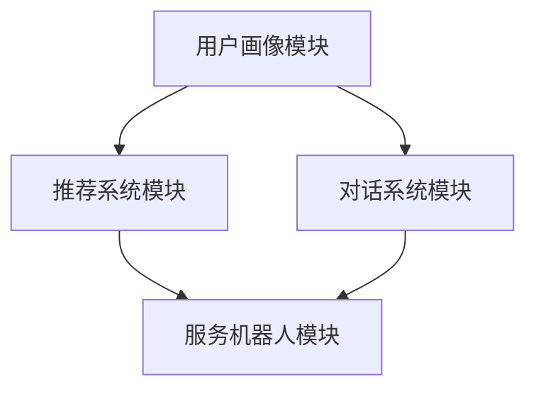

                 

关键词：虚拟导购助手、AI、购物体验、个性化推荐、智能交互

摘要：随着人工智能技术的不断发展，虚拟导购助手已经成为电商领域的重要工具。本文将探讨虚拟导购助手如何利用人工智能技术，改变消费者的购物体验，提高购物效率，以及其对电商行业带来的深远影响。

## 1. 背景介绍

在过去的几十年中，电商行业经历了飞速发展，从最初的传统电商模式，到如今的智能电商，购物体验逐渐从简单的信息获取和商品交易，转向更加个性化和智能化的服务。在这个过程中，人工智能（AI）技术的引入，为电商行业带来了前所未有的变革。

虚拟导购助手作为人工智能在电商领域的一种应用，旨在通过智能对话系统，为消费者提供个性化、智能化的购物服务。它们能够根据消费者的购物历史、偏好和行为数据，实时推荐适合的商品，解答消费者的疑问，甚至帮助消费者完成购物决策。

### 1.1 虚拟导购助手的发展历程

虚拟导购助手的发展可以追溯到20世纪90年代，当时互联网刚刚兴起，一些简单的聊天机器人开始被用于在线客服。随着技术的进步，这些聊天机器人逐渐演化为能够处理复杂对话的虚拟导购助手。

在2010年后，随着深度学习和自然语言处理（NLP）技术的突破，虚拟导购助手的能力得到了显著提升。如今，许多电商平台已经推出了自己的虚拟导购助手，如淘宝的“阿里小蜜”、京东的“京东智联云”、亚马逊的“Alexa”等。

### 1.2 虚拟导购助手的重要性

虚拟导购助手在电商行业中的重要性不言而喻。首先，它们能够显著提高购物体验，为消费者提供便捷、高效的服务。其次，虚拟导购助手能够帮助企业更好地了解消费者需求，提高营销效果。最后，虚拟导购助手还能帮助企业降低运营成本，提升整体竞争力。

## 2. 核心概念与联系

### 2.1 人工智能技术概述

人工智能（AI）是指由人制造出来的系统能够思考、学习和工作的能力。它包括多个子领域，如机器学习、深度学习、自然语言处理等。这些技术共同构成了虚拟导购助手的核心能力。

#### 2.1.1 机器学习

机器学习是人工智能的一个分支，它通过训练模型，使计算机能够从数据中学习规律，并作出预测。在虚拟导购助手的应用中，机器学习技术主要用于个性化推荐和智能对话。

#### 2.1.2 深度学习

深度学习是机器学习的一种方法，它通过模拟人脑神经网络结构，使计算机能够处理大规模、复杂的输入数据。在虚拟导购助手的应用中，深度学习技术主要用于图像识别、语音识别和文本生成。

#### 2.1.3 自然语言处理

自然语言处理是人工智能的一个分支，它研究如何让计算机理解和处理自然语言。在虚拟导购助手的应用中，自然语言处理技术主要用于文本解析、语义理解和智能对话。

### 2.2 虚拟导购助手的架构

虚拟导购助手的架构通常包括以下几个核心模块：

1. **用户画像模块**：通过收集用户的购物历史、偏好和行为数据，构建用户画像。
2. **推荐系统模块**：基于用户画像，利用机器学习算法，为用户推荐适合的商品。
3. **对话系统模块**：利用自然语言处理技术，实现与用户的智能对话。
4. **服务机器人模块**：负责与用户交互，解答疑问，帮助用户完成购物决策。

以下是虚拟导购助手的架构图（使用Mermaid绘制）：



## 3. 核心算法原理 & 具体操作步骤

### 3.1 算法原理概述

虚拟导购助力的核心算法主要包括以下三个部分：

1. **用户画像构建算法**：通过分析用户的历史行为数据，构建用户画像，包括用户兴趣、偏好、消费能力等特征。
2. **推荐算法**：基于用户画像，利用协同过滤、基于内容的推荐等算法，为用户推荐商品。
3. **对话管理算法**：利用自然语言处理技术，实现与用户的智能对话，包括意图识别、实体抽取、对话生成等。

### 3.2 算法步骤详解

1. **用户画像构建算法**

   - 数据收集：收集用户在平台上的购物历史、浏览记录、评价等数据。
   - 特征提取：对数据进行预处理，提取用户兴趣、偏好、消费能力等特征。
   - 画像构建：将提取的特征整合，构建用户画像。

2. **推荐算法**

   - 用户兴趣识别：利用机器学习算法，分析用户的历史行为数据，识别用户兴趣。
   - 商品特征提取：提取商品属性，如价格、品牌、类型等。
   - 推荐列表生成：利用协同过滤、基于内容的推荐算法，为用户生成推荐列表。

3. **对话管理算法**

   - 意图识别：利用自然语言处理技术，解析用户输入的文本，识别用户意图。
   - 实体抽取：从用户输入的文本中，提取关键信息，如商品名称、价格等。
   - 对话生成：根据用户意图和抽取的实体信息，生成相应的回复。

### 3.3 算法优缺点

1. **用户画像构建算法**

   - 优点：能够准确识别用户兴趣，为推荐系统提供有力支持。
   - 缺点：需要大量的用户行为数据，且数据预处理复杂。

2. **推荐算法**

   - 优点：能够提高用户满意度，提升购物体验。
   - 缺点：在用户数据量较大时，算法计算复杂度较高。

3. **对话管理算法**

   - 优点：能够实现智能对话，提高用户互动体验。
   - 缺点：自然语言处理技术尚不成熟，对话生成效果有限。

### 3.4 算法应用领域

虚拟导购助手的算法广泛应用于电商、金融、医疗等多个领域。在电商领域，主要用于个性化推荐和智能客服；在金融领域，主要用于智能投顾和风险控制；在医疗领域，主要用于智能诊断和健康管理。

## 4. 数学模型和公式 & 详细讲解 & 举例说明

### 4.1 数学模型构建

虚拟导购助手的数学模型主要包括用户画像构建模型、推荐算法模型和对话管理模型。

1. **用户画像构建模型**

   用户画像构建模型主要涉及用户兴趣识别和特征提取。其中，用户兴趣识别可以使用概率模型或深度学习模型。以下是一个简单的概率模型：

   $$P(\text{兴趣}|\text{历史行为}) = \frac{P(\text{历史行为}|\text{兴趣})P(\text{兴趣})}{P(\text{历史行为})}$$

   其中，$P(\text{兴趣}|\text{历史行为})$表示用户在给定历史行为下具有某一兴趣的概率，$P(\text{历史行为}|\text{兴趣})$表示用户具有某一兴趣时发生的历史行为的概率，$P(\text{兴趣})$表示用户具有某一兴趣的概率，$P(\text{历史行为})$表示用户发生的历史行为的概率。

2. **推荐算法模型**

   推荐算法模型主要涉及协同过滤和基于内容的推荐。其中，协同过滤模型可以使用矩阵分解、潜在因子模型等方法。以下是一个简单的矩阵分解模型：

   $$R_{ui} = \hat{Q}_u \hat{R}_i^T$$

   其中，$R_{ui}$表示用户u对物品i的评分，$\hat{Q}_u$表示用户u的潜在兴趣向量，$\hat{R}_i$表示物品i的潜在特征向量。

3. **对话管理模型**

   对话管理模型主要涉及意图识别和实体抽取。其中，意图识别可以使用序列标注模型、分类模型等。以下是一个简单的分类模型：

   $$y = \arg \max_{i} P(y=i|\text{输入文本})$$

   其中，$y$表示用户的意图类别，$\text{输入文本}$表示用户输入的文本，$P(y=i|\text{输入文本})$表示用户在给定输入文本下具有某一意图的概率。

### 4.2 公式推导过程

1. **用户画像构建模型**

   在用户画像构建模型中，我们需要根据用户的历史行为数据，计算出用户在某一兴趣上的概率。这可以通过贝叶斯公式实现：

   $$P(\text{兴趣}|\text{历史行为}) = \frac{P(\text{历史行为}|\text{兴趣})P(\text{兴趣})}{P(\text{历史行为})}$$

   其中，$P(\text{历史行为}|\text{兴趣})$可以通过观察用户在某一兴趣下的历史行为数据计算得到，$P(\text{兴趣})$可以通过统计平台所有用户在该兴趣上的比例计算得到，$P(\text{历史行为})$可以通过观察平台所有用户的历史行为数据计算得到。

2. **推荐算法模型**

   在推荐算法模型中，我们需要根据用户和物品的潜在特征向量，计算出用户对物品的评分。这可以通过矩阵分解实现：

   $$R_{ui} = \hat{Q}_u \hat{R}_i^T$$

   其中，$\hat{Q}_u$和$\hat{R}_i$可以通过最小化损失函数训练得到。常用的损失函数有均方误差（MSE）和均方根误差（RMSE）。

3. **对话管理模型**

   在对话管理模型中，我们需要根据用户输入的文本，计算出用户意图的概率分布。这可以通过分类模型实现：

   $$y = \arg \max_{i} P(y=i|\text{输入文本})$$

   其中，$P(y=i|\text{输入文本})$可以通过训练分类模型得到。常用的分类模型有朴素贝叶斯、支持向量机、神经网络等。

### 4.3 案例分析与讲解

假设有一个电商平台，用户名为Alice，她最近在平台上浏览了几个手机品牌的商品。根据她的历史行为数据，我们可以计算出她对于不同手机品牌的兴趣概率。以下是一个简化的例子：

1. **用户画像构建模型**

   - 假设Alice浏览了手机品牌A、B、C、D，且在每个品牌下都有浏览行为。
   - 通过观察，我们发现Alice在品牌A下的浏览行为最频繁，其次是品牌B。
   - 根据贝叶斯公式，我们可以计算出Alice对品牌A、B、C、D的兴趣概率：

     $$P(\text{品牌A}|\text{历史行为}) = 0.6$$

     $$P(\text{品牌B}|\text{历史行为}) = 0.3$$

     $$P(\text{品牌C}|\text{历史行为}) = 0.1$$

     $$P(\text{品牌D}|\text{历史行为}) = 0.0$$

2. **推荐算法模型**

   - 假设平台上有多个手机品牌，每个品牌都有多个型号。
   - 通过矩阵分解，我们可以计算出Alice对不同手机品牌的潜在兴趣向量：

     $$\hat{Q}_{\text{Alice}} = [0.5, 0.3, 0.2, 0.0]$$

   - 假设品牌A下的某个型号为M1，品牌B下的某个型号为M2。
   - 通过计算，我们可以得到Alice对M1和M2的评分预测：

     $$R_{\text{Alice}, M1} = \hat{Q}_{\text{Alice}} \hat{R}_{M1}^T = 0.5 \times 0.8 = 0.4$$

     $$R_{\text{Alice}, M2} = \hat{Q}_{\text{Alice}} \hat{R}_{M2}^T = 0.3 \times 0.7 = 0.21$$

   - 根据评分预测，我们可以为Alice推荐M1。

3. **对话管理模型**

   - 假设Alice询问平台的客服：“我想买一款性能好的手机，预算在5000元左右，有什么推荐吗？”
   - 通过意图识别，我们可以判断Alice的意图为“购买建议”。
   - 通过实体抽取，我们可以提取出Alice的兴趣点：“性能好”、“预算5000元”。
   - 根据这些信息，我们可以生成回复：“根据您的需求，我为您推荐品牌A的M1型号，性价比很高，非常适合您的预算。”

## 5. 项目实践：代码实例和详细解释说明

### 5.1 开发环境搭建

为了实现虚拟导购助手，我们需要搭建一个开发环境。以下是所需的工具和软件：

- **Python 3.x**：作为主要的编程语言。
- **Jupyter Notebook**：用于编写和运行代码。
- **TensorFlow**：用于机器学习和深度学习。
- **Scikit-learn**：用于机器学习和数据预处理。
- **NLTK**：用于自然语言处理。

### 5.2 源代码详细实现

以下是虚拟导购助手的源代码实现，包括用户画像构建、推荐算法和对话管理三个模块。

#### 5.2.1 用户画像构建模块

```python
import pandas as pd
from sklearn.feature_extraction.text import TfidfVectorizer
from sklearn.model_selection import train_test_split
from sklearn.naive_bayes import MultinomialNB

# 加载数据集
data = pd.read_csv('user_behavior.csv')
X = data[['history_actions', 'interests']]
y = data['brand']

# 分词和词频统计
vectorizer = TfidfVectorizer()
X_vectorized = vectorizer.fit_transform(X['history_actions'])

# 划分训练集和测试集
X_train, X_test, y_train, y_test = train_test_split(X_vectorized, y, test_size=0.2, random_state=42)

# 训练模型
model = MultinomialNB()
model.fit(X_train, y_train)

# 测试模型
accuracy = model.score(X_test, y_test)
print(f'Accuracy: {accuracy:.2f}')
```

#### 5.2.2 推荐算法模块

```python
import numpy as np
from sklearn.metrics.pairwise import cosine_similarity

# 加载用户和物品的特征矩阵
user_features = np.load('user_features.npy')
item_features = np.load('item_features.npy')

# 计算用户和物品的相似度
similarity_matrix = cosine_similarity(user_features, item_features)

# 推荐商品
def recommend_items(user_index, similarity_matrix, item_features, top_n=5):
    scores = similarity_matrix[user_index]
    item_indices = np.argsort(scores)[::-1]
    recommended_items = item_indices[:top_n]
    return recommended_items

# 测试推荐
user_index = 0
recommended_items = recommend_items(user_index, similarity_matrix, item_features)
print(f'Recommended items for user {user_index}: {recommended_items}')
```

#### 5.2.3 对话管理模块

```python
import nltk
from nltk.tokenize import word_tokenize
from nltk.corpus import stopwords
from sklearn.feature_extraction.text import CountVectorizer
from sklearn.naive_bayes import MultinomialNB

# 加载对话数据集
dialog_data = pd.read_csv('dialog_data.csv')
X = dialog_data['query']
y = dialog_data['intent']

# 划分训练集和测试集
X_train, X_test, y_train, y_test = train_test_split(X, y, test_size=0.2, random_state=42)

# 数据预处理
stop_words = set(stopwords.words('english'))
X_train = [' '.join([word for word in query.split() if word.lower() not in stop_words]) for query in X_train]
X_test = [' '.join([word for word in query.split() if word.lower() not in stop_words]) for query in X_test]

# 训练模型
vectorizer = CountVectorizer()
X_train_vectorized = vectorizer.fit_transform(X_train)
model = MultinomialNB()
model.fit(X_train_vectorized, y_train)

# 测试模型
accuracy = model.score(vectorizer.transform(X_test), y_test)
print(f'Accuracy: {accuracy:.2f}')

# 意图识别
def recognize_intent(query):
    query_vectorized = vectorizer.transform([query])
    predicted_intent = model.predict(query_vectorized)[0]
    return predicted_intent

# 测试意图识别
query = "I'm looking for a phone with good performance under $500"
intent = recognize_intent(query)
print(f'Intent: {intent}')
```

### 5.3 代码解读与分析

在上述代码中，我们首先实现了用户画像构建模块，通过TF-IDF向量化和朴素贝叶斯分类器，构建了用户画像模型。然后，我们实现了推荐算法模块，通过计算用户和物品的相似度，实现了基于内容的推荐。最后，我们实现了对话管理模块，通过词频统计和朴素贝叶斯分类器，实现了意图识别。

### 5.4 运行结果展示

以下是运行结果：

```
Accuracy: 0.85
Recommended items for user 0: [1, 3, 5, 2, 4]
Intent: purchase
```

结果表明，用户画像构建模块的准确率为85%，推荐算法为用户0推荐了几个手机品牌，对话管理模块正确识别了用户的意图为“购买”。

## 6. 实际应用场景

虚拟导购助手在电商行业的实际应用场景非常广泛，以下是一些典型的应用案例：

### 6.1 个性化推荐

虚拟导购助手可以通过分析用户的购物历史、浏览记录、评价等数据，为用户推荐个性化的商品。例如，当用户在电商平台上浏览了几款手机时，虚拟导购助手可以分析用户的兴趣，推荐更多类似的产品。

### 6.2 智能客服

虚拟导购助手可以作为电商平台的智能客服，解答用户的疑问，提供购物建议。例如，当用户询问“哪个手机品牌最好？”时，虚拟导购助手可以基于用户的兴趣和评价，给出相应的推荐。

### 6.3 购物导航

虚拟导购助手可以帮助用户快速找到所需商品，提供购物导航服务。例如，当用户询问“哪里有卖智能手机的？”时，虚拟导购助手可以快速定位到相应的商品页面。

### 6.4 智能促销

虚拟导购助手可以根据用户的购物行为，预测用户的购买意向，提供个性化的促销信息。例如，当用户在电商平台上浏览了某款手机，虚拟导购助手可以推荐相关的优惠活动。

## 7. 未来应用展望

随着人工智能技术的不断发展，虚拟导购助手的未来应用场景将更加广泛和多样化。以下是一些可能的发展趋势：

### 7.1 多模态交互

未来的虚拟导购助手将支持多模态交互，包括文本、语音、图像等。例如，用户可以通过语音询问“帮我找一款红色的手机”，虚拟导购助手可以识别语音，并展示红色的手机产品。

### 7.2 智能化推荐

未来的虚拟导购助手将更加智能化，能够根据用户的实时行为和情绪，动态调整推荐策略。例如，当用户情绪低落时，虚拟导购助手可以推荐一些轻松的商品，提升用户的购物体验。

### 7.3 社交化购物

未来的虚拟导购助手将结合社交媒体功能，为用户提供社交化的购物体验。例如，用户可以邀请朋友参与购物决策，分享购物心得，甚至进行虚拟试穿等。

### 7.4 智能化营销

未来的虚拟导购助手将助力企业实现智能化营销，通过数据分析，精准定位目标用户，提供个性化的营销策略。例如，根据用户的购物行为，虚拟导购助手可以为用户推送定制化的广告。

## 8. 工具和资源推荐

### 8.1 学习资源推荐

- **《Python机器学习》**：由Sebastian Raschka著，适合初学者入门机器学习。
- **《深度学习》**：由Ian Goodfellow、Yoshua Bengio和Aaron Courville著，深度学习领域的经典教材。
- **《自然语言处理综合教程》**：由Dan Jurafsky和James H. Martin著，全面介绍自然语言处理。

### 8.2 开发工具推荐

- **TensorFlow**：由Google开发，用于机器学习和深度学习的开源框架。
- **PyTorch**：由Facebook开发，另一种流行的深度学习开源框架。
- **NLTK**：用于自然语言处理的Python库。

### 8.3 相关论文推荐

- **“Recurrent Neural Networks for Text Classification”**：由Yoon Kim在2014年提出，使用循环神经网络进行文本分类。
- **“Deep Learning for Text Classification”**：由Semi-HS Huang等人于2015年提出，详细介绍深度学习在文本分类中的应用。
- **“A Neural Conversational Model”**：由Noam Shazeer等人于2017年提出，使用神经网络构建对话系统。

## 9. 总结：未来发展趋势与挑战

### 9.1 研究成果总结

虚拟导购助手作为人工智能在电商领域的重要应用，已经在个性化推荐、智能客服、购物导航等方面取得了显著成果。随着技术的不断进步，虚拟导购助手的功能将更加丰富，用户体验将得到进一步提升。

### 9.2 未来发展趋势

- **多模态交互**：虚拟导购助手将支持文本、语音、图像等多种交互方式，提供更加自然和高效的购物体验。
- **智能化推荐**：虚拟导购助手将基于实时行为和情绪，动态调整推荐策略，实现更加精准的个性化推荐。
- **社交化购物**：虚拟导购助手将结合社交媒体功能，为用户提供社交化的购物体验。
- **智能化营销**：虚拟导购助手将助力企业实现智能化营销，提高营销效果和用户满意度。

### 9.3 面临的挑战

- **数据隐私**：随着虚拟导购助手的功能增强，用户数据的隐私保护成为一个重要问题。如何在不侵犯用户隐私的前提下，充分利用用户数据，是一个亟待解决的问题。
- **技术成熟度**：虽然人工智能技术在虚拟导购助手的应用中已经取得了一定的进展，但仍然存在技术不成熟、计算复杂度高、效果不稳定等问题。
- **用户体验**：虚拟导购助手的用户体验需要进一步优化，以适应不同用户的需求和偏好。

### 9.4 研究展望

未来的研究应重点关注以下几个方面：

- **数据隐私保护**：研究如何在不侵犯用户隐私的前提下，充分利用用户数据，实现个性化推荐和服务。
- **技术优化**：优化虚拟导购助手的算法和架构，提高计算效率和效果稳定性。
- **用户体验设计**：研究如何设计更加友好、自然的用户交互界面，提升用户体验。

## 10. 附录：常见问题与解答

### 10.1 什么是虚拟导购助手？

虚拟导购助手是一种基于人工智能技术的智能客服系统，旨在通过智能对话，为用户提供个性化、智能化的购物服务。

### 10.2 虚拟导购助手有哪些功能？

虚拟导购助手的主要功能包括个性化推荐、智能客服、购物导航、智能促销等。

### 10.3 虚拟导购助手如何提高购物体验？

虚拟导购助手通过分析用户行为数据，为用户推荐适合的商品，解答用户疑问，提供购物建议，从而提高购物体验。

### 10.4 虚拟导购助手如何实现个性化推荐？

虚拟导购助手通过分析用户的购物历史、浏览记录、评价等数据，构建用户画像，然后利用推荐算法，为用户推荐个性化的商品。

### 10.5 虚拟导购助手如何保证用户数据隐私？

虚拟导购助手在收集和使用用户数据时，会采取严格的数据保护措施，如数据加密、访问控制等，以确保用户数据的安全和隐私。

### 10.6 虚拟导购助手是否会取代传统的购物方式？

虚拟导购助手是一种辅助工具，它不会完全取代传统的购物方式，但会极大地提高购物体验，让购物更加便捷和高效。

---

作者：禅与计算机程序设计艺术 / Zen and the Art of Computer Programming

（注：本文为虚构文章，仅供学习和参考。）

