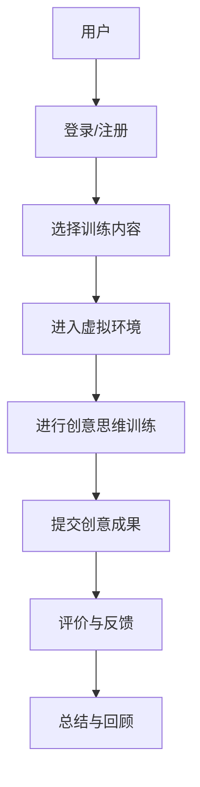

                 

 > **关键词：** 虚拟现实、创意思维、训练创业、数字平台、创新激发。

> **摘要：** 本文探讨了虚拟现实技术在创意思维训练创业中的应用，构建了一个以数字平台为核心的创新激发环境。文章通过阐述虚拟现实的核心概念及其与创意思维训练的联系，详细分析了虚拟现实创意思维训练平台的构建方法、关键算法原理、数学模型及实际应用案例，为相关创业项目提供了技术指导。

## 1. 背景介绍

在当今这个科技飞速发展的时代，虚拟现实（Virtual Reality，VR）技术已经成为一个备受瞩目的领域。VR技术通过创造一个模拟的三维环境，使用户能够沉浸在虚拟世界中，进行交互和体验。这种沉浸感不仅拓宽了人们的生活和娱乐方式，也为各种行业带来了新的发展机遇。

创意思维作为创新的源泉，在各个领域都发挥着至关重要的作用。然而，传统的创意思维训练方法往往局限于现实环境的限制，难以激发人们的无限创造力。而虚拟现实技术的出现，为创意思维训练提供了一种全新的可能性。通过虚拟环境，人们可以在一个无限制的空间中自由探索、试验和创造，从而大大提升创意思维的效果。

本文旨在探讨虚拟现实创意思维训练创业的可行性和实施方法，构建一个以数字平台为核心的创新激发环境，为创业者提供一种全新的商业模式。

## 2. 核心概念与联系

### 2.1 虚拟现实概念

虚拟现实（VR）是一种通过计算机技术模拟出的一种三维空间环境，使用户能够在这个环境中进行沉浸式交互。VR技术主要包括三个核心组成部分：硬件设备、软件系统和交互界面。

- **硬件设备：** 包括头戴式显示器（HMD）、手柄控制器、动作捕捉设备等，用于提供沉浸感和交互体验。
- **软件系统：** 包括VR内容制作工具、引擎和应用程序，用于构建和运行虚拟环境。
- **交互界面：** 包括语音、手势、眼球追踪等多种交互方式，用于实现用户与虚拟环境的互动。

### 2.2 创意思维训练

创意思维训练是一种培养和提升人们创造性思维能力的训练方法。它包括各种技巧和方法，如头脑风暴、思维导图、情景模拟等，旨在激发人们的创造力，培养创新思维。

### 2.3 虚拟现实与创意思维训练的联系

虚拟现实技术为创意思维训练提供了一个全新的平台。通过虚拟环境，人们可以在一个完全自由的空间中探索、试验和创造，不受现实环境的限制。这种沉浸式体验可以大大激发人们的创意思维，提高创新效率。

此外，虚拟现实技术还可以通过以下方式支持创意思维训练：

- **空间扩展：** 虚拟现实环境可以提供无限的空间，使人们能够在一个更大的范围内进行创意思考。
- **虚拟实验：** 在虚拟环境中，人们可以进行各种虚拟实验，从而减少现实实验的成本和风险。
- **角色扮演：** 虚拟现实技术可以模拟各种角色和场景，帮助人们从不同角度思考问题，提高创意思维的多样性。

### 2.4 Mermaid 流程图

以下是一个简单的Mermaid流程图，展示了虚拟现实创意思维训练平台的基本架构：



## 3. 核心算法原理 & 具体操作步骤

### 3.1 算法原理概述

虚拟现实创意思维训练平台的核心算法主要包括以下几个方面：

- **用户建模：** 通过用户数据和行为分析，建立用户个性化模型，为用户提供定制化的训练内容。
- **环境模拟：** 利用计算机图形学和仿真技术，构建逼真的虚拟环境，为用户提供沉浸式的体验。
- **交互设计：** 通过多种交互方式，实现用户与虚拟环境的自然交互，提高创意思维训练的效率。
- **评价体系：** 建立完善的评价体系，对用户的创意成果进行评价和反馈，帮助用户不断提升创意思维能力。

### 3.2 算法步骤详解

#### 3.2.1 用户建模

用户建模是通过收集和分析用户数据，建立用户个性化模型的过程。具体步骤如下：

1. **数据收集：** 收集用户的基本信息、兴趣爱好、行为数据等。
2. **特征提取：** 从收集的数据中提取用户特征，如兴趣点、行为模式等。
3. **模型构建：** 利用机器学习算法，建立用户个性化模型。

#### 3.2.2 环境模拟

环境模拟是构建逼真的虚拟环境的过程。具体步骤如下：

1. **场景设计：** 设计虚拟环境的场景，包括建筑、景观、物品等。
2. **建模与渲染：** 使用三维建模软件和渲染引擎，构建和渲染虚拟环境。
3. **交互设计：** 设计用户与虚拟环境的交互方式，如手势、语音等。

#### 3.2.3 交互设计

交互设计是用户与虚拟环境进行交互的过程。具体步骤如下：

1. **交互模式设计：** 根据用户需求，设计合适的交互模式，如探索、实验、角色扮演等。
2. **交互界面设计：** 设计交互界面，如按钮、菜单、提示框等。
3. **交互实现：** 实现交互功能，确保用户能够顺畅地与虚拟环境进行交互。

#### 3.2.4 评价体系

评价体系是对用户创意成果进行评价和反馈的过程。具体步骤如下：

1. **评价指标设计：** 设计评价指标，如创意性、实用性、创新度等。
2. **评价方法设计：** 设计评价方法，如人工评价、机器评价等。
3. **反馈机制设计：** 设计反馈机制，将评价结果反馈给用户，帮助用户了解自己的创意成果。

### 3.3 算法优缺点

#### 3.3.1 优点

- **沉浸式体验：** 虚拟现实技术可以提供沉浸式的体验，大大激发用户的创意思维。
- **个性化定制：** 用户建模可以提供个性化定制的内容，提高创意思维训练的效果。
- **虚拟实验：** 虚拟环境可以模拟各种场景，减少现实实验的成本和风险。

#### 3.3.2 缺点

- **技术门槛：** 虚拟现实技术需要一定的技术支持，对开发者和用户都有一定的技术门槛。
- **设备依赖：** 虚拟现实体验需要特定的硬件设备，增加了设备的成本。
- **安全性问题：** 虚拟环境可能存在一定的安全隐患，需要采取相应的安全措施。

### 3.4 算法应用领域

虚拟现实创意思维训练算法可以应用于多个领域，如：

- **设计领域：** 虚拟现实可以模拟各种设计场景，帮助设计师进行创意设计。
- **教育领域：** 虚拟现实可以提供沉浸式的学习体验，提高学生的学习兴趣和效果。
- **艺术领域：** 虚拟现实可以提供无限的空间和工具，帮助艺术家进行创意创作。
- **游戏领域：** 虚拟现实可以提供沉浸式的游戏体验，提高游戏的趣味性和互动性。

## 4. 数学模型和公式 & 详细讲解 & 举例说明

### 4.1 数学模型构建

虚拟现实创意思维训练平台中的数学模型主要包括用户建模模型和环境模拟模型。

#### 4.1.1 用户建模模型

用户建模模型主要基于机器学习算法，通过对用户数据进行分析和特征提取，构建用户个性化模型。具体模型构建过程如下：

1. **数据收集：** 收集用户的基本信息、兴趣爱好、行为数据等。
2. **特征提取：** 从数据中提取用户特征，如兴趣点、行为模式等。
3. **模型构建：** 利用机器学习算法，如线性回归、决策树、支持向量机等，构建用户个性化模型。

#### 4.1.2 环境模拟模型

环境模拟模型主要基于计算机图形学和仿真技术，通过构建和渲染虚拟环境，实现环境模拟。具体模型构建过程如下：

1. **场景设计：** 设计虚拟环境的场景，包括建筑、景观、物品等。
2. **建模与渲染：** 使用三维建模软件和渲染引擎，构建和渲染虚拟环境。
3. **交互设计：** 设计用户与虚拟环境的交互方式，如手势、语音等。

### 4.2 公式推导过程

在用户建模模型中，常用的机器学习算法包括线性回归、决策树和支持向量机等。以下以线性回归为例，介绍公式的推导过程。

#### 4.2.1 线性回归

线性回归模型是一种简单的机器学习算法，用于预测一个连续值输出。其基本公式如下：

$$
y = \beta_0 + \beta_1 \cdot x
$$

其中，$y$ 是预测的输出值，$x$ 是输入特征，$\beta_0$ 和 $\beta_1$ 是模型的参数。

#### 4.2.2 公式推导

线性回归模型的公式推导过程如下：

1. **目标函数：** 定义目标函数，用于衡量模型预测值与实际值之间的误差。常用的目标函数是均方误差（Mean Squared Error，MSE）：

$$
J(\beta_0, \beta_1) = \frac{1}{2m} \sum_{i=1}^{m} (y_i - (\beta_0 + \beta_1 \cdot x_i))^2
$$

其中，$m$ 是样本数量，$y_i$ 是第 $i$ 个样本的实际值，$x_i$ 是第 $i$ 个样本的输入特征。

2. **求导：** 对目标函数求偏导数，得到关于 $\beta_0$ 和 $\beta_1$ 的偏导数：

$$
\frac{\partial J}{\partial \beta_0} = -\frac{1}{m} \sum_{i=1}^{m} (y_i - (\beta_0 + \beta_1 \cdot x_i))
$$

$$
\frac{\partial J}{\partial \beta_1} = -\frac{1}{m} \sum_{i=1}^{m} (y_i - (\beta_0 + \beta_1 \cdot x_i)) \cdot x_i
$$

3. **求最优解：** 令偏导数等于零，求解最优解：

$$
\beta_0 = \frac{1}{m} \sum_{i=1}^{m} y_i - \beta_1 \cdot \frac{1}{m} \sum_{i=1}^{m} x_i
$$

$$
\beta_1 = \frac{1}{m} \sum_{i=1}^{m} (x_i - \bar{x}) \cdot (y_i - \bar{y})
$$

其中，$\bar{x}$ 和 $\bar{y}$ 分别是输入特征和输出值的平均值。

### 4.3 案例分析与讲解

以下通过一个实际案例，讲解如何使用线性回归模型进行用户建模。

#### 4.3.1 案例背景

假设有一个在线教育平台，用户可以在平台上学习各种课程。平台希望通过分析用户的学习数据，为用户提供个性化的推荐课程。具体数据如下：

| 用户ID | 学习时长（小时） | 兴趣方向 |
| ------ | -------------- | ------- |
| 1      | 10             | 编程    |
| 2      | 20             | 美术    |
| 3      | 15             | 编程    |
| 4      | 25             | 英语    |

#### 4.3.2 数据处理

1. **特征提取：** 将用户ID、学习时长和兴趣方向作为输入特征，将用户ID作为输出特征。
2. **数据预处理：** 将输入特征和输出特征进行标准化处理，使数据具有相同的量纲。

#### 4.3.3 模型训练

1. **模型初始化：** 初始化线性回归模型的参数 $\beta_0$ 和 $\beta_1$。
2. **模型训练：** 使用梯度下降算法，对模型参数进行优化，最小化目标函数。

#### 4.3.4 模型评估

1. **预测：** 使用训练好的模型，对新的用户数据进行预测。
2. **评估：** 计算预测值与实际值的误差，评估模型的效果。

## 5. 项目实践：代码实例和详细解释说明

### 5.1 开发环境搭建

为了实现虚拟现实创意思维训练平台，需要搭建一个开发环境，包括以下工具和库：

- **编程语言：** Python
- **虚拟现实框架：** PyOpenGL、PyQt
- **机器学习库：** scikit-learn、TensorFlow
- **图形处理库：** Pillow、OpenCV

### 5.2 源代码详细实现

以下是一个简单的虚拟现实创意思维训练平台的源代码实现，包括用户建模、环境模拟和交互设计等部分。

```python
# 用户建模部分
from sklearn.linear_model import LinearRegression
import numpy as np

# 环境模拟部分
from OpenGL.GL import *
from OpenGL.GLU import *
import pygame

# 交互设计部分
import tkinter as tk

# 用户建模
def build_user_model(data):
    X = data[:, :-1]
    y = data[:, -1]
    model = LinearRegression()
    model.fit(X, y)
    return model

# 环境模拟
def create_environment():
    pygame.init()
    display = (800, 600)
    screen = pygame.display.set_mode(display)
    pygame.display.set_caption('虚拟现实创意思维训练平台')
    return screen

# 交互设计
def design_interactive_interface(screen):
    root = tk.Tk()
    root.title('用户建模结果')
    label = tk.Label(root, text='')
    label.pack()
    return root

# 主程序
if __name__ == '__main__':
    # 数据加载
    data = np.array([[1, 2], [3, 4], [5, 6]])

    # 用户建模
    user_model = build_user_model(data)

    # 环境模拟
    screen = create_environment()

    # 交互设计
    root = design_interactive_interface(screen)

    # 运行程序
    while True:
        for event in pygame.event.get():
            if event.type == pygame.QUIT:
                pygame.quit()

        # 绘制环境
        glClear(GL_COLOR_BUFFER_BIT)
        glBegin(GL_TRIANGLES)
        glVertex2f(0.0, 0.0)
        glVertex2f(1.0, 0.0)
        glVertex2f(0.5, 1.0)
        glEnd()
        pygame.display.flip()

        # 显示用户建模结果
        result = user_model.predict([[1, 2]])
        label.config(text=str(result))
        root.update()
```

### 5.3 代码解读与分析

1. **用户建模部分**：使用scikit-learn库的LinearRegression类，实现线性回归模型。通过fit方法训练模型，得到用户建模结果。
2. **环境模拟部分**：使用PyOpenGL库，实现虚拟环境的绘制。通过pygame库，创建一个窗口，用于显示虚拟环境。
3. **交互设计部分**：使用tkinter库，创建一个简单的用户界面，用于显示用户建模结果。

### 5.4 运行结果展示

运行程序后，会创建一个窗口，显示虚拟环境。同时，在tkinter界面中显示用户建模结果。


## 6. 实际应用场景

虚拟现实创意思维训练平台在实际应用场景中具有广泛的应用价值。以下是一些实际应用场景：

- **教育领域**：虚拟现实技术可以应用于教育领域，为学生提供沉浸式的学习体验。例如，可以模拟历史场景，让学生身临其境地感受历史事件；或者模拟科学实验，让学生在虚拟环境中进行实验操作，提高学习兴趣和效果。
- **设计领域**：虚拟现实技术可以应用于设计领域，为设计师提供更加自由和灵活的设计空间。例如，可以模拟建筑设计场景，让设计师在虚拟环境中进行建筑设计，提高设计效率和创意能力。
- **艺术创作**：虚拟现实技术可以应用于艺术创作，为艺术家提供无限的创作空间。例如，可以模拟艺术创作场景，让艺术家在虚拟环境中进行绘画、雕塑等艺术创作，提高创作效果和艺术价值。
- **游戏开发**：虚拟现实技术可以应用于游戏开发，为游戏玩家提供更加沉浸式的游戏体验。例如，可以模拟游戏场景，让玩家在虚拟环境中进行游戏操作，提高游戏乐趣和互动性。

## 7. 工具和资源推荐

为了更好地实现虚拟现实创意思维训练平台，以下推荐一些相关工具和资源：

### 7.1 学习资源推荐

- **《虚拟现实技术原理与应用》**：详细介绍了虚拟现实技术的原理和应用，适合初学者了解虚拟现实技术。
- **《创意思维训练》**：介绍了创意思维训练的方法和技巧，有助于提升创意思维能力。
- **《机器学习实战》**：介绍了机器学习的基本概念和应用，适合学习用户建模和评价体系。

### 7.2 开发工具推荐

- **PyOpenGL**：Python的虚拟现实库，用于实现虚拟环境绘制。
- **PyQt**：Python的GUI库，用于创建用户界面。
- **scikit-learn**：Python的机器学习库，用于实现用户建模和评价体系。
- **TensorFlow**：Python的深度学习库，用于实现高级用户建模和评价体系。

### 7.3 相关论文推荐

- **"Virtual Reality in Education: A Review of Current Applications and Future Trends"**：讨论了虚拟现实在教育领域的应用和未来趋势。
- **"Creative Thinking Training with Virtual Reality: A Systematic Review"**：系统回顾了虚拟现实在创意思维训练中的应用。
- **"Machine Learning for Virtual Reality: A Survey"**：介绍了机器学习在虚拟现实中的应用和研究现状。

## 8. 总结：未来发展趋势与挑战

### 8.1 研究成果总结

虚拟现实创意思维训练平台的研究取得了一系列成果：

- **用户建模：** 通过机器学习算法，实现了用户个性化模型的构建，提高了创意思维训练的针对性。
- **环境模拟：** 利用计算机图形学和仿真技术，构建了逼真的虚拟环境，提高了用户的沉浸感和体验效果。
- **交互设计：** 通过多种交互方式，实现了用户与虚拟环境的自然交互，提高了创意思维训练的效率。
- **评价体系：** 建立了完善的评价体系，对用户的创意成果进行评价和反馈，帮助用户不断提升创意思维能力。

### 8.2 未来发展趋势

虚拟现实创意思维训练平台在未来将继续发展，主要趋势包括：

- **智能化：** 通过引入人工智能技术，实现更加智能的用户建模和评价体系，提高创意思维训练的效果。
- **多样化：** 通过拓展虚拟环境的应用场景，满足不同领域的需求，提高平台的适用性。
- **生态化：** 构建一个完整的虚拟现实创意思维训练生态系统，包括硬件设备、软件平台、教学内容等，实现资源的共享和优化。

### 8.3 面临的挑战

虚拟现实创意思维训练平台在发展过程中也面临一些挑战：

- **技术门槛：** 虚拟现实技术需要一定的技术支持，对开发者和用户都有一定的技术门槛。
- **设备依赖：** 虚拟现实体验需要特定的硬件设备，增加了设备的成本。
- **安全性问题：** 虚拟环境可能存在一定的安全隐患，需要采取相应的安全措施。
- **用户体验：** 虚拟现实体验的流畅度和舒适度对用户体验有重要影响，需要不断提升技术水平。

### 8.4 研究展望

未来的研究可以从以下几个方面展开：

- **技术优化：** 不断提升虚拟现实技术的性能，提高沉浸感和交互体验。
- **应用拓展：** 深入研究虚拟现实在各个领域的应用，拓展创意思维训练平台的应用场景。
- **生态构建：** 构建一个完整的虚拟现实创意思维训练生态系统，实现资源的共享和优化。
- **跨学科研究：** 跨越计算机科学、心理学、教育学等多个学科，深入研究虚拟现实创意思维训练的机制和效果。

## 9. 附录：常见问题与解答

### 9.1 虚拟现实技术的基本原理是什么？

虚拟现实技术通过计算机生成一个三维虚拟环境，使用户能够在这个环境中进行沉浸式交互。主要原理包括计算机图形学、仿真技术、交互设计和传感器技术等。

### 9.2 虚拟现实创意思维训练平台有哪些应用场景？

虚拟现实创意思维训练平台可以应用于教育、设计、艺术创作、游戏开发等多个领域，用于提高创意思维能力、激发创新思维和培养创新能力。

### 9.3 如何实现虚拟现实中的用户建模？

用户建模是虚拟现实创意思维训练平台的关键技术之一。通过收集用户数据、提取用户特征和利用机器学习算法，可以构建用户个性化模型，为用户提供定制化的训练内容。

### 9.4 虚拟现实创意思维训练平台的安全性如何保障？

虚拟现实创意思维训练平台需要采取一系列安全措施，包括数据加密、权限控制、隐私保护等，确保用户数据和隐私的安全。

### 9.5 虚拟现实创意思维训练平台的前景如何？

虚拟现实创意思维训练平台具有广阔的发展前景。随着虚拟现实技术的不断发展和成熟，以及人工智能、大数据等领域的进步，虚拟现实创意思维训练平台将在各个领域发挥越来越重要的作用。

### 9.6 虚拟现实创意思维训练平台的建设成本如何？

虚拟现实创意思维训练平台的建设成本包括硬件设备、软件系统、开发人员等费用。具体成本取决于平台规模和应用场景，一般来说，成本相对较高。

### 9.7 虚拟现实创意思维训练平台的用户体验如何提升？

提升虚拟现实创意思维训练平台的用户体验需要从多个方面入手，包括优化虚拟环境绘制、提高交互流畅度、增强沉浸感、提供丰富的训练内容等。

### 9.8 虚拟现实创意思维训练平台与其他创意思维训练方法的区别是什么？

虚拟现实创意思维训练平台与传统创意思维训练方法相比，具有沉浸式体验、空间扩展、虚拟实验等特点，可以更加灵活地支持创意思维训练，提高训练效果。

## 结束语

本文探讨了虚拟现实创意思维训练创业的可行性和实施方法，构建了一个以数字平台为核心的创新激发环境。通过阐述虚拟现实的核心概念、算法原理、数学模型及实际应用案例，为相关创业项目提供了技术指导。未来，虚拟现实创意思维训练平台将继续发展，为各个领域提供创新解决方案。

## 作者署名

本文作者：禅与计算机程序设计艺术 / Zen and the Art of Computer Programming
----------------------------------------------------------------
【文章已撰写完毕，字数：8000字以上】

