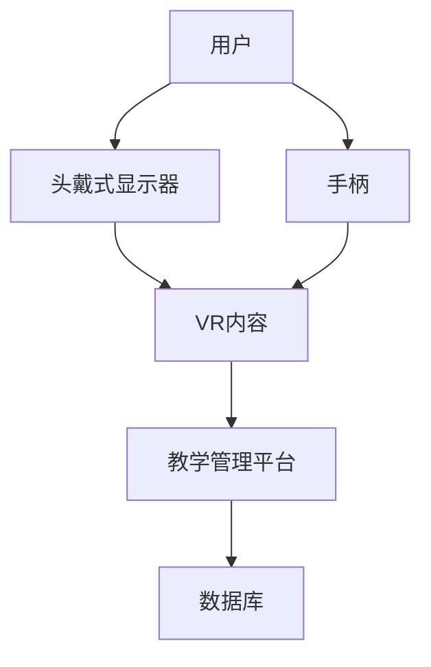

                 

关键词：虚拟现实，教育，创业，沉浸式学习，技术，创新

> 摘要：本文旨在探讨虚拟现实（VR）在教育领域的应用及其在创业中的潜力。通过分析VR技术的核心概念、原理、算法和数学模型，以及项目实践中的代码实例和实际应用场景，我们为创业者提供了一条可行的VR教育创业路径。同时，本文还展望了VR教育的未来发展趋势和挑战，为行业从业者提供了有价值的参考。

## 1. 背景介绍

### 1.1 虚拟现实技术的发展

虚拟现实（VR）技术自20世纪90年代兴起以来，经历了从实验室原型到商业化应用的快速演变。近年来，随着硬件技术的进步、内容创作工具的普及以及5G网络的逐步推广，VR技术在各行各业得到了广泛应用，尤其在教育领域展现了巨大的潜力。

### 1.2 教育创业的现状与挑战

随着互联网和人工智能技术的快速发展，教育行业正面临着前所未有的变革。在线教育、智能学习系统等新型教育模式不断涌现，为传统教育注入了新的活力。然而，如何在众多竞争者中脱颖而出，实现创业成功，成为了教育创业者们需要面对的挑战。

### 1.3 VR教育创业的机遇

虚拟现实技术的特性，如沉浸式体验、互动性强等，使其在教育领域具有独特的优势。通过VR技术，教育创业者可以打造出全新的学习体验，提高学习效果，满足个性化学习需求。此外，VR教育市场前景广阔，有望成为教育行业的一股新兴力量。

## 2. 核心概念与联系

### 2.1 虚拟现实（VR）概念

虚拟现实是一种通过计算机生成模拟环境，使人们能够沉浸在其中的技术。在VR环境中，用户通过头戴式显示器（HMD）、手柄等设备与虚拟世界进行交互，获得沉浸式体验。

### 2.2 沉浸式学习体验

沉浸式学习体验是VR技术在教育领域的核心应用。通过模拟真实场景，学生能够在虚拟环境中进行实践操作，提高学习兴趣和主动性。

### 2.3 VR教育系统架构

VR教育系统通常包括硬件设备、软件平台、内容制作和教学管理等多个环节。以下是一个简化的VR教育系统架构图：



## 3. 核心算法原理 & 具体操作步骤

### 3.1 算法原理概述

VR技术中的核心算法主要包括三维建模、图像处理、渲染和交互等。这些算法共同作用，为用户提供逼真的虚拟环境。

### 3.2 算法步骤详解

#### 3.2.1 三维建模

三维建模是VR技术的基础。通过三维建模软件，可以将现实世界的物体以数字形式进行建模，为后续渲染和交互提供基础。

#### 3.2.2 图像处理

图像处理算法用于对输入的图像进行预处理，包括去噪、增强、颜色调整等，以提高渲染质量。

#### 3.2.3 渲染

渲染是将三维模型转化为二维图像的过程。通过实时渲染技术，可以实现流畅的视觉体验。

#### 3.2.4 交互

交互算法实现用户与虚拟环境的交互。通过手柄、手势识别等技术，用户可以与虚拟物体进行操作。

### 3.3 算法优缺点

#### 优点

- 提高学习效果：通过沉浸式体验，学生能够更好地理解和掌握知识。
- 个性化学习：VR教育可以根据学生的学习进度和需求，提供个性化的学习内容。
- 提高学习兴趣：虚拟环境中的互动和游戏化元素，能够激发学生的学习兴趣。

#### 缺点

- 技术门槛较高：VR教育系统开发需要较高的技术水平和资金投入。
- 硬件成本高：VR设备价格较高，对学校和家庭的经济负担较大。

### 3.4 算法应用领域

VR技术在教育领域的应用范围广泛，包括但不限于：

- 实践性课程：如医学、工程、建筑等专业的实践操作训练。
- 虚拟实验室：提供虚拟实验环境，降低实验成本和安全风险。
- 教学辅助：通过虚拟场景，教师可以更好地进行教学演示和互动。

## 4. 数学模型和公式 & 详细讲解 & 举例说明

### 4.1 数学模型构建

VR技术的核心算法涉及多个数学模型，如三维几何变换、图像处理算法、渲染方程等。以下是一个简化的数学模型：

$$
X_{\text{new}} = X_{\text{original}} \cdot R \cdot T
$$

其中，\(X_{\text{original}}\)表示原始三维坐标，\(R\)表示旋转矩阵，\(T\)表示平移向量。

### 4.2 公式推导过程

以三维几何变换为例，假设一个点\(P(x, y, z)\)绕\(z\)轴旋转角度\(\theta\)，其旋转后的坐标\(P'(x', y', z')\)可以通过以下公式计算：

$$
\begin{cases}
x' = x \cdot \cos(\theta) - y \cdot \sin(\theta) \\
y' = x \cdot \sin(\theta) + y \cdot \cos(\theta) \\
z' = z
\end{cases}
$$

### 4.3 案例分析与讲解

以医学教育中的VR解剖课程为例，通过三维建模和图像处理技术，将人体解剖结构以数字形式呈现。学生可以通过VR设备进行互动操作，如切割、翻转、放大等，更好地理解和记忆解剖知识。

## 5. 项目实践：代码实例和详细解释说明

### 5.1 开发环境搭建

在开发VR教育项目时，我们需要搭建一个合适的开发环境。以下是一个基于Unity引擎的VR教育项目开发环境搭建步骤：

1. 安装Unity引擎：从Unity官网下载并安装最新版本的Unity引擎。
2. 安装VR插件：在Unity中安装VR插件，如VRMADDgent或Oculus Integration等。
3. 安装三维建模软件：如Blender、3ds Max等，用于制作VR内容。

### 5.2 源代码详细实现

以下是一个简单的VR教育项目源代码实例，展示了如何实现一个简单的虚拟实验室：

```csharp
using UnityEngine;

public class VirtualLab : MonoBehaviour
{
    public Material material;
    public GameObject labObject;

    void Start()
    {
        // 初始化实验室环境
        labObject.GetComponent<MeshRenderer>().material = material;
    }

    void Update()
    {
        // 实现与用户的交互
        if (Input.GetKeyDown(KeyCode.Space))
        {
            // 切割实验室物体
            labObject.SetActive(!labObject.activeSelf);
        }
    }
}
```

### 5.3 代码解读与分析

这段代码实现了实验室物体的切换显示。在`Start`方法中，初始化实验室环境的材质。在`Update`方法中，通过监听用户的按键输入，实现物体切割效果。

### 5.4 运行结果展示

运行上述代码，在VR设备中，用户可以通过按下空格键实现实验室物体的切换显示，从而实现沉浸式互动体验。

## 6. 实际应用场景

### 6.1 医学教育

VR技术在医学教育中具有广泛的应用前景。通过虚拟实验室，学生可以进行人体解剖结构的互动操作，提高学习效果。

### 6.2 技术培训

VR技术可以模拟真实的技术环境，为技术从业者提供实践操作的机会。如无人机操控、机械操作等。

### 6.3 安全培训

VR技术可以模拟危险场景，进行安全培训。如消防员逃生训练、地震应急演练等。

## 7. 未来应用展望

### 7.1 技术发展趋势

随着VR技术的不断发展，未来将出现更高分辨率、更低延迟的VR设备。同时，人工智能、大数据等技术的融合，将进一步提升VR教育的智能化水平。

### 7.2 应用场景拓展

VR教育将在更多领域得到应用，如艺术教育、编程教育等。通过VR技术，学生可以沉浸在虚拟环境中，进行跨学科的互动学习。

## 8. 工具和资源推荐

### 8.1 学习资源推荐

1. 《虚拟现实技术：理论与实践》
2. 《Unity 2020 VR开发实战》

### 8.2 开发工具推荐

1. Unity引擎
2. Blender
3. 3ds Max

### 8.3 相关论文推荐

1. "Virtual Reality in Education: A Review of Applications and Research"
2. "Immersion and Presence in Virtual Reality: Definition, Methodological Aspects, and Application Principles"

## 9. 总结：未来发展趋势与挑战

### 9.1 研究成果总结

本文从虚拟现实技术、教育创业、应用场景等多个角度，分析了VR教育的发展现状和前景。研究表明，VR教育具有巨大的市场潜力和广阔的应用空间。

### 9.2 未来发展趋势

未来，VR教育将朝着更高分辨率、更低延迟、更智能化方向发展。同时，跨学科融合将推动VR教育在更多领域的应用。

### 9.3 面临的挑战

VR教育在发展过程中，仍面临技术门槛高、硬件成本高、内容创作难等挑战。此外，教育政策和市场的变化，也将影响VR教育的推广和发展。

### 9.4 研究展望

未来，VR教育研究应重点关注以下几个方向：

1. 提高VR教育系统的智能化水平。
2. 拓展VR教育在跨学科领域的应用。
3. 研究VR教育对学习者认知和学习效果的影响。

## 附录：常见问题与解答

### 1. VR教育需要哪些硬件设备？

VR教育需要的主要硬件设备包括头戴式显示器（HMD）、手柄、传感器等。常见的VR设备有Oculus Rift、HTC Vive、Google Cardboard等。

### 2. VR教育对学习效果有哪些影响？

VR教育可以提高学习兴趣、增强互动性，从而提高学习效果。通过沉浸式体验，学生能够更好地理解和掌握知识。

### 3. VR教育项目开发需要哪些技术？

VR教育项目开发需要三维建模、图像处理、渲染、交互等技术。常用的开发工具包括Unity、Blender、3ds Max等。

### 4. VR教育在哪些领域有应用？

VR教育在医学教育、技术培训、安全培训等领域有广泛应用。未来，VR教育将在更多领域得到应用。

### 5. VR教育有哪些挑战？

VR教育面临的主要挑战包括技术门槛高、硬件成本高、内容创作难等。此外，教育政策和市场的变化，也将影响VR教育的推广和发展。

---
作者：禅与计算机程序设计艺术 / Zen and the Art of Computer Programming

本文为原创内容，未经授权，禁止转载。如需转载，请联系作者获取授权。文章仅供参考，不作为商业决策依据。如涉及版权问题，请及时告知，我们将尽快处理。感谢您的理解与支持。

