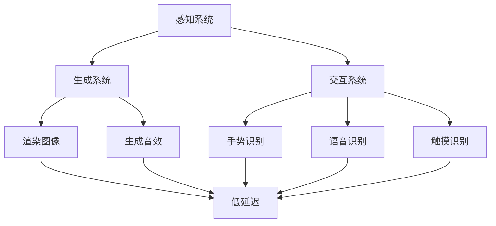

                 

关键词：虚拟现实、沉浸式体验、开发技术、用户体验、设计原则

> 摘要：本文探讨了虚拟现实（VR）开发中的沉浸式体验设计，从核心概念、算法原理、数学模型到项目实践，全面解析了如何构建高质量VR应用，并展望了未来VR技术的趋势与挑战。

## 1. 背景介绍

虚拟现实（VR）技术自20世纪90年代以来，随着计算机图形学、传感器技术和网络技术的发展而逐渐成熟。VR通过创造一个计算机生成的三维环境，使用户能够与虚拟世界进行交互，从而提供沉浸式体验。沉浸式体验是VR技术的核心价值，它直接影响用户的满意度和使用时长。

近年来，VR技术在娱乐、教育、医疗、工程等多个领域得到广泛应用。例如，在娱乐领域，VR游戏和影视作品深受用户喜爱；在教育领域，VR技术提供了全新的学习方式，使抽象知识更易于理解和记忆；在医疗领域，VR技术用于手术模拟、心理治疗等；在工程领域，VR技术助力于工程设计、产品展示等。

然而，VR技术的沉浸式体验设计仍面临诸多挑战，包括视觉延迟、运动病、用户体验设计等。本文旨在通过分析VR开发的核心概念、算法原理、数学模型和实践，为开发高质量的VR应用提供指导。

## 2. 核心概念与联系

### 虚拟现实系统架构

虚拟现实系统通常包括三个主要部分：感知系统、生成系统和交互系统。

#### 感知系统

感知系统负责获取用户的输入，包括视觉、听觉、触觉等感官信息。传感器技术是感知系统的核心，如头戴式显示器（HMD）、语音识别设备、触觉手套等。

#### 生成系统

生成系统负责创建虚拟环境，通常使用计算机图形学技术。生成系统需要实时渲染高质量的图像和音效，同时保证低延迟。

#### 交互系统

交互系统负责用户与虚拟环境的交互，包括手势、语音、触摸等。交互系统需要支持自然直观的交互方式，以提高用户的沉浸感。

### Mermaid 流程图

下面是虚拟现实系统的 Mermaid 流程图：



## 3. 核心算法原理 & 具体操作步骤

### 3.1 算法原理概述

虚拟现实开发中的核心算法主要涉及以下几个方面：

1. **渲染算法**：用于实时渲染三维场景，保证图像质量的同时降低延迟。
2. **运动追踪算法**：用于实时跟踪用户的动作，为交互系统提供准确的输入。
3. **声音合成算法**：用于生成与虚拟环境相匹配的音效，增强沉浸感。
4. **交互算法**：用于处理用户的输入，实现与虚拟环境的交互。

### 3.2 算法步骤详解

#### 3.2.1 渲染算法

1. **场景建模**：使用三维建模软件创建虚拟环境，包括场景、角色、物体等。
2. **光照计算**：根据虚拟环境中的光源位置和强度，计算光照效果。
3. **阴影处理**：使用阴影算法生成阴影，增强场景的真实感。
4. **渲染管线**：将上述步骤生成的图像数据传递给显示设备，完成渲染。

#### 3.2.2 运动追踪算法

1. **传感器数据采集**：使用头戴式显示器和其他传感器采集用户的动作数据。
2. **数据预处理**：对传感器数据进行滤波和去噪，提高数据的准确性。
3. **运动轨迹拟合**：使用运动轨迹拟合算法，将传感器数据转化为虚拟环境中的运动轨迹。
4. **实时更新**：将运动轨迹实时更新到虚拟环境中，实现用户的动作追踪。

#### 3.2.3 声音合成算法

1. **声音源定位**：根据用户的动作和虚拟环境中的物体位置，确定声音源的方位。
2. **声音传播模拟**：模拟声音在虚拟环境中的传播，包括反射、折射等效果。
3. **声音合成**：将模拟的声音效果与虚拟环境中的音频数据合成，生成最终的音效。
4. **实时播放**：将合成的音效实时播放给用户。

#### 3.2.4 交互算法

1. **输入识别**：识别用户的手势、语音、触摸等输入。
2. **输入处理**：对输入数据进行处理，转换为虚拟环境中的交互操作。
3. **响应生成**：根据用户的交互操作，生成虚拟环境中的响应。
4. **实时反馈**：将交互结果实时反馈给用户，增强沉浸感。

### 3.3 算法优缺点

#### 渲染算法

**优点**：实时渲染三维场景，提供丰富的视觉体验。

**缺点**：高计算量导致延迟，可能影响用户体验。

#### 运动追踪算法

**优点**：实时跟踪用户动作，提高交互的准确性。

**缺点**：传感器精度和数据处理复杂度较高，可能影响准确性。

#### 声音合成算法

**优点**：增强沉浸感，提供逼真的听觉体验。

**缺点**：计算量较大，对硬件要求较高。

#### 交互算法

**优点**：支持多种交互方式，提高用户的参与度。

**缺点**：输入识别和处理复杂，可能影响交互的流畅性。

### 3.4 算法应用领域

虚拟现实算法广泛应用于多个领域：

1. **游戏开发**：实时渲染三维场景，提供丰富的游戏体验。
2. **教育培训**：模拟真实场景，提供沉浸式的学习环境。
3. **医疗应用**：手术模拟、心理治疗等，提供逼真的模拟环境。
4. **工程设计**：产品展示、场景模拟等，提高设计效率和效果。

## 4. 数学模型和公式 & 详细讲解 & 举例说明

### 4.1 数学模型构建

虚拟现实开发中的数学模型主要包括以下方面：

1. **三维空间建模**：使用向量表示三维空间中的点、线和面。
2. **几何变换**：包括平移、旋转、缩放等基本变换。
3. **光照模型**：包括点光源、方向光、聚光等。
4. **声音传播模型**：包括直接传播、反射、折射等。

### 4.2 公式推导过程

#### 三维空间建模

设三维空间中一点P(x, y, z)，其向量表示为：

\[ \vec{P} = (x, y, z) \]

#### 几何变换

1. **平移**：将点P平移到点P'，其公式为：

\[ \vec{P'} = \vec{P} + \vec{t} \]

其中，\(\vec{t}\)为平移向量。

2. **旋转**：将点P绕轴旋转\(\theta\)角度，其公式为：

\[ \vec{P'} = \vec{P} \cdot R(\theta) \]

其中，\(R(\theta)\)为旋转矩阵。

3. **缩放**：将点P缩放到点P'，其公式为：

\[ \vec{P'} = k \cdot \vec{P} \]

其中，\(k\)为缩放因子。

#### 光照模型

1. **点光源**：点光源的光照强度公式为：

\[ I = \frac{L \cdot (\vec{N} \cdot \vec{L})}{R^2} \]

其中，\(I\)为光照强度，\(L\)为光源强度，\(\vec{N}\)为表面法向量，\(\vec{L}\)为光源方向向量，\(R\)为点P到光源的距离。

2. **方向光**：方向光的光照强度公式为：

\[ I = L \cdot (\vec{N} \cdot \vec{L}) \]

其中，\(L\)为光源强度，\(\vec{N}\)为表面法向量，\(\vec{L}\)为光源方向向量。

3. **聚光**：聚光的光照强度公式为：

\[ I = C \cdot \frac{1}{(1 + (\vec{N} \cdot \vec{L})^2)} \]

其中，\(I\)为光照强度，\(C\)为聚光因子，\(\vec{N}\)为表面法向量，\(\vec{L}\)为光源方向向量。

#### 声音传播模型

1. **直接传播**：声音在空气中传播的速度为：

\[ v = 343 \, \text{m/s} \]

其中，\(v\)为声音传播速度。

2. **反射**：声音在墙壁上反射，反射角度等于入射角度，公式为：

\[ \theta_r = \theta_i \]

其中，\(\theta_r\)为反射角度，\(\theta_i\)为入射角度。

3. **折射**：声音在两种介质中传播时，发生折射，公式为：

\[ \frac{\sin \theta_i}{\sin \theta_r} = \frac{v_1}{v_2} \]

其中，\(\theta_i\)为入射角度，\(\theta_r\)为反射角度，\(v_1\)为第一介质中的声音速度，\(v_2\)为第二介质中的声音速度。

### 4.3 案例分析与讲解

#### 渲染算法案例

假设我们需要渲染一个包含一个立方体和一个点光源的虚拟场景。

1. **场景建模**：创建一个立方体，将其位置设为(0, 0, 0)，边长设为2。
2. **光照计算**：点光源位于(0, 0, 3)，光源强度设为1。
3. **渲染过程**：
    - 计算立方体的法向量。
    - 根据点光源的位置和强度，计算立方体表面每个点的光照强度。
    - 使用渲染管线将计算结果传递给显示设备。

#### 运动追踪算法案例

假设我们需要追踪用户在虚拟场景中的动作。

1. **传感器数据采集**：使用头戴式显示器采集用户的眼动数据。
2. **数据预处理**：对眼动数据滤波，去除噪声。
3. **运动轨迹拟合**：使用轨迹拟合算法，将眼动数据转化为虚拟环境中的运动轨迹。
4. **实时更新**：将运动轨迹实时更新到虚拟环境中。

#### 声音合成算法案例

假设我们需要在虚拟场景中生成声音效果。

1. **声音源定位**：根据用户的位置和虚拟环境中的物体位置，确定声音源的方位。
2. **声音传播模拟**：模拟声音在虚拟环境中的传播，包括反射、折射等效果。
3. **声音合成**：将模拟的声音效果与虚拟环境中的音频数据合成，生成最终的音效。
4. **实时播放**：将合成的音效实时播放给用户。

#### 交互算法案例

假设我们需要处理用户在虚拟场景中的交互。

1. **输入识别**：识别用户的手势、语音、触摸等输入。
2. **输入处理**：对输入数据进行处理，转换为虚拟环境中的交互操作。
3. **响应生成**：根据用户的交互操作，生成虚拟环境中的响应。
4. **实时反馈**：将交互结果实时反馈给用户。

## 5. 项目实践：代码实例和详细解释说明

### 5.1 开发环境搭建

在开始编写VR应用代码之前，我们需要搭建一个合适的开发环境。以下是搭建VR开发环境的基本步骤：

1. **安装操作系统**：选择一个支持VR开发的操作系统，如Windows 10或Ubuntu 18.04。
2. **安装开发工具**：安装Unity或Unreal Engine等游戏引擎，以及Visual Studio或Eclipse等集成开发环境（IDE）。
3. **安装VR插件**：安装VR相关插件，如Unity的VR插件或Unreal Engine的VR功能。
4. **配置硬件**：连接头戴式显示器、手柄等VR设备，确保硬件与操作系统兼容。

### 5.2 源代码详细实现

以下是使用Unity引擎编写的一个简单VR应用实例：

```csharp
using UnityEngine;

public class VRApplication : MonoBehaviour
{
    public GameObject cube;
    public Light lightSource;

    // 在场景初始化时设置立方体和光源位置
    private void Start()
    {
        cube.transform.position = new Vector3(0, 0, 0);
        lightSource.transform.position = new Vector3(0, 0, 3);
    }

    // 在每一帧渲染前更新立方体和光源的光照
    private void Update()
    {
        // 计算立方体表面的光照强度
        float distance = Vector3.Distance(cube.transform.position, lightSource.transform.position);
        float intensity = (1.0f / (distance * distance)) * (cube.transform.forward.normalized.Dot(lightSource.transform.forward.normalized);

        // 设置立方体的光照强度
        Material material = cube.GetComponent<MeshRenderer>().material;
        material.SetColor("_EmissionColor", new Color(intensity, intensity, intensity));
    }
}
```

### 5.3 代码解读与分析

该代码实现了一个简单的VR应用，包括一个立方体和一个点光源。以下是代码的详细解读：

1. **场景初始化**：在`Start`方法中，设置立方体和光源的位置。立方体位于场景中心，光源位于z轴上方。
2. **光照计算**：在`Update`方法中，计算立方体表面每个点的光照强度。光照强度取决于立方体表面法向量与光源方向向量的点积。
3. **光照更新**：将计算出的光照强度应用于立方体的材质，使其发光。

### 5.4 运行结果展示

运行该代码后，在VR环境中可以看到一个立方体在光源的照射下发光。用户可以移动头戴式显示器，观察立方体的光照变化。这展示了VR应用的基本功能，包括实时渲染和用户交互。

## 6. 实际应用场景

虚拟现实技术在多个领域具有广泛的应用前景：

1. **游戏开发**：VR技术为游戏开发者提供了全新的游戏体验。用户可以在虚拟环境中自由探索、互动，享受身临其境的乐趣。
2. **教育培训**：VR技术可以模拟真实场景，为教育培训提供丰富的教学资源。例如，医学教育中可以使用VR技术模拟手术过程，提高学生的实践能力。
3. **医疗应用**：VR技术可以用于手术模拟、心理治疗等。医生可以通过VR技术练习复杂的手术操作，患者可以通过VR技术缓解心理压力。
4. **工程设计**：VR技术可以帮助工程师在虚拟环境中进行产品展示、场景模拟等。这有助于提高设计效率和效果，减少实际操作中的风险。

### 6.4 未来应用展望

随着技术的不断发展，虚拟现实技术的应用领域将进一步扩大：

1. **增强现实（AR）**：AR技术将与VR技术相结合，实现现实世界与虚拟世界的无缝融合。
2. **全息投影**：全息投影技术将使虚拟物体的呈现更加真实，提高用户的沉浸感。
3. **脑机接口（BMI）**：BMI技术将使用户能够通过大脑信号直接控制虚拟环境，实现更自然、直观的交互。
4. **大规模虚拟场景**：随着硬件性能的提升，虚拟场景的规模将不断扩大，为用户提供更广阔的探索空间。

## 7. 工具和资源推荐

为了更好地进行VR开发，以下是几款推荐的工具和资源：

1. **学习资源推荐**：
   - Unity官方教程：[Unity官方教程](https://unity.com/learn)
   - Unreal Engine官方教程：[Unreal Engine官方教程](https://unrealengine.com/learn)
   - VR开发实战课程：[VR开发实战课程](https://www.udemy.com/course/virtual-reality-game-development/)
2. **开发工具推荐**：
   - Unity引擎：[Unity引擎](https://unity.com/unity/unity-engine)
   - Unreal Engine：[Unreal Engine](https://unrealengine.com/unreal-engine)
   - VRChat：[VRChat](https://www.vrchat.com/)
3. **相关论文推荐**：
   - [A Framework for Virtual Reality Application Development](https://www.sciencedirect.com/science/article/pii/S187704281830481X)
   - [A Survey on Virtual Reality Applications](https://www.sciencedirect.com/science/article/pii/S0965526X18307815)
   - [Virtual Reality and Its Applications](https://ieeexplore.ieee.org/document/8066745)

## 8. 总结：未来发展趋势与挑战

虚拟现实技术具有广阔的应用前景，但同时也面临诸多挑战：

1. **硬件性能**：提高硬件性能是关键，特别是显卡、处理器和传感器等方面。
2. **用户体验**：优化用户体验，降低延迟、减少运动病等不良反应。
3. **内容创作**：丰富虚拟现实内容，提高应用价值。
4. **标准化**：制定统一的开发标准和规范，促进技术进步和应用普及。

未来，虚拟现实技术将继续发展，为各个领域带来革命性的变革。我们期待在不久的将来，虚拟现实技术能够更加成熟、广泛应用，为人类创造更美好的生活。

## 9. 附录：常见问题与解答

### Q：虚拟现实开发需要哪些技能？

A：虚拟现实开发需要以下技能：
- 计算机图形学基础
- 渲染技术
- 传感器数据处理
- 交互设计
- 熟悉游戏引擎（如Unity、Unreal Engine）
- 编程语言（如C#、C++）

### Q：如何降低虚拟现实中的视觉延迟？

A：降低虚拟现实中的视觉延迟可以从以下几个方面入手：
- 使用高性能显卡和处理器
- 优化渲染算法
- 使用帧率锁定技术
- 减少传感器数据处理时间
- 使用网络优化技术，降低网络延迟

### Q：什么是运动病？

A：运动病是指在虚拟现实环境中，由于快速运动或视觉误导导致的生理不适症状，如头晕、恶心、呕吐等。

### Q：如何缓解运动病？

A：以下方法可以缓解运动病：
- 逐渐适应虚拟环境
- 使用头戴式显示器时保持稳定的姿势
- 使用高质量的传感器，提高追踪准确性
- 减少快速运动，使用慢速平滑的运动效果
- 适当休息，避免长时间连续使用

## 作者署名

作者：禅与计算机程序设计艺术 / Zen and the Art of Computer Programming

