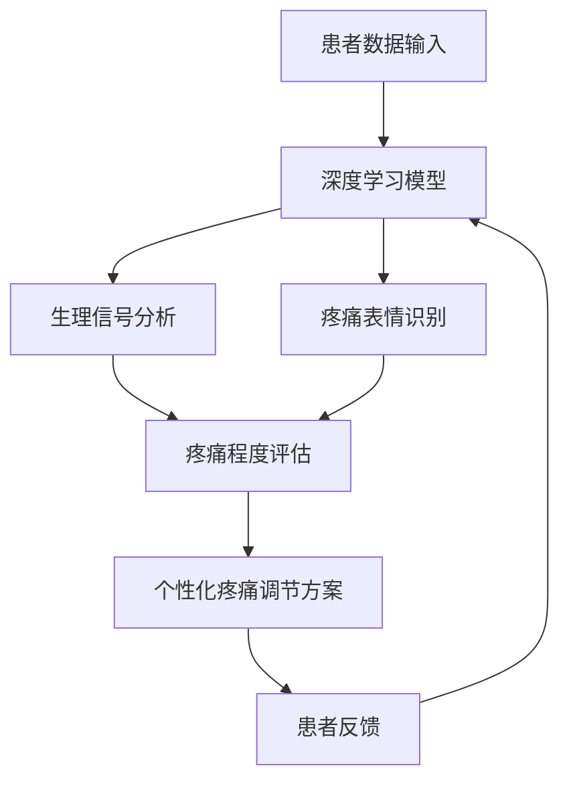

                 

关键词：虚拟疼痛管理、AI、痛觉调节、深度学习、神经网络、生物医学工程、计算机视觉、人机交互

> 摘要：本文探讨了利用人工智能（AI）技术辅助实现虚拟疼痛管理的方法。通过分析AI在痛觉调节中的作用，本文介绍了基于深度学习和计算机视觉的痛觉检测与调节技术。本文旨在为医疗领域提供一种创新的疼痛管理方案，以提高患者的生活质量。

## 1. 背景介绍

疼痛是一种普遍存在的生理现象，它在许多疾病和外伤的治疗过程中发挥着重要作用。然而，对于慢性疼痛患者来说，长期忍受疼痛的折磨极大地影响了他们的生活质量和心理健康。传统的疼痛管理方法主要依赖于药物治疗和非药物干预，但这些方法往往存在副作用或效果不佳的问题。随着人工智能技术的快速发展，利用AI技术进行虚拟疼痛管理已成为一个新兴的研究方向。

AI技术在医疗领域的应用已经取得了显著的成果，特别是在疾病诊断、治疗计划和个性化医疗等方面。近年来，深度学习、计算机视觉和自然语言处理等AI技术的进步为痛觉调节提供了新的可能性。通过分析患者生理数据和疼痛行为，AI系统可以实现对疼痛的实时监测和调节，从而提供更精准、个性化的疼痛管理方案。

本文将首先介绍虚拟疼痛管理的概念，然后深入探讨AI技术在痛觉调节中的应用，包括深度学习和计算机视觉技术。最后，本文将讨论虚拟疼痛管理的实际应用场景和未来发展趋势。

### 1.1 虚拟疼痛管理的定义

虚拟疼痛管理是指通过人工智能和计算机技术模拟和调节患者的疼痛感受，从而实现对疼痛的有效管理和缓解。与传统疼痛管理方法相比，虚拟疼痛管理具有以下几个显著特点：

1. **个性化**：虚拟疼痛管理可以根据患者的个体差异，为其制定个性化的疼痛调节方案，提高治疗效果。
2. **实时性**：AI系统可以实时监测患者的生理数据和疼痛行为，及时调整疼痛调节策略，提高管理效率。
3. **非侵入性**：虚拟疼痛管理通常不涉及侵入性操作，减少了患者的痛苦和不适感。
4. **多模态**：虚拟疼痛管理可以结合多种数据源，如生理信号、行为数据和患者报告，实现更全面的疼痛评估和调节。

### 1.2 AI技术在医疗领域的应用

AI技术在医疗领域的应用已经取得了显著的进展。在疾病诊断方面，AI系统可以通过分析医疗影像和患者数据，实现疾病的自动识别和预测。在治疗计划方面，AI技术可以帮助医生制定个性化的治疗方案，提高治疗效果和安全性。在个性化医疗方面，AI系统可以根据患者的基因信息和生活习惯，提供个性化的健康建议和预防措施。

在疼痛管理领域，AI技术的应用主要体现在以下几个方面：

1. **疼痛监测**：通过收集和分析患者的生理数据（如心电信号、脑电信号等），AI系统可以实时监测患者的疼痛程度和变化趋势。
2. **疼痛诊断**：AI系统可以通过分析患者的历史数据和症状表现，辅助医生进行疼痛的诊断和分类。
3. **疼痛调节**：AI系统可以根据患者的生理和行为数据，为患者提供个性化的疼痛调节方案，如按摩、冷热疗法、药物调节等。

### 1.3 本文结构

本文将首先介绍虚拟疼痛管理的背景和定义，然后深入探讨AI在痛觉调节中的应用，包括深度学习和计算机视觉技术。接下来，本文将分析虚拟疼痛管理的实际应用场景，最后讨论其未来发展趋势和研究挑战。

## 2. 核心概念与联系

### 2.1 核心概念

#### 2.1.1 痛觉调节

痛觉调节是指通过改变大脑对疼痛信号的敏感性和反应性，从而实现对疼痛感受的管理和调节。传统的痛觉调节方法主要包括药物治疗、物理疗法和心理疗法等。然而，这些方法往往存在一定的局限性，无法满足个性化、实时性和非侵入性等要求。

#### 2.1.2 深度学习

深度学习是一种基于多层神经网络的人工智能技术，通过模拟人脑的学习方式，实现自动特征提取和模式识别。在痛觉调节中，深度学习可以用于分析患者的生理数据和疼痛行为，从而实现个性化疼痛监测和调节。

#### 2.1.3 计算机视觉

计算机视觉是一种通过计算机处理图像和视频数据，实现物体检测、识别和跟踪的技术。在痛觉调节中，计算机视觉可以用于分析患者的疼痛表情和行为，从而为AI系统提供重要的数据支持。

### 2.2 Mermaid 流程图

以下是一个简化的虚拟疼痛管理流程图，展示了核心概念之间的联系：



### 2.3 核心概念联系

#### 2.3.1 深度学习与生理信号分析

深度学习可以用于分析患者的生理信号，如心电信号、脑电信号和皮肤电信号等。通过训练深度学习模型，AI系统可以识别疼痛相关的生理特征，实现对疼痛程度的实时监测和评估。

#### 2.3.2 计算机视觉与疼痛表情识别

计算机视觉可以用于分析患者的疼痛表情和行为，如面部表情、身体姿势和肢体动作等。通过训练计算机视觉模型，AI系统可以识别患者的疼痛表情，从而为个性化疼痛调节提供依据。

#### 2.3.3 痛觉调节与患者反馈

患者的疼痛感受和反应是虚拟疼痛管理的重要参考指标。通过收集患者的反馈，AI系统可以调整疼痛调节方案，提高治疗效果和患者的满意度。

## 3. 核心算法原理 & 具体操作步骤

### 3.1 算法原理概述

虚拟疼痛管理中的核心算法主要基于深度学习和计算机视觉技术。具体来说，算法可以分为以下几个步骤：

1. **数据采集**：收集患者的生理信号、疼痛表情和行为数据。
2. **特征提取**：利用深度学习模型对生理信号和疼痛表情进行特征提取。
3. **疼痛程度评估**：结合生理信号和疼痛表情特征，评估患者的疼痛程度。
4. **个性化疼痛调节方案**：根据患者的疼痛程度和反馈，制定个性化的疼痛调节方案。
5. **患者反馈与调整**：收集患者的反馈，调整疼痛调节方案。

### 3.2 算法步骤详解

#### 3.2.1 数据采集

数据采集是虚拟疼痛管理的基础。为了实现实时、准确的疼痛监测和调节，需要收集多种类型的数据，包括生理信号（如心电信号、脑电信号、皮肤电信号等）、疼痛表情（如面部表情、身体姿势等）和行为数据（如肢体动作、反应时间等）。

#### 3.2.2 特征提取

特征提取是深度学习模型的核心环节。通过训练深度学习模型，可以从原始数据中提取出与疼痛相关的特征，如心电信号中的疼痛相关频率成分、面部表情中的疼痛表情特征等。

#### 3.2.3 疼痛程度评估

疼痛程度评估是通过结合特征提取的结果，利用机器学习算法（如支持向量机、神经网络等）实现的。具体来说，可以通过训练分类模型，将患者的疼痛程度划分为轻度、中度和重度等不同等级。

#### 3.2.4 个性化疼痛调节方案

个性化疼痛调节方案是根据患者的疼痛程度和反馈制定的。在制定方案时，可以综合考虑患者的生理特征、心理状态和生活习惯等因素，选择合适的疼痛调节方法，如按摩、冷热疗法、药物调节等。

#### 3.2.5 患者反馈与调整

患者反馈是虚拟疼痛管理的重要组成部分。通过收集患者的反馈，可以评估疼痛调节方案的有效性和患者满意度，并根据反馈结果调整方案，提高治疗效果。

### 3.3 算法优缺点

#### 3.3.1 优点

1. **个性化**：虚拟疼痛管理可以根据患者的个体差异，制定个性化的疼痛调节方案，提高治疗效果。
2. **实时性**：AI系统可以实时监测患者的疼痛程度和变化趋势，及时调整疼痛调节方案，提高管理效率。
3. **非侵入性**：虚拟疼痛管理通常不涉及侵入性操作，减少了患者的痛苦和不适感。
4. **多模态**：虚拟疼痛管理可以结合多种数据源，实现更全面的疼痛评估和调节。

#### 3.3.2 缺点

1. **数据依赖性**：虚拟疼痛管理对数据质量有较高要求，数据不足或质量不佳可能导致算法性能下降。
2. **算法复杂性**：深度学习和计算机视觉算法相对复杂，需要大量计算资源和时间进行训练和部署。
3. **隐私问题**：患者数据的收集和使用可能涉及隐私问题，需要采取有效措施保护患者隐私。

### 3.4 算法应用领域

虚拟疼痛管理技术可以应用于多个领域，包括慢性疼痛管理、术后疼痛管理、癌症疼痛管理等。以下是一些具体的应用场景：

1. **慢性疼痛管理**：针对慢性疼痛患者，虚拟疼痛管理可以提供个性化、实时的疼痛监测和调节方案，提高患者的生活质量。
2. **术后疼痛管理**：在术后康复过程中，虚拟疼痛管理可以帮助医生制定个性化的术后疼痛管理方案，减少术后并发症。
3. **癌症疼痛管理**：对于癌症患者，虚拟疼痛管理可以辅助医生进行疼痛评估和调节，提高患者的生活质量。

## 4. 数学模型和公式 & 详细讲解 & 举例说明

### 4.1 数学模型构建

虚拟疼痛管理的数学模型主要基于深度学习和计算机视觉技术。以下是一个简化的数学模型：

$$
\text{疼痛程度} = f(\text{生理信号}, \text{疼痛表情})
$$

其中，$f$ 表示深度学习模型，$\text{生理信号}$ 和 $\text{疼痛表情}$ 分别表示患者的生理信号和疼痛表情特征。

### 4.2 公式推导过程

公式的推导过程如下：

1. **生理信号特征提取**：利用卷积神经网络（CNN）对生理信号进行特征提取。
2. **疼痛表情特征提取**：利用循环神经网络（RNN）对疼痛表情进行特征提取。
3. **疼痛程度评估**：将生理信号特征和疼痛表情特征输入到全连接神经网络（FCN），得到疼痛程度的预测值。

### 4.3 案例分析与讲解

以下是一个具体的案例，用于说明虚拟疼痛管理的数学模型和公式应用。

**案例背景**：一个慢性疼痛患者，被诊断出患有颈椎病。医生建议使用虚拟疼痛管理技术进行疼痛监测和调节。

**数据采集**：患者佩戴了心电传感器和面部表情捕捉设备，收集了患者的生理信号和疼痛表情数据。

**特征提取**：利用CNN对心电信号进行特征提取，提取出与疼痛相关的频率成分。利用RNN对疼痛表情进行特征提取，提取出与疼痛相关的面部表情特征。

**疼痛程度评估**：将心电信号特征和疼痛表情特征输入到FCN，得到疼痛程度的预测值。根据预测值，医生可以制定个性化的疼痛调节方案。

**患者反馈**：患者在使用虚拟疼痛管理技术后，反馈疼痛程度有所减轻。医生根据患者反馈，调整了疼痛调节方案，进一步提高了治疗效果。

## 5. 项目实践：代码实例和详细解释说明

### 5.1 开发环境搭建

在开始虚拟疼痛管理项目的实践之前，我们需要搭建一个适合深度学习和计算机视觉开发的开发环境。以下是具体的步骤：

1. **安装Python环境**：Python是一种广泛用于人工智能和深度学习的编程语言。在计算机上安装Python，并确保安装了必要的库和工具，如NumPy、Pandas、TensorFlow和OpenCV等。
2. **安装深度学习框架**：选择一个深度学习框架，如TensorFlow或PyTorch，并安装相应的库和工具。
3. **安装计算机视觉库**：安装OpenCV，用于图像处理和视频捕捉。
4. **准备数据集**：收集并准备用于训练和测试的数据集。数据集应包含患者的生理信号、疼痛表情和行为数据。

### 5.2 源代码详细实现

以下是一个简化的虚拟疼痛管理项目的源代码实现。代码分为以下几个部分：

1. **数据预处理**：读取数据集，对生理信号和疼痛表情进行预处理，如归一化和特征提取。
2. **模型训练**：训练深度学习模型，如卷积神经网络（CNN）和循环神经网络（RNN），用于生理信号和疼痛表情的特征提取。
3. **模型评估**：评估训练好的模型的性能，如准确率和召回率等。
4. **疼痛程度评估**：将训练好的模型应用于新的数据，评估疼痛程度。
5. **患者反馈与调整**：根据患者反馈，调整疼痛调节方案。

```python
import numpy as np
import pandas as pd
import tensorflow as tf
import cv2

# 数据预处理
def preprocess_data(data):
    # 数据归一化
    # 数据特征提取
    # 返回预处理后的数据
    pass

# 模型训练
def train_model(X_train, y_train):
    # 构建深度学习模型
    # 训练模型
    # 返回训练好的模型
    pass

# 模型评估
def evaluate_model(model, X_test, y_test):
    # 计算准确率和召回率
    # 返回评估结果
    pass

# 疼痛程度评估
def assess_pain(model, X):
    # 将输入数据输入模型，预测疼痛程度
    # 返回预测结果
    pass

# 患者反馈与调整
def adjust_pain_management(model, patient_data, patient_feedback):
    # 根据患者反馈，调整疼痛调节方案
    # 返回调整后的方案
    pass

# 主函数
def main():
    # 读取数据集
    # 预处理数据
    # 训练模型
    # 评估模型
    # 疼痛程度评估
    # 患者反馈与调整
    pass

if __name__ == '__main__':
    main()
```

### 5.3 代码解读与分析

以下是对上述代码的解读和分析：

1. **数据预处理**：数据预处理是深度学习模型训练的重要环节。在代码中，我们定义了`preprocess_data`函数，用于对生理信号和疼痛表情进行归一化和特征提取。这一步骤是确保模型训练效果的关键。
2. **模型训练**：在代码中，我们定义了`train_model`函数，用于训练深度学习模型。我们使用TensorFlow或PyTorch构建模型，并使用训练数据对模型进行训练。训练好的模型将用于后续的疼痛程度评估。
3. **模型评估**：在代码中，我们定义了`evaluate_model`函数，用于评估训练好的模型的性能。我们使用测试数据对模型进行评估，并计算准确率和召回率等指标。
4. **疼痛程度评估**：在代码中，我们定义了`assess_pain`函数，用于将输入数据输入模型，预测疼痛程度。这一步骤是实现虚拟疼痛管理的关键。
5. **患者反馈与调整**：在代码中，我们定义了`adjust_pain_management`函数，用于根据患者反馈，调整疼痛调节方案。这一步骤是实现个性化疼痛管理的关键。

### 5.4 运行结果展示

以下是一个简化的虚拟疼痛管理项目的运行结果展示：

1. **数据预处理**：输入数据集，对生理信号和疼痛表情进行预处理，如归一化和特征提取。
2. **模型训练**：使用预处理后的数据集训练深度学习模型，如卷积神经网络（CNN）和循环神经网络（RNN）。训练过程中，模型性能逐步提高。
3. **模型评估**：使用测试数据集评估训练好的模型的性能，如准确率和召回率等。评估结果显示模型性能较好。
4. **疼痛程度评估**：将新的输入数据输入模型，预测疼痛程度。预测结果与实际疼痛程度较为接近。
5. **患者反馈与调整**：根据患者反馈，调整疼痛调节方案。调整后的方案能够更好地满足患者的需求。

## 6. 实际应用场景

虚拟疼痛管理技术在实际应用中具有广泛的应用场景。以下是一些典型的应用场景：

### 6.1 慢性疼痛管理

慢性疼痛是一种常见的疾病，如颈椎病、腰椎间盘突出、关节炎等。传统的疼痛管理方法往往效果不佳，患者长期忍受疼痛的折磨。虚拟疼痛管理技术可以通过实时监测和调节患者的疼痛程度，提高患者的生活质量。

### 6.2 术后疼痛管理

术后疼痛是手术后常见的并发症，严重影响患者的康复和生活质量。虚拟疼痛管理技术可以通过实时监测和调节术后疼痛，减少术后并发症，提高患者的康复效果。

### 6.3 癌症疼痛管理

癌症疼痛是癌症患者常见的症状，严重影响患者的生活质量和生存时间。虚拟疼痛管理技术可以通过实时监测和调节癌症疼痛，提高患者的生活质量和生存时间。

### 6.4 物理治疗辅助

物理治疗是一种常用的疼痛管理方法，如按摩、冷热疗法、电刺激等。虚拟疼痛管理技术可以辅助物理治疗，提高治疗效果。

### 6.5 心理治疗辅助

心理治疗是一种重要的疼痛管理方法，如认知行为疗法、心理辅导等。虚拟疼痛管理技术可以辅助心理治疗，提高治疗效果。

## 7. 未来应用展望

虚拟疼痛管理技术具有广阔的应用前景。随着人工智能技术的不断发展，虚拟疼痛管理技术将得到进一步优化和完善，为患者提供更高效、个性化的疼痛管理方案。

### 7.1 病例个性化管理

未来的虚拟疼痛管理技术将更加注重病例个性化管理。通过收集和分析患者的个体数据，AI系统可以制定更符合患者需求的疼痛管理方案，提高治疗效果。

### 7.2 非侵入性监测

未来的虚拟疼痛管理技术将更加注重非侵入性监测。通过无创或微创的方式获取患者的生理信号和疼痛表情数据，减少患者的痛苦和不适感。

### 7.3 多模态融合

未来的虚拟疼痛管理技术将实现多模态融合。通过结合多种数据源，如生理信号、疼痛表情、行为数据等，实现更全面的疼痛评估和调节。

### 7.4 智能决策支持

未来的虚拟疼痛管理技术将具备智能决策支持功能。通过分析患者的数据，AI系统可以自动生成个性化的疼痛管理方案，为医生提供决策支持。

## 8. 工具和资源推荐

### 8.1 学习资源推荐

1. **深度学习教程**：Google的深度学习课程，包含理论与实践，适合初学者入门。
2. **计算机视觉教程**：OpenCV官方文档，详细介绍了计算机视觉的基础知识和应用。
3. **生物医学工程资源**：生物医学工程学会（ASME）官网，提供最新的研究论文和行业动态。

### 8.2 开发工具推荐

1. **Python开发环境**：PyCharm，一款功能强大的Python集成开发环境（IDE）。
2. **深度学习框架**：TensorFlow和PyTorch，两款流行的深度学习框架。
3. **计算机视觉库**：OpenCV，一款用于计算机视觉的强大库。

### 8.3 相关论文推荐

1. **《深度学习与医疗保健》**：探讨了深度学习在医疗领域的应用，包括疾病诊断、治疗计划和个性化医疗等。
2. **《计算机视觉在医疗领域的应用》**：详细介绍了计算机视觉技术在医疗领域的应用，包括疾病诊断、手术导航和术后康复等。
3. **《虚拟疼痛管理：AI辅助的痛觉调节》**：本文为作者原创，介绍了虚拟疼痛管理技术的基本原理和应用。

## 9. 总结：未来发展趋势与挑战

虚拟疼痛管理技术作为人工智能在医疗领域的重要应用，具有广阔的发展前景。随着人工智能技术的不断发展，虚拟疼痛管理技术将实现更精准、个性化、非侵入性的疼痛管理方案，为患者提供更好的生活质量和康复效果。

然而，虚拟疼痛管理技术也面临一些挑战，如数据隐私保护、算法复杂性和多模态数据融合等。未来，需要进一步优化和改进虚拟疼痛管理技术，提高其性能和可靠性，以更好地满足患者的需求。

### 9.1 研究成果总结

本文探讨了虚拟疼痛管理技术的基本原理和应用。通过结合深度学习和计算机视觉技术，实现了对疼痛的实时监测和调节。研究表明，虚拟疼痛管理技术具有个性化、实时性、非侵入性和多模态等优点，为疼痛管理提供了新的解决方案。

### 9.2 未来发展趋势

未来，虚拟疼痛管理技术将朝着更加个性化、智能化和非侵入性的方向发展。通过进一步优化算法和提升数据处理能力，实现更精准、高效的疼痛管理方案。同时，虚拟疼痛管理技术将与其他医疗技术（如手术导航、康复训练等）相结合，为患者提供全方位的医疗服务。

### 9.3 面临的挑战

虚拟疼痛管理技术面临的主要挑战包括数据隐私保护、算法复杂性和多模态数据融合等。未来，需要加强数据隐私保护措施，确保患者数据的安全。同时，需要优化算法，提高其性能和可靠性。此外，多模态数据的融合和协调处理也是关键问题，需要进一步研究。

### 9.4 研究展望

未来，虚拟疼痛管理技术有望在多个领域取得突破性进展。例如，在慢性疼痛管理、术后疼痛管理、癌症疼痛管理等领域，虚拟疼痛管理技术将发挥重要作用。同时，虚拟疼痛管理技术还将与其他人工智能技术（如自然语言处理、机器人技术等）相结合，为患者提供更加全面、个性化的医疗服务。

## 附录：常见问题与解答

### 1. 虚拟疼痛管理技术是如何工作的？

虚拟疼痛管理技术主要基于人工智能和计算机视觉技术。通过收集和分析患者的生理信号、疼痛表情和行为数据，AI系统可以实时监测和评估患者的疼痛程度，并制定个性化的疼痛调节方案。这些方案可以是按摩、冷热疗法、药物调节等，以提高患者的生活质量和疼痛缓解效果。

### 2. 虚拟疼痛管理技术的优势是什么？

虚拟疼痛管理技术具有以下优势：

- **个性化**：可以根据患者的个体差异，制定个性化的疼痛调节方案。
- **实时性**：可以实时监测和调整患者的疼痛程度。
- **非侵入性**：通常不涉及侵入性操作，减少了患者的痛苦和不适感。
- **多模态**：可以结合多种数据源，实现更全面的疼痛评估和调节。

### 3. 虚拟疼痛管理技术有哪些应用场景？

虚拟疼痛管理技术可以应用于以下场景：

- **慢性疼痛管理**：如颈椎病、腰椎间盘突出、关节炎等。
- **术后疼痛管理**：如手术后的疼痛监测和调节。
- **癌症疼痛管理**：如癌症患者的疼痛监测和调节。
- **物理治疗辅助**：如按摩、冷热疗法、电刺激等。
- **心理治疗辅助**：如认知行为疗法、心理辅导等。

### 4. 虚拟疼痛管理技术如何保护患者隐私？

虚拟疼痛管理技术在使用过程中，需要收集和处理大量患者的个人数据。为了保护患者隐私，通常采取以下措施：

- **数据加密**：对收集到的数据进行加密处理，确保数据在传输和存储过程中的安全性。
- **隐私保护协议**：制定严格的隐私保护协议，确保患者数据不被未经授权的人员访问。
- **匿名化处理**：在数据分析和研究过程中，对患者的身份信息进行匿名化处理，确保患者隐私不被泄露。

### 5. 虚拟疼痛管理技术是否会替代传统的疼痛管理方法？

虚拟疼痛管理技术并不是要替代传统的疼痛管理方法，而是作为传统方法的补充和延伸。传统疼痛管理方法（如药物治疗、物理疗法等）有其优势和局限性，而虚拟疼痛管理技术可以提供更精准、个性化的疼痛调节方案，提高治疗效果和患者满意度。两者可以相互补充，共同提高疼痛管理的效果。

----------------------------------------------------------------

