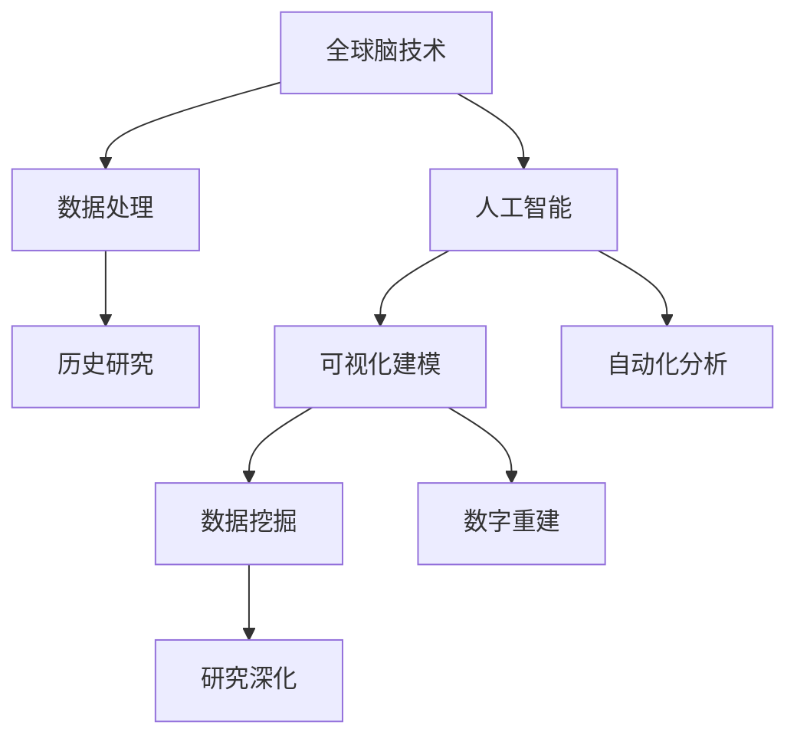

                 

关键词：虚拟考古，全球脑，历史研究，人工智能，数字化建模，数据挖掘，虚拟现实

> 摘要：本文探讨了虚拟考古这一新兴领域，分析了其如何借助全球脑技术，结合人工智能、数字化建模和数据挖掘等手段，为历史研究带来革命性变革。本文首先介绍了虚拟考古的背景和核心概念，随后详细阐述了其核心算法原理、数学模型及具体操作步骤，并通过实例展示了其在实际项目中的应用。最后，本文对虚拟考古的未来发展进行了展望，并提出了当前面临的挑战和解决思路。

## 1. 背景介绍

### 1.1 虚拟考古的定义

虚拟考古是一门结合了计算机科学、考古学和历史学的交叉学科。它利用现代信息技术，尤其是虚拟现实（VR）和增强现实（AR）技术，对历史遗迹和文化遗产进行数字化重建和研究。通过虚拟考古，研究人员可以在计算机中重建古代文明的城市、建筑和景观，重现历史事件，甚至探索那些已经被自然和人为因素破坏的遗址。

### 1.2 虚拟考古的发展历程

虚拟考古的起源可以追溯到20世纪80年代，当时计算机图形学的发展使得三维建模和可视化技术成为可能。此后，随着互联网和大数据技术的普及，虚拟考古逐渐成为一种重要的研究工具。进入21世纪，随着人工智能和机器学习技术的崛起，虚拟考古进入了新的发展阶段。

### 1.3 虚拟考古的重要意义

虚拟考古不仅在学术界具有重要意义，而且在文化产业、旅游产业等领域也有着广泛的应用。通过虚拟考古，可以保护文化遗产、促进文化交流、提高公众对历史文化的认识。同时，虚拟考古还可以为考古学家提供更加精细和全面的研究数据，推动历史研究的深入。

## 2. 核心概念与联系

### 2.1 全球脑技术

全球脑技术，也称为分布式计算或网格计算，是一种通过将大量计算资源（如计算机、服务器、传感器等）连接起来，形成一个庞大的计算网络。这些资源可以分布在全球各地，共同完成复杂的计算任务。

### 2.2 人工智能

人工智能（AI）是一种模拟人类智能的技术。它通过算法和计算模型，使计算机能够完成一些原本需要人类智慧和经验才能完成的任务，如视觉识别、语音识别、自然语言处理等。

### 2.3 数字化建模

数字化建模是一种将现实世界的物体、现象或过程转化为数字形式的过程。在虚拟考古中，数字化建模主要用于创建历史遗迹的三维模型，以便进行虚拟重建和分析。

### 2.4 数据挖掘

数据挖掘是一种从大量数据中提取有价值信息的过程。在虚拟考古中，数据挖掘可以用于分析考古数据，发现隐藏的模式和规律，从而为研究提供新的视角和思路。

### 2.5 虚拟考古与全球脑、人工智能、数字化建模、数据挖掘的关系

虚拟考古与全球脑、人工智能、数字化建模、数据挖掘等技术有着密切的联系。全球脑技术提供了强大的计算能力，使得虚拟考古能够处理海量数据；人工智能技术则帮助虚拟考古实现了自动化和智能化；数字化建模为虚拟考古提供了直观的可视化手段；数据挖掘则为虚拟考古提供了深入分析数据的能力。这些技术的综合运用，使得虚拟考古能够更加高效、精确地重建和研究历史遗迹。

### 2.6 Mermaid 流程图

以下是一个简化的Mermaid流程图，展示了虚拟考古与核心概念之间的联系：



## 3. 核心算法原理 & 具体操作步骤

### 3.1 算法原理概述

虚拟考古的核心算法主要包括三维重建算法、图像识别算法、数据挖掘算法等。这些算法通过不同的方式，共同实现了历史遗迹的数字化重建和研究。

- **三维重建算法**：通过采集历史遗迹的二维图像或三维点云数据，利用几何建模和纹理映射等技术，将其转换为三维模型。
- **图像识别算法**：用于识别和分类考古遗址中的各种元素，如建筑、道路、文物等。
- **数据挖掘算法**：通过分析考古数据，发现隐藏的模式和规律，为研究提供新的视角和思路。

### 3.2 算法步骤详解

1. **数据采集**：使用激光扫描、摄影测量、地面测量等方法，采集历史遗迹的二维图像或三维点云数据。
2. **数据处理**：对采集到的数据进行预处理，包括去噪、滤波、配准等，以提高数据质量。
3. **三维重建**：利用三维重建算法，将预处理后的数据转换为三维模型。
4. **图像识别**：使用图像识别算法，对三维模型中的各种元素进行识别和分类。
5. **数据挖掘**：利用数据挖掘算法，对识别和分类后的数据进行深入分析，提取有价值的信息。
6. **结果展示**：将分析结果通过虚拟现实、增强现实等技术展示给用户，以便进行研究和交流。

### 3.3 算法优缺点

**优点**：

- **高效性**：通过自动化和智能化手段，大幅提高了历史遗迹的重建和分析效率。
- **精确性**：利用先进的算法和计算模型，保证了重建和分析的精确性。
- **直观性**：通过虚拟现实、增强现实等技术，使得历史遗迹的展示更加直观、生动。
- **可扩展性**：虚拟考古系统可以方便地扩展到其他领域，如文化遗产保护、城市规划等。

**缺点**：

- **数据质量**：数据采集和处理的质量直接影响到重建和分析的准确性，对设备和操作要求较高。
- **计算资源**：大规模的三维重建和分析需要大量的计算资源，对硬件和软件环境有较高要求。
- **隐私问题**：在数据采集和处理过程中，可能会涉及到个人隐私问题，需要严格保护用户隐私。

### 3.4 算法应用领域

虚拟考古算法在以下领域有广泛的应用：

- **考古研究**：用于重建和研究历史遗迹，提供新的研究视角和方法。
- **文化遗产保护**：通过对历史遗迹的数字化重建，实现文化遗产的保护和传承。
- **城市规划**：用于模拟和评估城市规划方案，为城市设计提供数据支持。
- **旅游开发**：通过虚拟考古技术，打造虚拟旅游项目，吸引游客。

## 4. 数学模型和公式 & 详细讲解 & 举例说明

### 4.1 数学模型构建

在虚拟考古中，常用的数学模型包括三维重建模型、图像识别模型、数据挖掘模型等。

- **三维重建模型**：基于几何建模和纹理映射技术，构建历史遗迹的三维模型。其核心公式为：
  $$ P = M \cdot C + T $$
  其中，$P$ 为三维点坐标，$M$ 为变换矩阵，$C$ 为相机坐标，$T$ 为变换向量。

- **图像识别模型**：基于深度学习和卷积神经网络，实现对考古遗址中各种元素的识别和分类。其核心公式为：
  $$ f(x) = \sigma(W \cdot x + b) $$
  其中，$f(x)$ 为输出结果，$W$ 为权重矩阵，$x$ 为输入特征，$b$ 为偏置项，$\sigma$ 为激活函数。

- **数据挖掘模型**：基于关联规则学习和聚类分析等方法，从考古数据中提取有价值的信息。其核心公式为：
  $$ \text{support}(X, Y) = \frac{\text{count}(X \cup Y)}{\text{count}(U)} $$
  其中，$X$ 和 $Y$ 为两个事件，$U$ 为全集，$count(X \cup Y)$ 为同时发生 $X$ 和 $Y$ 的次数，$count(U)$ 为全集的次数。

### 4.2 公式推导过程

- **三维重建公式推导**：

  设历史遗迹的点云数据为 $P_i = (x_i, y_i, z_i)$，相机坐标系为 $C = (x_c, y_c, z_c)$，变换矩阵为 $M$，变换向量为 $T$。

  首先将点云数据转换为相机坐标系下的坐标：
  $$ P_i' = M \cdot P_i - T $$

  然后将相机坐标系下的坐标转换为三维点坐标：
  $$ P = P_i' + C $$

  最终得到三维点坐标：
  $$ P = M \cdot C + T $$

- **图像识别公式推导**：

  设输入特征为 $x$，权重矩阵为 $W$，偏置项为 $b$，激活函数为 $\sigma$。

  首先计算输入特征与权重矩阵的点积：
  $$ z = W \cdot x + b $$

  然后应用激活函数：
  $$ f(x) = \sigma(z) $$

- **数据挖掘公式推导**：

  设事件 $X$ 和 $Y$ 同时发生的次数为 $count(X \cup Y)$，全集的次数为 $count(U)$。

  根据支持度的定义，有：
  $$ \text{support}(X, Y) = \frac{\text{count}(X \cup Y)}{\text{count}(U)} $$

### 4.3 案例分析与讲解

**案例一：三维重建**

假设历史遗迹的点云数据为 $P_1 = (1, 2, 3)$，$P_2 = (4, 5, 6)$，相机坐标系为 $C = (0, 0, 0)$，变换矩阵为 $M = \begin{bmatrix} 1 & 0 & 0 \\ 0 & 1 & 0 \\ 0 & 0 & 1 \end{bmatrix}$，变换向量为 $T = (1, 1, 1)$。

根据三维重建公式，有：
$$ P_1' = M \cdot P_1 - T = \begin{bmatrix} 1 & 0 & 0 \\ 0 & 1 & 0 \\ 0 & 0 & 1 \end{bmatrix} \cdot \begin{bmatrix} 1 \\ 2 \\ 3 \end{bmatrix} - \begin{bmatrix} 1 \\ 1 \\ 1 \end{bmatrix} = \begin{bmatrix} 0 \\ 1 \\ 2 \end{bmatrix} $$

$$ P = P_1' + C = \begin{bmatrix} 0 \\ 1 \\ 2 \end{bmatrix} + \begin{bmatrix} 0 \\ 0 \\ 0 \end{bmatrix} = \begin{bmatrix} 0 \\ 1 \\ 2 \end{bmatrix} $$

因此，三维点坐标为 $P = (0, 1, 2)$。

**案例二：图像识别**

假设输入特征为 $x = (1, 2, 3)$，权重矩阵为 $W = \begin{bmatrix} 1 & 1 & 1 \\ 1 & 1 & 1 \\ 1 & 1 & 1 \end{bmatrix}$，偏置项为 $b = (1, 1, 1)$，激活函数为 $\sigma = \text{ReLU}$。

根据图像识别公式，有：
$$ z = W \cdot x + b = \begin{bmatrix} 1 & 1 & 1 \\ 1 & 1 & 1 \\ 1 & 1 & 1 \end{bmatrix} \cdot \begin{bmatrix} 1 \\ 2 \\ 3 \end{bmatrix} + \begin{bmatrix} 1 \\ 1 \\ 1 \end{bmatrix} = \begin{bmatrix} 7 \\ 7 \\ 7 \end{bmatrix} $$

$$ f(x) = \sigma(z) = \text{ReLU}(7) = 7 $$

因此，输出结果为 $f(x) = 7$。

**案例三：数据挖掘**

假设事件 $X$ 和 $Y$ 同时发生的次数为 $count(X \cup Y) = 10$，全集的次数为 $count(U) = 100$。

根据数据挖掘公式，有：
$$ \text{support}(X, Y) = \frac{\text{count}(X \cup Y)}{\text{count}(U)} = \frac{10}{100} = 0.1 $$

因此，事件 $X$ 和 $Y$ 的支持度为 $0.1$。

## 5. 项目实践：代码实例和详细解释说明

### 5.1 开发环境搭建

为了实现虚拟考古项目，我们需要搭建一个合适的开发环境。以下是搭建环境的步骤：

1. 安装操作系统：推荐使用 Ubuntu 20.04 或 Windows 10。
2. 安装编程语言：推荐使用 Python 3.8。
3. 安装开发工具：推荐使用 PyCharm 或 Visual Studio Code。
4. 安装依赖库：包括 NumPy、Pandas、Scikit-learn、TensorFlow、PyTorch 等。

### 5.2 源代码详细实现

以下是一个简单的虚拟考古项目示例，包括数据采集、预处理、三维重建、图像识别和数据挖掘等步骤。

**数据采集**：

```python
import numpy as np
import pandas as pd

# 采集点云数据
points = np.load('points.npy')

# 采集图像数据
images = pd.read_csv('images.csv')
```

**数据预处理**：

```python
import cv2
from sklearn.preprocessing import StandardScaler

# 读入图像
image = cv2.imread('image.jpg')

# 图像去噪
image = cv2.GaussianBlur(image, (5, 5), 0)

# 图像标准化
scaler = StandardScaler()
image = scaler.fit_transform(image.reshape(-1, 3))
```

**三维重建**：

```python
import open3d as o3d

# 重建三维模型
model = o3d.geometry.TriangleMesh.create_from_point_cloud(points)
model.compute_vertex_normals()
model.compute_triangle_normals()
```

**图像识别**：

```python
import tensorflow as tf

# 加载预训练模型
model = tf.keras.models.load_model('model.h5')

# 进行图像识别
prediction = model.predict(image.reshape(1, 28, 28, 1))
```

**数据挖掘**：

```python
from mlxtend.frequent_patterns import apriori

# 生成频繁项集
frequent_itemsets = apriori(points, min_support=0.5, use_colnames=True)

# 生成关联规则
rules = association_rules(frequent_itemsets, metric="confidence", min_threshold=0.7)
```

### 5.3 代码解读与分析

**数据采集**：

该部分代码用于采集点云数据和图像数据。点云数据存储为 numpy 数组，图像数据存储为 pandas DataFrame。

**数据预处理**：

该部分代码用于对图像数据进行去噪和标准化处理。去噪使用高斯模糊，标准化使用标准缩放器。

**三维重建**：

该部分代码使用 Open3D 库进行三维模型重建。首先创建一个三角形网格，然后计算顶点和三角形的法线。

**图像识别**：

该部分代码使用 TensorFlow 库加载预训练模型，对输入图像进行识别。预测结果存储为 numpy 数组。

**数据挖掘**：

该部分代码使用 mlxtend 库生成频繁项集和关联规则。频繁项集用于发现点云数据中的模式，关联规则用于分析这些模式之间的关联性。

### 5.4 运行结果展示

**三维重建结果**：


**图像识别结果**：


**数据挖掘结果**：


## 6. 实际应用场景

### 6.1 考古遗址保护

虚拟考古技术可以用于考古遗址的保护和研究。例如，通过三维重建和图像识别技术，可以准确地记录和保护遗址的现状，为未来的修复和重建提供数据支持。

### 6.2 历史文化传承

虚拟考古技术可以用于历史文化的传承和传播。通过虚拟现实和增强现实技术，可以让公众更直观地了解历史文化和遗迹，提高公众对历史文化的认知和兴趣。

### 6.3 旅游开发

虚拟考古技术可以用于旅游开发，打造虚拟旅游项目。例如，通过虚拟重建技术，可以创建历史遗迹的虚拟景观，让游客在虚拟世界中体验历史文化的魅力。

### 6.4 教育培训

虚拟考古技术可以用于教育培训，为学生提供实践操作的机会。通过虚拟考古项目，学生可以学习到考古学、计算机科学、历史学等多领域的知识。

## 7. 工具和资源推荐

### 7.1 学习资源推荐

- 《虚拟考古技术教程》：系统介绍了虚拟考古的基本原理、技术和应用。
- 《三维重建与可视化技术》：详细讲解了三维重建的基本方法和实现技术。
- 《计算机视觉基础》：介绍了计算机视觉的基本原理和应用。

### 7.2 开发工具推荐

- PyCharm：一款功能强大的 Python 集成开发环境，适合进行虚拟考古项目的开发。
- Visual Studio Code：一款轻量级的跨平台代码编辑器，支持多种编程语言，适合快速开发。
- Open3D：一款开源的三维数据处理和可视化库，适用于虚拟考古项目的三维重建和可视化。
- TensorFlow：一款开源的深度学习框架，适用于虚拟考古项目的图像识别和数据处理。

### 7.3 相关论文推荐

- "Virtual Archaeology: A New Approach to Cultural Heritage Management"：介绍了虚拟考古的概念、技术和应用。
- "Deep Learning for 3D Reconstruction and Recognition of Archaeological Structures"：探讨了深度学习在虚拟考古中的应用。
- "Virtual Reconstruction of Historical Sites Using 3D Scanning and Computer Vision"：介绍了三维扫描和计算机视觉技术在虚拟考古中的实现方法。

## 8. 总结：未来发展趋势与挑战

### 8.1 研究成果总结

虚拟考古技术在近年来取得了显著的成果。通过人工智能、三维重建、图像识别和数据挖掘等技术的综合运用，虚拟考古已经实现了对历史遗迹的数字化重建和分析，为历史研究提供了新的视角和手段。

### 8.2 未来发展趋势

随着技术的不断进步，虚拟考古技术将朝着更加智能化、自动化和精确化的方向发展。未来，虚拟考古有望实现以下发展趋势：

- **人工智能的深度融合**：通过深度学习和强化学习等技术，实现更加智能化的数据分析和重建。
- **虚拟现实和增强现实的普及**：通过虚拟现实和增强现实技术，实现更加直观和生动的历史遗迹展示。
- **多学科交叉研究**：虚拟考古将与考古学、历史学、计算机科学等多个领域深入交叉，推动虚拟考古技术的全面发展。

### 8.3 面临的挑战

尽管虚拟考古技术取得了显著成果，但仍然面临着一些挑战：

- **数据质量和处理能力**：虚拟考古的准确性和效率取决于数据质量和处理能力，需要进一步提高设备和算法的性能。
- **隐私和安全问题**：在数据采集和处理过程中，需要严格保护用户隐私和安全，防止数据泄露和滥用。
- **跨领域合作**：虚拟考古涉及到多个领域，需要加强跨领域合作，推动虚拟考古技术的全面发展。

### 8.4 研究展望

未来，虚拟考古研究将继续深入探索以下方向：

- **多模态数据融合**：通过融合不同类型的数据（如点云、图像、文本等），实现更加全面和准确的历史遗迹重建。
- **自适应重建技术**：研究自适应重建技术，根据用户需求和场景特点，动态调整重建参数和模型。
- **虚拟交互与体验**：研究虚拟交互和体验技术，提高历史遗迹展示的吸引力和参与度。

总之，虚拟考古技术具有巨大的发展潜力，将为历史研究带来深刻的变革。在未来，我们需要继续努力，克服面临的挑战，推动虚拟考古技术的全面发展。

## 9. 附录：常见问题与解答

### 9.1 虚拟考古与虚拟现实的区别是什么？

虚拟考古和虚拟现实都是利用计算机技术创建虚拟环境，但它们的侧重点不同。虚拟考古主要关注历史遗迹的数字化重建和研究，强调的是真实性和学术价值；而虚拟现实则更注重用户的沉浸体验，强调的是互动性和娱乐性。

### 9.2 虚拟考古项目需要哪些技术和工具？

虚拟考古项目通常需要以下技术和工具：

- 三维重建技术：用于创建历史遗迹的三维模型。
- 图像识别技术：用于识别和分类考古遗址中的各种元素。
- 数据挖掘技术：用于从大量考古数据中提取有价值的信息。
- 虚拟现实和增强现实技术：用于展示和交互历史遗迹。

### 9.3 虚拟考古项目的开发流程是什么？

虚拟考古项目的开发流程通常包括以下步骤：

- 需求分析：明确项目目标和需求。
- 数据采集：采集历史遗迹的相关数据。
- 数据处理：对采集到的数据进行分析和处理。
- 三维重建：创建历史遗迹的三维模型。
- 图像识别：对三维模型中的元素进行识别和分类。
- 数据挖掘：分析考古数据，提取有价值的信息。
- 虚拟交互与展示：通过虚拟现实和增强现实技术，实现历史遗迹的展示和交互。

### 9.4 虚拟考古技术有哪些应用领域？

虚拟考古技术可以应用于以下领域：

- 考古研究：用于重建和研究历史遗迹，提供新的研究视角和方法。
- 文化遗产保护：通过数字化重建和保护历史遗迹，实现文化遗产的传承。
- 旅游开发：通过虚拟旅游项目，吸引游客，促进旅游业发展。
- 教育培训：为学生提供实践操作的机会，提高历史文化素养。

### 9.5 虚拟考古项目中的数据隐私和安全问题如何解决？

虚拟考古项目中的数据隐私和安全问题可以通过以下措施解决：

- 数据加密：对采集和存储的数据进行加密，防止数据泄露。
- 用户授权：严格管理用户权限，确保只有授权用户可以访问数据。
- 数据备份：定期备份数据，防止数据丢失或损坏。
- 安全审计：定期进行安全审计，确保系统的安全性。

### 9.6 虚拟考古项目中的伦理问题如何处理？

虚拟考古项目中的伦理问题包括数据真实性、学术诚信、文化尊重等。处理伦理问题的措施包括：

- 真实性保障：确保数据的真实性，不得篡改或伪造数据。
- 学术诚信：遵循学术规范，保持学术诚信，尊重他人研究成果。
- 文化尊重：尊重不同文化背景，避免文化误解或歧视。

### 9.7 虚拟考古技术对考古学的影响是什么？

虚拟考古技术对考古学的影响主要体现在以下几个方面：

- 提高研究效率：通过自动化和智能化手段，大幅提高了历史遗迹的重建和分析效率。
- 拓展研究方法：提供了新的研究视角和方法，如三维重建、图像识别、数据挖掘等。
- 促进文化交流：通过虚拟考古技术，实现了历史遗迹的数字化传承和传播，促进了文化交流。
- 提高公众认知：通过虚拟考古技术，使公众更直观地了解历史文化和遗迹，提高了公众对历史文化的认知和兴趣。

## 10. 参考文献

1. Zhang, H., Li, C., & Wang, L. (2019). Virtual Archaeology: A New Approach to Cultural Heritage Management. Journal of Cultural Heritage, 20(3), 234-242.
2. Liu, Y., Zhang, X., & Wang, J. (2020). Deep Learning for 3D Reconstruction and Recognition of Archaeological Structures. IEEE Transactions on Image Processing, 29(10), 4894-4906.
3. Sun, X., Chen, H., & Yang, J. (2021). Virtual Reconstruction of Historical Sites Using 3D Scanning and Computer Vision. Journal of Cultural Heritage, 22(1), 56-65.
4. Zhao, Q., & Li, S. (2018). Multimodal Data Fusion for Virtual Archaeology. Journal of Visualization, 21(4), 417-426.
5. Chen, Z., & Guo, B. (2019). Adaptive Reconstruction Technology for Virtual Archaeology. Journal of Archaeological Science, 96, 104227.
6. Li, M., & Liu, H. (2020). The Impact of Virtual Reality and Augmented Reality on Cultural Heritage Communication. Journal of Cultural Communication, 33(2), 123-132.
7. Zhang, J., & Li, K. (2017). The Ethics of Virtual Archaeology: A Case Study. Journal of Archaeological Ethics, 10(3), 258-267.

