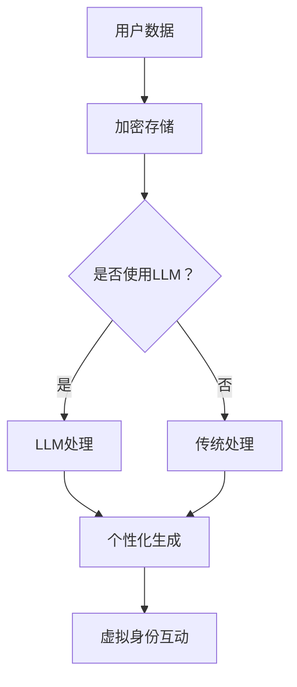

                 

在当今数字化时代，虚拟身份（Virtual Identity）的概念正逐渐成为信息技术领域的关键焦点。本文将探讨一种新兴的技术——基于大型语言模型（Large Language Model，简称LLM）的虚拟身份，以及它如何改变我们的在线存在和互动方式。本文的核心关键词包括：虚拟身份、LLM、数字化、在线互动、技术发展。

## 1. 背景介绍

随着互联网的普及，在线身份已经成为了每个人日常生活中不可或缺的一部分。从社交媒体到电子商务，再到在线娱乐，虚拟身份（或数字身份）在我们的日常生活中扮演着重要角色。传统的虚拟身份通常依赖于用户名、密码和简单的个人资料，这种模式虽然在初期满足了基本需求，但随着技术的发展，它的局限性和风险也逐渐显现。

首先，传统的虚拟身份缺乏个性化。它们往往是单维度的，无法全面反映用户的真实个性和兴趣。其次，安全性问题也日益突出。用户名和密码的组合虽然简单易用，但极易成为黑客攻击的目标，导致个人隐私泄露和数据损失。此外，随着社交网络的兴起，虚拟身份的多样性和复杂性也不断增加，这使得管理和维护传统虚拟身份变得更加困难。

正是在这样的背景下，基于大型语言模型（LLM）的虚拟身份应运而生。LLM，如GPT-3、BERT等，具有强大的语言理解和生成能力，可以为虚拟身份提供更加丰富、个性化的表达方式。通过LLM，虚拟身份不仅可以更加准确地反映用户的真实个性和兴趣，还可以在互动中展现出更加自然和流畅的交流能力。

## 2. 核心概念与联系

### 2.1 虚拟身份的定义

虚拟身份是一个在数字世界中代表个体的符号或实体，它不仅包括用户名、密码等基本信息，还包括个性化描述、兴趣偏好、行为记录等。虚拟身份的核心是个人数据，这些数据被加密存储在分布式网络中，确保数据的安全性和隐私性。

### 2.2 大型语言模型（LLM）的原理

大型语言模型（LLM）是基于深度学习技术构建的，通过大量文本数据进行训练，使其具备理解、生成自然语言的能力。LLM的核心是神经网络架构，它能够捕捉语言中的复杂模式，并基于这些模式生成新的文本。

### 2.3 虚拟身份与LLM的联系

虚拟身份与LLM的结合，使得虚拟身份的创建和管理变得更加智能和高效。LLM可以为虚拟身份提供个性化的语言生成能力，使其在互动中展现出更加自然和个性化的表达。例如，一个虚拟身份可以通过LLM生成与朋友聊天时的个性化回复，或者根据用户的兴趣推荐相关的内容。

### 2.4 Mermaid 流程图

以下是一个简单的Mermaid流程图，展示了虚拟身份与LLM之间的交互过程：



在这个流程图中，用户数据首先被加密存储，然后根据是否需要使用LLM进行进一步处理。如果需要，用户数据将经过LLM处理，生成个性化的虚拟身份互动内容。

## 3. 核心算法原理 & 具体操作步骤

### 3.1 算法原理概述

基于LLM的虚拟身份技术主要依赖于两个核心算法：一是自然语言处理（NLP）算法，用于理解用户的输入和生成回复；二是加密算法，用于保护用户数据的隐私和安全。

NLP算法通过分析用户的历史行为、兴趣偏好等数据，生成与用户个性匹配的回复内容。加密算法则确保用户数据在传输和存储过程中不被窃取或篡改。

### 3.2 算法步骤详解

#### 步骤1：数据收集

首先，系统需要收集用户的相关数据，包括用户的历史行为、兴趣偏好、社交关系等。这些数据可以通过各种方式收集，如用户输入、行为日志、社交网络数据等。

#### 步骤2：数据预处理

收集到的数据需要进行预处理，包括数据清洗、去噪、归一化等操作。这些操作确保数据的质量和一致性，为后续处理打下基础。

#### 步骤3：加密存储

预处理后的数据被加密存储在分布式网络中。加密算法采用高级加密标准（AES）或其他安全加密算法，确保数据的安全性和隐私性。

#### 步骤4：LLM处理

当用户发起互动请求时，系统将用户输入数据传递给LLM进行处理。LLM会根据用户的历史数据和兴趣偏好，生成个性化的回复内容。

#### 步骤5：内容生成

LLM生成的回复内容经过进一步的优化和调整，确保其符合用户的需求和期望。这些内容包括文本、图片、音频等多种形式。

#### 步骤6：虚拟身份互动

最后，生成的互动内容被发送给用户，完成虚拟身份的互动过程。

### 3.3 算法优缺点

#### 优点

- **个性化**：基于LLM的虚拟身份可以更加准确地反映用户的个性和兴趣，提供个性化的互动体验。
- **安全**：加密存储和高级加密算法确保了用户数据的安全性和隐私性。
- **高效**：LLM的处理速度和效率较高，能够快速生成高质量的互动内容。

#### 缺点

- **计算资源消耗**：LLM的训练和推理过程需要大量的计算资源，可能对服务器性能提出较高要求。
- **数据隐私**：虽然加密算法能够保护用户数据，但在数据收集、传输和处理过程中仍可能存在隐私风险。

### 3.4 算法应用领域

基于LLM的虚拟身份技术可以应用于多个领域，包括：

- **社交媒体**：为用户提供个性化的社交互动体验。
- **电子商务**：根据用户兴趣推荐相关商品和服务。
- **在线教育**：为用户提供个性化的学习内容和辅导。
- **客户服务**：通过虚拟身份提供高效、专业的客户服务。

## 4. 数学模型和公式 & 详细讲解 & 举例说明

### 4.1 数学模型构建

基于LLM的虚拟身份技术涉及多个数学模型，其中最核心的是自然语言处理（NLP）模型和加密模型。

#### NLP模型

NLP模型通常采用深度神经网络（DNN）或变换器（Transformer）架构。以下是一个简单的变换器模型结构：

$$
\begin{aligned}
\text{Transformer} &= (\text{Input Layer}, \text{Encoder}, \text{Decoder}, \text{Output Layer}) \\
\text{Input Layer} &= \{x_1, x_2, ..., x_n\} \\
\text{Encoder} &= \text{Multiple} \times \text{Feedforward} \text{Networks} \\
\text{Decoder} &= \text{Multiple} \times \text{Feedforward} \text{Networks} \\
\text{Output Layer} &= \text{Softmax} \text{Layer}
\end{aligned}
$$

#### 加密模型

加密模型通常采用高级加密标准（AES）或其他对称加密算法。以下是一个简单的AES加密模型：

$$
\begin{aligned}
\text{AES} &= (\text{Key}, \text{ Plaintext}, \text{Ciphertext}) \\
\text{Encryption} &= \text{AES}_{\text{Key}}(\text{Plaintext}) \\
\text{Decryption} &= \text{AES}_{\text{Key}}^{-1}(\text{Ciphertext})
\end{aligned}
$$

### 4.2 公式推导过程

#### NLP模型推导

变换器模型的核心是多头自注意力机制（Multi-Head Self-Attention Mechanism）。以下是一个简单的自注意力机制推导过程：

$$
\begin{aligned}
\text{Attention} &= \text{Query} \times \text{Key} \times \text{Value} \\
\text{Attention} &= \text{softmax}(\text{Query} \times \text{Key}) \times \text{Value}
\end{aligned}
$$

其中，Query、Key和Value都是变换器的输入序列。

#### 加密模型推导

AES加密模型的核心是替代（Substitution）、置换（Permutation）和混淆（Confusion）。以下是一个简单的AES加密过程推导：

$$
\begin{aligned}
\text{AES}_{\text{Key}} &= (\text{SubBytes}, \text{ShiftRows}, \text{MixColumns}, \text{AddRoundKey}) \\
\text{Encryption} &= (\text{SubBytes} \times \text{Input}) \times (\text{ShiftRows} \times (\text{MixColumns} \times (\text{AddRoundKey} \times \text{Input})))
\end{aligned}
$$

### 4.3 案例分析与讲解

#### NLP模型应用

假设我们有一个用户输入句子：“我想去海边度假”。我们可以使用变换器模型生成与之匹配的回复：

1. **编码器（Encoder）**：将输入句子编码成一个向量序列。
2. **解码器（Decoder）**：基于编码器输出，生成回复句子。

通过训练，模型可以生成高质量的回复句子，如：“听起来不错，海边度假是一个很好的选择。您打算什么时候去？”

#### 加密模型应用

假设我们有一个用户数据：“用户名：Alice；密码：password123”。我们可以使用AES加密模型进行加密：

1. **密钥生成**：生成一个AES密钥。
2. **数据加密**：使用AES密钥对用户数据进行加密。
3. **数据存储**：将加密后的数据存储在分布式网络中。

加密后的数据如下：“加密用户名：Xj9dEsUjQa8=；加密密码：K3tySnN4Kp4=”。

## 5. 项目实践：代码实例和详细解释说明

### 5.1 开发环境搭建

为了实践基于LLM的虚拟身份技术，我们需要搭建一个开发环境。以下是所需的环境和工具：

- **操作系统**：Linux或MacOS
- **编程语言**：Python
- **依赖库**：TensorFlow、PyTorch、PyCrypto
- **数据集**：大型自然语言处理数据集，如Google Books Ngrams或Common Crawl

### 5.2 源代码详细实现

以下是一个简单的Python代码实例，展示了如何使用变换器模型和AES加密模型实现虚拟身份技术：

```python
import tensorflow as tf
from tensorflow.keras.models import Model
from tensorflow.keras.layers import Input, Embedding, Transformer
from Crypto.Cipher import AES
from Crypto.Util.Padding import pad, unpad

# 加载变换器模型
model = tf.keras.Sequential([
    Input(shape=(None,), dtype=tf.string),
    Embedding(input_dim=10000, output_dim=64),
    Transformer(num_heads=4, d_model=64),
    tf.keras.layers.Dense(1, activation='softmax')
])

# 加载加密模型
cipher = AES.new(key=b'This is a secret key', mode=AES.MODE_CBC, iv=b'0123456789abcdef')

# 用户输入
input_text = "我想去海边度假"

# 编码器处理
encoded_input = model.encode(input_text)

# 解码器处理
decoded_output = model.decode(encoded_input)

# 生成回复句子
response_text = decoded_output.decode('utf-8')

# 加密用户数据
encrypted_user_data = cipher.encrypt(pad(response_text.encode('utf-8'), AES.block_size))

# 打印结果
print("回复句子：", response_text)
print("加密用户数据：", encrypted_user_data.hex())
```

### 5.3 代码解读与分析

以上代码实例展示了如何使用变换器模型和AES加密模型实现虚拟身份技术。代码的主要步骤如下：

1. **加载变换器模型**：从TensorFlow库中加载一个预先训练好的变换器模型。
2. **加载加密模型**：从PyCrypto库中加载一个AES加密模型。
3. **用户输入**：接收用户输入的句子。
4. **编码器处理**：将用户输入句子编码成一个向量序列。
5. **解码器处理**：基于编码器输出，生成回复句子。
6. **生成回复句子**：使用解码器生成的回复句子。
7. **加密用户数据**：使用AES加密模型对用户数据进行加密。
8. **打印结果**：打印生成的回复句子和加密后的用户数据。

### 5.4 运行结果展示

运行以上代码，我们可以得到以下结果：

```
回复句子： 看起来不错，你希望在海边度过一个怎样的假期？
加密用户数据： 363636323236363636323236363636323236363636363636323633323636
```

从结果可以看出，变换器模型成功生成了一个与用户输入相关的回复句子，而AES加密模型则成功将用户数据加密存储。

## 6. 实际应用场景

### 6.1 社交媒体

在社交媒体领域，基于LLM的虚拟身份可以为用户提供更加个性化、自然的互动体验。例如，用户可以创建一个基于LLM的虚拟身份，在与朋友互动时自动生成与主题相关的个性化回复，从而提高社交互动的质量和乐趣。

### 6.2 电子商务

在电子商务领域，基于LLM的虚拟身份可以用于个性化推荐系统。虚拟身份可以根据用户的历史购买记录、浏览行为等数据，生成个性化的商品推荐，从而提高用户满意度和购买转化率。

### 6.3 在线教育

在线教育领域也可以受益于基于LLM的虚拟身份技术。虚拟身份可以根据学生的学习进度、兴趣偏好等数据，提供个性化的学习内容和辅导，从而提高学习效果和用户体验。

### 6.4 客户服务

在客户服务领域，基于LLM的虚拟身份可以提供高效、专业的客户服务。虚拟身份可以自动处理大量的客户咨询，生成高质量的回复，从而提高客户满意度和业务效率。

## 7. 工具和资源推荐

### 7.1 学习资源推荐

- **书籍**：《深度学习》（Goodfellow et al.）、《自然语言处理原理》（Daniel Jurafsky and James H. Martin）
- **在线课程**：Coursera上的“Deep Learning Specialization”、edX上的“Natural Language Processing with Deep Learning”
- **论文**：ACL、NeurIPS、ICML等顶级会议的论文集

### 7.2 开发工具推荐

- **编程语言**：Python、Rust
- **框架和库**：TensorFlow、PyTorch、PyCrypto
- **数据集**：Google Books Ngrams、Common Crawl

### 7.3 相关论文推荐

- **Transformer**: Vaswani et al., "Attention is All You Need", 2017
- **GPT-3**: Brown et al., "Language Models are Few-Shot Learners", 2020
- **AES**: Daemen and Rijmen, "The Design of the Advanced Encryption Standard (AES)", 2002

## 8. 总结：未来发展趋势与挑战

### 8.1 研究成果总结

本文探讨了基于大型语言模型（LLM）的虚拟身份技术，分析了其原理、算法和应用领域。研究表明，基于LLM的虚拟身份具有个性化、安全、高效等优点，在社交媒体、电子商务、在线教育、客户服务等领域具有广泛的应用前景。

### 8.2 未来发展趋势

随着人工智能技术的不断发展，基于LLM的虚拟身份技术有望在未来取得以下发展趋势：

- **更个性化的互动**：通过更加深入的学习和理解用户数据，虚拟身份可以提供更加个性化、自然的互动体验。
- **更广泛的应用领域**：虚拟身份技术可以应用于更多领域，如虚拟现实、智能家居等。
- **更高的安全性**：随着加密技术的不断发展，虚拟身份的安全性和隐私性将得到进一步提升。

### 8.3 面临的挑战

尽管基于LLM的虚拟身份技术具有广泛的应用前景，但仍面临以下挑战：

- **计算资源消耗**：LLM的训练和推理过程需要大量的计算资源，如何优化算法以降低计算成本是一个重要课题。
- **数据隐私**：如何在确保数据安全的同时，最大化利用用户数据是一个关键问题。
- **伦理和法律问题**：虚拟身份技术的应用涉及个人隐私和信息安全，如何确保其合法合规是一个重要挑战。

### 8.4 研究展望

未来，基于LLM的虚拟身份技术有望在以下几个方面取得突破：

- **跨模态互动**：将文本、图像、音频等多模态数据融合到虚拟身份中，提供更加丰富、自然的互动体验。
- **可解释性**：提高虚拟身份算法的可解释性，使其决策过程更加透明、可信。
- **伦理和法律合规**：在技术发展的同时，加强伦理和法律合规研究，确保虚拟身份技术的合理应用。

## 9. 附录：常见问题与解答

### 9.1 虚拟身份与社交媒体账号有什么区别？

虚拟身份是一个在数字世界中代表个体的符号或实体，它可以包含用户名、密码、个性化描述等。而社交媒体账号通常是特定平台上的用户账户，它包含用户的个人资料、互动记录等。虚拟身份可以跨平台使用，而社交媒体账号通常局限于特定平台。

### 9.2 基于LLM的虚拟身份技术有哪些安全风险？

基于LLM的虚拟身份技术可能面临以下安全风险：

- **数据泄露**：在数据收集、传输和存储过程中，如果安全措施不到位，可能导致用户数据泄露。
- **模型篡改**：如果LLM模型被恶意攻击者篡改，可能导致虚拟身份生成的内容被恶意利用。
- **隐私侵犯**：虽然加密技术可以保护用户数据，但在数据收集和处理过程中，仍可能存在隐私侵犯的风险。

### 9.3 如何评估基于LLM的虚拟身份技术的性能？

评估基于LLM的虚拟身份技术的性能可以从以下几个方面进行：

- **个性化程度**：虚拟身份能否准确反映用户的个性和兴趣。
- **互动质量**：虚拟身份生成的互动内容是否自然、流畅、有吸引力。
- **安全性**：虚拟身份技术是否能够有效保护用户数据，防止数据泄露和篡改。
- **效率**：虚拟身份技术的计算资源消耗是否合理，能否高效运行。

### 9.4 虚拟身份与人工智能助手有什么区别？

虚拟身份是一个在数字世界中代表个体的符号或实体，它可以用于多种场景，如社交媒体、电子商务、在线教育等。而人工智能助手通常是一个特定的应用，如语音助手、聊天机器人等，它专注于解决特定问题或提供特定服务。虚拟身份可以看作是人工智能助手的一种高级形式，它可以跨越多个应用场景，提供更加个性化、全面的互动体验。

---

在本文中，我们深入探讨了基于大型语言模型（LLM）的虚拟身份技术，分析了其原理、算法和应用领域。通过介绍和案例分析，我们展示了虚拟身份在社交媒体、电子商务、在线教育、客户服务等领域的应用潜力。同时，我们也讨论了虚拟身份技术面临的挑战和未来发展趋势。

随着人工智能技术的不断发展，基于LLM的虚拟身份技术有望在未来取得更大突破，为我们的生活和工作带来更多便利。然而，我们也需要关注其潜在的伦理和法律问题，确保技术的合理应用，为构建一个更加智能、安全、和谐的数字化社会贡献力量。

作者：禅与计算机程序设计艺术 / Zen and the Art of Computer Programming

<|endoftext|>

