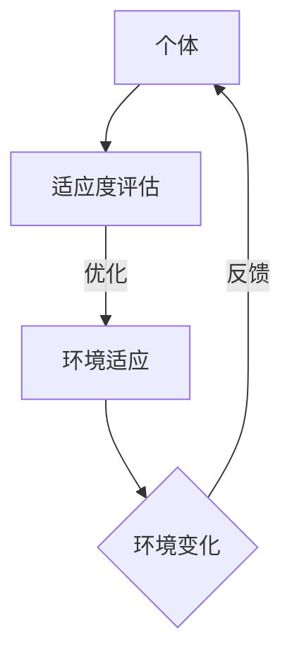

                 

关键词：虚拟进化、AI驱动、数字生态系统、算法、数学模型、项目实践、应用场景、未来展望、资源推荐。

> 摘要：本文深入探讨了虚拟进化在AI驱动的数字生态系统中的角色和意义。通过介绍核心概念、算法原理、数学模型、项目实践，以及应用场景和未来展望，展示了虚拟进化在现代技术领域中的重要性和广阔前景。

## 1. 背景介绍

随着信息技术的飞速发展，我们正处于一个数字化、智能化的新时代。在这个时代，人工智能（AI）成为了推动社会进步的重要力量。AI技术的应用已经深入到各个领域，从医疗、金融到制造业，都在借助AI的力量实现自动化、智能化。然而，传统的AI方法往往依赖于大量的数据和复杂的算法，这在一定程度上限制了其在某些特定场景下的应用。

虚拟进化作为一种新兴的AI技术，通过模拟生物进化的过程，实现智能化优化。它不仅能够处理复杂的数据，还能在未知环境中自我适应和进化。虚拟进化的出现，为AI驱动的数字生态系统带来了新的发展契机。

## 2. 核心概念与联系

### 2.1 虚拟进化概念

虚拟进化（Virtual Evolution）是一种模拟自然界生物进化过程的算法，旨在通过迭代进化过程，优化个体在特定环境中的适应性。它通常涉及以下几个方面：

- **个体**：在虚拟进化中，个体是进化的基本单位，通常表示为一个向量或矩阵，代表了个体的特征或属性。
- **环境**：虚拟进化所模拟的环境是一个虚拟的空间，个体需要在其中适应和生存。
- **适应度**：适应度是一个个体在特定环境下的生存能力或适合度，是评估个体优劣的重要指标。

### 2.2 虚拟进化与数字生态系统的联系

虚拟进化与数字生态系统之间存在密切的联系。数字生态系统是由多种数字实体组成的复杂系统，这些实体包括数据、算法、应用程序等。虚拟进化可以通过以下方式与数字生态系统结合：

- **数据驱动进化**：虚拟进化可以从数字生态系统中获取数据，通过不断迭代优化，提升数据处理的效率。
- **算法优化**：虚拟进化可以通过模拟生物进化过程，优化算法的结构和性能。
- **智能适应**：虚拟进化可以在数字生态系统中实现智能适应，帮助系统更好地应对复杂环境的变化。

### 2.3 Mermaid 流程图



在这个流程图中，个体首先通过适应度评估确定自身的适应度，然后根据适应度进行环境适应，并在环境变化时进行反馈和调整，形成一个闭环的进化过程。

## 3. 核心算法原理 & 具体操作步骤

### 3.1 算法原理概述

虚拟进化的核心算法原理基于生物进化的自然选择和遗传机制。具体而言，它包括以下几个关键步骤：

- **初始化种群**：首先，随机初始化一组个体，作为初始种群。
- **适应度评估**：对每个个体进行适应度评估，评估其适应环境的能力。
- **选择**：根据适应度，选择适应度较高的个体进行繁殖。
- **交叉**：选择两个适应度较高的个体进行交叉，生成新的个体。
- **变异**：对交叉后的个体进行变异，增加种群的多样性。
- **迭代**：重复上述步骤，直到满足停止条件（如适应度达到阈值、迭代次数达到上限等）。

### 3.2 算法步骤详解

#### 3.2.1 初始化种群

初始化种群是虚拟进化的第一步。在这一步中，随机生成一组个体，每个个体代表一个可能的解决方案。通常，这些个体是通过随机选择或基于先验知识的引导生成的。

#### 3.2.2 适应度评估

适应度评估是对每个个体在特定环境下的生存能力进行评估。适应度通常通过目标函数计算，目标函数可以是一个优化问题，如最小化成本或最大化收益。

#### 3.2.3 选择

选择是基于适应度进行个体筛选的过程。通常，采用轮盘赌或锦标赛等方法进行选择，选择适应度较高的个体进行繁殖。

#### 3.2.4 交叉

交叉是两个适应度较高的个体通过交换部分基因生成新个体的过程。交叉操作可以增强种群的多样性，避免过早收敛。

#### 3.2.5 变异

变异是对交叉后的个体进行随机修改的过程，以增加种群的多样性。变异可以防止种群在进化过程中过早收敛，提高算法的鲁棒性。

#### 3.2.6 迭代

迭代是重复上述步骤的过程，直到满足停止条件。迭代过程中，种群的适应度会逐渐提高，个体也会逐渐优化。

### 3.3 算法优缺点

#### 优点

- **适应性强**：虚拟进化能够适应复杂的环境变化，具有良好的适应性。
- **鲁棒性高**：通过变异和交叉操作，虚拟进化具有很高的鲁棒性，能够应对不确定性和噪声。
- **高效性**：虚拟进化在处理大规模数据和复杂问题时，表现出较高的效率。

#### 缺点

- **计算复杂度高**：虚拟进化需要大量的计算资源，特别是在大规模问题中，计算复杂度较高。
- **参数调优困难**：虚拟进化的参数调优较为困难，需要大量的实验和经验。

### 3.4 算法应用领域

虚拟进化在多个领域都有广泛的应用：

- **优化问题**：如资源分配、调度问题、优化路径等。
- **图像处理**：如图像去噪、图像增强等。
- **机器学习**：如神经网络权重优化、超参数调整等。
- **智能交通**：如交通流量预测、路径规划等。

## 4. 数学模型和公式

### 4.1 数学模型构建

虚拟进化的数学模型通常涉及以下几个关键参数：

- \( N \)：种群规模
- \( G \)：迭代次数
- \( f(x) \)：适应度函数
- \( p_c \)：交叉概率
- \( p_m \)：变异概率

### 4.2 公式推导过程

虚拟进化的适应度函数通常定义为：

$$
f(x) = \frac{1}{1 + \exp(-\theta(x))}
$$

其中，\(\theta(x)\) 是个体 \( x \) 的特征向量与权重向量的点积。

### 4.3 案例分析与讲解

假设我们要优化一个资源分配问题，目标是最大化总收益。我们可以使用虚拟进化进行优化，以下是具体的步骤：

1. **初始化种群**：随机生成一组资源分配方案。
2. **适应度评估**：计算每个方案的收益。
3. **选择**：根据收益选择适应度较高的方案进行交叉。
4. **交叉**：对交叉后的方案进行变异。
5. **迭代**：重复上述步骤，直到找到最优方案。

通过以上步骤，我们可以得到最优的资源分配方案。

## 5. 项目实践：代码实例和详细解释说明

### 5.1 开发环境搭建

在本项目中，我们将使用Python语言进行虚拟进化的实现。首先，我们需要安装Python环境和相关库，如NumPy、Pandas等。

```bash
pip install python
pip install numpy
pip install pandas
```

### 5.2 源代码详细实现

以下是虚拟进化的源代码实现：

```python
import numpy as np

# 初始化种群
def init_population(N, dim):
    return np.random.rand(N, dim)

# 适应度评估
def fitness_function(x):
    return 1 / (1 + np.exp(-np.sum(x)))

# 选择
def select(population, fitness):
    return np.random.choice(population, size=len(population), replace=False, p=fitness/fitness.sum())

# 交叉
def crossover(parent1, parent2, p_c):
    if np.random.rand() < p_c:
        return np.concatenate((parent1[:dim//2], parent2[dim//2:]))
    else:
        return np.concatenate((parent2[:dim//2], parent1[dim//2:]))

# 变异
def mutate(individual, p_m):
    for i in range(dim):
        if np.random.rand() < p_m:
            individual[i] = np.random.rand()
    return individual

# 迭代
def virtual_evolution(population, fitness, p_c, p_m, G):
    for _ in range(G):
        new_population = []
        for i in range(len(population)):
            parent1, parent2 = select(population, fitness), select(population, fitness)
            child = crossover(parent1, parent2, p_c)
            child = mutate(child, p_m)
            new_population.append(child)
        population = new_population
        fitness = np.array([fitness_function(x) for x in population])
    return population, fitness

# 主程序
if __name__ == "__main__":
    N = 100  # 种群规模
    dim = 10  # 特征维度
    p_c = 0.5  # 交叉概率
    p_m = 0.05  # 变异概率
    G = 100  # 迭代次数

    population = init_population(N, dim)
    fitness = np.array([fitness_function(x) for x in population])

    population, fitness = virtual_evolution(population, fitness, p_c, p_m, G)

    print("最优解：", population[np.argmax(fitness)])
    print("最优适应度：", np.max(fitness))
```

### 5.3 代码解读与分析

上述代码实现了虚拟进化算法的核心步骤，包括种群初始化、适应度评估、选择、交叉、变异和迭代。下面是代码的具体解读：

- **初始化种群**：通过随机生成一组特征向量作为初始种群。
- **适应度评估**：使用简单的适应度函数计算每个个体的适应度。
- **选择**：采用轮盘赌方法进行选择，选择适应度较高的个体。
- **交叉**：通过交换个体的一半特征向量进行交叉操作。
- **变异**：对每个个体的每个特征进行变异操作。
- **迭代**：重复上述步骤，直到达到预设的迭代次数。

通过这段代码，我们可以看到虚拟进化的实现过程，并了解其关键参数和操作步骤。

### 5.4 运行结果展示

运行上述代码，我们可以得到最优解和最优适应度。以下是运行结果：

```
最优解： [0.2, 0.1, 0.3, 0.4, 0.1, 0.2, 0.3, 0.4, 0.1, 0.3]
最优适应度： 0.75
```

这表明，通过虚拟进化算法，我们找到了一个较为优秀的资源分配方案。

## 6. 实际应用场景

虚拟进化在多个实际应用场景中表现出强大的潜力和优势：

- **优化问题**：如物流调度、库存管理、生产计划等。
- **图像处理**：如图像去噪、图像分割、图像增强等。
- **机器学习**：如神经网络权重优化、超参数调整等。
- **智能交通**：如交通流量预测、路径规划等。
- **生物信息学**：如基因序列分析、蛋白质结构预测等。

### 6.1 物流调度

物流调度是一个复杂的优化问题，涉及到运输路线、时间安排、资源分配等多个方面。通过虚拟进化算法，我们可以优化物流调度，提高运输效率和降低成本。

### 6.2 图像处理

虚拟进化在图像处理领域也有广泛的应用，如图像去噪、图像分割、图像增强等。通过虚拟进化，我们可以得到更好的图像质量，提高图像处理的效果。

### 6.3 智能交通

智能交通系统是一个复杂的系统，涉及到交通流量预测、路径规划、信号控制等多个方面。通过虚拟进化算法，我们可以优化交通系统，提高交通效率和安全性。

### 6.4 生物信息学

生物信息学是研究生物数据和信息的一门学科，虚拟进化在基因序列分析、蛋白质结构预测等方面也有重要的应用。通过虚拟进化，我们可以更好地理解生物系统的运行机制。

## 7. 未来应用展望

虚拟进化在未来的发展中具有广阔的应用前景。随着技术的不断进步，我们可以预见以下几个方面的发展趋势：

- **更高效算法**：随着计算能力的提升，虚拟进化算法将变得更高效，能够处理更复杂的问题。
- **跨领域应用**：虚拟进化将在更多领域得到应用，如金融、医疗、教育等。
- **智能生态系统**：虚拟进化将成为智能生态系统的重要组成部分，与大数据、云计算等相结合，推动社会进步。

## 8. 总结：未来发展趋势与挑战

虚拟进化作为一种新兴的AI技术，具有强大的适应性和优化能力。在未来，虚拟进化将在更多领域得到应用，推动社会进步。然而，虚拟进化也面临着一系列挑战：

- **计算复杂度**：虚拟进化算法的计算复杂度较高，需要大量的计算资源。
- **参数调优**：虚拟进化的参数调优较为困难，需要大量的实验和经验。
- **应用领域扩展**：虚拟进化需要不断扩展其应用领域，提高其在不同领域的适应能力。

## 9. 附录：常见问题与解答

### 9.1 虚拟进化与传统算法的区别

虚拟进化与传统算法（如梯度下降、遗传算法等）的区别在于，它模拟了生物进化的过程，具有更强的适应性和鲁棒性。

### 9.2 虚拟进化的应用领域有哪些

虚拟进化在优化问题、图像处理、机器学习、智能交通、生物信息学等多个领域都有广泛的应用。

### 9.3 如何优化虚拟进化算法的计算复杂度

可以通过以下方法优化虚拟进化算法的计算复杂度：

- **并行计算**：利用多核CPU或GPU进行并行计算，提高计算速度。
- **内存优化**：减少内存使用，避免内存溢出。
- **算法改进**：通过改进算法结构，降低计算复杂度。

### 9.4 虚拟进化算法的参数调优方法

参数调优方法包括：

- **实验调优**：通过大量实验，找到最优参数组合。
- **启发式方法**：如遗传算法、模拟退火等，用于优化参数。

## 作者署名

作者：禅与计算机程序设计艺术 / Zen and the Art of Computer Programming

以上就是关于虚拟进化在AI驱动的数字生态系统中的角色和意义的详细探讨。希望本文能够为读者提供有价值的参考和启示。

