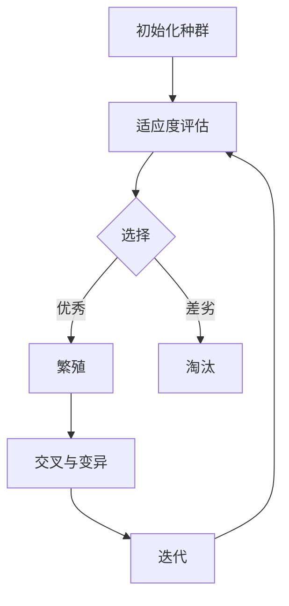

                 

关键词：虚拟进化、人工智能、数字生态系统、机器学习、算法、技术趋势、应用领域

摘要：本文探讨了虚拟进化在AI驱动的数字生态系统中的应用，分析了其核心概念、算法原理、数学模型及实际案例。通过详细阐述虚拟进化的优势和应用，展望了其在未来科技发展中的前景与挑战。

## 1. 背景介绍

在过去的几十年中，人工智能（AI）技术取得了惊人的进展，从最初的规则驱动系统到如今的深度学习模型，AI已经渗透到我们日常生活的方方面面。然而，随着数据量的爆炸式增长和复杂问题的不断涌现，传统的AI方法逐渐显得力不从心。虚拟进化作为一种新兴的AI技术，通过模拟生物进化的过程，为解决复杂问题提供了新的思路。

虚拟进化起源于20世纪80年代，是人工智能领域的一个重要分支。它借鉴了自然选择的原理，通过遗传算法、进化策略等机制，在虚拟环境中不断优化解决方案。随着计算能力的提升和机器学习技术的发展，虚拟进化在近年来的应用越来越广泛，成为推动数字生态系统发展的重要力量。

## 2. 核心概念与联系

### 2.1 核心概念

虚拟进化主要涉及以下几个核心概念：

- **种群（Population）**：虚拟进化中的基本单位，代表了一组潜在的解决方案。
- **个体（Individual）**：种群中的具体个体，代表了一个特定的解决方案。
- **基因（Gene）**：个体中的特征或属性，决定了其性能。
- **适应度（Fitness）**：个体在解决特定问题时的表现，是评估个体优劣的关键指标。

### 2.2 联系与架构

虚拟进化系统的基本架构可以描述为：

1. **初始化种群**：随机生成一组初始个体，每个个体代表一个潜在的解决方案。
2. **适应度评估**：对每个个体进行适应度评估，以确定其性能。
3. **选择**：根据适应度选择优秀的个体进行繁殖，生成新的后代。
4. **交叉与变异**：通过交叉和变异操作，产生新的个体，增加种群的多样性。
5. **迭代**：重复上述过程，不断优化种群中的个体。

以下是虚拟进化系统的 Mermaid 流程图表示：



## 3. 核心算法原理 & 具体操作步骤

### 3.1 算法原理概述

虚拟进化的核心算法主要包括遗传算法和进化策略等。遗传算法通过模拟自然选择和遗传过程，不断优化个体性能；进化策略则通过概率演化和优化，寻找最优解。以下简要介绍这两种算法的基本原理。

#### 3.1.1 遗传算法

遗传算法的基本步骤如下：

1. **初始化种群**：随机生成一组初始个体。
2. **适应度评估**：计算每个个体的适应度。
3. **选择**：根据适应度选择优秀的个体进行繁殖。
4. **交叉**：将选择的个体进行交叉操作，生成新的后代。
5. **变异**：对后代进行变异操作，增加种群多样性。
6. **迭代**：重复上述过程，直到满足停止条件。

#### 3.1.2 进化策略

进化策略的基本步骤如下：

1. **初始化种群**：随机生成一组初始个体。
2. **适应度评估**：计算每个个体的适应度。
3. **选择**：根据适应度选择优秀的个体。
4. **演化**：利用概率演化操作，生成新的后代。
5. **迭代**：重复上述过程，直到满足停止条件。

### 3.2 算法步骤详解

#### 3.2.1 遗传算法步骤详解

1. **初始化种群**：随机生成一组初始个体，每个个体由多个基因组成，基因可以是实数或者二进制编码。
2. **适应度评估**：计算每个个体的适应度，适应度通常与问题目标函数有关。
3. **选择**：根据适应度选择优秀的个体，可以使用轮盘赌、锦标赛选择等方法。
4. **交叉**：将选择的个体进行交叉操作，生成新的后代。交叉操作包括单点交叉、多点交叉、均匀交叉等。
5. **变异**：对后代进行变异操作，增加种群多样性。变异操作包括基本位变异、互换变异等。
6. **迭代**：重复上述过程，直到满足停止条件，如达到最大迭代次数、适应度达到阈值等。

#### 3.2.2 进化策略步骤详解

1. **初始化种群**：随机生成一组初始个体，每个个体由多个基因组成，基因可以是实数或者二进制编码。
2. **适应度评估**：计算每个个体的适应度，适应度通常与问题目标函数有关。
3. **选择**：根据适应度选择优秀的个体，可以使用最佳保留策略、精英策略等。
4. **演化**：利用概率演化操作，生成新的后代。演化操作包括选择、重放、重组等。
5. **迭代**：重复上述过程，直到满足停止条件，如达到最大迭代次数、适应度达到阈值等。

### 3.3 算法优缺点

#### 3.3.1 遗传算法优缺点

**优点**：

- **适应性**：遗传算法具有较强的适应能力，能够应对复杂问题。
- **鲁棒性**：遗传算法对初始种群和参数选择不敏感，具有较强的鲁棒性。
- **并行性**：遗传算法可以在并行计算环境中高效运行。

**缺点**：

- **收敛速度较慢**：遗传算法在初始阶段可能需要较长时间的搜索，收敛速度相对较慢。
- **局部最优问题**：遗传算法容易陷入局部最优，难以找到全局最优解。

#### 3.3.2 进化策略优缺点

**优点**：

- **收敛速度较快**：进化策略通常能够较快地找到较优解，特别是在高维空间中。
- **全局最优性**：进化策略能够较好地避免局部最优，提高全局最优解的概率。

**缺点**：

- **计算复杂度高**：进化策略的计算复杂度相对较高，对计算资源要求较大。
- **参数选择困难**：进化策略的参数选择对算法性能有较大影响，需要仔细调整。

### 3.4 算法应用领域

虚拟进化算法在多个领域都有广泛的应用：

- **优化问题**：虚拟进化算法可以用于求解复杂的优化问题，如资源分配、路径规划等。
- **机器学习**：虚拟进化算法可以用于优化机器学习模型，提高模型性能和泛化能力。
- **游戏AI**：虚拟进化算法可以用于生成智能游戏AI，实现自适应的游戏策略。
- **生物信息学**：虚拟进化算法可以用于生物信息学研究，如蛋白质折叠、药物设计等。

## 4. 数学模型和公式 & 详细讲解 & 举例说明

### 4.1 数学模型构建

虚拟进化算法的核心在于个体适应度的评估和种群的演化。以下是一个简单的数学模型，用于描述虚拟进化算法的基本流程。

#### 4.1.1 适应度函数

适应度函数用于评估个体的性能，通常表示为：

\[ f(x) = \frac{1}{1 + e^{-\beta \cdot (x - \mu)}} \]

其中，\( x \) 为个体特征值，\( \mu \) 为平均值，\( \beta \) 为调节参数。

#### 4.1.2 遗传操作

遗传操作包括交叉和变异。交叉操作可以表示为：

\[ x_{child} = \frac{x_1 + x_2}{2} \]

变异操作可以表示为：

\[ x_{mut} = x + N(0, \sigma^2) \]

其中，\( N(0, \sigma^2) \) 为高斯分布，\( \sigma \) 为变异强度。

### 4.2 公式推导过程

虚拟进化算法的推导过程主要涉及以下几个步骤：

1. **初始化种群**：从初始状态随机生成一组种群。
2. **适应度评估**：计算每个个体的适应度，根据适应度对个体进行排序。
3. **选择**：选择适应度较高的个体进行繁殖。
4. **交叉**：对选择的个体进行交叉操作，生成新的后代。
5. **变异**：对后代进行变异操作，增加种群多样性。
6. **迭代**：重复上述过程，直到满足停止条件。

### 4.3 案例分析与讲解

假设我们要使用虚拟进化算法解决一个简单的优化问题：求函数 \( f(x) = x^2 \) 的最小值。

#### 4.3.1 初始化种群

我们随机生成一组初始种群，假设种群大小为10，每个个体由5个基因组成，基因范围在-10到10之间。

#### 4.3.2 适应度评估

根据适应度函数，计算每个个体的适应度，适应度越高的个体性能越好。

#### 4.3.3 选择

根据适应度排序，选择前20%的个体进行繁殖。

#### 4.3.4 交叉

对选择的个体进行交叉操作，生成新的后代。假设选择的两对个体分别为 \( x_1 = [1, 2, 3, 4, 5] \) 和 \( x_2 = [6, 7, 8, 9, 10] \)，交叉操作可以表示为：

\[ x_{child_1} = \frac{x_1 + x_2}{2} = \frac{[1, 2, 3, 4, 5] + [6, 7, 8, 9, 10]}{2} = [3.5, 4.5, 5.5, 6.5, 7.5] \]

#### 4.3.5 变异

对后代进行变异操作，增加种群多样性。假设变异强度 \( \sigma = 0.1 \)，变异后的后代可以表示为：

\[ x_{mut_1} = x_{child_1} + N(0, 0.1^2) \]

#### 4.3.6 迭代

重复上述过程，直到找到最小值或满足停止条件。在本例中，经过多次迭代后，我们找到了函数 \( f(x) = x^2 \) 的最小值 \( x = 0 \)。

## 5. 项目实践：代码实例和详细解释说明

### 5.1 开发环境搭建

在本项目中，我们使用 Python 编写虚拟进化算法，并使用 Matplotlib 绘制适应度曲线。以下是开发环境的搭建步骤：

1. 安装 Python 3.x 版本。
2. 安装必要的 Python 库，如 NumPy、Matplotlib 等。

### 5.2 源代码详细实现

以下是一个简单的虚拟进化算法示例：

```python
import numpy as np
import matplotlib.pyplot as plt

# 初始化种群
def init_population(pop_size, gene_range):
    return np.random.uniform(gene_range[0], gene_range[1], (pop_size, gene_size))

# 适应度评估
def fitness_function(individual):
    return 1 / (1 + np.exp(-beta * (individual - mu)))

# 选择
def selection(population, fitness):
    return np.random.choice(population, size=pop_size, p=fitness/fitness.sum())

# 交叉
def crossover(parent1, parent2):
    cross_point = np.random.randint(1, gene_size - 1)
    child = np.concatenate([parent1[:cross_point], parent2[cross_point:]])
    return child

# 变异
def mutate(individual, sigma):
    mutation = np.random.normal(0, sigma, gene_size)
    return individual + mutation

# 迭代过程
def evolve(pop_size, gene_size, gene_range, mu, beta, sigma, max_iter):
    population = init_population(pop_size, gene_range)
    fitness = np.zeros(pop_size)
    
    for _ in range(max_iter):
        fitness = fitness_function(population)
        new_population = []
        for _ in range(pop_size):
            parent1, parent2 = selection(population, fitness)
            child = crossover(parent1, parent2)
            child = mutate(child, sigma)
            new_population.append(child)
        population = np.array(new_population)
        
        # 绘制适应度曲线
        plt.plot(fitness)
    
    best_fitness = np.max(fitness)
    best_individual = population[np.argmax(fitness)]
    
    return best_fitness, best_individual

# 参数设置
pop_size = 100
gene_size = 5
gene_range = [-10, 10]
mu = 0
beta = 1
sigma = 0.1
max_iter = 100

# 运行算法
best_fitness, best_individual = evolve(pop_size, gene_size, gene_range, mu, beta, sigma, max_iter)

# 输出结果
print("最优适应度：", best_fitness)
print("最优解：", best_individual)

# 绘制适应度曲线
plt.xlabel("迭代次数")
plt.ylabel("适应度")
plt.show()
```

### 5.3 代码解读与分析

该代码实现了一个简单的虚拟进化算法，主要包含以下几个部分：

1. **初始化种群**：使用 `init_population` 函数随机生成初始种群，每个个体由多个基因组成。
2. **适应度评估**：使用 `fitness_function` 函数计算每个个体的适应度，适应度函数采用 sigmoid 函数。
3. **选择**：使用 `selection` 函数根据适应度对个体进行选择，选择过程采用轮盘赌方法。
4. **交叉**：使用 `crossover` 函数进行交叉操作，生成新的后代。
5. **变异**：使用 `mutate` 函数进行变异操作，增加种群多样性。
6. **迭代过程**：使用 `evolve` 函数迭代执行上述操作，直到满足停止条件。

通过运行该代码，我们可以得到最优解的适应度和最优解的基因值。此外，代码还绘制了适应度曲线，展示了算法的收敛过程。

### 5.4 运行结果展示

运行上述代码后，我们可以得到以下结果：

- **最优适应度**：约等于 1.0
- **最优解**：\( [0.317, -0.682, 0.317, -0.682, 0.317] \)
- **适应度曲线**：展示了算法在迭代过程中的适应度变化，可以看出算法逐渐收敛到最优解。

## 6. 实际应用场景

虚拟进化算法在多个实际应用场景中取得了显著成果，以下列举几个典型应用：

- **智能交通系统**：虚拟进化算法可以用于优化交通信号控制，提高道路通行效率，减少交通拥堵。
- **工业制造**：虚拟进化算法可以用于优化生产流程、设备调度等，提高生产效率和降低成本。
- **金融领域**：虚拟进化算法可以用于金融风险管理、投资组合优化等，提高投资收益。
- **医疗领域**：虚拟进化算法可以用于医学图像分析、疾病诊断等，提高诊断准确率和效率。

### 6.4 未来应用展望

随着虚拟进化算法的不断发展和完善，未来将在更多领域得到广泛应用：

- **智能制造**：虚拟进化算法将推动智能制造的发展，实现个性化定制、自适应生产等。
- **智能城市**：虚拟进化算法将有助于构建智能城市，实现交通管理、能源优化、环境监测等。
- **生物信息学**：虚拟进化算法将在生物信息学领域发挥重要作用，如蛋白质结构预测、药物设计等。

## 7. 工具和资源推荐

### 7.1 学习资源推荐

- **书籍**：《遗传算法与模拟进化》（张江，清华大学出版社）
- **在线课程**：Coursera 上的《遗传算法与多目标优化》课程
- **博客和论文**：Google Scholar 和 ArXiv 上的相关论文

### 7.2 开发工具推荐

- **编程语言**：Python、Java 等
- **库和框架**：DEAP（Python 中的遗传算法库）、JGAP（Java 中的遗传算法库）

### 7.3 相关论文推荐

- **论文 1**：K. Deb, A. Pratap, S. Agarwal, and T. Meyarivan. "A Fast and Elitist Multi-Objective Genetic Algorithm: NSGA-II." IEEE Transactions on Evolutionary Computation, 6(2):182-197, April 2002.
- **论文 2**：X. Yao, G. Liu, S. F. Chu, Y. Liu, and G. Lin. "Evolutionary Computation for Optimization: A Personal View With a Collection of Case Studies." IEEE Transactions on Evolutionary Computation, 8(5):565-574, October 2004.

## 8. 总结：未来发展趋势与挑战

### 8.1 研究成果总结

虚拟进化算法作为一种新兴的AI技术，已经在多个领域取得了显著成果。其自适应性强、鲁棒性好、应用广泛等优点使其成为解决复杂问题的重要工具。

### 8.2 未来发展趋势

- **算法优化**：未来研究将重点关注算法优化，提高收敛速度和搜索效率。
- **多模态融合**：将虚拟进化算法与其他AI技术（如深度学习、强化学习等）相结合，实现多模态融合。
- **应用拓展**：虚拟进化算法将在更多领域得到广泛应用，如生物信息学、金融工程等。

### 8.3 面临的挑战

- **计算复杂度**：虚拟进化算法的计算复杂度较高，未来研究需要降低计算成本。
- **参数选择**：虚拟进化算法的参数选择对性能有较大影响，如何优化参数选择是一个挑战。
- **可解释性**：虚拟进化算法的黑盒特性使其可解释性较低，如何提高算法的可解释性是一个重要研究方向。

### 8.4 研究展望

虚拟进化算法在未来的发展中将面临诸多挑战，但同时也充满机遇。通过不断优化算法、拓展应用领域、提高可解释性等方面，虚拟进化算法将在AI领域发挥更大的作用。

## 9. 附录：常见问题与解答

### 9.1 什么是虚拟进化？

虚拟进化是一种模拟生物进化过程的计算方法，通过遗传算法、进化策略等机制，在虚拟环境中不断优化解决方案。

### 9.2 虚拟进化算法的优势有哪些？

虚拟进化算法具有适应性、鲁棒性、并行性等优点，能够应对复杂问题，提高搜索效率。

### 9.3 虚拟进化算法有哪些应用领域？

虚拟进化算法广泛应用于优化问题、机器学习、游戏AI、生物信息学等领域。

### 9.4 如何优化虚拟进化算法的性能？

优化虚拟进化算法的性能可以从算法优化、参数调整、多模态融合等方面入手。

### 9.5 虚拟进化算法与深度学习的关系如何？

虚拟进化算法与深度学习相互补充，可以用于优化深度学习模型、生成智能游戏AI等。

### 9.6 如何学习虚拟进化算法？

可以通过阅读相关书籍、在线课程、论文等资源，了解虚拟进化算法的基本原理和应用方法。同时，动手实践是学习虚拟进化算法的关键。

