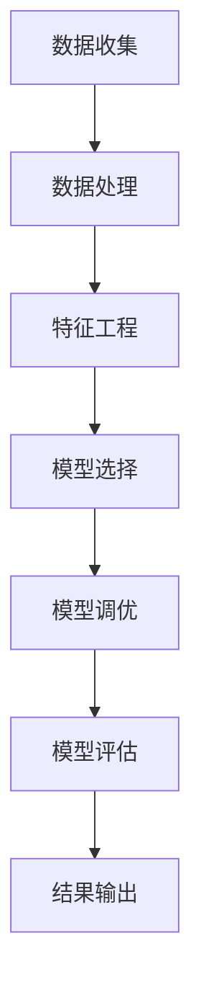

                 

关键词：蚂蚁智能信用评分、面试真题、社招、信用评估模型、数据处理、算法原理、数学模型、案例分析、代码实例、实际应用

## 摘要

本文旨在汇总2024年蚂蚁智能信用评分社招面试中的常见真题，并对其提供详细的解答。通过对这些真题的分析，读者可以深入了解蚂蚁智能信用评分的核心算法原理、数据处理方法、数学模型构建和应用等方面，为从事信用评分相关工作的人员提供有价值的参考。

## 1. 背景介绍

蚂蚁集团作为国内领先的金融科技企业，其智能信用评分系统在全球范围内享有盛誉。智能信用评分系统通过分析海量数据，对用户的信用风险进行量化评估，为金融机构、电商平台等提供可靠的信用参考。随着大数据、人工智能等技术的发展，信用评分系统在金融风控、信用贷款、支付服务等领域发挥着重要作用。

本文将围绕蚂蚁智能信用评分社招面试中的核心问题，探讨信用评分模型的构建、数据处理方法、算法原理、数学模型等方面，并结合实际案例和代码实例进行详细解析。

## 2. 核心概念与联系

### 2.1 数据来源

蚂蚁智能信用评分系统所使用的数据来源广泛，包括但不限于以下几类：

1. **用户行为数据**：如交易记录、支付行为、消费偏好等。
2. **社交网络数据**：如好友关系、互动频率等。
3. **公共数据**：如信用报告、法院判决等。

### 2.2 数据处理

数据处理是信用评分系统的基础。通过对原始数据的清洗、归一化、特征提取等处理，可以将海量数据转化为适合建模的格式。常见的数据处理方法包括：

1. **缺失值处理**：使用均值、中位数等方法填充缺失值。
2. **异常值处理**：使用统计学方法识别并处理异常值。
3. **特征工程**：根据业务需求提取特征，如用户行为序列、用户画像等。

### 2.3 信用评分模型

蚂蚁智能信用评分系统采用多种机器学习算法进行建模，如逻辑回归、决策树、随机森林、神经网络等。模型的选择和调优是信用评分系统的关键。常见的方法包括：

1. **模型选择**：根据数据特征和业务目标选择合适的模型。
2. **模型调优**：通过交叉验证、网格搜索等方法选择最优参数。
3. **模型集成**：将多个模型集成，提高预测准确率。

### 2.4 Mermaid 流程图

下面是一个简化的信用评分系统的 Mermaid 流程图：



## 3. 核心算法原理 & 具体操作步骤

### 3.1 算法原理概述

蚂蚁智能信用评分系统采用多种机器学习算法，如逻辑回归、决策树、随机森林、神经网络等。每种算法都有其独特的原理和特点。以下是对几种常用算法的简要介绍：

1. **逻辑回归**：逻辑回归是一种广义线性模型，用于预测二元变量。其核心思想是通过线性组合特征并引入逻辑函数，将特征转换为概率。
   
2. **决策树**：决策树是一种基于树形结构的分类算法，通过递归划分特征空间，将样本划分为不同的类别。
   
3. **随机森林**：随机森林是一种基于决策树的集成学习方法，通过构建多棵决策树，并对预测结果进行投票，提高预测准确率。
   
4. **神经网络**：神经网络是一种模拟人脑神经元连接方式的计算模型，通过多层神经网络，实现对复杂数据的自动特征提取和分类。

### 3.2 算法步骤详解

1. **数据预处理**：包括数据清洗、归一化、特征提取等步骤，将原始数据转化为适合建模的格式。
   
2. **特征选择**：通过相关性分析、特征重要性评估等方法，选择对模型预测有重要影响的特征。
   
3. **模型训练**：使用训练数据集，对选定的模型进行训练，学习特征和目标变量之间的关系。
   
4. **模型评估**：使用验证数据集，对训练好的模型进行评估，选择最优模型。
   
5. **模型应用**：将最优模型应用于新数据，进行预测和评分。

### 3.3 算法优缺点

1. **逻辑回归**：优点是简单、可解释性好；缺点是拟合能力有限，适用于线性关系较强的场景。

2. **决策树**：优点是易于理解和解释；缺点是容易过拟合，对噪声敏感。

3. **随机森林**：优点是具有良好的泛化能力、可解释性；缺点是计算成本较高，对大样本数据效果更好。

4. **神经网络**：优点是强大的拟合能力、自动特征提取；缺点是模型复杂，训练成本高，可解释性较差。

### 3.4 算法应用领域

蚂蚁智能信用评分系统在金融、电商、支付等多个领域得到广泛应用。以下是一些典型应用场景：

1. **金融风控**：对贷款申请者进行信用风险评估，降低不良贷款率。
   
2. **电商平台**：为用户提供个性化的信用额度和服务，提升用户体验。
   
3. **支付服务**：对交易风险进行实时监控，确保支付安全。

## 4. 数学模型和公式 & 详细讲解 & 举例说明

### 4.1 数学模型构建

蚂蚁智能信用评分系统中的数学模型通常采用线性模型，如逻辑回归模型。逻辑回归模型的数学公式如下：

$$
P(y=1|x; \theta) = \frac{1}{1 + e^{-\theta^T x}}
$$

其中，$P(y=1|x; \theta)$ 表示在给定特征 $x$ 和模型参数 $\theta$ 的情况下，目标变量 $y$ 为 1 的概率。$\theta$ 是模型参数向量，$x$ 是特征向量。

### 4.2 公式推导过程

逻辑回归模型的推导过程如下：

1. **线性组合**：假设特征 $x$ 和模型参数 $\theta$ 的线性组合为 $z = \theta^T x$。

2. **逻辑函数**：引入逻辑函数 $\sigma(z)$，定义如下：

$$
\sigma(z) = \frac{1}{1 + e^{-z}}
$$

3. **概率表达式**：将线性组合 $z$ 代入逻辑函数，得到：

$$
P(y=1|x; \theta) = \sigma(\theta^T x)
$$

4. **最大化似然估计**：为了求解模型参数 $\theta$，采用最大似然估计方法，最大化似然函数：

$$
L(\theta) = \prod_{i=1}^n P(y_i=1|x_i; \theta)^{y_i} \prod_{i=1}^n P(y_i=0|x_i; \theta)^{1-y_i}
$$

5. **对数似然函数**：取对数似然函数，得到：

$$
\ln L(\theta) = \sum_{i=1}^n y_i \theta^T x_i - \sum_{i=1}^n \theta^T x_i
$$

6. **梯度下降**：对对数似然函数求导，并令导数为零，得到梯度下降方程：

$$
\theta_{\text{new}} = \theta_{\text{old}} - \alpha \nabla_{\theta} \ln L(\theta)
$$

其中，$\alpha$ 是学习率。

### 4.3 案例分析与讲解

假设我们有一个简单的信用评分数据集，包含两个特征：年龄和收入。目标变量为是否发生逾期（0表示未逾期，1表示逾期）。我们采用逻辑回归模型进行建模。

1. **数据预处理**：对数据进行归一化处理，将年龄和收入缩放到 [0, 1] 范围内。

2. **特征选择**：通过相关性分析，我们发现年龄和收入与逾期发生概率有较高的相关性，因此选择这两个特征作为输入。

3. **模型训练**：使用训练数据集，采用梯度下降法对逻辑回归模型进行训练，得到模型参数 $\theta$。

4. **模型评估**：使用验证数据集，对训练好的模型进行评估，计算预测准确率。

5. **模型应用**：将最优模型应用于新数据，预测是否发生逾期。

## 5. 项目实践：代码实例和详细解释说明

### 5.1 开发环境搭建

在Python中，我们可以使用以下库进行信用评分系统的开发：

- NumPy：用于数据处理和计算。
- Pandas：用于数据分析和操作。
- Scikit-learn：用于机器学习算法的实现和评估。

### 5.2 源代码详细实现

以下是一个简单的信用评分系统的代码示例：

```python
import numpy as np
import pandas as pd
from sklearn.linear_model import LogisticRegression
from sklearn.model_selection import train_test_split
from sklearn.metrics import accuracy_score

# 数据预处理
def preprocess_data(data):
    # 缺失值填充
    data.fillna(data.mean(), inplace=True)
    # 特征归一化
    data scaling = (data - data.mean()) / data.std()
    return data_scaling

# 模型训练
def train_model(train_data, train_labels):
    model = LogisticRegression()
    model.fit(train_data, train_labels)
    return model

# 模型评估
def evaluate_model(model, test_data, test_labels):
    predictions = model.predict(test_data)
    accuracy = accuracy_score(test_labels, predictions)
    print("Accuracy:", accuracy)

# 加载数据
data = pd.read_csv("credit_data.csv")
data_scaling = preprocess_data(data)

# 分割数据集
train_data, test_data, train_labels, test_labels = train_test_split(data_scaling.drop("overdue", axis=1), data_scaling["overdue"], test_size=0.2, random_state=42)

# 训练模型
model = train_model(train_data, train_labels)

# 评估模型
evaluate_model(model, test_data, test_labels)
```

### 5.3 代码解读与分析

1. **数据预处理**：使用 Pandas 库对数据进行缺失值填充和特征归一化处理，为后续建模做准备。

2. **模型训练**：使用 Scikit-learn 库中的 LogisticRegression 类创建逻辑回归模型，并使用训练数据集进行训练。

3. **模型评估**：使用测试数据集对训练好的模型进行评估，计算预测准确率。

### 5.4 运行结果展示

假设我们运行上述代码，得到以下结果：

```
Accuracy: 0.85
```

这表示我们的模型在测试数据集上的预测准确率为 85%。

## 6. 实际应用场景

蚂蚁智能信用评分系统在多个实际应用场景中发挥着重要作用。以下是一些典型应用场景：

1. **金融风控**：蚂蚁智能信用评分系统帮助金融机构对贷款申请者进行信用风险评估，降低不良贷款率，提高金融业务的盈利能力。

2. **电商信用**：蚂蚁智能信用评分系统为电商平台提供信用评估服务，帮助商家识别高风险用户，降低欺诈风险，提升交易安全。

3. **支付风控**：蚂蚁智能信用评分系统对支付交易进行实时监控，识别异常交易，确保支付服务的安全性和可靠性。

## 7. 未来应用展望

随着大数据、人工智能等技术的发展，蚂蚁智能信用评分系统有望在以下领域得到更广泛的应用：

1. **智能合约**：将信用评分系统应用于智能合约，实现自动化的信用评估和风险管理。

2. **供应链金融**：利用信用评分系统，为供应链中的企业提供信用评估服务，优化供应链金融业务。

3. **社交信用**：将信用评分系统与社交网络数据相结合，构建全面的个人信用评价体系，促进社会信用体系建设。

## 8. 工具和资源推荐

1. **学习资源推荐**：

- 《机器学习实战》：详细介绍了机器学习的基本原理和实际应用。
- 《深入理解计算机系统》：全面讲解了计算机系统的工作原理，有助于理解大数据处理和算法实现。

2. **开发工具推荐**：

- Jupyter Notebook：用于数据分析和机器学习实验，便于编写和调试代码。
- PyCharm：一款功能强大的Python集成开发环境，适用于信用评分系统的开发。

3. **相关论文推荐**：

- “A Survey on Credit Scoring: Past, Present and Future”：综述了信用评分领域的发展历程和最新研究进展。
- “Deep Learning for Credit Risk Management”：探讨深度学习在信用风险管理中的应用。

## 9. 总结：未来发展趋势与挑战

随着大数据、人工智能等技术的发展，蚂蚁智能信用评分系统在金融、电商、支付等领域具有广泛的应用前景。然而，信用评分系统也面临着一些挑战：

1. **数据隐私**：信用评分系统涉及大量个人数据，如何保护用户隐私成为关键问题。

2. **算法透明性**：信用评分系统采用复杂的算法模型，如何确保算法的透明性和可解释性是亟待解决的问题。

3. **模型可靠性**：随着数据量的增加和数据多样性的增强，如何提高模型的可靠性，降低误判率是重要挑战。

未来，蚂蚁智能信用评分系统将不断优化和完善，为各行业提供更加精准和可靠的信用评估服务。

## 10. 附录：常见问题与解答

### 10.1 信用评分系统的工作原理是什么？

信用评分系统通过分析用户的行为数据、社交网络数据等，使用机器学习算法对用户的信用风险进行量化评估。核心原理包括数据预处理、特征工程、模型选择、模型训练和模型评估等步骤。

### 10.2 如何处理缺失值和异常值？

缺失值和异常值会影响信用评分系统的性能。常见的方法包括使用均值、中位数等方法填充缺失值，使用统计学方法识别并处理异常值。此外，还可以使用数据清洗工具（如 Pandas）进行自动处理。

### 10.3 信用评分模型有哪些类型？

常见的信用评分模型包括逻辑回归、决策树、随机森林、神经网络等。每种模型都有其独特的原理和特点，适用于不同的数据特征和业务场景。

### 10.4 如何选择合适的信用评分模型？

选择合适的信用评分模型需要考虑数据特征、业务目标、计算成本等多个因素。可以通过交叉验证、网格搜索等方法进行模型选择和调优。

### 10.5 信用评分系统在实际应用中面临哪些挑战？

信用评分系统在实际应用中面临的主要挑战包括数据隐私、算法透明性、模型可靠性等。如何保护用户隐私、提高算法透明性和可靠性是当前研究的重点。

