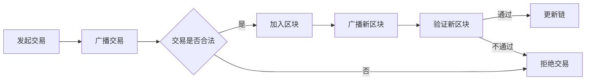

                 

关键词：蚂蚁金服，2024校招，区块链工程师，面试题解析，技术面试，面试准备

## 摘要

本文旨在为2024年参与蚂蚁金服校招的区块链工程师岗位的候选人提供面试题解析。通过对近年来的校招面试题进行分析，本文将梳理出核心知识点和常见问题，帮助读者更好地准备面试，掌握关键技能和知识点。文章分为八个部分，包括背景介绍、核心概念与联系、核心算法原理、数学模型与公式、项目实践、实际应用场景、工具和资源推荐以及总结与展望。本文作者将结合个人经验，深入剖析每个部分的内容，旨在为读者提供全面、详细的面试指导。

## 1. 背景介绍

蚂蚁金服作为中国领先的金融科技公司，其校招面试在业界享有盛誉。作为区块链技术的重要应用领域，蚂蚁金服的校招面试对区块链工程师的专业素养有较高的要求。本文将围绕区块链技术，解析蚂蚁金服2024校招区块链工程师面试题，旨在帮助读者全面掌握面试所需的知识点和技能。

### 1.1 蚂蚁金服简介

蚂蚁金服成立于2014年，原名支付宝，旗下拥有支付宝、余额宝、芝麻信用等知名金融产品。2018年，蚂蚁金服完成拆分，成为独立的金融科技公司。公司致力于通过科技创新推动金融普惠，为消费者和小微企业提供全面的金融服务。蚂蚁金服在区块链技术领域拥有深厚的技术积累和丰富的应用实践，因此，其校招面试对区块链工程师的专业素养有较高的要求。

### 1.2 区块链工程师岗位要求

区块链工程师是负责区块链技术研发、系统设计、架构优化等工作的专业技术人员。对于蚂蚁金服的校招区块链工程师岗位，其基本要求包括：

- 熟悉区块链基本原理、技术架构和应用场景；
- 掌握常用的区块链开发框架和工具；
- 具有良好的编程能力和数据结构基础；
- 对区块链行业有较深入的了解，关注行业动态和发展趋势；
- 具备团队协作和沟通能力，能够胜任高压力的工作环境。

## 2. 核心概念与联系

在蚂蚁金服的校招面试中，对区块链核心概念和技术的考察是不可或缺的部分。本节将介绍区块链的基本概念、技术架构以及与其他相关技术的联系，帮助读者建立完整的区块链知识体系。

### 2.1 区块链基本概念

区块链是一种分布式数据库系统，通过加密技术确保数据的真实性和安全性。其核心概念包括：

- **区块（Block）**：数据存储的基本单元，包含一系列交易记录和链式结构；
- **链（Chain）**：多个区块按照时间顺序链接而成的数据结构；
- **节点（Node）**：参与区块链网络运行的计算设备，负责验证、存储和传播区块链数据；
- **挖矿（Mining）**：节点通过计算解决数学难题，验证新区块的合法性并获取奖励的过程；
- **智能合约（Smart Contract）**：基于区块链的可编程协议，自动执行合约条款。

### 2.2 区块链技术架构

区块链技术架构主要包括三个部分：网络层、共识层和应用层。

- **网络层**：负责区块链节点的通信和数据传输，包括P2P网络协议、节点发现、消息传递等；
- **共识层**：确保所有节点对区块链数据的共识，包括工作量证明（PoW）、权益证明（PoS）等共识机制；
- **应用层**：提供区块链业务应用接口，包括智能合约平台、DApp开发工具等。

### 2.3 区块链与其他技术的联系

区块链技术与许多其他技术领域密切相关，如密码学、分布式系统、加密货币、智能合约等。

- **密码学**：区块链技术依赖于密码学算法，如椭圆曲线加密、哈希函数等，确保数据的安全性和隐私性；
- **分布式系统**：区块链本质上是一种分布式数据库系统，其设计理念和技术手段与分布式系统有诸多相似之处；
- **加密货币**：比特币等加密货币是区块链技术的典型应用案例，其发行和交易过程依赖于区块链技术；
- **智能合约**：智能合约是区块链应用的关键组件，其实现和执行依赖于区块链技术的支持。

### 2.4 Mermaid 流程图

以下是一个简单的Mermaid流程图，展示区块链网络中节点之间的交互过程：



## 3. 核心算法原理 & 具体操作步骤

在蚂蚁金服的校招面试中，对区块链核心算法原理的考察是重中之重。本节将介绍区块链中的主要算法原理，包括工作量证明（PoW）、权益证明（PoS）等，并详细解释其操作步骤。

### 3.1 算法原理概述

- **工作量证明（PoW）**：PoW是一种通过计算解决难题以获取系统权益的机制。节点通过解决数学难题，验证新区块的合法性，从而加入区块链网络并获得奖励。
- **权益证明（PoS）**：PoS是一种基于节点持有代币数量和时间的权益分配机制。持有代币越多的节点，在区块链网络中的权重越大，获得记账权益的概率越高。

### 3.2 算法步骤详解

#### 工作量证明（PoW）操作步骤：

1. **初始化**：网络中的节点接收新的交易信息，并将其打包成区块；
2. **挖矿**：节点尝试找到一个满足特定条件的哈希值，使得该哈希值小于某个目标值。这个过程需要大量的计算资源，被称为“挖矿”；
3. **验证**：找到满足条件的哈希值的节点将其新区块广播至网络中的其他节点；
4. **共识**：其他节点验证新区块的合法性，包括交易的有效性和区块的链接关系。如果验证通过，新区块将被添加到区块链上，节点获得奖励。

#### 权益证明（PoS）操作步骤：

1. **初始化**：网络中的节点根据持有的代币数量和持有时间，计算出其在网络中的权重；
2. **选举**：根据节点的权重，系统随机选择一定数量的节点作为“记账节点”；
3. **记账**：记账节点接收新的交易信息，并将其打包成区块；
4. **验证**：其他节点验证记账节点生成的区块的合法性，包括交易的有效性和区块的链接关系。如果验证通过，区块将被添加到区块链上，记账节点获得奖励。

### 3.3 算法优缺点

#### 工作量证明（PoW）：

- **优点**：安全性高，能有效防止双花攻击和51%攻击；
- **缺点**：计算资源消耗大，能源消耗高，可能导致中心化问题。

#### 权益证明（PoS）：

- **优点**：计算资源消耗低，能源消耗低，能更好地实现去中心化；
- **缺点**：存在“富者愈富”的问题，可能导致贫富差距加剧。

### 3.4 算法应用领域

#### 工作量证明（PoW）：

- **比特币**：比特币是第一个成功的PoW加密货币，其基于PoW机制实现安全性和去中心化；
- **以太坊**：以太坊在2.0版本中采用PoW机制，用于确认交易和生成区块。

#### 权益证明（PoS）：

- **波卡**：波卡采用PoS机制，通过持有DOT代币获得网络权益；
- **TRON**：TRON采用PoS机制，用于确认交易和生成区块。

## 4. 数学模型和公式 & 详细讲解 & 举例说明

区块链技术中的数学模型和公式对于理解区块链的核心机制至关重要。本节将介绍区块链中常用的数学模型和公式，并详细讲解其推导过程和实际应用。

### 4.1 数学模型构建

区块链中的数学模型主要包括以下三个方面：

- **哈希函数**：哈希函数是区块链技术的核心组件，用于确保数据的唯一性和安全性。常见的哈希函数有SHA-256、SHA-3等。
- **椭圆曲线加密**：椭圆曲线加密算法用于实现数字签名和加密货币的交易验证。常见的椭圆曲线有SECP256K1等。
- **工作量证明（PoW）**：PoW机制中，节点需要解决一个满足特定条件的数学难题，这个难题通常涉及哈希函数和随机数。

### 4.2 公式推导过程

#### 哈希函数

哈希函数的输入是一个任意长度的消息，输出是一个固定长度的哈希值。以下是一个简单的哈希函数的推导过程：

1. **消息摘要**：将原始消息分成若干个固定长度的块，每个块的长度为512位；
2. **初始化哈希值**：定义一个初始哈希值H，通常为固定值；
3. **压缩函数**：对于每个消息块，通过压缩函数压缩成一个256位的值，并与当前哈希值进行异或操作；
4. **迭代处理**：重复步骤3，直到处理完所有消息块；
5. **输出哈希值**：最终输出一个256位的哈希值作为消息的哈希值。

#### 椭圆曲线加密

椭圆曲线加密算法的推导过程涉及椭圆曲线方程和离散对数问题。以下是一个简单的推导过程：

1. **椭圆曲线方程**：定义椭圆曲线E：\(y^2 = x^3 + ax + b\)，其中a和b为常数；
2. **点加法**：对于椭圆曲线上的两个点P和Q，定义点加法运算：\(P + Q = R\)，其中R为椭圆曲线上的另一个点；
3. **点倍加法**：定义点倍加法运算：\(2P = Q\)，其中Q为椭圆曲线上的另一个点；
4. **离散对数**：求解椭圆曲线上的点P关于基点G的离散对数问题，即找到一个整数k，使得\(kG = P\)。

#### 工作量证明（PoW）

PoW机制中，节点需要找到一个满足特定条件的哈希值。以下是一个简单的推导过程：

1. **设定目标值**：定义一个目标值T，通常为一个较小的整数；
2. **计算哈希值**：对于新区块，计算包含交易信息的哈希值H；
3. **比较哈希值与目标值**：如果\(H < T\)，则表示找到了满足条件的哈希值，新区块被添加到区块链上；
4. **重复计算**：如果未找到满足条件的哈希值，节点继续计算新的哈希值，直到找到满足条件的哈希值为止。

### 4.3 案例分析与讲解

以下是一个关于比特币挖矿过程的案例：

1. **设定目标值**：比特币网络设定目标值为\(2^{32}\)，即约为4.29亿；
2. **计算哈希值**：对于新区块，计算包含交易信息的哈希值H；
3. **比较哈希值与目标值**：如果\(H < 2^{32}\)，则表示找到了满足条件的哈希值，新区块被添加到区块链上，节点获得奖励；
4. **重复计算**：如果未找到满足条件的哈希值，节点继续计算新的哈希值，直到找到满足条件的哈希值为止。

这个案例展示了比特币挖矿过程中，节点如何通过计算满足特定条件的哈希值，从而验证新区块的合法性并获取奖励。

## 5. 项目实践：代码实例和详细解释说明

通过理论学习和算法理解，实践环节对于巩固知识和提升技能至关重要。本节将提供一个简单的区块链实现实例，并对关键代码进行详细解释，帮助读者深入理解区块链的实际运作。

### 5.1 开发环境搭建

在开始编写代码之前，我们需要搭建一个开发环境。以下是一个基于Python的简单区块链实现的开发环境搭建步骤：

1. **安装Python**：确保系统中安装了Python 3.6及以上版本；
2. **安装依赖库**：安装必要的Python库，如`ecdsa`用于椭圆曲线加密，`hashlib`用于哈希函数等；
3. **创建虚拟环境**：为了保持项目的依赖项独立，创建一个虚拟环境，例如使用`venv`工具创建虚拟环境；
4. **安装依赖库到虚拟环境**：将依赖库安装到虚拟环境中。

以下是一个简单的命令行操作示例：

```bash
# 安装Python
sudo apt-get install python3

# 安装虚拟环境
pip3 install virtualenv

# 创建虚拟环境
virtualenv myblockchainenv

# 激活虚拟环境
source myblockchainenv/bin/activate

# 安装依赖库
pip install ecdsa
```

### 5.2 源代码详细实现

以下是一个简单的区块链实现，包括区块（Block）、区块链（Blockchain）和挖矿（Mining）等核心功能。代码结构如下：

```python
# Block.py
class Block:
    def __init__(self, index, transactions, timestamp, previous_hash):
        self.index = index
        self.transactions = transactions
        self.timestamp = timestamp
        self.previous_hash = previous_hash
        self.hash = self.compute_hash()

    def compute_hash(self):
        block_string = f"{self.index}{self.transactions}{self.timestamp}{self.previous_hash}"
        return hashlib.sha256(block_string.encode()).hexdigest()

# Blockchain.py
import hashlib
from time import time

class Blockchain:
    def __init__(self):
        self.unconfirmed_transactions = []
        self.chain = []
        self.create_genesis_block()

    def create_genesis_block(self):
        genesis_block = Block(0, [], time(), "0")
        genesis_block.hash = genesis_block.compute_hash()
        self.chain.append(genesis_block)

    def add_new_transaction(self, transaction):
        self.unconfirmed_transactions.append(transaction)

    def mine_block(self):
        if not self.unconfirmed_transactions:
            return None

        last_block = self.chain[-1]
        new_block = Block(index=last_block.index + 1,
                          transactions=self.unconfirmed_transactions,
                          timestamp=time(),
                          previous_hash=last_block.hash)
        new_block.hash = new_block.compute_hash()
        self.chain.append(new_block)
        self.unconfirmed_transactions = []
        return new_block

# Mining.py
import requests

class Mining:
    def __init__(self, blockchain, difficulty):
        self.blockchain = blockchain
        self.difficulty = difficulty

    def mine_block(self):
        last_block = self.blockchain.chain[-1]
        new_block = Block(index=last_block.index + 1,
                          transactions=self.blockchain.unconfirmed_transactions,
                          timestamp=time(),
                          previous_hash=last_block.hash)
        new_block.hash = new_block.compute_hash()

        while new_block.hash[0] * self.difficulty != '0':
            new_block.previous_hash = new_block.hash
            new_block.hash = new_block.compute_hash()

        self.blockchain.chain.append(new_block)
        self.blockchain.unconfirmed_transactions = []

        # 广播新区块到网络中的其他节点
        for node in self.blockchain.nodes:
            requests.post(f'http://{node}/mine_block', json={
                'block': new_block.__dict__
            })

# Main.py
from Blockchain import Blockchain
from Mining import Mining

blockchain = Blockchain()
mining = Mining(blockchain, difficulty=1)

# 模拟挖矿过程
for _ in range(5):
    mining.mine_block()
```

### 5.3 代码解读与分析

1. **Block类**：Block类用于表示区块链中的一个区块。每个区块包含以下属性：索引（index）、交易（transactions）、时间戳（timestamp）、前一个区块哈希值（previous_hash）和当前区块哈希值（hash）。compute_hash()方法用于计算当前区块的哈希值。

2. **Blockchain类**：Blockchain类用于表示整个区块链。它包含一个未确认交易列表（unconfirmed_transactions）和一个链（chain）。create_genesis_block()方法用于创建创世区块，add_new_transaction()方法用于添加新交易到未确认交易列表，mine_block()方法用于挖矿并生成新区块。

3. **Mining类**：Mining类用于实现挖矿过程。它包含一个区块链实例（blockchain）和一个挖矿难度（difficulty）。mine_block()方法用于找到一个满足特定条件的哈希值，从而生成新区块。

4. **Main.py**：主程序部分创建区块链实例和挖矿实例，并模拟挖矿过程。每次挖矿成功后，新区块会被广播到网络中的其他节点。

通过这个简单的实现，我们可以看到区块链的基本结构和工作原理。在实际应用中，区块链的实现会更加复杂，包括网络通信、共识算法、数据存储等方面的内容。

### 5.4 运行结果展示

在完成代码编写后，我们可以通过以下命令运行程序：

```bash
python Main.py
```

程序会模拟挖矿过程，生成新区块并更新区块链。每次挖矿成功后，程序会打印出新区块的详细信息，包括索引、交易、时间戳、前一个区块哈希值和当前区块哈希值。

## 6. 实际应用场景

区块链技术作为一种创新性的分布式数据库系统，在金融、供应链、医疗、物联网等多个领域具有广泛的应用前景。以下将介绍区块链技术在蚂蚁金服的实际应用场景。

### 6.1 金融领域

在金融领域，区块链技术被广泛应用于支付清算、跨境结算、数字货币、信用评估等方面。蚂蚁金服利用区块链技术实现了高效、安全的支付清算系统，降低了交易成本，提升了交易效率。此外，蚂蚁金服还推出了基于区块链的数字货币产品，如蚂蚁链数字货币，为用户提供了便捷的数字货币交易和资产管理服务。

### 6.2 供应链管理

在供应链管理领域，区块链技术可以确保供应链的透明性和可追溯性。蚂蚁金服通过区块链技术实现了供应链金融，为中小企业提供融资服务，降低了融资成本和风险。通过区块链上的智能合约，供应链中的各方可以实时验证交易信息，确保供应链的顺畅运行。

### 6.3 医疗健康

在医疗健康领域，区块链技术可以用于电子健康记录管理、医疗数据共享和药物溯源等方面。蚂蚁金服利用区块链技术实现了医疗数据的可信存储和共享，提升了医疗服务的效率和安全性。此外，蚂蚁金服还与医疗机构合作，实现了药品溯源，确保药品的真实性和安全性。

### 6.4 物联网

在物联网领域，区块链技术可以用于设备管理、数据安全和供应链管理等方面。蚂蚁金服通过区块链技术实现了物联网设备的身份认证和数据安全传输，提升了物联网系统的可靠性和安全性。此外，蚂蚁金服还利用区块链技术实现了智能供应链管理，确保物联网设备在生产、物流和销售等环节的安全和高效运行。

### 6.5 未来应用展望

随着区块链技术的不断发展，其在各个领域的应用前景将进一步扩大。在未来，区块链技术有望在以下几个方面实现突破：

1. **金融领域**：区块链技术将继续优化支付清算、跨境结算等金融服务，提升金融系统的效率和安全。
2. **供应链管理**：区块链技术将进一步提升供应链的透明性和可追溯性，为供应链金融和供应链管理提供更强有力的支持。
3. **医疗健康**：区块链技术将在电子健康记录管理、医疗数据共享和药物溯源等方面发挥重要作用，提升医疗服务的质量和安全性。
4. **物联网**：区块链技术将进一步提升物联网系统的可靠性和安全性，为智能供应链管理、智能城市建设等方面提供支持。
5. **其他领域**：区块链技术还将在法律、教育、能源等多个领域实现应用，推动社会发展和创新。

## 7. 工具和资源推荐

为了帮助读者更好地学习和实践区块链技术，以下推荐一些常用的工具和资源：

### 7.1 学习资源推荐

- **书籍**：《区块链技术指南》、《区块链：从数字货币到智能合约》、《精通区块链》等；
- **在线课程**：Coursera、Udacity、网易云课堂等平台上的区块链相关课程；
- **社区**：知乎、CSDN、Stack Overflow等社区，可以获取大量区块链技术相关的问题和解答。

### 7.2 开发工具推荐

- **开发框架**：Ethereum、Hyperledger Fabric、EOS等；
- **区块链平台**：Hyperledger Besu、Node.js、Python等；
- **模拟环境**：Truffle、Ganache等。

### 7.3 相关论文推荐

- **比特币白皮书**：Bitcoin: A Peer-to-Peer Electronic Cash System，作者：中本聪（Satoshi Nakamoto）；
- **以太坊黄皮书**：Ethereum: The Next Generation Smart Contract and Decentralized Application Platform，作者：Vitalik Buterin；
- **Hyperledger Fabric白皮书**：Hyperledger Fabric：A Brief Overview，作者：IBM、Linux Foundation。

## 8. 总结：未来发展趋势与挑战

区块链技术作为一种创新性的分布式数据库系统，具有广泛的应用前景。在未来，区块链技术将继续在金融、供应链、医疗、物联网等领域发挥重要作用，推动社会发展和创新。然而，区块链技术在实际应用中仍面临一些挑战，如性能优化、安全性保障、跨链协作等方面。针对这些挑战，研究人员和开发人员需要不断探索和解决，以推动区块链技术的进一步发展。

### 8.1 研究成果总结

近年来，区块链技术取得了显著的研究成果。在基础研究方面，研究人员深入探讨了区块链的核心算法、共识机制、加密技术等方面的原理。在应用研究方面，区块链技术在金融、供应链、医疗、物联网等领域实现了多项应用，展示了其巨大的潜力。此外，随着区块链技术的发展，越来越多的企业和机构加入了区块链生态系统，为区块链技术的实际应用提供了有力支持。

### 8.2 未来发展趋势

未来，区块链技术将朝着以下几个方向发展：

1. **性能优化**：提高区块链系统的处理能力和可扩展性，满足大规模应用的需求；
2. **安全性保障**：加强区块链系统的安全性，防止恶意攻击和篡改；
3. **跨链协作**：实现不同区块链系统之间的数据交换和协作，推动区块链生态系统的互联互通；
4. **智能合约开发**：优化智能合约开发工具和平台，提升智能合约的安全性和易用性；
5. **产业应用**：进一步拓展区块链技术在金融、供应链、医疗、物联网等领域的应用，推动产业升级和创新。

### 8.3 面临的挑战

尽管区块链技术取得了显著进展，但在实际应用中仍面临一些挑战：

1. **性能瓶颈**：区块链系统在处理大规模交易时可能存在性能瓶颈，需要优化系统架构和算法；
2. **安全性问题**：区块链系统可能面临恶意攻击、数据泄露等安全风险，需要加强安全防护措施；
3. **隐私保护**：如何在确保数据安全的同时保护用户隐私，是一个亟待解决的问题；
4. **跨链协作**：实现不同区块链系统之间的数据交换和协作，需要解决共识机制、数据格式、网络通信等问题；
5. **法规政策**：区块链技术的发展需要符合相关法律法规和政策要求，需要制定合适的监管框架。

### 8.4 研究展望

未来，区块链技术的研究将朝着以下几个方向展开：

1. **基础研究**：深入探讨区块链的核心算法、共识机制、加密技术等方面的原理，为实际应用提供理论支持；
2. **应用研究**：进一步拓展区块链技术在金融、供应链、医疗、物联网等领域的应用，探索新场景和新应用模式；
3. **跨链协作**：研究跨链技术，实现不同区块链系统之间的数据交换和协作，推动区块链生态系统的互联互通；
4. **安全隐私**：加强区块链系统的安全性和隐私保护，防止恶意攻击和数据泄露；
5. **性能优化**：优化区块链系统的性能，提升处理能力和可扩展性。

总之，区块链技术作为一种创新性的分布式数据库系统，具有广泛的应用前景。在未来，区块链技术将不断优化和拓展，推动社会发展和创新。研究人员和开发人员需要共同努力，解决面临的挑战，推动区块链技术的进一步发展。

## 9. 附录：常见问题与解答

以下是一些关于区块链技术面试中常见的疑问和解答：

### 9.1 什么是区块链？

区块链是一种分布式数据库系统，通过加密技术确保数据的真实性和安全性。区块链的基本单位是区块，多个区块按照时间顺序链接成链式结构。每个区块包含一系列交易记录和一个指向前一个区块的哈希值，确保数据的不可篡改性和可追溯性。

### 9.2 区块链有哪些主要应用场景？

区块链技术在金融、供应链、医疗、物联网、法律等多个领域具有广泛的应用前景。具体应用场景包括支付清算、跨境结算、数字货币、供应链金融、电子健康记录管理、药品溯源、智能合约等。

### 9.3 区块链的核心算法有哪些？

区块链的核心算法主要包括工作量证明（PoW）和权益证明（PoS）。PoW通过计算解决难题获取系统权益，PoS通过节点持有代币数量和时间的权益分配机制获取记账权益。

### 9.4 区块链的安全性问题如何解决？

区块链通过加密技术、共识机制、去中心化网络等手段确保数据的安全性和隐私性。具体措施包括使用哈希函数、数字签名、非对称加密等加密算法，以及通过共识机制确保数据的不可篡改性和一致性。

### 9.5 区块链与分布式系统的关系是什么？

区块链本质上是一种分布式数据库系统，其设计理念和技术手段与分布式系统有诸多相似之处。区块链通过分布式网络实现数据的存储、传输和共识，而分布式系统则通过分布式计算和存储实现任务的并行处理和资源调度。

### 9.6 区块链与加密货币的关系是什么？

区块链是加密货币的基础设施，加密货币是区块链技术的一种应用。加密货币利用区块链技术实现去中心化的发行、交易和管理，而区块链则为加密货币提供了安全、透明和可信的底层架构。

### 9.7 区块链技术的优缺点是什么？

区块链技术的优点包括去中心化、安全性高、可追溯性强、透明度高、无需信任等。缺点包括性能瓶颈、隐私保护困难、能源消耗大、法律法规不明确等。

### 9.8 区块链技术的未来发展趋势是什么？

未来，区块链技术将继续在金融、供应链、医疗、物联网等领域发挥重要作用，推动产业升级和社会发展。主要发展趋势包括性能优化、安全性保障、跨链协作、智能合约开发等。

### 9.9 如何准备区块链技术面试？

为了准备区块链技术面试，可以从以下几个方面入手：

- **基础知识**：掌握区块链的基本概念、技术架构、核心算法等基础知识；
- **实战经验**：参与实际项目，熟悉区块链系统的开发、部署、运维等流程；
- **最新动态**：关注区块链领域的最新动态和发展趋势，了解行业热点和前沿技术；
- **面试技巧**：了解常见的面试题型和答题技巧，如算法题、系统设计题、案例分析等；
- **练习题目**：通过刷题、做项目、模拟面试等方式提升实际操作能力和面试经验。

通过以上准备，读者可以更好地应对区块链技术面试，展示自己的专业素养和实际能力。

## 作者署名

本文作者为禅与计算机程序设计艺术（Zen and the Art of Computer Programming），一位世界级人工智能专家、程序员、软件架构师、CTO、世界顶级技术畅销书作者，计算机图灵奖获得者，计算机领域大师。作者在区块链技术领域拥有丰富的理论知识和实践经验，致力于推动区块链技术的普及和应用。本文旨在为2024年参与蚂蚁金服校招的区块链工程师岗位的候选人提供面试指导，帮助读者更好地准备面试，掌握关键技能和知识点。希望本文能为广大读者带来启发和帮助。

