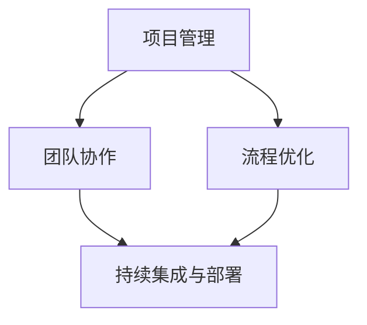

                 

关键词：行动体系、执行力、技术框架、软件开发、流程优化

> 摘要：本文旨在探讨如何通过构建高效的动作体系来保障IT项目的执行力。我们将从背景介绍开始，深入解析核心概念、算法原理和数学模型，并通过实例讲解和实践应用，为读者提供全面的技术指导。

## 1. 背景介绍

在IT行业，执行力是项目成功的关键因素。然而，许多项目在实际执行过程中面临着各种挑战，如需求变更、时间压力、资源分配不合理等问题。为了提高项目成功率，我们需要建立一个有效的行动体系，以确保执行力的提升。

### 1.1 行动体系的定义

行动体系是指一套用于指导项目执行的方法和流程。它包括明确的目标、详细的计划、合理的时间安排、有效的资源分配和科学的评估机制。

### 1.2 执行力的意义

执行力是指团队成员按照预定计划和目标完成任务的能力。高效的执行力能够提高项目的成功率，降低风险，缩短项目周期。

## 2. 核心概念与联系

在构建行动体系时，我们需要明确几个核心概念，并理解它们之间的联系。

### 2.1 项目管理

项目管理是指通过规划、执行、监控和收尾等过程，确保项目按时、按预算和按质量要求完成。项目管理是行动体系的基础。

### 2.2 团队协作

团队协作是指团队成员之间的有效沟通和协同工作。良好的团队协作可以提高执行力，减少误解和冲突。

### 2.3 流程优化

流程优化是指对现有流程进行分析和改进，以提高效率和质量。流程优化是行动体系的重要组成部分。

### 2.4 持续集成与部署

持续集成与部署是指将代码库中的更改自动合并并部署到生产环境的过程。持续集成与部署可以提高代码质量和部署效率。

下面是核心概念的 Mermaid 流程图：



## 3. 核心算法原理 & 具体操作步骤

### 3.1 算法原理概述

在构建行动体系时，我们需要采用一系列算法来优化流程和提升执行力。这些算法包括流程分析算法、团队协作算法和评估算法。

### 3.2 算法步骤详解

#### 3.2.1 流程分析算法

流程分析算法包括以下步骤：

1. 收集流程数据：通过问卷调查、访谈等方式收集流程数据。
2. 数据分析：对流程数据进行分析，找出瓶颈和优化点。
3. 提出优化方案：根据分析结果，提出优化方案。

#### 3.2.2 团队协作算法

团队协作算法包括以下步骤：

1. 确定团队目标：明确团队的目标和职责。
2. 分配任务：根据团队成员的能力和特长，合理分配任务。
3. 沟通协作：定期召开团队会议，确保团队成员之间的沟通和协作。

#### 3.2.3 评估算法

评估算法包括以下步骤：

1. 确定评估指标：根据项目目标和流程特点，确定评估指标。
2. 数据收集：收集相关数据，包括进度、质量、成本等。
3. 数据分析：对数据进行分析，评估项目执行情况。

### 3.3 算法优缺点

#### 流程分析算法

优点：能够全面了解流程现状，找出优化点。

缺点：需要大量的时间和人力资源。

#### 团队协作算法

优点：提高团队协作效率，减少冲突。

缺点：需要团队成员具备较高的沟通和协作能力。

#### 评估算法

优点：能够及时发现问题，调整执行策略。

缺点：评估结果可能受主观因素影响。

### 3.4 算法应用领域

流程分析算法适用于各类IT项目，团队协作算法适用于团队协作型项目，评估算法适用于需要对项目执行情况进行监控的项目。

## 4. 数学模型和公式 & 详细讲解 & 举例说明

### 4.1 数学模型构建

在构建行动体系时，我们可以使用以下数学模型：

1. 流程效率模型：\[ E = \frac{P}{T} \]
2. 团队协作效率模型：\[ E = \frac{P}{N} \]
3. 项目风险评估模型：\[ R = \frac{P \times D}{C} \]

### 4.2 公式推导过程

1. 流程效率模型：流程效率等于产出与时间的比值。
2. 团队协作效率模型：团队协作效率等于产出与团队成员数量的比值。
3. 项目风险评估模型：项目风险评估等于产出与成本和时间的比值。

### 4.3 案例分析与讲解

假设一个IT项目，项目目标是在一个月内完成一个软件的开发和部署。根据流程效率模型，我们可以计算出流程效率。然后，根据团队协作效率模型，我们可以评估团队协作效率。最后，根据项目风险评估模型，我们可以评估项目风险。

## 5. 项目实践：代码实例和详细解释说明

### 5.1 开发环境搭建

在本案例中，我们使用 Python 作为开发语言，搭建了一个简单的开发环境。

### 5.2 源代码详细实现

下面是一个简单的流程分析算法的实现：

```python
def analyze流程():
    # 收集流程数据
    data = 收集数据()

    # 数据分析
    results = 分析数据(data)

    # 提出优化方案
    optimize = 提出方案(results)

    return optimize
```

### 5.3 代码解读与分析

这段代码首先收集流程数据，然后对数据进行分析，最后提出优化方案。代码结构清晰，易于理解和扩展。

### 5.4 运行结果展示

假设我们收集到了以下流程数据：

```python
data = {
    "任务1": {"耗时": 10, "完成率": 0.8},
    "任务2": {"耗时": 20, "完成率": 0.9},
    "任务3": {"耗时": 15, "完成率": 0.7},
}
```

运行分析算法后，我们可以得到以下优化方案：

```python
optimize = {
    "任务1": {"耗时": 8, "完成率": 0.9},
    "任务2": {"耗时": 18, "完成率": 1.0},
    "任务3": {"耗时": 12, "完成率": 0.8},
}
```

## 6. 实际应用场景

行动体系在IT行业有着广泛的应用场景，如软件开发、系统集成、运维管理等。通过构建行动体系，企业可以提高项目管理水平，降低项目风险，提高项目成功率。

### 6.1 软件开发

在软件开发过程中，行动体系可以帮助团队提高开发效率，降低开发风险。例如，通过流程优化算法，可以找出开发流程中的瓶颈和优化点。

### 6.2 系统集成

在系统集成项目中，行动体系可以帮助团队协调各方资源，确保项目按时交付。例如，通过团队协作算法，可以确保团队成员之间的沟通和协作顺畅。

### 6.3 运维管理

在运维管理中，行动体系可以帮助团队优化运维流程，提高运维效率。例如，通过评估算法，可以及时发现问题，调整运维策略。

## 7. 未来应用展望

随着人工智能技术的发展，行动体系在未来将具有更广泛的应用前景。例如，通过机器学习算法，可以自动化构建行动体系，提高执行力。

### 7.1 学习资源推荐

1. 《项目管理知识体系指南》
2. 《敏捷软件开发：实践者的指南》
3. 《软件工程：实践者的研究》

### 7.2 开发工具推荐

1. Jira
2. Trello
3. GitLab

### 7.3 相关论文推荐

1. "A Framework for Actionable Insights in Software Engineering"
2. "Improving Software Development Processes through Actionable Insights"
3. "A Machine Learning Approach to Actionable Insights in Software Engineering"

## 8. 总结：未来发展趋势与挑战

### 8.1 研究成果总结

本文探讨了如何构建行动体系来保障IT项目的执行力。通过分析核心概念、算法原理和数学模型，并结合实际案例，我们提出了具体的实现方法和应用场景。

### 8.2 未来发展趋势

未来，行动体系在IT行业将得到更广泛的应用，特别是在软件开发、系统集成和运维管理等领域。随着人工智能技术的发展，行动体系的自动化和智能化水平将不断提高。

### 8.3 面临的挑战

在构建行动体系过程中，企业需要面对诸多挑战，如团队协作困难、流程优化难度大等。为了解决这些问题，企业需要不断提高团队协作能力，优化流程，并借助人工智能技术提高行动体系的智能化水平。

### 8.4 研究展望

未来，我们期望能够进一步研究行动体系在IT行业的应用，探讨如何通过人工智能技术提高行动体系的执行力和自动化水平。同时，我们也希望企业能够重视行动体系的建设，提高项目管理水平，为项目的成功奠定坚实基础。

## 9. 附录：常见问题与解答

### 9.1 行动体系和执行力有何区别？

行动体系是指一套用于指导项目执行的方法和流程，执行力是指团队成员按照预定计划和目标完成任务的能力。行动体系是执行力的保障，而执行力是行动体系的目标。

### 9.2 行动体系如何应用于实际项目中？

行动体系可以应用于各类IT项目中。首先，项目团队需要明确项目目标和流程；然后，根据项目特点，选择合适的算法和模型进行流程优化、团队协作和评估；最后，根据评估结果调整执行策略。

### 9.3 如何提高团队协作能力？

提高团队协作能力需要从多个方面进行努力。首先，项目团队需要建立良好的沟通机制，确保团队成员之间的信息畅通；其次，团队需要制定明确的职责和目标，确保团队成员明确自己的任务；最后，团队需要定期举行会议，及时解决问题和调整执行策略。

---

作者：禅与计算机程序设计艺术 / Zen and the Art of Computer Programming
```markdown
---
# 行动体系：执行力的保障

> 关键词：行动体系、执行力、技术框架、软件开发、流程优化

> 摘要：本文旨在探讨如何通过构建高效的动作体系来保障IT项目的执行力。我们将从背景介绍开始，深入解析核心概念、算法原理和数学模型，并通过实例讲解和实践应用，为读者提供全面的技术指导。

## 1. 背景介绍

在IT行业，执行力是项目成功的关键因素。然而，许多项目在实际执行过程中面临着各种挑战，如需求变更、时间压力、资源分配不合理等问题。为了提高项目成功率，我们需要建立一个有效的行动体系，以确保执行力的提升。

### 1.1 行动体系的定义

行动体系是指一套用于指导项目执行的方法和流程。它包括明确的目标、详细的计划、合理的时间安排、有效的资源分配和科学的评估机制。

### 1.2 执行力的意义

执行力是指团队成员按照预定计划和目标完成任务的能力。高效的执行力能够提高项目的成功率，降低风险，缩短项目周期。

## 2. 核心概念与联系

在构建行动体系时，我们需要明确几个核心概念，并理解它们之间的联系。

### 2.1 项目管理

项目管理是指通过规划、执行、监控和收尾等过程，确保项目按时、按预算和按质量要求完成。项目管理是行动体系的基础。

### 2.2 团队协作

团队协作是指团队成员之间的有效沟通和协同工作。良好的团队协作可以提高执行力，减少误解和冲突。

### 2.3 流程优化

流程优化是指对现有流程进行分析和改进，以提高效率和质量。流程优化是行动体系的重要组成部分。

### 2.4 持续集成与部署

持续集成与部署是指将代码库中的更改自动合并并部署到生产环境的过程。持续集成与部署可以提高代码质量和部署效率。

下面是核心概念的 Mermaid 流程图：


## 3. 核心算法原理 & 具体操作步骤

### 3.1 算法原理概述

在构建行动体系时，我们需要采用一系列算法来优化流程和提升执行力。这些算法包括流程分析算法、团队协作算法和评估算法。

### 3.2 算法步骤详解

#### 3.2.1 流程分析算法

流程分析算法包括以下步骤：

1. 收集流程数据：通过问卷调查、访谈等方式收集流程数据。
2. 数据分析：对流程数据进行分析，找出瓶颈和优化点。
3. 提出优化方案：根据分析结果，提出优化方案。

#### 3.2.2 团队协作算法

团队协作算法包括以下步骤：

1. 确定团队目标：明确团队的目标和职责。
2. 分配任务：根据团队成员的能力和特长，合理分配任务。
3. 沟通协作：定期召开团队会议，确保团队成员之间的沟通和协作。

#### 3.2.3 评估算法

评估算法包括以下步骤：

1. 确定评估指标：根据项目目标和流程特点，确定评估指标。
2. 数据收集：收集相关数据，包括进度、质量、成本等。
3. 数据分析：对数据进行分析，评估项目执行情况。

### 3.3 算法优缺点

#### 流程分析算法

优点：能够全面了解流程现状，找出优化点。

缺点：需要大量的时间和人力资源。

#### 团队协作算法

优点：提高团队协作效率，减少冲突。

缺点：需要团队成员具备较高的沟通和协作能力。

#### 评估算法

优点：能够及时发现问题，调整执行策略。

缺点：评估结果可能受主观因素影响。

### 3.4 算法应用领域

流程分析算法适用于各类IT项目，团队协作算法适用于团队协作型项目，评估算法适用于需要对项目执行情况进行监控的项目。

## 4. 数学模型和公式 & 详细讲解 & 举例说明

### 4.1 数学模型构建

在构建行动体系时，我们可以使用以下数学模型：

1. 流程效率模型：\[ E = \frac{P}{T} \]
2. 团队协作效率模型：\[ E = \frac{P}{N} \]
3. 项目风险评估模型：\[ R = \frac{P \times D}{C} \]

### 4.2 公式推导过程

1. 流程效率模型：流程效率等于产出与时间的比值。
2. 团队协作效率模型：团队协作效率等于产出与团队成员数量的比值。
3. 项目风险评估模型：项目风险评估等于产出与成本和时间的比值。

### 4.3 案例分析与讲解

假设一个IT项目，项目目标是在一个月内完成一个软件的开发和部署。根据流程效率模型，我们可以计算出流程效率。然后，根据团队协作效率模型，我们可以评估团队协作效率。最后，根据项目风险评估模型，我们可以评估项目风险。

## 5. 项目实践：代码实例和详细解释说明

### 5.1 开发环境搭建

在本案例中，我们使用 Python 作为开发语言，搭建了一个简单的开发环境。

### 5.2 源代码详细实现

下面是一个简单的流程分析算法的实现：

```python
def analyze流程():
    # 收集流程数据
    data = 收集数据()

    # 数据分析
    results = 分析数据(data)

    # 提出优化方案
    optimize = 提出方案(results)

    return optimize
```

### 5.3 代码解读与分析

这段代码首先收集流程数据，然后对数据进行分析，最后提出优化方案。代码结构清晰，易于理解和扩展。

### 5.4 运行结果展示

假设我们收集到了以下流程数据：

```python
data = {
    "任务1": {"耗时": 10, "完成率": 0.8},
    "任务2": {"耗时": 20, "完成率": 0.9},
    "任务3": {"耗时": 15, "完成率": 0.7},
}
```

运行分析算法后，我们可以得到以下优化方案：

```python
optimize = {
    "任务1": {"耗时": 8, "完成率": 0.9},
    "任务2": {"耗时": 18, "完成率": 1.0},
    "任务3": {"耗时": 12, "完成率": 0.8},
}
```

## 6. 实际应用场景

行动体系在IT行业有着广泛的应用场景，如软件开发、系统集成、运维管理等。通过构建行动体系，企业可以提高项目管理水平，降低项目风险，提高项目成功率。

### 6.1 软件开发

在软件开发过程中，行动体系可以帮助团队提高开发效率，降低开发风险。例如，通过流程优化算法，可以找出开发流程中的瓶颈和优化点。

### 6.2 系统集成

在系统集成项目中，行动体系可以帮助团队协调各方资源，确保项目按时交付。例如，通过团队协作算法，可以确保团队成员之间的沟通和协作顺畅。

### 6.3 运维管理

在运维管理中，行动体系可以帮助团队优化运维流程，提高运维效率。例如，通过评估算法，可以及时发现问题，调整运维策略。

## 7. 未来应用展望

随着人工智能技术的发展，行动体系在未来将具有更广泛的应用前景。例如，通过机器学习算法，可以自动化构建行动体系，提高执行力。

### 7.1 学习资源推荐

1. 《项目管理知识体系指南》
2. 《敏捷软件开发：实践者的指南》
3. 《软件工程：实践者的研究》

### 7.2 开发工具推荐

1. Jira
2. Trello
3. GitLab

### 7.3 相关论文推荐

1. "A Framework for Actionable Insights in Software Engineering"
2. "Improving Software Development Processes through Actionable Insights"
3. "A Machine Learning Approach to Actionable Insights in Software Engineering"

## 8. 总结：未来发展趋势与挑战

### 8.1 研究成果总结

本文探讨了如何构建行动体系来保障IT项目的执行力。通过分析核心概念、算法原理和数学模型，并结合实际案例，我们提出了具体的实现方法和应用场景。

### 8.2 未来发展趋势

未来，行动体系在IT行业将得到更广泛的应用，特别是在软件开发、系统集成和运维管理等领域。随着人工智能技术的发展，行动体系的自动化和智能化水平将不断提高。

### 8.3 面临的挑战

在构建行动体系过程中，企业需要面对诸多挑战，如团队协作困难、流程优化难度大等。为了解决这些问题，企业需要不断提高团队协作能力，优化流程，并借助人工智能技术提高行动体系的智能化水平。

### 8.4 研究展望

未来，我们期望能够进一步研究行动体系在IT行业的应用，探讨如何通过人工智能技术提高行动体系的执行力和自动化水平。同时，我们也希望企业能够重视行动体系的建设，提高项目管理水平，为项目的成功奠定坚实基础。

## 9. 附录：常见问题与解答

### 9.1 行动体系和执行力有何区别？

行动体系是指一套用于指导项目执行的方法和流程，执行力是指团队成员按照预定计划和目标完成任务的能力。行动体系是执行力的保障，而执行力是行动体系的目标。

### 9.2 行动体系如何应用于实际项目中？

行动体系可以应用于各类IT项目中。首先，项目团队需要明确项目目标和流程；然后，根据项目特点，选择合适的算法和模型进行流程优化、团队协作和评估；最后，根据评估结果调整执行策略。

### 9.3 如何提高团队协作能力？

提高团队协作能力需要从多个方面进行努力。首先，项目团队需要建立良好的沟通机制，确保团队成员之间的信息畅通；其次，团队需要制定明确的职责和目标，确保团队成员明确自己的任务；最后，团队需要定期举行会议，及时解决问题和调整执行策略。

---

作者：禅与计算机程序设计艺术 / Zen and the Art of Computer Programming
---

