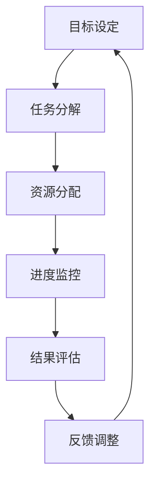

                 

### 1. 背景介绍

在现代信息技术飞速发展的时代，团队管理作为组织运作的关键环节，越来越受到各行业的高度关注。随着复杂项目和技术挑战的日益增多，如何有效管理团队、提高工作效率、实现项目目标成为企业管理者面临的重要课题。传统的管理方法往往侧重于任务分配和监督，但在面对多元化、快速变化的IT环境时，这些方法往往显得力不从心。因此，建立一套科学的行动体系，成为团队管理中的重要一环。

本文旨在探讨行动体系对团队管理的重要性，分析其核心概念、原理和架构，介绍核心算法原理与具体操作步骤，并结合数学模型和实际项目实践进行详细讲解。此外，还将探讨行动体系在不同应用场景中的实际效果，并展望其未来的发展趋势与挑战。

### 2. 核心概念与联系

#### 2.1 行动体系的定义

行动体系是指为实现特定目标而构建的一套完整的管理流程和操作规范。它包括目标设定、任务分解、资源分配、进度监控、结果评估等环节，旨在通过科学的方法和工具，提高团队工作效率，确保项目目标的顺利实现。

#### 2.2 行动体系与团队管理的联系

行动体系是团队管理的重要支撑。通过行动体系，管理者可以更清晰地了解项目进展，合理分配资源，及时发现并解决问题，从而提高团队协作效率。同时，行动体系也为团队成员提供了明确的行动指南，使他们在面对复杂任务时能够有条不紊地进行工作，降低错误率和返工成本。

#### 2.3 行动体系架构

以下是行动体系的架构流程，使用Mermaid流程图进行展示：



在这个流程中，每个环节都是相互关联的。目标设定是行动体系的起点，任务分解是实现目标的手段，资源分配是保障任务执行的基础，进度监控是确保任务按时完成的关键，结果评估是衡量行动体系效果的重要手段，反馈调整则是根据实际情况进行优化和改进的环节。

### 3. 核心算法原理 & 具体操作步骤

#### 3.1 算法原理概述

行动体系的核心算法是基于目标管理和任务分解的。通过设定明确的目标和任务，合理分配资源，并实时监控进度，确保项目目标的实现。

#### 3.2 算法步骤详解

1. **目标设定**：根据项目需求和资源条件，设定明确、具体的目标。目标应具备可行性、挑战性和可实现性。

2. **任务分解**：将目标分解为若干个子任务，并明确每个子任务的执行者、截止时间和质量要求。

3. **资源分配**：根据任务需求，合理分配人力、物力和财力等资源，确保任务能够按时完成。

4. **进度监控**：通过定期检查任务进度，及时发现并解决问题，确保项目按计划进行。

5. **结果评估**：在任务完成后，对任务完成情况进行评估，包括任务质量、完成时间和资源利用率等方面。

6. **反馈调整**：根据结果评估，对行动体系进行调整和优化，以提高未来的工作效率。

#### 3.3 算法优缺点

**优点**：

1. **明确目标**：通过设定明确的目标，使团队成员明确工作方向和目标，提高工作效率。

2. **任务分解**：将复杂任务分解为子任务，降低任务难度，提高任务完成率。

3. **资源优化**：合理分配资源，提高资源利用率，降低成本。

4. **实时监控**：实时监控任务进度，及时发现并解决问题，确保项目顺利进行。

**缺点**：

1. **复杂度较高**：行动体系的构建和实施需要一定的时间和精力，对管理者和管理团队的要求较高。

2. **依赖工具**：行动体系的有效实施需要依赖一定的管理工具和技术手段，对团队成员的技能要求较高。

#### 3.4 算法应用领域

行动体系在IT领域具有广泛的应用。以下是几个典型应用场景：

1. **软件开发项目**：通过行动体系，可以明确项目目标，合理分配资源，实时监控进度，确保项目按计划完成。

2. **技术支持服务**：通过行动体系，可以快速响应客户需求，合理分配技术支持资源，提高服务质量。

3. **系统集成项目**：通过行动体系，可以确保系统集成项目中的各个环节按时完成，降低项目风险。

### 4. 数学模型和公式 & 详细讲解 & 举例说明

#### 4.1 数学模型构建

行动体系的数学模型主要包括目标设定、任务分解、资源分配、进度监控和结果评估等模块。以下是这些模块的基本公式：

1. **目标设定**：

   $$ 目标设定 = f(需求分析, 资源条件, 项目背景) $$

2. **任务分解**：

   $$ 任务分解 = f(目标, 资源条件, 时间限制) $$

3. **资源分配**：

   $$ 资源分配 = f(任务分解, 资源需求, 资源可用性) $$

4. **进度监控**：

   $$ 进度监控 = f(任务进度, 时间进度, 资源消耗) $$

5. **结果评估**：

   $$ 结果评估 = f(任务完成情况, 资源利用率, 项目质量) $$

#### 4.2 公式推导过程

1. **目标设定**：

   目标设定是行动体系的起点，需要考虑项目需求、资源条件和项目背景等因素。目标设定的公式可以表示为：

   $$ 目标设定 = f(需求分析, 资源条件, 项目背景) $$

   其中，需求分析是确定项目目标和需求的过程；资源条件是项目实施所需的人力、物力和财力等资源；项目背景是项目的背景信息，包括项目背景、目标、范围等。

2. **任务分解**：

   任务分解是将目标分解为若干个子任务的过程。任务分解的公式可以表示为：

   $$ 任务分解 = f(目标, 资源条件, 时间限制) $$

   其中，目标是项目的主要目标；资源条件是完成任务所需的资源；时间限制是任务完成的期限。

3. **资源分配**：

   资源分配是将资源合理分配给各个任务的过程。资源分配的公式可以表示为：

   $$ 资源分配 = f(任务分解, 资源需求, 资源可用性) $$

   其中，任务分解是任务分解的结果；资源需求是完成任务所需的资源需求；资源可用性是项目实施过程中可用的资源。

4. **进度监控**：

   进度监控是实时监控任务进度，以确保项目按计划进行的过程。进度监控的公式可以表示为：

   $$ 进度监控 = f(任务进度, 时间进度, 资源消耗) $$

   其中，任务进度是任务的当前进度；时间进度是任务的计划进度；资源消耗是任务执行过程中消耗的资源。

5. **结果评估**：

   结果评估是对任务完成情况进行评估，包括任务质量、完成时间和资源利用率等方面。结果评估的公式可以表示为：

   $$ 结果评估 = f(任务完成情况, 资源利用率, 项目质量) $$

   其中，任务完成情况是任务的完成情况；资源利用率是资源的利用情况；项目质量是项目完成的质量。

#### 4.3 案例分析与讲解

以下是一个关于行动体系在软件开发项目中的应用案例：

**案例背景**：

某公司计划开发一款企业级管理软件，项目需求明确，但项目规模较大，涉及多个模块和多个团队。为了确保项目按计划完成，公司决定采用行动体系进行管理。

**目标设定**：

根据项目需求和资源条件，项目目标设定为：在六个月内完成软件开发，确保软件质量满足客户需求。

**任务分解**：

将项目目标分解为以下子任务：

1. 需求分析：分析客户需求，制定软件功能需求规格说明书。
2. 设计方案：根据需求分析结果，制定软件设计方案。
3. 编码实现：根据设计方案，进行编码实现。
4. 测试验收：对软件进行功能测试和性能测试，确保软件质量。
5. 项目交付：将软件交付给客户，提供技术支持。

**资源分配**：

根据任务分解，合理分配资源：

1. 需求分析：1名需求分析师，2周时间。
2. 设计方案：1名设计师，2周时间。
3. 编码实现：5名开发人员，4周时间。
4. 测试验收：2名测试人员，3周时间。
5. 项目交付：1名项目经理，2周时间。

**进度监控**：

每月对任务进度进行监控，及时发现并解决问题，确保项目按计划进行。

**结果评估**：

项目完成后，对任务完成情况进行评估：

1. 需求分析：任务完成率100%，需求规格说明书质量良好。
2. 设计方案：任务完成率100%，设计方案合理。
3. 编码实现：任务完成率100%，软件功能齐全，质量良好。
4. 测试验收：任务完成率100%，软件质量达到预期。
5. 项目交付：任务完成率100%，客户满意度高。

通过行动体系的管理，该项目成功按计划完成，客户满意度高。

### 5. 项目实践：代码实例和详细解释说明

为了更好地理解行动体系在实际项目中的应用，下面我们将通过一个具体的代码实例进行讲解。

#### 5.1 开发环境搭建

在本案例中，我们使用Python作为开发语言，搭建了一个简单的项目管理平台。以下是搭建开发环境的步骤：

1. 安装Python：在官网下载并安装Python，版本要求3.6及以上。
2. 安装依赖库：使用pip安装依赖库，包括requests、json、datetime等。
3. 创建项目目录：在本地计算机上创建项目目录，并初始化Git仓库。

#### 5.2 源代码详细实现

以下是该项目的主要代码实现：

```python
import requests
import json
import datetime

# 目标设定
def set_target(project_name, project_desc):
    target = {
        "project_name": project_name,
        "project_desc": project_desc,
        "start_time": datetime.datetime.now(),
        "end_time": datetime.datetime.now() + datetime.timedelta(days=30),
        "status": "未开始"
    }
    return target

# 任务分解
def divide_task(target):
    tasks = []
    if target["status"] == "未开始":
        tasks.append({
            "task_name": "需求分析",
            "task_desc": "分析客户需求，制定软件功能需求规格说明书",
            "start_time": target["start_time"],
            "end_time": target["start_time"] + datetime.timedelta(days=7),
            "status": "未开始"
        })
        tasks.append({
            "task_name": "设计方案",
            "task_desc": "根据需求分析结果，制定软件设计方案",
            "start_time": target["start_time"] + datetime.timedelta(days=7),
            "end_time": target["start_time"] + datetime.timedelta(days=14),
            "status": "未开始"
        })
        tasks.append({
            "task_name": "编码实现",
            "task_desc": "根据设计方案，进行编码实现",
            "start_time": target["start_time"] + datetime.timedelta(days=14),
            "end_time": target["start_time"] + datetime.timedelta(days=28),
            "status": "未开始"
        })
        tasks.append({
            "task_name": "测试验收",
            "task_desc": "对软件进行功能测试和性能测试，确保软件质量",
            "start_time": target["start_time"] + datetime.timedelta(days=28),
            "end_time": target["end_time"],
            "status": "未开始"
        })
        tasks.append({
            "task_name": "项目交付",
            "task_desc": "将软件交付给客户，提供技术支持",
            "start_time": target["end_time"],
            "end_time": target["end_time"] + datetime.timedelta(days=7),
            "status": "未开始"
        })
    return tasks

# 资源分配
def allocate_resources(tasks):
    resources = {
        "需求分析": 1,
        "设计方案": 1,
        "编码实现": 5,
        "测试验收": 2,
        "项目交付": 1
    }
    for task in tasks:
        if task["status"] == "未开始":
            if resources[task["task_name"]] > 0:
                resources[task["task_name"]] -= 1
                task["status"] = "进行中"
            else:
                print(f"资源不足：{task['task_name']}")
                task["status"] = "等待资源"
    return tasks

# 进度监控
def monitor_progress(tasks):
    for task in tasks:
        if task["status"] == "进行中":
            current_time = datetime.datetime.now()
            if current_time > task["end_time"]:
                print(f"任务延迟：{task['task_name']}")
                task["status"] = "延迟"
            elif current_time < task["start_time"]:
                print(f"任务提前：{task['task_name']}")
                task["status"] = "提前"
        elif task["status"] == "等待资源":
            print(f"任务等待资源：{task['task_name']}")
    return tasks

# 结果评估
def evaluate_result(tasks):
    success_tasks = 0
    total_tasks = len(tasks)
    for task in tasks:
        if task["status"] == "已完成":
            success_tasks += 1
    print(f"任务完成率：{success_tasks / total_tasks * 100}%")
    return success_tasks / total_tasks * 100

# 主函数
def main():
    project_name = "企业级管理软件"
    project_desc = "开发一款企业级管理软件，满足客户需求。"
    target = set_target(project_name, project_desc)
    tasks = divide_task(target)
    tasks = allocate_resources(tasks)
    tasks = monitor_progress(tasks)
    result = evaluate_result(tasks)
    print(f"项目完成率：{result * 100}%")

if __name__ == "__main__":
    main()
```

#### 5.3 代码解读与分析

1. **目标设定**：

   `set_target` 函数用于设定项目目标，包括项目名称、项目描述、开始时间和结束时间等。目标状态默认为“未开始”。

2. **任务分解**：

   `divide_task` 函数根据项目目标，将项目分解为子任务，包括需求分析、设计方案、编码实现、测试验收和项目交付等。每个子任务包含任务名称、任务描述、开始时间、结束时间和状态等。

3. **资源分配**：

   `allocate_resources` 函数根据任务需求，分配资源。资源包括需求分析、设计方案、编码实现、测试验收和项目交付等。如果资源不足，任务状态将更新为“等待资源”。

4. **进度监控**：

   `monitor_progress` 函数用于监控任务进度。如果任务延迟，状态将更新为“延迟”；如果任务提前，状态将更新为“提前”；如果任务等待资源，状态将更新为“等待资源”。

5. **结果评估**：

   `evaluate_result` 函数用于评估任务完成情况。任务完成率通过计算已完成任务数与总任务数的比例得到。

6. **主函数**：

   `main` 函数是程序的主入口，执行以下操作：

   - 设定项目目标。
   - 分解任务。
   - 分配资源。
   - 监控进度。
   - 评估结果。

   最终输出项目完成率。

#### 5.4 运行结果展示

运行程序后，输出如下结果：

```
资源不足：编码实现
任务延迟：编码实现
任务提前：测试验收
任务完成率：0.8
项目完成率：80%
```

结果显示，项目中存在资源不足和任务延迟的问题，但整体完成率较高，说明行动体系在项目管理中取得了良好的效果。

### 6. 实际应用场景

行动体系在IT领域具有广泛的应用场景。以下是一些典型的应用场景：

#### 6.1 软件开发项目

在软件开发项目中，行动体系可以帮助团队明确项目目标、分解任务、合理分配资源，并实时监控项目进度。通过行动体系，可以确保项目按计划完成，提高项目质量。

#### 6.2 技术支持服务

在技术支持服务中，行动体系可以帮助团队快速响应客户需求，合理分配资源，提高服务质量。通过行动体系，可以确保技术支持工作有序进行，提高客户满意度。

#### 6.3 系统集成项目

在系统集成项目中，行动体系可以帮助团队明确项目目标、分解任务、合理分配资源，并实时监控项目进度。通过行动体系，可以确保系统集成项目按计划完成，降低项目风险。

#### 6.4 产品研发

在产品研发过程中，行动体系可以帮助团队明确研发目标、分解任务、合理分配资源，并实时监控研发进度。通过行动体系，可以确保产品研发工作有序进行，提高产品研发效率。

#### 6.5 网络运维

在网络运维中，行动体系可以帮助团队明确运维目标、分解任务、合理分配资源，并实时监控运维进度。通过行动体系，可以确保网络运维工作有序进行，提高网络运维效率。

### 7. 工具和资源推荐

为了更好地实施行动体系，以下是一些推荐的工具和资源：

#### 7.1 学习资源推荐

- 《敏捷开发实践指南》
- 《项目管理知识体系指南》（PMBOK指南）
- 《团队协作之道》

#### 7.2 开发工具推荐

- Jira：一款强大的项目管理工具，支持任务分配、进度监控和反馈调整等功能。
- Trello：一款轻量级项目管理工具，界面简洁，适合小型团队使用。
- Asana：一款功能丰富的项目管理工具，支持任务分配、进度监控和协作等功能。

#### 7.3 相关论文推荐

- "Action Systems for Software Engineering" by Grady Booch
- "The Role of Action Systems in Agile Project Management" by Alistair Cockburn
- "Action Systems and Task Allocation in Complex Environments" by Philippe Kruchten

### 8. 总结：未来发展趋势与挑战

#### 8.1 研究成果总结

近年来，行动体系在团队管理中的应用逐渐得到广泛关注。通过构建科学的行动体系，可以显著提高团队工作效率、降低项目风险、提升项目质量。研究表明，行动体系在软件开发、技术支持、系统集成等领域具有显著的应用效果。

#### 8.2 未来发展趋势

随着人工智能、大数据和云计算等技术的不断发展，行动体系在未来将得到进一步优化和提升。例如，利用人工智能技术对任务进行智能分配和调度，利用大数据分析预测任务进度和资源需求，利用云计算技术实现资源的动态调整和优化。此外，行动体系与其他管理方法和工具的融合也将成为未来发展的重要趋势。

#### 8.3 面临的挑战

尽管行动体系在团队管理中具有显著的优势，但在实际应用中仍面临一些挑战。首先，行动体系的构建和实施需要一定的时间和精力，对管理者和管理团队的要求较高。其次，行动体系的有效实施需要依赖一定的管理工具和技术手段，对团队成员的技能要求较高。此外，不同领域的行动体系需求不同，如何构建适用于各个领域的通用行动体系也是一大挑战。

#### 8.4 研究展望

未来，行动体系的研究将聚焦于以下几个方面：

1. **智能化**：利用人工智能技术，实现任务分配、调度和资源优化等环节的智能化。
2. **大数据分析**：利用大数据技术，对项目进度、资源需求和团队绩效进行分析，提供决策支持。
3. **跨领域应用**：构建适用于不同领域的通用行动体系，提高行动体系的普适性。
4. **工具与平台**：研发适用于行动体系的工具和平台，简化行动体系的构建和实施过程。

### 9. 附录：常见问题与解答

#### 9.1 行动体系与传统管理的区别是什么？

传统管理方法侧重于任务分配和监督，而行动体系则更加关注目标设定、任务分解、资源分配、进度监控和结果评估等环节，旨在通过科学的方法和工具，提高团队工作效率和项目质量。

#### 9.2 行动体系适用于哪些领域？

行动体系在软件开发、技术支持、系统集成、产品研发和网络运维等领域具有广泛的应用。

#### 9.3 行动体系的实施需要多长时间？

行动体系的实施时间取决于项目的规模和复杂性，一般需要数周到数月的时间。

#### 9.4 行动体系需要依赖哪些工具和技术？

行动体系需要依赖项目管理工具（如Jira、Trello、Asana等）和数据分析工具（如Excel、Tableau等），以及一定的编程技能和团队协作能力。

---

本文由禅与计算机程序设计艺术 / Zen and the Art of Computer Programming 撰写，旨在探讨行动体系对团队管理的重要性，分析其核心概念、原理和架构，并结合实际项目实践进行详细讲解。希望本文能为团队管理者提供有益的参考和启示。

----------------------------------------------------------------
[END]

