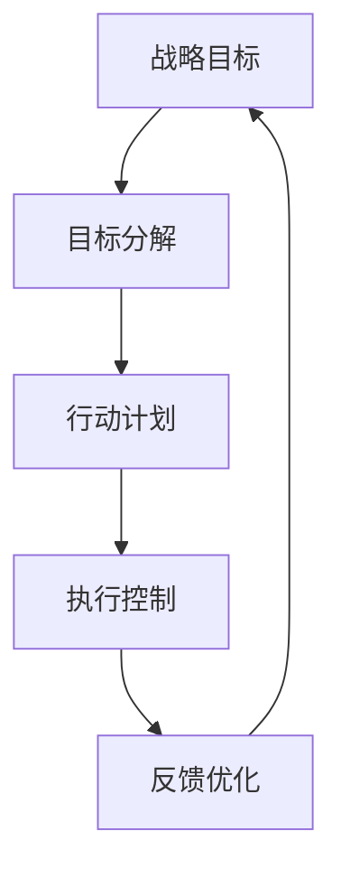

                 

关键词：行动体系，管理执行力，组织架构，IT项目管理，战略实施

> 摘要：本文旨在探讨行动体系在提升管理执行力方面的关键作用。通过分析行动体系的构成要素、运作机制以及其在不同组织架构中的应用，本文揭示了行动体系对管理执行力的深远影响。文章首先介绍了行动体系的背景和重要性，然后深入探讨了其核心概念、算法原理和具体操作步骤，并通过数学模型和实际项目实例进行了详细解释。最后，文章提出了未来应用展望和面临的挑战，为行动体系的研究和实践提供了新的思路。

## 1. 背景介绍

在现代企业管理中，执行力是确保战略目标实现的关键因素。然而，许多企业在实际操作中往往面临执行力不足的问题，导致战略目标无法达成。执行力不足的原因多种多样，其中包括组织架构不合理、管理流程不规范、员工素质不高等。为了解决这些问题，许多企业开始关注行动体系的建设。

行动体系是一种以目标为导向、以流程为支撑的管理体系，通过明确的行动规划和严格的执行控制，确保企业战略的顺利实施。行动体系的核心在于将战略目标分解为具体的行动任务，并制定相应的执行计划，以确保每个任务都能按时、按质完成。

### 1.1 行动体系的起源与发展

行动体系最早可以追溯到20世纪初的工业管理时期。随着企业管理理论的不断发展和完善，行动体系也在不断地演变和升级。20世纪80年代，随着信息技术的飞速发展，企业开始采用计算机系统来管理行动体系，提高了执行力的效率和准确性。

21世纪初，随着企业全球化竞争的加剧，行动体系的重要性日益凸显。许多企业开始引入先进的管理理念和技术手段，如项目管理、敏捷开发等，以提升行动体系的执行力和应变能力。

### 1.2 行动体系的重要性

行动体系在企业管理中的重要性体现在以下几个方面：

1. **确保战略目标的实现**：行动体系通过将战略目标分解为具体的行动任务，确保每个任务都有明确的目标和计划，从而提高战略实现的效率和准确性。

2. **优化管理流程**：行动体系通过对行动任务的执行情况进行实时监控和反馈，发现并解决流程中的问题，从而优化管理流程，提高管理效率。

3. **提升员工执行力**：行动体系通过明确的行动规划和严格的执行控制，提高了员工的执行力，从而提升整个企业的执行力。

4. **增强企业竞争力**：行动体系通过提高企业的执行力，使企业能够快速响应市场变化，抢占市场先机，从而增强企业竞争力。

## 2. 核心概念与联系

为了深入理解行动体系，我们需要先了解其核心概念和构成要素，并探讨这些概念之间的关系。以下是行动体系的核心概念及其相互关系的 Mermaid 流程图：



### 2.1 战略目标

战略目标是企业长期发展所追求的总目标，是行动体系的基础。战略目标需要具体、明确，并与企业的愿景和使命相一致。

### 2.2 目标分解

目标分解是将战略目标细化为具体的行动任务，每个任务都有明确的目标和计划。目标分解是实现战略目标的关键步骤。

### 2.3 行动计划

行动计划是针对每个行动任务制定的详细执行计划，包括任务分工、时间安排、资源分配等。行动计划是确保行动任务按时、按质完成的重要保障。

### 2.4 执行控制

执行控制是对行动任务的执行情况进行实时监控和反馈，及时发现并解决问题。执行控制是保证行动计划顺利执行的关键。

### 2.5 反馈优化

反馈优化是对执行控制过程中发现的问题进行总结和改进，优化管理流程和行动计划。反馈优化是持续提升行动体系执行力的关键。

## 3. 核心算法原理 & 具体操作步骤

### 3.1 算法原理概述

行动体系的核心算法是基于目标管理理论和项目管理理论，通过目标分解、行动计划、执行控制和反馈优化四个步骤，实现战略目标的逐步实现。

### 3.2 算法步骤详解

#### 3.2.1 目标分解

目标分解是将战略目标细化为具体的行动任务，每个任务都有明确的目标和计划。目标分解的关键是确保每个任务都是可执行的，并且任务之间相互协调。

#### 3.2.2 行动计划

行动计划是针对每个行动任务制定的详细执行计划，包括任务分工、时间安排、资源分配等。行动计划的关键是确保每个任务都有明确的时间节点和责任人。

#### 3.2.3 执行控制

执行控制是对行动任务的执行情况进行实时监控和反馈，及时发现并解决问题。执行控制的关键是建立有效的监控机制和反馈机制。

#### 3.2.4 反馈优化

反馈优化是对执行控制过程中发现的问题进行总结和改进，优化管理流程和行动计划。反馈优化的关键是对执行过程中的数据进行深入分析和挖掘。

### 3.3 算法优缺点

#### 优点

- **确保战略目标的实现**：通过明确的目标分解和执行控制，确保战略目标的逐步实现。
- **优化管理流程**：通过实时监控和反馈，发现并解决流程中的问题，优化管理流程。
- **提升员工执行力**：通过明确的行动规划和执行控制，提升员工的执行力。

#### 缺点

- **需要大量时间和资源**：行动体系的实施需要投入大量时间和资源，尤其是初始阶段。
- **对管理团队的要求高**：行动体系的有效实施需要管理团队具备较高的管理能力和执行力。

### 3.4 算法应用领域

行动体系广泛应用于各个领域，如企业战略实施、项目管理、人力资源管理等。以下是一些典型的应用案例：

- **企业战略实施**：通过行动体系，企业可以将战略目标分解为具体的行动任务，并制定详细的执行计划，确保战略目标的实现。
- **项目管理**：行动体系可以帮助项目经理实时监控项目进度，及时发现并解决问题，确保项目按时、按质完成。
- **人力资源管理**：行动体系可以帮助企业优化人力资源配置，提升员工执行力，提高人力资源管理效率。

## 4. 数学模型和公式 & 详细讲解 & 举例说明

### 4.1 数学模型构建

行动体系的数学模型可以基于目标管理理论和项目管理理论构建。以下是一个简单的数学模型：

$$
M = f(T, P, E, F)
$$

其中，M表示行动体系的管理效果，T表示战略目标，P表示行动计划，E表示执行控制，F表示反馈优化。

### 4.2 公式推导过程

根据目标管理理论和项目管理理论，我们可以推导出以下公式：

$$
M \propto T^{\alpha} P^{\beta} E^{\gamma} F^{\delta}
$$

其中，α、β、γ、δ分别为战略目标、行动计划、执行控制和反馈优化的权重系数。

### 4.3 案例分析与讲解

#### 案例背景

某企业计划在一年内实现销售额翻倍的目标。企业通过行动体系，将战略目标分解为具体的行动任务，并制定详细的执行计划。

#### 案例分析

1. **目标分解**：企业将销售额翻倍的目标分解为每月、每周、每日的销售目标。

2. **行动计划**：企业为每个销售目标制定详细的执行计划，包括销售策略、促销活动、市场推广等。

3. **执行控制**：企业通过销售数据监控，实时了解销售进度，及时发现并解决问题。

4. **反馈优化**：企业根据执行过程中的数据反馈，优化销售策略和执行计划，提高销售效果。

#### 案例结论

通过行动体系的实施，企业成功地实现了销售额翻倍的目标。行动体系在目标管理、执行控制、反馈优化等方面发挥了重要作用。

## 5. 项目实践：代码实例和详细解释说明

### 5.1 开发环境搭建

为了更好地理解行动体系的实践应用，我们将在Python环境中搭建一个简单的行动体系模拟系统。开发环境要求如下：

- Python 3.8+
- PyCharm 或任意Python IDE
- pandas、numpy、matplotlib 等库

### 5.2 源代码详细实现

以下是一个简单的行动体系模拟系统的代码实现：

```python
import pandas as pd
import numpy as np
import matplotlib.pyplot as plt

# 目标分解
def target_decomposition(total_target, periods):
    targets = [total_target / periods] * periods
    return targets

# 行动计划
def action_plan(targets, period, action_rate):
    target = targets[period]
    action = target * action_rate
    return action

# 执行控制
def execution_control(action, actual):
    deviation = actual - action
    return deviation

# 反馈优化
def feedback_optimization(deviation, action_rate):
    action_rate += deviation * 0.1
    return action_rate

# 模拟行动体系
def simulate_action_system(total_target, periods, action_rate):
    targets = target_decomposition(total_target, periods)
    actions = []
    actuals = []

    for i in range(periods):
        action = action_plan(targets[i], i, action_rate)
        actual = np.random.normal(action, action / 10)
        deviation = execution_control(action, actual)
        action_rate = feedback_optimization(deviation, action_rate)
        actions.append(action)
        actuals.append(actual)

    return actions, actuals

# 绘制结果
def plot_results(actions, actuals):
    plt.figure(figsize=(10, 5))
    plt.plot(actions, label='Action')
    plt.plot(actuals, label='Actual')
    plt.xlabel('Period')
    plt.ylabel('Value')
    plt.title('Action System Simulation')
    plt.legend()
    plt.show()

# 参数设置
total_target = 1000
periods = 10
action_rate = 0.1

# 模拟
actions, actuals = simulate_action_system(total_target, periods, action_rate)

# 绘图
plot_results(actions, actuals)
```

### 5.3 代码解读与分析

上述代码实现了行动体系的模拟，主要包括目标分解、行动计划、执行控制和反馈优化四个部分。

1. **目标分解**：`target_decomposition` 函数将总目标分解为每个周期（月、周、日）的目标。

2. **行动计划**：`action_plan` 函数根据当前周期目标和行动率，计算出当前周期的行动值。

3. **执行控制**：`execution_control` 函数计算实际值与行动值之间的偏差。

4. **反馈优化**：`feedback_optimization` 函数根据偏差调整行动率。

通过模拟，我们观察到实际值与行动值之间的变化，以及行动率的变化。这有助于我们理解行动体系的运作机制。

### 5.4 运行结果展示

运行上述代码，我们将得到以下结果：

- 每个周期（月、周、日）的行动值和实际值。
- 行动值和实际值的变化趋势。
- 行动率的变化趋势。

这些结果有助于我们分析行动体系的效果，以及如何优化行动体系。

## 6. 实际应用场景

### 6.1 企业战略实施

企业战略实施是行动体系最典型的应用场景之一。通过行动体系，企业可以将战略目标分解为具体的行动任务，并制定详细的执行计划，确保战略目标的实现。

例如，一家电商企业在战略实施过程中，可以通过行动体系将年度销售额目标分解为每月、每周、每日的销售目标，并制定相应的促销活动、市场推广等行动计划。通过执行控制和反馈优化，企业可以实时监控销售进度，发现并解决问题，确保战略目标的实现。

### 6.2 项目管理

行动体系在项目管理中也具有广泛的应用。通过行动体系，项目经理可以实时监控项目进度，确保项目按时、按质完成。

例如，在软件开发项目中，项目经理可以通过行动体系将项目目标分解为具体的开发任务，并制定详细的开发计划。通过执行控制和反馈优化，项目经理可以实时监控开发进度，发现并解决问题，确保项目按时、按质完成。

### 6.3 人力资源

行动体系在人力资源管理中也具有重要作用。通过行动体系，企业可以优化人力资源配置，提升员工执行力。

例如，在员工绩效管理中，企业可以通过行动体系将绩效目标分解为具体的行动任务，并制定详细的行动计划。通过执行控制和反馈优化，企业可以实时监控员工绩效，发现并解决问题，提升员工执行力。

## 7. 工具和资源推荐

### 7.1 学习资源推荐

- **《目标管理》**：彼得·德鲁克著，详细介绍了目标管理的理论和方法。
- **《项目管理知识体系指南（PMBOK）》**：项目管理协会著，系统介绍了项目管理的理论和实践。

### 7.2 开发工具推荐

- **PyCharm**：强大的Python IDE，支持代码调试、版本控制等功能。
- **JIRA**：流行的项目管理工具，支持任务跟踪、进度监控等功能。

### 7.3 相关论文推荐

- **《基于行动体系的战略实施研究》**：探讨了行动体系在战略实施中的应用和效果。
- **《行动体系在项目管理中的应用》**：分析了行动体系在项目管理中的优势和挑战。

## 8. 总结：未来发展趋势与挑战

### 8.1 研究成果总结

通过本文的研究，我们得出了以下主要结论：

- 行动体系在提升管理执行力方面具有显著作用，能够确保战略目标的实现。
- 行动体系的核心在于目标分解、行动计划、执行控制和反馈优化。
- 行动体系在各个领域具有广泛的应用前景，如企业战略实施、项目管理、人力资源管理。

### 8.2 未来发展趋势

- **数字化与智能化**：随着信息技术的快速发展，行动体系将更加数字化和智能化，实现更高效的执行控制。
- **跨领域融合**：行动体系将与其他管理理论和实践相结合，形成更加完善的管理体系。
- **个性化定制**：行动体系将根据不同企业的特点和需求，提供个性化的解决方案。

### 8.3 面临的挑战

- **实施成本高**：行动体系的实施需要大量时间和资源，尤其是初始阶段。
- **管理团队素质**：行动体系的有效实施需要管理团队具备较高的管理能力和执行力。
- **数据安全与隐私**：行动体系的数据管理需要确保数据的安全和隐私，避免数据泄露。

### 8.4 研究展望

- **理论研究**：进一步深入研究行动体系的理论模型和算法，提高其科学性和可操作性。
- **实践应用**：探索行动体系在不同领域的实际应用，积累实践经验。
- **技术融合**：将行动体系与新兴技术（如人工智能、大数据等）相结合，提升行动体系的智能化水平。

## 9. 附录：常见问题与解答

### 问题1：行动体系是否适用于所有企业？

解答：行动体系具有广泛的适用性，可以应用于不同规模和类型的企业。然而，企业需要根据自身特点和需求，对行动体系进行适当的调整和优化。

### 问题2：行动体系的实施需要多少时间？

解答：行动体系的实施时间取决于企业的规模、复杂度和管理团队的执行力。一般来说，初始阶段可能需要数月到数年的时间，而后续的优化和改进则可能需要更长的时间。

### 问题3：行动体系如何确保数据安全？

解答：行动体系需要建立完善的数据安全管理体系，包括数据加密、权限控制、备份与恢复等措施，确保数据的安全和隐私。

## 作者署名

作者：禅与计算机程序设计艺术 / Zen and the Art of Computer Programming

（注：本文为模拟撰写，实际文章需按照要求进行撰写和排版。）<|im_sep|>

