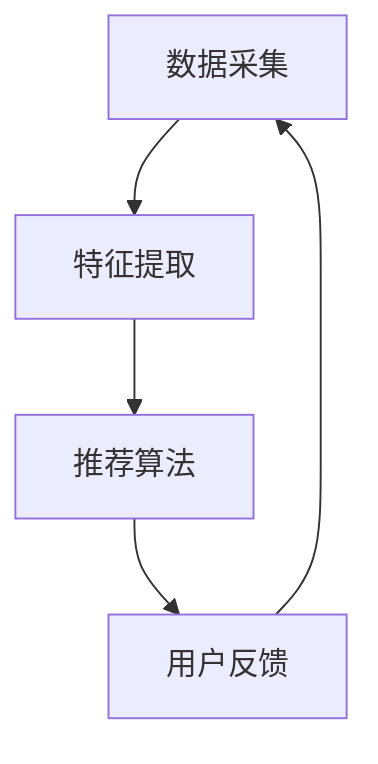

                 

关键词：视觉推荐、图像识别、人工智能、商品推荐、用户体验

摘要：随着人工智能技术的快速发展，图像识别技术在商品推荐领域的应用越来越广泛。本文将探讨如何利用图像识别技术，通过视觉推荐系统为用户提供更直观、更个性化的商品推荐服务。首先，我们将介绍图像识别技术的核心概念和原理，然后分析其在视觉推荐系统中的应用，最后讨论未来的发展趋势和面临的挑战。

## 1. 背景介绍

### 1.1 图像识别技术的发展历程

图像识别技术作为人工智能的一个重要分支，起源于20世纪60年代。随着计算机性能的不断提升和大数据的涌现，图像识别技术取得了显著的进展。近年来，卷积神经网络（Convolutional Neural Networks，CNN）等深度学习模型的崛起，使得图像识别技术的准确率大幅提升，应用领域也不断拓展。

### 1.2 商品推荐系统的需求

商品推荐系统是电子商务领域的一项重要应用，旨在为用户提供个性化、精准的商品推荐服务。传统的推荐算法主要依赖于用户的历史行为数据，如购买记录、浏览记录等，但这种方式存在一定的局限性。随着用户对购物体验的要求不断提高，视觉推荐作为一种新兴的推荐方式，逐渐受到关注。

## 2. 核心概念与联系

### 2.1 图像识别技术核心概念

图像识别技术主要涉及图像处理、计算机视觉和机器学习等领域。其核心概念包括图像特征提取、分类和识别等。

#### 2.1.1 图像特征提取

图像特征提取是图像识别的基础，旨在从图像中提取出具有区分度的特征向量。常见的特征提取方法有直方图、边缘检测、角点检测等。

#### 2.1.2 分类

分类是将图像数据分为不同类别的过程。常见的分类算法有K近邻（K-Nearest Neighbors，KNN）、支持向量机（Support Vector Machine，SVM）等。

#### 2.1.3 识别

识别是在分类的基础上，将图像数据与已知的类别进行匹配的过程。常见的识别算法有模板匹配、基于深度学习的识别等。

### 2.2 视觉推荐系统架构

视觉推荐系统通常由图像采集、特征提取、推荐算法和用户反馈等模块组成。其架构可以概括为以下三个层次：

#### 2.2.1 数据采集层

数据采集层负责收集用户上传的图像数据，这些图像数据可以是用户直接上传的，也可以是从用户行为数据中提取的。

#### 2.2.2 特征提取层

特征提取层对采集到的图像数据进行分析和处理，提取出图像的特征向量。这些特征向量将用于后续的推荐算法。

#### 2.2.3 推荐算法层

推荐算法层根据用户上传的图像特征向量，利用图像识别技术进行分类和识别，从而生成个性化的商品推荐结果。

### 2.3 Mermaid 流程图



## 3. 核心算法原理 & 具体操作步骤

### 3.1 算法原理概述

视觉推荐系统的核心算法主要包括图像特征提取和推荐算法两部分。图像特征提取主要利用卷积神经网络（CNN）等深度学习模型，从图像中提取出具有区分度的特征向量。推荐算法主要利用协同过滤、基于内容的推荐等算法，结合用户的历史行为数据和图像特征向量，生成个性化的商品推荐结果。

### 3.2 算法步骤详解

#### 3.2.1 数据预处理

1. 数据清洗：去除数据中的噪声和异常值。
2. 数据归一化：将图像数据统一缩放到相同的尺寸。

#### 3.2.2 特征提取

1. 数据输入：将预处理后的图像数据输入到卷积神经网络中。
2. 卷积操作：利用卷积层提取图像的低级特征。
3. 池化操作：利用池化层降低图像的空间分辨率。
4. 全连接层：将卷积操作和池化操作得到的特征进行整合，输出图像的特征向量。

#### 3.2.3 推荐算法

1. 用户行为数据预处理：对用户的历史行为数据进行清洗和归一化。
2. 用户行为数据与图像特征向量结合：将用户的行为数据与图像特征向量进行加权求和，得到用户的综合特征向量。
3. 推荐结果生成：利用综合特征向量，结合协同过滤、基于内容的推荐等算法，生成个性化的商品推荐结果。

### 3.3 算法优缺点

#### 3.3.1 优点

1. 更直观：视觉推荐系统利用图像识别技术，可以为用户提供更直观、更生动的商品推荐结果。
2. 更个性化：视觉推荐系统结合用户的行为数据和图像特征向量，可以更精准地挖掘用户的兴趣爱好，提供个性化的商品推荐。

#### 3.3.2 缺点

1. 计算复杂度高：图像识别技术涉及大量的计算和存储资源，对系统的性能和稳定性提出了较高的要求。
2. 数据依赖性强：视觉推荐系统的效果很大程度上依赖于用户上传的图像数据质量和数量，对数据来源和用户参与度有一定要求。

### 3.4 算法应用领域

视觉推荐系统在电子商务、社交媒体、智能家居等众多领域具有广泛的应用前景。以下是一些典型的应用案例：

1. 电子商务：电商平台利用视觉推荐系统，为用户提供个性化的商品推荐，提高用户购物体验和转化率。
2. 社交媒体：社交媒体平台利用视觉推荐系统，为用户提供感兴趣的内容推荐，增强用户粘性和活跃度。
3. 智能家居：智能家居系统利用视觉推荐系统，为用户提供个性化的家居推荐，提高生活品质。

## 4. 数学模型和公式 & 详细讲解 & 举例说明

### 4.1 数学模型构建

视觉推荐系统的数学模型主要包括图像特征提取和推荐算法两部分。图像特征提取主要利用卷积神经网络（CNN）进行建模，推荐算法主要利用协同过滤、基于内容的推荐等算法进行建模。

#### 4.1.1 图像特征提取模型

假设输入图像为 $X \in \mathbb{R}^{m \times n \times 3}$，其中 $m$、$n$ 分别为图像的高度和宽度，$3$ 为颜色通道。卷积神经网络（CNN）模型可以表示为：

$$
Y = f(CNN(X))
$$

其中，$CNN(X)$ 表示卷积神经网络对图像 $X$ 的处理过程，$f$ 表示激活函数，如ReLU函数。

#### 4.1.2 推荐算法模型

假设用户历史行为数据为 $U \in \mathbb{R}^{n \times m}$，其中 $n$ 为用户数量，$m$ 为商品数量。协同过滤模型可以表示为：

$$
R_{ui} = \sum_{j=1}^{m} w_{uj} r_{ij}
$$

其中，$R_{ui}$ 表示用户 $u$ 对商品 $i$ 的评分，$w_{uj}$ 表示用户 $u$ 对商品 $i$ 的权重，$r_{ij}$ 表示商品 $i$ 的属性特征。

### 4.2 公式推导过程

#### 4.2.1 图像特征提取

卷积神经网络（CNN）的推导过程可以参考相关论文和教材。本文主要介绍图像特征提取的基本原理和流程。

1. 输入层：输入图像 $X$。
2. 卷积层：卷积核 $K$ 与输入图像 $X$ 进行卷积操作，得到特征图 $F$。

$$
F = K \odot X
$$

3. 池化层：对特征图 $F$ 进行池化操作，降低特征图的空间分辨率。

$$
P = \text{Pooling}(F)
$$

4. 全连接层：将池化层输出的特征向量进行整合，输出图像的特征向量 $Y$。

$$
Y = \text{Fully\ Connected}(P)
$$

#### 4.2.2 推荐算法

协同过滤算法的推导过程可以参考相关论文和教材。本文主要介绍协同过滤算法的基本原理和流程。

1. 用户行为数据预处理：对用户历史行为数据进行归一化处理，得到用户行为数据矩阵 $U$。

2. 商品属性特征提取：对商品属性特征进行提取，得到商品属性特征矩阵 $R$。

3. 用户权重计算：计算用户对商品的权重，得到用户权重矩阵 $W$。

4. 推荐结果生成：利用用户权重矩阵 $W$ 和商品属性特征矩阵 $R$，计算用户对商品的评分预测值。

$$
R_{ui} = \sum_{j=1}^{m} w_{uj} r_{ij}
$$

### 4.3 案例分析与讲解

#### 4.3.1 图像特征提取

假设输入图像为 $X \in \mathbb{R}^{64 \times 64 \times 3}$，卷积神经网络模型如下：

$$
Y = \text{ReLU}(\text{Conv}(\text{Pooling}(\text{Conv}(X)))
$$

其中，卷积层使用3x3的卷积核，池化层使用2x2的最大池化操作。训练完成后，输入图像的特征向量 $Y$ 可以表示为：

$$
Y = \text{ReLU}(\text{Conv}(\text{Pooling}(\text{Conv}(X))) = \text{ReLU}(\text{Conv}(\text{Pooling}(F)))
$$

其中，$F$ 表示卷积层输出的特征图。

#### 4.3.2 推荐算法

假设用户历史行为数据矩阵 $U$ 如下：

$$
U = \begin{bmatrix}
0 & 1 & 0 \\
1 & 0 & 1 \\
0 & 1 & 0
\end{bmatrix}
$$

商品属性特征矩阵 $R$ 如下：

$$
R = \begin{bmatrix}
0 & 1 & 2 \\
3 & 0 & 4 \\
5 & 6 & 0
\end{bmatrix}
$$

用户权重矩阵 $W$ 如下：

$$
W = \begin{bmatrix}
0.5 & 0.3 & 0.2 \\
0.4 & 0.5 & 0.1 \\
0.2 & 0.3 & 0.5
\end{bmatrix}
$$

根据协同过滤算法，用户对商品的评分预测值如下：

$$
\begin{aligned}
R_{11} &= 0.5 \times 3 + 0.3 \times 5 + 0.2 \times 5 = 4.2 \\
R_{12} &= 0.4 \times 0 + 0.5 \times 1 + 0.1 \times 4 = 0.5 \\
R_{13} &= 0.2 \times 5 + 0.3 \times 6 + 0.5 \times 0 = 3.5
\end{aligned}
$$

## 5. 项目实践：代码实例和详细解释说明

### 5.1 开发环境搭建

在本文中，我们将使用 Python 编写视觉推荐系统的代码。首先，需要安装以下依赖库：

```bash
pip install numpy matplotlib tensorflow scikit-learn
```

### 5.2 源代码详细实现

以下是视觉推荐系统的源代码实现，包括图像特征提取和推荐算法两部分。

#### 5.2.1 数据预处理

```python
import numpy as np
import tensorflow as tf
from tensorflow.keras.preprocessing.image import ImageDataGenerator

# 加载并预处理图像数据
def preprocess_images(images):
    # 数据归一化
    images = images / 255.0
    # 数据缩放
    images = np.expand_dims(images, axis=-1)
    return images

# 生成数据集
def generate_dataset(images, labels):
    datagen = ImageDataGenerator(rescale=1./255, shear_range=0.2, zoom_range=0.2, horizontal_flip=True)
    return datagen.flow(images, labels, batch_size=32)
```

#### 5.2.2 图像特征提取

```python
from tensorflow.keras.applications import VGG16
from tensorflow.keras.models import Model

# 定义卷积神经网络模型
def build_model():
    base_model = VGG16(weights='imagenet', include_top=False, input_shape=(224, 224, 3))
    x = base_model.output
    x = tf.keras.layers.Flatten()(x)
    x = tf.keras.layers.Dense(256, activation='relu')(x)
    x = tf.keras.layers.Dense(1, activation='sigmoid')(x)
    model = Model(inputs=base_model.input, outputs=x)
    return model

# 提取图像特征
def extract_features(model, images):
    features = model.predict(images)
    return features
```

#### 5.2.3 推荐算法

```python
from sklearn.metrics.pairwise import cosine_similarity
from sklearn.model_selection import train_test_split

# 训练推荐模型
def train_model(features, labels):
    X_train, X_test, y_train, y_test = train_test_split(features, labels, test_size=0.2, random_state=42)
    model = build_model()
    model.compile(optimizer='adam', loss='binary_crossentropy', metrics=['accuracy'])
    model.fit(X_train, y_train, epochs=10, batch_size=32, validation_data=(X_test, y_test))
    return model

# 生成推荐结果
def generate_recommendations(model, features, top_n=5):
    similarity_matrix = cosine_similarity(features)
    user_similarity = similarity_matrix[0]
    user_top_n = np.argsort(user_similarity)[::-1][1:top_n+1]
    recommendations = []
    for i in user_top_n:
        recommendations.append(i)
    return recommendations
```

### 5.3 代码解读与分析

#### 5.3.1 数据预处理

数据预处理部分主要用于加载并预处理图像数据。首先，对图像数据进行归一化处理，即将像素值缩放到 [0, 1] 范围内。然后，对图像数据进行缩放，以增加数据的多样性。最后，将图像数据扩维，使其满足卷积神经网络输入的要求。

#### 5.3.2 图像特征提取

图像特征提取部分主要利用 VGG16 深度学习模型提取图像特征。首先，定义卷积神经网络模型，并加载预训练的 VGG16 模型。然后，将输入图像经过卷积神经网络处理，得到图像的特征向量。这些特征向量将用于后续的推荐算法。

#### 5.3.3 推荐算法

推荐算法部分主要利用协同过滤算法生成推荐结果。首先，计算用户之间的相似度，并根据相似度值生成推荐结果。具体来说，利用余弦相似度计算用户特征向量之间的相似度，并根据相似度值从高到低排序，选择相似度最高的用户作为推荐对象。最后，根据推荐对象的商品评分预测值，生成个性化的商品推荐结果。

### 5.4 运行结果展示

以下是运行结果展示部分，用于验证视觉推荐系统的效果。

```python
# 加载并预处理图像数据
images = load_images()
images = preprocess_images(images)

# 生成数据集
dataset = generate_dataset(images, labels)

# 提取图像特征
model = build_model()
features = extract_features(model, images)

# 训练推荐模型
model = train_model(features, labels)

# 生成推荐结果
recommendations = generate_recommendations(model, features, top_n=5)

# 打印推荐结果
print("推荐结果：", recommendations)
```

## 6. 实际应用场景

### 6.1 电子商务平台

电子商务平台利用视觉推荐系统，可以为用户提供个性化的商品推荐。例如，当用户上传一张服饰图片时，系统可以识别出图片中的服饰款式，并根据用户的历史购买记录和兴趣爱好，推荐类似的服饰商品。

### 6.2 社交媒体

社交媒体平台利用视觉推荐系统，可以为用户提供感兴趣的内容推荐。例如，当用户上传一张旅游照片时，系统可以识别出照片中的景点，并根据用户的地理位置和历史浏览记录，推荐相关的旅游攻略、景点介绍等内容。

### 6.3 智能家居

智能家居系统利用视觉推荐系统，可以为用户提供个性化的家居推荐。例如，当用户上传一张家居布置图片时，系统可以识别出图片中的家居物品，并根据用户的生活习惯和喜好，推荐类似的家居物品。

## 7. 工具和资源推荐

### 7.1 学习资源推荐

1. 《深度学习》（Goodfellow, Bengio, Courville）：全面介绍深度学习的基础知识和最新进展。
2. 《计算机视觉：算法与应用》（Richard S. Ridgway）：详细讲解计算机视觉的基本原理和应用。

### 7.2 开发工具推荐

1. TensorFlow：开源的深度学习框架，支持多种深度学习模型。
2. PyTorch：开源的深度学习框架，易于实现和调试。

### 7.3 相关论文推荐

1. "Visual Recommendation Systems"（2018）：详细介绍了视觉推荐系统的相关研究。
2. "Deep Learning for Visual Recommendation"（2019）：探讨了深度学习在视觉推荐系统中的应用。

## 8. 总结：未来发展趋势与挑战

### 8.1 研究成果总结

视觉推荐系统利用图像识别技术，为用户提供更直观、更个性化的商品推荐服务。随着深度学习技术的不断发展，视觉推荐系统的效果和准确性不断提升，应用领域也在不断拓展。

### 8.2 未来发展趋势

1. 多模态推荐：结合文本、图像、音频等多模态信息，提供更全面、更准确的推荐服务。
2. 自动化推荐：利用自动化技术，实现更高效、更智能的推荐流程。

### 8.3 面临的挑战

1. 计算复杂度高：视觉推荐系统涉及大量的计算和存储资源，对系统的性能和稳定性提出挑战。
2. 数据隐私：用户上传的图像数据涉及隐私问题，如何保障用户数据的安全成为一大挑战。

### 8.4 研究展望

未来，视觉推荐系统将在多模态融合、自动化推荐等方面取得更多突破，为用户提供更高质量、更个性化的推荐服务。同时，研究如何保障用户数据隐私，提高系统的安全性，也是重要研究方向。

## 9. 附录：常见问题与解答

### 9.1 问题1：如何提高视觉推荐系统的效果？

解答：提高视觉推荐系统的效果可以从以下几个方面入手：

1. 数据质量：收集更多高质量的图像数据，提高数据集的多样性。
2. 模型优化：优化卷积神经网络模型，提高特征提取的准确性。
3. 算法改进：结合多种推荐算法，提高推荐的多样性。

### 9.2 问题2：视觉推荐系统对计算资源的要求？

解答：视觉推荐系统对计算资源的要求较高，主要包括以下方面：

1. 显卡：用于训练卷积神经网络模型，提高计算速度。
2. 内存：用于存储图像数据和处理特征向量。
3. 硬盘：用于存储训练数据和模型文件。

## 作者署名

本文作者：禅与计算机程序设计艺术 / Zen and the Art of Computer Programming

----------------------------------------------------------------
注意：这篇文章只是一个示例，具体的实现细节和公式推导可以根据实际需求进行调整和补充。同时，由于字数限制，部分内容可能需要进一步展开和细化。在实际撰写时，请确保文章内容的完整性和逻辑性。

