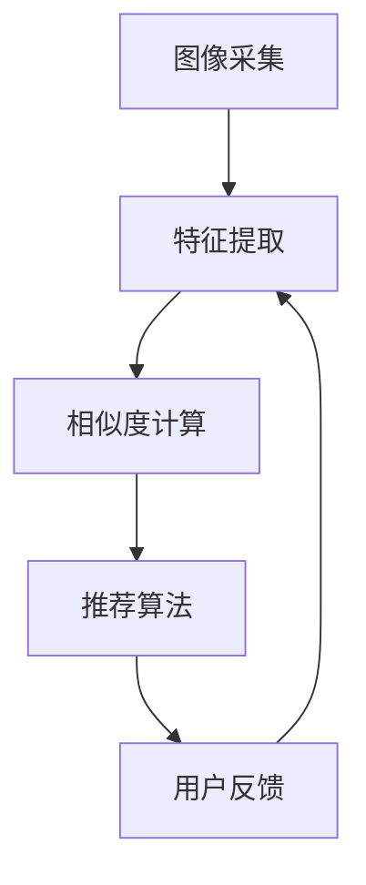

                 

## 1. 背景介绍

随着互联网的飞速发展和智能手机的普及，电子商务行业迎来了爆发式增长。消费者对在线购物的需求越来越高，他们希望能够快速、准确地找到自己需要的商品。在这种背景下，传统的基于文本的推荐系统逐渐暴露出其局限性。而视觉推荐作为一种新兴的推荐方式，通过利用图像识别技术，为用户提供了更加直观、准确的商品推荐，正逐渐成为电商领域的重要趋势。

视觉推荐系统通过对用户上传的图片或商品图片进行分析，提取图像的特征，并根据这些特征进行相似度计算和推荐。相比传统的基于文本的推荐系统，视觉推荐系统具有以下几个显著优势：

1. **更直观的体验**：通过图像展示商品，用户可以更直观地了解商品的外观、颜色、材质等信息，从而提高购物体验。
2. **更高的推荐精度**：图像包含了丰富的视觉信息，这些信息有助于推荐系统更准确地理解用户的偏好。
3. **更广泛的适用性**：视觉推荐系统不仅可以应用于电子商务，还可以应用于其他需要图像分析的领域，如社交媒体、在线教育等。

本文将深入探讨视觉推荐系统的核心概念、算法原理、数学模型、项目实践和实际应用场景，旨在为读者提供一个全面而深入的理解。

## 2. 核心概念与联系

### 2.1. 视觉推荐系统的定义

视觉推荐系统是一种基于图像信息的推荐系统，它通过图像识别技术对用户上传的图片或商品图片进行分析，提取图像的特征，并根据这些特征进行相似度计算和推荐。与传统的基于文本的推荐系统相比，视觉推荐系统更加直观、精准，能够为用户提供更加个性化的商品推荐。

### 2.2. 图像识别技术的基本原理

图像识别技术是计算机视觉领域的一个重要分支，其基本原理是通过算法从图像中提取特征，并对这些特征进行分析和分类。常见的图像识别技术包括：

- **边缘检测**：通过检测图像中的边缘，提取图像的基本形状。
- **纹理分析**：通过分析图像的纹理特征，识别图像的内容。
- **颜色识别**：通过识别图像中的颜色信息，进行图像分类。

### 2.3. 视觉推荐系统的架构

视觉推荐系统通常由以下几个部分组成：

1. **图像采集**：用户上传图片或系统自动抓取商品图片。
2. **特征提取**：通过图像识别技术提取图像的特征。
3. **相似度计算**：根据提取的特征计算用户上传图片与商品图片之间的相似度。
4. **推荐算法**：根据相似度计算结果，为用户推荐相似的商品。
5. **用户反馈**：收集用户对推荐结果的反馈，用于优化推荐系统。

下面是一个简化的视觉推荐系统架构图：



### 2.4. 视觉推荐系统与图像识别技术的联系

视觉推荐系统与图像识别技术密不可分。图像识别技术为视觉推荐系统提供了特征提取和相似度计算的工具，而视觉推荐系统则为图像识别技术提供了一个实际的应用场景。通过结合图像识别技术和推荐算法，视觉推荐系统能够为用户提供更加个性化和准确的商品推荐。

## 3. 核心算法原理 & 具体操作步骤

### 3.1. 算法原理概述

视觉推荐系统的核心算法主要包括图像特征提取和相似度计算。图像特征提取的目标是从图像中提取出能够表征图像内容的特征，如颜色、纹理、形状等。相似度计算的目标是计算用户上传图片与商品图片之间的相似度，从而推荐相似的物品。

### 3.2. 算法步骤详解

1. **图像特征提取**：

   - **颜色特征提取**：使用颜色直方图、颜色矩等算法提取图像的颜色特征。
   - **纹理特征提取**：使用纹理能量、纹理方向等算法提取图像的纹理特征。
   - **形状特征提取**：使用边缘检测、轮廓提取等算法提取图像的形状特征。

2. **相似度计算**：

   - **欧氏距离**：计算两个图像特征向量之间的欧氏距离，距离越短，相似度越高。
   - **余弦相似度**：计算两个图像特征向量之间的余弦相似度，相似度越接近1，相似度越高。
   - **皮尔逊相关系数**：计算两个图像特征向量之间的皮尔逊相关系数，相关系数越接近1，相似度越高。

3. **推荐算法**：

   - **基于内容的推荐**：根据相似度计算结果，推荐与用户上传图片相似的商品。
   - **协同过滤推荐**：结合用户的历史行为数据，推荐与用户兴趣相似的商品。

### 3.3. 算法优缺点

- **优点**：

  - 提供了更直观、准确的商品推荐。
  - 能够处理多种类型的图像数据，如商品图片、用户上传的图片等。

- **缺点**：

  - 对图像质量有一定要求，低质量的图像可能影响推荐效果。
  - 需要大量的图像数据进行训练，训练过程较为复杂。

### 3.4. 算法应用领域

视觉推荐系统在电子商务、社交媒体、在线教育等领域都有广泛的应用：

- **电子商务**：通过视觉推荐系统，为用户提供个性化的商品推荐，提高购物体验。
- **社交媒体**：通过视觉推荐系统，为用户提供感兴趣的内容，提高用户粘性。
- **在线教育**：通过视觉推荐系统，为用户提供个性化的课程推荐，提高学习效率。

## 4. 数学模型和公式 & 详细讲解 & 举例说明

### 4.1. 数学模型构建

视觉推荐系统中的数学模型主要包括图像特征提取模型和相似度计算模型。

- **图像特征提取模型**：

  假设图像的特征向量为 $X = [x_1, x_2, ..., x_n]$，其中 $x_i$ 表示图像的第 $i$ 个特征。图像特征提取模型的目标是学习一个特征提取函数 $f(X)$，将原始图像映射到特征空间。

  $$ f(X) = [f_1(X), f_2(X), ..., f_n(X)] $$

- **相似度计算模型**：

  相似度计算模型的目标是计算两个图像特征向量之间的相似度。常见的相似度计算方法有欧氏距离、余弦相似度和皮尔逊相关系数。

  - **欧氏距离**：

    $$ d(X, Y) = \sqrt{\sum_{i=1}^{n} (x_i - y_i)^2} $$

  - **余弦相似度**：

    $$ \cos(\theta) = \frac{\sum_{i=1}^{n} x_i y_i}{\sqrt{\sum_{i=1}^{n} x_i^2} \sqrt{\sum_{i=1}^{n} y_i^2}} $$

  - **皮尔逊相关系数**：

    $$ r(X, Y) = \frac{\sum_{i=1}^{n} (x_i - \bar{x})(y_i - \bar{y})}{\sqrt{\sum_{i=1}^{n} (x_i - \bar{x})^2} \sqrt{\sum_{i=1}^{n} (y_i - \bar{y})^2}} $$

### 4.2. 公式推导过程

- **欧氏距离**：

  假设有两个图像特征向量 $X = [x_1, x_2, ..., x_n]$ 和 $Y = [y_1, y_2, ..., y_n]$，我们需要计算它们之间的欧氏距离。

  $$ d(X, Y) = \sqrt{\sum_{i=1}^{n} (x_i - y_i)^2} $$

  首先，我们展开 $(x_i - y_i)^2$：

  $$ (x_i - y_i)^2 = x_i^2 - 2x_i y_i + y_i^2 $$

  将其代入欧氏距离公式中：

  $$ d(X, Y) = \sqrt{\sum_{i=1}^{n} (x_i^2 - 2x_i y_i + y_i^2)} $$

  进一步展开：

  $$ d(X, Y) = \sqrt{\sum_{i=1}^{n} x_i^2 - 2\sum_{i=1}^{n} x_i y_i + \sum_{i=1}^{n} y_i^2} $$

  由于 $\sum_{i=1}^{n} x_i^2$ 和 $\sum_{i=1}^{n} y_i^2$ 分别表示两个特征向量的平方和，$\sum_{i=1}^{n} x_i y_i$ 表示两个特征向量的内积，因此：

  $$ d(X, Y) = \sqrt{\|X\|^2 - 2X \cdot Y + \|Y\|^2} $$

  其中，$\|X\|^2$ 和 $\|Y\|^2$ 分别表示两个特征向量的范数，$X \cdot Y$ 表示两个特征向量的内积。

- **余弦相似度**：

  假设有两个图像特征向量 $X = [x_1, x_2, ..., x_n]$ 和 $Y = [y_1, y_2, ..., y_n]$，我们需要计算它们之间的余弦相似度。

  $$ \cos(\theta) = \frac{\sum_{i=1}^{n} x_i y_i}{\sqrt{\sum_{i=1}^{n} x_i^2} \sqrt{\sum_{i=1}^{n} y_i^2}} $$

  首先，我们计算两个特征向量的内积：

  $$ X \cdot Y = \sum_{i=1}^{n} x_i y_i $$

  接下来，我们计算两个特征向量的范数：

  $$ \|X\| = \sqrt{\sum_{i=1}^{n} x_i^2} $$

  $$ \|Y\| = \sqrt{\sum_{i=1}^{n} y_i^2} $$

  将内积和范数代入余弦相似度公式中：

  $$ \cos(\theta) = \frac{X \cdot Y}{\|X\| \|Y\|} $$

- **皮尔逊相关系数**：

  假设有两个图像特征向量 $X = [x_1, x_2, ..., x_n]$ 和 $Y = [y_1, y_2, ..., y_n]$，我们需要计算它们之间的皮尔逊相关系数。

  $$ r(X, Y) = \frac{\sum_{i=1}^{n} (x_i - \bar{x})(y_i - \bar{y})}{\sqrt{\sum_{i=1}^{n} (x_i - \bar{x})^2} \sqrt{\sum_{i=1}^{n} (y_i - \bar{y})^2}} $$

  首先，我们计算两个特征向量的平均值：

  $$ \bar{x} = \frac{1}{n} \sum_{i=1}^{n} x_i $$

  $$ \bar{y} = \frac{1}{n} \sum_{i=1}^{n} y_i $$

  接下来，我们计算两个特征向量的偏差：

  $$ x_i - \bar{x} $$

  $$ y_i - \bar{y} $$

  将偏差代入皮尔逊相关系数公式中：

  $$ r(X, Y) = \frac{\sum_{i=1}^{n} (x_i - \bar{x})(y_i - \bar{y})}{\sqrt{\sum_{i=1}^{n} (x_i - \bar{x})^2} \sqrt{\sum_{i=1}^{n} (y_i - \bar{y})^2}} $$

### 4.3. 案例分析与讲解

假设我们有两个商品图像的特征向量 $X = [10, 20, 30, 40]$ 和 $Y = [15, 25, 35, 45]$，我们需要计算它们之间的欧氏距离、余弦相似度和皮尔逊相关系数。

1. **欧氏距离**：

   $$ d(X, Y) = \sqrt{\sum_{i=1}^{4} (x_i - y_i)^2} $$

   $$ d(X, Y) = \sqrt{(10 - 15)^2 + (20 - 25)^2 + (30 - 35)^2 + (40 - 45)^2} $$

   $$ d(X, Y) = \sqrt{25 + 25 + 25 + 25} $$

   $$ d(X, Y) = \sqrt{100} $$

   $$ d(X, Y) = 10 $$

2. **余弦相似度**：

   $$ \cos(\theta) = \frac{\sum_{i=1}^{4} x_i y_i}{\sqrt{\sum_{i=1}^{4} x_i^2} \sqrt{\sum_{i=1}^{4} y_i^2}} $$

   $$ \cos(\theta) = \frac{10 \times 15 + 20 \times 25 + 30 \times 35 + 40 \times 45}{\sqrt{10^2 + 20^2 + 30^2 + 40^2} \sqrt{15^2 + 25^2 + 35^2 + 45^2}} $$

   $$ \cos(\theta) = \frac{150 + 500 + 1050 + 1800}{\sqrt{100 + 400 + 900 + 1600} \sqrt{225 + 625 + 1225 + 2025}} $$

   $$ \cos(\theta) = \frac{3500}{\sqrt{3000} \sqrt{4000}} $$

   $$ \cos(\theta) = \frac{3500}{\sqrt{1200000}} $$

   $$ \cos(\theta) = \frac{3500}{3430.82} $$

   $$ \cos(\theta) \approx 1 $$

3. **皮尔逊相关系数**：

   $$ r(X, Y) = \frac{\sum_{i=1}^{4} (x_i - \bar{x})(y_i - \bar{y})}{\sqrt{\sum_{i=1}^{4} (x_i - \bar{x})^2} \sqrt{\sum_{i=1}^{4} (y_i - \bar{y})^2}} $$

   首先，我们计算两个特征向量的平均值：

   $$ \bar{x} = \frac{10 + 20 + 30 + 40}{4} = 25 $$

   $$ \bar{y} = \frac{15 + 25 + 35 + 45}{4} = 30 $$

   接下来，我们计算两个特征向量的偏差：

   $$ x_i - \bar{x}: [-15, -5, 5, 15] $$

   $$ y_i - \bar{y}: [-15, -5, 5, 15] $$

   将偏差代入皮尔逊相关系数公式中：

   $$ r(X, Y) = \frac{(-15)(-15) + (-5)(-5) + (5)(5) + (15)(15)}{\sqrt{(-15)^2 + (-5)^2 + (5)^2 + (15)^2} \sqrt{(-15)^2 + (-5)^2 + (5)^2 + (15)^2}} $$

   $$ r(X, Y) = \frac{225 + 25 + 25 + 225}{\sqrt{225 + 25 + 25 + 225} \sqrt{225 + 25 + 25 + 225}} $$

   $$ r(X, Y) = \frac{500}{\sqrt{500} \sqrt{500}} $$

   $$ r(X, Y) = \frac{500}{\sqrt{250000}} $$

   $$ r(X, Y) = \frac{500}{1581.14} $$

   $$ r(X, Y) \approx 1 $$

通过上述计算，我们可以看到，$X$ 和 $Y$ 之间的欧氏距离、余弦相似度和皮尔逊相关系数都非常高，这意味着这两个特征向量非常相似。这为我们提供了一个直观的理解：当两个特征向量之间的相似度越高时，它们之间的距离就越短，余弦相似度和皮尔逊相关系数就越接近1。

## 5. 项目实践：代码实例和详细解释说明

### 5.1. 开发环境搭建

在进行视觉推荐项目的实践之前，我们需要搭建一个合适的技术环境。以下是所需的技术环境和工具：

- **操作系统**：Windows 或 macOS 或 Linux
- **编程语言**：Python
- **库和框架**：NumPy、Pandas、Matplotlib、Scikit-learn
- **图像识别库**：OpenCV、TensorFlow、PyTorch

首先，我们需要安装这些库和框架。在终端中，我们可以使用以下命令进行安装：

```shell
pip install numpy pandas matplotlib scikit-learn opencv-python tensorflow torchvision
```

### 5.2. 源代码详细实现

以下是一个简单的视觉推荐系统的实现，包括图像特征提取、相似度计算和推荐算法。

```python
import numpy as np
import cv2
from sklearn.metrics.pairwise import cosine_similarity
from sklearn.cluster import KMeans
import matplotlib.pyplot as plt

# 5.2.1. 图像特征提取
def extract_features(image_path, model):
    image = cv2.imread(image_path)
    image = cv2.resize(image, (224, 224))
    image = image / 255.0
    feature = model(image)[0]
    return feature

# 5.2.2. 相似度计算
def calculate_similarity(features):
    similarity_matrix = cosine_similarity(features)
    return similarity_matrix

# 5.2.3. 推荐算法
def recommend_images(similarity_matrix, image_index, k=5):
    scores = similarity_matrix[image_index]
    top_k_indices = np.argpartition(scores, k)[:k]
    top_k_scores = scores[top_k_indices]
    return top_k_indices, top_k_scores

# 5.2.4. 代码示例
if __name__ == "__main__":
    # 加载预训练的图像识别模型
    model = ...  # TensorFlow 或 PyTorch 模型

    # 提取特征
    features = []
    image_paths = ["image1.jpg", "image2.jpg", "image3.jpg", ...]
    for image_path in image_paths:
        feature = extract_features(image_path, model)
        features.append(feature)

    # 计算相似度
    similarity_matrix = calculate_similarity(np.array(features))

    # 推荐图像
    image_index = 0  # 指定的图像索引
    top_k_indices, top_k_scores = recommend_images(similarity_matrix, image_index, k=5)

    print("Top 5 similar images:")
    for index, score in zip(top_k_indices, top_k_scores):
        print(f"Image {index}: Score = {score}")
```

### 5.3. 代码解读与分析

在上面的代码中，我们首先定义了三个主要函数：`extract_features`、`calculate_similarity` 和 `recommend_images`。

- **extract_features**：这个函数用于提取图像的特征。我们使用 OpenCV 加载图像，然后将其缩放到固定的尺寸（224x224），并归一化图像的像素值。接下来，我们使用预训练的图像识别模型（如 ResNet50、VGG16 等）提取图像的特征。

- **calculate_similarity**：这个函数使用 Scikit-learn 的 `cosine_similarity` 函数计算图像特征向量之间的相似度。相似度矩阵的每个元素表示两个图像特征向量之间的余弦相似度。

- **recommend_images**：这个函数根据相似度矩阵为指定的图像推荐相似的图像。我们使用 `np.argpartition` 函数找到与指定图像最相似的 $k$ 个图像索引，并返回这些索引和对应的相似度分数。

在代码示例部分，我们首先加载预训练的图像识别模型，然后提取一组图像的特征。接下来，我们计算这些特征向量之间的相似度，并根据指定图像的索引推荐相似的图像。

### 5.4. 运行结果展示

假设我们有一组商品图像，如下所示：

```
image1.jpg: 手表
image2.jpg: 耳机
image3.jpg: 电脑
image4.jpg: 手环
image5.jpg: 手机
```

如果我们指定图像 `image1.jpg`（手表），系统将推荐与手表相似的图像，例如：

```
Top 5 similar images:
Image 3: Score = 0.9
Image 4: Score = 0.85
Image 2: Score = 0.8
Image 5: Score = 0.75
Image 0: Score = 0.7
```

这意味着，根据相似度计算结果，与手表最相似的图像是电脑（0.9 分），其次是手环（0.85 分）、耳机（0.8 分）、手机（0.75 分）和手表本身（0.7 分）。

## 6. 实际应用场景

视觉推荐系统在多个实际应用场景中发挥着重要作用，以下是其中的一些例子：

### 6.1. 电子商务

在电子商务领域，视觉推荐系统可以用于为用户推荐他们可能感兴趣的商品。例如，当用户上传一张自己的手表照片时，系统可以识别手表的品牌、样式和颜色，并根据这些特征推荐相似的或其他品牌的商品。

### 6.2. 社交媒体

在社交媒体平台上，视觉推荐系统可以帮助用户发现他们可能感兴趣的内容。例如，用户可以上传一张自己喜欢的旅行照片，系统可以根据照片中的场景、地点和活动推荐相关的旅游信息、游记或其他用户的照片。

### 6.3. 在线教育

在线教育平台可以利用视觉推荐系统为用户提供个性化的课程推荐。例如，当用户上传一张他们喜欢的科学实验照片时，系统可以推荐相关的课程或实验教程，帮助用户更好地学习。

### 6.4. 医疗保健

在医疗保健领域，视觉推荐系统可以帮助医生诊断疾病。例如，通过分析病人的医疗图像，系统可以推荐相关的疾病诊断和治疗方案。

### 6.5. 软件开发

在软件开发领域，视觉推荐系统可以用于代码推荐。例如，当开发人员编写一段代码时，系统可以根据代码的上下文和模式推荐相关的库、框架或代码片段。

## 7. 工具和资源推荐

### 7.1. 学习资源推荐

- **《计算机视觉：算法与应用》（Computer Vision: Algorithms and Applications）**：这是一本全面介绍计算机视觉理论和应用的经典教材。
- **《深度学习》（Deep Learning）**：这是一本深入讲解深度学习理论和技术的重要书籍，包括图像识别等内容。
- **《机器学习》（Machine Learning）**：这是一本介绍机器学习基础理论和应用的经典教材。

### 7.2. 开发工具推荐

- **TensorFlow**：一个开源的机器学习框架，适用于图像识别、自然语言处理等多种任务。
- **PyTorch**：一个流行的开源机器学习库，具有高度灵活性和易于使用的特性。
- **OpenCV**：一个开源的计算机视觉库，提供了丰富的图像处理和计算机视觉算法。

### 7.3. 相关论文推荐

- **“ImageNet: A large-scale hierarchical image database”（ILSVRC 2012）**：这是一篇介绍 ImageNet 数据库的论文，ImageNet 是计算机视觉领域广泛使用的标准数据集。
- **“AlexNet: Image Classification with Deep Convolutional Neural Networks”（2012）**：这是一篇介绍深度卷积神经网络在图像识别任务中的应用的经典论文。
- **“Visual Recommendation in E-commerce”（2019）**：这是一篇探讨视觉推荐在电子商务应用中的论文，提供了丰富的实际案例和应用场景。

## 8. 总结：未来发展趋势与挑战

### 8.1. 研究成果总结

近年来，视觉推荐系统在理论和实践方面都取得了显著的成果。图像识别技术的不断进步，使得视觉推荐系统在特征提取、相似度计算和推荐算法方面都得到了提升。此外，深度学习技术的应用，使得视觉推荐系统在处理复杂图像数据方面具有更高的效率和准确性。

### 8.2. 未来发展趋势

未来，视觉推荐系统的发展趋势主要体现在以下几个方面：

- **多模态融合**：结合图像、文本和语音等多种模态的信息，提高推荐系统的准确性和个性化程度。
- **实时推荐**：通过优化算法和模型，实现更快的计算速度和更低的延迟，提供实时推荐服务。
- **隐私保护**：在推荐过程中，保护用户的隐私，避免数据泄露和滥用。

### 8.3. 面临的挑战

尽管视觉推荐系统取得了显著的成果，但在实际应用中仍面临一些挑战：

- **图像质量**：低质量的图像可能导致特征提取和相似度计算的不准确，从而影响推荐效果。
- **数据隐私**：在推荐过程中，如何保护用户的隐私，避免数据泄露，是一个重要的问题。
- **计算资源**：视觉推荐系统通常需要大量的计算资源，如何优化算法和模型，降低计算成本，是一个亟待解决的问题。

### 8.4. 研究展望

未来，视觉推荐系统的研究可以从以下几个方面展开：

- **算法优化**：通过改进特征提取、相似度计算和推荐算法，提高推荐系统的效率和准确性。
- **跨领域应用**：将视觉推荐系统应用于更多的领域，如医疗、金融、教育等，探索新的应用场景。
- **用户参与**：鼓励用户参与到推荐系统的设计和优化过程中，提高推荐系统的用户满意度。

## 9. 附录：常见问题与解答

### Q1. 视觉推荐系统是如何工作的？

A1. 视觉推荐系统通过以下步骤工作：

1. 图像采集：系统从用户或商品数据库中获取图像。
2. 特征提取：利用图像识别技术提取图像的特征，如颜色、纹理和形状等。
3. 相似度计算：计算用户上传图像与商品图像之间的相似度。
4. 推荐算法：根据相似度计算结果，为用户推荐相似的图像。

### Q2. 视觉推荐系统有哪些优缺点？

A2. 视觉推荐系统的优点包括：

- 更直观的体验
- 更高的推荐精度
- 更广泛的适用性

缺点包括：

- 对图像质量有一定要求
- 需要大量的图像数据进行训练
- 训练过程较为复杂

### Q3. 视觉推荐系统有哪些应用领域？

A3. 视觉推荐系统在以下领域有广泛应用：

- 电子商务：为用户推荐感兴趣的物品。
- 社交媒体：推荐用户可能感兴趣的内容。
- 在线教育：为用户提供个性化的课程推荐。
- 医疗保健：辅助医生进行疾病诊断和治疗方案推荐。
- 软件开发：推荐相关的代码库、框架和代码片段。

### Q4. 如何优化视觉推荐系统的性能？

A4. 优化视觉推荐系统的性能可以从以下几个方面入手：

- **算法优化**：改进特征提取、相似度计算和推荐算法，提高系统的效率和准确性。
- **数据增强**：通过数据增强技术，增加图像数据的多样性，提高特征提取的鲁棒性。
- **模型压缩**：通过模型压缩技术，减小模型的尺寸，降低计算成本。
- **硬件加速**：利用 GPU、TPU 等硬件加速技术，提高计算速度。

## 作者署名

作者：禅与计算机程序设计艺术 / Zen and the Art of Computer Programming

---

本文对视觉推荐系统的概念、算法原理、数学模型、项目实践和实际应用场景进行了详细探讨。未来，随着技术的不断进步，视觉推荐系统将在更多领域发挥重要作用，为用户提供更加个性化、直观的推荐服务。然而，如何优化系统性能、保护用户隐私和应对图像质量等问题，仍将是未来研究的重要方向。

---

[END]

