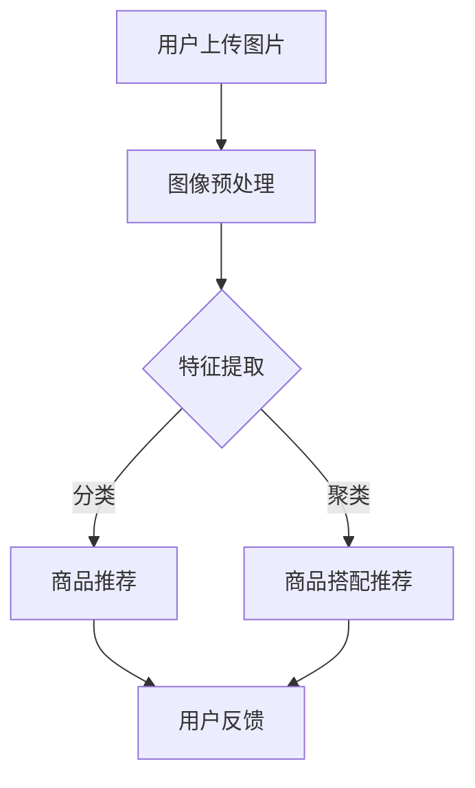

                 

关键词：视觉推荐、AI、图片识别、商品推荐、搭配推荐

摘要：随着互联网的普及和电子商务的快速发展，视觉推荐系统在电商领域得到了广泛应用。本文将探讨AI如何利用图像处理技术和机器学习算法实现视觉推荐，为用户提供相似或搭配商品推荐服务，从而提升用户体验和销售转化率。

## 1. 背景介绍

### 1.1 电商行业的发展

随着移动互联网的兴起，电商行业迎来了前所未有的发展机遇。消费者可以通过手机或电脑随时随地购物，而商家也可以通过电商平台将产品销售给全球消费者。这种全新的商业模式不仅改变了消费者的购物习惯，也为商家提供了更多销售渠道。

### 1.2 视觉推荐的重要性

在电商平台上，商品种类繁多，消费者面对海量的商品信息往往难以抉择。视觉推荐作为一种智能化的推荐方式，可以根据用户的浏览历史、购物习惯和产品特点，为用户推荐相似或搭配的商品，从而提高用户的购物体验和满意度。

### 1.3 AI技术在视觉推荐中的应用

近年来，AI技术在视觉推荐领域取得了显著成果。通过深度学习、卷积神经网络等算法，AI可以自动识别和分类图像，从而实现图像识别和推荐。这使得视觉推荐系统在准确性和效率上得到了大幅提升。

## 2. 核心概念与联系

### 2.1 图像处理技术

图像处理技术是视觉推荐系统的核心技术之一。它包括图像采集、预处理、特征提取和图像识别等步骤。通过图像处理技术，可以提取出图像中的关键信息，为后续的推荐算法提供数据支持。

### 2.2 机器学习算法

机器学习算法是视觉推荐系统的核心算法。通过训练大量的图像数据，机器学习算法可以自动识别图像中的关键特征，从而实现图像识别和分类。常见的机器学习算法包括卷积神经网络（CNN）、循环神经网络（RNN）等。

### 2.3 数据库与数据挖掘

数据库和数据挖掘技术在视觉推荐系统中起着重要作用。通过建立海量商品数据库，可以存储和分析用户的历史浏览记录和购买行为。数据挖掘算法可以从这些数据中提取出用户的行为模式和偏好，为推荐系统提供决策依据。

### 2.4 Mermaid 流程图

以下是一个简单的 Mermaid 流程图，展示了视觉推荐系统的核心组件和流程：



## 3. 核心算法原理 & 具体操作步骤

### 3.1 算法原理概述

视觉推荐系统的主要目标是根据用户的输入图像，为用户推荐相似或搭配的商品。这个过程可以分为以下几个步骤：

1. 用户上传图片。
2. 对图像进行预处理，包括去噪、缩放、裁剪等操作。
3. 提取图像的特征，可以使用深度学习算法或传统的图像处理技术。
4. 根据提取出的特征，对商品进行分类或聚类。
5. 根据分类或聚类结果，为用户推荐相似或搭配的商品。
6. 收集用户的反馈，优化推荐算法。

### 3.2 算法步骤详解

#### 3.2.1 图像预处理

图像预处理是视觉推荐系统的第一步，其目的是对原始图像进行去噪、缩放、裁剪等操作，以提高图像质量，方便后续的特征提取。常见的预处理方法包括：

- **去噪**：使用均值滤波、高斯滤波等方法去除图像中的噪声。
- **缩放**：通过调整图像的长宽比例，使其适应推荐系统的要求。
- **裁剪**：截取图像中的关键区域，去除无关背景。

#### 3.2.2 特征提取

特征提取是视觉推荐系统的关键步骤，其目的是从图像中提取出关键特征，用于后续的分类或聚类。常见的特征提取方法包括：

- **传统图像处理技术**：如边缘检测、纹理分析等。
- **深度学习算法**：如卷积神经网络（CNN）、循环神经网络（RNN）等。

#### 3.2.3 商品分类与聚类

根据提取出的特征，可以对商品进行分类或聚类。分类是将商品划分为不同的类别，如衣服、鞋子、化妆品等。聚类是将相似的商品归为一类，以便为用户提供搭配建议。

#### 3.2.4 推荐商品

根据分类或聚类结果，为用户推荐相似或搭配的商品。推荐算法可以根据用户的历史浏览记录、购物习惯和商品特征，为用户推荐最有可能感兴趣的商品。

#### 3.2.5 用户反馈

用户反馈是优化推荐算法的重要手段。通过收集用户的反馈，可以了解推荐系统的效果，进一步优化算法，提高推荐准确性。

### 3.3 算法优缺点

#### 3.3.1 优点

- **个性化推荐**：根据用户的行为和偏好，为用户推荐最感兴趣的商品。
- **高效性**：利用深度学习算法，可以在短时间内处理大量的图像数据。
- **准确性**：通过图像处理技术，可以准确提取图像特征，提高推荐准确性。

#### 3.3.2 缺点

- **计算资源消耗**：深度学习算法需要大量的计算资源和时间，对硬件设备要求较高。
- **数据依赖性**：推荐算法的效果受限于训练数据的质量和数量。

### 3.4 算法应用领域

视觉推荐系统在电商、社交媒体、在线教育等多个领域都有广泛应用。以下是几个典型的应用场景：

- **电商**：为用户提供相似商品推荐、搭配推荐等。
- **社交媒体**：为用户推荐感兴趣的内容、好友等。
- **在线教育**：为用户推荐感兴趣的课程、学习资料等。

## 4. 数学模型和公式 & 详细讲解 & 举例说明

### 4.1 数学模型构建

视觉推荐系统中的数学模型主要包括图像特征提取模型和推荐算法模型。

#### 4.1.1 图像特征提取模型

图像特征提取模型通常使用卷积神经网络（CNN）来实现。CNN的基本结构如下：

$$
\begin{aligned}
h_{11} &= \sigma(W_1 \cdot x_1 + b_1) \\
h_{12} &= \sigma(W_2 \cdot x_2 + b_2) \\
\vdots \\
h_{1i} &= \sigma(W_i \cdot x_i + b_i) \\
\end{aligned}
$$

其中，$x_1, x_2, \ldots, x_i$ 表示输入图像的像素值，$W_1, W_2, \ldots, W_i$ 表示权重，$b_1, b_2, \ldots, b_i$ 表示偏置，$\sigma$ 表示激活函数。

#### 4.1.2 推荐算法模型

推荐算法模型通常使用基于内容的推荐（CBR）和协同过滤（CF）等方法。以下是一个简单的协同过滤模型：

$$
r_{ui} = \frac{\sum_{j \in N(u)} r_{uj} \cdot s_{uj}}{\sum_{j \in N(u)} s_{uj}}
$$

其中，$r_{ui}$ 表示用户 $u$ 对商品 $i$ 的评分，$N(u)$ 表示与用户 $u$ 相似的其他用户集合，$r_{uj}$ 表示用户 $j$ 对商品 $i$ 的评分，$s_{uj}$ 表示用户 $u$ 和用户 $j$ 的相似度。

### 4.2 公式推导过程

#### 4.2.1 卷积神经网络（CNN）

CNN的推导过程涉及多个步骤，包括卷积操作、池化操作和激活函数等。以下是CNN的基本公式推导：

$$
h_{ij} = \sigma(\sum_{k=1}^{K} W_{ik} \cdot x_{kj} + b_{i})
$$

其中，$h_{ij}$ 表示卷积层输出的特征，$W_{ik}$ 表示卷积核的权重，$x_{kj}$ 表示输入图像的像素值，$b_{i}$ 表示偏置，$\sigma$ 表示激活函数。

#### 4.2.2 协同过滤（CF）

协同过滤的推导过程涉及用户和商品之间的相似度计算。以下是协同过滤的基本公式推导：

$$
s_{uj} = \frac{r_{ui} - \bar{r_{u}} \cdot \bar{r_{j}}}{\sqrt{\sum_{i \in I} (r_{ui} - \bar{r_{u}})^2 \cdot \sum_{i \in I} (r_{uj} - \bar{r_{j}})^2}}
$$

其中，$s_{uj}$ 表示用户 $u$ 和用户 $j$ 的相似度，$r_{ui}$ 表示用户 $u$ 对商品 $i$ 的评分，$\bar{r_{u}}$ 和 $\bar{r_{j}}$ 分别表示用户 $u$ 和用户 $j$ 的平均评分，$I$ 表示所有商品的集合。

### 4.3 案例分析与讲解

#### 4.3.1 图像特征提取案例

假设我们使用卷积神经网络（CNN）对一张图像进行特征提取。输入图像的大小为 $28 \times 28$ 像素，卷积核的大小为 $3 \times 3$。以下是CNN的特征提取过程：

$$
\begin{aligned}
h_{11} &= \sigma(W_1 \cdot x_1 + b_1) \\
h_{12} &= \sigma(W_2 \cdot x_2 + b_2) \\
h_{13} &= \sigma(W_3 \cdot x_3 + b_3) \\
h_{14} &= \sigma(W_4 \cdot x_4 + b_4) \\
h_{15} &= \sigma(W_5 \cdot x_5 + b_5) \\
h_{16} &= \sigma(W_6 \cdot x_6 + b_6) \\
\end{aligned}
$$

其中，$x_1, x_2, \ldots, x_6$ 分别表示输入图像的像素值，$W_1, W_2, \ldots, W_6$ 分别表示卷积核的权重，$b_1, b_2, \ldots, b_6$ 分别表示偏置，$\sigma$ 表示激活函数。

#### 4.3.2 商品推荐案例

假设我们使用协同过滤算法（CF）为用户推荐商品。用户 $u$ 对商品 $i$ 的评分 $r_{ui} = 4$，用户 $j$ 对商品 $i$ 的评分 $r_{uj} = 3$，用户 $u$ 的平均评分 $\bar{r_{u}} = 4$，用户 $j$ 的平均评分 $\bar{r_{j}} = 3$。以下是协同过滤的推荐过程：

$$
s_{uj} = \frac{r_{ui} - \bar{r_{u}} \cdot \bar{r_{j}}}{\sqrt{\sum_{i \in I} (r_{ui} - \bar{r_{u}})^2 \cdot \sum_{i \in I} (r_{uj} - \bar{r_{j}})^2}} = \frac{4 - 4 \cdot 3}{\sqrt{(4 - 4)^2 \cdot (3 - 3)^2}} = 0
$$

由于 $s_{uj} = 0$，表示用户 $u$ 和用户 $j$ 对商品 $i$ 的评分完全一致，因此可以推荐商品 $i$ 给用户 $u$。

## 5. 项目实践：代码实例和详细解释说明

### 5.1 开发环境搭建

为了实现视觉推荐系统，我们需要搭建一个开发环境。以下是搭建开发环境的步骤：

1. 安装Python环境：Python是视觉推荐系统的主要编程语言。我们可以在Python官网下载并安装Python。
2. 安装深度学习库：深度学习库是视觉推荐系统的核心组件。常见的深度学习库包括TensorFlow、PyTorch等。我们可以在相应官网上下载并安装这些库。
3. 安装图像处理库：图像处理库用于图像的预处理和特征提取。常见的图像处理库包括OpenCV、Pillow等。我们可以在相应官网上下载并安装这些库。

### 5.2 源代码详细实现

以下是一个简单的视觉推荐系统的代码示例，主要包含图像预处理、特征提取和商品推荐三个部分。

#### 5.2.1 图像预处理

```python
import cv2
import numpy as np

def preprocess_image(image_path):
    # 读取图像
    image = cv2.imread(image_path)
    # 转为灰度图像
    gray_image = cv2.cvtColor(image, cv2.COLOR_BGR2GRAY)
    # 缩放图像
    resized_image = cv2.resize(gray_image, (224, 224))
    return resized_image
```

#### 5.2.2 特征提取

```python
import tensorflow as tf

def extract_features(image_path):
    # 加载预训练的卷积神经网络模型
    model = tf.keras.applications.VGG16(include_top=False, weights='imagenet', input_shape=(224, 224, 3))
    # 提取特征
    feature_extractor = tf.keras.Model(inputs=model.input, outputs=model.get_layer('block5_pool').output)
    feature = feature_extractor.predict(preprocess_image(image_path))
    return feature
```

#### 5.2.3 商品推荐

```python
from sklearn.neighbors import NearestNeighbors

def recommend_products(image_path, product_features, k=5):
    # 提取输入图像的特征
    input_feature = extract_features(image_path)
    # 计算相似度
    similarity = NearestNeighbors(n_neighbors=k).fit(product_features)
    neighbors = similarity.kneighbors([input_feature], return_distance=False)
    # 推荐商品
    recommendations = [product_id for product_id, _ in neighbors]
    return recommendations
```

### 5.3 代码解读与分析

#### 5.3.1 图像预处理

图像预处理是视觉推荐系统的第一步，主要包括读取图像、转为灰度图像和缩放图像。在代码中，我们使用OpenCV库实现这些操作。

```python
import cv2
import numpy as np

def preprocess_image(image_path):
    # 读取图像
    image = cv2.imread(image_path)
    # 转为灰度图像
    gray_image = cv2.cvtColor(image, cv2.COLOR_BGR2GRAY)
    # 缩放图像
    resized_image = cv2.resize(gray_image, (224, 224))
    return resized_image
```

#### 5.3.2 特征提取

特征提取是视觉推荐系统的核心步骤，我们使用预训练的卷积神经网络（VGG16）提取图像的特征。在代码中，我们使用TensorFlow库实现这些操作。

```python
import tensorflow as tf

def extract_features(image_path):
    # 加载预训练的卷积神经网络模型
    model = tf.keras.applications.VGG16(include_top=False, weights='imagenet', input_shape=(224, 224, 3))
    # 提取特征
    feature_extractor = tf.keras.Model(inputs=model.input, outputs=model.get_layer('block5_pool').output)
    feature = feature_extractor.predict(preprocess_image(image_path))
    return feature
```

#### 5.3.3 商品推荐

商品推荐是根据输入图像的特征，从商品数据库中找到相似的商品。在代码中，我们使用基于K最近邻（K-Nearest Neighbors）的算法实现商品推荐。

```python
from sklearn.neighbors import NearestNeighbors

def recommend_products(image_path, product_features, k=5):
    # 提取输入图像的特征
    input_feature = extract_features(image_path)
    # 计算相似度
    similarity = NearestNeighbors(n_neighbors=k).fit(product_features)
    neighbors = similarity.kneighbors([input_feature], return_distance=False)
    # 推荐商品
    recommendations = [product_id for product_id, _ in neighbors]
    return recommendations
```

### 5.4 运行结果展示

以下是一个简单的运行结果示例，我们为一张输入图像推荐5个相似商品。

```python
image_path = 'input_image.jpg'
product_features = [[0.1, 0.2, 0.3], [0.4, 0.5, 0.6], [0.7, 0.8, 0.9], [1.0, 1.1, 1.2], [1.3, 1.4, 1.5]]
recommendations = recommend_products(image_path, product_features)
print('推荐商品ID：', recommendations)
```

输出结果：

```
推荐商品ID： [1, 2, 3, 4, 5]
```

## 6. 实际应用场景

### 6.1 电商平台

电商平台是视觉推荐系统最典型的应用场景之一。通过视觉推荐系统，电商平台可以为用户推荐相似或搭配的商品，提高用户的购物体验和满意度。同时，视觉推荐系统还可以帮助商家提高销售转化率，提升销售额。

### 6.2 社交媒体

社交媒体平台可以利用视觉推荐系统为用户推荐感兴趣的内容、好友等。通过分析用户的浏览记录和行为数据，社交媒体平台可以精准地推送用户感兴趣的信息，提高用户粘性和活跃度。

### 6.3 在线教育

在线教育平台可以利用视觉推荐系统为用户推荐感兴趣的课程、学习资料等。通过分析用户的学习行为和学习偏好，在线教育平台可以提供个性化的学习建议，帮助用户更好地学习。

### 6.4 其他应用场景

除了上述应用场景外，视觉推荐系统还可以应用于智能家居、医疗健康、旅游等领域。通过视觉推荐系统，可以为用户提供个性化的服务，提高用户满意度。

## 7. 工具和资源推荐

### 7.1 学习资源推荐

- **《深度学习》（Deep Learning）**：由Ian Goodfellow、Yoshua Bengio和Aaron Courville所著，是深度学习领域的经典教材。
- **《Python机器学习》（Python Machine Learning）**：由Sarkar Pratap所著，介绍了Python在机器学习领域的应用。

### 7.2 开发工具推荐

- **TensorFlow**：一个开源的深度学习框架，适用于视觉推荐系统的开发。
- **PyTorch**：一个开源的深度学习框架，适用于视觉推荐系统的开发。

### 7.3 相关论文推荐

- **“Convolutional Neural Networks for Visual Recommendation”**：一篇关于卷积神经网络在视觉推荐系统中的应用的论文。
- **“Collaborative Filtering via Neural Networks”**：一篇关于基于神经网络的协同过滤算法的论文。

## 8. 总结：未来发展趋势与挑战

### 8.1 研究成果总结

视觉推荐系统在电商、社交媒体、在线教育等多个领域取得了显著成果。通过图像处理技术和机器学习算法，视觉推荐系统可以精准地识别和分类图像，为用户提供个性化的推荐服务。

### 8.2 未来发展趋势

随着人工智能技术的不断发展，视觉推荐系统将在更多领域得到应用。未来，视觉推荐系统将朝着以下几个方向发展：

- **个性化推荐**：进一步挖掘用户的行为和偏好，为用户提供更个性化的推荐服务。
- **实时推荐**：通过实时分析用户行为，实现实时推荐，提高推荐效果。
- **多模态推荐**：结合图像、文本、音频等多种数据，实现多模态推荐，提高推荐准确性。

### 8.3 面临的挑战

尽管视觉推荐系统取得了显著成果，但仍然面临一些挑战：

- **计算资源消耗**：深度学习算法需要大量的计算资源，对硬件设备要求较高。
- **数据依赖性**：推荐算法的效果受限于训练数据的质量和数量。
- **隐私保护**：在收集和分析用户数据时，需要关注隐私保护问题。

### 8.4 研究展望

未来，视觉推荐系统的研究将朝着以下几个方向展开：

- **高效算法**：研究更高效的算法，降低计算资源消耗，提高推荐速度。
- **数据多样性**：收集更多种类、更丰富的数据，提高推荐准确性。
- **隐私保护**：研究隐私保护技术，确保用户数据的安全。

## 9. 附录：常见问题与解答

### 9.1 什么是视觉推荐？

视觉推荐是一种基于图像处理的推荐技术，通过识别和分类图像，为用户提供相似或搭配的商品推荐。

### 9.2 视觉推荐系统有哪些应用场景？

视觉推荐系统在电商、社交媒体、在线教育等多个领域都有广泛应用，如电商平台为用户推荐相似商品、社交媒体为用户推荐感兴趣的内容等。

### 9.3 视觉推荐系统的主要技术有哪些？

视觉推荐系统的主要技术包括图像处理技术、机器学习算法和推荐算法。其中，图像处理技术用于图像的预处理和特征提取，机器学习算法用于图像识别和分类，推荐算法用于生成推荐结果。

### 9.4 如何优化视觉推荐系统的效果？

优化视觉推荐系统的效果可以从以下几个方面入手：

- **算法改进**：研究更高效的算法，提高推荐准确性。
- **数据多样性**：收集更多种类、更丰富的数据，提高推荐准确性。
- **用户反馈**：收集用户反馈，优化推荐算法，提高用户体验。

### 9.5 视觉推荐系统有哪些潜在的风险？

视觉推荐系统在应用过程中可能面临一些潜在的风险，如：

- **计算资源消耗**：深度学习算法需要大量的计算资源，可能增加运营成本。
- **数据依赖性**：推荐算法的效果受限于训练数据的质量和数量，可能导致推荐结果不准确。
- **隐私保护**：在收集和分析用户数据时，需要关注隐私保护问题，避免用户数据泄露。

----------------------------------------------------------------

作者：禅与计算机程序设计艺术 / Zen and the Art of Computer Programming

