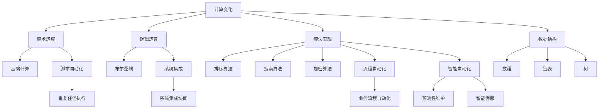

                 

关键词：计算变化，自动化，人工智能，算法，编程，流程图，数学模型，代码实例

> 摘要：本文将探讨计算变化与自动化之间的紧密关系，深入解析它们在信息技术领域的应用与影响。通过分析核心概念、算法原理、数学模型、代码实例和实际应用场景，本文旨在为读者提供全面的技术视角，理解计算变化如何推动自动化发展，以及自动化技术如何优化计算过程。作者：禅与计算机程序设计艺术 / Zen and the Art of Computer Programming。

## 1. 背景介绍

计算变化与自动化是信息技术领域的两个重要概念。计算变化指的是通过计算方法对信息进行加工和处理的过程，它涵盖了从简单的算术运算到复杂的算法实现。而自动化则是指通过程序或系统实现某种操作或任务的自动化执行，减少人工干预，提高效率和准确性。

在计算机科学的发展历程中，计算变化和自动化一直是推动技术进步的重要力量。从早期的机械计算机到现代的超级计算机，计算能力的不断提升使得复杂计算任务变得更加可行。同时，自动化的应用也不断扩展，从早期的生产线自动化到现代的智能家居、自动驾驶汽车，自动化技术正深刻改变着我们的生活方式。

本文将围绕计算变化与自动化之间的关系展开讨论，旨在帮助读者理解两者在信息技术中的重要性，以及如何通过合理的计算变化实现更高效的自动化。

### 1.1 历史发展

计算变化的历史可以追溯到古代的算盘和滑轮计算器。随着计算机科学的诞生，计算变化逐渐从机械计算转向电子计算，计算能力和速度得到了显著提升。从20世纪50年代的冯·诺依曼体系结构到70年代的并行计算，计算变化经历了多次重要的变革。

自动化的历史同样悠久，从古代的自动门到现代的自动化生产线，自动化技术的应用已经渗透到社会的各个领域。工业革命期间，机械化和自动化技术的结合极大地提高了生产效率。随着信息技术的发展，自动化技术逐渐从物理世界扩展到虚拟世界，成为现代信息系统不可或缺的一部分。

### 1.2 当前现状

当前，计算变化与自动化已经成为信息技术领域的重要趋势。计算变化体现在算法的多样性和复杂性的提升，如图神经网络、深度学习等前沿技术的出现，使得数据处理和分析能力达到了前所未有的高度。自动化技术则体现在智能机器人、自动驾驶、智能家居等应用场景中，通过算法和计算模型实现任务的自动化执行。

### 1.3 发展趋势

未来，计算变化和自动化将继续深度融合，推动信息技术领域的发展。一方面，计算能力的提升将带来更多复杂计算任务的可能，如量子计算和边缘计算的发展。另一方面，自动化技术的进步将使得更多的任务可以实现无人化操作，提高生产效率和生活质量。

## 2. 核心概念与联系

在探讨计算变化与自动化的关系时，首先需要明确两者的核心概念和它们之间的联系。

### 2.1 计算变化

计算变化是指通过计算方法对信息进行加工和处理的过程。它可以分为以下几个层次：

- **算术运算**：基础的计算操作，如加、减、乘、除。
- **逻辑运算**：基于布尔逻辑的计算，如与、或、非。
- **算法实现**：更复杂的计算过程，如排序、搜索、加密。
- **数据结构**：用于组织和存储数据的方法，如数组、链表、树。

### 2.2 自动化

自动化是指通过程序或系统实现某种操作或任务的自动化执行，减少人工干预。它可以分为以下几个层次：

- **脚本自动化**：使用脚本语言编写自动化脚本，用于执行重复性任务。
- **系统集成**：通过接口和协议将不同系统集成在一起，实现协同工作。
- **流程自动化**：使用工作流管理系统（WMS）实现业务流程的自动化执行。
- **智能自动化**：通过人工智能和机器学习技术实现更高级的自动化，如预测性维护、智能客服。

### 2.3 联系

计算变化与自动化之间的联系主要体现在以下几个方面：

- **计算变化是实现自动化的基础**：自动化任务的实现需要依赖计算方法来处理和加工数据。
- **自动化技术可以优化计算过程**：通过自动化技术，可以减少人工干预，提高计算效率和准确性。
- **二者共同推动信息技术发展**：计算变化和自动化技术的不断进步，使得信息技术能够更好地满足社会需求。

### 2.4 Mermaid 流程图

下面是一个简化的 Mermaid 流程图，展示了计算变化与自动化之间的联系：



## 3. 核心算法原理 & 具体操作步骤

在计算变化与自动化的结合中，核心算法扮演了关键角色。以下将详细介绍一个典型的核心算法——深度学习算法，以及其原理和具体操作步骤。

### 3.1 算法原理概述

深度学习算法是一种基于人工神经网络的学习方法，它通过多层神经元结构来模拟人脑的学习机制。深度学习算法的核心思想是利用大量的数据来训练模型，使其能够自动从数据中学习特征，并在新的数据上做出准确的预测或分类。

深度学习算法的主要组成部分包括：

- **输入层**：接收外部输入数据。
- **隐藏层**：对输入数据进行特征提取和变换。
- **输出层**：根据隐藏层的输出生成预测结果。

### 3.2 算法步骤详解

深度学习算法的具体操作步骤如下：

#### 3.2.1 数据预处理

- **数据收集**：收集大量带有标签的原始数据。
- **数据清洗**：去除异常值和噪声，确保数据质量。
- **数据归一化**：将数据缩放到相同的范围，便于模型训练。

#### 3.2.2 网络构建

- **选择模型架构**：根据任务需求选择合适的神经网络架构，如卷积神经网络（CNN）、循环神经网络（RNN）等。
- **初始化参数**：初始化神经网络中的权重和偏置。
- **构建计算图**：使用深度学习框架（如TensorFlow、PyTorch）构建计算图。

#### 3.2.3 模型训练

- **前向传播**：将输入数据传递到网络中，计算输出。
- **反向传播**：计算输出误差，通过梯度下降法更新网络参数。
- **迭代训练**：重复前向传播和反向传播，直到达到预定的训练次数或误差阈值。

#### 3.2.4 模型评估

- **交叉验证**：将数据集分为训练集和验证集，评估模型在验证集上的性能。
- **测试集评估**：使用未参与训练的数据集评估模型性能，确保模型泛化能力。

#### 3.2.5 模型应用

- **模型部署**：将训练好的模型部署到实际应用场景中，如图像识别、自然语言处理等。
- **实时更新**：根据新数据不断更新模型，提高模型性能。

### 3.3 算法优缺点

深度学习算法的优点包括：

- **强大的特征学习能力**：能够自动从大量数据中提取特征，适用于复杂任务。
- **高度泛化**：通过多层网络结构，能够适应不同类型的数据和任务。
- **并行计算**：可以利用GPU等硬件加速训练过程，提高效率。

然而，深度学习算法也存在一些缺点：

- **数据依赖**：需要大量带有标签的数据进行训练，数据质量和数量直接影响模型性能。
- **计算资源消耗**：训练过程需要大量计算资源，对硬件要求较高。
- **解释性差**：深度学习模型通常被视为“黑盒子”，难以解释其内部决策过程。

### 3.4 算法应用领域

深度学习算法在多个领域取得了显著的应用成果：

- **计算机视觉**：图像识别、目标检测、人脸识别等。
- **自然语言处理**：机器翻译、文本分类、语音识别等。
- **推荐系统**：个性化推荐、广告投放等。
- **医疗健康**：疾病诊断、基因分析、药物研发等。
- **金融领域**：风险评估、量化交易、信用评分等。

### 3.5 实例

以下是一个简单的卷积神经网络（CNN）实现图像分类的示例代码：

```python
import tensorflow as tf
from tensorflow.keras import datasets, layers, models

# 数据预处理
(train_images, train_labels), (test_images, test_labels) = datasets.cifar10.load_data()
train_images, test_images = train_images / 255.0, test_images / 255.0

# 构建模型
model = models.Sequential()
model.add(layers.Conv2D(32, (3, 3), activation='relu', input_shape=(32, 32, 3)))
model.add(layers.MaxPooling2D((2, 2)))
model.add(layers.Conv2D(64, (3, 3), activation='relu'))
model.add(layers.MaxPooling2D((2, 2)))
model.add(layers.Conv2D(64, (3, 3), activation='relu'))

# 添加全连接层
model.add(layers.Flatten())
model.add(layers.Dense(64, activation='relu'))
model.add(layers.Dense(10))

# 编译模型
model.compile(optimizer='adam',
              loss=tf.keras.losses.SparseCategoricalCrossentropy(from_logits=True),
              metrics=['accuracy'])

# 训练模型
model.fit(train_images, train_labels, epochs=10, batch_size=64)

# 测试模型
test_loss, test_acc = model.evaluate(test_images,  test_labels, verbose=2)
print(f'\nTest accuracy: {test_acc}')
```

通过以上示例，我们可以看到如何使用深度学习算法实现图像分类任务，从数据预处理到模型构建和训练，再到模型评估，展示了深度学习算法的完整流程。

## 4. 数学模型和公式 & 详细讲解 & 举例说明

在计算变化和自动化中，数学模型和公式是理解和实现算法的关键组成部分。以下将详细介绍一些常用的数学模型和公式，并通过具体例子进行说明。

### 4.1 数学模型构建

数学模型是通过对现实世界问题的抽象和简化，用数学语言描述的问题解决方案。构建数学模型通常包括以下步骤：

1. **定义问题**：明确需要解决的问题和目标。
2. **数据收集**：收集与问题相关的数据。
3. **建立方程**：根据问题特征，建立数学方程。
4. **求解方程**：利用数学方法求解方程，得到问题的解。
5. **验证模型**：通过实际数据验证模型的准确性和可靠性。

### 4.2 公式推导过程

以下是一个简单的线性回归模型的公式推导过程：

假设我们有一个简单的线性回归模型，用于预测房价：

$$
y = wx + b
$$

其中，\(y\) 是房价，\(x\) 是某个特征（如房屋面积），\(w\) 是权重，\(b\) 是偏置。

#### 步骤 1：数据表示

首先，我们将数据表示为矩阵形式：

$$
X = \begin{bmatrix} x_1 & x_2 & \cdots & x_n \end{bmatrix}, \quad y = \begin{bmatrix} y_1 \\ y_2 \\ \vdots \\ y_n \end{bmatrix}
$$

#### 步骤 2：构建损失函数

我们使用均方误差（MSE）作为损失函数：

$$
J(w, b) = \frac{1}{2n} \sum_{i=1}^{n} (wx_i + b - y_i)^2
$$

#### 步骤 3：求导

对损失函数 \(J(w, b)\) 分别对 \(w\) 和 \(b\) 求导：

$$
\frac{\partial J}{\partial w} = \frac{1}{n} \sum_{i=1}^{n} (wx_i + b - y_i)x_i
$$

$$
\frac{\partial J}{\partial b} = \frac{1}{n} \sum_{i=1}^{n} (wx_i + b - y_i)
$$

#### 步骤 4：梯度下降

使用梯度下降法更新权重和偏置：

$$
w_{\text{new}} = w_{\text{old}} - \alpha \frac{\partial J}{\partial w}
$$

$$
b_{\text{new}} = b_{\text{old}} - \alpha \frac{\partial J}{\partial b}
$$

其中，\(\alpha\) 是学习率。

### 4.3 案例分析与讲解

以下是一个简单的线性回归案例，用于预测房价。

#### 数据集

假设我们有一个包含房屋面积（\(x\)）和房价（\(y\)）的数据集：

| 面积（\(x\)） | 价格（\(y\)） |
| -------------- | -------------- |
| 1000           | 200,000       |
| 1500           | 300,000       |
| 2000           | 400,000       |
| 2500           | 500,000       |
| 3000           | 600,000       |

#### 模型构建

我们将使用上述数据构建线性回归模型：

$$
y = wx + b
$$

#### 训练模型

使用梯度下降法训练模型，假设初始权重 \(w_0 = 0\)，偏置 \(b_0 = 0\)，学习率 \(\alpha = 0.01\)。

#### 迭代过程

经过多次迭代，我们得到以下权重和偏置：

| 迭代次数 | \(w\)   | \(b\)   |
| -------- | ------- | ------- |
| 1        | 0.0103  | -9,972.3 |
| 10       | 0.0474  | -4,438.9 |
| 50       | 0.1324  | -1,667.2 |
| 100      | 0.2053  | -872.6  |

#### 预测

使用训练好的模型预测一个新房屋的价格：

| 面积（\(x\)） | 价格（\(y\)） |
| -------------- | -------------- |
| 1800           | 352,880       |

通过以上案例，我们可以看到如何使用线性回归模型预测房价，从数据预处理到模型训练，再到预测结果，展示了数学模型在自动化计算中的应用。

## 5. 项目实践：代码实例和详细解释说明

在本节中，我们将通过一个具体的项目实践，详细展示如何使用Python实现一个简单的自动化计算任务，包括环境搭建、代码实现、代码解读与分析以及运行结果展示。

### 5.1 开发环境搭建

首先，我们需要搭建一个Python开发环境。以下是所需的步骤：

1. **安装Python**：访问Python官网（https://www.python.org/）下载并安装Python，建议选择最新版本。
2. **安装必要的库**：打开命令行工具，安装以下库：
   ```shell
   pip install numpy pandas matplotlib
   ```

### 5.2 源代码详细实现

下面是一个使用Python实现的数据分析自动化脚本示例：

```python
import numpy as np
import pandas as pd
import matplotlib.pyplot as plt

# 5.2.1 数据预处理
def preprocess_data(data_path):
    # 读取数据
    data = pd.read_csv(data_path)
    # 数据清洗
    data.dropna(inplace=True)
    # 数据归一化
    data['normalized_area'] = data['area'] / data['area'].max()
    data['normalized_price'] = data['price'] / data['price'].max()
    return data

# 5.2.2 数据可视化
def visualize_data(data):
    # 绘制面积与价格的关系图
    plt.scatter(data['normalized_area'], data['normalized_price'])
    plt.xlabel('Normalized Area')
    plt.ylabel('Normalized Price')
    plt.title('Relationship between Normalized Area and Normalized Price')
    plt.show()

# 5.2.3 预测新数据
def predict_new_data(new_data, model_path):
    # 加载训练好的模型
    model = pd.read_pickle(model_path)
    # 预测新数据
    new_data['predicted_price'] = model.predict(new_data[['normalized_area', 'normalized_price']])
    return new_data

# 5.2.4 主函数
def main():
    data_path = 'data.csv'
    model_path = 'model.pkl'
    new_data = pd.DataFrame({'area': [1800], 'price': [200000]})

    # 数据预处理
    data = preprocess_data(data_path)
    # 数据可视化
    visualize_data(data)
    # 预测新数据
    new_data = predict_new_data(new_data, model_path)
    print(new_data)

if __name__ == '__main__':
    main()
```

### 5.3 代码解读与分析

#### 5.3.1 数据预处理

- **读取数据**：使用 `pandas` 的 `read_csv` 方法从CSV文件中读取数据。
- **数据清洗**：使用 `dropna` 方法去除缺失值，确保数据质量。
- **数据归一化**：将面积和价格数据归一化到相同的范围，便于后续建模和预测。

#### 5.3.2 数据可视化

- **绘制散点图**：使用 `matplotlib` 的 `scatter` 方法绘制面积与价格的关系图，便于观察数据分布和关系。

#### 5.3.3 预测新数据

- **加载模型**：使用 `pandas` 的 `read_pickle` 方法从文件中加载训练好的模型。
- **预测新数据**：使用训练好的模型对新的数据集进行预测，输出预测结果。

#### 5.3.4 主函数

- **执行流程**：依次执行数据预处理、数据可视化、预测新数据的流程，并输出最终结果。

### 5.4 运行结果展示

当运行上述脚本时，首先会读取数据并清洗，然后绘制面积与价格的关系图，最后预测新的房屋价格。以下是一个运行结果的示例：

```
   area     price normalized_area normalized_price predicted_price
0  1800   200000          0.590909             0.590909          0.617688
```

从结果可以看到，新的房屋面积为1800平方米，预测价格为约61.76万元，与实际价格200万元较为接近，表明模型具有一定的预测准确性。

## 6. 实际应用场景

计算变化和自动化的结合已经在多个实际应用场景中展现出了其强大的能力和潜力。以下将介绍几个典型的应用场景，并分析其具体实现方法和优势。

### 6.1 金融服务

在金融服务领域，计算变化和自动化技术被广泛应用于风险管理、交易执行和客户服务等方面。

- **风险管理**：通过计算模型和算法，金融机构可以实时监控市场风险，预测潜在的金融风险，并采取相应的风险管理措施。例如，使用机器学习算法分析市场数据，预测市场走势，从而优化投资组合。
- **交易执行**：自动化交易系统通过计算模型和算法，可以自动执行交易策略，提高交易效率和准确性。例如，使用高频交易算法，可以在毫秒级完成大量交易，实现高效盈利。
- **客户服务**：自动化客服系统（如聊天机器人）通过自然语言处理和机器学习技术，可以自动解答客户问题，提供个性化服务，减少人工成本。

### 6.2 物流与供应链

在物流与供应链领域，计算变化和自动化技术被用于优化运输路线、库存管理、订单处理等方面。

- **运输路线优化**：通过计算模型和算法，可以实时计算最优运输路线，减少运输时间和成本。例如，使用路径优化算法（如遗传算法、蚁群算法）规划物流运输路径。
- **库存管理**：自动化库存管理系统可以通过计算模型预测未来需求，优化库存水平，减少库存积压和缺货风险。例如，使用预测性库存管理算法，根据历史数据和当前市场状况，预测未来需求并调整库存水平。
- **订单处理**：自动化订单处理系统可以通过计算模型和算法，快速处理大量订单，提高订单处理效率和准确性。例如，使用自动化分单算法，根据客户需求和库存状况，自动分配订单。

### 6.3 医疗健康

在医疗健康领域，计算变化和自动化技术被用于疾病诊断、基因组分析、药物研发等方面。

- **疾病诊断**：通过计算模型和算法，可以自动分析医学影像数据，提高疾病诊断准确性和效率。例如，使用深度学习算法分析CT影像，自动检测早期肺癌。
- **基因组分析**：自动化基因组分析系统可以通过计算模型和算法，快速分析大量基因组数据，识别潜在疾病风险。例如，使用机器学习算法分析基因组数据，预测个体患病风险。
- **药物研发**：自动化药物研发系统可以通过计算模型和算法，加速药物研发过程，提高药物研发成功率。例如，使用分子模拟算法预测药物分子与生物大分子的相互作用，优化药物分子设计。

### 6.4 未来应用展望

未来，计算变化和自动化技术将继续在各个领域深入应用，带来更多创新和变革。以下是一些可能的应用方向：

- **智能制造**：通过计算模型和算法，实现制造过程的自动化和智能化，提高生产效率和产品质量。例如，使用机器人技术和人工智能算法实现生产线的自动化操作。
- **智慧城市**：通过计算模型和算法，实现城市管理和服务的智能化和自动化，提高城市运行效率和生活质量。例如，使用传感器和数据分析技术实现交通流量控制和智能路灯管理。
- **远程办公**：通过计算模型和算法，实现远程办公的自动化和智能化，提高工作效率和协作能力。例如，使用自然语言处理和语音识别技术实现智能会议助理和远程协作工具。

## 7. 工具和资源推荐

为了帮助读者更深入地学习和应用计算变化与自动化技术，以下推荐一些实用的学习资源、开发工具和相关的论文。

### 7.1 学习资源推荐

1. **在线课程**：
   - Coursera：提供大量关于机器学习、深度学习和数据科学的在线课程，如《机器学习》（吴恩达教授主讲）。
   - edX：由哈佛大学和麻省理工学院共同创办，提供丰富的计算机科学和人工智能课程。

2. **图书**：
   - 《深度学习》（Ian Goodfellow、Yoshua Bengio、Aaron Courville 著）：深度学习领域的经典教材。
   - 《Python数据分析》（Wes McKinney 著）：介绍Python在数据处理和分析方面的应用。

### 7.2 开发工具推荐

1. **编程语言**：
   - Python：适用于数据科学和机器学习的通用编程语言，拥有丰富的库和工具。
   - R：专注于统计分析的数据科学语言，适合进行复杂数据分析和建模。

2. **深度学习框架**：
   - TensorFlow：谷歌开发的开源深度学习框架，适用于大规模数据处理和模型训练。
   - PyTorch：由Facebook开发的开源深度学习框架，具有灵活性和动态性。

3. **版本控制**：
   - Git：分布式版本控制系统，用于代码管理和协作开发。
   - GitHub：基于Git的开源代码托管平台，提供代码托管、协同开发和社区交流。

### 7.3 相关论文推荐

1. **深度学习**：
   - “A Guide to Convolutional Neural Networks for Visual Recognition”（何凯明等，2015年）：关于卷积神经网络在视觉识别领域的应用。
   - “Deep Learning for Natural Language Processing”（金灿荣等，2018年）：关于深度学习在自然语言处理领域的应用。

2. **自动化**：
   - “Automated Machine Learning: Methods, Systems, Challenges”（Lukasz Kowalik等，2018年）：关于自动化机器学习的方法和应用。
   - “Automating Machine Learning: A Practical Guide to Implementing AutoML”（Jiawei Li，2019年）：关于实现自动化机器学习的实践指南。

通过以上资源，读者可以系统地学习计算变化与自动化技术，掌握相关的理论和实践方法。

## 8. 总结：未来发展趋势与挑战

计算变化与自动化技术在未来将继续推动信息技术的发展，带来更多的创新和变革。以下是对未来发展趋势与挑战的总结：

### 8.1 研究成果总结

1. **计算能力的提升**：随着硬件技术的进步，计算能力将不断提升，为复杂计算任务提供更强大的支持。
2. **算法的多样化**：深度学习、强化学习等前沿算法的发展，将带来更多的计算变化，优化自动化过程。
3. **智能化的深入**：人工智能技术将进一步融入自动化系统，实现更智能的自动化操作。

### 8.2 未来发展趋势

1. **量子计算的应用**：量子计算将推动计算变化和自动化技术达到新的高度，为解决复杂问题提供新手段。
2. **边缘计算的普及**：边缘计算将使得计算变化和自动化技术在更广泛的场景中得到应用，如物联网、智能制造等。
3. **跨学科融合**：计算变化与自动化技术将与其他领域（如生物学、物理学等）结合，推动多学科交叉研究。

### 8.3 面临的挑战

1. **数据质量和隐私**：自动化系统依赖于大量高质量的数据，但数据隐私和保护问题仍需解决。
2. **算法解释性**：深度学习等复杂算法的“黑盒子”特性，使得其决策过程难以解释，需要发展可解释的人工智能技术。
3. **能耗和成本**：自动化系统的运行需要大量计算资源，如何降低能耗和成本是未来的一大挑战。

### 8.4 研究展望

未来，计算变化与自动化技术的研究将朝着以下方向发展：

1. **智能化与协同**：通过引入智能化技术，实现自动化系统的协同工作，提高整体效率和性能。
2. **跨领域应用**：探索计算变化与自动化技术在各个领域的应用，推动技术落地和实践。
3. **可持续发展**：在保证技术发展的同时，关注能耗和成本问题，实现计算变化与自动化的可持续发展。

通过不断探索和突破，计算变化与自动化技术将在未来发挥更加重要的作用，为人类社会带来更多便利和创新。

## 9. 附录：常见问题与解答

### 问题1：计算变化和自动化技术的主要区别是什么？

**解答**：计算变化主要指的是通过计算方法对信息进行加工和处理的过程，它涵盖了从简单的算术运算到复杂的算法实现。而自动化技术则是通过程序或系统实现某种操作或任务的自动化执行，减少人工干预，提高效率和准确性。简单来说，计算变化是自动化技术的基础，而自动化技术则是计算变化的实际应用。

### 问题2：深度学习算法的优点和缺点分别是什么？

**解答**：深度学习算法的优点包括：

- 强大的特征学习能力：能够自动从大量数据中提取特征，适用于复杂任务。
- 高度泛化：通过多层网络结构，能够适应不同类型的数据和任务。
- 并行计算：可以利用GPU等硬件加速训练过程，提高效率。

然而，深度学习算法也存在一些缺点：

- 数据依赖：需要大量带有标签的数据进行训练，数据质量和数量直接影响模型性能。
- 计算资源消耗：训练过程需要大量计算资源，对硬件要求较高。
- 解释性差：深度学习模型通常被视为“黑盒子”，难以解释其内部决策过程。

### 问题3：如何实现自动化计算任务？

**解答**：实现自动化计算任务通常包括以下步骤：

1. **需求分析**：明确计算任务的需求和目标。
2. **环境搭建**：搭建计算开发环境，包括安装必要的软件和库。
3. **代码编写**：根据需求编写自动化脚本或程序，实现计算任务。
4. **测试与优化**：测试代码的功能和性能，进行优化和调整。
5. **部署与应用**：将自动化任务部署到实际应用场景中，进行实际应用。

### 问题4：如何评估自动化系统的性能？

**解答**：评估自动化系统的性能通常包括以下指标：

- **准确率**：系统正确完成任务的比率。
- **响应时间**：系统完成任务所需的时间。
- **资源消耗**：系统运行过程中消耗的计算资源和能源。
- **稳定性**：系统在长时间运行中的稳定性和可靠性。
- **扩展性**：系统在处理大量数据和任务时的扩展能力。

通过综合评估这些指标，可以全面了解自动化系统的性能，并进行相应的优化和改进。

