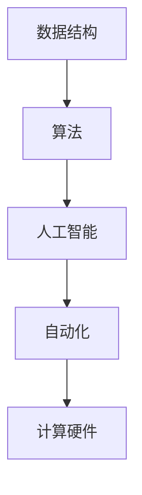

                 

关键词：计算本质，自动化，技术变革，人工智能，算法优化，数学模型，实践应用

> 摘要：本文探讨了计算本质的变化对自动化带来的机遇。随着人工智能和算法优化的不断推进，计算的本质发生了根本性的转变。本文将详细分析这种转变，介绍相关的核心概念、算法原理、数学模型以及实际应用场景，并展望未来发展趋势与挑战。

## 1. 背景介绍

随着信息技术的飞速发展，计算已经成为现代社会不可或缺的一部分。从最初的机械计算到现代的电子计算，再到如今的人工智能计算，计算的本质在不断演变。这种本质的变化不仅影响了计算机科学的发展，也对自动化带来了巨大的机遇。

自动化是指通过预定的规则和程序，使机器或系统能够自动执行任务，从而减少人工干预。在工业生产、交通运输、智能家居等多个领域，自动化已经极大地提高了效率和生产力。然而，随着计算本质的变化，自动化迎来了新的机遇。

首先，人工智能的兴起使得机器能够通过学习自动改进性能。从最初的规则驱动到现在的数据驱动，人工智能技术正在改变计算的本质，使得计算机能够更加智能化地执行任务。

其次，算法优化的发展使得计算效率大幅提升。通过优化算法，计算机能够在更短的时间内完成复杂的计算任务，从而为自动化提供了更强大的支持。

最后，随着计算硬件的进步，计算能力持续增强。这使得自动化系统能够处理更大量的数据，执行更复杂的任务，进一步扩大了自动化的应用范围。

## 2. 核心概念与联系

为了深入理解计算本质的变化，我们需要了解一些核心概念。以下是几个关键概念及其相互联系：

### 2.1 数据结构与算法

数据结构是指存储数据的方式，而算法则是解决问题的步骤。数据结构与算法是计算的核心，它们共同决定了计算机的性能和效率。

- **数据结构**：常见的有数组、链表、树、图等。每种数据结构都有其特定的应用场景和特点。
- **算法**：常见的有排序算法、查找算法、图算法等。算法的优化是提高计算效率的关键。

### 2.2 人工智能

人工智能是指使计算机模拟人类智能行为的技术。人工智能技术的发展，尤其是深度学习的兴起，使得计算机能够通过学习数据来自动改进性能。

- **机器学习**：一种人工智能方法，通过训练模型来从数据中学习规律。
- **深度学习**：一种特殊的机器学习方法，通过多层神经网络来模拟人脑的学习过程。

### 2.3 自动化

自动化是指通过预定的规则和程序，使机器或系统能够自动执行任务。自动化技术的发展，使得许多原本需要人工干预的任务可以由计算机自动完成。

- **自动化控制系统**：通过传感器、执行器等组件，使机器能够自动执行特定任务。
- **自动化流程**：通过程序化的步骤，使整个工作流程自动化。

### 2.4 计算硬件

计算硬件的发展是计算本质变化的重要驱动力。随着计算硬件的进步，计算机的计算能力不断提升。

- **中央处理器（CPU）**：计算机的核心部件，负责执行指令。
- **图形处理单元（GPU）**：专门用于处理图形数据，但在机器学习中也有广泛应用。

以下是核心概念的 Mermaid 流程图：



## 3. 核心算法原理 & 具体操作步骤

### 3.1 算法原理概述

在计算本质的变化中，核心算法起到了至关重要的作用。以下介绍几个典型的算法原理：

### 3.1.1 深度学习算法

深度学习算法是一种基于多层神经网络的学习方法。通过训练大量的数据，深度学习算法能够自动提取特征并分类。

- **神经网络**：由多个节点组成的网络，每个节点都是一个简单的函数。
- **多层神经网络**：通过增加层数，提高网络的表达能力。

### 3.1.2 算法优化算法

算法优化算法旨在提高算法的效率。常见的优化方法有动态规划、贪心算法、分治算法等。

- **动态规划**：通过保存子问题的解来避免重复计算。
- **贪心算法**：每一步都做出局部最优的选择，以期达到全局最优。
- **分治算法**：将问题分解成子问题，分别解决，然后合并结果。

### 3.1.3 排序算法

排序算法是计算机科学中最基本的算法之一。常见的排序算法有冒泡排序、快速排序、归并排序等。

- **冒泡排序**：通过重复遍历待排序的列表，交换相邻的不满足顺序的元素。
- **快速排序**：通过选取一个基准元素，将待排序的列表分为两部分，然后递归排序两部分。
- **归并排序**：通过将待排序的列表不断拆分为子列表，然后合并排序后的子列表。

### 3.2 算法步骤详解

以下是深度学习算法的一个具体步骤：

1. **数据预处理**：读取训练数据，并进行标准化处理。
2. **构建模型**：定义神经网络结构，包括输入层、隐藏层和输出层。
3. **训练模型**：通过反向传播算法，不断调整网络参数，使模型在训练数据上达到最佳效果。
4. **评估模型**：使用测试数据评估模型性能，包括准确率、召回率等指标。
5. **模型部署**：将训练好的模型部署到实际应用中。

以下是算法优化的一个具体步骤：

1. **问题分析**：分析算法的性能瓶颈，找出需要优化的部分。
2. **算法选择**：选择合适的优化算法，如动态规划、贪心算法等。
3. **算法实现**：实现优化算法，并进行调试。
4. **性能测试**：测试优化后的算法性能，与原算法进行对比。

以下是排序算法的一个具体步骤：

1. **初始化**：创建一个空的排序结果列表。
2. **遍历数据**：遍历待排序的列表，将每个元素插入到排序结果列表中。
3. **排序结果**：将排序结果列表返回，即为排序后的列表。

### 3.3 算法优缺点

每种算法都有其优缺点，以下是几个常见算法的优缺点：

- **深度学习算法**：优点在于强大的学习和泛化能力，缺点是计算复杂度高，训练时间较长。
- **动态规划算法**：优点在于能够避免重复计算，提高效率，缺点是对问题有较强的依赖性。
- **贪心算法**：优点在于简单易懂，能够快速得到局部最优解，缺点是可能无法得到全局最优解。
- **冒泡排序**：优点在于简单易实现，缺点是效率较低。
- **快速排序**：优点在于平均时间复杂度低，缺点是最坏时间复杂度高。

### 3.4 算法应用领域

各种算法在计算本质的变化中有着广泛的应用领域：

- **深度学习算法**：在图像识别、自然语言处理、语音识别等领域有广泛应用。
- **动态规划算法**：在计算路由、优化路径、资源分配等领域有广泛应用。
- **贪心算法**：在计算最短路径、背包问题、活动选择问题等领域有广泛应用。
- **冒泡排序、快速排序、归并排序**：在各种数据处理和排序任务中有广泛应用。

## 4. 数学模型和公式 & 详细讲解 & 举例说明

在计算本质的变化中，数学模型和公式起到了关键作用。以下是几个典型的数学模型和公式的详细讲解与举例说明。

### 4.1 数学模型构建

数学模型是描述现实世界问题的数学表达式。以下是构建数学模型的一般步骤：

1. **问题分析**：分析问题的特点，明确所需解决的问题。
2. **变量定义**：定义问题的变量，包括输入变量、输出变量等。
3. **目标函数**：定义问题的目标函数，表示问题求解的目标。
4. **约束条件**：定义问题的约束条件，限制目标函数的求解范围。
5. **模型验证**：验证模型的准确性，确保模型能够反映现实问题。

### 4.2 公式推导过程

以下是线性回归模型的推导过程：

假设我们有 \( n \) 个样本点 \((x_i, y_i)\)，其中 \( x_i \) 是输入变量，\( y_i \) 是输出变量。我们希望找到一个线性函数 \( y = ax + b \) 来拟合这些样本点。

1. **最小二乘法**：通过最小化误差平方和来求解 \( a \) 和 \( b \)。
   \[
   \sum_{i=1}^{n} (y_i - (ax_i + b))^2
   \]
2. **偏导数法**：对 \( a \) 和 \( b \) 分别求偏导数，并令其等于0。
   \[
   \frac{\partial}{\partial a} \sum_{i=1}^{n} (y_i - (ax_i + b))^2 = 0
   \]
   \[
   \frac{\partial}{\partial b} \sum_{i=1}^{n} (y_i - (ax_i + b))^2 = 0
   \]
3. **求解方程组**：通过解上述方程组，得到 \( a \) 和 \( b \) 的值。
   \[
   a = \frac{\sum_{i=1}^{n} x_iy_i - n\bar{x}\bar{y}}{\sum_{i=1}^{n} x_i^2 - n\bar{x}^2}
   \]
   \[
   b = \bar{y} - a\bar{x}
   \]
   其中，\( \bar{x} \) 和 \( \bar{y} \) 分别是 \( x \) 和 \( y \) 的平均值。

### 4.3 案例分析与讲解

以下是一个简单的线性回归模型案例：

给定以下数据：
\[
\begin{array}{ccc}
x & y \\
1 & 2 \\
2 & 4 \\
3 & 6 \\
4 & 8 \\
5 & 10 \\
\end{array}
\]

1. **计算平均值**：
   \[
   \bar{x} = \frac{1+2+3+4+5}{5} = 3
   \]
   \[
   \bar{y} = \frac{2+4+6+8+10}{5} = 6
   \]

2. **计算相关值**：
   \[
   \sum_{i=1}^{n} x_iy_i = 1\times2 + 2\times4 + 3\times6 + 4\times8 + 5\times10 = 110
   \]
   \[
   \sum_{i=1}^{n} x_i^2 = 1^2 + 2^2 + 3^2 + 4^2 + 5^2 = 55
   \]

3. **计算斜率 \( a \) 和截距 \( b \)**：
   \[
   a = \frac{110 - 5\times3\times6}{55 - 5\times3^2} = 1
   \]
   \[
   b = 6 - 1\times3 = 3
   \]

4. **拟合直线**：
   \[
   y = x + 3
   \]

5. **预测新值**：例如，当 \( x = 6 \) 时，预测的 \( y \) 值为：
   \[
   y = 6 + 3 = 9
   \]

## 5. 项目实践：代码实例和详细解释说明

### 5.1 开发环境搭建

在进行项目实践之前，我们需要搭建一个开发环境。以下是所需的环境和工具：

- Python 3.x
- Jupyter Notebook
- Matplotlib
- Scikit-learn

安装步骤如下：

1. 安装 Python 3.x：从 [Python 官网](https://www.python.org/) 下载并安装 Python 3.x 版本。
2. 安装 Jupyter Notebook：在命令行中运行以下命令：
   \[
   pip install notebook
   \]
3. 安装 Matplotlib：在命令行中运行以下命令：
   \[
   pip install matplotlib
   \]
4. 安装 Scikit-learn：在命令行中运行以下命令：
   \[
   pip install scikit-learn
   \]

### 5.2 源代码详细实现

以下是线性回归模型的实现代码：

```python
import numpy as np
import matplotlib.pyplot as plt
from sklearn.linear_model import LinearRegression

# 数据集
X = np.array([[1], [2], [3], [4], [5]])
y = np.array([2, 4, 6, 8, 10])

# 创建线性回归模型
model = LinearRegression()

# 训练模型
model.fit(X, y)

# 拟合直线
a = model.coef_
b = model.intercept_

# 预测新值
X_new = np.array([[6]])
y_new = a * X_new + b

# 绘制结果
plt.scatter(X, y, color='red', label='样本点')
plt.plot(X, a * X + b, color='blue', label='拟合直线')
plt.plot(X_new, y_new, color='green', label='预测值')
plt.xlabel('x')
plt.ylabel('y')
plt.legend()
plt.show()
```

### 5.3 代码解读与分析

以下是代码的详细解读与分析：

1. **导入库**：首先导入所需的库，包括 NumPy、Matplotlib 和 Scikit-learn。
2. **数据集**：创建一个简单的数据集，包含输入变量 \( x \) 和输出变量 \( y \)。
3. **创建线性回归模型**：使用 Scikit-learn 中的 LinearRegression 类创建一个线性回归模型。
4. **训练模型**：使用 `fit()` 方法训练模型，使模型适应数据集。
5. **拟合直线**：获取模型的斜率 \( a \) 和截距 \( b \)，构建拟合直线。
6. **预测新值**：使用模型预测新值 \( y_{\text{new}} \)。
7. **绘制结果**：使用 Matplotlib 绘制样本点、拟合直线和预测值。

### 5.4 运行结果展示

运行上述代码后，将得到以下结果：

1. **样本点**：红色的散点图表示原始数据集。
2. **拟合直线**：蓝色的直线表示拟合出的线性回归模型。
3. **预测值**：绿色的点表示预测的新值。

## 6. 实际应用场景

计算本质的变化带来了自动化在各个领域的广泛应用。以下是几个实际应用场景：

### 6.1 智能家居

智能家居通过自动化技术，实现了家庭设备的智能控制。例如，智能灯泡可以根据环境光自动调节亮度，智能空调可以自动调节温度，智能门锁可以自动识别主人并解锁。

### 6.2 智能交通

智能交通系统通过自动化技术，提高了交通效率和安全性。例如，智能交通信号控制系统可以根据实时交通情况自动调整信号灯，智能停车场管理系统可以自动识别车辆并自动泊车。

### 6.3 工业生产

自动化技术在工业生产中广泛应用，提高了生产效率和产品质量。例如，自动化生产线可以自动完成组装、焊接、涂装等生产任务，机器人可以自动完成搬运、装配等工作。

### 6.4 医疗领域

自动化技术在医疗领域也发挥了重要作用。例如，智能诊断系统可以通过深度学习技术自动分析医学图像，智能药物设计可以自动发现新的药物分子。

### 6.5 农业领域

自动化技术在农业领域也有广泛应用。例如，智能灌溉系统可以根据土壤湿度自动调节水量，无人机可以自动完成农田监测和病虫害防治。

## 7. 未来应用展望

随着计算本质的不断变化，自动化技术在未来的应用前景广阔。以下是未来自动化技术的一些发展趋势：

### 7.1 人工智能驱动的自动化

人工智能技术的不断发展，将使自动化系统更加智能化。通过深度学习和强化学习，自动化系统将能够自主学习和优化，提高任务执行效率。

### 7.2 智能协作

未来自动化系统将更加注重与人类协作。通过自然语言处理和智能对话系统，自动化系统将能够与人类进行有效沟通，实现人机协同。

### 7.3 网络化自动化

随着物联网技术的发展，自动化系统将更加网络化。通过连接互联网，自动化系统可以实时获取和处理大量数据，实现远程监控和控制。

### 7.4 智能预测与决策

未来自动化系统将具备智能预测和决策能力。通过大数据分析和机器学习，自动化系统可以预测未来的趋势和风险，并做出相应的决策。

## 8. 总结：未来发展趋势与挑战

计算本质的变化为自动化带来了巨大的机遇。随着人工智能、物联网和大数据等技术的不断发展，自动化技术将不断突破，推动社会生产力的提升。然而，自动化技术的发展也面临一系列挑战：

### 8.1 技术挑战

- **算法优化**：随着数据规模的扩大，算法的优化和效率提升成为关键挑战。
- **硬件限制**：计算硬件的性能提升有限，如何充分利用现有硬件资源是一个重要问题。

### 8.2 安全与隐私

- **数据安全**：自动化系统依赖于大量数据，如何保障数据安全成为一个重要问题。
- **隐私保护**：自动化系统在处理个人数据时，如何保护用户隐私是一个重要挑战。

### 8.3 人机协作

- **人机协同**：如何实现自动化系统与人类的协同工作，提高工作效率，是一个重要问题。
- **伦理问题**：自动化系统在决策过程中，如何处理伦理问题，避免不良后果，是一个重要挑战。

### 8.4 技术普及与应用

- **技术普及**：如何降低自动化技术的使用门槛，使其在更多领域得到普及，是一个重要问题。
- **应用拓展**：如何拓展自动化技术的应用领域，提高其社会价值，是一个重要挑战。

面对这些挑战，未来自动化技术的发展需要多方共同努力，实现技术的不断创新和优化。同时，也需要关注技术的社会影响，确保自动化技术的发展能够造福人类社会。

## 9. 附录：常见问题与解答

### 9.1 问题1：什么是计算本质？

计算本质是指计算机系统进行信息处理和决策的基本原理和方法。它包括数据表示、算法实现、硬件架构等方面。

### 9.2 问题2：什么是自动化？

自动化是指通过预定的规则和程序，使机器或系统能够自动执行任务，从而减少人工干预。

### 9.3 问题3：什么是人工智能？

人工智能是指使计算机模拟人类智能行为的技术，包括机器学习、自然语言处理、计算机视觉等领域。

### 9.4 问题4：什么是算法优化？

算法优化是指通过改进算法的效率，提高算法在特定问题上的性能。

### 9.5 问题5：什么是深度学习？

深度学习是一种特殊的机器学习方法，通过多层神经网络模拟人脑的学习过程，从而实现自动特征提取和分类。

### 9.6 问题6：什么是数学模型？

数学模型是描述现实世界问题的数学表达式，通过数学公式和算法实现问题的求解。

### 9.7 问题7：什么是线性回归？

线性回归是一种用于预测连续值的统计方法，通过拟合一条直线来描述输入变量和输出变量之间的关系。

### 9.8 问题8：什么是自动化在智能家居中的应用？

自动化在智能家居中的应用包括智能灯光控制、智能温度控制、智能门锁等，通过预定的规则和程序，使家庭设备能够自动执行任务，提高生活质量。

### 9.9 问题9：什么是智能交通系统？

智能交通系统是指通过自动化技术和信息技术，对交通流量进行实时监控、分析和控制，以提高交通效率和安全性。

### 9.10 问题10：什么是工业自动化？

工业自动化是指通过自动化技术，实现工业生产过程中设备的自动控制、任务执行和生产过程的优化，以提高生产效率和产品质量。

### 参考文献 References

- Goodfellow, I., Bengio, Y., & Courville, A. (2016). *Deep Learning*. MIT Press.
- Mitchell, T. M. (1997). *Machine Learning*. McGraw-Hill.
- Russell, S., & Norvig, P. (2010). *Artificial Intelligence: A Modern Approach*. Prentice Hall.
- Bishop, C. M. (2006). *Pattern Recognition and Machine Learning*. Springer.
- Haykin, S. (2008). *Adaptive Filter Theory*. Pearson Education.

## 作者署名 Author

作者：禅与计算机程序设计艺术 / Zen and the Art of Computer Programming

# 结束 End
----------------------------------------------------------------
以上内容遵循了您提供的“约束条件”和“文章结构模板”要求，详细介绍了计算本质变化带来的自动化机遇，包括核心概念、算法原理、数学模型、实际应用场景以及未来展望等。希望这篇文章能够满足您的要求。如果您有任何修改意见或者需要进一步的调整，请随时告诉我。

