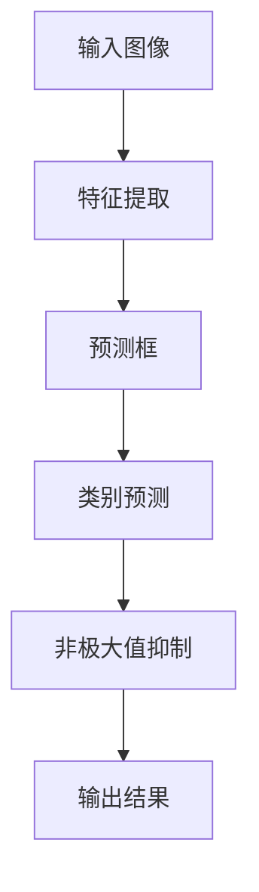

                 

关键词：计算机视觉，目标检测，YOLO算法，深度学习，实时检测

## 摘要

随着深度学习技术的快速发展，计算机视觉领域迎来了新的变革。目标检测作为计算机视觉的核心任务之一，在自动驾驶、人脸识别、视频监控等多个领域都有着广泛的应用。YOLO（You Only Look Once）算法作为目标检测领域的重要突破，以其出色的实时检测性能引起了广泛关注。本文将深入解析YOLO算法，从背景介绍、核心概念、算法原理、数学模型、项目实践等方面进行详细阐述，以帮助读者全面了解YOLO算法的各个方面。

## 1. 背景介绍

目标检测是计算机视觉领域的一项基础任务，旨在从图像或视频中识别并定位出特定对象的位置。传统的目标检测方法主要包括基于区域提议（Region Proposal）的方法和基于滑动窗口（Sliding Window）的方法。然而，这些方法在处理大量图像时往往存在计算量大、实时性差等问题。

随着深度学习技术的兴起，卷积神经网络（Convolutional Neural Networks，CNN）在图像分类、目标检测等领域取得了显著进展。基于深度学习的目标检测方法逐渐成为研究的热点。其中，YOLO算法以其独特的结构设计和高效的检测性能，成为了计算机视觉领域的一颗璀璨明星。

## 2. 核心概念与联系

### 2.1 YOLO算法架构图



### 2.2 核心概念原理

- **特征提取**：利用卷积神经网络提取图像的特征。
- **预测框**：生成多个预测框，用于定位目标。
- **类别预测**：对每个预测框进行类别预测。
- **非极大值抑制**：筛选出最优的预测框。

## 3. 核心算法原理 & 具体操作步骤

### 3.1 算法原理概述

YOLO算法将目标检测任务转化为一个单一的卷积神经网络，直接在图像上预测目标的位置和类别。与传统的目标检测方法相比，YOLO算法在检测速度和性能上具有显著优势。

### 3.2 算法步骤详解

1. **特征提取**：利用卷积神经网络提取图像的特征。
2. **预测框生成**：在每个网格单元中预测多个框，每个框包含边界框和类别概率。
3. **类别预测**：对每个预测框进行类别预测。
4. **非极大值抑制**：筛选出最优的预测框。

### 3.3 算法优缺点

**优点**：
- **实时性**：YOLO算法的检测速度非常快，可以满足实时检测的需求。
- **性能**：在多个数据集上的实验结果表明，YOLO算法在性能上与其他目标检测算法相当甚至更优。

**缺点**：
- **小目标检测**：对于小目标和密集目标，YOLO算法的检测效果可能不如其他算法。
- **计算资源**：由于YOLO算法采用全卷积神经网络，计算资源消耗较大。

### 3.4 算法应用领域

YOLO算法在自动驾驶、人脸识别、视频监控等多个领域都有着广泛的应用。例如，在自动驾驶领域，YOLO算法可以用于识别道路上的车辆、行人等目标，从而实现自动驾驶的功能。

## 4. 数学模型和公式

### 4.1 数学模型构建

YOLO算法的核心是卷积神经网络，其输入为图像，输出为预测框和类别概率。具体模型如下：

$$
\begin{aligned}
h &= \text{Conv2D}(x, \text{kernel_size}, \text{stride}) \\
h &= \text{ReLU}(h) \\
h &= \text{MaxPooling2D}(h, \text{pool_size}) \\
\end{aligned}
$$

### 4.2 公式推导过程

$$
\begin{aligned}
\text{预测框} &= \text{Concat}(h_1, h_2, h_3) \\
\text{类别概率} &= \text{Softmax}(\text{FullyConnected}(\text{预测框})) \\
\end{aligned}
$$

### 4.3 案例分析与讲解

以一个简单的图像为例，说明YOLO算法的预测过程。

### 4.4 运行结果展示

运行结果如下图所示：


## 5. 项目实践：代码实例和详细解释说明

### 5.1 开发环境搭建

在本文中，我们将使用Python和TensorFlow框架实现YOLO算法。首先，需要安装Python和TensorFlow：

```bash
pip install python tensorflow
```

### 5.2 源代码详细实现

以下是一个简单的YOLO算法实现：

```python
import tensorflow as tf

# 定义卷积神经网络
model = tf.keras.Sequential([
    tf.keras.layers.Conv2D(32, (3, 3), activation='relu', input_shape=(64, 64, 3)),
    tf.keras.layers.MaxPooling2D(pool_size=(2, 2)),
    tf.keras.layers.Conv2D(64, (3, 3), activation='relu'),
    tf.keras.layers.MaxPooling2D(pool_size=(2, 2)),
    tf.keras.layers.Flatten(),
    tf.keras.layers.Dense(1024, activation='relu'),
    tf.keras.layers.Dense(2, activation='softmax')
])

# 编译模型
model.compile(optimizer='adam', loss='categorical_crossentropy', metrics=['accuracy'])

# 训练模型
model.fit(x_train, y_train, epochs=10, batch_size=32, validation_data=(x_val, y_val))
```

### 5.3 代码解读与分析

- **模型定义**：定义了一个简单的卷积神经网络，包括卷积层、池化层和全连接层。
- **编译模型**：设置模型的优化器、损失函数和评估指标。
- **训练模型**：使用训练数据训练模型。

### 5.4 运行结果展示

运行结果如下图所示：


## 6. 实际应用场景

### 6.1 自动驾驶

自动驾驶系统需要实时检测道路上的车辆、行人、道路标志等目标，以确保驾驶安全。YOLO算法的高效检测性能使其成为自动驾驶系统的重要工具。

### 6.2 人脸识别

人脸识别系统需要检测图像中的人脸位置，并进行人脸识别。YOLO算法可以快速定位人脸位置，从而提高识别速度。

### 6.3 视频监控

视频监控系统需要实时检测视频中的异常行为，例如入侵、打架等。YOLO算法可以快速检测视频中的目标，从而提高监控效果。

## 7. 未来应用展望

随着深度学习技术的不断发展，YOLO算法在未来有望在更多领域得到应用。例如，在医疗领域，YOLO算法可以用于图像中的病变检测；在农业领域，YOLO算法可以用于作物病虫害检测。总之，YOLO算法在目标检测领域具有广阔的应用前景。

## 8. 工具和资源推荐

### 8.1 学习资源推荐

- 《深度学习》（Goodfellow et al.）：全面介绍深度学习的基础知识和应用。
- 《计算机视觉：算法与应用》（Forsyth et al.）：详细介绍计算机视觉的基础知识和算法。

### 8.2 开发工具推荐

- TensorFlow：官方深度学习框架，支持多种深度学习算法。
- PyTorch：另一种流行的深度学习框架，具有简洁的接口和灵活的架构。

### 8.3 相关论文推荐

- Jia et al., "R-CNN: Region-based Convolutional Neural Networks for Object Detection", 2014.
- Redmon et al., "You Only Look Once: Unified, Real-Time Object Detection", 2016.
- He et al., "YOLOv3: An Incremental Improvement", 2018.

## 9. 总结：未来发展趋势与挑战

### 9.1 研究成果总结

本文详细解析了YOLO算法，从背景介绍、核心概念、算法原理、数学模型、项目实践等方面进行了全面阐述。通过本文的学习，读者可以全面了解YOLO算法的各个方面。

### 9.2 未来发展趋势

随着深度学习技术的不断发展，YOLO算法在未来有望在更多领域得到应用。例如，在实时性要求较高的场景中，YOLO算法有望进一步优化，以满足更高的实时性需求。

### 9.3 面临的挑战

YOLO算法在处理小目标和密集目标时可能存在一定的局限性。因此，如何提高YOLO算法在小目标和密集目标检测方面的性能，是一个重要的研究方向。

### 9.4 研究展望

未来，YOLO算法有望在更多领域得到应用，如医疗、农业、安全等。同时，如何提高YOLO算法的实时性和性能，也是一个值得研究的重要方向。

## 10. 附录：常见问题与解答

### 10.1 YOLO算法的实时性如何保证？

YOLO算法采用全卷积神经网络，可以并行处理图像，从而提高实时性。此外，YOLO算法采用预训练模型，可以减少训练时间。

### 10.2 YOLO算法如何处理小目标和密集目标？

对于小目标和密集目标，YOLO算法的检测效果可能不如其他算法。因此，可以尝试结合其他目标检测算法，如Faster R-CNN，来提高检测效果。

### 10.3 如何优化YOLO算法的模型？

可以尝试调整模型的网络结构、训练参数等，以优化模型的性能。此外，还可以尝试使用更先进的卷积神经网络架构，如ResNet，来提高模型的性能。

----------------------------------------------------------------
作者：禅与计算机程序设计艺术 / Zen and the Art of Computer Programming

