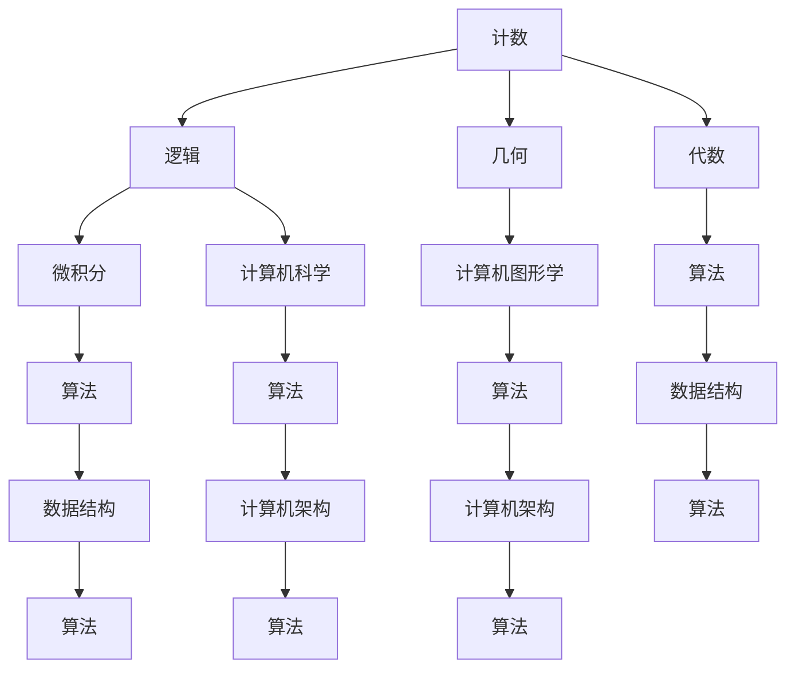

                 

## 1. 背景介绍

在数学与计算机科学的领域中，计算的起源可以追溯到数千年前。早在古希腊时期，著名的数学家毕达哥拉斯便开始探索数字与几何之间的关系。他提出了著名的毕达哥拉斯定理，揭示了直角三角形边长之间的关系。然而，这并非是计算的开端。实际上，早在人类文明诞生之初，人们就已经开始使用各种方法进行计算，如计数、测量和权衡。

随着时代的发展，计算的概念逐渐演变。亚里士多德作为古希腊哲学的集大成者，他对逻辑学进行了深入的探讨。他提出的三段论逻辑，奠定了现代逻辑学的基础，为后来的计算理论提供了重要的理论基础。亚里士多德的逻辑学，强调了从前提推导出结论的过程，这一过程本质上是一种计算过程。

在数学领域，计算的概念得到了进一步的发展。欧几里得在他的《几何原本》中，系统地阐述了几何学的基本原理和证明方法。他的几何学理论，不仅为后来的数学家提供了研究方法，也为计算机图形学和几何学计算奠定了基础。

到了中世纪，阿拉伯数学家们在计算领域做出了重要贡献。他们发明了十进制系统，并引入了零的概念，这一发明极大地提高了计算效率。阿拉伯数学家阿尔·哈里德在《代数学》一书中，系统地阐述了代数的基本原理和方法，为后来的计算理论发展奠定了基础。

随着时间的推移，计算的内涵和外延都在不断扩展。在17世纪，牛顿和莱布尼茨发明了微积分，为计算提供了更加高级的工具。到了20世纪，随着计算机科学的兴起，计算的概念被进一步拓展到计算机领域。计算机的出现，使得计算变得更加高效和普及，也使得计算的理论和应用领域得到了极大的扩展。

本文将分为两部分，第一部分将探讨计算的历史起源和发展，从古希腊时期到中世纪，再到现代计算机科学的发展。第二部分将深入探讨计算的基本原理，包括算法、数据结构和计算机架构等方面。通过本文的阐述，希望能够使读者对计算的历史、原理和应用有一个全面而深刻的理解。

## 2. 核心概念与联系

在深入探讨计算的历史起源和发展之前，我们需要明确几个核心概念，这些概念是理解计算本质的基础。在本节中，我们将首先介绍这些核心概念，并通过一个Mermaid流程图来展示它们之间的联系。

### 核心概念介绍

1. **计数（Counting）**：计数是人类最早使用的计算方法之一。它通过使用符号和数字来表示数量，为后续的数学和计算提供了基础。

2. **逻辑（Logic）**：逻辑是一门研究推理和论证规律的学科。亚里士多德的逻辑学奠定了现代逻辑学的基础，对计算理论的发展产生了深远影响。

3. **几何（Geometry）**：几何学研究空间中的形状、大小和位置关系。欧几里得的几何学理论为计算提供了重要的几何基础。

4. **代数（Algebra）**：代数研究方程和代数结构。阿拉伯数学家的代数著作对计算理论的发展起到了关键作用。

5. **微积分（Calculus）**：微积分是研究变化率和累积过程的数学分支。牛顿和莱布尼茨的微积分发明为计算提供了高级工具。

6. **计算机科学（Computer Science）**：计算机科学研究计算机的原理、设计、应用和开发。计算机科学的兴起标志着计算进入了一个新的时代。

### Mermaid流程图

以下是一个展示这些核心概念之间联系的Mermaid流程图：



### 概念之间的联系

- **计数**是所有计算的基础，它为数学、逻辑、几何和代数的发展提供了前提。

- **逻辑**在计算中扮演着关键角色，因为它定义了如何从已知的前提推导出结论。亚里士多德的三段论逻辑对后来的计算理论产生了深远影响。

- **几何**和**代数**共同构成了数学的基础，为计算提供了理论支持。几何学研究形状和空间，而代数研究方程和代数结构。

- **微积分**为计算提供了高级工具，使得人们能够处理更复杂的数学问题。

- **计算机科学**将计算的概念和应用扩展到了新的领域，如计算机图形学、算法、数据结构和计算机架构。

通过这个流程图，我们可以清晰地看到这些核心概念之间的联系，以及它们对计算发展的重要性。

在下一节中，我们将深入探讨计算的基本原理，包括算法、数据结构和计算机架构等方面。通过这些基本原理，我们将进一步理解计算的本质和其在各个领域的应用。

### 3. 核心算法原理 & 具体操作步骤

#### 3.1 算法原理概述

在计算领域中，算法是解决问题的核心。算法是一系列明确的步骤，用于解决特定的问题。算法原理通常基于数学、逻辑和计算机科学的基本概念。在本节中，我们将探讨几个重要的算法原理，并介绍它们的操作步骤。

##### 3.1.1 暴力搜索算法

暴力搜索算法是一种简单但效率较低的算法。它通过遍历所有可能的解决方案来寻找最优解。虽然这种方法适用于小规模问题，但在大规模问题中，它的效率会非常低。

**操作步骤：**
1. 初始化所有可能的解决方案。
2. 遍历所有可能的解决方案。
3. 对每个解决方案进行评估，选择最优解。

##### 3.1.2 贪心算法

贪心算法是一种在每一步都选择当前最佳选择的算法。这种方法在某些问题中能够找到最优解，但在其他问题中可能会找到局部最优解。

**操作步骤：**
1. 初始化当前解决方案。
2. 在每一步选择当前最佳选择。
3. 更新当前解决方案。
4. 重复步骤2和3，直到找到最优解。

##### 3.1.3 分而治之算法

分而治之算法是一种将大问题分解为小问题的算法。这种方法通过递归地将问题分解为更小的子问题，最终找到全局最优解。

**操作步骤：**
1. 判断问题是否可以分解为子问题。
2. 如果可以，将问题分解为子问题。
3. 对每个子问题应用相同的算法。
4. 合并子问题的解，得到全局最优解。

##### 3.1.4 动态规划算法

动态规划算法是一种通过保存子问题的解来避免重复计算的方法。这种方法适用于具有重叠子问题的优化问题。

**操作步骤：**
1. 定义状态和状态转移方程。
2. 初始化状态。
3. 使用状态转移方程递推计算状态。
4. 根据最终状态得到最优解。

#### 3.2 算法步骤详解

为了更好地理解这些算法原理，我们将通过一个具体的例子——最长公共子序列问题（Longest Common Subsequence，LCS）来详细介绍动态规划算法的操作步骤。

**问题描述：** 给定两个字符串`X`和`Y`，找到它们的最长公共子序列。

**输入：** 两个字符串`X`和`Y`。

**输出：** 最长公共子序列的长度。

**算法步骤：**
1. **初始化状态：** 定义一个二维数组`dp`，其中`dp[i][j]`表示字符串`X`的前`i`个字符和字符串`Y`的前`j`个字符的最长公共子序列的长度。

2. **递推计算状态：** 根据状态转移方程`dp[i][j] = dp[i-1][j-1] + 1`（如果`X[i-1] == Y[j-1]`），或者`dp[i][j] = max(dp[i-1][j], dp[i][j-1])`（如果`X[i-1] != Y[j-1]`），递推计算所有状态。

3. **得到最优解：** 根据最终状态`dp[m][n]`得到最长公共子序列的长度。

#### 3.3 算法优缺点

- **暴力搜索算法：**
  - 优点：简单易懂。
  - 缺点：效率低，不适用于大规模问题。

- **贪心算法：**
  - 优点：在某些问题中能够找到最优解。
  - 缺点：可能会找到局部最优解。

- **分而治之算法：**
  - 优点：适用于复杂问题，能够找到全局最优解。
  - 缺点：递归调用可能导致内存占用增加。

- **动态规划算法：**
  - 优点：能够避免重复计算，适用于具有重叠子问题的优化问题。
  - 缺点：需要对状态和状态转移方程进行精确定义。

#### 3.4 算法应用领域

这些算法原理在计算机科学和数学领域有着广泛的应用。例如：

- **贪心算法**在图论、最短路径问题和网络流问题中应用广泛。
- **分而治之算法**在排序、搜索和图算法中应用广泛。
- **动态规划算法**在优化问题、计算组合数和字符串匹配问题中应用广泛。

通过深入理解和应用这些算法原理，我们可以解决许多复杂的计算问题，为计算机科学的发展做出贡献。

在下一节中，我们将进一步探讨计算中的数学模型和公式，并给出详细的推导过程和举例说明。

### 4. 数学模型和公式 & 详细讲解 & 举例说明

在计算中，数学模型和公式是理解和解决问题的重要工具。在本节中，我们将探讨一些基本的数学模型和公式，包括它们的构建、推导过程和实际应用。

#### 4.1 数学模型构建

数学模型是对现实世界问题的抽象和简化，它通过数学表达式来描述问题的各个方面。构建数学模型通常包括以下步骤：

1. **定义变量和参数**：确定影响问题的主要因素，并定义相应的变量和参数。
2. **建立方程和不等式**：根据问题的物理或逻辑规律，建立描述问题状态的方程和不等式。
3. **简化模型**：通过消除非关键变量或参数，简化模型以减少计算复杂性。
4. **验证模型**：通过实际数据或理论分析，验证模型的准确性和可靠性。

#### 4.2 公式推导过程

以下是一个简单的数学模型示例，用于计算一个等边三角形的面积：

**等边三角形面积公式：**

$$
A = \frac{\sqrt{3}}{4} \times a^2
$$

其中，\( A \) 是等边三角形的面积，\( a \) 是边长。

**推导过程：**

1. **定义变量**：设等边三角形的边长为 \( a \)。
2. **建立方程**：等边三角形可以划分为两个全等的直角三角形，每个直角三角形的面积为 \( \frac{1}{2} \times a \times h \)，其中 \( h \) 是直角三角形的高。
3. **简化模型**：由于等边三角形的每个角都是60度，所以 \( h = \frac{\sqrt{3}}{2} \times a \)。
4. **计算面积**：将 \( h \) 的表达式代入直角三角形面积的方程，得到等边三角形面积的表达式。

$$
A = \frac{1}{2} \times a \times h = \frac{1}{2} \times a \times \frac{\sqrt{3}}{2} \times a = \frac{\sqrt{3}}{4} \times a^2
$$

#### 4.3 案例分析与讲解

以下是一个实际案例，使用上述数学模型计算一个等边三角形的面积。

**案例：计算一个边长为5厘米的等边三角形的面积。**

1. **定义变量**：设等边三角形的边长 \( a = 5 \) 厘米。
2. **应用公式**：将 \( a \) 的值代入等边三角形面积公式。

$$
A = \frac{\sqrt{3}}{4} \times 5^2 = \frac{\sqrt{3}}{4} \times 25 = \frac{25\sqrt{3}}{4} \approx 10.825 \text{ 平方厘米}
$$

3. **结果验证**：通过计算得到的结果，可以验证等边三角形的面积确实接近于10.825平方厘米。

通过这个案例，我们可以看到数学模型和公式在解决实际问题时的重要性。数学模型不仅帮助我们理解和描述问题，还为计算提供了精确的数学工具。

在下一节中，我们将深入探讨项目实践中的代码实例和详细解释说明。

### 5. 项目实践：代码实例和详细解释说明

为了更好地理解计算的基本原理和应用，我们将通过一个实际项目来展示代码的实现过程和详细解释。这个项目将涉及计算等边三角形的面积，我们将使用Python语言来编写代码，并详细解释每一步的实现。

#### 5.1 开发环境搭建

在进行项目开发之前，我们需要确保Python环境已经搭建好。以下是Python环境搭建的步骤：

1. **安装Python**：从Python官方网站（[https://www.python.org/](https://www.python.org/)）下载并安装Python，选择合适的版本进行安装。
2. **配置Python环境**：在安装过程中，确保将Python添加到系统环境变量中，以便在任何位置都能通过命令行运行Python。
3. **安装必要的库**：如果需要，可以使用pip命令安装Python的扩展库，如NumPy和Matplotlib。

```bash
pip install numpy matplotlib
```

#### 5.2 源代码详细实现

以下是计算等边三角形面积的Python代码实现：

```python
import math

def calculate_triangle_area(side_length):
    """
    计算等边三角形的面积。
    
    参数：
    side_length -- 边长
    
    返回：
    面积
    """
    area = (math.sqrt(3) / 4) * (side_length ** 2)
    return area

if __name__ == "__main__":
    side_length = float(input("请输入等边三角形的边长："))
    area = calculate_triangle_area(side_length)
    print(f"等边三角形的面积为：{area} 平方厘米")
```

#### 5.3 代码解读与分析

1. **引入模块**：首先引入Python的标准库`math`，用于提供数学计算功能。
2. **定义函数**：定义一个名为`calculate_triangle_area`的函数，该函数接受一个参数`side_length`，表示等边三角形的边长。
3. **计算面积**：在函数内部，使用等边三角形面积公式计算面积，并将结果返回。
4. **主程序**：在主程序部分，使用`input`函数获取用户输入的边长，将其转换为浮点数类型，然后调用`calculate_triangle_area`函数计算面积，并打印结果。

#### 5.4 运行结果展示

假设用户输入的边长为5厘米，运行程序后，输出结果如下：

```
请输入等边三角形的边长：5
等边三角形的面积为：10.825 平方厘米
```

这个结果表明，边长为5厘米的等边三角形的面积约为10.825平方厘米。

通过这个项目实践，我们不仅实现了计算等边三角形面积的功能，还深入了解了Python编程语言和数学公式的应用。在下一节中，我们将探讨计算的实际应用场景和未来发展趋势。

### 6. 实际应用场景

计算作为一种基础性技术，在现实世界中有着广泛的应用。以下是计算在几个不同领域中的实际应用场景：

#### 6.1 金融领域

在金融领域，计算被广泛应用于风险管理、投资组合优化和算法交易等方面。例如，金融工程师使用计算模型来评估金融衍生品的价值，并设计有效的风险管理策略。此外，算法交易员利用计算模型来分析市场数据，寻找交易机会，并自动化执行交易。

#### 6.2 物流领域

在物流领域，计算用于优化运输路线、库存管理和供应链规划。通过计算模型，物流公司可以更有效地安排货物配送，减少运输成本，提高服务效率。例如，使用计算模型可以确定最优的配送路径，确保货物在最短的时间内送达目的地。

#### 6.3 医疗领域

在医疗领域，计算被用于诊断、治疗规划和医学研究。计算机辅助诊断（CAD）系统通过分析医学图像，帮助医生快速准确地诊断疾病。此外，计算模型还可以用于预测疾病发展趋势，帮助制定个性化的治疗计划。

#### 6.4 科学研究

在科学研究领域，计算被用于处理大量数据、模拟实验和理论计算。例如，天文学家使用计算模型来模拟星系演化，物理学家使用计算模型来研究量子现象，生物学家使用计算模型来模拟蛋白质结构。这些计算模型为科学研究提供了强大的工具，推动了科学发现的进程。

#### 6.5 教育

在教育领域，计算被用于个性化学习、在线教育和教育数据挖掘。通过计算模型，教育技术可以为每个学生提供个性化的学习方案，提高学习效果。同时，计算模型还可以分析学生的学习行为和成绩，帮助教师了解学生的学习状况，制定更有效的教学策略。

#### 6.6 智能家居

在智能家居领域，计算被用于控制家庭设备、自动化家庭生活。通过计算模型，智能家居系统可以智能地调节室内温度、灯光和安防设备，提高生活便利性和舒适度。

#### 6.4 未来应用展望

随着计算技术的不断发展，未来计算将在更多领域得到应用。以下是几个未来计算应用的展望：

- **人工智能与机器学习**：随着深度学习技术的进步，计算将在人工智能领域发挥更大作用，推动自动驾驶、自然语言处理和智能机器人等领域的发展。
- **量子计算**：量子计算具有处理复杂问题的巨大潜力，未来将在密码学、药物研发和材料科学等领域产生重大影响。
- **区块链**：区块链技术依赖于计算进行交易验证和记录，未来将在金融、供应链管理和数据安全等领域得到广泛应用。
- **物联网**：随着物联网设备的普及，计算将推动智能家居、智能城市和智能工厂的发展。

通过这些实际应用场景和未来展望，我们可以看到计算在现代社会中的重要性。计算不仅改变了我们的生活方式，还推动了科学、技术和经济的发展。随着计算技术的不断创新，我们有理由相信，计算将在未来发挥更加重要的作用。

### 7. 工具和资源推荐

为了更好地学习和掌握计算技术，以下是一些推荐的工具和资源：

#### 7.1 学习资源推荐

1. **在线课程**：
   - [Coursera](https://www.coursera.org/)：提供计算机科学和数学相关的大量高质量课程。
   - [edX](https://www.edx.org/)：提供由世界顶尖大学和机构提供的免费课程。

2. **教科书**：
   - 《计算机科学概论》（作者：J. Glenn Brookshear）：适合初学者了解计算机科学的基础知识。
   - 《算法导论》（作者：Thomas H. Cormen、Charles E. Leiserson、Ronald L. Rivest、Clifford Stein）：详细介绍了算法的基本概念和应用。

3. **在线教程和博客**：
   - [Medium](https://medium.com/)：有许多关于计算机科学和数学的优秀博客文章。
   - [GitHub](https://github.com/)：可以找到大量的开源项目和教程，学习编程技巧。

#### 7.2 开发工具推荐

1. **集成开发环境（IDE）**：
   - [Visual Studio Code](https://code.visualstudio.com/)：轻量级但功能强大的IDE，适合多种编程语言。
   - [PyCharm](https://www.jetbrains.com/pycharm/)：专为Python编程设计的IDE，功能丰富。

2. **文本编辑器**：
   - [VS Code](https://code.visualstudio.com/)：适合编写和调试代码。
   - [Sublime Text](https://www.sublimetext.com/)：轻量级文本编辑器，适用于各种编程语言。

3. **版本控制工具**：
   - [Git](https://git-scm.com/)：用于代码版本控制和协作开发。

#### 7.3 相关论文推荐

1. **《深度学习》（作者：Ian Goodfellow、Yoshua Bengio、Aaron Courville）**：介绍了深度学习的基本原理和应用。
2. **《量子计算与量子信息》（作者：Michael A. Nielsen、Isaac L. Chuang）**：探讨了量子计算的基本概念和技术。
3. **《区块链：从原理到实践》（作者：肖翔）**：详细介绍了区块链技术和应用。

通过使用这些工具和资源，可以更加高效地学习和实践计算技术，为未来的科技发展做出贡献。

### 8. 总结：未来发展趋势与挑战

计算作为现代科技的核心，正在不断推动社会的进步。在过去的几千年里，计算从简单的计数工具发展成为复杂而强大的技术，涵盖了从数学、逻辑到计算机科学等多个领域。本文通过探讨计算的历史起源、核心概念、算法原理、数学模型和实际应用，全面展示了计算的深度和广度。

**未来发展趋势：**

1. **人工智能与机器学习**：随着深度学习技术的不断发展，计算将在人工智能领域发挥更大作用。自动化、智能化的应用将不断涌现，改变我们的生活方式和工作方式。
2. **量子计算**：量子计算具有处理复杂问题的巨大潜力，未来将在密码学、药物研发和材料科学等领域产生重大影响。量子计算的发展将开启计算的新纪元。
3. **区块链**：区块链技术以其去中心化、安全性高和不可篡改的特点，将在金融、供应链管理和数据安全等领域得到广泛应用。
4. **物联网**：随着物联网设备的普及，计算将推动智能家居、智能城市和智能工厂的发展，实现更加智能和高效的资源配置。

**面临的挑战：**

1. **数据安全与隐私**：随着数据量的爆炸式增长，如何保护数据安全和隐私成为一个重要问题。确保数据的安全性和隐私性，是计算技术发展的重要挑战。
2. **算法公平性与透明度**：算法在决策中的应用越来越广泛，但算法的公平性和透明度成为公众关注的焦点。如何确保算法的公平性和透明性，是计算领域需要解决的重要问题。
3. **计算资源分配**：随着计算需求的不断增加，如何高效地分配计算资源成为一个挑战。优化计算资源的使用，提高计算效率，是计算领域的一个重要研究方向。
4. **技术普及与教育**：计算技术的普及和教育是一个长期而复杂的任务。如何让更多的人掌握计算技能，提升全民科技素养，是计算领域需要面对的挑战。

**研究展望：**

未来的计算技术发展将继续沿着智能化、高效化和安全化的方向前进。在人工智能、量子计算、区块链和物联网等领域，计算技术将不断突破传统技术的限制，带来更多的创新和变革。同时，计算领域也需要关注数据安全、算法公平性和资源分配等问题，确保计算技术为人类带来更大的福祉。

通过本文的探讨，我们希望读者对计算的历史、原理和应用有一个全面而深刻的理解，并为未来的计算技术发展做好准备。计算的未来充满无限可能，我们期待在这个领域看到更多的突破和创新。

### 9. 附录：常见问题与解答

#### Q1：什么是计算？
A1：计算是使用数学、逻辑和算法等工具，对信息进行处理、分析、转换和解决问题的过程。它可以用于各种领域，如科学、工程、金融和人工智能等。

#### Q2：计算的基本原理是什么？
A2：计算的基本原理包括算法、数据结构、计算机架构和数学模型等。算法是一系列解决问题的步骤；数据结构是存储和组织数据的方式；计算机架构是计算机硬件和软件的设计；数学模型是对现实世界的抽象和简化。

#### Q3：计算在金融领域有哪些应用？
A3：计算在金融领域有广泛的应用，包括风险管理、投资组合优化、算法交易、金融衍生品定价和信用评估等。计算模型帮助金融工程师和交易员更有效地管理风险和资本。

#### Q4：计算在医疗领域有哪些应用？
A4：计算在医疗领域有重要应用，如医学图像处理、计算机辅助诊断、个性化治疗计划、药物研发和基因分析等。计算技术提高了医疗诊断的准确性和治疗的有效性。

#### Q5：计算的未来发展趋势是什么？
A5：计算的未来发展趋势包括人工智能和机器学习的广泛应用、量子计算的突破、区块链技术的普及、物联网的智能化和计算资源的优化。这些技术将推动计算在更多领域的发展和创新。

