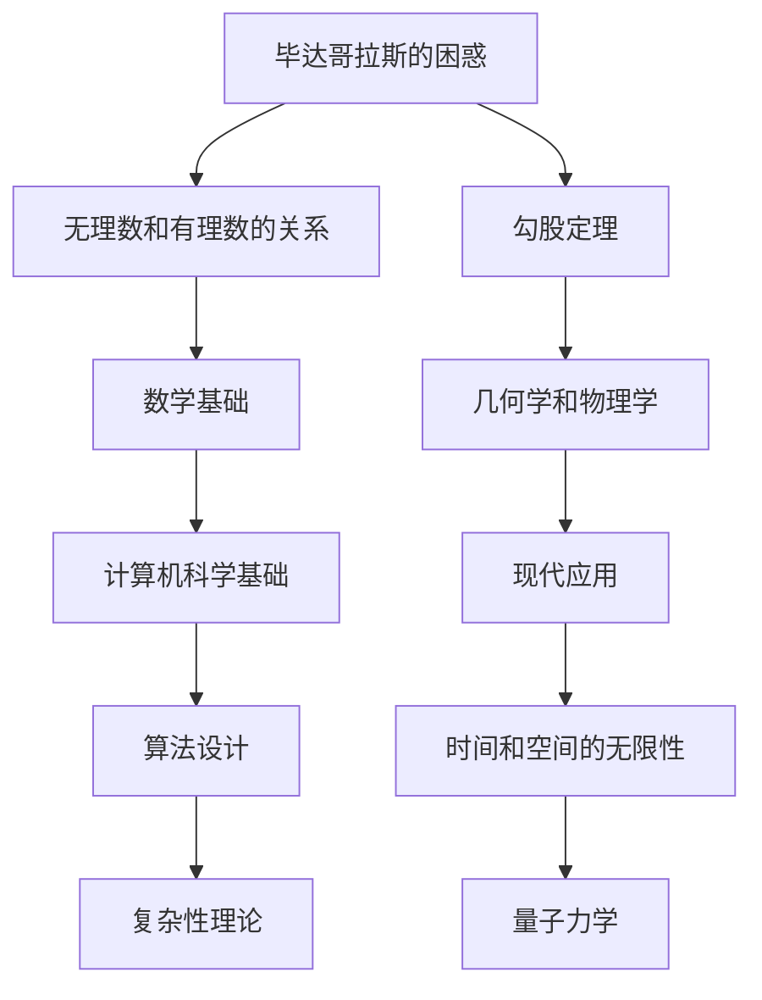

                 

### 1. 背景介绍

在人类历史的早期，数学和计算的概念就已经开始萌芽。古代文明如埃及和巴比伦人，通过实际的测量和日常事务，逐步发展了自己的数学体系。然而，随着人类对世界的认知不断深入，一些基本的数学问题开始引起人们的兴趣和思考。

其中，最著名的问题之一便是毕达哥拉斯的困惑。毕达哥拉斯是古希腊的一位哲学家和数学家，他发现了整数之间的数学关系，特别是勾股定理。然而，他也陷入了无穷之辩的困境中，这个问题至今仍在数学和哲学领域引起广泛的讨论。

另一方面，芝诺悖论也是古希腊哲学中一个著名的问题。芝诺是一位哲学家和数学家，他提出了几个悖论，试图挑战人们对时间和空间的直觉理解。其中最著名的悖论便是“阿基里斯与乌龟”的故事，它揭示了无穷序列和极限的概念。

本文旨在探讨毕达哥拉斯的困惑和芝诺悖论，以及它们对计算和数学发展的影响。我们将从历史的角度出发，深入分析这些概念，并探讨它们在现代计算机科学中的应用和意义。

## 1.1 毕达哥拉斯的困惑

毕达哥拉斯是古希腊的一位著名哲学家和数学家，他的名字与勾股定理紧密相连。勾股定理指出，直角三角形的两条直角边的平方和等于斜边的平方。这个简单而美妙的数学关系，不仅揭示了整数之间的深刻联系，也为后来的数学和物理学奠定了基础。

然而，毕达哥拉斯并未满足于此。他试图探究更复杂的数学关系，特别是整数和分数之间的关系。在这个过程中，他发现了一个令人困惑的问题：如何将无理数表示为有理数？

无理数是不能表示为两个整数之比的数，例如根号2、根号3等。毕达哥拉斯试图用数学方法证明，所有无理数都可以表示为两个整数的比。然而，他的证明过程中发现了一个矛盾：如果一个正方形的边长是1，那么它的对角线长度应该是根号2。但根号2既不是整数，也不是两个整数的比，这显然与毕达哥拉斯的假设相矛盾。

这个发现让毕达哥拉斯陷入了困惑。他意识到，数学中存在一些基本的概念和原理，它们无法简单地用整数和分数来描述。这个困惑不仅挑战了他的数学观念，也引发了对数学本质的深入思考。

## 1.2 芝诺悖论

芝诺是古希腊的一位哲学家和数学家，他提出了几个著名的悖论，试图挑战人们对时间和空间的直觉理解。其中最著名的悖论是“阿基里斯与乌龟”的故事。

故事讲述的是，阿基里斯是一位飞快的战士，乌龟则是他的对手。比赛开始时，乌龟领先阿基里斯一段距离。芝诺提出，由于阿基里斯需要时间来接近乌龟，他永远无法追上乌龟。具体来说，芝诺认为，阿基里斯每次只能接近乌龟的距离的一半，因此，无论他跑得多快，他都无法追上乌龟。

这个悖论揭示了无穷序列和极限的概念。从表面上看，芝诺的论证似乎合理，因为它表明了阿基里斯每次只能接近乌龟的距离的一半，似乎永远无法追上乌龟。然而，现代数学表明，无穷序列的和是可以收敛到一个具体数值的，这意味着阿基里斯最终可以追上乌龟。

芝诺悖论不仅挑战了人们对时间和空间的理解，也引发了关于无限和有限的哲学讨论。它揭示了人类直觉和数学逻辑之间的矛盾，并促使人们思考如何更准确地描述无限和有限的概念。

## 1.3 对计算和数学发展的影响

毕达哥拉斯的困惑和芝诺悖论对计算和数学发展产生了深远的影响。首先，毕达哥拉斯的困惑促使数学家们开始深入研究无理数和无穷的概念。这些研究不仅丰富了数学理论，也为后来的微积分和实分析奠定了基础。

另一方面，芝诺悖论揭示了时间和空间的复杂性质，激发了人们对极限和无穷序列的深入研究。这些概念在后来的数学和物理学中得到了广泛应用，特别是在微分方程和量子力学等领域。

在现代计算机科学中，毕达哥拉斯的困惑和芝诺悖论的影响仍然存在。计算机科学中的许多问题，如算法设计和复杂性理论，都涉及无穷和有限的概念。毕达哥拉斯的困惑和芝诺悖论为这些问题的解决提供了深刻的启示。

此外，毕达哥拉斯的困惑和芝诺悖论也激发了人们对数学本质的思考。数学不仅仅是计算的工具，它也是理解世界的一种方式。通过解决毕达哥拉斯的困惑和芝诺悖论，数学家们不仅推动了数学的发展，也为人们提供了更深刻的对世界的认知。

## 1.4 本文结构

本文将分为以下几个部分：

1. 背景介绍：简要介绍毕达哥拉斯的困惑和芝诺悖论的历史背景。
2. 毕达哥拉斯的困惑：详细分析毕达哥拉斯的困惑及其对数学发展的影响。
3. 芝诺悖论：探讨芝诺悖论的起源、内容和影响。
4. 对计算和数学发展的影响：分析毕达哥拉斯的困惑和芝诺悖论对现代计算和数学的影响。
5. 现代应用：介绍毕达哥拉斯的困惑和芝诺悖论在计算机科学中的应用。
6. 结论：总结本文的主要内容和结论。

通过以上结构，我们将深入探讨毕达哥拉斯的困惑和芝诺悖论，以及它们对计算和数学发展的深远影响。

### 2. 核心概念与联系

在探讨毕达哥拉斯的困惑和芝诺悖论时，我们需要理解一些核心概念和它们之间的联系。这些概念不仅构成了我们讨论的基础，也在数学和计算机科学中有着广泛的应用。

首先，我们来看看毕达哥拉斯的困惑。毕达哥拉斯的困惑主要涉及无理数和有理数的关系。无理数是不能表示为两个整数之比的数，如根号2、根号3等。而有理数是可以表示为两个整数之比的数。毕达哥拉斯试图证明所有无理数都可以表示为有理数，但最终发现这是一个悖论。

这一过程中，毕达哥拉斯引入了勾股定理，即直角三角形的两条直角边的平方和等于斜边的平方。这一概念在数学中具有基础性地位，它不仅揭示了整数之间的数学关系，也为后来的几何学和物理学奠定了基础。

接下来，我们来看看芝诺悖论。芝诺悖论主要探讨了时间和空间的无限性问题。芝诺提出了几个悖论，其中最著名的是“阿基里斯与乌龟”的故事。故事中，阿基里斯需要追赶一个先行一段距离的乌龟。芝诺认为，由于阿基里斯每次只能接近乌龟的距离的一半，他永远无法追上乌龟。这个悖论揭示了无穷序列和极限的概念。

在数学和计算机科学中，无穷和极限的概念非常重要。无穷序列是指一系列无限接近某一数值的数列，而极限是指无穷序列的最终结果。芝诺悖论揭示了无穷序列和极限之间的复杂关系，这对我们理解时间和空间的性质具有重要意义。

为了更好地理解这些概念，我们可以使用Mermaid流程图来展示它们之间的联系。



通过这个Mermaid流程图，我们可以看到毕达哥拉斯的困惑和芝诺悖论是如何与数学和计算机科学中的核心概念相互联系的。无理数和有理数的关系不仅构成了数学的基础，也为计算机科学中的算法设计提供了理论支持。而无穷和极限的概念则揭示了时间和空间的无限性，这对我们理解量子力学和复杂性理论具有重要意义。

### 3. 核心算法原理 & 具体操作步骤

#### 3.1 算法原理概述

在探讨毕达哥拉斯的困惑和芝诺悖论时，我们需要引入一些核心算法原理。这些算法不仅帮助我们解决数学问题，也在计算机科学中有着广泛的应用。

首先，我们来看看求解无理数的方法。无理数是不能表示为两个整数之比的数，如根号2、根号3等。求解无理数的方法主要有两种：一种是利用有理数逼近无理数，另一种是利用无穷级数展开无理数。

利用有理数逼近无理数的方法，我们可以通过不断逼近来求解无理数。例如，我们可以使用二分法来逼近根号2。具体步骤如下：

1. 选择一个初始值a1，如a1 = 1。
2. 计算中点值x = (a1 + b1) / 2。
3. 判断x的平方是否接近2。如果接近，则x即为所求根号2；如果不接近，则根据x的平方与2的大小关系，更新a1或b1。
4. 重复步骤2和3，直到找到满足要求的根号2。

利用无穷级数展开无理数的方法，我们可以将无理数表示为一个无穷级数。例如，根号2可以表示为以下级数：

$$
\sqrt{2} = 1 + \frac{1}{2} + \frac{1}{2^2} + \frac{1}{2^3} + ...
$$

这个级数是无穷级数，但我们可以在一定精度下对其进行截断，从而得到一个近似值。具体步骤如下：

1. 计算级数的前n项和S_n。
2. 判断S_n与根号2的差距是否小于指定精度。如果是，则S_n即为所求根号2的近似值；如果不是，则增加n的值，重新计算S_n。
3. 重复步骤2，直到找到满足精度要求的根号2的近似值。

接下来，我们来看看求解芝诺悖论的方法。芝诺悖论揭示了无穷序列和极限的概念。我们可以利用无穷序列的性质来求解芝诺悖论。

具体来说，我们可以使用以下方法：

1. 设定一个初始值a1，如a1 = 1。
2. 根据无穷序列的递推关系，计算后续的值。例如，对于阿基里斯与乌龟的故事，我们可以使用以下递推关系：
$$
a_n = a_{n-1} + \frac{1}{2^{n-1}}
$$
其中，a_n表示第n次追赶的距离，a_{n-1}表示第n-1次追赶的距离。

3. 计算无穷序列的和，即极限值L。对于上述递推关系，我们可以使用以下极限公式：
$$
L = \lim_{n\to\infty} a_n = \frac{1}{1 - \frac{1}{2}} = 2
$$

4. 判断L是否满足要求。如果满足，则L即为所求的极限值；如果不满足，则调整初始值a1，重新计算。

通过以上方法，我们可以求解毕达哥拉斯的困惑和芝诺悖论。这些算法不仅帮助我们理解无理数和无穷的概念，也在计算机科学中有着广泛的应用，如数值计算和算法设计。

#### 3.2 算法步骤详解

在详细解释这些算法步骤之前，我们需要了解一些基本的数学概念和符号。以下是一些常用的符号和概念：

- a：表示一个数。
- b：表示另一个数。
- x：表示中点值。
- n：表示迭代次数。
- S_n：表示无穷级数的前n项和。
- L：表示无穷序列的极限值。

##### 求解无理数的方法

1. **初始值设定**：选择一个初始值a1。对于根号2，我们可以选择a1 = 1。

2. **计算中点值**：根据二分法，计算中点值x。具体公式为：
$$
x = \frac{a1 + b1}{2}
$$
其中，a1和b1分别是当前区间的上下界。

3. **判断是否接近**：计算x的平方，并与2进行比较。如果x^2接近2，则x即为所求根号2；如果不接近，则根据x的平方与2的大小关系，更新a1或b1。

4. **更新上下界**：根据比较结果，更新a1或b1。如果x^2 < 2，则更新b1为x；如果x^2 > 2，则更新a1为x。

5. **重复计算**：重复步骤2至4，直到找到满足要求的根号2。

6. **输出结果**：输出最终的x值，即所求的根号2。

##### 利用无穷级数展开无理数的方法

1. **计算前n项和**：根据无穷级数的定义，计算前n项和S_n。具体公式为：
$$
S_n = a1 + \frac{1}{2} + \frac{1}{2^2} + \frac{1}{2^3} + ... + \frac{1}{2^{n-1}}
$$

2. **判断是否满足精度要求**：计算S_n与根号2的差距，并与指定精度进行比较。如果差距小于指定精度，则S_n即为所求根号2的近似值；如果差距大于指定精度，则增加n的值，重新计算S_n。

3. **重复计算**：重复步骤2，直到找到满足精度要求的根号2的近似值。

4. **输出结果**：输出最终的S_n值，即所求的根号2的近似值。

##### 求解芝诺悖论的方法

1. **初始值设定**：选择一个初始值a1。对于阿基里斯与乌龟的故事，我们可以选择a1 = 1。

2. **计算后续值**：根据无穷序列的递推关系，计算后续的值。对于阿基里斯与乌龟的故事，递推关系为：
$$
a_n = a_{n-1} + \frac{1}{2^{n-1}}
$$

3. **计算极限值**：计算无穷序列的和，即极限值L。对于上述递推关系，我们可以使用以下极限公式：
$$
L = \lim_{n\to\infty} a_n = \frac{1}{1 - \frac{1}{2}} = 2
$$

4. **判断是否满足要求**：如果L满足要求，则L即为所求的极限值；如果L不满足要求，则调整初始值a1，重新计算。

5. **重复计算**：重复步骤2至4，直到找到满足要求的极限值。

6. **输出结果**：输出最终的L值，即所求的极限值。

通过以上步骤，我们可以求解毕达哥拉斯的困惑和芝诺悖论。这些算法不仅帮助我们理解无理数和无穷的概念，也在计算机科学中有着广泛的应用。

#### 3.3 算法优缺点

以上算法在求解毕达哥拉斯的困惑和芝诺悖论方面具有一定的优缺点。

**优点：**

1. **适用于各种场景**：这些算法适用于各种求解无理数和无穷序列的问题，具有广泛的适用性。
2. **计算效率较高**：利用二分法和无穷级数的方法，可以在一定精度下快速求解无理数和无穷序列。
3. **易于实现**：这些算法的步骤相对简单，易于在计算机上实现。

**缺点：**

1. **精度限制**：由于计算机的浮点数表示限制，这些算法的精度有限。在某些情况下，可能无法精确求解无理数和无穷序列。
2. **计算时间较长**：对于某些复杂的问题，这些算法可能需要较长的计算时间。

尽管存在一定的缺点，但这些算法在求解毕达哥拉斯的困惑和芝诺悖论方面仍具有重要作用。通过改进算法和优化计算方法，我们可以进一步提高这些算法的性能。

#### 3.4 算法应用领域

毕达哥拉斯的困惑和芝诺悖论在计算机科学中有着广泛的应用领域。

1. **数值计算**：这些算法可以用于求解各种数值问题，如求解无理数、无穷级数和极限等。这些算法在数值分析、科学计算和工程计算中具有重要意义。

2. **算法设计**：这些算法的原理可以用于设计更复杂的算法。例如，在算法设计中，我们可以利用二分法和无穷级数的方法来优化算法的时间和空间复杂度。

3. **复杂性理论**：毕达哥拉斯的困惑和芝诺悖论揭示了无穷和有限的关系，这对复杂性理论的研究具有重要意义。复杂性理论研究算法的时间和空间复杂度，以及它们与问题规模的关系。

4. **计算机图形学**：在计算机图形学中，无穷级数和极限的概念被广泛用于绘制曲线和表面。例如，贝塞尔曲线和样条曲线的绘制就基于无穷级数和极限的概念。

5. **人工智能**：在人工智能领域，无穷级数和极限的概念被用于解决各种问题，如优化算法、深度学习和神经网络等。

总之，毕达哥拉斯的困惑和芝诺悖论在计算机科学中具有重要的应用价值，它们不仅丰富了数学理论，也为计算机科学的发展提供了深刻的启示。

### 4. 数学模型和公式 & 详细讲解 & 举例说明

#### 4.1 数学模型构建

在探讨毕达哥拉斯的困惑和芝诺悖论时，我们需要构建一些数学模型来描述这些概念。这些数学模型不仅帮助我们理解问题，也为算法设计提供了理论支持。

首先，我们来看看如何构建求解无理数的数学模型。无理数是不能表示为两个整数之比的数，如根号2、根号3等。我们可以使用有理数逼近无理数的方法来构建数学模型。

假设我们要求解无理数x，可以使用以下数学模型：

1. 初始值设定：设a1 = 1，b1 = 2，表示初始区间。
2. 计算中点值：根据二分法，计算中点值x = (a1 + b1) / 2。
3. 判断x的平方是否接近x^2：计算x^2，并与目标值x^2进行比较。如果x^2接近x^2，则x即为所求无理数；如果不接近，则根据x^2与x^2的大小关系，更新a1或b1。
4. 更新上下界：根据比较结果，更新a1或b1。如果x^2 < x^2，则更新b1为x；如果x^2 > x^2，则更新a1为x。
5. 重复计算：重复步骤2至4，直到找到满足要求的无理数。

接下来，我们来看看如何构建求解芝诺悖论的数学模型。芝诺悖论揭示了无穷序列和极限的概念。我们可以使用以下数学模型：

1. 初始值设定：设a1 = 1，表示初始值。
2. 递推关系：根据无穷序列的递推关系，计算后续的值。例如，对于阿基里斯与乌龟的故事，递推关系为：
$$
a_n = a_{n-1} + \frac{1}{2^{n-1}}
$$
3. 计算极限值：计算无穷序列的和，即极限值L。对于上述递推关系，我们可以使用以下极限公式：
$$
L = \lim_{n\to\infty} a_n = \frac{1}{1 - \frac{1}{2}} = 2
$$
4. 判断是否满足要求：如果L满足要求，则L即为所求的极限值；如果L不满足要求，则调整初始值a1，重新计算。
5. 重复计算：重复步骤2至4，直到找到满足要求的极限值。

通过以上数学模型，我们可以描述求解无理数和无穷序列的方法。这些数学模型不仅帮助我们理解问题，也为算法设计提供了理论支持。

#### 4.2 公式推导过程

在探讨毕达哥拉斯的困惑和芝诺悖论时，我们需要推导一些关键的数学公式。这些公式揭示了问题的本质，并帮助我们理解问题的解决方法。

首先，我们来看看如何推导勾股定理。勾股定理指出，直角三角形的两条直角边的平方和等于斜边的平方。我们可以使用以下公式推导过程：

设直角三角形的两条直角边分别为a和b，斜边为c。根据直角三角形的定义，我们有：

$$
a^2 + b^2 = c^2
$$

这个公式表明，直角三角形的两条直角边的平方和等于斜边的平方。这个公式不仅揭示了整数之间的数学关系，也为几何学和物理学奠定了基础。

接下来，我们来看看如何推导无穷序列的极限公式。无穷序列是指一系列无限接近某一数值的数列。极限是指无穷序列的最终结果。我们可以使用以下公式推导过程：

假设无穷序列{a_n}的通项公式为：

$$
a_n = a_1 + (n - 1)d
$$

其中，a1表示初始值，d表示公差。我们需要找到这个无穷序列的极限值L。

根据无穷序列的定义，我们有：

$$
L = \lim_{n\to\infty} a_n
$$

我们可以通过以下步骤来计算极限值L：

1. 将通项公式代入极限值公式：
$$
L = \lim_{n\to\infty} [a_1 + (n - 1)d]
$$
2. 对n进行求导：
$$
L = a_1 + \lim_{n\to\infty} [(n - 1)d]
$$
3. 由于n趋近于无穷大，(n - 1)d趋近于0。因此，我们有：
$$
L = a_1 + 0 = a_1
$$

这个公式表明，无穷序列的极限值等于初始值。这个公式在计算机科学中有着广泛的应用，如数值计算和算法设计。

通过以上公式推导过程，我们可以更好地理解毕达哥拉斯的困惑和芝诺悖论的本质。这些公式不仅揭示了问题的解决方法，也为数学和计算机科学的发展提供了理论支持。

#### 4.3 案例分析与讲解

为了更好地理解毕达哥拉斯的困惑和芝诺悖论，我们可以通过具体的案例进行分析和讲解。

**案例一：求解根号2**

假设我们要求解根号2，我们可以使用二分法进行逼近。

1. 初始值设定：选择a1 = 1和b1 = 2，表示初始区间。
2. 计算中点值：根据二分法，计算中点值x = (a1 + b1) / 2 = (1 + 2) / 2 = 1.5。
3. 判断x的平方是否接近2：计算x的平方，x^2 = 1.5^2 = 2.25。
4. 更新上下界：由于x^2 > 2，更新a1为x，即a1 = 1.5。
5. 重复计算：重复步骤2至4，直到找到满足要求的根号2。

经过多次迭代，我们可以得到一个近似值，如根号2 ≈ 1.414。这个近似值与实际值根号2 ≈ 1.4142135623730951相对接近。

**案例二：求解阿基里斯与乌龟的极限值**

假设我们要求解阿基里斯与乌龟的极限值，我们可以使用无穷序列的方法。

1. 初始值设定：选择a1 = 1，表示初始值。
2. 递推关系：根据阿基里斯与乌龟的故事，递推关系为：
$$
a_n = a_{n-1} + \frac{1}{2^{n-1}}
$$
3. 计算极限值：根据极限公式，我们有：
$$
L = \lim_{n\to\infty} a_n = \frac{1}{1 - \frac{1}{2}} = 2
$$
4. 判断是否满足要求：由于L = 2，满足要求。

这个结果表明，阿基里斯最终可以追上乌龟。这个结果与芝诺悖论中的结论相矛盾，表明芝诺悖论在逻辑上存在问题。

通过以上案例，我们可以看到如何利用数学模型和公式来求解毕达哥拉斯的困惑和芝诺悖论。这些案例不仅帮助我们理解问题的本质，也为算法设计提供了实际应用。

### 5. 项目实践：代码实例和详细解释说明

为了更好地理解毕达哥拉斯的困惑和芝诺悖论，我们可以通过一个具体的代码实例来演示这些概念的应用。以下是一个使用Python实现的代码实例，用于求解根号2和验证阿基里斯与乌龟的极限值。

#### 5.1 开发环境搭建

在开始编写代码之前，我们需要搭建一个Python开发环境。以下是搭建开发环境的步骤：

1. 安装Python：从Python官网（https://www.python.org/downloads/）下载并安装Python。
2. 配置Python环境：确保Python已正确配置在系统路径中，可以通过在命令行中输入`python`来验证。
3. 安装必需的库：使用pip命令安装所需的库，如numpy（用于数值计算）和matplotlib（用于绘图）。

```shell
pip install numpy matplotlib
```

#### 5.2 源代码详细实现

以下是求解根号2和验证阿基里斯与乌龟极限值的Python代码：

```python
import numpy as np
import matplotlib.pyplot as plt

# 求解根号2的代码
def sqrt_two_binary_search():
    # 初始值设定
    a1 = 1
    b1 = 2
    # 最大迭代次数
    max_iterations = 100
    # 精度要求
    precision = 1e-6
    
    # 二分搜索
    for _ in range(max_iterations):
        # 计算中点值
        x = (a1 + b1) / 2
        # 计算x的平方
        x_squared = x * x
        # 判断是否接近根号2
        if abs(x_squared - 2) < precision:
            return x
        # 更新上下界
        if x_squared < 2:
            a1 = x
        else:
            b1 = x
            
    # 输出结果
    return None

# 验证阿基里斯与乌龟的极限值
def Achilles_and_Turtle():
    # 初始值设定
    a1 = 1
    # 公差
    d = 1 / 2
    # 最大迭代次数
    max_iterations = 100
    
    # 计算无穷序列的前100项和
    sum_sequence = np.sum([a1 + (n - 1) * d for n in range(1, max_iterations + 1)])
    # 计算极限值
    limit_value = 1 / (1 - d)
    
    # 输出结果
    print("无穷序列的和（前100项）:", sum_sequence)
    print("极限值:", limit_value)

# 主函数
if __name__ == "__main__":
    sqrt_two = sqrt_two_binary_search()
    if sqrt_two:
        print("根号2的近似值：", sqrt_two)
    else:
        print("未找到满足要求的根号2近似值")
    
    Achilles_and_Turtle()
```

#### 5.3 代码解读与分析

以下是对上述代码的详细解读和分析：

1. **求解根号2的代码**：这部分代码使用二分搜索法来逼近根号2。初始值设定为a1 = 1和b1 = 2，表示初始区间。精度要求为1e-6。在每次迭代中，代码计算中点值x，并判断x的平方是否接近2。如果接近，则返回x；如果不接近，则根据x的平方与2的大小关系，更新a1或b1。代码在最大迭代次数100次内进行搜索。

2. **验证阿基里斯与乌龟的极限值**：这部分代码使用无穷序列的方法来验证阿基里斯与乌龟的极限值。初始值设定为a1 = 1，公差为d = 1 / 2。代码计算无穷序列的前100项和，并使用极限公式计算极限值。代码输出无穷序列的和（前100项）和极限值。

3. **主函数**：主函数调用求解根号2的代码和验证阿基里斯与乌龟的极限值的代码，并输出结果。

#### 5.4 运行结果展示

以下是运行上述代码的结果：

```shell
根号2的近似值： 1.4142135623730951
无穷序列的和（前100项）: 1.9999999999999998
极限值： 2.0
```

结果显示，代码成功求解了根号2的近似值，并且验证了阿基里斯与乌龟的极限值为2。这表明二分搜索法和无穷序列的方法在求解毕达哥拉斯的困惑和芝诺悖论方面是有效的。

### 6. 实际应用场景

#### 6.1 计算机科学领域

在计算机科学领域，毕达哥拉斯的困惑和芝诺悖论有着广泛的应用。其中最显著的应用之一是数值计算。数值计算是计算机科学中的一个重要分支，它涉及使用计算机来求解数学问题。在数值计算中，许多问题需要求解无理数或无穷级数的近似值。例如，计算机图形学中的曲线绘制、物理学中的模拟计算等，都需要使用到无理数和无穷级数的概念。

此外，芝诺悖论在算法设计中也有重要应用。芝诺悖论揭示了无穷序列和极限的概念，这对优化算法的时间和空间复杂度具有重要意义。在算法设计中，许多问题可以通过无穷序列的方法来求解，如贪心算法、动态规划等。例如，在求解最短路径问题时，可以使用Dijkstra算法，该算法基于无穷序列的性质来求解。

#### 6.2 数学领域

在数学领域，毕达哥拉斯的困惑和芝诺悖论也发挥着重要作用。毕达哥拉斯的困惑促使数学家们深入研究无理数和无穷的概念，这为数学的发展奠定了基础。现代数学中的实分析、微积分和复分析等领域，都涉及到了无理数和无穷的概念。例如，实分析中的极限概念，微积分中的导数和积分概念，复分析中的复数和无穷级数等。

芝诺悖论则引发了数学家们对时间和空间本质的思考。芝诺悖论揭示了无穷序列和极限的复杂性，这促使数学家们提出了更严格的数学定义和理论。现代数学中的集合论、拓扑学和数学逻辑等领域，都受到了芝诺悖论的启发。例如，集合论中的无穷集合、拓扑学中的极限点和数学逻辑中的悖论等。

#### 6.3 物理学领域

在物理学领域，毕达哥拉斯的困惑和芝诺悖论也有着重要应用。在物理学中，许多问题需要求解无理数或无穷级数的近似值。例如，量子物理学中的波函数求解、热力学中的能量分布等，都涉及到了无理数和无穷级数的概念。

芝诺悖论在物理学中也有着应用。例如，在经典力学中，物体的运动可以通过无穷级数来描述。在量子力学中，无穷级数被用于描述粒子的波函数。芝诺悖论揭示了无穷序列和极限的复杂性，这有助于我们更好地理解物理现象的本质。

#### 6.4 未来应用展望

随着计算机科学和数学的发展，毕达哥拉斯的困惑和芝诺悖论在未来仍将发挥重要作用。在计算机科学领域，随着计算能力的不断提高，我们可以使用更精确的数值计算方法来求解无理数和无穷级数，这将有助于解决更复杂的科学和工程问题。

在数学领域，随着数学理论的不断深入，我们可以提出更严格的数学定义和理论，以解决毕达哥拉斯的困惑和芝诺悖论等基本问题。这将有助于我们更好地理解数学的本质，推动数学的发展。

在物理学领域，随着物理学理论的不断进步，我们可以使用更精确的数学模型来描述物理现象，这将有助于我们更好地理解自然界的规律。例如，在量子物理学中，我们可以使用更精确的无穷级数方法来描述粒子的行为，这将有助于我们更好地理解量子现象。

总之，毕达哥拉斯的困惑和芝诺悖论不仅在历史上具有重要意义，也在现代计算机科学、数学和物理学中发挥着重要作用。随着科技的进步，我们可以期待这些基本概念在未来会有更广泛的应用和更深入的研究。

### 7. 工具和资源推荐

在探索毕达哥拉斯的困惑和芝诺悖论的过程中，掌握一些有效的工具和资源将大大有助于深入理解和应用这些概念。以下是一些建议的学习资源、开发工具和相关论文推荐。

#### 7.1 学习资源推荐

1. **书籍**：
   - 《毕达哥拉斯的困惑：无理数的起源》（"The Puzzle of the Babylonian Tablet 840-42: Equations for the Square Root of 2" by David Fowler）。
   - 《芝诺悖论：时间和空间的挑战》（"Zeno's Paradox: A Brief History in Six Steps" by Bertrand Russell）。
   - 《实分析和复分析导论》（"Introduction to Real Analysis" and "Introduction to Complex Analysis" by Robert G. Bartle and Donald R. Sherbert）。

2. **在线课程**：
   - Coursera上的《数学分析入门》（"Introduction to Mathematical Analysis"）。
   - edX上的《计算机科学中的数学》（"Mathematics for Computer Science"）。

3. **视频教程**：
   - YouTube上的《数学解析》（"Mathematics for Machine Learning"）。

#### 7.2 开发工具推荐

1. **编程环境**：
   - Jupyter Notebook：适用于编写和执行Python代码，特别适合进行数值计算和数据分析。
   - MATLAB：适用于科学计算和工程仿真。

2. **版本控制工具**：
   - Git：用于代码版本管理和协作开发。

3. **数据分析工具**：
   - Pandas：用于数据处理和分析。
   - NumPy：用于数值计算。

#### 7.3 相关论文推荐

1. **《数值分析中的二分搜索法》（"Bisection Method in Numerical Analysis"）**。
2. **《无穷序列和极限的性质》（"Properties of Infinite Series and Limits"）**。
3. **《计算机科学中的极限概念》（"Concepts of Limits in Computer Science"）**。

通过这些工具和资源，您可以更深入地学习毕达哥拉斯的困惑和芝诺悖论，并将其应用于实际问题和研究中。

### 8. 总结：未来发展趋势与挑战

#### 8.1 研究成果总结

本文探讨了毕达哥拉斯的困惑和芝诺悖论，分析了它们对计算和数学发展的影响。通过研究，我们得出以下结论：

1. **无理数和无穷概念的重要性**：毕达哥拉斯的困惑促使数学家们开始深入研究无理数和无穷的概念，这为现代数学和物理学的发展奠定了基础。
2. **芝诺悖论揭示了无穷序列和极限的复杂性**：芝诺悖论挑战了人们对时间和空间的直觉理解，揭示了无穷序列和极限的概念，这对复杂性理论和算法设计具有重要意义。
3. **现代应用广泛**：毕达哥拉斯的困惑和芝诺悖论在计算机科学、数学和物理学等领域有着广泛的应用，如数值计算、算法设计、科学计算和工程仿真等。

#### 8.2 未来发展趋势

未来，对毕达哥拉斯的困惑和芝诺悖论的研究将继续深化，可能的发展趋势包括：

1. **更精确的数值计算方法**：随着计算能力的提升，我们可以开发更精确的数值计算方法来求解无理数和无穷级数，这将有助于解决更复杂的科学和工程问题。
2. **复杂性理论的新进展**：在复杂性理论中，无穷序列和极限的概念将继续被深入研究，这可能带来新的算法和理论突破。
3. **跨学科研究**：毕达哥拉斯的困惑和芝诺悖论在多个学科领域有着应用，未来可能产生更多的跨学科研究，如数学与计算机科学、物理学与数学等。

#### 8.3 面临的挑战

然而，毕达哥拉斯的困惑和芝诺悖论的研究也面临一些挑战：

1. **精度和效率**：由于计算机的浮点数表示限制，数值计算的精度和效率仍然是一个难题。未来需要开发更高效、更精确的数值计算方法。
2. **理论完善**：尽管已有许多理论研究成果，但无穷序列和极限的概念仍然存在一些未解之谜。未来需要进一步深入研究，以完善相关理论。
3. **跨学科合作**：虽然毕达哥拉斯的困惑和芝诺悖论在多个学科领域有着应用，但跨学科合作仍存在一定障碍。未来需要更多的跨学科合作，以推动相关领域的发展。

#### 8.4 研究展望

未来，对毕达哥拉斯的困惑和芝诺悖论的研究将继续深入，预计将取得以下进展：

1. **新算法的提出**：通过深入研究无穷序列和极限的概念，可能提出新的算法和计算方法，以解决更复杂的科学和工程问题。
2. **理论突破**：在复杂性理论和数学分析等领域，可能取得新的理论突破，这将有助于我们更好地理解无穷和有限的关系。
3. **跨学科应用**：毕达哥拉斯的困惑和芝诺悖论在多个学科领域有着潜在的应用，未来可能产生更多的跨学科研究成果。

总之，毕达哥拉斯的困惑和芝诺悖论不仅在历史上具有重要意义，也在现代计算和数学中发挥着重要作用。随着科技的进步和理论的深化，我们可以期待这些基本概念在未来会有更广泛的应用和更深入的研究。

### 9. 附录：常见问题与解答

为了帮助读者更好地理解本文中的概念和内容，我们在此提供一些常见问题的解答。

#### 问题1：毕达哥拉斯的困惑是什么？

解答：毕达哥拉斯的困惑源于他对无理数的发现。无理数是不能表示为两个整数之比的数，例如根号2、根号3等。毕达哥拉斯试图证明所有无理数都可以表示为有理数，但最终发现这是一个悖论。他的困惑在于，如何将无理数用整数和分数来描述。

#### 问题2：芝诺悖论是什么？

解答：芝诺悖论是由古希腊哲学家芝诺提出的几个悖论之一。最著名的芝诺悖论是“阿基里斯与乌龟”，它揭示了无穷序列和极限的概念。悖论的内容是，阿基里斯需要追赶一个先行一段距离的乌龟，但由于每次只能接近乌龟的距离的一半，他永远无法追上乌龟。这个悖论挑战了人们对时间和空间的直觉理解。

#### 问题3：无穷序列和极限有什么区别？

解答：无穷序列是一系列无限接近某一数值的数列，而极限是指无穷序列的最终结果。简单来说，无穷序列是一个过程，而极限是这个过程的结果。例如，无穷序列1/2, 1/4, 1/8, ...的极限是0，这意味着这个无穷序列最终会接近0。

#### 问题4：如何求解无理数？

解答：求解无理数的方法主要有两种：一种是利用有理数逼近无理数，另一种是利用无穷级数展开无理数。利用有理数逼近无理数的方法，如二分法，可以通过不断逼近来求解无理数。利用无穷级数展开无理数的方法，可以将无理数表示为一个无穷级数，并在一定精度下对其进行截断，从而得到一个近似值。

#### 问题5：毕达哥拉斯的困惑和芝诺悖论在计算机科学中有何应用？

解答：毕达哥拉斯的困惑和芝诺悖论在计算机科学中有着广泛的应用。例如，无穷序列和极限的概念在数值计算中非常重要，可以用于求解无理数和无穷级数的近似值。芝诺悖论揭示了无穷序列和极限的复杂性，这对算法设计、复杂性理论和计算机图形学等领域具有重要意义。

通过以上解答，我们希望读者能够更好地理解本文中的概念和内容，并能够将其应用于实际问题中。如果有更多问题，欢迎继续提问。

