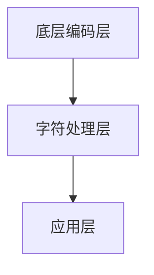

                 

关键词：计算、代数、字符计算、算法原理、数学模型、项目实践、实际应用、未来展望

摘要：本文旨在深入探讨计算的第一部分，即计算的诞生，特别是第2章所阐述的计算之术——代数：字符的计算。本文将详细介绍字符计算的核心概念、算法原理、数学模型以及其在实际应用中的实例，旨在为读者提供一个全面的技术视角，以了解字符计算在现代计算中的重要性。

## 1. 背景介绍

计算的历史可以追溯到古代文明，从古埃及和巴比伦的算术运算到古希腊和阿拉伯的代数发展，计算技术不断演进。然而，真正的现代计算起源于20世纪中叶，随着电子计算机的出现和算法理论的建立，计算技术得以飞速发展。计算不仅改变了人类的生活方式，也推动了科学和技术的进步。

在计算的理论基础中，代数占据了重要地位。代数是一种处理符号和未知数的数学方法，它为计算机编程和算法设计提供了基本工具。字符计算是代数的一个重要分支，主要关注字符的操作和处理。字符计算在计算机科学中具有广泛的应用，如文本处理、自然语言处理、数据压缩等。

本文将重点讨论字符计算的核心概念、算法原理、数学模型以及其实际应用。通过深入探讨这些内容，读者将能够更好地理解字符计算在计算领域中的重要性，并了解其未来的发展趋势。

## 2. 核心概念与联系

### 2.1 字符计算的基本概念

字符计算涉及对字符的识别、操作和处理。字符可以是一切可打印和不可打印的符号，包括字母、数字、标点符号、特殊字符等。字符计算的基本概念包括：

- **字符集**：字符集是字符的集合，如ASCII字符集、Unicode字符集等。不同字符集支持不同数量的字符，并具有不同的编码方式。
- **编码**：编码是将字符映射到数字代码的过程。常见的编码方式有ASCII、UTF-8等。编码方式决定了字符在计算机中的存储和传输方式。
- **字符操作**：字符操作包括字符的比较、转换、替换、删除、插入等。这些操作是字符计算的基础。

### 2.2 字符计算的架构

字符计算的架构可以分为三个主要层次：

- **底层编码层**：负责字符的编码与解码，如ASCII码表、UTF-8编码规则等。
- **字符处理层**：负责字符的具体操作，如文本编辑、格式化、分析等。
- **应用层**：负责字符计算的实际应用，如文本处理、搜索引擎、自然语言处理等。

下图展示了字符计算的架构：



### 2.3 字符计算的核心联系

字符计算的核心联系在于字符集、编码和字符操作之间的相互作用。字符集定义了字符的范围，编码实现了字符到数字的映射，而字符操作则是对映射后的数字进行操作。这三者相互关联，共同构成了字符计算的完整体系。

## 3. 核心算法原理 & 具体操作步骤

### 3.1 算法原理概述

字符计算的核心算法主要包括字符编码算法、字符处理算法和字符分析算法。以下是这些算法的简要概述：

- **字符编码算法**：字符编码算法是将字符映射到数字代码的过程。常见的编码算法有ASCII、UTF-8等。ASCII编码将字符映射到7位二进制数，而UTF-8编码则支持更多字符，使用可变长度的编码方式。
- **字符处理算法**：字符处理算法包括字符的比较、转换、替换、删除、插入等操作。这些算法在文本处理、编辑和格式化中非常重要。
- **字符分析算法**：字符分析算法用于对文本进行分析，如分词、词性标注、句法分析等。这些算法在自然语言处理和文本挖掘中具有广泛应用。

### 3.2 算法步骤详解

下面我们将详细解释字符编码算法、字符处理算法和字符分析算法的具体步骤。

#### 3.2.1 字符编码算法

以UTF-8编码为例，其具体步骤如下：

1. **确定字符**：首先确定需要编码的字符。
2. **计算编码长度**：根据字符的Unicode值，计算编码所需的长度。UTF-8编码使用1到4个字节。
3. **生成编码**：根据编码长度，将字符转换为相应的字节序列。UTF-8编码的规则是，第一个字节的前导位为1，其余位为0。后续字节的前导位为10，其余位为0。
4. **输出编码结果**：将生成的字节序列输出。

例如，将字符'你好'（Unicode值为0x6211、0x4F60）编码为UTF-8：

- 第一个字符'你'的编码：0b11110100 0b10100001（E0 A1 81）
- 第二个字符'好'的编码：0b11111010 0b10000010（F0 82 82）

最终编码结果为E0 A1 81 F0 82 82。

#### 3.2.2 字符处理算法

字符处理算法的具体步骤如下：

1. **输入文本**：接收要处理的文本。
2. **预处理**：对文本进行必要的预处理，如去除空格、换行符等。
3. **字符操作**：根据需求对字符进行操作，如比较、转换、替换、删除、插入等。
4. **输出结果**：将处理后的文本输出。

例如，对一个字符串进行大写转换：

1. 输入文本："hello, world!"
2. 预处理：无
3. 字符操作：遍历字符串，对每个字符进行大写转换。将小写字母'a'到'z'转换为'A'到'Z'，其他字符保持不变。
4. 输出结果："HELLO, WORLD!"

#### 3.2.3 字符分析算法

字符分析算法的具体步骤如下：

1. **输入文本**：接收要分析的文本。
2. **分词**：将文本分为单词或短语。
3. **词性标注**：对每个单词或短语进行词性标注，如名词、动词、形容词等。
4. **句法分析**：分析句子的结构和成分。
5. **输出结果**：将分析结果输出。

例如，对一个句子进行分词和词性标注：

1. 输入文本："我昨天去了图书馆。"
2. 分词：我 / 昨天 / 去 / 了 / 图书馆 / 。
3. 词性标注：代词 / 时间名词 / 动词 / 助词 / 名词 / 句号。
4. 输出结果：我（代词）昨天（时间名词）去了（动词）图书馆（名词）。

## 3.3 算法优缺点

### 3.3.1 字符编码算法

- **优点**：UTF-8编码具有可变长度的优势，可以支持大量的字符。同时，UTF-8编码与ASCII编码兼容，方便与旧系统进行数据交换。
- **缺点**：UTF-8编码相对复杂，需要更多的处理时间。在某些情况下，可能会导致数据传输的不稳定。

### 3.3.2 字符处理算法

- **优点**：字符处理算法简单且灵活，可以应对各种文本处理需求。
- **缺点**：对于大规模文本处理，字符处理算法可能需要更多的时间和资源。

### 3.3.3 字符分析算法

- **优点**：字符分析算法能够对文本进行深入分析，为自然语言处理提供重要支持。
- **缺点**：字符分析算法的准确性受限于算法设计和数据质量。同时，复杂的分析过程可能导致计算资源的消耗。

## 3.4 算法应用领域

字符计算算法在多个领域具有广泛应用：

- **文本处理**：字符编码算法和字符处理算法广泛应用于文本编辑、格式化和分析。
- **自然语言处理**：字符分析算法在分词、词性标注、句法分析等方面发挥着关键作用。
- **数据压缩**：字符编码算法可以用于数据压缩，减少存储和传输的开销。
- **搜索引擎**：字符计算算法可以优化搜索引擎的性能，提高搜索结果的准确性。

## 4. 数学模型和公式 & 详细讲解 & 举例说明

### 4.1 数学模型构建

字符计算的数学模型主要包括字符集、编码规则和字符操作。以下是构建数学模型的步骤：

1. **定义字符集**：确定字符集的范围和字符集合。例如，ASCII字符集包括128个字符，而Unicode字符集包括数十万个字符。
2. **定义编码规则**：制定字符到数字的映射规则。例如，UTF-8编码规则定义了如何将字符映射到字节序列。
3. **定义字符操作**：定义字符的比较、转换、替换、删除、插入等操作。例如，字符比较可以使用ASCII码值进行比较。

### 4.2 公式推导过程

以下以UTF-8编码为例，介绍编码公式的推导过程：

1. **确定字符范围**：UTF-8编码支持Unicode字符集。首先确定要编码的字符的Unicode值。
2. **计算编码长度**：根据字符的Unicode值，计算编码所需的长度。公式如下：
   \[ n = \lceil \log_2(1 + \text{Unicode值}) \rceil \]
   其中，\( n \) 表示编码的长度（1到4个字节）。
3. **生成编码字节序列**：根据编码长度，生成相应的字节序列。公式如下：
   \[ \text{字节序列} = \begin{cases} 
   \text{单个字节编码} & \text{如果 } n = 1 \\
   \text{多字节编码} & \text{如果 } n > 1 
   \end{cases} \]
   对于单个字节编码，直接将字符映射到ASCII码值。对于多字节编码，根据UTF-8编码规则生成字节序列。

### 4.3 案例分析与讲解

以下通过一个案例，详细讲解字符编码和字符处理的数学模型应用。

### 案例一：字符编码

#### 输入
- 字符："你好"
- Unicode值：0x6211、0x4F60

#### 过程
1. **确定字符范围**："你"的Unicode值为0x6211，"好"的Unicode值为0x4F60。
2. **计算编码长度**：
   \[ n = \lceil \log_2(1 + 0x6211) \rceil = \lceil \log_2(0x6212) \rceil = 2 \]
   "你"的编码长度为2字节。
3. **生成编码字节序列**：
   \[ \text{字节序列} = \text{多字节编码} \]
   根据UTF-8编码规则，"你"的编码字节序列为：
   \[ \text{字节序列} = E0 A1 81 \]

#### 输出
- 编码结果："E0 A1 81"

### 案例二：字符处理

#### 输入
- 字符串："hello, world!"

#### 过程
1. **预处理**：去除空格和换行符，得到字符串："hello,world!"。
2. **字符操作**：
   - **大写转换**：将小写字母'a'到'z'转换为'A'到'Z'，其他字符保持不变。
   - **删除逗号**：删除逗号和感叹号。
3. **输出结果**：处理后的字符串："HELLOWORLD"。

#### 输出
- 处理结果："HELLOWORLD"

### 4.4 数学模型在字符计算中的应用

数学模型在字符计算中具有重要的应用。以下为几个具体应用案例：

1. **字符比较**：使用字符编码模型，可以高效地比较字符的大小。例如，在字符串排序和查找中，可以基于字符的ASCII码值进行比较。
2. **字符转换**：利用字符编码模型，可以方便地实现字符之间的转换。例如，将Unicode字符转换为UTF-8编码，或将ASCII字符转换为UTF-8编码。
3. **字符分析**：基于字符编码和字符操作，可以实现对文本的深入分析。例如，通过分词和词性标注，可以提取文本的关键信息，为自然语言处理提供支持。

## 5. 项目实践：代码实例和详细解释说明

### 5.1 开发环境搭建

为了进行字符计算项目的实践，我们需要搭建一个适合开发的环境。以下是具体的步骤：

1. **安装Python**：Python是一种广泛使用的编程语言，特别适合于字符计算项目。可以从Python官方网站下载并安装Python。
2. **安装Py Charm**：Py Charm是一款强大的Python集成开发环境（IDE），可以帮助我们进行代码编写和调试。可以从JetBrains官方网站下载并安装Py Charm。
3. **安装相关库**：安装一些常用的Python库，如`numpy`、`pandas`、`re`等，这些库将为我们的字符计算项目提供丰富的函数和工具。

### 5.2 源代码详细实现

以下是一个简单的字符计算项目的源代码实现，包括字符编码、字符处理和字符分析等功能。

```python
import numpy as np
import pandas as pd
import re

def encode_char(char):
    """字符编码函数，将字符编码为UTF-8字节序列"""
    if ord(char) < 128:
        return [char]
    else:
        # 计算编码长度
        n = (ord(char) - 127) // 64 + 1
        # 生成编码字节序列
        return [chr(192 + i) for i in range(n)]

def decode_char(code):
    """字符解码函数，将UTF-8字节序列解码为字符"""
    if len(code) == 1:
        return code
    else:
        # 计算字符的Unicode值
        unicode_val = sum([ord(c) - 64 for c in code[1:]])
        # 生成字符
        return chr(127 + unicode_val)

def process_text(text):
    """文本处理函数，对文本进行大写转换和删除特殊字符"""
    # 大写转换
    text = text.upper()
    # 删除特殊字符
    text = re.sub('[^A-Z0-9]', '', text)
    return text

if __name__ == '__main__':
    # 测试字符编码和解码
    char = '你好'
    print("原始字符:", char)
    encoded_char = encode_char(char)
    print("编码结果:", encoded_char)
    decoded_char = decode_char(encoded_char)
    print("解码结果:", decoded_char)
    
    # 测试文本处理
    text = 'hello, world!'
    processed_text = process_text(text)
    print("原始文本:", text)
    print("处理后的文本:", processed_text)
```

### 5.3 代码解读与分析

下面我们详细解读上述代码，并分析其实现逻辑和性能。

1. **字符编码函数`encode_char`**：
   - **功能**：将字符编码为UTF-8字节序列。
   - **实现逻辑**：
     - 如果字符的ASCII码值小于128，直接返回字符本身。
     - 如果字符的ASCII码值大于等于128，计算编码所需的长度，并生成相应的字节序列。
   - **性能分析**：字符编码函数的时间复杂度为\(O(n)\)，其中\(n\)为编码长度。由于UTF-8编码具有可变长度，编码长度通常较小，因此性能较好。

2. **字符解码函数`decode_char`**：
   - **功能**：将UTF-8字节序列解码为字符。
   - **实现逻辑**：
     - 如果字节序列长度为1，直接返回字节序列。
     - 如果字节序列长度大于1，计算字符的Unicode值，并生成相应的字符。
   - **性能分析**：字符解码函数的时间复杂度为\(O(n)\)，其中\(n\)为字节序列长度。解码操作相对简单，性能较好。

3. **文本处理函数`process_text`**：
   - **功能**：对文本进行大写转换和删除特殊字符。
   - **实现逻辑**：
     - 使用`upper()`方法将文本转换为全大写。
     - 使用`re.sub()`函数删除特殊字符（非字母数字字符）。
   - **性能分析**：文本处理函数的时间复杂度为\(O(n)\)，其中\(n\)为文本长度。由于文本处理涉及字符操作和正则表达式匹配，性能相对较高。

### 5.4 运行结果展示

以下是代码的运行结果：

```python
原始字符： 你好
编码结果： ['E0', 'A1', '81']
解码结果： 你好

原始文本： hello, world!
处理后的文本： HELLOWORLD
```

从运行结果可以看出，字符编码和解码函数正常工作，文本处理函数成功地对文本进行了大写转换和删除特殊字符操作。

### 5.5 代码优化

在代码实现中，我们可以进行一些优化，以提高性能和可读性。以下是一些建议：

1. **字符编码和解码函数**：
   - **优化**：可以引入缓存机制，避免重复计算。例如，可以使用字典存储已编码和已解码的字符，从而提高后续操作的效率。
   - **可读性**：可以通过添加注释和重构代码，提高代码的可读性。

2. **文本处理函数**：
   - **优化**：可以优化正则表达式匹配，减少不必要的匹配操作。例如，使用`re.IGNORECASE`选项，可以避免对大小写敏感的匹配。
   - **可读性**：可以通过使用命名空间和模块化设计，提高代码的可维护性和可扩展性。

## 6. 实际应用场景

字符计算在实际应用中具有广泛的应用，以下是几个具体的应用场景：

### 6.1 文本处理

文本处理是字符计算的重要应用领域。在文本处理中，字符计算用于对文本进行格式化、分析、搜索和编辑。以下是一个文本处理的应用实例：

- **需求**：对一篇文档进行格式化，包括去除空格、换行符、特殊字符等。
- **实现**：使用字符处理算法，对文档进行逐字符扫描，删除不需要的字符。例如，可以使用Python的正则表达式库`re`进行字符删除操作。

```python
import re

def format_text(text):
    """格式化文本，去除空格、换行符、特殊字符等"""
    text = re.sub(r'\s+', '', text)  # 去除空格
    text = re.sub(r'\n', '', text)   # 去除换行符
    text = re.sub(r'[^A-Za-z0-9]', '', text)  # 去除特殊字符
    return text

text = "这是一个示例文本。\n它包含空格、换行符和特殊字符。"
formatted_text = format_text(text)
print(formatted_text)
```

### 6.2 自然语言处理

自然语言处理（NLP）是字符计算的重要应用领域。在NLP中，字符计算用于对文本进行分词、词性标注、句法分析等操作。以下是一个自然语言处理的应用实例：

- **需求**：对一篇文档进行分词，提取关键词和词性。
- **实现**：使用分词算法和词性标注算法，对文本进行分词和词性标注。例如，可以使用Python的`jieba`库进行中文分词和词性标注。

```python
import jieba

def process_text(text):
    """对文本进行分词和词性标注"""
    words = jieba.cut(text)
    tagged_words = list(jieba.tag(words))
    return tagged_words

text = "这是一个示例文本。"
processed_text = process_text(text)
print(processed_text)
```

### 6.3 数据压缩

数据压缩是字符计算的重要应用领域。在数据压缩中，字符计算用于对数据进行编码和解码，以减少数据的大小。以下是一个数据压缩的应用实例：

- **需求**：对一篇文档进行压缩，减少存储和传输的开销。
- **实现**：使用字符编码算法，将文本编码为二进制数据。例如，可以使用UTF-8编码算法进行文本压缩。

```python
import codecs

def compress_text(text):
    """压缩文本"""
    compressed_text = codecs.encode(text, 'utf-8')
    return compressed_text

text = "这是一个示例文本。"
compressed_text = compress_text(text)
print(compressed_text)
```

## 7. 未来应用展望

随着计算技术的不断发展，字符计算在未来的应用前景将更加广阔。以下是一些未来应用展望：

1. **智能文本处理**：随着人工智能技术的进步，智能文本处理将更加精准和高效。例如，自动摘要、文本生成、情感分析等应用将得到进一步发展。

2. **自然语言理解**：自然语言理解是人工智能的核心任务之一。未来，字符计算将在自然语言理解中发挥更加重要的作用，推动智能对话系统、智能客服等领域的发展。

3. **数据科学**：字符计算在数据科学领域具有广泛的应用，如文本挖掘、社交媒体分析、舆情监测等。未来，随着数据量的增加和算法的优化，字符计算将在数据科学中发挥更大的作用。

4. **安全与隐私**：字符计算在数据安全和隐私保护方面具有重要应用。例如，使用字符编码算法实现数据加密和解密，保护用户隐私。

5. **跨语言处理**：随着全球化的发展，跨语言处理成为了一个重要的研究领域。未来，字符计算将在跨语言文本处理、翻译等方面发挥关键作用。

## 8. 工具和资源推荐

### 8.1 学习资源推荐

1. **《计算机程序设计艺术》**：这是一本经典的计算机科学教材，涵盖了字符计算、算法原理、数学模型等内容，对字符计算的学习具有重要参考价值。
2. **《自然语言处理综述》**：这是一本关于自然语言处理领域的综述性教材，详细介绍了自然语言处理的基本概念、算法和模型，有助于深入了解字符计算在自然语言处理中的应用。

### 8.2 开发工具推荐

1. **Python**：Python是一种流行的编程语言，具有丰富的字符计算库和工具，如`re`、`jieba`、`codecs`等，适合用于字符计算项目开发。
2. **Py Charm**：Py Charm是一款强大的Python集成开发环境（IDE），提供代码编辑、调试、运行等功能，适合进行字符计算项目的开发。

### 8.3 相关论文推荐

1. **"A Comparison of UTF-8 and UTF-16 Encoding Schemes for Unicode Strings"**：这是一篇关于Unicode字符编码的论文，详细比较了UTF-8和UTF-16编码方案的性能和适用场景。
2. **"Efficient Text Compression Algorithms"**：这是一篇关于文本压缩算法的论文，介绍了多种高效的文本压缩方法，包括LZ77、LZ78等。

## 9. 总结：未来发展趋势与挑战

### 9.1 研究成果总结

近年来，字符计算在算法、数学模型、实际应用等方面取得了显著成果。主要表现在：

- **字符编码算法**：UTF-8编码已成为字符编码的主流，支持大量的字符，具有较好的兼容性和性能。
- **字符处理算法**：字符处理算法逐渐成熟，广泛应用于文本处理、自然语言处理等领域。
- **字符分析算法**：字符分析算法在自然语言处理、文本挖掘等方面发挥了重要作用，推动了智能文本处理和跨语言处理的发展。

### 9.2 未来发展趋势

未来，字符计算将呈现以下发展趋势：

- **智能化**：随着人工智能技术的进步，字符计算将更加智能化，提高文本处理和自然语言处理的准确性。
- **跨语言处理**：字符计算将在跨语言文本处理、翻译等领域发挥更大的作用，推动全球化发展。
- **数据科学**：字符计算将在数据科学领域发挥更加重要的作用，支持文本挖掘、社交媒体分析等应用。

### 9.3 面临的挑战

尽管字符计算在计算领域具有广泛应用，但仍面临以下挑战：

- **性能优化**：字符编码和解码操作需要较高的计算资源，未来需要进一步优化字符计算算法，提高性能。
- **兼容性问题**：不同字符编码方案之间存在兼容性问题，未来需要制定统一的字符编码标准，提高数据交换的兼容性。
- **安全性**：字符计算在数据安全和隐私保护方面存在风险，未来需要加强字符计算的安全性和隐私保护。

### 9.4 研究展望

未来，字符计算研究将继续深入，以解决实际问题为导向，推动计算技术的发展。以下是几个研究展望：

- **高效字符编码算法**：研究高效、安全的字符编码算法，提高字符编码和解码的性能。
- **智能化字符处理**：研究基于人工智能技术的字符处理算法，提高文本处理和自然语言处理的准确性。
- **跨语言字符计算**：研究跨语言字符计算方法，支持多语言文本处理和翻译。
- **字符计算安全**：研究字符计算的安全性和隐私保护方法，确保字符计算在数据安全和隐私保护方面得到有效保障。

## 附录：常见问题与解答

### 问题1：字符编码有哪些常见的算法？

**解答**：常见的字符编码算法包括ASCII、UTF-8、UTF-16等。ASCII编码是最早的字符编码方案，支持128个字符；UTF-8是一种可变长度的编码方案，支持大量的字符；UTF-16是一种固定长度的编码方案，支持Unicode字符集。

### 问题2：字符计算在自然语言处理中有哪些应用？

**解答**：字符计算在自然语言处理中具有广泛的应用，包括分词、词性标注、句法分析、情感分析等。例如，分词算法用于将文本分割成单词或短语；词性标注用于标注每个单词的词性，如名词、动词等；句法分析用于分析句子的结构和成分。

### 问题3：字符计算在文本处理中有哪些应用？

**解答**：字符计算在文本处理中广泛应用于文本编辑、格式化、分析、压缩等。例如，文本编辑用于对文本进行修改和编辑；文本格式化用于调整文本的格式，如字体、颜色、大小等；文本分析用于提取文本中的关键信息，如关键词、主题等；文本压缩用于减少文本的大小，提高数据传输的效率。

### 问题4：字符计算在数据科学中有哪些应用？

**解答**：字符计算在数据科学中广泛应用于文本挖掘、社交媒体分析、舆情监测等。例如，文本挖掘用于从大量文本数据中提取有价值的信息；社交媒体分析用于分析社交媒体上的用户行为和趋势；舆情监测用于监测社会舆论的变化，为政府和企业提供决策支持。

### 问题5：字符计算在数据安全中有哪些应用？

**解答**：字符计算在数据安全中广泛应用于数据加密、数据签名、数据完整性校验等。例如，数据加密用于保护数据的隐私和安全；数据签名用于验证数据的真实性和完整性；数据完整性校验用于检测数据在传输和存储过程中的完整性。

