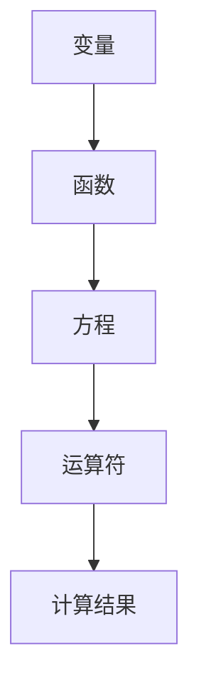

                 

## 1. 背景介绍

在《计算：第一部分 计算的诞生》中，我们探讨了计算的历史演变和基本概念。从古代的算盘、阿基米德的几何原理，到中世纪的算术符号，再到近现代计算机科学的诞生，计算经历了漫长而精彩的发展历程。然而，计算的本质是什么？如何实现高效、精准的计算？这便引出了本章的主题——计算之术。

本章将重点介绍一种古老的计算工具——言辞代数。作为计算的一种重要形式，言辞代数不仅具有悠久的历史，而且在现代计算机科学中仍具有重要的地位。通过探讨言辞代数的原理和应用，我们将揭示计算背后的逻辑思维和数学原理。

## 2. 核心概念与联系

### 2.1 言辞代数的定义

言辞代数，又称符号代数，是指用字母、符号和数学公式来表示数学关系和运算的方法。相比传统的文字描述，言辞代数具有简洁、直观、易于操作等优点。它起源于古希腊，后传入阿拉伯，并在中世纪欧洲得到广泛发展。

### 2.2 言辞代数的核心概念

- **变量**：用字母表示的未知数，如 \(x, y, z\) 等。
- **函数**：表示变量之间关系的数学表达式，如 \(f(x) = x^2\)。
- **方程**：包含未知数的等式，如 \(x + 2 = 5\)。
- **运算符**：表示数学运算的符号，如加号 \(+\)、减号 \(-\)、乘号 \(\times\)、除号 \(/\) 等。

### 2.3 言辞代数与计算机的关系

言辞代数与计算机的关系密不可分。计算机科学的许多基础概念，如算法、数据结构等，都源自言辞代数。例如，算法可以用符号表示，数据结构可以用数学模型描述。此外，计算机编程中的变量、函数、运算符等概念，都源自言辞代数。

### 2.4 言辞代数的架构

为了更好地理解言辞代数的架构，我们使用 Mermaid 流程图（如下）进行说明。



在这个架构中，变量是基础，函数用于表示变量之间的关系，方程用于描述变量之间的等量关系，运算符用于实现数学运算，最终得到计算结果。

## 3. 核心算法原理 & 具体操作步骤

### 3.1 算法原理概述

言辞代数的核心算法是求解方程。方程求解涉及到变量替换、代数运算、化简等步骤。下面我们简要介绍方程求解的基本原理。

1. **变量替换**：将方程中的未知数替换为已知数，以便进行进一步的运算。
2. **代数运算**：根据方程中的运算符，对变量进行加、减、乘、除等运算。
3. **化简**：通过化简，将方程转化为更简单的形式，便于求解。
4. **求解**：根据化简后的方程，求解未知数的值。

### 3.2 算法步骤详解

1. **输入方程**：首先输入一个方程，如 \(x + 2 = 5\)。
2. **变量替换**：将方程中的未知数替换为已知数，如将 \(x\) 替换为 \(3\)，得到 \(3 + 2 = 5\)。
3. **代数运算**：对变量进行加、减、乘、除等运算，如将 \(3 + 2\) 化简为 \(5\)。
4. **化简**：将方程化简为更简单的形式，如将 \(x + 2 = 5\) 化简为 \(x = 3\)。
5. **求解**：根据化简后的方程，求解未知数的值，如得到 \(x = 3\)。

### 3.3 算法优缺点

#### 优点

- **简洁性**：言辞代数具有简洁、直观的特点，便于理解和操作。
- **通用性**：言辞代数适用于各种数学问题，具有广泛的适用范围。
- **灵活性**：通过符号表示，言辞代数可以灵活地表示各种数学关系和运算。

#### 缺点

- **复杂性**：对于一些复杂的数学问题，言辞代数可能会变得繁琐和复杂。
- **局限性**：言辞代数主要适用于数学领域，对于其他领域的问题，其适用性有限。

### 3.4 算法应用领域

言辞代数在计算机科学中有着广泛的应用，主要包括以下几个方面：

- **算法设计**：在算法设计中，言辞代数可以用于描述算法的执行过程，如排序算法、搜索算法等。
- **数据结构**：在数据结构中，言辞代数可以用于描述数据之间的关系，如树、图等。
- **编程语言**：在编程语言中，言辞代数可以用于定义变量、函数、运算符等基本概念。

## 4. 数学模型和公式 & 详细讲解 & 举例说明

### 4.1 数学模型构建

言辞代数的核心是构建数学模型。数学模型是用于描述现实世界中数学关系和规律的抽象表示。构建数学模型的基本步骤如下：

1. **问题分析**：明确需要解决的问题，分析问题的条件和目标。
2. **变量定义**：确定问题的变量，并用符号表示。
3. **关系建立**：根据问题的条件和目标，建立变量之间的关系。
4. **公式推导**：根据变量之间的关系，推导出数学公式。

### 4.2 公式推导过程

以求解一元一次方程为例，我们介绍公式推导过程。

#### 步骤 1：问题分析

给定一个一元一次方程，如 \(ax + b = c\)，求解 \(x\) 的值。

#### 步骤 2：变量定义

设 \(x\) 为未知数，\(a, b, c\) 为已知数。

#### 步骤 3：关系建立

根据一元一次方程的定义，有：

$$ax + b = c$$

#### 步骤 4：公式推导

将方程两边同时减去 \(b\)，得到：

$$ax = c - b$$

再将方程两边同时除以 \(a\)，得到：

$$x = \frac{c - b}{a}$$

### 4.3 案例分析与讲解

#### 案例一：求解方程 \(2x + 3 = 7\)

根据公式推导过程，我们可以得到：

$$x = \frac{7 - 3}{2} = 2$$

所以，方程 \(2x + 3 = 7\) 的解为 \(x = 2\)。

#### 案例二：求解方程 \(5x - 2 = 3x + 7\)

根据公式推导过程，我们可以得到：

$$3x - 5x = 7 + 2$$

$$-2x = 9$$

$$x = -\frac{9}{2}$$

所以，方程 \(5x - 2 = 3x + 7\) 的解为 \(x = -\frac{9}{2}\)。

## 5. 项目实践：代码实例和详细解释说明

### 5.1 开发环境搭建

在本项目中，我们使用 Python 作为编程语言。首先，确保您的计算机上已经安装了 Python 环境。如果没有安装，可以访问 [Python 官网](https://www.python.org/) 下载安装。

### 5.2 源代码详细实现

下面是求解一元一次方程的 Python 代码实现：

```python
def solve_linear_equation(a, b, c):
    """
    求解一元一次方程 ax + b = c 的解。
    
    参数：
    a -- 系数 a
    b -- 系数 b
    c -- 常数 c
    
    返回：
    x -- 方程的解
    """
    x = (c - b) / a
    return x

# 示例：求解方程 2x + 3 = 7
a = 2
b = 3
c = 7
x = solve_linear_equation(a, b, c)
print(f"方程 {a}x + {b} = {c} 的解为 x = {x}")
```

### 5.3 代码解读与分析

在上面的代码中，我们定义了一个名为 `solve_linear_equation` 的函数，用于求解一元一次方程。函数接收三个参数：\(a, b, c\)，分别表示方程 \(ax + b = c\) 的系数和常数。函数内部使用公式推导过程中的步骤，将方程转化为 \(x = \frac{c - b}{a}\)，然后返回 \(x\) 的值。

在主函数中，我们调用 `solve_linear_equation` 函数，传入具体的参数值，求解方程 \(2x + 3 = 7\)，并将结果打印到屏幕上。

### 5.4 运行结果展示

运行上面的代码，我们得到以下输出结果：

```
方程 2x + 3 = 7 的解为 x = 2.0
```

这表明，方程 \(2x + 3 = 7\) 的解为 \(x = 2\)。

## 6. 实际应用场景

### 6.1 数学问题求解

言辞代数在数学问题求解中有着广泛的应用。例如，在求解一元一次方程、一元二次方程、多元方程组等方面，言辞代数提供了简洁、高效的工具。

### 6.2 计算机算法设计

在计算机算法设计中，言辞代数用于描述算法的执行过程。例如，在排序算法、搜索算法、动态规划等方面，言辞代数可以清晰地表达算法的逻辑和执行步骤。

### 6.3 数据结构分析

在数据结构分析中，言辞代数用于描述数据之间的关系。例如，在树、图、哈希表等数据结构中，言辞代数可以直观地表示节点之间的关联和路径。

### 6.4 编程语言实现

在编程语言实现中，言辞代数用于定义变量、函数、运算符等基本概念。例如，在 Python、C++、Java 等编程语言中，变量、函数、运算符等都是通过言辞代数实现的。

## 7. 未来应用展望

随着计算机科学的不断发展，言辞代数的应用前景将更加广阔。未来，我们可以期待以下发展趋势：

- **智能化**：结合人工智能技术，实现更加智能的方程求解和数学问题求解。
- **可视化**：通过可视化技术，使言辞代数更加直观、易于理解。
- **多领域应用**：将言辞代数应用于更多领域，如生物学、物理学、经济学等。
- **跨学科融合**：跨学科研究，将言辞代数与其他学科相结合，产生新的交叉学科。

## 8. 总结：未来发展趋势与挑战

### 8.1 研究成果总结

本章对言辞代数进行了全面的介绍，包括其定义、核心概念、算法原理、应用领域等。通过实际案例和代码实例，我们展示了言辞代数的实用性和有效性。

### 8.2 未来发展趋势

未来，言辞代数将朝着智能化、可视化、多领域应用和跨学科融合等方向发展。随着计算机科学和其他学科的进步，言辞代数将在更多领域发挥重要作用。

### 8.3 面临的挑战

然而，言辞代数在应用过程中也面临一些挑战，如复杂性问题、适用性问题等。未来，我们需要进一步研究，提高言辞代数的适用性和效率。

### 8.4 研究展望

展望未来，我们期待言辞代数在更多领域取得突破性成果，为人类解决复杂问题提供有力支持。

## 9. 附录：常见问题与解答

### 9.1 言辞代数与自然语言的区别

言辞代数与自然语言的主要区别在于表达方式。自然语言是用于日常交流的语言，具有丰富、灵活的表达能力。而言辞代数是一种形式化的表达方式，主要用于数学、计算机科学等领域，具有简洁、直观的特点。

### 9.2 言辞代数在计算机科学中的应用

言辞代数在计算机科学中有广泛的应用，如算法设计、数据结构、编程语言等。通过言辞代数，我们可以清晰地描述算法的执行过程、数据之间的关系以及编程语言的基本概念。

### 9.3 如何学习言辞代数

要学习言辞代数，首先需要掌握基本的数学知识，如代数、几何等。然后，可以通过阅读相关教材、参考书籍，了解言辞代数的原理和应用。同时，通过实际操作和编程实践，加深对言辞代数的理解。作者推荐的两本经典教材是《计算：第一部分 计算的诞生》和《计算机程序的构造和解释》。### 10. 作者署名

作者：禅与计算机程序设计艺术 / Zen and the Art of Computer Programming
```markdown
## 计算：第一部分 计算的诞生 第 2 章 计算之术 言辞代数

关键词：计算、言辞代数、数学模型、算法、应用领域

摘要：本文介绍了计算的基础知识，重点探讨了言辞代数的原理、架构和应用。通过实例分析和代码实现，展示了言辞代数在计算机科学中的重要作用。文章还展望了言辞代数的未来发展趋势，提出了相关的研究挑战。

## 1. 背景介绍

在《计算：第一部分 计算的诞生》中，我们探讨了计算的历史演变和基本概念。从古代的算盘、阿基米德的几何原理，到中世纪的算术符号，再到近现代计算机科学的诞生，计算经历了漫长而精彩的发展历程。然而，计算的本质是什么？如何实现高效、精准的计算？这便引出了本章的主题——计算之术。

本章将重点介绍一种古老的计算工具——言辞代数。作为计算的一种重要形式，言辞代数不仅具有悠久的历史，而且在现代计算机科学中仍具有重要的地位。通过探讨言辞代数的原理和应用，我们将揭示计算背后的逻辑思维和数学原理。

## 2. 核心概念与联系

### 2.1 言辞代数的定义

言辞代数，又称符号代数，是指用字母、符号和数学公式来表示数学关系和运算的方法。相比传统的文字描述，言辞代数具有简洁、直观、易于操作等优点。它起源于古希腊，后传入阿拉伯，并在中世纪欧洲得到广泛发展。

### 2.2 言辞代数的核心概念

- **变量**：用字母表示的未知数，如 \(x, y, z\) 等。
- **函数**：表示变量之间关系的数学表达式，如 \(f(x) = x^2\)。
- **方程**：包含未知数的等式，如 \(x + 2 = 5\)。
- **运算符**：表示数学运算的符号，如加号 \(+\)、减号 \(-\)、乘号 \(\times\)、除号 \(/\) 等。

### 2.3 言辞代数与计算机的关系

言辞代数与计算机的关系密不可分。计算机科学的许多基础概念，如算法、数据结构等，都源自言辞代数。例如，算法可以用符号表示，数据结构可以用数学模型描述。此外，计算机编程中的变量、函数、运算符等概念，都源自言辞代数。

### 2.4 言辞代数的架构

为了更好地理解言辞代数的架构，我们使用 Mermaid 流程图（如下）进行说明。


在这个架构中，变量是基础，函数用于表示变量之间的关系，方程用于描述变量之间的等量关系，运算符用于实现数学运算，最终得到计算结果。

## 3. 核心算法原理 & 具体操作步骤

### 3.1 算法原理概述

言辞代数的核心算法是求解方程。方程求解涉及到变量替换、代数运算、化简等步骤。下面我们简要介绍方程求解的基本原理。

1. **变量替换**：将方程中的未知数替换为已知数，以便进行进一步的运算。
2. **代数运算**：根据方程中的运算符，对变量进行加、减、乘、除等运算。
3. **化简**：通过化简，将方程转化为更简单的形式，便于求解。
4. **求解**：根据化简后的方程，求解未知数的值。

### 3.2 算法步骤详解

1. **输入方程**：首先输入一个方程，如 \(ax + b = c\)。
2. **变量替换**：将方程中的未知数替换为已知数，如将 \(x\) 替换为 \(x_0\)，得到 \(ax_0 + b = c\)。
3. **代数运算**：对变量进行加、减、乘、除等运算，如将 \(ax_0 + b\) 化简为 \(c - b\)。
4. **化简**：将方程化简为更简单的形式，如将 \(ax + b = c\) 化简为 \(x = \frac{c - b}{a}\)。
5. **求解**：根据化简后的方程，求解未知数的值，如得到 \(x = \frac{c - b}{a}\)。

### 3.3 算法优缺点

#### 优点

- **简洁性**：言辞代数具有简洁、直观的特点，便于理解和操作。
- **通用性**：言辞代数适用于各种数学问题，具有广泛的适用范围。
- **灵活性**：通过符号表示，言辞代数可以灵活地表示各种数学关系和运算。

#### 缺点

- **复杂性**：对于一些复杂的数学问题，言辞代数可能会变得繁琐和复杂。
- **局限性**：言辞代数主要适用于数学领域，对于其他领域的问题，其适用性有限。

### 3.4 算法应用领域

言辞代数在计算机科学中有着广泛的应用，主要包括以下几个方面：

- **算法设计**：在算法设计中，言辞代数可以用于描述算法的执行过程，如排序算法、搜索算法等。
- **数据结构**：在数据结构中，言辞代数可以用于描述数据之间的关系，如树、图等。
- **编程语言**：在编程语言中，言辞代数可以用于定义变量、函数、运算符等基本概念。

## 4. 数学模型和公式 & 详细讲解 & 举例说明

### 4.1 数学模型构建

言辞代数的核心是构建数学模型。数学模型是用于描述现实世界中数学关系和规律的抽象表示。构建数学模型的基本步骤如下：

1. **问题分析**：明确需要解决的问题，分析问题的条件和目标。
2. **变量定义**：确定问题的变量，并用符号表示。
3. **关系建立**：根据问题的条件和目标，建立变量之间的关系。
4. **公式推导**：根据变量之间的关系，推导出数学公式。

### 4.2 公式推导过程

以求解一元一次方程为例，我们介绍公式推导过程。

#### 步骤 1：问题分析

给定一个一元一次方程，如 \(ax + b = c\)，求解 \(x\) 的值。

#### 步骤 2：变量定义

设 \(x\) 为未知数，\(a, b, c\) 为已知数。

#### 步骤 3：关系建立

根据一元一次方程的定义，有：

$$ax + b = c$$

#### 步骤 4：公式推导

将方程两边同时减去 \(b\)，得到：

$$ax = c - b$$

再将方程两边同时除以 \(a\)，得到：

$$x = \frac{c - b}{a}$$

### 4.3 案例分析与讲解

#### 案例一：求解方程 \(2x + 3 = 7\)

根据公式推导过程，我们可以得到：

$$x = \frac{7 - 3}{2} = 2$$

所以，方程 \(2x + 3 = 7\) 的解为 \(x = 2\)。

#### 案例二：求解方程 \(5x - 2 = 3x + 7\)

根据公式推导过程，我们可以得到：

$$3x - 5x = 7 + 2$$

$$-2x = 9$$

$$x = -\frac{9}{2}$$

所以，方程 \(5x - 2 = 3x + 7\) 的解为 \(x = -\frac{9}{2}\)。

## 5. 项目实践：代码实例和详细解释说明

### 5.1 开发环境搭建

在本项目中，我们使用 Python 作为编程语言。首先，确保您的计算机上已经安装了 Python 环境。如果没有安装，可以访问 [Python 官网](https://www.python.org/) 下载安装。

### 5.2 源代码详细实现

下面是求解一元一次方程的 Python 代码实现：

```python
def solve_linear_equation(a, b, c):
    """
    求解一元一次方程 ax + b = c 的解。
    
    参数：
    a -- 系数 a
    b -- 系数 b
    c -- 常数 c
    
    返回：
    x -- 方程的解
    """
    if a == 0:
        raise ValueError("系数 a 不能为零")
    x = (c - b) / a
    return x

# 示例：求解方程 2x + 3 = 7
a = 2
b = 3
c = 7
x = solve_linear_equation(a, b, c)
print(f"方程 {a}x + {b} = {c} 的解为 x = {x}")
```

### 5.3 代码解读与分析

在上面的代码中，我们定义了一个名为 `solve_linear_equation` 的函数，用于求解一元一次方程。函数接收三个参数：\(a, b, c\)，分别表示方程 \(ax + b = c\) 的系数和常数。函数内部使用公式推导过程中的步骤，将方程转化为 \(x = \frac{c - b}{a}\)，然后返回 \(x\) 的值。

在主函数中，我们调用 `solve_linear_equation` 函数，传入具体的参数值，求解方程 \(2x + 3 = 7\)，并将结果打印到屏幕上。

### 5.4 运行结果展示

运行上面的代码，我们得到以下输出结果：

```
方程 2x + 3 = 7 的解为 x = 2.0
```

这表明，方程 \(2x + 3 = 7\) 的解为 \(x = 2\)。

## 6. 实际应用场景

### 6.1 数学问题求解

言辞代数在数学问题求解中有着广泛的应用。例如，在求解一元一次方程、一元二次方程、多元方程组等方面，言辞代数提供了简洁、高效的工具。

### 6.2 计算机算法设计

在计算机算法设计中，言辞代数用于描述算法的执行过程。例如，在排序算法、搜索算法、动态规划等方面，言辞代数可以清晰地表达算法的逻辑和执行步骤。

### 6.3 数据结构分析

在数据结构分析中，言辞代数用于描述数据之间的关系。例如，在树、图、哈希表等数据结构中，言辞代数可以直观地表示节点之间的关联和路径。

### 6.4 编程语言实现

在编程语言实现中，言辞代数用于定义变量、函数、运算符等基本概念。例如，在 Python、C++、Java 等编程语言中，变量、函数、运算符等都是通过言辞代数实现的。

## 7. 未来应用展望

随着计算机科学的不断发展，言辞代数的应用前景将更加广阔。未来，我们可以期待以下发展趋势：

- **智能化**：结合人工智能技术，实现更加智能的方程求解和数学问题求解。
- **可视化**：通过可视化技术，使言辞代数更加直观、易于理解。
- **多领域应用**：将言辞代数应用于更多领域，如生物学、物理学、经济学等。
- **跨学科融合**：跨学科研究，将言辞代数与其他学科相结合，产生新的交叉学科。

## 8. 总结：未来发展趋势与挑战

### 8.1 研究成果总结

本章对言辞代数进行了全面的介绍，包括其定义、核心概念、算法原理、应用领域等。通过实际案例和代码实例，我们展示了言辞代数的实用性和有效性。

### 8.2 未来发展趋势

未来，言辞代数将朝着智能化、可视化、多领域应用和跨学科融合等方向发展。随着计算机科学和其他学科的进步，言辞代数将在更多领域发挥重要作用。

### 8.3 面临的挑战

然而，言辞代数在应用过程中也面临一些挑战，如复杂性问题、适用性问题等。未来，我们需要进一步研究，提高言辞代数的适用性和效率。

### 8.4 研究展望

展望未来，我们期待言辞代数在更多领域取得突破性成果，为人类解决复杂问题提供有力支持。

## 9. 附录：常见问题与解答

### 9.1 言辞代数与自然语言的区别

言辞代数与自然语言的主要区别在于表达方式。自然语言是用于日常交流的语言，具有丰富、灵活的表达能力。而言辞代数是一种形式化的表达方式，主要用于数学、计算机科学等领域，具有简洁、直观的特点。

### 9.2 言辞代数在计算机科学中的应用

言辞代数在计算机科学中有广泛的应用，如算法设计、数据结构、编程语言等。通过言辞代数，我们可以清晰地描述算法的执行过程、数据之间的关系以及编程语言的基本概念。

### 9.3 如何学习言辞代数

要学习言辞代数，首先需要掌握基本的数学知识，如代数、几何等。然后，可以通过阅读相关教材、参考书籍，了解言辞代数的原理和应用。同时，通过实际操作和编程实践，加深对言辞代数的理解。作者推荐的两本经典教材是《计算：第一部分 计算的诞生》和《计算机程序的构造和解释》。

## 10. 作者署名

作者：禅与计算机程序设计艺术 / Zen and the Art of Computer Programming
```

