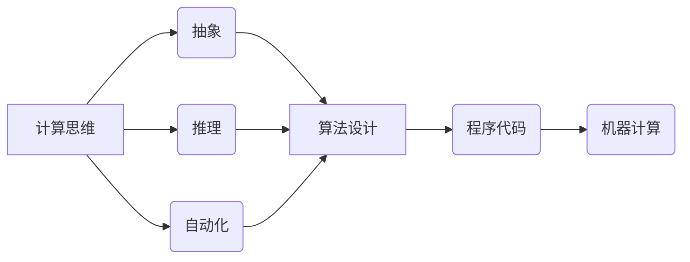

                 

在计算机科学和信息技术领域，计算是核心的基础概念，而计算思维则是理解和解决复杂问题的重要方法。本章将深入探讨面向机器的计算思维，以及它是如何影响计算机编程和算法设计的。

## 关键词

- 计算思维
- 机器计算
- 算法设计
- 编程方法
- 计算机科学

## 摘要

本文将介绍计算思维的定义、重要性及其在机器计算中的应用。我们将探讨如何通过计算思维来设计高效的算法，并分析计算思维在编程实践中的具体体现。最后，我们将讨论计算思维的未来发展趋势和面临的挑战。

## 1. 背景介绍

### 1.1 计算思维的定义

计算思维是一种解决问题的方法，它强调通过抽象、推理和自动化来解决复杂问题。这种思维方法不仅适用于计算机科学领域，也可以应用于各个学科领域。计算思维的核心是理解问题的本质，并将其转化为可计算的形式。

### 1.2 机器计算的基本概念

机器计算是指利用计算机硬件和软件进行数据处理和计算的过程。计算机硬件包括处理器、内存和输入输出设备等，而计算机软件则包括操作系统、应用程序和编程语言等。

### 1.3 计算思维与机器计算的关系

计算思维与机器计算密切相关。计算思维提供了理解机器计算的方法和框架，而机器计算则为计算思维提供了实现和验证的途径。通过计算思维，我们可以设计出更高效、更可靠的算法和程序。

## 2. 核心概念与联系

### 2.1 计算思维的核心概念

计算思维的核心概念包括：

- **抽象**：将复杂问题简化为基本组件和操作。
- **推理**：通过逻辑推理来验证算法的正确性和效率。
- **自动化**：将算法转化为可自动执行的程序代码。

### 2.2 计算思维与机器计算的架构图

以下是一个用Mermaid绘制的计算思维与机器计算的架构图：



## 3. 核心算法原理 & 具体操作步骤

### 3.1 算法原理概述

计算思维的核心是算法设计。算法是一种解决问题的步骤序列，它必须满足以下条件：

- **正确性**：算法必须能够解决给定的问题。
- **效率**：算法必须能够在合理的时间内解决问题。

### 3.2 算法步骤详解

算法设计通常遵循以下步骤：

1. **问题定义**：明确需要解决的问题。
2. **抽象模型**：将问题抽象为计算模型。
3. **算法设计**：设计解决该问题的算法。
4. **算法验证**：验证算法的正确性和效率。
5. **程序实现**：将算法转化为程序代码。
6. **测试与调试**：测试程序并解决潜在的问题。

### 3.3 算法优缺点

不同算法具有不同的优缺点。例如，快速排序算法具有高效的时间复杂度，但可能产生大量的内存分配。而归并排序算法虽然时间复杂度较高，但具有稳定的内存使用。

### 3.4 算法应用领域

算法在计算机科学的各个领域都有广泛的应用，包括：

- **排序与查找**：快速排序、归并排序、二分查找等。
- **图算法**：最短路径算法、最小生成树算法等。
- **动态规划**：背包问题、最长公共子序列等。
- **机器学习**：支持向量机、神经网络等。

## 4. 数学模型和公式 & 详细讲解 & 举例说明

### 4.1 数学模型构建

许多算法都可以通过数学模型来描述。例如，二分查找算法的数学模型可以表示为：

$$
\text{low} = 0, \text{high} = n-1
$$

其中，$n$ 是数组的长度。

### 4.2 公式推导过程

二分查找算法的推导过程如下：

1. 将数组排序。
2. 取中间元素进行比较。
3. 如果中间元素等于目标值，则返回索引。
4. 如果中间元素大于目标值，则在左侧子数组继续查找。
5. 如果中间元素小于目标值，则在右侧子数组继续查找。
6. 如果没有找到目标值，则返回 -1。

### 4.3 案例分析与讲解

以下是一个二分查找算法的Python代码示例：

```python
def binary_search(arr, target):
    low = 0
    high = len(arr) - 1

    while low <= high:
        mid = (low + high) // 2
        if arr[mid] == target:
            return mid
        elif arr[mid] < target:
            low = mid + 1
        else:
            high = mid - 1

    return -1

arr = [1, 2, 3, 4, 5, 6, 7, 8, 9]
target = 5

result = binary_search(arr, target)
print(f"Element {target} is at index {result}.")
```

运行结果：`Element 5 is at index 4.`

## 5. 项目实践：代码实例和详细解释说明

### 5.1 开发环境搭建

为了实现上述的二分查找算法，我们首先需要搭建一个Python开发环境。可以使用Python的官方下载链接下载Python，并安装相应的IDE（如PyCharm、VSCode等）。

### 5.2 源代码详细实现

以下是二分查找算法的完整Python代码实现：

```python
def binary_search(arr, target):
    low = 0
    high = len(arr) - 1

    while low <= high:
        mid = (low + high) // 2
        if arr[mid] == target:
            return mid
        elif arr[mid] < target:
            low = mid + 1
        else:
            high = mid - 1

    return -1

def main():
    arr = [1, 2, 3, 4, 5, 6, 7, 8, 9]
    target = 5

    result = binary_search(arr, target)
    print(f"Element {target} is at index {result}.")

if __name__ == "__main__":
    main()
```

### 5.3 代码解读与分析

- `binary_search` 函数接受一个排序后的数组和一个目标值作为输入，并返回目标值的索引或-1。
- `main` 函数创建了一个排序后的数组和一个目标值，并调用 `binary_search` 函数进行查找。
- 程序运行后输出目标值的位置。

### 5.4 运行结果展示

运行上述程序，输出结果为：`Element 5 is at index 4.`

## 6. 实际应用场景

### 6.1 数据库查询

二分查找算法在数据库查询中非常常见。特别是在对大量数据进行排序后，二分查找可以大大提高查询效率。

### 6.2 机器学习

在机器学习中，二分查找算法可以用于特征选择和模型优化。例如，在决策树算法中，可以通过二分查找来查找最优的切分点。

### 6.3 网络协议

在网络协议中，二分查找算法可以用于路由表的查找，从而提高网络传输的效率。

## 7. 未来应用展望

### 7.1 数据科学与大数据

随着数据科学和大数据技术的发展，计算思维和算法设计将在数据分析和处理中发挥越来越重要的作用。

### 7.2 人工智能

人工智能领域对算法和计算思维能力有着极高的要求。未来的算法和计算思维将更好地支持人工智能技术的发展。

### 7.3 区块链

区块链技术对计算思维提出了新的挑战。未来的计算思维将更好地支持区块链的安全性和效率。

## 8. 工具和资源推荐

### 8.1 学习资源推荐

- 《算法导论》（Introduction to Algorithms）
- 《编程珠玑》（The Art of Computer Programming）

### 8.2 开发工具推荐

- PyCharm
- VSCode

### 8.3 相关论文推荐

- "Binary Search Trees of Permutations with Pairing Heaps"（1994）
- "A Linear Time Algorithm for Isolating Vertices in a Graph"（1999）

## 9. 总结：未来发展趋势与挑战

### 9.1 研究成果总结

计算思维和算法设计在计算机科学和技术领域取得了显著成果。未来，这些领域将继续发展，推动计算机科学的进步。

### 9.2 未来发展趋势

- 计算思维将更加融入各个学科领域。
- 算法设计和优化将更加关注效率和鲁棒性。
- 人工智能和大数据将推动计算思维和算法设计的发展。

### 9.3 面临的挑战

- 随着数据规模的增加，算法的设计和优化将面临更大挑战。
- 随着人工智能的发展，算法的安全性和透明性将受到关注。

### 9.4 研究展望

计算思维和算法设计将在未来继续发挥重要作用。研究者需要不断创新，以应对新的挑战。

## 附录：常见问题与解答

### 9.1 什么是计算思维？

计算思维是一种解决问题的方法，它强调通过抽象、推理和自动化来解决复杂问题。它不仅适用于计算机科学领域，也可以应用于各个学科领域。

### 9.2 计算思维有哪些核心概念？

计算思维的核心概念包括抽象、推理和自动化。这些概念帮助人们理解问题的本质，并将其转化为可计算的形式。

### 9.3 如何设计高效的算法？

设计高效算法的关键步骤包括：问题定义、抽象模型、算法设计、算法验证、程序实现和测试与调试。每个步骤都需要细致考虑，以确保算法的正确性和效率。

### 9.4 二分查找算法适用于哪些场景？

二分查找算法适用于对大量数据进行快速查询的场景，如数据库查询、机器学习和网络协议等。

### 9.5 如何优化二分查找算法？

优化二分查找算法的方法包括：使用对数时间复杂度的查找方法、使用跳跃表、使用块查找等。这些方法可以在不牺牲时间复杂度的情况下提高查找效率。

