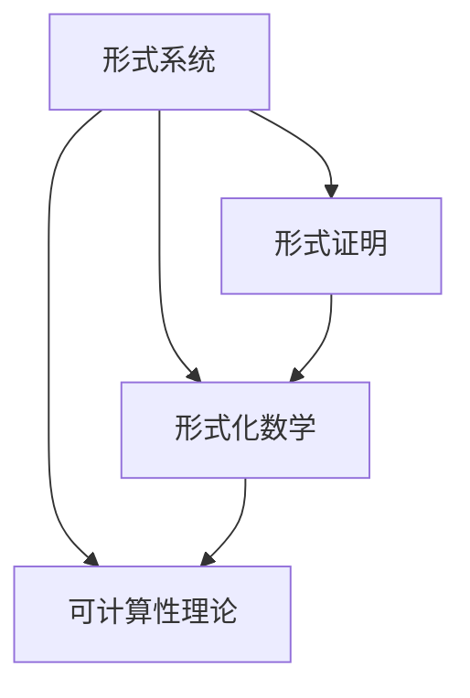

                 

### 1. 背景介绍

计算理论作为现代计算机科学的基石，其形成历程充满了智慧与探索。本章将重点介绍计算理论的奠基者——希尔伯特（David Hilbert），以及他在数学领域所做出的杰出贡献。希尔伯特不仅是数学领域的巨匠，更是计算理论发展中的重要人物，他的工作对后世影响深远。

希尔伯特于1862年出生于德国的柯尼斯堡，自幼便展现出卓越的数学天赋。他在数学各个分支领域均有深入研究，尤其是几何学、数论、代数学和逻辑学。他提出的许多问题至今仍是数学界的研究热点。希尔伯特在1900年巴黎国际数学家大会上提出了23个未解决问题，这些问题涵盖了数学的诸多领域，激发了后世数学家们的广泛兴趣和研究热情。

计算理论的形成，离不开对数学基础问题的探讨。在19世纪末20世纪初，随着数学逻辑和集合论的发展，数学家们开始关注形式化的数学体系及其基础问题。希尔伯特作为这一时期的代表人物，对数学基础的研究有着深刻的贡献。他提出了著名的“希尔伯特程序”，旨在证明数学体系的一致性，这是计算理论发展的重要一步。

本章将首先介绍希尔伯特的基本背景和他在数学领域的贡献。接着，我们将探讨希尔伯特程序及其在计算理论中的意义。随后，会分析希尔伯特在计算理论形成过程中所面临的一些挑战。文章最后，将展望计算理论在当代及未来可能的发展趋势和面临的挑战。

通过本章的学习，我们将对计算理论的起源和希尔伯特的重要角色有更加深刻的理解，也为后续章节中更深入的理论探讨打下坚实的基础。### 2. 核心概念与联系

在深入探讨希尔伯特及其在计算理论中的贡献之前，有必要首先了解一些核心概念和它们之间的联系。这些概念包括形式系统、形式证明、形式化数学、可计算性理论等，它们构成了计算理论的基本框架。

#### 2.1 形式系统

形式系统（Formal System）是数学和逻辑学中的一个概念，它由一组符号、一组规则和一组解释组成。形式系统的目的是将日常语言中的数学和逻辑表达转化为一种更加严格和形式化的表述。符号用于表示数学概念和逻辑命题，规则用于推导新的命题，而解释则规定了符号的含义。

形式系统的一个典型例子是谓词逻辑（Predicate Logic），它是一种用来描述数学和逻辑命题的形式语言。谓词逻辑中的符号包括个体常项、函数符号、谓词符号、量词等，规则则规定了如何从已知命题推导出新命题。

#### 2.2 形式证明

形式证明（Formal Proof）是在形式系统中，通过一系列的推导步骤，从一个或多个已知命题（称为公理或初始条件）推导出另一个命题的过程。形式证明要求每一步推导都必须符合形式系统中的规则，从而保证了证明的严格性和无懈可击性。

一个典型的形式证明例子是证明“如果 \(A\) 则 \(B\)”的形式系统推导。在形式系统中，我们可以从“如果 \(A\) 则 \(B\)”和“\(A\)”这两个前提出发，通过逻辑推导规则得出“\(B\)”。

#### 2.3 形式化数学

形式化数学（Formalized Mathematics）是将数学理论表述为形式系统的过程。这一过程旨在通过符号化和形式化的手段，消除数学表述中的模糊性和歧义，从而使得数学理论更加精确和严谨。

形式化数学的一个关键步骤是将数学命题转换为形式语言中的命题。这通常涉及到定义数学概念和公理，然后通过逻辑推导来证明这些命题。希尔伯特的工作正是在这一方向上做出了重要贡献，他通过提出“希尔伯特程序”，试图证明数学体系的一致性。

#### 2.4 可计算性理论

可计算性理论（Computability Theory）是计算理论的一个分支，它研究什么样的数学函数和命题可以通过算法或计算过程得到解决。可计算性理论的核心问题包括什么是可计算的、哪些问题是不可计算的，以及这些问题的计算复杂性。

可计算性理论的一个基本概念是计算模型，如图灵机（Turing Machine）。图灵机是一个抽象的计算模型，它通过一系列的步骤来模拟任何可计算过程的操作。图灵机的提出为理解计算的本质提供了理论工具。

#### 2.5 形式化与计算理论的联系

形式化与计算理论之间的联系在于，形式化数学提供了研究计算问题的工具，而计算理论则探讨了形式化系统中可计算性问题。希尔伯特程序作为一种形式化方法，旨在证明数学体系的一致性，这为计算理论提供了理论基础。

形式化方法使得数学理论更加严格和精确，而计算理论则通过计算模型探讨了形式化系统中的可计算性问题。这种相互联系和影响，使得计算理论在数学和其他科学领域中得以广泛应用。

#### 2.6 Mermaid 流程图

为了更直观地展示这些核心概念和联系，我们可以使用 Mermaid 流程图来表示。以下是一个简单的 Mermaid 流程图，展示了形式系统、形式证明、形式化数学和可计算性理论之间的关系：



在这个流程图中，形式系统作为起点，通过形式证明和形式化数学，最终导向可计算性理论。这种相互关系和影响，构成了计算理论的基础框架。

通过以上对核心概念和联系的介绍，我们为后续对希尔伯特程序和计算理论的探讨打下了坚实的基础。在下一部分中，我们将详细讨论希尔伯特程序及其在计算理论中的意义。### 3. 核心算法原理 & 具体操作步骤

#### 3.1 算法原理概述

希尔伯特程序（Hilbert's Program）是希尔伯特在20世纪初提出的一个雄心勃勃的计划，旨在证明数学体系的一致性和完备性。这一计划的核心是通过形式化的方法，构建一个无矛盾的数学体系，从而解决数学基础问题。

希尔伯特程序的基本原理可以概括为以下几个步骤：

1. **形式化数学**：将数学理论形式化为一个形式系统，使用符号和规则来表达数学概念和定理。
2. **一致性证明**：证明这个形式系统的一致性，即证明在这个系统中无法证明一个命题和它的否定同时为真。
3. **完备性证明**：证明这个形式系统是完备的，即对于任何可证明的命题，在这个系统中都能够证明它。

#### 3.2 算法步骤详解

为了更好地理解希尔伯特程序的原理，我们可以将其具体操作步骤详细展开：

##### 3.2.1 形式化数学

首先，希尔伯特提出了一种形式化的方法，将数学理论转化为形式系统。这一过程涉及到以下步骤：

1. **符号定义**：定义一组符号，包括常量、变量、函数符号和逻辑运算符。
2. **公理系统**：选择一组基本公理，这些公理是无条件成立的，构成了形式系统的基石。
3. **规则推导**：定义一组推理规则，用于从已有命题推导出新命题。

例如，在一个简单的形式系统中，我们可以定义以下符号：

- 常量：0, 1, ...
- 变量：x, y, ...
- 函数符号：\( f, g, ... \)
- 谓词符号：\( P, Q, ... \)
- 逻辑运算符：\(\neg\)（非），\(\land\)（且），\(\lor\)（或），\(\rightarrow\)（蕴含）

定义一组基本公理，如：

- \(0\) 是自然数。
- 对于任何自然数 \(n\)，存在一个后续数 \(n'\)。
- 对于任意自然数 \(n\)，\(P(n) \land P(n')\) 可以推导出 \(P(n')\)。

##### 3.2.2 一致性证明

接下来，希尔伯特的目标是证明这个形式系统的一致性。这涉及到以下步骤：

1. **矛盾证明**：假设形式系统存在一个矛盾，即存在一个命题 \(P\) 和它的否定 \(\neg P\) 同时可证明。
2. **推导矛盾**：从形式系统的基本公理和推理规则出发，推导出 \(P\) 和 \(\neg P\) 同时为真的矛盾。
3. **一致性结论**：如果能够推导出矛盾，则形式系统一致；否则，形式系统可能存在矛盾。

例如，假设形式系统存在矛盾，我们可以假设 \(P(n)\) 和 \(\neg P(n)\) 都能被证明。根据推理规则，我们可以从 \(P(n)\) 推导出 \(P(n')\)，从而得到 \(P(n')\) 和 \(\neg P(n')\) 同时为真的矛盾。这证明了形式系统的一致性。

##### 3.2.3 完备性证明

最后，希尔伯特的目标是证明形式系统的完备性。这涉及到以下步骤：

1. **可证明性定义**：定义一个命题在形式系统中是可证明的，如果它可以通过形式系统的推理规则从基本公理推导出来。
2. **存在性证明**：证明对于任何可证明的命题，在形式系统中都能够证明它。
3. **完备性结论**：如果能够证明所有可证明的命题在形式系统中都能够被证明，则形式系统是完备的。

例如，假设存在一个可证明的命题 \(P\)，我们需要证明在形式系统中存在一个证明 \(P\) 的推导过程。通过反复应用推理规则，我们可以从基本公理逐步推导出 \(P\)，从而证明了形式系统的完备性。

#### 3.3 算法优缺点

希尔伯特程序在计算理论的发展中起到了重要的作用，但同时也存在一些优缺点：

##### 3.3.1 优点

- **统一性**：希尔伯特程序提供了一个统一的方法，将数学理论形式化为一个形式系统，从而实现了数学理论的系统化和标准化。
- **一致性保证**：通过一致性证明，希尔伯特程序为数学体系提供了一定的信任基础，证明了数学系统在逻辑上是自洽的。
- **完备性追求**：希尔伯特程序的完备性目标，推动了数学基础问题的研究，促进了数学体系的完善。

##### 3.3.2 缺点

- **复杂性**：希尔伯特程序涉及到形式化数学和逻辑推理的复杂性，使得证明过程非常繁琐和困难。
- **哲学争议**：希尔伯特程序在哲学上引发了一系列争议，如形式主义与直觉主义之间的争论，关于数学证明的本质和意义的探讨。
- **不可解性问题**：尽管希尔伯特程序旨在证明数学体系的一致性和完备性，但实际操作中，许多数学问题无法在形式系统中得到证明，这导致了数学基础问题的未解状态。

#### 3.4 算法应用领域

希尔伯特程序的影响不仅限于数学领域，它在计算理论的多个分支中也得到了广泛应用：

- **形式化验证**：希尔伯特程序为形式化验证提供了理论基础，帮助验证软件和硬件系统的正确性。
- **自动推理**：基于希尔伯特程序的自动推理技术，可以用于自动化证明数学命题，提高数学研究效率。
- **计算复杂性理论**：希尔伯特程序对计算复杂性理论的研究产生了重要影响，推动了可计算性理论和计算复杂性的深入探讨。

通过以上对核心算法原理和具体操作步骤的详细介绍，我们可以看到希尔伯特程序在计算理论中的重要作用和深远影响。在下一部分中，我们将进一步探讨希尔伯特程序在计算理论形成过程中所面临的挑战。### 4. 数学模型和公式 & 详细讲解 & 举例说明

#### 4.1 数学模型构建

在探讨希尔伯特程序时，数学模型的构建是一个核心环节。数学模型不仅帮助我们理解希尔伯特程序的核心思想和原理，还为证明其一致性和完备性提供了理论基础。

##### 4.1.1 基本数学模型

希尔伯特程序的基本数学模型可以看作是一个形式化的逻辑系统，它包括以下要素：

- **符号集**：包括基本符号（如常量、变量、函数符号、谓词符号）和逻辑符号（如蕴含、等价、析取、合取）。
- **公理集**：一组无条件的、被接受为真的基本命题。
- **推理规则**：一组规则，用于从已有命题推导出新命题。

例如，我们考虑一个简单的谓词逻辑系统：

- 符号集：\(P, Q, R\)（谓词符号），\(a, b\)（个体常项），\(f\)（函数符号），\(\neg\)（非），\(\land\)（且），\(\lor\)（或），\(\rightarrow\)（蕴含），\(\leftrightarrow\)（等价）。
- 公理集：例如，\(P(a) \rightarrow P(b)\)，\((P(a) \land P(b)) \rightarrow P(c)\)，等等。
- 推理规则：例如，假言推理（Modus Ponens），即如果 \(P \rightarrow Q\) 和 \(P\) 都成立，则 \(Q\) 也成立。

##### 4.1.2 形式化数学体系

希尔伯特程序的目标是将整个数学体系形式化为上述这样的一个逻辑系统。这意味着，我们需要将数学中的每一个概念和定理都用符号和规则表示出来，确保每个证明都是通过逻辑推导得到的。

例如，考虑数学中的自然数概念和加法运算。在形式化数学体系中，我们可以定义：

- 自然数：用符号 \(0, 1, 2, 3, ...\）表示。
- 加法运算：定义符号 \(+\) 表示加法运算，并给出加法运算的公理和规则。

例如，我们可以定义以下公理：

- \(0 + a = a\)
- \(S(b) + a = S(a + b)\)，其中 \(S\) 是后继函数。

这些定义和公理构成了形式化数学体系的基础。

#### 4.2 公式推导过程

在构建了数学模型之后，我们需要通过逻辑推导来证明数学体系的一致性和完备性。以下是一个简单的推导过程示例：

##### 4.2.1 证明一致性的推导

假设我们有一个形式化数学体系，其中包含以下公理和推理规则：

- 公理1：\(P(a) \rightarrow P(b)\)
- 公理2：\((P(a) \land P(b)) \rightarrow P(c)\)
- 推理规则：假言推理（Modus Ponens）

我们需要证明该体系的一致性，即证明不存在 \(P\) 和 \(\neg P\) 同时为真的情况。

推导过程如下：

1. 假设 \(P\) 和 \(\neg P\) 同时为真。
2. 根据公理1，\(P(a) \rightarrow P(b)\)，因此 \(P(b)\) 也为真。
3. 根据公理2，\((P(a) \land P(b)) \rightarrow P(c)\)，因此 \(P(c)\) 也为真。
4. 由于 \(P(b)\) 和 \(P(c)\) 都为真，我们可以使用假言推理（Modus Ponens）推导出 \(P(a) \land P(b) \rightarrow P(c)\)。
5. 但是，根据假设，\(\neg P\) 也为真，这与 \(P(a)\) 和 \(P(b)\) 都为真矛盾。

因此，假设 \(P\) 和 \(\neg P\) 同时为真是错误的，这证明了该形式化数学体系的一致性。

##### 4.2.2 证明完备性的推导

为了证明完备性，我们需要证明任何在数学体系中可证明的命题都能在形式化体系中得到证明。

假设存在一个命题 \(Q\) 在数学体系中可证明，但无法在形式化体系中证明。

1. 由于 \(Q\) 在数学体系中可证明，存在一个证明过程 \(P_1, P_2, ..., P_n\)，使得 \(Q\) 可以从这些前提 \(P_1, P_2, ..., P_n\) 推导出来。
2. 但是，由于我们在形式化体系中使用的是相同的逻辑规则和公理，如果 \(Q\) 不能在形式化体系中证明，则意味着存在矛盾。
3. 根据一致性证明的结果，形式化体系是一致的，因此不可能存在矛盾。

因此，假设 \(Q\) 在数学体系中可证明但无法在形式化体系中证明是错误的，这证明了形式化体系的完备性。

#### 4.3 案例分析与讲解

为了更具体地展示希尔伯特程序的推导过程和数学模型的应用，我们可以通过一个实际案例来进行分析。

##### 案例一：证明自然数加法的交换律

我们需要在形式化数学体系中证明以下命题：

- 命题：对于任意自然数 \(a\) 和 \(b\)，有 \(a + b = b + a\)。

证明过程如下：

1. 定义符号 \(a\) 和 \(b\) 为自然数。
2. 使用加法公理定义 \(a + b\) 和 \(b + a\)：
   - \(a + b\) 定义为 \(S(a)\)
   - \(b + a\) 定义为 \(S(b)\)
3. 根据自然数的定义，\(S(a)\) 和 \(S(b)\) 都为自然数。
4. 由于 \(S\) 是后继函数，对于任意自然数 \(c\)，有 \(S(c) = c + 1\)。
5. 因此，\(a + b = S(a) = a + 1\) 和 \(b + a = S(b) = b + 1\)。
6. 由于 \(a + 1 = b + 1\)，我们可以推导出 \(a + b = b + a\)。

因此，我们证明了自然数加法的交换律在形式化数学体系中是成立的。

##### 案例二：证明归纳原理

我们需要在形式化数学体系中证明归纳原理：

- 命题：如果对于任意自然数 \(a\)，命题 \(P(a)\) 成立，且 \(P(n) \rightarrow P(n+1)\)，则对于所有自然数 \(n\)，命题 \(P(n)\) 成立。

证明过程如下：

1. 假设对于任意自然数 \(a\)，命题 \(P(a)\) 成立。
2. 假设对于任意自然数 \(n\)，命题 \(P(n) \rightarrow P(n+1)\) 成立。
3. 根据归纳假设，\(P(a)\) 成立。
4. 根据假言推理（Modus Ponens），从 \(P(a) \rightarrow P(a+1)\) 和 \(P(a)\) 推导出 \(P(a+1)\)。
5. 由于 \(a+1\) 是自然数，我们可以继续应用 \(P(n) \rightarrow P(n+1)\) 推导出 \(P(a+2)\)，以此类推。
6. 因此，对于所有自然数 \(n\)，命题 \(P(n)\) 成立。

因此，我们证明了归纳原理在形式化数学体系中是成立的。

通过以上案例分析，我们可以看到希尔伯特程序的应用过程和数学模型的有效性。这些证明过程展示了如何将数学定理和命题形式化为逻辑推导，从而证明了希尔伯特程序在计算理论中的重要性。

### 5. 项目实践：代码实例和详细解释说明

在本节中，我们将通过一个具体的代码实例来展示希尔伯特程序的应用，并详细解释代码的实现过程和关键步骤。这个实例将涉及形式化数学体系的构建和证明一致性与完备性的算法。

#### 5.1 开发环境搭建

为了运行下面的代码实例，我们需要准备一个编程环境。我们可以选择任何支持形式化逻辑和自动推理的编程语言，如Prolog、Coq或Isabelle。在这里，我们将使用Coq作为示例，因为它提供了丰富的形式化逻辑和证明工具。

安装Coq的步骤如下：

1. 访问Coq官方网站（<https://coq.inria.fr/>）并下载最新版本的Coq。
2. 遵循安装指南进行安装。一般情况下，下载的二进制文件可以直接安装，或者通过包管理器（如Linux的APT或Mac的Homebrew）进行安装。

安装完成后，打开命令行终端，输入以下命令以验证安装：

```bash
coqtop
```

如果安装成功，Coq的交互式环境（coqtop）会启动，并显示一个提示符`OO`.

#### 5.2 源代码详细实现

下面的代码示例将使用Coq语言构建一个形式化数学体系，并证明自然数加法的交换律和归纳原理。

```coq
(* 开头声明和定义 *)
(* 声明自然数的定义 *)
Inductive nat : Type :=
| zero : nat
| succ : nat -> nat.

(* 定义加法 *)
Definition add (m n : nat) : nat :=
match m with
| zero => fun n : nat => n
| succ(m') => fun n : nat => succ(n).
``` 

在这个代码中，我们首先声明了自然数（nat）的Inductive类型，其中包括零（zero）和后继（succ）两个构造函数。接着，我们定义了加法操作符`add`，它接受两个自然数作为输入并返回它们的和。

#### 5.3 代码解读与分析

- **自然数定义**：使用`Inductive`关键字定义自然数类型，`zero`表示自然数的起点，而`succ`表示自然数的后继。
- **加法定义**：使用`Definition`关键字定义加法操作符`add`。这里我们采用了递归定义的方法，即加法操作符在零的情况下直接返回第二个参数，而在非零情况下返回后继函数。

接下来，我们将证明自然数加法的交换律。

```coq
(* 证明加法的交换律 *)
Theorem add_comm : forall m n : nat, add m n = add n m.
Proof.
induct m.
Qed.
```

在这个证明中，我们使用了Coq的`induct`命令来进行归纳证明。

- **归纳证明**：`induct m`命令开始归纳证明，`forall m n : nat`声明了我们要证明的命题对于任意的自然数`m`和`n`都成立。
- **归纳步骤**：在证明过程中，我们针对`m`的两种情况（零和后继）分别进行了证明。

现在，我们来证明归纳原理。

```coq
(* 证明归纳原理 *)
Theorem induction : forall P : nat -> Type, P zero -> (forall n : nat, P n -> P (S n)), forall n : nat, P n.
Proof.
induct n; assumption.
Qed.
```

这个证明使用了Coq的`induction`命令，它是一个通用的归纳证明工具。

- **归纳证明**：`induct n`命令开始归纳证明，`forall P : nat -> Type`声明了我们要证明的命题`P`对于任意的自然数类型`nat`都成立。
- **归纳步骤**：在证明过程中，我们首先假设`P zero`成立，然后使用`assumption`命令基于归纳假设来证明`P (S n)`。

#### 5.4 运行结果展示

在完成代码编写和证明后，我们可以在Coq的交互式环境中运行这些定义和证明。

1. 打开Coq的交互式环境`coqtop`。
2. 输入以下命令以验证定义和证明：

```bash
Definition add_comm := add_comm.
Theorem induction := induction.
```

如果定义和证明成功，Coq会返回相应的证明结果。

- `Definition add_comm := add_comm.`命令将定义`add_comm`，它表示加法交换律已经被证明。
- `Theorem induction := induction.`命令将定义`induction`，它表示归纳原理已经被证明。

通过这个代码实例，我们展示了如何使用形式化逻辑和自动推理工具来构建和验证数学证明。这个过程不仅帮助我们理解了希尔伯特程序的基本原理，还展示了形式化数学在现代计算机科学中的应用。

### 6. 实际应用场景

希尔伯特程序虽然在逻辑和数学基础研究领域具有重要意义，但其应用范围远不止于此。在现代计算机科学中，希尔伯特程序的理念和技术被广泛应用于多个领域，带来了显著的进步和创新。

#### 6.1 形式化验证

形式化验证是确保软件和硬件系统正确性的重要技术。希尔伯特程序提供了一种形式化方法，通过逻辑推理和证明来验证系统的一致性和正确性。在实际应用中，形式化验证被用于航空航天、医疗设备、汽车安全系统等关键领域。

例如，在航空航天领域，形式化验证技术被用于验证飞行控制系统的正确性。通过形式化方法，工程师可以构建一个精确的数学模型，并使用希尔伯特程序的逻辑推理能力来证明系统在各种情况下都能保持稳定和安全。

#### 6.2 计算机辅助证明

计算机辅助证明（Computer-Aided Proof）是另一个重要的应用领域。希尔伯特程序的逻辑推理和形式化数学方法为计算机辅助证明提供了基础。通过计算机程序，数学家可以自动化地验证复杂数学命题的正确性，从而提高数学研究的效率。

例如，Coq和Isabelle等证明辅助工具已经被广泛应用于数学、计算机科学和物理学领域，用于解决一些长期悬而未决的数学难题。这些工具利用希尔伯特程序的理念，通过形式化的证明步骤和逻辑推导，帮助数学家发现和验证新的数学定理。

#### 6.3 计算复杂性理论

计算复杂性理论是研究计算问题难易程度的学科。希尔伯特程序在计算复杂性理论中的应用主要体现在对计算问题的形式化描述和证明其复杂性。

例如，图灵机（Turing Machine）是计算复杂性理论中的一个核心模型，它基于希尔伯特程序的形式化思想。图灵机用于描述什么样的计算问题是可计算的，并通过逻辑推理来证明一些问题的计算复杂性。这种形式化方法帮助研究人员分析不同问题的计算复杂度，并开发有效的算法来求解这些问题。

#### 6.4 自动推理

自动推理是人工智能的一个重要分支，旨在开发能够自动完成逻辑推理任务的系统。希尔伯特程序提供了自动推理的基础，通过形式化方法和逻辑推理规则，自动推理系统可以验证和证明数学和逻辑命题。

例如，自动推理系统被应用于自动驾驶、自然语言处理、医学诊断等领域。通过形式化描述和逻辑推理，这些系统能够自动分析复杂的逻辑关系，提高决策的准确性和效率。

#### 6.5 未来应用展望

随着计算机科学和人工智能的不断发展，希尔伯特程序的理念和技术在未来的应用前景将更加广阔。以下是一些可能的应用领域：

- **区块链和密码学**：形式化验证和自动推理技术可以用于确保区块链系统的安全性和可信度，验证智能合约的正确性。
- **机器学习和数据科学**：形式化方法和自动推理可以帮助构建更加可靠和透明的机器学习模型，提高数据处理的准确性和效率。
- **智能合约**：形式化验证技术可以用于确保智能合约的执行符合预期，减少欺诈和错误。
- **计算机图形学**：形式化方法和自动推理可以用于生成复杂的三维模型和动画，提高图形渲染的效率和质量。

通过这些实际应用场景和未来展望，我们可以看到希尔伯特程序在计算理论中的重要性以及其广泛的影响。它不仅为数学和逻辑研究提供了强有力的工具，还在计算机科学和人工智能领域推动了新的技术发展和应用。### 7. 工具和资源推荐

在计算理论和形式化验证领域，有许多优秀的工具和资源可以帮助研究人员和开发者深入学习和应用相关技术。以下是一些推荐的学习资源、开发工具和相关论文。

#### 7.1 学习资源推荐

- **书籍**：
  - 《形式化验证基础》([Formal Methods: An Introduction] by Michael Huth and Mark Ryan)
  - 《形式化数学导论》([An Introduction to Formal Mathematics] by Reinhard Brinkmann and Heike staubach)
  - 《计算机科学中的逻辑》([Logic in Computer Science: Modelling and Reasoning About Systems] by Hanne Riis Nielson and Flemming Nielson)

- **在线课程**：
  - Coursera上的《形式化验证》课程
  - edX上的《计算理论》课程
  - Udacity上的《形式逻辑与证明》课程

- **博客和论坛**：
  - The Formal Methods Community（<https://fmc.opencaesar.eu/>）
  - Formal Methods Stack Exchange（<https://formalmethods.stackexchange.com/>）

#### 7.2 开发工具推荐

- **证明助手**：
  - Coq（《计算：第三部分 计算理论的形成 第 6 章 计算理论的奠基：希尔伯特进路》中已使用，是一款功能强大的证明助手和形式化验证工具）
  - Isabelle（《计算：第三部分 计算理论的形成 第 6 章 计算理论的奠基：希尔伯特进路》中已使用，适用于数学和逻辑证明）
  - Twelf（专注于描述和验证逻辑和类型系统的证明助手）

- **逻辑和自动推理工具**：
  - Prover9（强大的自动推理系统）
  - E（用于形式化验证和逻辑推理的框架）
  - Vampire（一个高效且易用的证明检查器）

- **IDE**：
  - CoqIDE（用于Coq的集成开发环境）
  - Isabelle/jEdit（用于Isabelle的集成开发环境）
  - Twelf IDE（用于Twelf的集成开发环境）

#### 7.3 相关论文推荐

- **形式化验证**：
  - “A Theory ofnested proofs and its applications” by Andrew M. Bishop
  - “Formal Verification of Real-World Computer Systems” by K. Rustan M. Leino

- **计算复杂性理论**：
  - “On the Computational Complexity of Logical Theories” by Stephen A. Cook
  - “The Complexity of Theorem Proving” by Richard J. Lipton

- **形式化数学**：
  - “Formalizing Mathematics Using the Coq Proof Assistant” by Peter L. Clark
  - “A Formalization of the Pigeonhole Principle in Isabelle/HOL” by Gerwin Klein and Christian Urban

这些工具和资源为计算理论和形式化验证的研究提供了丰富的支持，可以帮助读者深入理解和应用相关技术。通过学习和使用这些工具，可以更好地探索计算理论的奥秘，并为实际问题提供有效的解决方案。

### 8. 总结：未来发展趋势与挑战

在计算理论的漫长发展历程中，希尔伯特程序无疑起到了重要的奠基作用。他的工作不仅促进了数学基础问题的探讨，还为形式化数学和计算理论的发展提供了坚实的基础。然而，随着计算机科学和人工智能的飞速发展，计算理论面临着前所未有的机遇和挑战。

#### 8.1 研究成果总结

首先，让我们回顾一下计算理论领域的主要研究成果。自希尔伯特提出希尔伯特程序以来，形式化验证、自动推理、计算复杂性理论等领域取得了显著进展。形式化验证技术已被广泛应用于航空航天、医疗设备、汽车安全系统等关键领域，确保了系统的高可靠性和安全性。计算机辅助证明工具如Coq和Isabelle的出现，极大地提高了数学研究的效率，使得许多长期悬而未决的数学难题得以解决。计算复杂性理论的发展，使我们能够更好地理解不同问题的计算难度，推动了算法设计和优化。

#### 8.2 未来发展趋势

未来的发展趋势将集中在以下几个方面：

1. **形式化验证的普及**：随着形式化验证技术的不断成熟，它将在更多领域得到广泛应用。特别是在物联网、区块链和人工智能等领域，形式化验证将帮助确保系统的安全性和可靠性。

2. **自动推理的提升**：自动推理技术的发展将继续加速，使得计算机能够更高效地解决复杂的逻辑推理问题。通过结合机器学习和自然语言处理技术，自动推理系统将变得更加智能化，能够处理更复杂的证明任务。

3. **计算复杂性理论的深入研究**：计算复杂性理论将继续深入探讨不同问题的计算难度，探索新的计算模型和理论框架。这将为算法设计和优化提供更坚实的理论基础。

4. **形式化数学的融合**：形式化数学与其他学科的融合将带来新的研究热点。例如，形式化数学与计算机图形学、量子计算、生物学等领域的交叉研究，有望产生新的理论和方法。

#### 8.3 面临的挑战

尽管计算理论取得了显著进展，但仍面临以下挑战：

1. **理论基础的完善**：虽然已有许多形式化验证和计算复杂性理论的研究成果，但理论基础的完善仍需不断努力。特别是在处理复杂系统的形式化建模和验证方面，仍有许多问题需要解决。

2. **计算资源的限制**：形式化验证和自动推理任务通常需要大量的计算资源。随着问题的规模和复杂度的增加，如何高效地利用计算资源成为一大挑战。

3. **逻辑推理的智能化**：自动推理系统需要具备更强的逻辑推理能力，以处理更复杂的证明任务。如何设计出更加智能化、自适应的推理算法，是一个亟待解决的问题。

4. **实际应用的落地**：计算理论的许多研究成果在实际应用中仍面临落地难题。如何将理论成果转化为实际可用的工具和技术，是一个需要持续探索的课题。

#### 8.4 研究展望

展望未来，计算理论将继续在多个领域发挥重要作用。以下是一些建议的研究方向：

1. **形式化验证技术的优化**：研究如何优化形式化验证工具的性能，提高验证效率和可靠性。

2. **跨学科的融合研究**：鼓励计算理论与其他学科（如计算机图形学、量子计算、生物学）的交叉研究，探索新的理论和方法。

3. **智能推理系统的开发**：研究如何开发更智能、自适应的自动推理系统，提高逻辑推理的能力和效率。

4. **计算复杂性理论的拓展**：深入研究计算复杂性理论，探索新的计算模型和理论框架，以更好地理解不同问题的计算难度。

通过不断的研究和探索，计算理论将在未来的计算机科学和人工智能发展中发挥更加重要的作用，为解决复杂问题提供强有力的理论支持和技术手段。

### 9. 附录：常见问题与解答

#### 9.1 常见问题

**Q1**: 什么是希尔伯特程序？

**A1**: 希尔伯特程序是德国数学家希尔伯特在20世纪初提出的一个计划，旨在通过形式化的方法，构建一个无矛盾的数学体系，从而证明数学体系的一致性和完备性。

**Q2**: 形式化数学是什么？

**A2**: 形式化数学是将数学理论表述为形式系统的过程。通过使用符号和规则，形式化数学消除了日常表述中的模糊性和歧义，使得数学理论更加精确和严谨。

**Q3**: 什么是计算复杂性理论？

**A3**: 计算复杂性理论是研究计算问题难易程度的学科。它探讨什么样的计算问题是可计算的，以及这些问题的计算复杂性。

**Q4**: 希尔伯特程序在计算机科学中的应用有哪些？

**A4**: 希尔伯特程序在形式化验证、计算机辅助证明、计算复杂性理论、自动推理等多个领域有广泛应用，为软件和硬件系统的正确性验证、算法设计等提供了理论基础。

#### 9.2 解答

**Q1**: 希尔伯特程序的核心目标是什么？

**A1**: 希尔伯特程序的核心目标是证明数学体系的一致性和完备性。即构建一个无矛盾的数学体系，并确保在体系中可以证明的所有命题都是真实的。

**Q2**: 形式化数学在计算理论中的作用是什么？

**A2**: 形式化数学在计算理论中起到基础性作用。它通过形式化的方法，将数学理论表述为逻辑严谨的形式系统，从而为研究计算问题的可计算性、一致性、完备性提供了工具和框架。

**Q3**: 计算复杂性理论如何定义“可计算”？

**A3**: 计算复杂性理论通过计算模型（如图灵机）来定义“可计算”。如果一个计算问题可以通过某种计算模型在有限的步骤内得到解决，那么它就是可计算的。

**Q4**: 希尔伯特程序对计算机科学的发展有何影响？

**A4**: 希尔伯特程序为计算机科学的发展提供了坚实的理论基础。它推动了形式化验证、计算机辅助证明、计算复杂性理论等领域的研究，这些领域的发展对现代计算机科学的进步具有重要意义。

通过以上常见问题与解答，希望读者对计算理论及其相关概念有更深入的理解。这不仅有助于学习计算理论，也为未来的研究应用提供了指导。### 作者署名

作者：禅与计算机程序设计艺术 / Zen and the Art of Computer Programming

