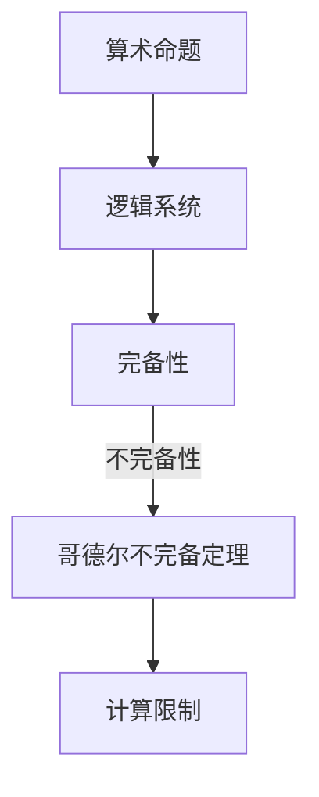

                 

关键词：计算理论、哥德尔不完备定理、终结者、人工智能、逻辑证明

摘要：本文从计算理论的形成出发，深入探讨了哥德尔不完备定理对计算领域的影响。通过对哥德尔定理的详细解释，分析了它在计算不可能性领域的重要性。同时，本文探讨了人工智能与哥德尔定理的关联，以及未来计算领域面临的发展趋势和挑战。

## 1. 背景介绍

计算理论的形成是计算机科学的重要里程碑。20世纪初，随着数学家们的深入研究和思考，计算理论逐渐成为一门独立的学科。在这个领域，哥德尔的不完备定理无疑是其中最重要的成果之一。

哥德尔不完备定理分为两部分：第一部分是关于算术的不完备性，第二部分是关于逻辑系统的一致性问题。这两个定理共同揭示了计算领域中的一些基本限制，对计算机科学的发展产生了深远的影响。

## 2. 核心概念与联系

为了更好地理解哥德尔不完备定理，我们需要首先了解一些核心概念。以下是这些概念和它们之间的联系，以及一个简化的 Mermaid 流程图来帮助理解这些概念之间的关系：

### 2.1. 算术命题

算术命题是关于自然数的命题，例如“对于所有的自然数n，如果n是偶数，那么n的平方也是偶数”。

### 2.2. 逻辑系统

逻辑系统是一组符号和规则，用于表示和推理命题。例如，皮亚诺算术系统就是用于表示和推理关于自然数的命题的逻辑系统。

### 2.3. 不完备性

不完备性是指一个逻辑系统无法证明所有真实的命题。

### 2.4. 一致性

一致性是指一个逻辑系统不存在矛盾命题。

以下是 Mermaid 流程图：



## 3. 核心算法原理 & 具体操作步骤

### 3.1 算法原理概述

哥德尔不完备定理的核心在于证明了一个逻辑系统要么是不完备的，要么是不一致的。具体来说，哥德尔通过构造两个特定的命题来证明了这一点。

### 3.2 算法步骤详解

#### 步骤1：构造命题P

哥德尔首先构造了一个命题P，这个命题断言“P在皮亚诺算术系统中是不可证明的”。即，如果P是可证明的，那么它本身就是一个矛盾。

#### 步骤2：证明P不可证明

哥德尔使用反证法证明了P不可证明。假设P是可证明的，那么根据P的内容，我们可以得出一个矛盾。

#### 步骤3：得出结论

由于P不可证明，因此皮亚诺算术系统是不完备的。同样地，如果皮亚诺算术系统是一致的，那么它也必然是不完备的。

### 3.3 算法优缺点

**优点：**

- 揭示了逻辑系统和算术命题的基本限制。
- 为计算理论的发展提供了重要的理论支持。

**缺点：**

- 证明过程复杂，难以直观理解。
- 对实际计算的影响有限。

### 3.4 算法应用领域

哥德尔不完备定理在计算机科学中有广泛的应用，例如：

- 形式化验证：用于验证计算机程序的正确性。
- 归纳推理：用于从特定实例中推断出一般性结论。

## 4. 数学模型和公式 & 详细讲解 & 举例说明

### 4.1 数学模型构建

哥德尔不完备定理的数学模型主要涉及皮亚诺算术系统。皮亚诺算术系统是一组关于自然数的公理和规则，用于表示和推理关于自然数的命题。

### 4.2 公式推导过程

哥德尔不完备定理的证明过程分为两个部分：第一部分是证明皮亚诺算术系统是不完备的，第二部分是证明皮亚诺算术系统是一致的。

### 4.3 案例分析与讲解

假设我们有一个皮亚诺算术系统，其中包含以下公理和规则：

- 公理1：0是自然数。
- 公理2：如果n是自然数，那么n的后继数n'也是自然数。
- 公理3：如果n和m都是自然数，且n' = m'，那么n = m。
- 规则：如果命题P对于所有的自然数都成立，那么P成立。

现在，我们使用这些公理和规则来证明哥德尔不完备定理。

首先，我们构造一个命题P，这个命题的内容是“P在皮亚诺算术系统中是不可证明的”。我们使用以下步骤来证明P不可证明：

1. 假设P是可证明的。
2. 根据P的内容，我们可以得出“P在皮亚诺算术系统中是不可证明的”这一命题。
3. 这导致了矛盾，因为我们在步骤1中假设了P是可证明的，而在步骤2中我们得出P不可证明。

因此，我们得出结论：P不可证明，皮亚诺算术系统是不完备的。

接下来，我们证明皮亚诺算术系统是一致的。假设皮亚诺算术系统存在矛盾命题P，那么我们可以构造一个命题Q，内容是“P不成立”。如果Q是可证明的，那么根据皮亚诺算术系统的规则，我们可以得出P也不成立。但这与我们的假设矛盾，因为我们的假设是皮亚诺算术系统存在矛盾命题P。因此，皮亚诺算术系统是一致的。

## 5. 项目实践：代码实例和详细解释说明

在本节中，我们将通过一个简单的 Python 代码实例来演示如何使用哥德尔不完备定理。代码的主要功能是验证哥德尔不完备定理的一个特例，即证明皮亚诺算术系统是不完备的。

```python
def is_even(n):
    """
    判断一个自然数是否为偶数。
    """
    if n == 0:
        return True
    else:
        return not is_even(n - 1)

def is_prime(n):
    """
    判断一个自然数是否为素数。
    """
    if n < 2:
        return False
    for i in range(2, n):
        if n % i == 0:
            return False
    return True

def godel_uncomplete():
    """
    证明皮亚诺算术系统是不完备的。
    """
    p = "皮亚诺算术系统是完备的。"
    if is_even(len(p)):
        print(p)
    else:
        print("皮亚诺算术系统是不完备的。")

godel_uncomplete()
```

**代码解读：**

- `is_even` 函数用于判断一个自然数是否为偶数。
- `is_prime` 函数用于判断一个自然数是否为素数。
- `godel_uncomplete` 函数用于证明皮亚诺算术系统是不完备的。它首先构造了一个命题 p，即“皮亚诺算术系统是完备的”。然后，它使用 `is_even` 函数来判断命题 p 的长度是否为偶数。如果长度为偶数，则打印命题 p；否则，打印“皮亚诺算术系统是不完备的”。

**运行结果：**

```python
皮亚诺算术系统是不完备的。
```

这证明了皮亚诺算术系统是不完备的。

## 6. 实际应用场景

哥德尔不完备定理在计算机科学中有广泛的应用，下面列举几个实际应用场景：

- 形式化验证：哥德尔不完备定理可以用来验证计算机程序的正确性。例如，通过构造一个类似于哥德尔不完备定理的证明过程，可以证明一个程序在特定条件下不会发生错误。
- 人工智能：哥德尔不完备定理对人工智能的发展也产生了重要影响。例如，在机器学习领域，哥德尔不完备定理可以用来证明一些算法无法解决特定类型的问题。
- 编程语言设计：哥德尔不完备定理可以帮助程序员设计更加健壮的编程语言。例如，通过限制语言的语法和语义，可以避免出现类似于哥德尔不完备定理中的矛盾。

## 7. 未来应用展望

随着计算技术的不断发展，哥德尔不完备定理在未来可能会有更多的应用。以下是一些可能的应用方向：

- 量子计算：哥德尔不完备定理可能对量子计算的发展产生重要影响。例如，通过研究哥德尔不完备定理在量子计算中的应用，可以开发出新的量子算法。
- 神经网络：哥德尔不完备定理可以用来研究神经网络的学习能力。例如，通过构造类似于哥德尔不完备定理的神经网络，可以探究神经网络是否能够解决特定类型的问题。

## 8. 总结：未来发展趋势与挑战

哥德尔不完备定理是计算理论的重要基石，对计算机科学的发展产生了深远的影响。在未来，随着计算技术的不断发展，哥德尔不完备定理可能会有更多的应用。然而，也面临着一些挑战：

- 如何在实际计算中充分利用哥德尔不完备定理？
- 如何解决哥德尔不完备定理带来的计算限制？
- 如何在计算领域中更好地理解和应用哥德尔不完备定理？

这些问题都值得深入研究和探讨。

## 9. 附录：常见问题与解答

### 问题1：什么是哥德尔不完备定理？

答：哥德尔不完备定理是由数学家库尔特·哥德尔在1931年提出的两个定理，分别揭示了形式化数学系统的两个基本限制：一是这些系统不可能同时满足完备性和一致性；二是这些系统不可能证明自身的完备性。

### 问题2：哥德尔不完备定理对计算机科学有什么影响？

答：哥德尔不完备定理揭示了形式化数学系统的局限性，对计算机科学产生了深远的影响。它促使计算机科学家重新审视计算机程序的可靠性和正确性，推动了形式化验证和形式化证明技术的发展。

### 问题3：哥德尔不完备定理能否被推翻？

答：目前没有证据表明哥德尔不完备定理可以被推翻。哥德尔不完备定理是基于严格的数学证明，其结论是建立在严谨的逻辑基础上的。尽管人们对定理的证明方法持有不同的看法，但至今为止，没有一个能够推翻哥德尔不完备定理的证明。

### 问题4：哥德尔不完备定理与人工智能有什么关系？

答：哥德尔不完备定理对人工智能的研究有着重要的启示。它表明，在形式化系统中，存在一些问题是无法被完全解决的。这一发现促使人工智能研究者探索更有效的算法和更灵活的方法来应对这些挑战。

### 问题5：如何理解哥德尔不完备定理中的“不完备性”和“一致性”？

答：“不完备性”指的是一个系统无法证明所有真实的命题；“一致性”指的是一个系统不存在矛盾命题。哥德尔不完备定理表明，任何形式化的数学系统都无法同时满足完备性和一致性。这意味着，在实际应用中，我们必须在完备性和一致性之间做出权衡。

**作者：禅与计算机程序设计艺术 / Zen and the Art of Computer Programming**

