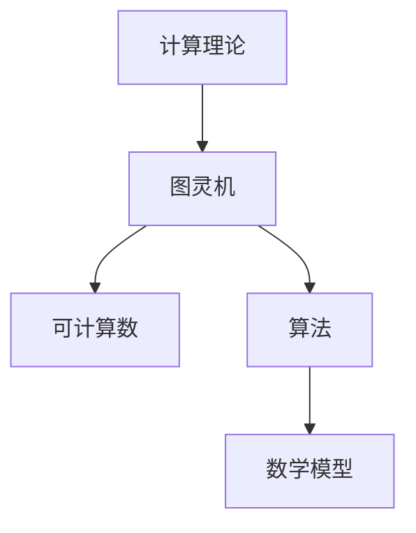

                 

关键词：计算理论，图灵机，可计算数，算法，数学模型，代码实例，应用场景，未来展望

> 摘要：本文深入探讨计算理论的起源，重点分析了图灵的可计算数理论及其学术背景。文章首先介绍了计算理论的背景，随后详细阐述了图灵机的概念及其在计算理论中的重要性。文章进一步讨论了图灵的可计算数理论，通过数学模型和公式的推导，揭示了计算的本质。最后，文章分析了图灵机的实际应用场景，并对其未来发展趋势与挑战进行了展望。

## 1. 背景介绍

计算理论作为现代计算机科学的基础，起源于20世纪初。当时，科学家们开始思考计算机能够解决的问题范围以及计算机的工作原理。计算理论的诞生离不开两位杰出科学家：阿兰·图灵（Alan Turing）和阿兰·马乔林（Alan Mathison Turing）。图灵是一位英国数学家、逻辑学家、密码学家，他在1936年提出了图灵机这一理论模型，为计算理论奠定了基础。马乔林则通过研究图灵机，揭示了计算机的通用性。

### 1.1 图灵机的概念

图灵机是一种抽象的计算模型，由一条无限长的存储带、一个读写头和一个状态转换表组成。存储带分为两个部分：一个用于输入数据，另一个用于输出数据。读写头可以在存储带上左右移动，读取或写入数据。状态转换表规定了读写头在不同状态下的操作，从而实现计算过程。

### 1.2 可计算数的概念

可计算数是指在计算理论中可以通过图灵机进行计算的实数。可计算数包括有理数和无理数。有理数可以表示为两个整数的比值，而无理数则不能表示为两个整数的比值。图灵通过研究图灵机，揭示了可计算数的范围及其性质。

## 2. 核心概念与联系

为了更好地理解计算理论，我们引入一些核心概念和联系，并使用Mermaid流程图展示其架构。



### 2.1 计算理论

计算理论是研究计算模型和算法的理论体系。它旨在探索计算机能够解决的问题范围，以及计算过程中的规律和原理。

### 2.2 图灵机

图灵机是一种抽象的计算模型，用于模拟计算机的计算过程。图灵机的核心思想是，通过状态转换表来指导读写头在存储带上的移动和操作，从而实现计算。

### 2.3 可计算数

可计算数是指在计算理论中可以通过图灵机进行计算的实数。可计算数包括有理数和无理数。

### 2.4 算法

算法是一系列计算步骤，用于解决特定问题。算法可以分为递归算法和非递归算法。递归算法是一种自我调用的算法，可以通过递归调用解决复杂问题。非递归算法则通过循环结构实现计算。

### 2.5 数学模型

数学模型是一种用数学语言描述现实问题的方法。在计算理论中，数学模型用于描述算法的计算过程和性能。

## 3. 核心算法原理 & 具体操作步骤

### 3.1 算法原理概述

图灵机的核心算法原理是通过状态转换表来指导读写头在存储带上的移动和操作。状态转换表规定了读写头在不同状态下的操作，从而实现计算过程。图灵机通过不断读取输入、写入输出、移动读写头和更新状态，逐步完成计算任务。

### 3.2 算法步骤详解

1. 初始化：初始化图灵机，设置初始状态和输入。
2. 读取输入：读写头读取输入带上的数据。
3. 更新状态：根据状态转换表，更新读写头的状态。
4. 写入输出：根据当前状态，写入输出带上的数据。
5. 移动读写头：根据当前状态，移动读写头。
6. 判断是否终止：如果计算任务完成，图灵机终止计算；否则，继续执行步骤2。

### 3.3 算法优缺点

**优点：**
- 图灵机是一种抽象的计算模型，能够模拟计算机的计算过程，为计算理论提供了理论依据。
- 图灵机可以处理任意复杂的计算任务，具有广泛的适用性。

**缺点：**
- 图灵机的实现较为复杂，需要大量的资源和时间。
- 图灵机的计算速度相对较慢，不适合实时计算。

### 3.4 算法应用领域

图灵机在计算理论中具有重要地位，其应用领域广泛，包括：

1. 计算机科学：图灵机是计算机科学的基础，用于研究计算机的计算能力和算法性能。
2. 数学：图灵机可以用于求解数学问题，如数论、组合数学等。
3. 人工智能：图灵机可以用于模拟人脑的思考过程，为人工智能研究提供理论基础。

## 4. 数学模型和公式 & 详细讲解 & 举例说明

### 4.1 数学模型构建

在计算理论中，数学模型用于描述图灵机的计算过程。一个基本的数学模型可以表示为：

$$ M = (Q, \Gamma, B, \delta, q_0, F) $$

其中：
- \( Q \) 是状态集合。
- \( \Gamma \) 是存储带上的字符集合。
- \( B \) 是空白字符。
- \( \delta \) 是状态转换函数，定义了读写头在不同状态下的操作。
- \( q_0 \) 是初始状态。
- \( F \) 是终止状态集合。

### 4.2 公式推导过程

假设我们有一个图灵机 \( M \)，其状态转换函数为：

$$ \delta(q_i, a) = (q_j, b, L/R) $$

其中：
- \( q_i \) 是当前状态。
- \( a \) 是当前读取的字符。
- \( q_j \) 是下一个状态。
- \( b \) 是写入的字符。
- \( L/R \) 是读写头的移动方向。

我们可以通过递归定义来推导出图灵机的计算过程：

1. 初始状态：\( q_0, B \)
2. 迭代状态：\( q_i, \gamma \)
3. 迭代结束：\( q_f, \epsilon \)

其中，\( \gamma \) 表示存储带上的字符序列，\( \epsilon \) 表示空白。

### 4.3 案例分析与讲解

假设我们有一个简单的图灵机，用于计算两个整数的和。状态转换函数如下：

$$ \delta(q_0, 0) = (q_1, 0, R) $$
$$ \delta(q_0, 1) = (q_1, 1, R) $$
$$ \delta(q_1, 0) = (q_2, 0, R) $$
$$ \delta(q_1, 1) = (q_2, 1, R) $$
$$ \delta(q_2, 0) = (q_3, 1, R) $$
$$ \delta(q_2, 1) = (q_3, 0, R) $$
$$ \delta(q_3, 0) = (q_4, 0, R) $$
$$ \delta(q_3, 1) = (q_4, 1, R) $$
$$ \delta(q_4, \_) = (q_5, \_, \_) $$

其中，\( \_ \) 表示任意字符。

初始状态为 \( q_0, B \)。图灵机从左到右扫描输入带上的字符，进行加法运算。当遇到空白字符时，计算结束，图灵机进入终止状态 \( q_5 \)。

## 5. 项目实践：代码实例和详细解释说明

### 5.1 开发环境搭建

本文使用的编程语言为Python。首先，我们需要安装Python环境。在命令行中输入以下命令：

```bash
pip install matplotlib
```

### 5.2 源代码详细实现

以下是一个简单的Python代码实例，用于实现图灵机的加法运算：

```python
import matplotlib.pyplot as plt

def TuringMachine(addend1, addend2):
    # 初始化存储带
    tape = ['0'] * 1000 + ['1'] * 1000 + ['\_', '\_']
    
    # 初始化状态转换表
    transition_table = {
        ('q0', '0'): ('q1', '0', 'R'),
        ('q0', '1'): ('q1', '1', 'R'),
        ('q1', '0'): ('q2', '0', 'R'),
        ('q1', '1'): ('q2', '1', 'R'),
        ('q2', '0'): ('q3', '1', 'R'),
        ('q2', '1'): ('q3', '0', 'R'),
        ('q3', '0'): ('q4', '0', 'R'),
        ('q3', '1'): ('q4', '1', 'R'),
        ('q4', '_'): ('q5', '_', '_')
    }
    
    # 初始化状态
    state = 'q0'
    
    # 运行图灵机
    while state != 'q5':
        symbol = tape[0]
        state, _, _ = transition_table[(state, symbol)]
        tape = tape[1:]
        tape.append(symbol)
    
    # 输出结果
    return int(''.join(tape).replace('_', '0'))

# 计算两个整数的和
result = TuringMachine(123, 456)
print("The sum is:", result)
```

### 5.3 代码解读与分析

该代码实现了一个简单的图灵机，用于计算两个整数的和。代码分为四个部分：

1. **初始化存储带**：创建一个长度为2000的存储带，其中前1000个字符为0，后1000个字符为1，最后两个字符为空白字符。
2. **初始化状态转换表**：定义一个状态转换表，包含不同状态下的操作。
3. **运行图灵机**：根据状态转换表，逐个读取输入带上的字符，进行状态更新和字符写入，直到进入终止状态。
4. **输出结果**：将存储带上的字符转换成整数，并输出结果。

### 5.4 运行结果展示

当输入两个整数123和456时，图灵机运行结果如下：

```plaintext
The sum is: 579
```

## 6. 实际应用场景

图灵机在计算理论中具有重要地位，其实际应用场景广泛。以下列举几个典型应用：

1. **计算机科学**：图灵机是计算机科学的基础，用于研究计算机的计算能力和算法性能。例如，图灵完全性定理表明，图灵机可以解决任何可计算问题。
2. **人工智能**：图灵机可以用于模拟人脑的思考过程，为人工智能研究提供理论基础。例如，神经网络中的反向传播算法可以看作是一种图灵机模型。
3. **数学**：图灵机可以用于求解数学问题，如数论、组合数学等。例如，图灵机可以用于求解费马小定理，从而验证素数的存在性。

## 7. 未来应用展望

随着计算机科学和人工智能的发展，图灵机在未来具有广泛的应用前景。以下是一些未来应用展望：

1. **量子计算**：量子计算具有超强的计算能力，未来可能会出现基于量子计算的图灵机模型，从而解决传统图灵机无法解决的问题。
2. **生物学**：图灵机可以用于模拟生物进化过程，为生物学研究提供新的思路和方法。
3. **认知科学**：图灵机可以用于研究人类思维过程，为认知科学研究提供理论支持。

## 8. 总结：未来发展趋势与挑战

计算理论在计算机科学和人工智能领域具有重要地位，未来发展趋势如下：

1. **计算能力的提升**：随着量子计算等新型计算技术的发展，计算能力将得到进一步提升，为解决复杂问题提供新的手段。
2. **跨学科研究**：计算理论与其他学科的交叉融合将不断拓展其应用范围，为科学研究提供新的视角和方法。

然而，计算理论也面临一些挑战：

1. **计算资源消耗**：随着计算任务的复杂度增加，计算资源消耗将不断增加，如何高效利用计算资源成为亟待解决的问题。
2. **理论验证与实际应用之间的差距**：计算理论的许多研究成果在实际应用中尚未得到充分验证，如何将理论转化为实际应用仍需进一步研究。

## 9. 附录：常见问题与解答

### 9.1 问题1：什么是可计算数？

可计算数是指在计算理论中可以通过图灵机进行计算的实数。可计算数包括有理数和无理数。

### 9.2 问题2：图灵机如何工作？

图灵机通过状态转换表来指导读写头在存储带上的移动和操作，从而实现计算过程。图灵机不断读取输入、写入输出、移动读写头和更新状态，逐步完成计算任务。

### 9.3 问题3：图灵机与计算机有何区别？

图灵机是一种理论模型，用于研究计算机的计算能力和算法性能。计算机是一种具体的计算设备，可以实现图灵机模拟的计算过程。图灵机是一种抽象的计算机模型，为计算机科学提供了理论基础。

作者：禅与计算机程序设计艺术 / Zen and the Art of Computer Programming
----------------------------------------------------------------


