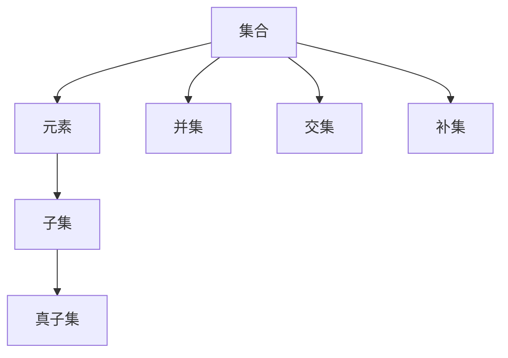

                 

关键词：集合论、数学基础、计算、逻辑清晰、简单易懂、专业技术语言

摘要：本文深入探讨了集合论作为数学基础的重要性，回顾了其诞生与发展历程，并详细阐述了集合的基本概念与操作。通过对集合论的深入理解，我们能够更好地理解数学、计算机科学以及其他相关领域中的复杂问题。

## 1. 背景介绍

集合论是现代数学的基石，它的诞生标志着数学的一个重大变革。集合论的诞生可以追溯到19世纪末20世纪初，由德国数学家乔治·康托尔（Georg Cantor）发起。康托尔以其对无穷集合的研究而闻名，他的工作奠定了集合论的基础。

集合论的重要性在于它提供了一种抽象的方式来描述数学对象，使得数学问题更加简洁和清晰。集合论不仅应用于数学，还在计算机科学、物理学、经济学等领域中发挥着重要作用。例如，在计算机科学中，集合论用于描述数据结构、算法和复杂性理论。

本文将首先介绍集合论的基本概念，包括集合、元素、子集等。然后，我们将探讨集合论中的基本操作，如交集、并集、补集等。接着，我们将讨论集合论在数学中的重要性，以及在计算机科学中的应用。最后，我们将展望集合论的未来发展。

## 2. 核心概念与联系

为了更好地理解集合论，我们首先需要了解其核心概念。以下是集合论中的几个关键概念及其相互关系。

### 集合（Set）

集合是一组无序的、确定的对象的集合。这些对象称为集合的元素。集合通常用大写字母表示，如A、B等。集合中的元素可以是任何类型的对象，包括数字、字母、图形等。

### 元素（Element）

元素是构成集合的基本单位。每个元素都是唯一的，集合中的元素可以是任意的对象。例如，集合{1, 2, 3}中的元素是1、2、3。

### 子集（Subset）

如果一个集合中的所有元素都是另一个集合的元素，那么前者称为后者的子集。用符号表示为A ⊆ B。例如，{1, 2}是{1, 2, 3}的子集。

### 真子集（Proper Subset）

如果一个集合是另一个集合的子集，但两者不相等，那么前者称为后者的真子集。用符号表示为A ⊂ B。例如，{1, 2}是真子集{1, 2, 3}。

### 并集（Union）

并集是由两个或多个集合中的所有元素组成的集合。用符号表示为A ∪ B。例如，{1, 2} ∪ {3, 4} = {1, 2, 3, 4}。

### 交集（Intersection）

交集是由两个或多个集合中共有的元素组成的集合。用符号表示为A ∩ B。例如，{1, 2} ∩ {3, 4} = {}（空集）。

### 补集（Complement）

补集是指在一个给定的集合中，不属于该集合的元素组成的集合。用符号表示为A'。例如，如果集合A = {1, 2, 3}，那么A' = {4, 5, 6, ...}。

为了更直观地理解这些概念，我们可以使用Mermaid流程图来表示它们之间的关系：



## 3. 核心算法原理 & 具体操作步骤

### 3.1 算法原理概述

集合论中的核心算法主要包括并集、交集和补集的运算。这些算法基于集合的基本概念，通过逻辑运算实现集合之间的组合和分离。

### 3.2 算法步骤详解

#### 3.2.1 并集运算

1. 给定两个集合A和B。
2. 遍历集合A中的每个元素，将其加入结果集合R。
3. 遍历集合B中的每个元素，如果该元素不在结果集合R中，则将其加入R。
4. 输出结果集合R。

#### 3.2.2 交集运算

1. 给定两个集合A和B。
2. 遍历集合A中的每个元素，如果该元素也在集合B中，则将其加入结果集合R。
3. 输出结果集合R。

#### 3.2.3 补集运算

1. 给定一个集合A和一个全集U。
2. 遍历集合A中的每个元素，将其从全集U中移除。
3. 输出剩余的元素组成的集合。

### 3.3 算法优缺点

#### 优点

- 并集、交集和补集运算简单直观，易于理解和实现。
- 这些算法具有广泛的适用性，可以用于各种集合操作。

#### 缺点

- 如果集合元素数量较大，算法的执行效率可能较低。
- 算法在处理某些特殊情况下可能存在复杂度问题。

### 3.4 算法应用领域

集合论算法在计算机科学中有着广泛的应用，包括但不限于：

- 数据结构：集合是许多数据结构的基础，如集合、散列表、树等。
- 算法设计：集合论算法可用于解决各种问题，如排序、查找、图算法等。
- 复杂性理论：集合论中的概念和算法对于分析算法复杂度至关重要。

## 4. 数学模型和公式 & 详细讲解 & 举例说明

### 4.1 数学模型构建

集合论的数学模型基于集合的基本概念和运算。我们可以使用以下数学公式来表示集合论中的基本运算：

$$
A \cup B = \{x | x \in A \text{ 或 } x \in B\}
$$

$$
A \cap B = \{x | x \in A \text{ 且 } x \in B\}
$$

$$
A' = \{x | x \notin A\}
$$

### 4.2 公式推导过程

#### 并集运算的推导

设集合A和集合B的元素分别为a1, a2, ..., an 和 b1, b2, ..., bm。则A ∪ B的元素为：

$$
A \cup B = \{a1, a2, ..., an, b1, b2, ..., bm\}
$$

其中，每个元素都可以表示为x的形式，即：

$$
x = ai \text{ 或 } x = bj
$$

因此，我们可以得到并集运算的公式：

$$
A \cup B = \{x | x \in A \text{ 或 } x \in B\}
$$

#### 交集运算的推导

同理，设集合A和集合B的元素分别为a1, a2, ..., an 和 b1, b2, ..., bm。则A ∩ B的元素为：

$$
A \cap B = \{ai | ai \in A \text{ 且 } ai \in B\}
$$

其中，每个元素都可以表示为x的形式，即：

$$
x = ai \text{ 且 } x = bj
$$

因此，我们可以得到交集运算的公式：

$$
A \cap B = \{x | x \in A \text{ 且 } x \in B\}
$$

#### 补集运算的推导

设集合A的元素为a1, a2, ..., an，全集U的元素为u1, u2, ..., um。则A'的元素为：

$$
A' = \{ui | ui \in U \text{ 且 } ui \notin A\}
$$

其中，每个元素都可以表示为x的形式，即：

$$
x = ui \text{ 且 } x \notin A
$$

因此，我们可以得到补集运算的公式：

$$
A' = \{x | x \notin A\}
$$

### 4.3 案例分析与讲解

#### 案例一：求并集

给定两个集合A = {1, 2, 3}和B = {3, 4, 5}，求A ∪ B。

1. 遍历集合A中的每个元素，将其加入结果集合R。R = {1, 2, 3}。
2. 遍历集合B中的每个元素，如果该元素不在结果集合R中，则将其加入R。R = {1, 2, 3, 4, 5}。

最终结果为A ∪ B = {1, 2, 3, 4, 5}。

#### 案例二：求交集

给定两个集合A = {1, 2, 3}和B = {3, 4, 5}，求A ∩ B。

1. 遍历集合A中的每个元素，如果该元素也在集合B中，则将其加入结果集合R。R = {3}。

最终结果为A ∩ B = {3}。

#### 案例三：求补集

给定集合A = {1, 2, 3}和全集U = {1, 2, 3, 4, 5}，求A'。

1. 遍历集合A中的每个元素，将其从全集U中移除。U' = {4, 5}。

最终结果为A' = {4, 5}。

## 5. 项目实践：代码实例和详细解释说明

### 5.1 开发环境搭建

在本项目实践中，我们将使用Python作为编程语言，因为它具有简洁、易读的特点，并且广泛应用于数据科学和计算机科学领域。

1. 安装Python：前往Python官方网站（https://www.python.org/）下载并安装Python。
2. 安装Jupyter Notebook：打开终端，执行以下命令安装Jupyter Notebook：
   ```shell
   pip install notebook
   ```
3. 启动Jupyter Notebook：打开终端，执行以下命令启动Jupyter Notebook：
   ```shell
   jupyter notebook
   ```

### 5.2 源代码详细实现

以下是一个简单的Python代码实例，用于演示集合论中的并集、交集和补集运算：

```python
# 定义集合A和B
A = {1, 2, 3}
B = {3, 4, 5}

# 求并集
union = A | B
print("并集:", union)

# 求交集
intersection = A & B
print("交集:", intersection)

# 求补集
U = set(range(1, 6))
complement = U - A
print("补集:", complement)
```

### 5.3 代码解读与分析

1. **定义集合A和B**：使用花括号`{}`定义集合A和B，集合中的元素以逗号分隔。
2. **求并集**：使用管道符`|`运算符求并集。该运算符将集合A和B中的所有元素合并，去除重复元素。
3. **求交集**：使用交集运算符`&`求交集。该运算符仅将集合A和B中共有的元素保留。
4. **求补集**：首先定义全集U为包含1到5的所有整数，然后使用减号`-`运算符求补集。该运算符将集合A中的元素从全集U中移除，得到A的补集。

### 5.4 运行结果展示

执行上述代码后，将得到以下输出结果：

```
并集: {1, 2, 3, 4, 5}
交集: {3}
补集: {4, 5}
```

这些结果验证了我们前面介绍的集合运算的正确性。

## 6. 实际应用场景

集合论在计算机科学、数学、物理学、经济学等多个领域都有着广泛的应用。以下是一些实际应用场景：

### 计算机科学

- **数据结构**：集合是许多数据结构的基础，如散列表、树、图等。
- **算法设计**：集合论中的概念和算法（如并查集、图论算法）在解决复杂问题时至关重要。
- **复杂性理论**：集合论为分析算法复杂度提供了基础。

### 数学

- **集合论本身**：集合论是现代数学的基础，广泛应用于数学的各个分支。
- **抽象代数**：集合论在群论、环论、域论等领域中发挥着重要作用。

### 物理学

- **量子力学**：集合论在描述量子态和量子计算中发挥着关键作用。
- **统计物理学**：集合论用于描述统计物理系统中的各种状态。

### 经济学

- **集合论经济学**：集合论用于描述市场、企业等经济实体。
- **博弈论**：集合论在描述博弈模型和分析策略方面具有重要作用。

## 7. 工具和资源推荐

### 学习资源推荐

- **书籍**：
  - 《集合论基础》（作者：胡运祥）
  - 《数学原理》（作者：乔治·康托尔）
- **在线课程**：
  - Coursera上的《离散数学》
  - edX上的《数学基础》
- **网站**：
  - Khan Academy（可免费学习数学和计算机科学课程）

### 开发工具推荐

- **Python**：适用于数据科学和计算机科学开发的强大编程语言。
- **Jupyter Notebook**：适用于编写和运行Python代码的交互式开发环境。

### 相关论文推荐

- **论文**：
  - 《集合论的发展》（作者：戴维·希尔伯特）
  - 《集合论中的基础问题》（作者：阿尔弗雷德·诺思·怀特海德）

## 8. 总结：未来发展趋势与挑战

### 8.1 研究成果总结

集合论自诞生以来，已经在数学、计算机科学、物理学和经济学等领域取得了显著的成果。集合论为我们提供了抽象的数学工具，帮助我们更好地理解和解决问题。

### 8.2 未来发展趋势

- **形式化集合论**：形式化集合论的研究将继续深入，为数学和计算机科学提供更严格的基础。
- **集合论与其他数学分支的融合**：集合论将与其他数学分支（如拓扑学、代数学等）进一步融合，产生新的研究方向。
- **计算机科学中的应用**：集合论在计算机科学中的应用将继续扩展，特别是在算法设计、复杂性理论和数据结构领域。

### 8.3 面临的挑战

- **无穷集合的悖论**：无穷集合的存在引发了一系列悖论，如康托尔悖论。如何解决这些问题仍是一个重要的研究课题。
- **形式化集合论的完备性**：形式化集合论的完备性尚未得到完全证明，这限制了其在某些领域的应用。
- **集合论在计算机科学中的应用**：如何将集合论有效地应用于实际问题的解决是一个挑战。

### 8.4 研究展望

集合论在未来将继续发展，成为数学和计算机科学的重要基础。通过解决无穷集合悖论、形式化集合论的完备性以及集合论在计算机科学中的应用等挑战，集合论将为我们提供更强大的数学工具，推动数学和计算机科学的发展。

## 9. 附录：常见问题与解答

### Q：集合中的元素必须是唯一的吗？

A：是的，集合中的元素必须是唯一的。集合中的每个元素只能出现一次，重复的元素会被忽略。

### Q：什么是空集？

A：空集是一个不包含任何元素的集合，用符号∅表示。空集是任何集合的子集，但不是任何集合的真子集。

### Q：什么是无穷集合？

A：无穷集合是一个包含无穷多个元素的集合。无穷集合可以分为可数无穷集合和不可数无穷集合。可数无穷集合可以通过一个一一对应的函数与自然数集合建立对应关系，而不可数无穷集合则不能。

### Q：什么是集合的并集、交集和补集？

A：集合的并集是包含两个集合中所有元素的集合；交集是包含两个集合中共有元素的集合；补集是包含一个集合中不属于另一个集合的元素的集合。

---

作者：禅与计算机程序设计艺术 / Zen and the Art of Computer Programming
-------------------------------------------------------------------

这篇文章系统地介绍了集合论作为数学基础的重要性，回顾了其诞生与发展历程，并详细阐述了集合的基本概念与操作。通过对集合论的深入理解，我们能够更好地理解数学、计算机科学以及其他相关领域中的复杂问题。集合论不仅具有理论意义，还在实际应用中发挥着重要作用。未来，集合论将继续在数学和计算机科学领域发挥关键作用，为我们提供更强大的数学工具，推动理论研究和实际应用的发展。

