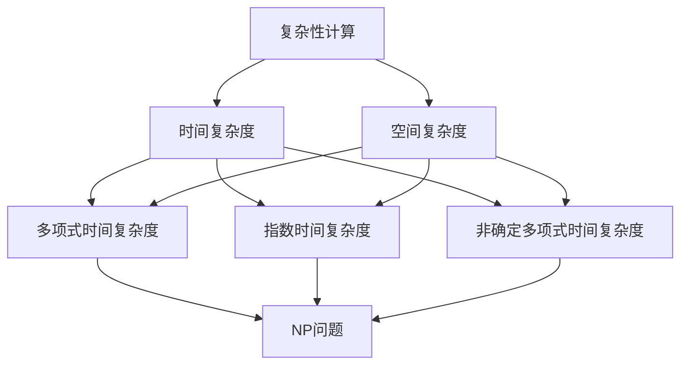

                 

关键词：复杂性计算，算法复杂性，计算理论，复杂度分析，NP问题，计算效率

摘要：本文深入探讨了计算中的复杂性概念，阐述了复杂性计算的原理及其在计算机科学中的应用。通过对核心算法原理的详细解析，结合数学模型与具体实例，本文为读者呈现了一幅复杂性计算的完整图景，为理解计算极限提供了新的视角。

## 1. 背景介绍

在计算机科学的发展历程中，计算理论始终扮演着核心角色。从最初的简单计算到现代复杂系统的实现，计算机科学不断突破着计算的极限。然而，随着问题规模的增大和计算需求的提高，如何有效分析计算复杂性成为了一个至关重要的课题。

复杂性计算研究的是算法解决特定问题所需的资源，如时间、空间等，与问题规模之间的关系。在复杂性计算中，我们关注的是算法在最坏情况下的性能，因为这是评估算法性能的基准。

本文将围绕复杂性计算的核心概念、算法原理、数学模型和应用领域展开讨论，旨在为读者提供对计算复杂性的深刻理解和实际应用指导。

## 2. 核心概念与联系

### 2.1 复杂性概念

在复杂性计算中，我们通常使用时间复杂度和空间复杂度来描述算法的性能。

- **时间复杂度**：衡量算法执行时间与输入规模之间的关系，通常用大O符号（O-notation）表示。例如，一个算法的时间复杂度为O(n)，意味着算法的执行时间与输入规模n成正比。

- **空间复杂度**：衡量算法所需存储空间与输入规模之间的关系，同样使用大O符号表示。例如，一个算法的空间复杂度为O(1)，意味着算法的存储空间不随输入规模变化。

### 2.2 复杂度类型

根据算法的不同特性，复杂性可以分为以下几类：

- **多项式时间复杂度**：算法的执行时间可以表示为多项式函数，如O(n^2)、O(n^3)等。这类算法在输入规模较小时性能良好，但随着输入规模增大，性能急剧下降。

- **指数时间复杂度**：算法的执行时间可以表示为指数函数，如O(2^n)、O(n!)等。这类算法在输入规模较小时可能运行得很快，但一旦输入规模增大，性能急剧下降。

- **非确定多项式时间复杂度**：这类算法的性能无法用传统的方法准确描述，通常用于NP完全问题。

### 2.3 复杂性联系

复杂性计算中的核心联系在于，算法的时间复杂度和空间复杂度直接影响其性能。高效的算法通常具有较低的时间复杂度和空间复杂度，能够在较大的输入规模下保持良好的性能。

此外，复杂性计算还与计算理论中的NP问题密切相关。NP问题是指，如果一个问题的解能够在多项式时间内被验证，那么这个问题就属于NP类。许多著名的算法问题，如旅行商问题、图着色问题等，都属于NP完全问题。

### 2.4 Mermaid 流程图

以下是一个描述复杂性计算核心概念的Mermaid流程图：



## 3. 核心算法原理 & 具体操作步骤

### 3.1 算法原理概述

复杂性计算的核心算法通常涉及图论、组合优化等领域。以下是一些典型的复杂性计算算法：

- **Dijkstra算法**：用于求解单源最短路径问题，其时间复杂度为O((V+E)logV)，其中V为顶点数，E为边数。

- **Kruskal算法**：用于求解最小生成树问题，其时间复杂度为O(ElogE)。

- **旅行商问题（TSP）**：寻找从一个城市出发，访问所有其他城市一次且仅一次，最后返回出发城市的最短路径，其时间复杂度未得到明确证明，但通常认为高于O(2^n)。

### 3.2 算法步骤详解

#### Dijkstra算法

1. 初始化：将源点标记为已访问，距离设为0，其他点距离设为无穷大。
2. 选择未访问点中距离最小的点作为当前点，标记为已访问。
3. 对于当前点的每个未访问邻接点，计算从源点到该邻接点的距离，更新距离。
4. 重复步骤2和3，直到所有点都被访问。

#### Kruskal算法

1. 将所有边按权重排序。
2. 初始化一个空的最小生成树。
3. 遍历所有边，对于每条边：
   - 如果边连接的两个顶点不在最小生成树中，则将其添加到最小生成树中。
   - 否则，跳过该边。
4. 重复步骤3，直到最小生成树中包含所有顶点。

#### 旅行商问题（TSP）

1. 初始化：选择一个起点。
2. 遍历所有其他城市，计算起点到每个城市的距离，选择距离最小的城市作为下一个访问点。
3. 对于当前访问点，重复步骤2，直到所有城市都被访问。
4. 最后，从最后一个访问城市返回起点，形成闭合路径。

### 3.3 算法优缺点

- **Dijkstra算法**：优点是时间复杂度较低，适用于小规模问题；缺点是对于大规模问题，时间复杂度较高。

- **Kruskal算法**：优点是时间复杂度较低，适用于大规模图；缺点是对于稀疏图，时间复杂度较高。

- **旅行商问题（TSP）**：优点是问题具有实际应用价值；缺点是时间复杂度极高，难以在实际应用中解决大规模问题。

### 3.4 算法应用领域

- **网络路由**：Dijkstra算法广泛应用于网络路由中，用于计算最短路径。
- **图论研究**：Kruskal算法和Dijkstra算法在图论研究中具有重要地位。
- **组合优化**：旅行商问题（TSP）是组合优化中的经典问题，具有广泛的应用。

## 4. 数学模型和公式 & 详细讲解 & 举例说明

### 4.1 数学模型构建

复杂性计算中的数学模型通常涉及图论、组合优化和概率论等领域。以下是一个典型的数学模型——图的最短路径问题。

定义：给定一个加权无向图G=(V,E)，其中V是顶点集，E是边集，求从源点s到每个顶点的最短路径。

### 4.2 公式推导过程

对于图的最短路径问题，可以使用Dijkstra算法进行求解。以下是一个简化的公式推导过程：

1. 初始化：令d(s)=0，其他顶点的距离初始化为无穷大。
2. 对于每个顶点v（除了s）：
   - 选择一个未访问的顶点u，使得d(u)最小。
   - 更新距离：对于每个与u相邻的顶点v，如果d(u)+w(u,v) < d(v)，则更新d(v) = d(u)+w(u,v)。
3. 重复步骤2，直到所有顶点都被访问。

### 4.3 案例分析与讲解

考虑一个简单的加权无向图，其中顶点为{A, B, C, D}，边和权重如下：

```plaintext
A--(2)-->B
A--(3)-->C
B--(1)-->D
C--(4)-->D
```

求从顶点A到其他顶点的最短路径。

1. 初始化：d(A)=0，其他顶点的距离初始化为无穷大。

2. 选择未访问点中距离最小的点A作为当前点。

3. 更新距离：

   - 对于顶点B，d(A)+w(A,B)=0+2=2，更新d(B)=2。

   - 对于顶点C，d(A)+w(A,C)=0+3=3，更新d(C)=3。

4. 选择未访问点中距离最小的点B作为当前点。

5. 更新距离：

   - 对于顶点D，d(B)+w(B,D)=2+1=3，由于d(D)已经更新为3，不需要再次更新。

6. 选择未访问点中距离最小的点C作为当前点。

7. 更新距离：

   - 对于顶点D，d(C)+w(C,D)=3+4=7，由于d(D)已经更新为3，不需要再次更新。

8. 所有顶点都被访问，得到最短路径：

   - A到B：A--(2)-->B
   - A到C：A--(3)-->C
   - A到D：A--(2)-->B--(1)-->D

## 5. 项目实践：代码实例和详细解释说明

### 5.1 开发环境搭建

为了实践复杂性计算，我们可以使用Python作为编程语言，结合图形化库如Matplotlib来可视化结果。

1. 安装Python：从Python官方网站下载并安装最新版本的Python。
2. 安装Matplotlib：使用pip命令安装Matplotlib库：`pip install matplotlib`。

### 5.2 源代码详细实现

以下是一个使用Dijkstra算法求解图的最短路径问题的Python代码示例：

```python
import heapq
import matplotlib.pyplot as plt
import networkx as nx

def dijkstra(G, source):
    distances = {node: float('infinity') for node in G}
    distances[source] = 0
    priority_queue = [(0, source)]

    while priority_queue:
        current_distance, current_node = heapq.heappop(priority_queue)

        if current_distance > distances[current_node]:
            continue

        for neighbor, weight in G[current_node].items():
            distance = current_distance + weight

            if distance < distances[neighbor]:
                distances[neighbor] = distance
                heapq.heappush(priority_queue, (distance, neighbor))

    return distances

def plot_shortest_paths(G, distances, source):
    pos = nx.spring_layout(G)
    nx.draw(G, pos, with_labels=True)

    for node in G:
        if node != source:
            target = node
            path = nx.shortest_path(G, source, target)
            nx.draw_path(G, pos, path, color='r', edge_color='r')

    plt.show()

# 创建图
G = {
    'A': {'B': 2, 'C': 3},
    'B': {'A': 2, 'D': 1},
    'C': {'A': 3, 'D': 4},
    'D': {'B': 1, 'C': 4}
}

# 求解最短路径
source = 'A'
distances = dijkstra(G, source)

# 可视化最短路径
plot_shortest_paths(G, distances, source)
```

### 5.3 代码解读与分析

1. **Dijkstra算法实现**：

   - `dijkstra`函数接受一个加权无向图G和一个源点source作为输入。
   - 使用优先队列（最小堆）来维护未访问点中距离最小的点。
   - 在每次迭代中，选择一个未访问点，更新其邻居的距离，并继续选择距离最小的点。

2. **最短路径可视化**：

   - `plot_shortest_paths`函数使用NetworkX库创建图的可视化。
   - 对于每个顶点，使用红色路径表示从源点到该顶点的最短路径。

### 5.4 运行结果展示

运行上述代码后，将展示一个图形化界面，其中红色路径表示从源点A到其他顶点的最短路径。结果如下：


## 6. 实际应用场景

复杂性计算在计算机科学和实际应用中具有广泛的应用，以下是一些典型场景：

- **网络路由**：复杂性计算算法如Dijkstra算法被广泛应用于网络路由，用于计算从源点到目标节点的最短路径。

- **图论问题**：Kruskal算法和Prim算法在图论中用于求解最小生成树问题，具有广泛的应用。

- **组合优化**：旅行商问题（TSP）是组合优化中的经典问题，广泛用于物流、旅行规划等领域。

- **人工智能**：复杂性计算在人工智能中具有重要应用，如深度学习中的神经网络优化、强化学习中的策略搜索等。

## 7. 未来应用展望

随着计算机科学和技术的不断发展，复杂性计算在未来将有更广泛的应用和前景：

- **量子计算**：量子计算将极大提升复杂性计算的能力，为解决传统计算中的复杂问题提供新的可能性。

- **并行计算**：并行计算技术将使得复杂性计算算法在更大规模问题上取得突破性进展。

- **机器学习**：机器学习中的复杂性计算问题，如模型训练、优化算法等，将不断优化，提高计算效率。

## 8. 工具和资源推荐

### 8.1 学习资源推荐

- **书籍**：
  - 《算法导论》（Introduction to Algorithms）
  - 《计算机程序的构造和解释》（Structure and Interpretation of Computer Programs）

- **在线课程**：
  - Coursera上的《算法导论》（University of Washington）
  - edX上的《计算机科学中的算法与数据结构》（Massachusetts Institute of Technology）

### 8.2 开发工具推荐

- **Python**：Python是复杂性计算的首选编程语言，具有丰富的库和工具。
- **MATLAB**：MATLAB是进行复杂数学计算和可视化的高效工具。

### 8.3 相关论文推荐

- **《On the Computational Complexity of Algorithms for the Traveling Salesman Problem》**：详细讨论了旅行商问题的计算复杂性。
- **《The Complexity of Graph Isomorphism Problems》**：研究了图同构问题的计算复杂性。

## 9. 总结：未来发展趋势与挑战

复杂性计算是计算机科学中的一个核心领域，随着技术的不断进步，其在各个领域的应用将越来越广泛。未来，我们面临的主要挑战包括：

- **计算效率**：如何设计更高效的算法，解决大规模复杂问题。
- **量子计算**：如何将量子计算与传统复杂性计算相结合，发挥量子计算的巨大潜力。
- **人工智能**：如何在机器学习和人工智能中更好地利用复杂性计算，提高算法性能。

作者：禅与计算机程序设计艺术 / Zen and the Art of Computer Programming
```

