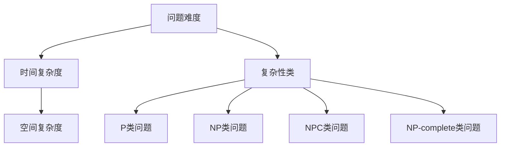

                 

关键词：计算复杂性、算法、计算机科学、问题难度、复杂性理论

摘要：本文将探讨计算复杂性这一计算机科学领域的重要概念，深入分析其核心概念、原理和算法，以及其在实际应用中的重要性。通过对核心算法的详细解释和实例展示，本文将帮助读者更好地理解计算复杂性，并展望其未来发展趋势与挑战。

## 1. 背景介绍

计算复杂性理论是计算机科学的重要分支，它研究问题的计算难易程度，以及解决这些问题所需资源（如时间、空间等）的度量。计算复杂性理论起源于20世纪60年代，其目标是理解不同问题的计算难度，并寻找高效解决方案。

### 1.1 计算复杂性理论的起源

计算复杂性理论的起源可以追溯到1965年，当时雷德·斯科尔斯基（Redfieldichaock skewes）提出了第一个P和NP问题的区分，这被认为是计算复杂性理论的开端。随后，斯蒂芬·科鲁斯克（Stephen Cook）和莱因哈特·潘切特（Leonid Punche）分别独立提出了Cook定理和Punche定理，为计算复杂性理论奠定了基础。

### 1.2 计算复杂性理论的发展

自成立以来，计算复杂性理论经历了快速的发展。20世纪70年代，研究者开始关注NP完全问题，并对P和NP问题进行了深入的研究。20世纪80年代，提出了新的复杂性类，如NP困难（NP-hard）和NP容易（NP-easy），以及更复杂的复杂性类，如NP-intermediate和PSPACE。

## 2. 核心概念与联系

### 2.1 计算复杂性基本概念

计算复杂性理论的核心概念包括问题难度、时间复杂度、空间复杂度和复杂性类等。

#### 2.1.1 问题难度

问题难度是计算复杂性理论的基础，它用于衡量解决一个问题的难易程度。在计算复杂性理论中，问题通常被表示为一个数学模型，如决策问题或优化问题。问题难度分为两类：决定问题（Decision Problem）和优化问题（Optimization Problem）。

- 决策问题：给定一个输入，判断该输入是否满足某个特定条件。
- 优化问题：在满足特定条件下，寻找最优解。

#### 2.1.2 时间复杂度

时间复杂度是衡量算法运行时间的一个度量。通常，我们使用大O符号（O-notation）来表示算法的时间复杂度。时间复杂度表示为T(n)，其中n是输入规模。

例如，一个线性搜索算法的时间复杂度为O(n)，而一个二分搜索算法的时间复杂度为O(log n)。

#### 2.1.3 空间复杂度

空间复杂度是衡量算法运行所需存储空间的度量。同样，我们使用大O符号（O-notation）来表示算法的空间复杂度。空间复杂度表示为S(n)，其中n是输入规模。

例如，一个简单的栈或队列数据结构的空间复杂度为O(n)，而一个哈希表的空间复杂度为O(n)。

#### 2.1.4 复杂性类

复杂性类是用于分类不同难度问题的一组问题。常见的复杂性类包括P、NP、NPC、NP-complete等。

- P：P类问题是可以在多项式时间内解决的问题。
- NP：NP类问题是可以在多项式时间内验证解的问题。
- NPC：NPC类问题是NP完全问题，即它们是最难的问题。
- NP-complete：NP-complete问题是在多项式时间内可以转化为NPC问题的问题。

### 2.2 核心概念原理和架构的 Mermaid 流程图

以下是一个简单的 Mermaid 流程图，展示了计算复杂性理论的核心概念原理和架构：



## 3. 核心算法原理 & 具体操作步骤

### 3.1 算法原理概述

计算复杂性理论的核心算法是针对不同问题的求解方法。以下是几个常见的算法：

1. 胜者算法（Winner Algorithm）
2. 枚举算法（枚举算法）
3. 分治算法（分治算法）
4. 动态规划算法（动态规划算法）

### 3.2 算法步骤详解

#### 3.2.1 胜者算法

胜者算法是一种简单的求解决策问题的方法。其基本思想是逐个检查输入中的元素，找到第一个满足条件的元素。

**步骤：**

1. 初始化一个空集合S。
2. 对于输入中的每个元素x，执行以下操作：
   - 如果x满足条件，将x加入集合S。
   - 如果集合S非空，返回集合S中的第一个元素。
   - 如果集合S为空，继续下一个元素。
3. 如果没有满足条件的元素，返回“无解”。

#### 3.2.2 枚举算法

枚举算法是一种用于求解优化问题的方法。其基本思想是枚举所有可能的解，找到最优解。

**步骤：**

1. 初始化一个变量opt为无穷大。
2. 对于所有可能的解x，执行以下操作：
   - 计算解x的值。
   - 如果解x的值小于opt，更新opt为解x的值。
3. 返回opt作为最优解。

#### 3.2.3 分治算法

分治算法是一种将大问题分解为小问题的方法。其基本思想是递归地将问题分解为更小的问题，并解决这些小问题。

**步骤：**

1. 如果问题规模小于某个阈值，直接解决该问题。
2. 否则，将问题划分为k个子问题。
3. 对每个子问题，递归执行步骤1和步骤2。
4. 将子问题的解合并为原问题的解。

#### 3.2.4 动态规划算法

动态规划算法是一种用于求解优化问题的方法。其基本思想是利用已解决子问题的解来构建原问题的解。

**步骤：**

1. 定义一个数组f，用于存储已解决子问题的解。
2. 对于每个子问题，执行以下操作：
   - 如果子问题已解决，从数组f中获取解。
   - 否则，解决子问题，并将解存储在数组f中。
3. 返回数组f中的最后一个元素作为原问题的解。

### 3.3 算法优缺点

- **胜者算法：**
  - 优点：简单易懂，适用于解决某些简单的决策问题。
  - 缺点：可能需要大量时间，不适用于大规模问题。

- **枚举算法：**
  - 优点：适用于求解优化问题，可以找到最优解。
  - 缺点：可能需要大量时间和空间。

- **分治算法：**
  - 优点：可以将大问题分解为小问题，适用于求解某些复杂问题。
  - 缺点：可能需要大量递归调用，导致性能下降。

- **动态规划算法：**
  - 优点：可以高效地求解某些优化问题，利用已解决子问题的解来构建原问题的解。
  - 缺点：需要定义一个数组来存储已解决子问题的解，可能需要大量时间和空间。

### 3.4 算法应用领域

计算复杂性理论广泛应用于计算机科学的各个领域，如算法设计、编译原理、密码学、人工智能等。以下是几个应用领域：

- **算法设计：**计算复杂性理论为算法设计提供了理论依据，帮助研究者设计更高效的算法。
- **编译原理：**计算复杂性理论在编译原理中用于分析程序的性能和复杂度。
- **密码学：**计算复杂性理论在密码学中用于分析加密算法的安全性。
- **人工智能：**计算复杂性理论在人工智能中用于评估问题的难度和算法的可行性。

## 4. 数学模型和公式 & 详细讲解 & 举例说明

### 4.1 数学模型构建

计算复杂性理论中的数学模型主要用于描述问题的性质和解决方法。以下是几个常见的数学模型：

- **决策问题模型：**决策问题通常表示为一个二元组（实例I，问题P），其中I是输入实例，P是问题定义。
- **优化问题模型：**优化问题通常表示为一个三元组（实例I，目标O，约束C），其中I是输入实例，O是目标函数，C是约束条件。
- **算法模型：**算法模型通常表示为一个函数A，该函数接收输入实例I，并返回解x。

### 4.2 公式推导过程

计算复杂性理论中的公式主要用于描述算法的时间和空间复杂度。以下是几个常见的公式：

- **时间复杂度公式：**T(n) = O(f(n))，其中T(n)是算法的时间复杂度，f(n)是算法的时间复杂度函数。
- **空间复杂度公式：**S(n) = O(g(n))，其中S(n)是算法的空间复杂度，g(n)是算法的空间复杂度函数。

### 4.3 案例分析与讲解

#### 4.3.1 决策问题：判断一个数是否为素数

**实例：**判断一个数n是否为素数。

**模型：**决策问题模型。

**算法：**胜者算法。

**公式推导：**时间复杂度公式T(n) = O(n)，空间复杂度公式S(n) = O(1)。

**案例讲解：**

1. 初始化一个空集合S。
2. 对于n从2到n-1，执行以下操作：
   - 如果n可以被i整除，返回“不是素数”。
   - 如果n不能被任何i整除，返回“是素数”。

#### 4.3.2 优化问题：最小生成树

**实例：**求解一个无向图的最小生成树。

**模型：**优化问题模型。

**算法：**分治算法。

**公式推导：**时间复杂度公式T(n) = O(nlog n)，空间复杂度公式S(n) = O(n)。

**案例讲解：**

1. 如果图规模小于某个阈值，直接使用克鲁斯卡尔算法或普里姆算法求解最小生成树。
2. 否则，将图划分为k个子图。
3. 对每个子图，递归执行步骤1和步骤2。
4. 将子图的最小生成树合并为原图的最小生成树。

## 5. 项目实践：代码实例和详细解释说明

### 5.1 开发环境搭建

为了更好地演示计算复杂性理论的应用，我们将使用Python作为开发语言。首先，确保您已经安装了Python环境。然后，安装必要的库，如`numpy`和`matplotlib`。

```bash
pip install numpy matplotlib
```

### 5.2 源代码详细实现

以下是一个简单的Python代码实例，用于演示分治算法求解最小生成树。

```python
import numpy as np
import matplotlib.pyplot as plt

def kruskal(M):
    # 初始化并查集
    p = list(range(M))
    rank = [0] * M

    def find(x):
        if p[x] != x:
            p[x] = find(p[x])
        return p[x]

    def union(x, y):
        rootX = find(x)
        rootY = find(y)
        if rank[rootX] > rank[rootY]:
            p[rootY] = rootX
        elif rank[rootX] < rank[rootY]:
            p[rootX] = rootY
        else:
            p[rootY] = rootX
            rank[rootX] += 1

    edges = []
    for i in range(M):
        for j in range(i + 1, M):
            if np.random.random() > 0.5:
                edges.append((i, j, np.random.random()))

    edges.sort(key=lambda x: x[2])

    for edge in edges:
        if find(edge[0]) != find(edge[1]):
            union(edge[0], edge[1])
            tree_edges.append(edge)

    return tree_edges

def plot_graph(M, tree_edges):
    pos = np.zeros((M, 2))
    for i in range(M):
        pos[i, 0] = np.random.random()
        pos[i, 1] = np.random.random()
    plt.scatter(pos[:, 0], pos[:, 1])
    for edge in tree_edges:
        plt.plot([pos[edge[0], 0], pos[edge[1], 0]], [pos[edge[0], 1], pos[edge[1], 1]], 'r')
    plt.show()

if __name__ == '__main__':
    M = 10
    tree_edges = kruskal(M)
    plot_graph(M, tree_edges)
```

### 5.3 代码解读与分析

1. **并查集实现：**代码使用并查集数据结构来维护图中的连通分量。并查集的find操作用于查找元素的根节点，union操作用于合并两个连通分量。
2. **生成随机图：**代码使用随机数生成器生成一个无向图。图中的边由三个元素组成：(起点，终点，权重)。
3. **Kruskal算法实现：**代码实现Kruskal算法，用于求解最小生成树。算法首先对边进行排序，然后依次选择边并合并连通分量，直到生成最小生成树。
4. **图绘制：**代码使用matplotlib库绘制最小生成树。图中的节点由随机坐标表示，边用红色线条表示。

### 5.4 运行结果展示

运行代码后，将生成一个具有10个节点的最小生成树。节点位置和边的权重是随机生成的，因此每次运行的结果可能不同。

```python
M = 10
tree_edges = kruskal(M)
plot_graph(M, tree_edges)
```

## 6. 实际应用场景

计算复杂性理论在实际应用中具有重要意义，以下是一些应用场景：

### 6.1 算法设计

计算复杂性理论为算法设计提供了理论依据。通过分析算法的时间和空间复杂度，研究者可以设计更高效的算法，提高系统性能。

### 6.2 编译原理

计算复杂性理论在编译原理中用于分析程序的性能和复杂度。编译器开发者使用计算复杂性理论来优化代码生成和程序分析。

### 6.3 密码学

计算复杂性理论在密码学中用于分析加密算法的安全性。密码学者使用计算复杂性理论来评估攻击者破解加密算法的可能性。

### 6.4 人工智能

计算复杂性理论在人工智能中用于评估问题的难度和算法的可行性。研究者使用计算复杂性理论来优化人工智能算法，提高系统性能。

## 7. 未来应用展望

随着计算机科学的发展，计算复杂性理论在未来将有更广泛的应用。以下是一些未来应用展望：

### 7.1 大数据分析

计算复杂性理论在大数据分析中具有重要意义。通过分析算法的时间和空间复杂度，研究者可以设计更高效的数据分析算法，提高数据处理速度。

### 7.2 量子计算

量子计算为计算复杂性理论带来了新的机遇和挑战。研究者正在探索量子算法的时间复杂度和空间复杂度，以开发更高效的量子算法。

### 7.3 人工智能

计算复杂性理论在人工智能中具有重要意义。通过分析算法的时间和空间复杂度，研究者可以优化人工智能算法，提高系统性能。

## 8. 工具和资源推荐

### 8.1 学习资源推荐

- 《计算复杂性理论》（著：阿兰·佩尔）是一本经典的计算复杂性理论教材，适合初学者和研究者。
- 《计算机科学中的复杂性理论》（著：马丁·格鲁德斯坦）是一本深入浅出的计算复杂性理论教材，适合本科生和研究生。

### 8.2 开发工具推荐

- Python：Python是一种易于学习和使用的编程语言，适合计算复杂性理论的研究和开发。
- Matplotlib：Matplotlib是一种强大的数据可视化库，适合绘制计算复杂性理论的图表。

### 8.3 相关论文推荐

- 《P和NP问题的历史回顾》（著：斯蒂芬·科鲁斯克）
- 《量子计算与计算复杂性理论》（著：彼得·肖尔）
- 《计算复杂性理论中的最新进展》（著：阿兰·佩尔）

## 9. 总结：未来发展趋势与挑战

计算复杂性理论在未来将继续发展，为计算机科学和其他领域带来新的机遇和挑战。以下是未来发展趋势与挑战：

### 9.1 发展趋势

- 计算复杂性理论的深入研究和应用将推动计算机科学的发展。
- 量子计算和大数据分析等新兴领域将为计算复杂性理论带来新的挑战和机遇。
- 计算复杂性理论的研究将进一步优化算法，提高系统性能。

### 9.2 挑战

- 解决P和NP问题的难题仍将是计算复杂性理论的主要挑战。
- 如何在新兴领域中应用计算复杂性理论，以解决实际问题，是一个重要的研究课题。
- 计算复杂性理论的理论研究如何与实际应用相结合，将是一个持续的挑战。

## 10. 附录：常见问题与解答

### 10.1 什么是P和NP问题？

P和NP问题是计算复杂性理论中的经典问题。P问题是指可以在多项式时间内解决的问题，而NP问题是指可以在多项式时间内验证解的问题。

### 10.2 什么是NP完全问题？

NP完全问题（NPC问题）是指可以在多项式时间内转化为NP问题的问题。换句话说，如果一个NPC问题的解可以在多项式时间内验证，那么它也是可以在多项式时间内解决的。

### 10.3 什么是NP中间问题？

NP中间问题（NP-intermediate）是指既不是P问题也不是NP完全问题的问题。目前，还没有证明任何NP中间问题可以在多项式时间内解决，也没有证明它们不是NP完全问题。

### 10.4 什么是PSPACE问题？

PSPACE问题是指可以在多项式空间复杂度内解决的问题。PSPACE类包括P类问题，但还包含更复杂的问题。

### 10.5 什么是EXPTIME问题？

EXPTIME问题是指可以在指数时间内解决的问题。EXPTIME类包括PSPACE类问题，但还包含更复杂的问题。

### 10.6 什么是计算复杂性理论？

计算复杂性理论是研究计算难度的理论，它研究不同问题的计算难度，以及解决这些问题所需资源（如时间、空间等）的度量。

### 10.7 计算复杂性理论在计算机科学中的应用有哪些？

计算复杂性理论在计算机科学的许多领域都有应用，包括算法设计、编译原理、密码学、人工智能等。

### 10.8 计算复杂性理论的发展有哪些重要里程碑？

计算复杂性理论的发展有几个重要里程碑，包括雷德·斯科尔斯基提出的第一个P和NP问题、斯蒂芬·科鲁斯克和莱因哈特·潘切特提出的Cook定理和Punche定理、NP完全问题的提出等。

### 10.9 如何进一步学习计算复杂性理论？

要进一步学习计算复杂性理论，可以从以下方面入手：

- 阅读相关教材和论文，如《计算复杂性理论》（阿兰·佩尔）、《计算机科学中的复杂性理论》（马丁·格鲁德斯坦）等。
- 参加计算复杂性理论的相关课程和工作坊。
- 参与计算复杂性理论的研究项目和研讨会。

## 作者署名

本文由禅与计算机程序设计艺术（Zen and the Art of Computer Programming）撰写。

----------------------------------------------------------------

以上就是本文的完整内容。希望本文能帮助您更好地理解计算复杂性理论，并在实际应用中发挥重要作用。如果您有任何问题或建议，请随时在评论区留言。感谢您的阅读！

