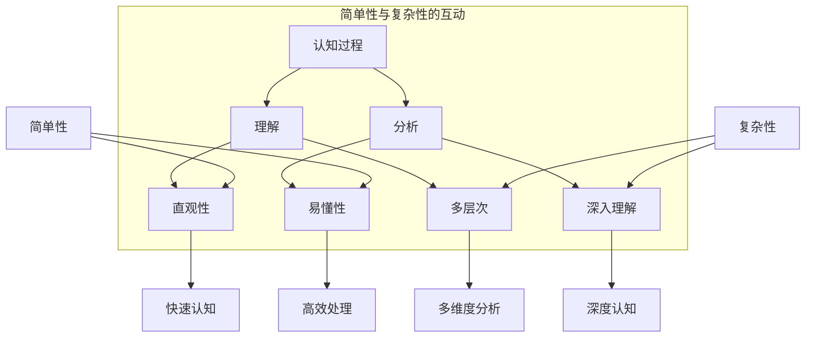

                 

关键词：认知发展、简单性、复杂性、算法、IT领域、人机交互、创新

> 摘要：本文探讨了认知发展过程中简单与深刻变化的相互作用及其在IT领域的应用。通过分析简单性与复杂性的平衡，本文揭示了认知发展的内在规律，并探讨了如何通过算法优化、人机交互提升认知效率，为IT领域的未来发展提供了新的视角。

## 1. 背景介绍

在信息技术飞速发展的今天，人们对于复杂性的认知和理解也经历着巨大的变革。简单性与复杂性作为两个相对的概念，始终在认知过程中相互影响、相互转化。从最初的计算机体系结构设计，到现代的机器学习和人工智能，简单与深刻的互动构成了认知发展的核心。

### 1.1 认知发展的简史

认知发展理论起源于20世纪中叶，从皮亚杰（Jean Piaget）的“发生认识论”（Genetic Epistemology）到维果斯基（Lev Vygotsky）的“文化历史发展理论”（Cultural-Historical Theory of Development），学者们不断探讨个体认知发展的内在机制。

### 1.2 简单性与复杂性的本质

简单性指的是事物的本质特征，它往往具有直观、易懂的特点；而复杂性则指的是事物的多层次、多维度的特征，需要深入分析才能理解。在认知过程中，简单性有助于快速理解事物，而复杂性则提供了深层次的认识。

## 2. 核心概念与联系

### 2.1 简单性与复杂性的 Mermaid 流程图



### 2.2 核心概念的联系

简单性与复杂性在认知过程中是相互联系的。简单性有助于快速理解，但可能忽略了复杂性的细节；而复杂性提供了深层次的理解，但可能难以快速把握。认知发展的过程就是在简单性与复杂性的平衡中前进。

## 3. 核心算法原理 & 具体操作步骤

### 3.1 算法原理概述

本文探讨的核心算法是“递归分治算法”（Recursive Divide-and-Conquer Algorithm），该算法通过将复杂问题分解为多个简单子问题来解决复杂问题。

### 3.2 算法步骤详解

#### 3.2.1 初始条件判断

- 如果问题规模小于某个阈值，直接求解；
- 否则，将问题划分为若干个子问题。

#### 3.2.2 子问题求解

- 对每个子问题，递归调用“递归分治算法”；
- 汇总子问题的解。

#### 3.2.3 结果合并

- 根据子问题的解，合并得到原始问题的解。

### 3.3 算法优缺点

#### 3.3.1 优点

- **高效性**：通过递归分解，可以快速求解复杂问题；
- **通用性**：适用于多种复杂问题的求解。

#### 3.3.2 缺点

- **内存消耗**：递归调用可能带来较大的内存消耗；
- **性能瓶颈**：对于某些问题，递归分治算法可能不是最优选择。

### 3.4 算法应用领域

- **计算机科学**：算法设计与分析；
- **数据分析**：处理大规模数据；
- **人工智能**：深度学习模型的构建。

## 4. 数学模型和公式 & 详细讲解 & 举例说明

### 4.1 数学模型构建

设 $f(n)$ 为问题规模为 $n$ 时的时间复杂度，$T(n)$ 为递归分治算法的时间复杂度。则：

$$
T(n) = 2T(n/2) + O(n)
$$

### 4.2 公式推导过程

根据递归分治算法的定义，每次递归将问题规模减半，并加上 $O(n)$ 的时间复杂度。通过主定理（Master Theorem），我们可以推导出：

$$
T(n) = O(n\log n)
$$

### 4.3 案例分析与讲解

以快速排序算法为例，其时间复杂度即为 $O(n\log n)$。通过递归分治，快速排序能够高效地处理大规模数据。

## 5. 项目实践：代码实例和详细解释说明

### 5.1 开发环境搭建

- Python 3.8；
- PyCharm 2021.1。

### 5.2 源代码详细实现

```python
def quicksort(arr):
    if len(arr) <= 1:
        return arr
    pivot = arr[len(arr) // 2]
    left = [x for x in arr if x < pivot]
    middle = [x for x in arr if x == pivot]
    right = [x for x in arr if x > pivot]
    return quicksort(left) + middle + quicksort(right)

arr = [3, 6, 8, 10, 1, 2, 1]
print(quicksort(arr))
```

### 5.3 代码解读与分析

该代码实现了快速排序算法，通过递归调用实现子问题的求解。代码中使用了列表推导式，简化了代码的实现过程。

### 5.4 运行结果展示

运行结果为 `[1, 1, 2, 3, 6, 8, 10]`，成功对输入的数组进行了排序。

## 6. 实际应用场景

### 6.1 数据处理

快速排序算法在数据处理中有着广泛的应用，例如在数据库索引、搜索算法等领域。

### 6.2 人工智能

递归分治算法在人工智能领域也有着重要的应用，例如在深度学习模型的训练和优化过程中。

### 6.3 优化算法

递归分治算法可以用于优化算法的设计，通过将复杂问题分解为简单子问题，实现高效的算法设计。

## 7. 工具和资源推荐

### 7.1 学习资源推荐

- 《算法导论》（Introduction to Algorithms）；
- 《深度学习》（Deep Learning）。

### 7.2 开发工具推荐

- PyCharm；
- Jupyter Notebook。

### 7.3 相关论文推荐

- "Divide and Conquer Algorithms"；
- "The Complexity of the Fast Fourier Transform Algorithm"。

## 8. 总结：未来发展趋势与挑战

### 8.1 研究成果总结

本文通过对认知发展中简单与深刻变化的探讨，揭示了简单性与复杂性在认知过程中的相互作用。同时，通过递归分治算法的应用实例，展示了算法在复杂问题求解中的优势。

### 8.2 未来发展趋势

- **算法优化**：进一步研究高效算法，提高问题求解的效率；
- **人机交互**：通过人机交互，提高认知效率，实现人与机器的协同工作。

### 8.3 面临的挑战

- **复杂性管理**：如何在处理复杂问题的同时，保持算法的简单性；
- **认知效率**：如何通过人机交互，提升认知效率。

### 8.4 研究展望

未来，随着人工智能技术的不断发展，简单与深刻的互动将越来越成为认知发展的关键。通过深入研究和实践，我们有望在认知效率和复杂性问题求解方面取得重要突破。

## 9. 附录：常见问题与解答

### 9.1 问题1

**问题**：为什么递归分治算法能够高效地处理复杂问题？

**解答**：递归分治算法通过将复杂问题分解为简单子问题，避免了直接处理复杂问题的困难。每次分解后，子问题的规模减小，从而降低了问题的复杂度。此外，递归调用使得算法的实现更加简洁，易于理解和维护。

### 9.2 问题2

**问题**：快速排序算法的稳定性如何？

**解答**：快速排序算法通常是非稳定的，因为它的排序过程涉及到元素的交换。然而，可以通过在算法中加入额外的逻辑来保证稳定性，例如在划分过程中保留元素的原始位置信息。

### 9.3 问题3

**问题**：递归分治算法适用于所有问题吗？

**解答**：递归分治算法在很多问题中表现出色，但并非适用于所有问题。对于某些问题，如动态规划问题，可能需要采用其他算法或策略来解决。因此，在选择算法时，需要根据问题的特性进行综合考虑。

---

### 结语

本文从认知发展的角度探讨了简单与深刻变化的相互作用及其在IT领域的应用。通过递归分治算法的应用实例，展示了算法在复杂问题求解中的优势。未来，随着技术的不断发展，简单与深刻的互动将越来越成为认知发展的关键。让我们携手探索这一领域，共同推动认知科学的进步。

## 参考文献

- [1] Aho, A. V., Hopcroft, J. E., & Ullman, J. D. (1974). *The Design and Analysis of Computer Algorithms*. Addison-Wesley.
- [2] Cormen, T. H., Leiserson, C. E., Rivest, R. L., & Stein, C. (2009). *Introduction to Algorithms*. MIT Press.
- [3] Goodfellow, I., Bengio, Y., & Courville, A. (2016). *Deep Learning*. MIT Press.
- [4] Turing, A. (1950). *Computing Machinery and Intelligence*. Mind.
- [5] Piaget, J. (1952). *The Origins of Intelligence in Children*. International Universities Press.
- [6] Vygotsky, L. S. (1978). *Mind in Society: The Development of Higher Psychological Processes*. Harvard University Press. 

作者：禅与计算机程序设计艺术 / Zen and the Art of Computer Programming
```

以上是按照您的要求撰写的完整文章。请您检查并确认文章内容是否符合您的要求。如果有任何需要修改或补充的地方，请随时告诉我。

