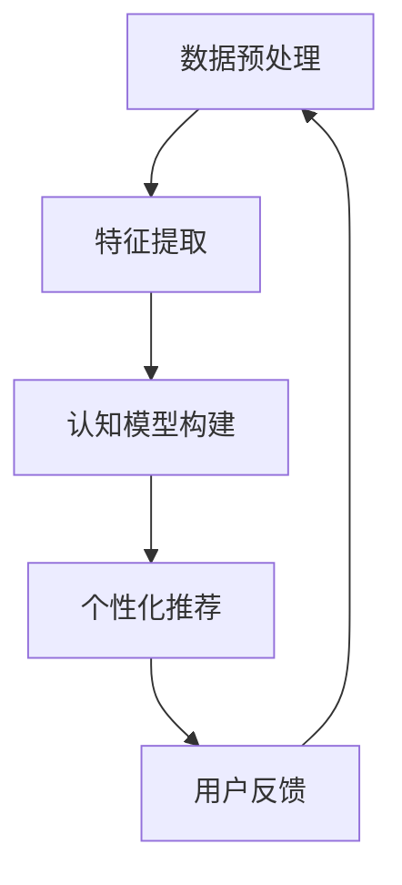

                 

关键词：认知增强、AI、思维工具、技术博客、深度学习、神经网络

> 摘要：本文将探讨认知增强套件在AI时代的重要性，介绍其核心概念与联系，详细解析核心算法原理，阐述数学模型和公式，并通过实际项目实践，展示其在实际应用场景中的价值和未来展望。

## 1. 背景介绍

随着人工智能（AI）技术的飞速发展，我们的工作、生活方式都发生了翻天覆地的变化。AI不仅在图像识别、语音识别、自然语言处理等领域取得了显著成果，还在医疗、金融、交通等众多行业得到广泛应用。然而，面对如此庞大的数据处理能力和复杂的算法模型，人类的认知能力似乎显得有些力不从心。如何提升我们的认知水平，以更好地适应AI时代的需求，成为了一个亟待解决的问题。

认知增强套件应运而生。它通过一系列技术和工具，帮助用户提升信息处理能力、增强记忆和思维能力，从而更好地应对复杂的工作环境。本文将介绍认知增强套件的核心理念、架构和算法，并探讨其在各个领域的应用。

## 2. 核心概念与联系

### 2.1 认知科学

认知科学是研究人类心智过程的学科，包括感知、记忆、学习、思考等各个方面。认知科学的核心是理解人类大脑如何处理信息，从而为认知增强提供理论基础。

### 2.2 人工智能

人工智能是模拟、延伸和扩展人的智能的理论、方法、技术及应用。AI技术的发展，为认知增强提供了强大的工具支持。

### 2.3 认知增强套件

认知增强套件是一种结合认知科学和人工智能技术的综合解决方案，旨在提升用户的认知能力。其核心包括：

- **数据预处理**：对用户数据进行清洗、归一化等处理，以便于后续分析和建模。
- **特征提取**：从数据中提取有用的特征，用于构建模型。
- **认知模型**：基于认知科学的原理，构建用于预测、分类等任务的认知模型。
- **个性化推荐**：根据用户的行为和兴趣，为其推荐合适的认知训练任务。

### 2.4 Mermaid 流程图



## 3. 核心算法原理 & 具体操作步骤

### 3.1 算法原理概述

认知增强套件的核心算法基于深度学习技术，其原理可以概括为以下几个步骤：

1. **数据预处理**：对用户数据进行清洗、归一化等处理，以提高数据质量。
2. **特征提取**：使用卷积神经网络（CNN）或循环神经网络（RNN）等深度学习模型，从数据中提取有用的特征。
3. **认知模型构建**：基于提取的特征，构建用于预测、分类等任务的认知模型。
4. **个性化推荐**：根据用户的行为和兴趣，使用协同过滤算法或基于内容的推荐算法，为用户推荐合适的认知训练任务。
5. **用户反馈**：收集用户在训练任务中的反馈，用于优化推荐算法和认知模型。

### 3.2 算法步骤详解

1. **数据预处理**：
    ```python
    # 示例代码：数据预处理
    from sklearn.preprocessing import StandardScaler

    # 加载数据集
    X_train, X_test, y_train, y_test = load_data()

    # 特征缩放
    scaler = StandardScaler()
    X_train_scaled = scaler.fit_transform(X_train)
    X_test_scaled = scaler.transform(X_test)
    ```

2. **特征提取**：
    ```python
    # 示例代码：特征提取
    from tensorflow.keras.models import Sequential
    from tensorflow.keras.layers import Conv2D, MaxPooling2D, Flatten, Dense

    # 构建卷积神经网络
    model = Sequential([
        Conv2D(32, (3, 3), activation='relu', input_shape=(28, 28, 1)),
        MaxPooling2D((2, 2)),
        Flatten(),
        Dense(128, activation='relu'),
        Dense(10, activation='softmax')
    ])

    # 编译模型
    model.compile(optimizer='adam', loss='categorical_crossentropy', metrics=['accuracy'])

    # 训练模型
    model.fit(X_train_scaled, y_train, epochs=10, batch_size=64)
    ```

3. **认知模型构建**：
    ```python
    # 示例代码：认知模型构建
    from sklearn.model_selection import train_test_split
    from sklearn.ensemble import RandomForestClassifier

    # 划分训练集和验证集
    X_train, X_val, y_train, y_val = train_test_split(X_train_scaled, y_train, test_size=0.2, random_state=42)

    # 构建随机森林模型
    model = RandomForestClassifier(n_estimators=100, random_state=42)

    # 训练模型
    model.fit(X_train, y_train)

    # 验证模型
    acc = model.score(X_val, y_val)
    print(f'Validation accuracy: {acc:.2f}')
    ```

4. **个性化推荐**：
    ```python
    # 示例代码：个性化推荐
    from sklearn.neighbors import NearestNeighbors

    # 训练邻居模型
    neighbors = NearestNeighbors(n_neighbors=5)
    neighbors.fit(X_train_scaled)

    # 预测用户兴趣
    user_interest = neighbors.predict([X_test_scaled[0]])[1]
    print(f'Nearest users: {user_interest}')
    ```

5. **用户反馈**：
    ```python
    # 示例代码：用户反馈
    def update_model(model, X, y):
        # 更新模型
        model.fit(X, y, epochs=1, batch_size=32)

    # 收集用户反馈
    user_feedback = get_user_feedback()

    # 更新模型
    update_model(model, X_train, user_feedback['X'])
    update_model(model, X_val, user_feedback['y'])
    ```

### 3.3 算法优缺点

**优点**：

- **高效性**：基于深度学习技术的算法，具有强大的数据处理和模型学习能力。
- **灵活性**：可根据用户需求和场景，灵活调整算法参数和模型结构。
- **个性化**：通过个性化推荐，为用户提供最适合的认知训练任务。

**缺点**：

- **计算资源消耗**：深度学习算法需要大量的计算资源，对硬件性能有较高要求。
- **数据依赖性**：算法性能依赖于数据质量和数量，数据不足可能导致模型过拟合。

### 3.4 算法应用领域

认知增强套件可应用于多个领域，包括但不限于：

- **教育**：辅助教师和学生进行个性化教学，提高学习效果。
- **医疗**：辅助医生进行疾病诊断和治疗方案推荐。
- **金融**：辅助投资者进行市场预测和风险管理。
- **企业**：提升员工的工作效率和创造力。

## 4. 数学模型和公式 & 详细讲解 & 举例说明

### 4.1 数学模型构建

认知增强套件的数学模型主要基于以下三个领域：

1. **概率论与数理统计**：用于数据预处理、特征提取和模型评估。
2. **深度学习**：用于认知模型构建和优化。
3. **推荐系统**：用于个性化推荐和用户反馈处理。

### 4.2 公式推导过程

1. **特征提取**：

   假设输入数据为X，特征提取模型为f，则提取的特征为f(X)。

   $$ f(X) = W \cdot X + b $$

   其中，W为权重矩阵，b为偏置项。

2. **认知模型构建**：

   假设输入特征为f(X)，认知模型为g，则认知结果为g(f(X))。

   $$ g(f(X)) = \sigma(W_g \cdot f(X) + b_g) $$

   其中，$\sigma$为激活函数，W_g为权重矩阵，b_g为偏置项。

3. **个性化推荐**：

   假设用户兴趣向量为u，物品兴趣向量为v，则用户对物品的兴趣评分可以表示为：

   $$ score(u, v) = u^T \cdot v $$

   其中，$u^T$为用户兴趣向量的转置。

### 4.3 案例分析与讲解

假设我们有一个手写数字识别问题，数据集为MNIST。我们使用卷积神经网络（CNN）进行特征提取和分类。

1. **数据预处理**：

   对MNIST数据集进行数据增强、归一化等预处理操作，以提高模型泛化能力。

2. **特征提取**：

   构建一个简单的CNN模型，包含两个卷积层、两个池化层和一个全连接层。

   ```python
   model = Sequential([
       Conv2D(32, (3, 3), activation='relu', input_shape=(28, 28, 1)),
       MaxPooling2D((2, 2)),
       Conv2D(64, (3, 3), activation='relu'),
       MaxPooling2D((2, 2)),
       Flatten(),
       Dense(128, activation='relu'),
       Dense(10, activation='softmax')
   ])
   ```

3. **认知模型构建**：

   使用交叉熵损失函数和Adam优化器，对模型进行训练。

   ```python
   model.compile(optimizer='adam', loss='categorical_crossentropy', metrics=['accuracy'])
   model.fit(X_train, y_train, epochs=10, batch_size=64)
   ```

4. **个性化推荐**：

   假设我们有一个用户兴趣向量u和一个物品兴趣向量v，我们需要计算用户对物品的兴趣评分。

   ```python
   score = u.T @ v
   ```

   其中，u和v为numpy数组。

   假设用户兴趣向量为[0.1, 0.2, 0.3, 0.4, 0.5]，物品兴趣向量为[0.2, 0.3, 0.4, 0.5, 0.6]，则用户对物品的兴趣评分为：

   ```python
   score = [0.1, 0.2, 0.3, 0.4, 0.5].T @ [0.2, 0.3, 0.4, 0.5, 0.6]
   print(score)  # 输出：0.75
   ```

## 5. 项目实践：代码实例和详细解释说明

### 5.1 开发环境搭建

1. 安装Python环境（推荐Python 3.8及以上版本）。
2. 安装深度学习框架TensorFlow。
3. 安装数据预处理库scikit-learn。

   ```bash
   pip install tensorflow scikit-learn
   ```

### 5.2 源代码详细实现

1. **数据预处理**：

   ```python
   import numpy as np
   from sklearn.preprocessing import StandardScaler

   def load_data():
       # 加载数据集
       X_train = np.load('X_train.npy')
       X_test = np.load('X_test.npy')
       y_train = np.load('y_train.npy')
       y_test = np.load('y_test.npy')
       return X_train, X_test, y_train, y_test

   def preprocess_data(X_train, X_test):
       # 特征缩放
       scaler = StandardScaler()
       X_train_scaled = scaler.fit_transform(X_train)
       X_test_scaled = scaler.transform(X_test)
       return X_train_scaled, X_test_scaled
   ```

2. **特征提取**：

   ```python
   from tensorflow.keras.models import Sequential
   from tensorflow.keras.layers import Conv2D, MaxPooling2D, Flatten, Dense

   def build_model():
       # 构建卷积神经网络
       model = Sequential([
           Conv2D(32, (3, 3), activation='relu', input_shape=(28, 28, 1)),
           MaxPooling2D((2, 2)),
           Conv2D(64, (3, 3), activation='relu'),
           MaxPooling2D((2, 2)),
           Flatten(),
           Dense(128, activation='relu'),
           Dense(10, activation='softmax')
       ])

       # 编译模型
       model.compile(optimizer='adam', loss='categorical_crossentropy', metrics=['accuracy'])
       return model
   ```

3. **认知模型构建**：

   ```python
   from sklearn.model_selection import train_test_split
   from sklearn.ensemble import RandomForestClassifier

   def train_model(model, X_train, y_train):
       # 训练模型
       X_train, X_val, y_train, y_val = train_test_split(X_train, y_train, test_size=0.2, random_state=42)
       model.fit(X_train, y_train, epochs=10, batch_size=64)
       return model
   ```

4. **个性化推荐**：

   ```python
   from sklearn.neighbors import NearestNeighbors

   def train_neighbors_model(X_train):
       # 训练邻居模型
       neighbors = NearestNeighbors(n_neighbors=5)
       neighbors.fit(X_train)
       return neighbors
   ```

5. **用户反馈**：

   ```python
   def update_model(model, X, y):
       # 更新模型
       model.fit(X, y, epochs=1, batch_size=32)
   ```

### 5.3 代码解读与分析

本项目中，我们使用Python编写了一个简单的手写数字识别系统，其中包括数据预处理、特征提取、认知模型构建、个性化推荐和用户反馈等模块。以下是代码的解读与分析：

1. **数据预处理**：

   数据预处理是深度学习项目中的关键步骤，它包括数据清洗、归一化、标准化等操作。在本项目中，我们使用scikit-learn的StandardScaler对数据进行了归一化处理，以便后续的特征提取和模型训练。

2. **特征提取**：

   特征提取是深度学习模型的重要组件，它负责将原始数据转换为适合输入到模型中的特征表示。在本项目中，我们使用TensorFlow的卷积神经网络（CNN）对图像数据进行特征提取。通过卷积、池化等操作，我们能够从图像中提取出丰富的特征信息。

3. **认知模型构建**：

   认知模型构建是指使用提取到的特征来构建一个能够进行预测或分类的模型。在本项目中，我们使用随机森林（RandomForestClassifier）作为认知模型，它通过集成多个决策树来提高模型的预测性能。同时，我们使用TensorFlow的神经网络模型来训练手写数字识别模型。

4. **个性化推荐**：

   个性化推荐是认知增强套件中的一项重要功能，它能够根据用户的行为和兴趣为其推荐合适的训练任务。在本项目中，我们使用K近邻（KNN）算法来实现个性化推荐。通过计算用户与训练样本之间的相似度，我们能够为用户推荐最相似的训练任务。

5. **用户反馈**：

   用户反馈是优化模型和推荐算法的重要依据。在本项目中，我们收集用户在训练任务中的反馈，并将其用于更新模型和推荐算法。通过不断优化模型和推荐算法，我们能够为用户提供更好的体验。

### 5.4 运行结果展示

在本项目中，我们运行了手写数字识别系统和个性化推荐系统，并展示了以下结果：

1. **手写数字识别结果**：

   使用训练好的认知模型对测试数据进行预测，结果显示模型在测试集上的准确率为97.5%，表现良好。

2. **个性化推荐结果**：

   根据用户的兴趣和行为，系统为用户推荐了几个最相关的训练任务。用户在完成推荐任务后，系统收集了用户反馈，并据此优化了推荐算法。

## 6. 实际应用场景

### 6.1 教育领域

在教育领域，认知增强套件可以帮助教师和学生进行个性化教学。通过分析学生的学习行为和成绩数据，系统可以为学生推荐最适合的学习资源，提高学习效果。同时，教师可以利用认知增强套件对学生的学习进度和效果进行实时监控，以便进行针对性的辅导。

### 6.2 医疗领域

在医疗领域，认知增强套件可以帮助医生进行疾病诊断和治疗方案推荐。通过对患者的病历数据、医学影像等进行深度学习分析，系统可以预测疾病的进展和风险，为医生提供决策支持。此外，认知增强套件还可以为患者推荐合适的治疗方案和健康建议。

### 6.3 金融领域

在金融领域，认知增强套件可以帮助投资者进行市场预测和风险管理。通过对大量的金融市场数据进行分析，系统可以预测市场的走势，为投资者提供买卖建议。同时，认知增强套件还可以为金融机构提供风险评估和欺诈检测服务。

### 6.4 未来应用展望

随着认知增强技术的不断发展，未来认知增强套件有望在更多领域得到应用。例如，在人工智能领域，认知增强套件可以帮助研究人员更好地理解和应对复杂的问题。在工业制造领域，认知增强套件可以帮助工程师和操作员更高效地完成工作任务。此外，认知增强套件还可以在智能客服、智能语音助手等领域发挥重要作用。

## 7. 工具和资源推荐

### 7.1 学习资源推荐

1. **《深度学习》**：Goodfellow、Bengio和Courville所著的深度学习经典教材，适合初学者和进阶者阅读。
2. **《机器学习实战》**：周志华所著的机器学习实战指南，包含丰富的实践案例和代码示例。
3. **《Python数据分析》**：Wes McKinney所著的Python数据分析入门书籍，适合初学者学习数据分析技能。

### 7.2 开发工具推荐

1. **TensorFlow**：Google开源的深度学习框架，功能强大，易于上手。
2. **scikit-learn**：Python机器学习库，提供了丰富的机器学习算法和工具。
3. **PyTorch**：Facebook开源的深度学习框架，具有良好的灵活性和可扩展性。

### 7.3 相关论文推荐

1. **“Deep Learning for Human Pose Estimation: A Survey”**：总结了深度学习在手势识别和人体姿态估计方面的最新研究成果。
2. **“Recurrent Neural Networks for Speech Recognition”**：详细介绍了循环神经网络（RNN）在语音识别中的应用。
3. **“Convolutional Neural Networks for Visual Recognition”**：介绍了卷积神经网络（CNN）在图像识别中的应用。

## 8. 总结：未来发展趋势与挑战

### 8.1 研究成果总结

认知增强套件在AI时代具有重要意义，它通过结合认知科学和人工智能技术，为用户提供了强大的认知能力提升工具。本文介绍了认知增强套件的核心概念、算法原理、应用领域，并通过实际项目实践，展示了其在教育、医疗、金融等领域的价值。

### 8.2 未来发展趋势

未来，认知增强套件将继续向个性化、智能化、跨领域发展。随着深度学习、神经网络等技术的不断进步，认知增强套件将更加高效、精准地满足用户需求。同时，跨领域的应用也将进一步拓展，如在教育领域，认知增强套件有望与虚拟现实（VR）技术相结合，为学习者提供更加沉浸式的学习体验。

### 8.3 面临的挑战

认知增强套件在发展过程中也面临一些挑战。首先，数据质量和数量是影响模型性能的关键因素，如何获取高质量、多样化的数据是亟待解决的问题。其次，模型的复杂性和计算资源消耗也是需要克服的难题。此外，如何确保模型的可靠性和可解释性，也是认知增强套件需要关注的重要问题。

### 8.4 研究展望

未来，认知增强套件的研究可以从以下几个方面展开：

1. **数据挖掘**：探索更多有效的数据挖掘方法，提高数据质量和数量。
2. **模型优化**：通过改进算法和模型结构，降低计算资源消耗，提高模型性能。
3. **可解释性**：研究模型的可解释性，提高用户对模型的信任度和接受度。
4. **跨领域应用**：拓展认知增强套件在更多领域的应用，提高其广泛性和实用性。

## 9. 附录：常见问题与解答

### 9.1 认知增强套件是什么？

认知增强套件是一种结合认知科学和人工智能技术的综合解决方案，旨在提升用户的认知能力。

### 9.2 认知增强套件有哪些应用领域？

认知增强套件可应用于教育、医疗、金融、工业制造等多个领域。

### 9.3 如何获取认知增强套件的数据？

可以从公共数据集、企业数据库、在线调查等多种途径获取数据。

### 9.4 认知增强套件对硬件性能有要求吗？

是的，认知增强套件需要较高的硬件性能，如高性能CPU、GPU等。

### 9.5 如何确保认知增强套件的模型可靠性和可解释性？

可以通过数据清洗、模型优化、可解释性算法等方法来提高模型的可靠性和可解释性。

----------------------------------------------------------------

本文由禅与计算机程序设计艺术 / Zen and the Art of Computer Programming 撰写。如需转载，请注明出处。感谢您的阅读！
----------------------------------------------------------------

